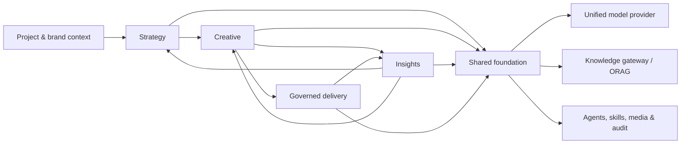

# cookies

> **An AI advertising workspace—from one brief to sustained growth.**

[简体中文](./README.zh-CN.md) · [Product documentation](./docs/README.md) · [Contributing](./CONTRIBUTING.md) · [Support](./SUPPORT.md)

`cookies` is an open-source product foundation for advertising teams. It connects strategy, creative production, asset intelligence, and governed delivery in one traceable workflow—while keeping people in control of consequential actions.

> **Project status:** pre-release. This repository currently contains the product, design, and architecture foundation; the application implementation and public demo are not yet available. The screenshots below are concept explorations, not shipped UI.


## Why cookies

Advertising work is usually fragmented across briefs, creative tools, performance reports, and platform consoles. cookies is designed to make the chain explicit: a confirmed brief informs strategy; strategy informs creative; performance feeds asset intelligence; high-impact delivery changes remain reviewable, approved, and auditable.

## Core capabilities

| System | What it does |
| --- | --- |
| **Strategy** | Turns a conversation into a structured brief, evidence-backed research, and an executable strategy. |
| **Creative** | Produces reviewable graphic and video creative packages with versions, sources, and delivery context. |
| **Insights** | Connects creative features with performance data to produce traceable, reusable learnings. |
| **Delivery** | Plans and operates advertising delivery through controlled execution, approvals, rollback, and evidence. |

Shared platform capabilities include organization and project context, a unified model-provider gateway, knowledge retrieval via [ORAG](https://github.com/shikanon/orag), agent/skill execution, media handling, auditability, and security controls.

## Product concepts

| Strategy | Creative |
| --- | --- |
|  |  |
| Insights | Governed delivery |
|  |  |

See the complete [concept gallery](./docs/18-module-concept-gallery.md) and [design system](./DESIGN.md).

## Architecture



The four systems own their domain models and release independently. They share project context and exchange versioned artifacts through stable APIs and domain events; they do not share business tables or state machines. Read the [project overview](./docs/00-project-overview.md) and [shared foundation specification](./docs/05-shared-foundation.md) for the full design.

## Quick start

The application is not implemented in this repository yet. Until the first runnable release, the useful starting point is the specification and its pinned knowledge-base dependency:

```bash
git clone --recurse-submodules https://github.com/shikanon/cookies.git
cd cookies
```

If you already cloned the repository:

```bash
git submodule update --init --recursive
```

Then begin with the [documentation index](./docs/README.md), the [M0 decisions and engineering gates](./docs/16-document-gap-closure.md), and the [ORAG integration guide](./docs/06-orag-integration.md). A runnable quick start will replace this section when the first application release is published.

## Documentation

- [Project overview](./docs/00-project-overview.md)
- [Four-system navigation and information architecture](./docs/19-module-navigation-architecture.md)
- [API and domain-event contracts](./docs/13-api-event-contracts.md)
- [Engineering, operations, and security baseline](./docs/14-engineering-operations-security.md)
- [Product principles](./PRODUCT.md) and [design system](./DESIGN.md)

## Community

Please read the [Code of Conduct](./CODE_OF_CONDUCT.md), [contribution guide](./CONTRIBUTING.md), [support guide](./SUPPORT.md), and [governance model](./GOVERNANCE.md) before participating. We welcome well-scoped issues, reproducible bug reports, documentation improvements, and thoughtful design discussion.

## License and third-party notices

The cookies source and documentation are released under the [MIT License](./LICENSE). The `third_party/orag` Git submodule is an independently versioned MIT-licensed project; it retains its own license and notices. Product-concept images in this repository are part of the project documentation and are covered by the repository license unless a file says otherwise.

Using third-party model providers, advertising platforms, data sources, fonts, music, stock media, or customer assets may create separate contractual, privacy, and intellectual-property obligations. Those services and assets are **not** granted by this repository's MIT license. See [third-party and licensing notes](./docs/third-party-notices.md) before distributing a deployment or generated material.
