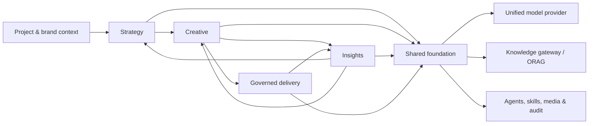

# cookies

> **An AI advertising workspace—from one brief to sustained growth.**

[简体中文](./README.zh-CN.md) · [Product documentation](./docs/README.md) · [Contributing](./CONTRIBUTING.md) · [Support](./SUPPORT.md)

`cookies` is an open-source product foundation for advertising teams. It connects strategy, creative production, asset intelligence, and governed delivery in one traceable workflow—while keeping people in control of consequential actions.

> **Project status:** local MVP available. The repository includes a runnable, investor-demo workflow; it is not a production advertising-delivery platform.

## Why cookies

Advertising work is usually fragmented across briefs, creative tools, performance reports, and platform consoles. cookies is designed to make the chain explicit: a confirmed brief informs strategy; strategy informs creative; performance feeds asset intelligence; high-impact delivery changes remain reviewable, approved, and auditable.

## Core capabilities

| System | What it does |
| --- | --- |
| **Strategy** | Turns a conversation into a structured brief, evidence-backed research, and an executable strategy. |
| **Creative** | Produces reviewable graphic and video creative packages with versions, sources, and delivery context. |
| **Insights** | Connects creative features with performance data to produce traceable, reusable learnings. |
| **Delivery** | Plans and operates advertising delivery through controlled execution, approvals, rollback, and evidence. |

Shared platform capabilities include organization and project context, a unified model-provider gateway, knowledge retrieval via [ORAG](https://github.com/shikanon/orag), agent/skill execution, media handling, auditability, and security controls.

## Architecture



The four systems own their domain models and release independently. They share project context and exchange versioned artifacts through stable APIs and domain events; they do not share business tables or state machines. Read the [project overview](./docs/00-project-overview.md) and [shared foundation specification](./docs/05-shared-foundation.md) for the full design.

## Local MVP

The local MVP persists one demo project and demonstrates this controlled path:

1. Open the seeded investor-demo project.
2. Review the confirmed Brief and strategy context.
3. Review the AI-labelled creative asset and generation boundary.
4. Run delivery preflight, approve with the demo role, and execute a local simulation.
5. Review server-persisted audit evidence and optionally roll back the simulation.

All delivery operations are **local simulations**. This MVP never connects to or writes to a real advertising platform.

## Quick start

Prerequisites: Node.js 20 or later and npm. Clone the repository, then install dependencies:

```bash
git clone --recurse-submodules https://github.com/shikanon/cookies.git
cd cookies
npm install
cp .env.example .env
```

Start the API in one terminal:

```bash
set -a
source .env
set +a
npm run server
```

Start the Vite frontend in a second terminal, then open the printed `http://127.0.0.1:5173` URL:

```bash
npm run dev
```

The server stores local demo state in ignored `data/mvp-store.json`. To reset the demo, stop the server and remove that file; the next `npm run server` recreates the seeded project.

## Ark configuration

Copy `.env.example` to `.env`, set the value locally, then load it in the shell that starts `npm run server`:

```bash
# Set ARK_API_KEY in .env locally, then:
set -a && source .env && set +a
npm run server
```

`ARK_API_KEY` is optional for browsing the seeded walkthrough, reviewing preflight, approving the demo ChangeSet, and reading audit events. When it is absent, the app exposes a clear server-derived `not_configured` status and disables new AI generation; it never asks for, stores, masks, or returns a browser API key. Do not commit `.env` or real credentials.

The server maps text, image, video, and embedding capability to the documented Ark model catalog in `server/ark-provider.ts`. `ARK_BASE_URL` is optional and defaults to the Ark HTTPS endpoint.

## Verification

Run the local quality gates before changing the MVP:

```bash
npm run check:server
npm run test:server
npm run build
```

## Documentation

- [Project overview](./docs/00-project-overview.md)
- [Four-system navigation and information architecture](./docs/19-module-navigation-architecture.md)
- [API and domain-event contracts](./docs/13-api-event-contracts.md)
- [Engineering, operations, and security baseline](./docs/14-engineering-operations-security.md)
- [Product principles](./PRODUCT.md) and [design system](./DESIGN.md)

## Community

Please read the [Code of Conduct](./CODE_OF_CONDUCT.md), [contribution guide](./CONTRIBUTING.md), [support guide](./SUPPORT.md), and [governance model](./GOVERNANCE.md) before participating. We welcome well-scoped issues, reproducible bug reports, documentation improvements, and thoughtful design discussion.

## License and third-party notices

The cookies source and documentation are released under the [MIT License](./LICENSE). The `third_party/orag` Git submodule is an independently versioned MIT-licensed project; it retains its own license and notices. Product-concept images in this repository are part of the project documentation and are covered by the repository license unless a file says otherwise.

Using third-party model providers, advertising platforms, data sources, fonts, music, stock media, or customer assets may create separate contractual, privacy, and intellectual-property obligations. Those services and assets are **not** granted by this repository's MIT license. See [third-party and licensing notes](./docs/third-party-notices.md) before distributing a deployment or generated material.
