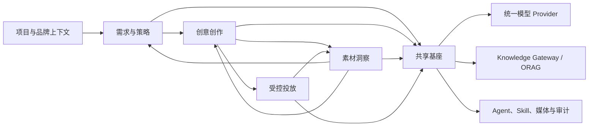

# cookies

> **从一句需求，到持续增长。**

[English](./README.md) · [产品文档](./docs/README.md) · [参与贡献](./CONTRIBUTING.md) · [获得支持](./SUPPORT.md)

`cookies` 是面向广告团队的开源产品底座。它将需求与策略、创意创作、素材洞察和受控投放连接为可追溯的工作闭环，并确保人在所有重要决策中保持掌控。

> **项目状态：本地 MVP 可运行。** 仓库包含可复演的投资人路演主路径，但不是生产级广告投放平台。

## 核心能力

| 系统 | 解决的问题 |
| --- | --- |
| **需求与策略** | 将对话沉淀为结构化 Brief、带证据的研究与可执行策略。 |
| **创意创作** | 生产可评审的图文和视频创意交付包，保留版本、来源与上下文。 |
| **素材洞察** | 连接素材特征与效果数据，形成可追溯、可复用的经验。 |
| **智能投放** | 通过受控执行、审批、回滚与证据记录管理广告投放。 |

平台还提供组织与广告项目上下文、统一模型 Provider、基于 [ORAG](https://github.com/shikanon/orag) 的知识检索、Agent/Skill 执行、媒体管理、审计与安全能力。

## 架构



四个业务系统分别拥有领域模型和发布节奏，通过 Project 上下文、稳定 API 与领域事件传递版本化产物，不共享业务表或状态机。详见[项目总纲](./docs/00-project-overview.md)与[共享基座规格](./docs/05-shared-foundation.md)。

## 本地 MVP

本地 MVP 会持久化一个预置路演项目，可按以下路径演示：

1. 打开预置的投资人路演项目。
2. 查看已确认的 Brief 和策略上下文。
3. 查看带 AI 标识的创意产物及其生成边界。
4. 运行投放预检，以演示角色审批并执行本地模拟。
5. 查看服务端保存的审计证据，并可模拟回滚。

所有投放动作都是**本地模拟**。MVP 不会连接或写入任何真实广告平台。

## 快速开始

前置条件：Node.js 20 或更高版本、npm、Go 和 Docker。克隆后安装依赖并写入 Go 演示 seed：

```bash
git clone --recurse-submodules https://github.com/shikanon/cookies.git
cd cookies
cp .env.example .env
npm ci
docker compose up -d --wait mysql
npm run go:seed
```

在第一个终端启动 Go `cookies-api`：

```bash
go run ./cmd/cookies-api
```

在第二个终端启动 Vite 前端，然后打开命令输出的 `http://127.0.0.1:5173`：

```bash
npm run dev
```

前端默认通过根 Vite `/platform` 和 `/api` 代理连接 `http://127.0.0.1:8080` 上的 Go `cookies-api`，项目主链路使用 Go `/platform/v1`。仅在需要指向其他 API 主机时设置 `VITE_API_BASE_URL`。

在 macOS 上，可用 `./scripts/dev.sh` 一键启动完整本地链路：启动 MySQL、执行迁移、写入 canonical Go 投资人演示 seed，再启动 Go API 和 Vite 前端。只准备数据库和 seed 时运行 `./scripts/dev.sh --prepare-only`。

TypeScript MVP server（`npm run server`）仅保留为兼容/demo-only 路径。它使用已忽略的 `data/mvp-store.json`，当等价 Go `/platform/v1` 端点可用后，不再作为生产化主链路权威数据源。如需让前端连接该兼容层，需启动 `npm run server` 并显式设置 `VITE_API_BASE_URL=http://127.0.0.1:8787`。

## 方舟配置

将 `.env.example` 复制为 `.env` 后，在本地填写变量，并在启动 Go API 的终端加载它：

```bash
# 在 .env 本地填写 ARK_API_KEY 后执行：
set -a && source .env && set +a
go run ./cmd/cookies-api
```

浏览预置项目、运行预检、审批演示 ChangeSet 和查看审计记录时，`ARK_API_KEY` 不是必需项。未配置时，应用会展示由服务端提供的 `not_configured` 状态，并禁用新的 AI 生成；浏览器不会要求输入、保存、掩码展示或接收 API Key。不要提交 `.env` 或任何真实凭据。

TS MVP 兼容服务在 `server/ark-provider.ts` 中将文本、图片、视频与向量能力映射到指定方舟模型目录。`ARK_BASE_URL` 可选，未设置时使用默认方舟 HTTPS 地址。

## 验证

修改 MVP 后运行以下本地质量门禁：

```bash
npm run check:server
npm run test:server
npm run build
```

## 参与社区

参与前请阅读[行为准则](./CODE_OF_CONDUCT.md)、[贡献指南](./CONTRIBUTING.md)、[支持指南](./SUPPORT.md)和[治理机制](./GOVERNANCE.md)。欢迎提交边界明确的问题、可复现的缺陷报告、文档改进与设计讨论。

## 许可证与第三方说明

cookies 的源码和文档采用 [MIT License](./LICENSE)。`third_party/orag` 是独立版本化的 Git 子模块，同样采用 MIT License，并保留其原始许可证和声明。仓库中的产品概念图属于项目文档，除文件另有说明外，随仓库许可证发布。

第三方模型、广告平台、数据源、字体、音乐、图库素材及客户资产可能附带独立的合同、隐私或知识产权义务；MIT License 不授予这些服务或资产的任何权利。分发部署或生成内容前，请阅读[第三方与许可证说明](./docs/third-party-notices.md)。
