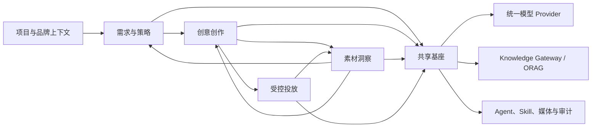

# cookies

> **从一句需求，到持续增长。**

[English](./README.md) · [产品文档](./docs/README.md) · [参与贡献](./CONTRIBUTING.md) · [获得支持](./SUPPORT.md)

`cookies` 是面向广告团队的开源产品底座。它将需求与策略、创意创作、素材洞察和受控投放连接为可追溯的工作闭环，并确保人在所有重要决策中保持掌控。

> **项目状态：预发布。** 当前仓库主要包含产品、设计和架构底座；应用代码和公开 Demo 尚未发布。下方图片是概念探索，不是已上线界面。


## 核心能力

| 系统 | 解决的问题 |
| --- | --- |
| **需求与策略** | 将对话沉淀为结构化 Brief、带证据的研究与可执行策略。 |
| **创意创作** | 生产可评审的图文和视频创意交付包，保留版本、来源与上下文。 |
| **素材洞察** | 连接素材特征与效果数据，形成可追溯、可复用的经验。 |
| **智能投放** | 通过受控执行、审批、回滚与证据记录管理广告投放。 |

平台还提供组织与广告项目上下文、统一模型 Provider、基于 [ORAG](https://github.com/shikanon/orag) 的知识检索、Agent/Skill 执行、媒体管理、审计与安全能力。

## 架构



四个业务系统分别拥有领域模型和发布节奏，通过 Project 上下文、稳定 API 与领域事件传递版本化产物，不共享业务表或状态机。详见[项目总纲](./docs/00-project-overview.md)与[共享基座规格](./docs/05-shared-foundation.md)。

## 快速开始

首个可运行版本尚未发布。目前可以克隆项目、初始化固定版本的知识库依赖，并从规格文档开始了解或参与项目：

```bash
git clone --recurse-submodules https://github.com/shikanon/cookies.git
cd cookies
```

已有本地副本时运行：

```bash
git submodule update --init --recursive
```

接着阅读[文档索引](./docs/README.md)、[M0 决策与研发门禁](./docs/16-document-gap-closure.md)及 [ORAG 集成说明](./docs/06-orag-integration.md)。应用发布后，本节会替换为一键运行说明。

## 参与社区

参与前请阅读[行为准则](./CODE_OF_CONDUCT.md)、[贡献指南](./CONTRIBUTING.md)、[支持指南](./SUPPORT.md)和[治理机制](./GOVERNANCE.md)。欢迎提交边界明确的问题、可复现的缺陷报告、文档改进与设计讨论。

## 许可证与第三方说明

cookies 的源码和文档采用 [MIT License](./LICENSE)。`third_party/orag` 是独立版本化的 Git 子模块，同样采用 MIT License，并保留其原始许可证和声明。仓库中的产品概念图属于项目文档，除文件另有说明外，随仓库许可证发布。

第三方模型、广告平台、数据源、字体、音乐、图库素材及客户资产可能附带独立的合同、隐私或知识产权义务；MIT License 不授予这些服务或资产的任何权利。分发部署或生成内容前，请阅读[第三方与许可证说明](./docs/third-party-notices.md)。
