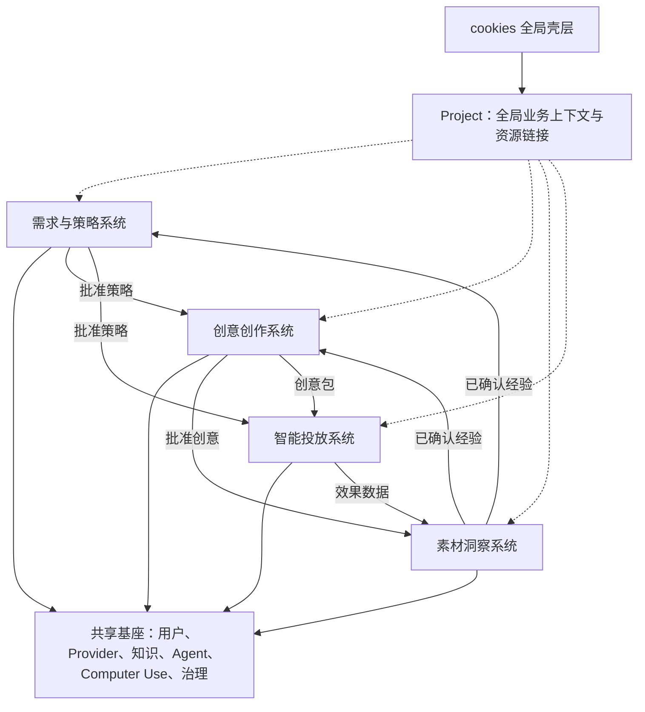

# cookies 项目总纲

| 属性 | 内容 |
| --- | --- |
| 项目名称 | cookies |
| 产品名称 | cookies |
| Slogan | **从一句需求，到持续增长。** |
| 文档版本 | v0.9 |
| 文档状态 | 草案 |
| 技术方向 | 四个独立垂直系统 + Golang/React 共享基座 + 火山引擎统一模型 Provider + ORAG RAG + Codex/Skills/Computer Use |

## 1. 产品定义

cookies 是面向品牌方、代理商和增长团队的 AI 广告助手。需求与策略、创意创作、素材洞察、智能投放分别作为完整垂直系统建设；它们拥有独立导航、领域模型、权限和发布节奏，由全局 Project 连接同一业务闭环，并共享 Provider、知识库、用户组织、Codex/Skills、Computer Use、任务与治理基座。

一句话定位：**以结构化业务目标为起点、以真实投放结果为反馈的 AI 广告工作台。**

## 2. 愿景、使命与目标

### 2.1 愿景

成为 AI 时代广告团队的默认工作入口，让专业广告能力对每个企业都可获得、可理解、可执行。

### 2.2 使命

把分散在沟通、内容生产、素材数据和广告平台中的工作连接起来。Codex 负责理解、规划和调用能力，Skills 负责沉淀广告专业方法，Computer Use 负责受控执行，人负责目标、品牌、合规、预算和最终决策。

### 2.3 产品目标

1. 通过对话让用户表达需求，由 Codex 按需调用 Skills 完成澄清、分析和策略交付。
2. 围绕明确渠道生产两类创意：小红书/公众号图文，以及抖音/快手视频。
3. 针对电影感品牌广告和效果广告建立不同的视频创作方法、评审标准和分析指标；效果广告首期覆盖数字人、广告前贴和爆款视频复刻，并提供独立素材剪辑完成通用后期成片。
4. 从素材内容、投放数据和实验结果中提炼可复用经验，反向指导下一轮创作。
5. 通过 Codex + Computer Use 在人工审批下完成广告平台配置、上线、监控和优化。
6. 以 Project 统一连接需求、策略、创意、素材洞察和投放对象，让跨系统进度、版本血缘与责任可追溯。

### 2.4 非目标

- 不在 MVP 阶段替代品牌负责人、创意总监或投手的最终判断。
- 不承诺由模型单独决定预算、自动上线或无限制扩量。
- 不在首期自建通用大模型；LLM、VLM、图片、视频、音频和 3D 统一通过 Provider Gateway 接入，默认使用火山引擎。
- 不在首期覆盖所有内容平台、广告平台、广告形态和完整财务结算。
- 不把素材模块建设成通用企业网盘或重型数字资产管理系统。
- 不让 Computer Use 绕过登录、验证码、平台审核、系统权限或人工审批。
- 不把高预测分等同于真实投放效果；最终以实验和归因数据为准。

## 3. 目标用户与价值

| 用户角色 | 主要问题 | 核心价值 |
| --- | --- | --- |
| 市场/品牌负责人 | 需求难传达、品牌一致性弱、过程不可见 | 快速形成标准 Brief，控制品牌与合规 |
| 广告策略人员 | 信息收集耗时、研究分散、方案复用难 | AI 辅助洞察、生成策略并沉淀方法论 |
| 创意/设计人员 | 改稿频繁、不同内容形态混用、生成镜头和存量素材割裂、缺少效果反馈 | 按图文、品牌广告和效果广告功能生产，通过独立素材剪辑完成成片并引用素材经验 |
| 广告投手/优化师 | 平台界面配置重复、监控压力大、复盘滞后 | Codex 规划、Computer Use 执行并保留证据 |
| 中小企业经营者 | 缺少专业团队，不知道如何开始 | 用对话完成从需求到投放的引导式流程 |
| 管理者 | 成本、进度、效果和责任边界不透明 | 统一看板、审批、审计与投入产出分析 |

## 4. 核心业务闭环

1. **建立项目**：录入品牌、产品、行业、目标市场和知识资料。
2. **对话澄清**：用户与 Codex 对话，Codex 根据意图调用需求采集、品牌知识、洞察、策略和合规 Skills。
3. **确认 Brief**：系统评估完整度，用户确认后冻结一个可追溯版本。
4. **生成策略**：输出受众洞察、核心卖点、渠道组合、创意方向、实验设计和指标建议。
5. **创作图文**：为小红书和公众号生成标题、正文、封面、配图方案和发布包。
6. **创作与剪辑视频**：为抖音和快手生成电影感品牌故事，或通过数字人、广告前贴、爆款视频复刻制作效果广告；使用素材剪辑统一处理生成镜头、存量素材、字幕和音频。
7. **分析素材**：融合内容特征与投放数据，归纳有效模式、失效原因、疲劳趋势和适用场景。
8. **规划投放**：Codex 将批准策略转成可执行步骤，调用平台 Skill 校验账户、预算、受众、素材和追踪。
9. **受控执行**：Computer Use 操作已授权平台界面，在最终提交或敏感动作前暂停并请求人工确认。
10. **监控复盘**：回收投放结果，形成异常、优化建议和素材经验，反馈给策略与创作。

## 5. 产品范围

### 5.1 四大模块

| 模块 | 输入 | 核心能力 | 输出 |
| --- | --- | --- | --- |
| 需求收集及策略分析 | 用户对话、品牌资料、历史经验 | Codex 对话编排、Skills 调用、动态追问、研究与策略生成 | 已确认 Brief、策略方案、Skill 执行记录 |
| 广告创意创作 | Brief、策略、品牌规范、素材经验、授权媒体 | 小红书/公众号图文；抖音/快手品牌广告、效果广告与独立素材剪辑 | 图文发布包、品牌故事包、效果广告包、剪辑成片、实验变体 |
| 广告素材经验与数据分析 | 创意内容、投放明细、实验与人工评价 | 内容理解、维度拆解、对比分析、疲劳分析、经验归纳 | 素材洞察卡、经验库、创作建议、复盘报告 |
| 广告智能投放 | 已批准计划、创意包、已登录平台会话 | Codex 规划、平台 Skills、Computer Use 操作、人工审批、结果验证 | 平台侧投放、证据记录、告警、优化动作 |

### 5.2 共享基座

共享基座只提供业务无关能力，详细规格见 [cookies 共享基座规格](./05-shared-foundation.md)。

| 基座能力 | 内容 |
| --- | --- |
| 用户与组织 | 登录、租户、成员、团队、全局角色和项目上下文 |
| 项目、品牌与产品 | Project、BrandProfile、ProductProfile、规范版本、资源关系索引和跨系统上下文 |
| Provider 中心 | 统一提供 LLM、VLM、图片、视频、音频、3D 及 RAG 内部模型能力；默认火山引擎，管理凭据、模型目录、路由、任务、配额和成本 |
| 知识库 | 通过 ORAG 实现组织、品牌、项目、规则和经验知识的摄取、混合检索、引用、评测与优化 |
| Agent 能力 | Codex Task、Skill Registry、Tool/MCP Registry、评测和运行事件 |
| Computer Use | 执行环境、允许应用/站点、截图、接管和安全策略 |
| 工作流与治理 | 异步任务、审批、通知、审计、Webhook、计量和数据策略 |

### 5.3 系统边界原则

1. 每个系统独立拥有导航、路由、领域模型、数据库 Schema、API、权限和指标。
2. 共享基座不保存 Brief、创意、素材洞察或投放计划等业务实体。
3. 系统之间不能直接写对方数据库；通过契约 API 和版本化领域事件协作。
4. 下游引用上游产物时保存来源系统、来源 ID、版本和必要快照。
5. 一个系统的失败或发布不应阻塞其他系统的基础读写与独立迭代。
6. Project 是四系统共同的全局上下文根；四系统主实体必须携带 `project_id`，Project 只聚合链接和摘要，不接管模块业务状态。

### 5.4 系统关系

图中的业务箭头代表 API/领域事件，不代表数据库依赖；Project 虚线只表示共同上下文和只读资源索引，不表示拥有模块业务对象。

### 5.5 关键领域事件

| 事件 | 发布系统 | 消费系统 |
| --- | --- | --- |
| `strategy.approved.v1` | 需求与策略 | 创意、智能投放 |
| `creative.approved.v1` | 创意创作 | 素材洞察、智能投放 |
| `insight.confirmed.v1` | 素材洞察 | 需求与策略、创意创作 |
| `delivery.executed.v1` | 智能投放 | 素材洞察、需求与策略 |
| `delivery.metrics.updated.v1` | 智能投放 | 素材洞察 |
| `strategy.superseded.v1` | 需求与策略 | 创意、智能投放 |
| `creative.delivered.v1`、`creative.deactivated.v1` | 创意创作 | 素材洞察、智能投放 |
| `insight.challenged.v1`、`experience.invalidated.v1` | 素材洞察 | 需求与策略、创意创作 |
| `delivery.status.changed.v1` | 智能投放 | 素材洞察、需求与策略 |

## 6. 成功指标

### 6.1 北极星指标

**月度成功广告闭环数**：当月完成“Brief 已确认 → 至少一个创意上线 → 效果数据成功回流”的广告任务数。

该指标同时约束产品不能只生成内容，还要帮助用户完成真实业务并获得反馈。

### 6.2 MVP 目标值

目标值在试点客户基线完成后校准，首版建议如下：

| 维度 | 指标 | MVP 建议目标 |
| --- | --- | --- |
| 激活 | 新项目首次完成 Brief 确认率 | ≥ 60% |
| 效率 | 从创建需求到确认 Brief 的中位时长 | ≤ 15 分钟 |
| 效率 | 从确认 Brief 到产出首批可评审创意 | ≤ 30 分钟 |
| 质量 | AI 生成策略经轻度修改即可采纳的比例 | ≥ 50% |
| 质量 | 创意首轮评审通过或仅需轻改的比例 | ≥ 40% |
| 洞察 | 素材分析结论经人工确认或采纳的比例 | ≥ 60% |
| 投放 | 上线前校验拦截的严重配置错误率 | 100% |
| 执行 | Computer Use 关键步骤结果可验证率 | 100% |
| 稳定性 | 核心 API 月可用性 | ≥ 99.9% |
| 安全 | 未经授权的真实预算或上线操作 | 0 次 |

### 6.3 业务结果指标

- 首批创意交付周期降低比例。
- 单个有效创意的人力与模型综合成本。
- 素材经验复用率、分析覆盖率和由洞察驱动的新创意占比。
- 建议采纳率，以及采纳建议后的 CPA、CVR、ROAS 等相对变化。
- 7 日/30 日活跃项目留存率与付费组织续费率。

## 7. 产品原则

1. **目标先于生成**：任何内容生成都必须绑定业务目标、受众和约束。
2. **事实与建议分离**：来源事实、系统推断和生成建议要在界面中清楚区分。
3. **人机共决**：AI 给出选项、依据和置信度，人对品牌、合规、预算和上线负责。
4. **全链路可追溯**：任何策略、创意和投放动作都能追溯输入、版本、操作者及结果。
5. **以实验而非预测定输赢**：模型评分用于筛选和解释，不替代真实 A/B 测试。
6. **Skill 承载专业能力**：将渠道规则、分析方法和操作流程写进可版本化 Skills，而非散落在提示词中。
7. **界面执行可观察**：Computer Use 每一步都有目标、页面状态和结果证据，允许用户暂停或接管。
8. **默认安全**：最小权限、敏感信息隔离、预算护栏、关键点击确认、审计日志和可回滚优先。
9. **共享基座不侵入业务**：公共平台只提供能力与治理，四个系统各自拥有业务语义和演进空间。

## 8. 角色与权限

| 角色 | 默认权限 |
| --- | --- |
| 组织管理员 | 组织设置、成员、Skills、Computer Use 允许范围、模型与数据策略 |
| 项目负责人 | 创建项目、确认 Brief/策略、分配任务、发起投放审批 |
| 策略人员 | 编辑 Brief 和策略，查看项目效果，不能直接上线投放 |
| 创意人员 | 创建与编辑图文/视频创意、确认素材特征、提交评审 |
| 投放人员 | 配置计划、提交/执行已批准投放、暂停异常计划 |
| 审批人 | 审批预算、上线、扩量和重大优化动作 |
| 只读成员 | 查看被授权的项目、报告和审计记录 |

权限采用组织、项目、资源三级作用域。cookies 不保存用户广告账户密码或验证码，Computer Use 使用用户已登录且允许访问的会话；如接入只读数据连接器，其令牌由服务端加密保存。上线、调预算和删除动作需独立权限。

## 9. 信息架构

### 9.1 全局壳层

全局壳层仅提供 cookies 标识、组织/Project 切换、四系统切换器、全局 Agent 任务、审批、通知和个人菜单。Project 切换器可进入 `/projects/:project_id/overview`，通过关键产物、待办、风险和深链连接四系统；它不承载任何业务系统的二级菜单。

### 9.2 系统入口

| 系统 | 路由前缀 | 独立导航摘要 |
| --- | --- | --- |
| 需求与策略 | `/strategy/*` | 工作台、策略工作区、需求中心、策略中心、研究洞察、评审、能力运营 |
| 创意创作 | `/creative/*` | 工作台、图文创作、视频创作、创意任务、评审、交付、创意运营 |
| 素材洞察 | `/insights/*` | 工作台、数据接入、分析素材库、内容/效果分析、实验、经验库、报告 |
| 智能投放 | `/delivery/*` | 作战台、账户环境、投放计划、执行中心、监控告警、优化、证据审计 |
| 共享管理台 | `/admin/*` | 用户组织、Provider、知识库、Agent、Computer Use、工作流、安全、用量 |

每个系统的完整页面职责在对应 PRD 中维护；统一导航层级、完整导航树、路由与交互规则见 [四大模块导航与信息架构](./19-module-navigation-architecture.md)；子板块的必要性、价值、优先级与展示形式见 [四大模块子板块分析](./20-module-submodule-analysis.md)。

## 10. 领域数据归属

| 所有者 | 独占业务实体 | 允许引用但不拥有的数据 |
| --- | --- | --- |
| 需求与策略 | Conversation、Brief、Strategy、ResearchArtifact | 品牌知识、素材经验、Provider 与 SkillRun |
| 创意创作 | CreativeTask、Direction、CreativeVersion、CreativePackage | 策略快照、品牌知识、素材经验引用 |
| 素材洞察 | AssetFeature、AnalysisMetricSnapshot、AnalysisRun、Insight、Experience | 创意快照、投放指标来源 |
| 智能投放 | DeliveryPlan、ChangeSet、PlatformEntity、DeliveryMetricSnapshot、DeliveryEvidence | 策略与创意快照、共享 ComputerUseRun |
| 共享基座 | User、Organization、Project、ProjectMembership、ProjectResourceIndex、BrandProfile、ProductProfile、ProviderConfig、KnowledgeDocument、AgentTask、SkillDefinition、AuditLog | 不拥有四个系统的业务实体 |

所有主实体使用全局唯一 ID、`organization_id`；四系统业务主实体还必须包含非空 `project_id`。版本实体不可变；跨系统引用包含 `source_system`、`source_project_id`、`source_id` 和 `source_version`，避免上游修改历史事实。

## 11. 技术方案

### 11.1 总体架构

MVP 可采用模块化单体部署，但逻辑上是**四个垂直系统 + 一个共享基座**。业务包、数据库 Schema、迁移、API、事件和前端路由从第一天隔离，未来可按系统独立部署。

### 11.2 后端（Golang）

- HTTP API：REST/JSON 为主；长耗时生成任务使用异步 Job，并通过 SSE 或 WebSocket 推送进度。
- 共享平台包：身份、Provider、知识、Agent、Computer Use、任务、审批、通知和审计。
- 垂直系统包：`strategy`、`creative`、`insights`、`delivery`，各自维护领域逻辑和仓储。
- Agent 控制层：创建 Codex Task、组装最小上下文、选择允许的 Skills/工具、接收事件流、持久化产物和恢复任务。
- Skill 注册层：管理 Skill 版本、触发说明、Schema、依赖、发布状态和评测；需求、渠道创意、素材分析和平台投放均以 Skill 扩展。
- Computer Use 协调层：管理目标应用/站点白名单、人工接管、关键动作确认、截图/页面证据和运行超时。
- 数据层：PostgreSQL 保存业务和运行数据；对象存储保存素材与截图；Redis/消息队列处理事件、并发和长任务。
- Provider Gateway：cookies 自有业务、Codex Skills、ORAG 和后台任务的模型调用统一由此进入；默认火山引擎，处理 LLM、VLM、图片、视频、音频、3D、Embedding/Rerank 的路由、长任务、成本、内容安全和评测。
- 知识网关：对四个系统暴露 `/platform/v1/knowledge/*`，内部调用 `third_party/orag` 构建的 ORAG API；cookies 不访问 ORAG 内部包、PostgreSQL 或 Qdrant。

### 11.3 前端（React + TypeScript）

- `shell` 只负责登录后壳层与系统切换；四个系统各自维护 `routes`、`navigation`、页面、状态和 API Client。
- `design-system` 只共享无业务语义组件，不共享 Brief 编辑器、视频工作台或投放确认卡等业务组件。
- 服务端数据状态与本地编辑状态分离；关键表单支持自动保存、草稿恢复和版本对比。
- 长任务展示排队、运行、部分完成、失败和重试状态，不用阻塞式等待。
- 统一设计系统，覆盖表单、表格、素材网格、对话、版本差异、审批与数据图表。

### 11.4 API 与工程约定

- 业务 API 使用 `/api/{system}/v1`，共享基座使用 `/platform/v1`，返回稳定错误码和可展示的错误信息。
- 创建类接口和 Agent Task 支持幂等键；Skill/Computer Use 事件按运行 ID 去重。
- API、SSE、幂等、并发和领域事件统一遵循 [API 与领域事件契约](./13-api-event-contracts.md)。
- 禁止跨系统直接写数据库；同步消费者使用版本化事件并保证幂等。
- 列表使用游标分页；大文件使用分片上传和服务端校验。
- Computer Use 步骤不能仅凭“点击已发生”判定成功，必须读取页面结果或让用户确认。
- 所有数据库变更使用迁移脚本；公共接口和事件需契约测试。
- 关键模块提供单元测试、集成测试和端到端核心路径测试。

### 11.5 ORAG 知识库实现

- ORAG 源码通过 Git submodule 固定在 `third_party/orag`，跟踪远端 `main`，构建使用 cookies gitlink 固定提交。
- 生产首选将 ORAG 作为独立内部 HTTP/OpenAPI 服务部署，cookies Knowledge Gateway 负责身份终止、租户映射、权限与错误转换。
- cookies Organization/ProjectContext/KnowledgeSpace 分别映射 ORAG tenant/project/knowledge base。
- ORAG 独立使用 PostgreSQL 与 Qdrant，负责摄取、混合检索、RAG 查询、citation、trace、评测和优化。
- cookies Provider Gateway 是模型调用与厂商凭据的唯一目标入口；ORAG 通过 `CookiesProviderAdapter` 或等价网关适配调用 LLM/VLM、Embedding 和 Rerank，不在目标架构中持有火山厂商长期密钥。
- 详细接口、部署、升级和测试见 [ORAG 知识库集成说明](./06-orag-integration.md)。

### 11.6 统一模型 Provider

- 默认 Provider 为火山引擎，Golang 优先使用官方 [`arkruntime`](https://github.com/volcengine/volcengine-go-sdk/tree/master/service/arkruntime) SDK，并通过 Go Modules 固定验证版本。
- 业务系统使用 `text.generate`、`vision.understand`、`image.*`、`video.generate`、`audio.*`、`three_d.generate` 等稳定能力编码，不硬编码厂商模型 ID。
- LLM/VLM 使用同步或流式调用；图片、视频、音频和 3D 使用统一异步 Job、状态查询、取消、补偿与资产落盘。
- 音频或其他不由 `arkruntime` 同一包直接提供的能力使用火山引擎专用 Adapter，但上层仍只看到 `volcengine` Provider。
- 详细分层、API、路由、管理台与验收见 [统一模型 Provider 规格](./07-unified-model-provider.md)。

### 11.7 其他共享技术规格

- 项目、品牌、产品和跨系统上下文见 [项目、品牌与产品域](./08-project-brand-domain.md)。
- Codex Worker、Agent Task、Skill 包、隔离与恢复见 [Codex 与 Skills 运行时](./09-codex-skills-runtime.md)。
- 平台授权、指标同步、归因与数据对账见 [广告数据 Connector](./10-ad-data-connectors.md)。
- 上传、转码、生成资产和权利生命周期见 [媒体资产平台](./11-media-asset-platform.md)。
- 投放设备、浏览器会话、接管和证据见 [Computer Use 运行时](./12-computer-use-runtime.md)。
- 环境、CI/CD、SLO、灾备和安全基线见 [工程、运维与安全基线](./14-engineering-operations-security.md)。

## 12. Codex、Skills 与 AI 治理

### 12.1 AI 输入

- 用户显式输入和上传资料。
- 经授权的品牌知识、历史策略、创意与投放数据。
- 可验证的外部研究结果，并保存来源、时间和适用范围。

### 12.2 Codex 与 Skill 边界

- Codex 理解对话、拆解任务、选择 Skill、组织工具调用和合并产物，不直接承载长期业务事实。
- Skill 是可复用工作流，包含清晰触发范围、输入输出、规则、参考和可选脚本；发布前必须通过评测。
- 会话事实、Brief、策略、素材洞察和审批状态由 cookies 后端持久化，重新运行时按权限组装最小上下文。
- Skill 调用对用户可见，重要产物必须经过 Schema 校验并写入版本记录。

### 12.3 AI 输出要求

- 结构化结果必须通过 Schema 校验；失败时可重试或降级为草稿。
- 对结论标注来源、假设、置信度和缺失信息。
- 不伪造市场数据、平台能力、法规或竞品事实。
- 生成内容经过品牌规则、平台规则和安全策略检查。
- 支持用户反馈“采纳、修改、拒绝及原因”，用于离线评测和提示词优化。

### 12.4 评测体系

- 固定评测集：Brief 抽取完整度、策略可执行性、品牌一致性、文案事实性、合规召回率。
- 在线指标：生成成功率、延迟、成本、采纳率、修改距离、用户举报率。
- 模型或提示词升级先灰度，保留旧版本回滚能力。
- 客户数据默认不用于训练公共模型；具体策略在隐私条款和合同中明确。

## 13. 安全、合规与风控

- 组织数据逻辑隔离；高要求客户预留独立加密密钥或专属部署能力。
- 传输加密、静态加密、密钥托管、凭据轮换和最小权限访问。
- 对个人信息、客户名单和广告账户数据进行分级、脱敏和访问审计。
- 素材记录版权来源、授权范围、有效期、地域和人物肖像授权。
- 支持行业敏感词、禁投品类、平台政策和地区法规规则包。
- 真实上线、调预算、扩量、暂停和删除保留审批策略、额度护栏和完整日志。
- Computer Use 只可访问用户/管理员允许的应用和站点；登录、验证码、支付、权限、账户和预算操作必须保持人工在环。
- 页面、弹窗、素材和外部消息都视作不可信输入，不能覆盖系统约束或诱导访问额外应用。
- 运行截图可能包含账户与客户数据，需加密、限制访问并按较短周期留存。
- 支持数据导出、删除、留存周期和离职成员权限回收。

## 14. 路线图

### M0：基础与验证

- 用户访谈、试点行业选择、首发广告平台与归因口径确认。
- 建立全局壳层、四个系统导航骨架和共享基座；完成用户组织、Provider、知识、Codex Task、Skill 注册、Computer Use 与审计。
- 用人工服务 + 原型验证完整闭环和字段模型。

### M1：MVP 闭环

- Codex + Skills 对话生成 Brief 和策略并确认版本。
- 交付小红书/公众号图文，以及抖音/快手品牌广告与效果广告创意包。
- 分析创意内容与投放数据，生成素材洞察和经验卡。
- 通过一个首发平台 Skill + Computer Use 完成草稿、校验、审批、上线和结果验证。
- 建立核心埋点、质量评测和错误监控。

### M2：效率与效果增强

- 强化视频成片、批量变体和渠道适配能力。
- 增加第二个平台 Skill，完善抖音/快手差异化操作与跨平台指标归一化。
- 增加素材疲劳、相似模式、因子对比和经验推荐。
- 自动异常诊断、实验分析和半自动优化。

### M3：规模化

- 企业工作流、细粒度权限、私有知识和专属部署。
- 跨客户模板、行业策略包、开放 API 与生态集成。
- 在明确额度、条件和回滚策略下开放有限自动优化。

## 15. 发布门槛

MVP 上线前必须满足：

1. 端到端闭环通过：对话收集需求、确认策略、生成创意、形成素材洞察、计划上线、数据回流。
2. 严重合规项和无授权素材可被阻止进入上线流程。
3. 任何真实花费动作都必须由有权限的用户明确确认。
4. Computer Use 在提交前展示目标、预算、对象和页面状态；重复运行不会重复创建未知对象。
5. 核心操作具备审计日志，账户凭据不出现在前端、日志或错误信息中。
6. Codex、Skill、Computer Use 或平台页面失败均有可理解的状态、证据和恢复路径。
7. 完成至少一个试点行业、一个广告平台、三组真实任务的受控验收。
8. 四个系统均有独立导航、权限和数据 Schema；任一系统不能直接写入其他系统业务表。

## 16. 主要风险与应对

| 风险 | 应对 |
| --- | --- |
| 生成内容同质化或不符合品牌 | 强化品牌知识、提供多方向生成、人工评审和反馈闭环 |
| 策略出现无来源结论 | 区分事实与假设，要求来源，缺失时明确提示而非补造 |
| 平台界面变化导致 Skill 失效 | 页面状态识别、步骤级验证、录屏回放测试、快速停用和 Skill 版本回滚 |
| Computer Use 误操作造成预算损失 | 允许列表、预算上限、关键点击审批、截图证据、用户接管和紧急暂停 |
| 登录、验证码或会话过期阻塞执行 | 明确人工接管点，不绕过验证，支持恢复到最近已确认步骤 |
| 归因口径不一致 | 保存原始数据，统一指标字典，并允许按平台口径对账 |
| 素材版权或隐私风险 | 版权元数据、到期拦截、敏感识别、授权证明和审计 |
| 模型成本和延迟不可控 | 任务分级、模型路由、缓存、批处理、配额与成本看板 |
| 早期范围过大 | 只支持一个试点行业和一个主平台，先跑通闭环再扩展 |
| 共享基座演变成巨型业务服务 | 设置准入条件、数据所有权评审和跨系统契约测试 |
| 四套系统体验割裂 | 共享设计语言和全局壳层，但保留系统内导航与领域差异 |
| ORAG 升级造成知识 API 或质量回归 | 固定 gitlink、OpenAPI 契约、广告评测集、迁移演练和版本回滚 |

## 17. 待确认决策

以下不阻碍文档进入初评，但需要在 M0 阶段决定：

1. 首个试点行业、地区和主要客户类型。
2. 首发 Computer Use 平台 Skill；建议按客户消耗在抖音和快手中选择首个受控试点。
3. 首期归因方式、核心转化事件和数据延迟容忍度。
4. 火山音频、3D、Rerank 的具体 API/模型，以及内容安全和外部研究的实现。
5. SaaS、多租户私有化或混合部署的优先级。
6. MVP 是否包含真实在线支付、用量计费和套餐管理。

## 18. 变更记录

| 版本 | 日期 | 变更内容 |
| --- | --- | --- |
| v0.1 | 2026-07-20 | 建立产品定位、四模块范围、指标、架构和路线图初稿 |
| v0.2 | 2026-07-20 | 产品统一更名为 cookies，引入 Codex + Skills 对话底座、创意分类、素材经验分析和 Computer Use 投放架构 |
| v0.3 | 2026-07-20 | 将四大模块升级为四个独立垂直系统，补充独立导航、数据所有权、共享基座和领域事件 |
| v0.4 | 2026-07-20 | 将 ORAG 以 `third_party/orag` submodule 接入共享知识基座，明确 Knowledge Gateway 和服务边界 |
| v0.5 | 2026-07-20 | 统一模型 Provider，默认火山引擎，覆盖 LLM、VLM、图片、视频、音频和 3D |
| v0.6 | 2026-07-20 | 补充项目品牌域、Agent/Computer Use 运行时、数据 Connector、媒体资产、API 事件和工程安全规格 |
| v0.7 | 2026-07-20 | 视频创作拆分为电影感品牌广告和效果广告，效果广告首期覆盖数字人、广告前贴和爆款视频复刻 |
| v0.8 | 2026-07-21 | 将 Project 定义为四系统全局上下文根，补充资源链接、项目总览与策略工作区边界 |
| v0.9 | 2026-07-21 | 在视频创作中增加独立素材剪辑能力，并接入 OpenCut 候选框架与 FFmpeg 渲染方案 |
