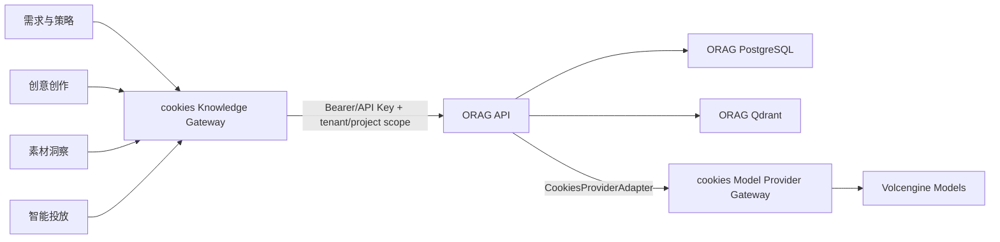

# ORAG 知识库集成说明

| 属性 | 内容 |
| --- | --- |
| 上游项目 | [shikanon/orag](https://github.com/shikanon/orag) |
| 子模块路径 | `third_party/orag` |
| 跟踪分支 | `main` |
| 集成角色 | cookies 共享基座的知识摄取、混合检索、RAG 查询、引用、评测与优化引擎 |
| 首选集成 | 内部 HTTP/OpenAPI 服务 |
| 可选集成 | ORAG Go SDK，用于测试或明确需要的受控嵌入场景 |
| 文档版本 | v0.2 |
| 文档状态 | 草案 |

## 1. 集成目标

1. 复用 ORAG 已有的知识库、文档摄取、混合检索、引用、Trace、评测和优化能力。
2. ORAG 作为独立 RAG 引擎演进，cookies 不复制其检索和评测实现。
3. cookies 保持统一的用户组织、Provider、权限、知识空间和审计体验。
4. 通过 Git submodule 固定源码提交，确保构建、测试和部署可复现。
5. 通过 Knowledge Gateway 隔离 ORAG API 与 cookies 四个业务系统，避免系统直接依赖 ORAG 内部包或数据库。

## 2. 代码与运行边界



### 2.1 cookies 负责

- 用户登录、组织/项目权限和业务系统授权。
- 统一知识空间、业务来源对象、版本与可见范围。
- Knowledge Gateway API、租户/项目/知识库映射和错误翻译。
- ORAG 服务身份/API Key 的加密存储、轮换和审计。
- 统一模型 Provider Gateway、火山默认路由、厂商凭据、组织配额、用量归集和降级决策。
- 把 ORAG citation、trace 和 warning 转成 cookies 稳定契约。

### 2.2 ORAG 负责

- 知识库与文档摄取任务。
- 文档解析、切分、加载和内容哈希。
- Qdrant dense retrieval、PostgreSQL FTS、RRF 融合与 rerank。
- JSON/SSE RAG 查询、引用、语义缓存、Trace 和可观测指标。
- 数据集、评测运行、优化与 RAG 配置验证。
- 根据 RAG Profile 选择 chat、embedding、rerank 和 multimodal 逻辑能力；通过 cookies Provider Gateway 执行厂商模型调用。

### 2.3 禁止边界

- cookies 业务系统不能直接访问 ORAG PostgreSQL 或 Qdrant。
- ORAG 不直接读取 cookies 的 Brief、Creative、Insight 或 Delivery 表。
- 业务系统不能持有 ORAG 管理员用户名、密码或未加密 API Key。
- ORAG 在目标架构中不能持有火山或其他模型厂商的长期密钥，也不能绕过 cookies Provider Gateway 直连厂商。
- cookies 不导入 `internal/*` 等 ORAG 内部包；若使用 Go SDK，只使用其公开稳定入口。

## 3. 部署模式

### 3.1 推荐：独立内部服务

cookies 开发和生产环境分别启动 `orag-api`，Knowledge Gateway 通过内部网络调用。优点：

- ORAG 可以独立迁移、扩缩容、监控和回滚。
- Qdrant/PostgreSQL 依赖与 cookies 业务数据隔离。
- 四个业务系统只依赖 cookies 的稳定知识接口。
- ORAG OpenAPI、契约测试和成熟度标记可作为升级门禁。

### 3.2 可选：Go SDK

仅在单进程测试、本地演示或经过架构评审的低延迟场景使用公开 Go SDK。嵌入模式仍需保持租户、存储、Provider 和错误契约，不允许业务包直接调用 ORAG 内部实现，也不能在业务进程复制厂商模型凭据。

## 4. 租户与对象映射

| cookies | ORAG | 说明 |
| --- | --- | --- |
| Organization | Tenant | 最强数据隔离边界，必须一一映射并持久化 |
| ProjectContext | Project | 项目级 API Key 和知识范围边界 |
| KnowledgeSpace | Knowledge Base | 组织、品牌、项目、规则等知识空间 |
| KnowledgeDocument | Document | 保存 cookies 来源 ID、版本、URI 和内容哈希 |
| KnowledgeIngestionRun | Ingestion Job | 异步摄取状态、错误和重试映射 |
| KnowledgeQueryRun | Query + Trace | 保存 query、citation、warning、trace_id 和用量 |
| KnowledgeEval | Dataset/Evaluation | 评测集、运行、指标和发布门禁 |

映射表由 cookies 共享基座拥有，至少保存：`organization_id`、`project_context_id`、`knowledge_space_id`、ORAG tenant/project/knowledge-base ID、当前版本和状态。

## 5. API 映射

| cookies Knowledge Gateway | ORAG API | 用途 |
| --- | --- | --- |
| `POST /platform/v1/knowledge/spaces` | `POST /v1/knowledge-bases` | 创建知识空间 |
| `GET /platform/v1/knowledge/spaces` | `GET /v1/knowledge-bases` | 列出当前组织/项目可见空间 |
| `POST /platform/v1/knowledge/documents` | `/v1/knowledge-bases/{id}/documents` 或 `documents:import` | 上传或导入文档 |
| `GET /platform/v1/knowledge/ingestions/{id}` | `GET /v1/ingestion-jobs/{id}` | 获取摄取任务状态 |
| `POST /platform/v1/knowledge/query` | `POST /v1/query` | JSON RAG 查询 |
| `POST /platform/v1/knowledge/query:stream` | `POST /v1/query:stream` | SSE RAG 查询 |
| `GET /platform/v1/knowledge/traces/{id}` | `GET /v1/traces/{trace_id}` | 查询节点级 Trace |
| `/platform/v1/knowledge/evaluations/*` | `/v1/datasets`、`/v1/evaluations` | 管理评测集和运行 |
| `/platform/v1/knowledge/optimizations/*` | `/v1/optimizations` | 执行检索参数优化 |

Gateway 响应统一包含 cookies 资源 ID，并在诊断字段保留 ORAG `trace_id`、warning、citation 来源和原始错误码映射。业务系统不依赖 ORAG 响应中的未承诺内部字段。

## 6. 身份与凭据

- cookies 用户先通过共享 IAM 鉴权，Knowledge Gateway 再计算组织、项目和知识权限。
- Gateway 使用 ORAG API Key 调用；优先采用项目范围的 `project_editor`/`project_viewer`，只在管理操作使用 tenant 管理身份。
- API Key 由 cookies 密钥服务加密保存，不返回浏览器、业务日志或 Agent 上下文。
- Key 创建、轮换、撤销和过期要写入共享审计，并提供连接健康状态。
- ORAG 返回的“资源不存在”同时用于隐藏跨租户资源，Gateway 不泄露其他组织 ID。

## 7. Provider 协作

cookies Provider Gateway 是模型调用、厂商凭据、模型目录、路由、配额和成本的唯一目标入口。ORAG 保留 RAG Profile 和节点级能力选择，但实际 LLM/VLM、Embedding、Rerank 调用通过 `CookiesProviderAdapter` 或等价远程 Adapter 进入 Provider Gateway；默认再由 Gateway 路由到火山引擎。

推荐流程：

1. 管理员在 cookies Provider 中心启用 `text.generate`、`vision.understand`、`embedding.generate`、`rerank.score` 能力。
2. cookies 为组织/知识空间选择逻辑 RAG Profile，Knowledge Gateway 将其映射为 ORAG 支持的能力组合。
3. ORAG 的 Adapter 使用受限服务身份和租户/项目上下文调用 `/platform/v1/model/*`，不传递厂商密钥。
4. Provider Gateway 根据组织策略和能力路由到默认火山模型，并返回逻辑模型、实际版本、用量和标准化错误。
5. ORAG 记录节点 Trace、citation 和调用引用；cookies 按组织、业务系统和知识查询归集用量与成本。
6. Provider 不可用时，Gateway 先执行已批准的模型降级；无法满足质量或合规要求时返回明确失败。

若当前 ORAG Provider Registry 尚不支持远程 Gateway，需要在 ORAG 上游实现 `CookiesProviderAdapter` 并发布稳定契约，然后更新 cookies submodule gitlink。仅在迁移期允许将最小权限厂商 Secret 注入 ORAG；该方案必须记录到期时间、轮换责任和迁移任务，不作为生产目标架构。

## 8. 存储与数据治理

- ORAG 使用独立 PostgreSQL 数据库或独立受控实例，保存元数据、FTS、Trace、评测与优化数据。
- ORAG 使用独立 Qdrant collection/namespace 保存向量与语义缓存。
- cookies 只保存映射、业务来源、权限、版本和必要的 citation/trace 摘要。
- 原始文档是否由 cookies 对象存储或 ORAG 摄取流程持有，应按来源类型定义单一权威副本。
- 删除知识空间时先执行影响分析和审批，再调用 ORAG 删除；完成后更新映射和审计。
- 备份、恢复、数据留存与删除需要同时覆盖 cookies 映射、ORAG PostgreSQL 和 Qdrant。

## 9. 可观测性

- cookies 使用 `/healthz` 与 `/readyz` 判断进程和依赖就绪状态。
- 采集 ORAG `/metrics`，按环境监控 HTTP/RAG 延迟、错误、缓存、摄取和依赖状态。
- cookies 请求 ID 与 W3C `traceparent` 传递给 ORAG，响应保存 `trace_id`。
- 日志不记录用户原始查询、文档全文、模型响应、凭据或跨租户标识。
- Provider、PostgreSQL、Qdrant 或 ORAG 不可用时，四个业务系统获得统一、可恢复的知识服务状态。

## 10. 本地开发

### 10.1 初始化 submodule

```bash
git submodule update --init --recursive
git submodule status
```

### 10.2 运行 ORAG 演示环境

```bash
make -C third_party/orag demo
```

该命令使用 ORAG 明确启用的 deterministic mock，适合本地探索和契约检查，不代表生产 Provider 配置。ORAG Console 默认使用 `http://localhost:3000`，API/Docs 默认使用 `http://localhost:8080`；cookies 前端开发端口需要避免冲突。

停止演示环境：

```bash
make -C third_party/orag demo-down
```

### 10.3 生产式本地依赖

```bash
make -C third_party/orag dev-up
make -C third_party/orag migrate
make -C third_party/orag run
```

真实 Provider 凭据只放在本地未跟踪环境或密钥系统中，禁止提交 `.env`。

## 11. Submodule 升级流程

查看当前固定版本：

```bash
git submodule status third_party/orag
```

升级到远端 main 候选版本：

```bash
git submodule update --remote third_party/orag
```

升级后必须：

1. 查看 ORAG 发行说明、能力成熟度和 OpenAPI 差异。
2. 运行 ORAG 自身格式、测试和 OpenAPI 校验。
3. 运行 cookies Knowledge Gateway 契约与多租户隔离测试。
4. 验证摄取、查询、SSE、citation、trace、评测和降级主路径。
5. 单独提交 gitlink 更新，提交信息记录旧/新提交及兼容性结论。

不要在生产构建中隐式执行 `--remote`；构建必须使用 cookies 仓库固定的 gitlink。

## 12. 测试策略

| 层级 | 内容 |
| --- | --- |
| 单元测试 | Gateway 映射、权限、错误翻译、citation 与 trace 转换 |
| 契约测试 | 针对 `third_party/orag/api/openapi.yaml` 验证已使用端点和字段 |
| 集成测试 | ORAG + PostgreSQL + Qdrant 的摄取、检索、查询和删除 |
| 隔离测试 | 不同 Organization/Project 不能列出、查询或删除彼此资源 |
| 评测回归 | 固定广告知识集上的召回、引用、回答和延迟基线 |
| 故障测试 | ORAG、Provider、PostgreSQL、Qdrant 超时、限流和部分不可用 |
| 升级测试 | 新 gitlink 对旧知识、迁移、OpenAPI 和回滚的兼容性 |

## 13. MVP 验收标准

1. 新克隆 cookies 后可用 `git submodule update --init --recursive` 获取固定 ORAG 源码。
2. cookies Organization/Project/KnowledgeSpace 能稳定映射到 ORAG tenant/project/knowledge base。
3. 业务系统只能通过 Knowledge Gateway 摄取和查询，不能直连 ORAG 数据库。
4. 文档摄取为异步任务，可查看进度、错误和重试结果。
5. 查询返回答案、citations、warning 和 trace_id，引用可追溯到 cookies 知识文档版本。
6. 不同组织和项目的 API Key、知识库、查询与 Trace 相互隔离。
7. Provider 密钥不进入浏览器、Agent 上下文、请求日志或版本库。
8. ORAG/Provider/Qdrant/PostgreSQL 故障被转换为统一知识服务状态，不拖垮业务系统基础读写。
9. 固定评测集可在升级前后运行，并输出可比较结果。
10. submodule 升级只更新明确评审后的 gitlink，生产构建不跟随浮动 main。

## 14. 风险与应对

| 风险 | 应对 |
| --- | --- |
| cookies 与 ORAG 鉴权模型不一致 | Knowledge Gateway 做身份终止和明确 tenant/project 映射 |
| Provider 配置重复或密钥扩散 | ORAG 通过 cookies Provider Gateway 调用，只持有受限服务身份；迁移期厂商 Secret 必须有到期计划 |
| 业务代码依赖 ORAG 内部实现 | 只使用 HTTP/OpenAPI 或公开 SDK，加入架构与代码检查 |
| submodule 未初始化导致构建失败 | README、CI 初始化检查和明确错误提示 |
| 浮动 main 造成不可复现 | gitlink 固定提交，升级经评审、契约和评测门禁 |
| ORAG 数据与 cookies 映射不一致 | 幂等写入、对账任务、孤儿资源扫描和人工修复队列 |
| RAG 质量回归 | 固定广告评测集、发布门禁、Profile 回滚和 Trace 对比 |

## 15. 变更记录

| 版本 | 日期 | 变更内容 |
| --- | --- | --- |
| v0.1 | 2026-07-20 | 将 ORAG 作为知识库 submodule，定义 HTTP/OpenAPI 集成、租户映射、Provider 协作和升级测试流程 |
| v0.2 | 2026-07-20 | 将 ORAG 模型调用收敛到 cookies 统一 Provider Gateway，默认由火山引擎执行 |
