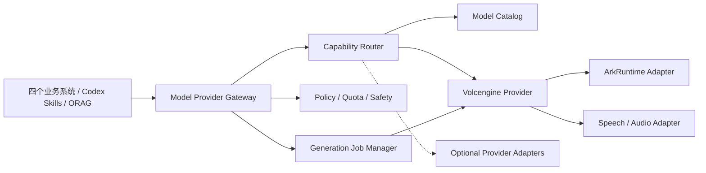

# cookies 统一模型 Provider 规格

| 属性 | 内容 |
| --- | --- |
| 定位 | cookies 所有模型能力的唯一接入、路由和治理层 |
| 默认 Provider | 火山引擎 |
| 默认 Go SDK | [`github.com/volcengine/volcengine-go-sdk/service/arkruntime`](https://github.com/volcengine/volcengine-go-sdk/tree/master/service/arkruntime) |
| 覆盖能力 | LLM、VLM、图片、视频、音频、3D；内部补充 Embedding、Rerank |
| 文档版本 | v0.3 |
| 文档状态 | 实现基线 |

## 1. 定位与原则

统一模型 Provider 是共享基座的一部分。四个业务系统、Codex Skills、ORAG 和后台任务都通过 cookies 的稳定能力契约调用模型，不直接依赖厂商 SDK、模型 ID、鉴权方式或响应结构。

1. **单一入口**：cookies 自有业务模型调用只能进入 Provider Gateway，不在业务包中直接创建厂商 Client。
2. **火山默认**：默认路由到火山引擎；只有在能力缺失、故障降级、合规或成本策略要求时才切换其他 Provider。
3. **能力优先**：调用方声明能力、输入约束和质量等级，不直接选择易变化的厂商模型 ID。
4. **抽象稳定**：内部契约使用 cookies 类型，火山 SDK 类型只存在于 `volcengine` Adapter 内。
5. **同步与异步统一**：文本理解等短任务同步返回，图片、视频、音频和 3D 等长任务统一为 Job。
6. **凭据集中**：API Key、AK/SK 和服务身份只由密钥服务与 Adapter 使用，不进入浏览器、Skill 上下文、日志或业务数据库。
7. **全链路治理**：每次调用都具备租户、系统、项目、任务、模型版本、用量、成本、质量和审计信息。

Codex 仍是需求分析和智能投放中的 Agent 编排运行时；Provider 负责其 Skills、工具和 cookies 业务服务所需的模型能力。垂直系统不感知 Codex 或火山引擎内部的模型选择细节。

## 2. 能力目录

### 2.1 对外能力编码

| 能力族 | 能力编码 | 典型输入 | 典型输出 | 默认执行方式 |
| --- | --- | --- | --- | --- |
| LLM | `text.generate` | 文本、消息、工具定义、结构化 Schema | 文本、JSON、工具调用 | 同步/流式 |
| VLM | `vision.understand` | 图片/视频引用、问题、Schema | 描述、标签、结构化分析 | 同步或异步 |
| 图片 | `image.generate` | Prompt、尺寸、风格、参考图 | 图片资产 | 异步，可流式预览 |
| 图片 | `image.edit` | 原图、Mask/参考图、编辑指令 | 图片资产 | 异步 |
| 视频 | `video.generate` | Prompt、首尾帧、参考素材、时长 | 视频资产 | 异步 |
| 音频 | `audio.transcribe` | 音频/视频资产、语言提示 | 文本、时间戳、说话人 | 异步/流式 |
| 音频 | `audio.synthesize` | 文本、音色、情绪、语速 | 音频资产、字幕时间轴 | 异步/流式 |
| 音频 | `audio.generate` | Prompt、时长、风格约束 | 音乐或音效资产 | 异步 |
| 3D | `three_d.generate` | Prompt、参考图、多视图、格式 | 3D 资产与预览 | 异步 |
| RAG 内部能力 | `embedding.generate` | 文本或图文 | 向量 | 同步/批量 |
| RAG 内部能力 | `rerank.score` | Query、候选文档 | 排序与分数 | 同步 |

`embedding.generate` 和 `rerank.score` 属于平台内部能力，但仍走同一 Provider 层，主要供 ORAG、素材相似度和检索服务使用。

### 2.2 能力描述

每个已注册模型至少声明：

- `provider_code`、逻辑模型别名、厂商模型 ID、区域和版本。
- 支持的能力编码、输入/输出 MIME、上下文长度、最大尺寸/时长和并发限制。
- 是否支持流式、批量、异步、结构化输出、工具调用和参考素材。
- 内容安全、数据留存、商用授权、地域、价格和预计耗时。
- 生命周期状态：试验、灰度、生产、弃用、停用。

业务配置引用逻辑别名，例如 `cookies.text.standard`、`cookies.video.quality`，不得硬编码具体豆包模型版本。模型升级只调整别名映射，并经过离线评测、灰度和回滚门禁。

## 3. 火山引擎默认实现

### 3.1 SDK 与能力映射

Provider 层优先使用火山引擎官方 Go SDK 的 `arkruntime` 包，并通过 Go Modules 锁定经过验证的版本。SDK 是代码依赖，不以 Git submodule 接入。

| cookies 能力 | 火山默认适配路径 | 说明 |
| --- | --- | --- |
| LLM/VLM | `arkruntime` Chat/Responses | 对话、推理、视觉理解、结构化输出与工具调用 |
| 图片 | `arkruntime` Images | 图片生成；编辑能力按所选模型实际声明开放 |
| 视频 | `arkruntime` Content Generation Task | 创建、查询、取消/删除长任务 |
| 3D | 方舟 Content Generation/API Adapter | 统一复用异步 Job；以当前正式 API 与模型能力为准 |
| Embedding | `arkruntime` Embeddings | 文本/多模态向量化按模型能力注册 |
| Rerank | 火山 Rerank Adapter | 通过统一接口接入，未启用时不得伪装为可用 |
| 音频 | 火山语音/音频服务 Adapter | ASR、TTS、音乐/音效分别声明；不假设由 `arkruntime` 同一包提供 |

`arkruntime` 当前源码明确包含 Chat/Responses、Embeddings、Images 和 Content Generation Task 等入口。音频等能力可能使用火山引擎其他正式服务 API/SDK，但对上层仍表现为同一个 `volcengine` Provider。具体模型名称、版本和限制由 Model Catalog 配置，不固化在本文档。

### 3.2 鉴权与 Client

- 方舟推理调用默认使用 API Key；凭据来自密钥服务的运行时注入。
- 若具体火山服务要求 AK/SK，则仅相应 Adapter 获取该凭据，不能扩大到整个业务进程。
- Client 按 `credential_ref + region + endpoint + timeout policy` 复用，不按请求重复创建。
- SDK 版本写入 `go.mod`/`go.sum`，升级必须通过契约测试、固定评测集和灰度验证。
- 禁止提交真实密钥、在错误信息中回显请求头，或将生成请求全文作为默认日志字段。

## 4. 逻辑架构



### 4.1 核心组件

| 组件 | 职责 |
| --- | --- |
| Provider Gateway | 统一鉴权、契约校验、幂等、同步/流式响应和错误转换 |
| Capability Router | 按能力、组织策略、地区、质量、成本、健康和降级规则选路 |
| Model Catalog | 管理逻辑别名、厂商模型、版本、限制、价格和生命周期 |
| Provider Registry | 注册 `volcengine` 及未来可选 Adapter，声明健康与能力 |
| Generation Job Manager | 管理排队、运行、轮询/回调、取消、超时、产物和重试 |
| Credential Broker | 加密保存、授权、轮换并按最小权限下发凭据 |
| Usage & Cost Meter | 归集 token、图片张数、视频秒数、音频秒数、3D 任务和实际成本 |
| Safety & Policy | 输入输出审核、版权/肖像/敏感内容策略和人工复核 |
| Evaluation | 离线基准、在线抽检、模型升级对比和回滚门禁 |

## 5. 后端契约

### 5.1 通用调用请求

```json
{
  "capability": "video.generate",
  "model_alias": "cookies.video.standard",
  "input": {},
  "constraints": {
    "quality_tier": "standard",
    "max_latency_ms": 120000,
    "region": "cn-beijing"
  },
  "context": {
    "organization_id": "org_xxx",
    "project_id": "project_xxx",
    "source_system": "creative",
    "source_task_id": "task_xxx"
  },
  "idempotency_key": "creative-task-version-operation"
}
```

`provider_code` 和厂商模型 ID 默认不由业务请求指定。只有平台管理员的诊断/评测任务可在授权范围内覆盖路由。

### 5.2 核心 API

- `POST /platform/v1/model/invocations`：发起同步或流式模型调用。
- `POST /platform/v1/model/jobs`：发起异步生成任务。
- `GET /platform/v1/model/jobs/{id}`：查询阶段、进度、产物、用量和标准化错误。
- `POST /platform/v1/model/jobs/{id}:cancel`：请求取消未完成任务。
- `GET /platform/v1/model/capabilities`：查询当前组织可用能力与限制。
- `GET /platform/v1/model/models`：查询逻辑模型别名；默认不暴露凭据。
- `GET /platform/v1/model/usage`：按组织、系统、项目、能力和模型聚合用量。

通用错误信封、幂等 Header、并发和异步资源遵循 [API 与领域事件契约](./13-api-event-contracts.md)。

### 5.3 Job 状态

公共 Job 状态为：

`queued → running → succeeded | partially_succeeded | failed | cancelled | expired`

`submitted` 是 Provider Adapter 可记录的内部执行阶段，不进入共享 `contract.Job` 状态枚举。多产物通过 `result_refs` 返回；`partially_succeeded` 必须同时包含至少一个成功引用和稳定的汇总错误码。Bootstrap 契约的单值 `result_ref` 仅为兼容保留，新实现不得继续依赖。

- Provider 外部任务 ID 只保存在平台数据和诊断视图，不作为业务主键。
- 查询外部状态采用指数退避和抖动；支持官方回调时仍需签名校验与对账轮询。
- 生成成功后按 [媒体资产平台](./11-media-asset-platform.md) 转存、扫描并生成稳定 Asset ID/Version，再向业务系统发布引用。
- 重试前检查幂等键和外部任务状态，避免重复扣费与重复生成。

### 5.4 标准错误

| 错误码 | 含义 | 默认处理 |
| --- | --- | --- |
| `MODEL_CAPABILITY_UNAVAILABLE` | 无满足约束的模型 | 提示调整约束或启用能力 |
| `MODEL_POLICY_REJECTED` | 输入或输出触发策略 | 不自动重试，进入人工处理 |
| `MODEL_RATE_LIMITED` | Provider 限流 | 按策略排队或退避 |
| `MODEL_PROVIDER_TIMEOUT` | Provider 超时 | 查询外部状态后再决定重试 |
| `MODEL_QUOTA_EXCEEDED` | 组织预算或配额耗尽 | 停止调用并提示管理员 |
| `MODEL_OUTPUT_INVALID` | 输出不满足 Schema/格式 | 允许受限修复或切换模型 |
| `MODEL_ASSET_PERSIST_FAILED` | 结果落盘失败 | 保留外部引用并进入补偿队列 |

## 6. 路由与降级

默认路由顺序：组织显式策略 → 场景逻辑别名 → 火山引擎生产模型 → 同 Provider 备用模型 → 经批准的其他 Provider → 明确失败。

- 文本/VLM 可在满足数据与质量策略时自动切换同能力备用模型。
- 图片、视频、音频和 3D 的模型切换可能改变风格、角色一致性和版权边界，任务开始后不得静默换模。
- 安全拒绝、余额不足和非法参数不重试；网络超时、限流和短暂不可用按幂等策略重试。
- 每次降级在结果中返回 `degraded=true` 和机器可读原因，并写入审计。
- 若没有通过评测的备用模型，宁可返回能力不可用，也不以低质量模型伪装成功。

## 7. 管理台导航

Provider 中心路由前缀：`/admin/providers/*`。

| 二级页面 | 路由 | 主要内容 |
| --- | --- | --- |
| 总览 | `/admin/providers/overview` | 六类能力健康、调用量、失败率、成本和告警 |
| 凭据 | `/admin/providers/credentials` | 火山 API Key/AK/SK 引用、轮换、权限和审计 |
| 模型目录 | `/admin/providers/models` | 逻辑别名、厂商模型、能力、区域、限制和生命周期 |
| 路由策略 | `/admin/providers/routing` | 默认火山路由、组织覆盖、备用模型、熔断和灰度 |
| 生成任务 | `/admin/providers/jobs` | 图片/视频/音频/3D 任务、外部 ID、进度和补偿 |
| 用量与预算 | `/admin/providers/usage` | token、张数、秒数、任务数、费用和预算告警 |
| 质量评测 | `/admin/providers/evaluations` | 固定评测集、版本对比、线上抽检和回滚 |
| 运行诊断 | `/admin/providers/observability` | 延迟、错误、限流、SDK/API 版本和请求链路 |

垂直系统只展示与自身任务有关的模型状态和费用，不复制凭据、全局路由和模型目录页面。

## 8. 与四个系统及 ORAG 的关系

| 消费方 | 使用能力 | 约束 |
| --- | --- | --- |
| 需求与策略 | LLM、VLM | Codex/Skills 通过平台能力调用并保存引用与用量 |
| 创意创作 | LLM、VLM、图片、视频、音频、3D | 生成结果先进入共享资产存储，再形成创意版本 |
| 素材洞察 | VLM、LLM、Embedding、音频转写 | 分析结果记录模型别名、版本和可复现参数 |
| 智能投放 | LLM、VLM | 模型负责规划/理解，不绕过审批或直接持有广告平台凭据 |
| ORAG | LLM、VLM、Embedding、Rerank | 目标架构通过 cookies Provider Gateway 或其专用 Adapter 调用，不持有厂商长期密钥 |

ORAG 若暂不支持远程 Provider Gateway，需要在 ORAG 上游实现 `CookiesProviderAdapter`，再更新 cookies 的 submodule gitlink。生产目标不是向 ORAG 注入一套重复的火山厂商密钥；过渡方案必须有到期时间、最小权限和迁移任务。

## 9. 安全、成本与可观测性

- 输入、输出和生成资产按组织数据策略决定是否落盘；默认日志只记录哈希、大小、模型别名和诊断字段。
- 生成涉及真人、商标、版权素材、敏感行业或平台禁投内容时，进入相应审核流程。
- 每个调用生成 `invocation_id`，关联 OpenTelemetry trace、Provider request/task ID 和上游业务任务。
- 成本按实际账单单位记录，同时保存调用前估算；估算超过阈值时请求确认或拒绝。
- 指标至少覆盖成功率、首 token 延迟、总延迟、排队时间、限流、取消率、输出无效率和单位产物成本。
- Provider 状态与业务任务状态分离；模型服务故障不能导致 Brief、创意草稿、洞察或投放计划不可读取。

## 10. 分阶段落地

### 阶段 A：统一入口

- 建立 Gateway、Catalog、Registry、凭据和调用审计。
- 接入火山 `arkruntime` 的 LLM/VLM、Embedding、图片与 Content Generation Task。
- 四个业务系统禁止新增厂商 SDK 直接依赖。

### 阶段 B：长任务与多媒体

- 完成视频、音频和 3D Adapter、Job Manager、回调/轮询、对象存储落盘和成本计量。
- 创意系统贯通图片、视频、配音/音效和 3D 资产生成。

### 阶段 C：知识与治理

- 完成 ORAG 的 `CookiesProviderAdapter` 或等价网关集成。
- 上线模型评测、组织级路由、预算、灰度、熔断和多 Provider 降级。

## 11. 验收标准

1. 六类模型能力均有稳定能力编码、输入输出 Schema、模型目录和健康状态。
2. 默认路由为火山引擎，业务系统代码不出现火山模型 ID、API Key 或 SDK 请求类型。
3. LLM/VLM 支持同步/流式；图片、视频、音频、3D 支持异步状态、取消、超时和稳定资产引用。
4. 每次调用可按组织、系统、项目和任务追踪模型版本、用量、成本、错误及审计。
5. 密钥不进入浏览器、Agent 上下文、业务表、普通日志或版本库。
6. Provider 限流、超时、失败和重复回调不会造成重复生成、重复计费归集或业务状态损坏。
7. 火山模型升级经过契约测试、固定广告评测集、灰度和回滚验证。
8. ORAG 与四个业务系统不直接持有厂商长期密钥，模型调用可在统一平台追踪。

## 12. 版本记录

| 版本 | 日期 | 说明 |
| --- | --- | --- |
| v0.1 | 2026-07-20 | 建立统一模型 Provider，默认火山引擎，覆盖 LLM、VLM、图片、视频、音频、3D 与 RAG 内部能力 |
| v0.2 | 2026-07-20 | 接入媒体资产和 API/事件统一契约，明确生成产物的转存与稳定引用 |
| v0.3 | 2026-07-21 | 收口公共 Job 状态、多产物引用和 Provider 内部提交阶段语义 |
