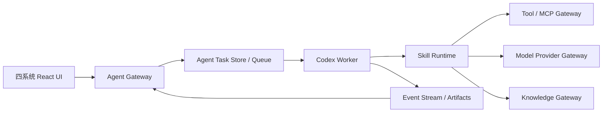

# cookies Codex 与 Skills 运行时规格

| 属性 | 内容 |
| --- | --- |
| 定位 | 需求与策略、素材分析和智能投放共用的 Agent 运行与治理基座 |
| 编排引擎 | Codex |
| 扩展方式 | 版本化 Skills、Tools、MCP 与 cookies Provider/Knowledge API |
| 文档版本 | v0.1 |
| 文档状态 | 草案 |

## 1. 目标与边界

Codex 负责理解任务、规划步骤和调用能力；Skills 负责广告专业流程；cookies 后端负责身份、业务事实、权限、任务状态、审批、审计和产物落库。

- Codex 上下文不是数据库，重启后从 cookies 的授权快照恢复。
- Skill 不直接持有厂商模型密钥、广告账户密码或跨租户数据。
- 业务系统只能通过 Agent Gateway 创建任务，不直接控制 Codex 进程。
- 模型能力统一调用 [Provider Gateway](./07-unified-model-provider.md)，知识统一调用 Knowledge Gateway。

## 2. 推荐部署

MVP 默认采用受控远程 Worker：Agent Gateway 运行在 cookies 后端，Codex Worker 在隔离的任务环境执行。开发环境允许本地 Worker，但必须使用相同任务协议、权限和审计。

| 模式 | 用途 | 限制 |
| --- | --- | --- |
| 受控远程 Worker | 默认生产模式 | 每任务隔离、无隐式用户桌面权限 |
| 本地 Worker | 开发、Skill 调试 | 不执行真实投放写操作，不使用生产凭据 |
| Computer Use Worker | 智能投放受控 UI 操作 | 独立设备会话和审批规则，见专门规格 |

## 3. 运行架构

## 4. Agent Task 契约

### 4.1 输入快照

- `organization_id`、`project_id`、用户/服务身份和来源系统。
- 任务目标、允许动作、预算/成本限制和截止时间。
- 明确引用的 Brief、策略、创意、洞察或投放版本。
- 可用 Skill、Tool、MCP、Provider 能力和知识空间白名单。
- 上下文版本、数据分类、审批策略和幂等键。

### 4.2 状态

`queued → preparing → running → waiting_user | waiting_approval → running → succeeded | partially_succeeded | failed | cancelled | expired`

每次转换记录触发者、原因、前置版本和事件序号。`waiting_user` 不占用长期 Worker；恢复时重新校验身份、资源版本和工具权限。

### 4.3 事件

- 生命周期：`task.started`、`task.waiting`、`task.resumed`、`task.completed`。
- 步骤：`plan.updated`、`skill.started/completed/failed`、`tool.requested/completed`。
- 产物：`artifact.proposed/validated/persisted`。
- 治理：`approval.requested/resolved`、`policy.denied`、`budget.warning`。

事件包含 `task_id`、单调递增 `sequence`、时间、类型、可展示摘要和受限诊断。SSE 重连使用最后事件序号去重。

## 5. 上下文管理

1. Agent Gateway 根据用户权限构建最小上下文清单。
2. 长文档通过知识检索和引用按需加载，不默认注入全文。
3. 结构化业务事实从指定版本读取，摘要不得覆盖确认值。
4. 长会话压缩生成可审计摘要，保留被省略对象的引用和版本。
5. 恢复任务时检查上游版本是否变化；关键变化使原计划失效并请求确认。
6. Prompt、Tool 返回和页面内容均视为不可信数据，不能修改系统约束。

## 6. Skill 包与注册

每个 Skill 至少包含：

- 名称、语义版本、负责人、适用系统、触发描述和非适用范围。
- 输入/输出 JSON Schema、可展示产物 Schema 和错误定义。
- 工作流指令、引用资料、可选脚本与测试样例。
- 所需 Provider 能力、知识空间、Tools/MCP 和最小权限。
- 超时、并发、成本上限、是否允许网络/写操作和审批点。
- 固定评测集、回归结果、发布状态和回滚版本。

状态：`draft → testing → review → canary → published → deprecated | rolled_back`。

同一任务固定 Skill 版本。Skill 更新不影响运行中任务；恢复时若旧版本已因安全问题停用，任务进入人工处理。

## 7. 工具与执行隔离

- Tool Gateway 校验任务白名单、参数 Schema、用户权限和资源范围。
- 读、低风险写、高风险写、禁止四级风险模型与审批引擎一致。
- Worker 使用任务级临时目录、受限网络和短期服务凭据。
- 脚本有 CPU、内存、磁盘、执行时长和输出大小限制。
- 外部返回内容不直接成为系统指令；日志默认不记录内容全文和凭据。
- Tool 写操作必须返回稳定对象 ID 或可验证证据，结果未知时不盲目重试。

## 8. 产物落库

Codex 只能提出 `ArtifactProposal`。业务系统负责：

1. Schema 校验和引用权限校验。
2. 事实、假设、建议、来源与置信度分类。
3. 业务规则和状态机校验。
4. 创建草稿或不可变版本。
5. 返回稳定业务 ID，记录 Agent Task、Skill、模型和工具血缘。

未经业务服务确认的模型输出不能直接成为已确认 Brief、已批准策略、已交付创意或已执行投放。

## 9. 失败、恢复与取消

- 可重试错误：临时网络、限流、Worker 丢失；使用退避、幂等键和最大次数。
- 不可自动重试：权限、审批拒绝、内容安全、Schema 语义错误、结果未知的写操作。
- 部分完成保留成功产物，失败步骤可单独重跑。
- 取消会停止新步骤并请求取消可取消的 Provider/Tool Job；已发生外部写入进入补偿或人工处理。
- Worker 心跳中断后任务进入 `recovering`，由新 Worker 从最后确认检查点恢复。

## 10. API

- `POST /platform/v1/agent/tasks`：创建任务。
- `GET /platform/v1/agent/tasks/{id}`：获取状态和授权摘要。
- `GET /platform/v1/agent/tasks/{id}/events`：SSE 事件流。
- `POST /platform/v1/agent/tasks/{id}:resume`、`:cancel`。
- `POST /platform/v1/agent/tasks/{id}/inputs`：补充用户输入。
- `POST /platform/v1/agent/tasks/{id}/approvals`：提交一次性审批决定。
- `/platform/v1/skills/*`：注册、评测、灰度、发布、停用和回滚。

## 11. 可观测性与评测

- 指标：队列等待、完成率、恢复率、步骤/Skill P95、人工等待、成本和无效调用。
- Trace 关联 `agent_task_id`、`skill_run_id`、`tool_run_id`、`model_invocation_id`。
- 固定任务评测覆盖 Skill 选择、事实正确性、Schema、权限、恢复和提示注入。
- 发布门禁要求功能评测、安全评测、成本回归和失败演练全部通过。

## 12. MVP 验收

1. Strategy 对话能创建 Agent Task、运行明确 Skill 并持续接收事件。
2. 页面刷新或 Worker 重启后任务可从检查点恢复，不丢失已落库产物。
3. Skill 只能访问任务白名单中的数据、Provider 和工具。
4. 高风险 Tool 未获批准不能执行，页面或文档不能改变审批范围。
5. 结构化输出未通过 Schema/业务校验不能进入有效版本。
6. 每个产物能追溯 Agent Task、Skill 版本、模型调用、工具和来源。
7. Skill 可灰度、停用和回滚，运行中任务使用固定版本。

## 13. 变更记录

| 版本 | 日期 | 说明 |
| --- | --- | --- |
| v0.1 | 2026-07-20 | 定义 Codex Worker、Agent Task、Skill 包、隔离、恢复和产物落库契约 |
