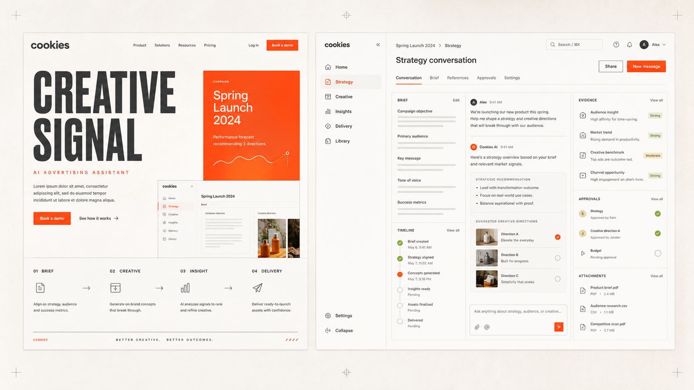
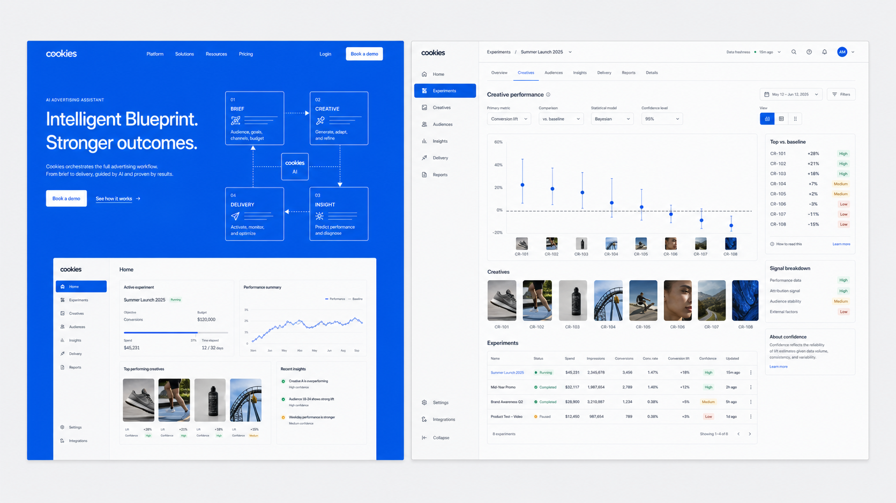
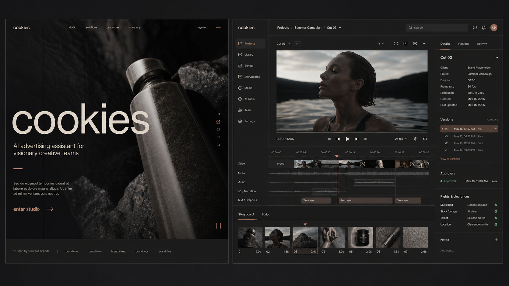

# cookies 品牌视觉与网站整体风格提案

> 文档状态：方向已确认，保留为选型记录 
> 覆盖范围：品牌基础、官网、产品工作台 
> 关键词：**创意、简洁、高级感** 
> 产品口号：**从一句需求，到持续增长。**

> **选型结论（2026-07-20）**：确定方案 B「Intelligent Blueprint / 智能蓝图」作为 cookies 官网、产品工作台及后续品牌资产的统一设计方向。正式规范以仓库根目录 [DESIGN.md](../DESIGN.md) 为准。

## 1. 设计结论

cookies 不应被包装成另一个紫蓝渐变的通用 AI 工具。它的独特价值，是把广告人的创意判断、策略证据、素材经验与投放执行连接为一个闭环。因此，品牌视觉需要同时表达两种能力：官网负责制造记忆与想象力，产品工作台负责建立清晰、效率与掌控感。

本提案提供三个可独立成立的主方向：

1. **Creative Signal / 创意信号**：温暖、敏锐、有行动感，最均衡地覆盖四大业务系统。
2. **Intelligent Blueprint / 智能蓝图**：理性、可信、系统化，已确定为项目设计方向。
3. **Obsidian Studio / 黑曜影棚**：沉浸、精致、电影感，最能强化视频创意，但不建议全产品暗色化。

项目统一采用方案 B，不混合三套品牌色彩与字体系统。创意系统可以提供局部深色媒体预览画布，但仍使用方案 B 的品牌、控件和状态体系。

## 2. 品牌定位

### 2.1 核心主张

cookies 是 AI 时代的广告助手：从一句需求出发，协助用户完成策略澄清、创意生产、素材洞察与受控投放，并把真实效果沉淀为下一轮增长的经验。

### 2.2 品牌气质

- **创意**：不是装饰性“炫技”，而是能推动广告结果的想象力。
- **简洁**：让复杂的专业工作变得清楚，不隐藏必要信息。
- **高级感**：来自精准排版、克制色彩、细腻材质和稳定交互，不来自堆叠特效。

### 2.3 统一体验原则

- 官网与工作台使用同一品牌 DNA，但声量不同：官网可大胆，工作台要安静。
- 四个业务系统各自拥有模块导航；顶层只共享品牌、项目切换、全局搜索、通知和用户入口。
- AI 的来源、推理依据、成本、风险与待确认操作必须可见，让用户始终掌控。
- 不用同尺寸卡片填满页面；优先使用工作流、画布、对话、表格、时间线和数据视图等真实业务结构。
- 以 WCAG 2.2 AA 为最低可访问性目标，关键状态不只依赖颜色。

---

## 3. 方案 A：Creative Signal / 创意信号

### 3.1 核心概念

把每一次 AI 洞察、创意选择和投放反馈表现为一个清晰的“信号”。视觉场景像上午十点的明亮创意工作室：温暖纸张、精确标注、鲜明重点和充足留白。它有人味，但不是休闲消费品牌；有能量，但不会压过内容。

### 3.2 视觉系统

| 维度 | 设计建议 |
| --- | --- |
| 主色策略 | 官网以珊瑚橙形成记忆，工作台只在关键动作、AI 信号和选中状态使用 |
| 基础色 | Porcelain `oklch(0.975 0.008 75)`；Ink `oklch(0.22 0.018 45)` |
| 品牌色 | Signal Coral `oklch(0.68 0.22 35)` |
| 辅助色 | Evidence Moss `oklch(0.65 0.10 132)`；Line `oklch(0.88 0.012 70)` |
| 字体气质 | 中文与产品 UI 使用 MiSans；营销标题搭配克制的窄体 Grotesk 展示字 |
| 图形语言 | 编号、方向线、裁切角、局部放大和证据标记；拒绝漂浮光球与玻璃卡片 |
| 圆角与材质 | 小圆角或近直角，暖白纸张质感，细边线与极轻阴影 |
| 动效 | 产品反馈 180–240ms；官网仅保留一次 600–900ms 的分段信号展开，无弹跳 |

### 3.3 官网表达

- 首屏以一句强主张和一个“需求 → 策略 → 创意 → 投放 → 增长”的连续视觉叙事建立产品全貌。
- 四个模块采用不对称编排与 `01–04` 编号，不做四张同尺寸功能卡片。
- 产品截图与广告作品被当作“证据”展示，珊瑚橙只标记用户下一步应关注的内容。
- 摄影与生成视觉以真实广告制作现场、材质与光线为主，不使用机器人或抽象 AI 大脑。

### 3.4 产品工作台表达

- 默认浅色高密度界面，顶层共享基座保持极简，每个系统使用独立左侧导航。
- 对话与策略系统以“会话 + 结构化 Brief + 证据来源”三栏为核心；珊瑚橙仅用于待确认与下一步行动。
- 创意系统使用更大的画布与缩略图带；素材洞察和投放系统则强化表格、趋势与审计时间线。
- AI 建议使用有来源的边注式呈现，避免生成一堆孤立的建议卡片。

### 3.5 优势与风险

**优势**：辨识度高、情绪温暖、四大模块适配均衡；既有创造力，又不会牺牲专业可信度。
**风险**：橙色使用过量会接近餐饮或消费品牌。通过石墨黑、精确排版、低圆角和严格的颜色预算控制。

---

## 4. 方案 B：Intelligent Blueprint / 智能蓝图

### 4.1 核心概念

把 cookies 定义为广告增长的“智能操作系统”。场景像策略分析师在明亮办公室核对归因、实验和预算：结构清晰、逻辑可验证、每个决策都能追溯。蓝色不是渐变装饰，而是系统结构本身。

### 4.2 视觉系统

| 维度 | 设计建议 |
| --- | --- |
| 主色策略 | 官网允许整块钴蓝浸染；工作台回归矿物灰，仅在链接、选中和模型状态中使用蓝色 |
| 基础色 | Mineral `oklch(0.975 0.006 250)`；Ink Navy `oklch(0.23 0.035 255)` |
| 品牌色 | Cobalt `oklch(0.58 0.23 255)` |
| 状态色 | Mint `oklch(0.78 0.12 162)`；Amber `oklch(0.78 0.13 80)` |
| 字体气质 | Geist Sans + MiSans，强调数字、标签和长时间阅读的清晰度 |
| 图形语言 | 12 列网格、系统蓝图、连接线、数据轨道和严谨图表 |
| 圆角与材质 | 低圆角、清晰分区、无装饰投影，强调平面层级与对齐 |
| 动效 | 节点连线与数据状态渐进出现，避免复杂路径动画 |

### 4.3 官网表达

- 首屏以高占比钴蓝建立品牌资产，展示 cookies 如何把四个系统编排成一个可验证的增长循环。
- 用真实流程图、效果数据与版本关系替代抽象“智能科技”背景。
- 客户案例强调“输入、决策、执行、结果”的因果链，而不只展示结果数字。

### 4.4 产品工作台表达

- 导航、字段、版本与权限的秩序感最强，适合策略、洞察和投放系统。
- 图表使用统一数据语义：品牌蓝表示当前对象，薄荷绿表示通过或改善，琥珀表示风险或待确认。
- 重要对象通过主从视图与关系图展开，适合跨 Campaign、Creative、Asset 和 Delivery 的追溯。

### 4.5 优势与风险

**优势**：企业级可信度高、数据表达清楚、适合复杂权限和分析场景。
**风险**：容易接近传统 B2B SaaS、数据平台或金融科技。需要用高质量广告作品、独特蓝色面积关系和非模板化版式补足创意感。

---

## 5. 方案 C：Obsidian Studio / 黑曜影棚

### 5.1 核心概念

把 cookies 塑造成专业创意人的 AI 制作影棚。场景像创意总监在调色准确的暗色剪辑室中审片：内容成为主角，界面退到背景，铜色带来克制的人文温度。

### 5.2 视觉系统

| 维度 | 设计建议 |
| --- | --- |
| 主色策略 | 官网与创意画布使用深色浸染；策略、洞察、投放系统仍保留浅色工作主题 |
| 基础色 | Obsidian `oklch(0.17 0.010 35)`；Bone `oklch(0.93 0.012 75)` |
| 品牌色 | Copper `oklch(0.66 0.10 45)` |
| 辅助色 | Plum Gray `oklch(0.42 0.035 345)`；Jade `oklch(0.70 0.10 155)` |
| 字体气质 | 精致的新怪诞体 + MiSans，标题控制字重，不依赖奢侈品式细衬线 |
| 图形语言 | 全幅作品、时间线、帧标记、局部聚光和审片批注 |
| 圆角与材质 | 深色哑光表面、细铜线、低圆角；不做霓虹与发光描边 |
| 动效 | 电影式淡入、时间线擦拭和画面对比，支持减少动效模式 |

### 5.3 官网表达

- 首屏以高质量视频帧、脚本片段和创意版本构成全幅叙事，直接展示创作能力。
- 骨白文字和铜色操作形成低饱和、高对比的高级感。
- 通过作品与幕后过程建立品牌魅力，适合创意团队、品牌客户和视频业务。

### 5.4 产品工作台表达

- 创意创作系统可采用深色画布，突出视频预览、时间线、分镜和版本比较。
- 策略、素材分析与智能投放不应被迫使用全暗色；保留浅色主题和相同的品牌标记。
- 深色界面中要严格控制次级文字对比度、表格密度和状态色，避免“高级但难用”。

### 5.5 优势与风险

**优势**：高级感与创意氛围最强，对视频、品牌广告和作品展示尤其有吸引力。
**风险**：全产品暗色会造成阅读疲劳，也不利于策略与数据密集场景。更适合作为创意系统的沉浸模式，而不是四大系统的唯一基础主题。

---

## 6. 方案对比与建议

评分为相对判断，5 分代表最符合 cookies 当前需求。

| 评估项 | A 创意信号 | B 智能蓝图 | C 黑曜影棚 |
| --- | :---: | :---: | :---: |
| 品牌记忆度 | 5 | 4 | 5 |
| 企业级可信度 | 4 | 5 | 4 |
| 四大系统通用性 | 5 | 5 | 3 |
| 数据密度与长时使用 | 4 | 5 | 3 |
| 图文与视频创作表达 | 5 | 3 | 5 |
| 无障碍与主题实现难度 | 5 | 5 | 3 |
| 与通用 AI SaaS 的差异 | 5 | 3 | 5 |
| 最终选型 |  | **已选定** |  |

### 最终决策

已确定 **B「Intelligent Blueprint / 智能蓝图」作为 cookies 主品牌与产品设计基线**。

- 官网以高占比钴蓝建立识别度，通过系统蓝图、真实广告作品和证据链表达产品价值。
- 工作台以矿物灰为主，钴蓝只用于主操作、当前选择、链接与信息状态。
- 四大系统共享品牌令牌和组件规范，各自维护业务导航与页面结构。
- 创意系统可以提供局部深色媒体预览画布，但不引入第二套品牌体系。
- 正式实现以仓库根目录 [DESIGN.md](../DESIGN.md) 为唯一规范。

## 7. 标志与品牌资产方向

- 主标志建议使用小写 `cookies` 字标，语气友好但字形要有编辑感和结构感。
- 可从“被取走的一角 / bite”“模块拼接”“信号切口”中提炼一个极简结构，延展到选中态、裁切、头像与 favicon。
- 不使用写实曲奇、卡通饼干、厨师帽或拟人吉祥物作为主标志，避免产品被误解为食品或儿童工具。
- 标志定稿应在主视觉方向选定后进行，至少覆盖横版字标、紧凑图标、单色版、深浅底和 16px favicon 测试。

## 8. 字体与实现建议

- 中文与产品 UI 优先评估 [MiSans](https://hyperos.mi.com/font)：官方提供多语言与可变字体资源，并允许免费商业使用。
- 方案 B 的英文与数字可优先评估 [Geist](https://vercel.com/font)：其设计强调清晰、精确与屏幕可读性，采用开放字体许可。
- 营销展示字体需在方向选定后结合中英文标题样张做最终授权与加载测试；工作台正文不依赖展示字体。
- 色彩令牌统一使用 OKLCH 管理，实施前用真实字体和组件状态完成 WCAG 2.2 AA 对比度测试。

## 9. 选定方向后的交付物

1. 持续维护仓库根目录 [DESIGN.md](../DESIGN.md)，作为实现与评审的唯一视觉规范。
2. 输出完整色彩、字体、间距、圆角、阴影、图标、数据可视化和动效令牌。
3. 完成三组字标探索和主标志的深浅底、图标与最小尺寸规范。
4. 设计官网关键页面：首页、产品总览、四模块介绍、案例、定价或预约转化。
5. 设计产品公共壳层，以及四个系统各一张代表性关键页面。
6. 建立桌面端宽度适配、键盘操作、减少动效、空态、错误态、加载态和 AI 可信度组件规范。

## 附录：视觉样张生成提示词

样张用于表达方向，不是最终 UI 稿。三组图均由内置图像生成模型创建，最终页面需要依据 PRD、真实数据与交互状态重新设计。

### A：Creative Signal

> Create a polished side-by-side brand direction board for “cookies”, an AI advertising assistant. Left: a premium desktop marketing homepage in warm porcelain, graphite and vivid coral-orange, with lowercase cookies wordmark, Chinese slogan “从一句需求，到持续增长。”, asymmetric editorial composition, numbered 01–04 advertising workflow, campaign imagery and a restrained CTA. Right: a dense professional desktop strategy workspace with shared top bar, module-specific navigation, conversation, structured brief and evidence panel. Creative, minimal, premium; precise typography, low-radius geometry, warm paper texture. No purple-blue gradient, glassmorphism, robot, giant metric cards or cookie mascot.

### B：Intelligent Blueprint

> Create a polished side-by-side brand direction board for “cookies”, an enterprise AI advertising operating system. Left: a bold cobalt-blue marketing homepage with mineral gray, precise white typography, a visual system map connecting strategy, creative, insights and delivery, and the Chinese slogan “从一句需求，到持续增长。”. Right: a restrained light desktop analytics workspace with mineral gray surfaces, navy text, cobalt selection, mint and amber states, rigorous charts, experiment table and module navigation. Minimal, systematic, premium, evidence-led. No generic AI gradients, glass cards, neon, robot or dashboard clutter.

### C：Obsidian Studio

> Create a polished side-by-side brand direction board for “cookies”, a premium AI creative production studio. Left: a cinematic obsidian marketing homepage with bone-white type, muted copper accent, full-bleed high-end advertising film frames and the Chinese slogan “从一句需求，到持续增长。”. Right: a professional dark video creative workspace with module navigation, large calibrated preview, storyboard, timeline, version comparison and precise review comments; subtle jade status. Matte, quiet, tactile and editorial, never cyberpunk. No neon, glowing borders, glassmorphism, robot or literal cookie mascot.
