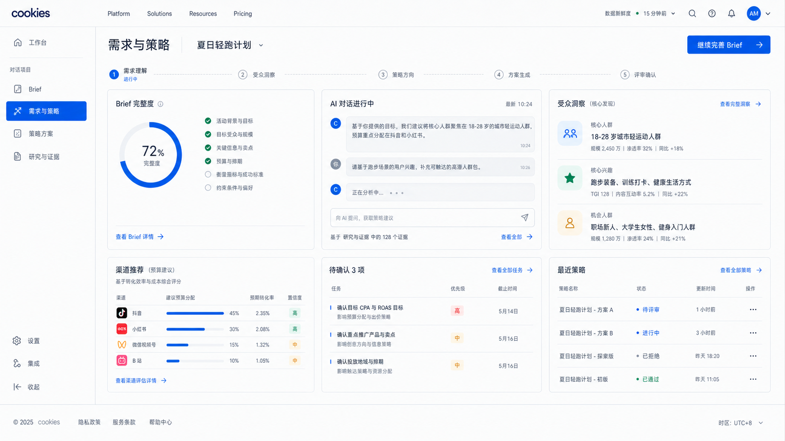
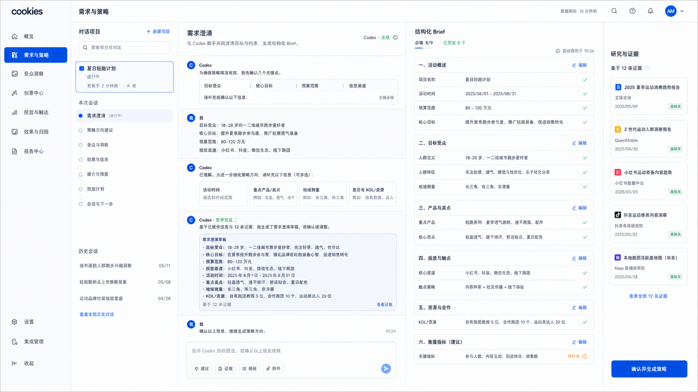
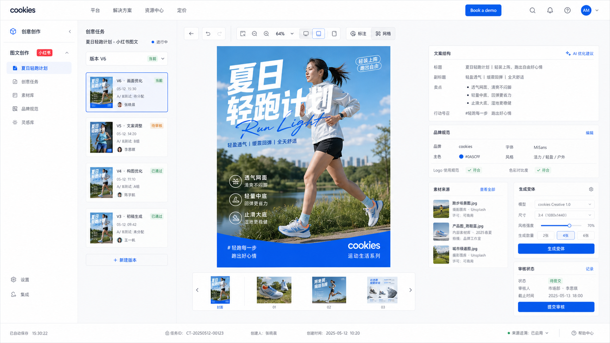
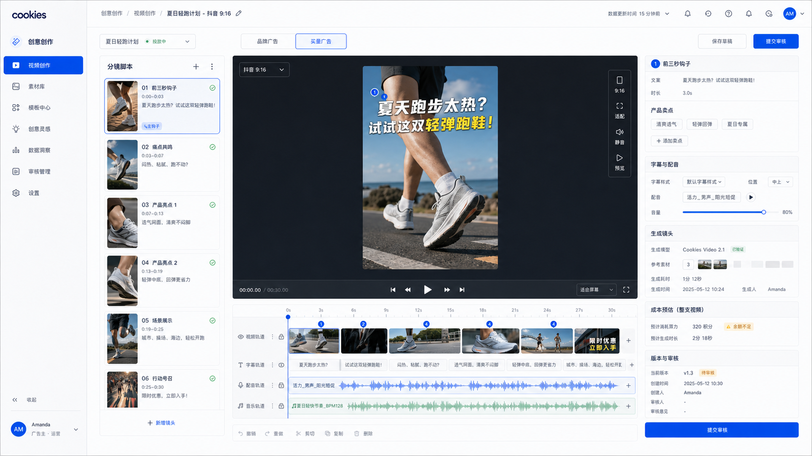
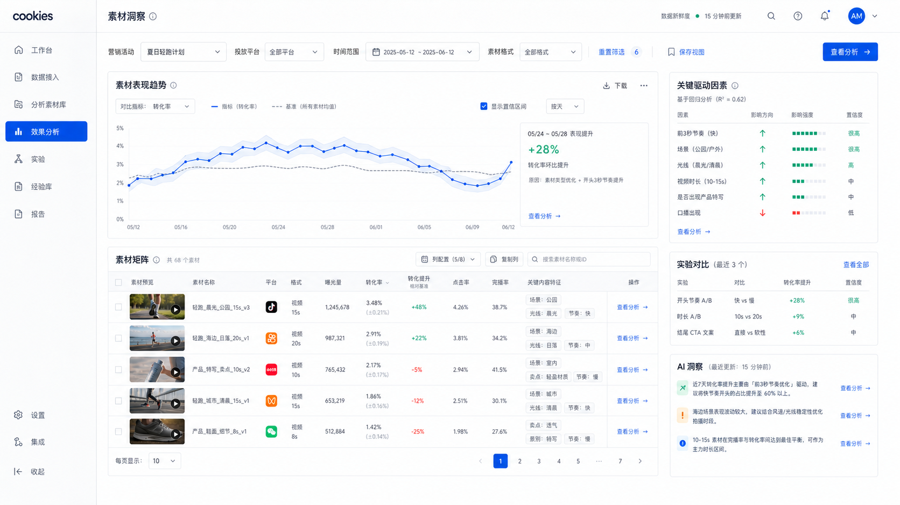
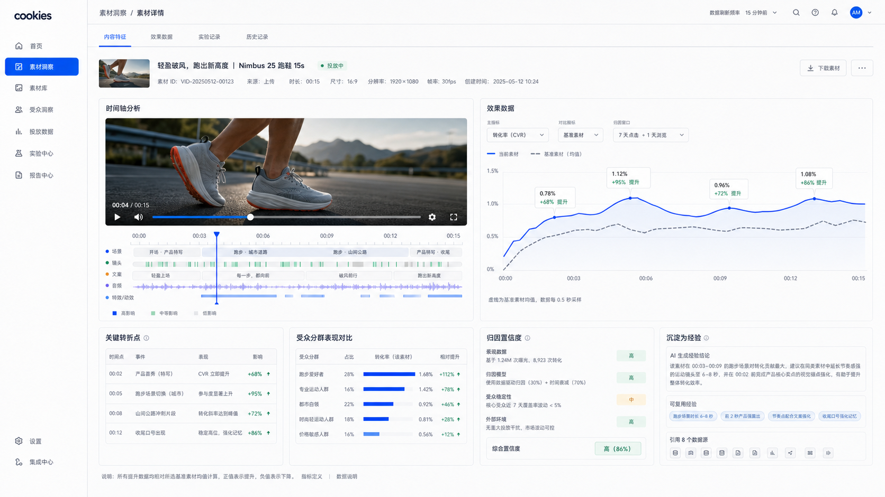
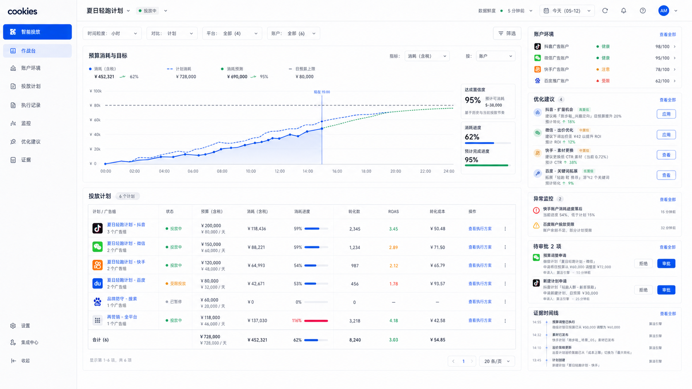
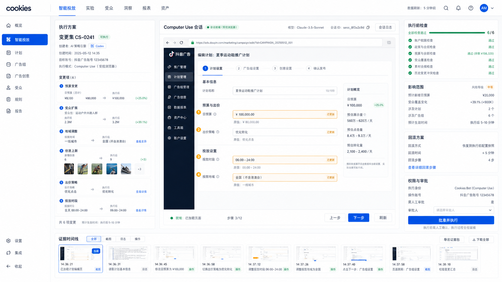

# cookies 四大模块概念图

> 文档状态：概念评审 
> 生成日期：2026-07-20 
> 视觉基线：[Intelligent Blueprint / 智能蓝图](../DESIGN.md) 
> 设备范围：桌面 Web，1440px 设计基准

本组概念图用于验证钴蓝、矿物灰与精确数据表达在四个独立业务系统中的延展效果，不是最终交互稿。图中的字段、指标和流程仍需在详细页面设计阶段与 PRD 对齐。

## 1. 需求收集及策略分析

### 1.1 策略工作台

验证重点：用 Brief 完整度、进行中的 AI 对话、受众洞察、渠道建议、待确认事项和最近策略构成任务总览。钴蓝表达当前阶段与下一步动作，证据和业务信息保持矿物灰层级。

### 1.2 对话、Brief 与证据联动

验证重点：Codex 对话不是普通聊天窗口，而是和结构化 Brief、研究证据实时联动的专业工作区。AI 结论、来源与人工确认保持同时可见。

## 2. 广告创意创作

### 2.1 图文创意工作室

验证重点：以创意画布为中心，左右承载任务版本、文案结构、品牌规范、素材来源、生成变体和审核状态。适用于小红书图组，也可延展到公众号图文。

### 2.2 效果广告视频工作室

验证重点：保留智能蓝图的浅色产品壳层，只在视频预览区域使用局部深色环境。该图验证通用效果广告编辑器的分镜、时间线、字幕、配音、生成成本和审核；数字人、广告前贴、爆款视频复刻的专属概念图需按新版 PRD 另行生成。图内“买量广告”为生成时旧术语，产品界面统一使用“效果广告”。

## 3. 广告素材经验与数据分析

### 3.1 素材洞察总览

验证重点：页面先回答“发生了什么”和“为什么”。一个主要趋势图与素材矩阵直接联动，右侧展示关键驱动因素、实验结论与带置信度的 AI 洞察。

### 3.2 单素材时间轴分析

验证重点：视频内容特征与效果曲线共享同一时间轴，帮助用户定位前三秒钩子、产品展示、场景变化等内容因素如何影响转化，并将结论沉淀为可复用经验。

## 4. 广告智能投放

### 4.1 投放作战台

验证重点：预算进度和效果趋势是主视图，计划表、账户环境、优化建议、异常、审批与证据时间线围绕真实操作展开。语义色只承担健康、风险和阻断状态。

### 4.2 Computer Use 执行审查

验证重点：变更集、受控浏览器、执行前检查、影响范围、回滚方案和证据记录同时可见。系统不会把高风险投放动作包装成“一键自动化”，必须由用户批准后执行。

## 5. 跨模块观察

- 四个系统共享顶栏、字体、按钮、状态与钴蓝品牌语言，但左侧导航和核心页面结构各自独立。
- 需求与策略偏对话和文档，创意创作偏画布和时间线，素材洞察偏图表和矩阵，智能投放偏计划、风险和证据。
- 高级感主要来自精确对齐、充足信息层级、低圆角与克制色彩，不依赖阴影、渐变或大面积装饰。
- 目前概念图已证明浅色矿物灰可以覆盖高密度工作；创意视频只需局部深色，不需要全局暗色主题。
- 下一阶段应选择每个模块最重要的 1 至 2 个页面转成可交互原型，并逐项补全状态、权限和异常流程。

## 6. 生成提示词集

全部使用内置 Imagegen 的 `ui-mockup` 模式，并将已选定的智能蓝图方案图作为视觉参考。共同约束为：1440px 桌面端、矿物灰基底、钴蓝交互、深海军蓝文字、MiSans/Geist 气质、细边界、低圆角、高信息密度、无移动端、无通用 AI 渐变、无玻璃拟态、无机器人和无巨型指标卡片。

| 图号 | 最终提示词核心 |
| --- | --- |
| 01 | 生成“需求与策略”桌面工作台，展示 Brief 完整度、AI 对话、受众洞察、渠道建议、待确认事项、最近策略和证据新鲜度。 |
| 02 | 生成三栏需求澄清工作区，将 Codex 对话、结构化 Brief 和 12 条研究证据实时联动，并保留人工确认。 |
| 03 | 生成小红书图文创意工作室，以 3:4 画布为中心，包含任务版本、图组缩略图、品牌规范、素材来源、生成变体和审核。 |
| 04 | 生成抖音 9:16 效果广告工作室，包含局部深色预览、分镜、时间线、字幕、配音、生成成本、版本与审核。 |
| 05 | 生成素材洞察总览，以素材表现趋势和素材矩阵为主体，展示关键驱动因素、实验对比、AI 洞察和数据新鲜度。 |
| 06 | 生成单条 15 秒视频的素材详情，将视频特征时间轴与转化效果曲线同步，展示转折点、受众对比、归因置信度和经验沉淀。 |
| 07 | 生成智能投放作战台，以预算进度和效果趋势为主，包含计划表、账户健康、优化建议、异常、审批和证据时间线。 |
| 08 | 生成 Computer Use 执行审查页，三栏展示变更集、受控广告平台会话、风险与审批，并包含影响范围、回滚和证据记录。 |
