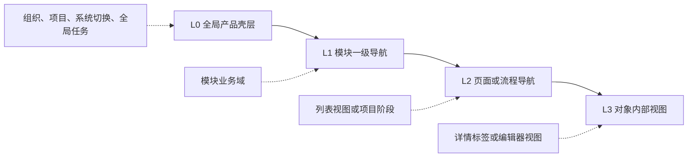

# cookies 四大模块导航与信息架构

> 文档状态：设计基线<br>
> 适用范围：桌面 Web，最低 1280px，1440px 设计基准<br>
> 关联规范：[DESIGN.md](../DESIGN.md)<br>
> 关联文档：[项目总纲](./00-project-overview.md)、[共享基座](./05-shared-foundation.md)

## 1. 目标

cookies 的四个业务模块都是完整垂直系统，必须拥有独立导航、路由、权限和工作状态。同时，用户需要在四个系统之间保持一致的方向感。

本规范解决三个问题：

1. 明确共享顶栏与模块导航的职责边界。
2. 明确一级、二级、三级导航分别承载什么信息。
3. 给出四个模块的完整导航树、路由和页面分布。

## 2. 总体导航模型



### 2.1 L0：全局产品壳层

L0 始终位于页面顶部，高度 56px，由共享基座维护，不属于任何业务模块。

| 区域 | 内容 | 行为 |
| --- | --- | --- |
| 左侧 | cookies 标志、组织切换、项目上下文 | 标志返回当前模块首页；切换上下文前检查未保存内容 |
| 系统切换器 | 需求与策略、创意创作、素材洞察、智能投放 | 切换到目标系统上次访问页面；无权限的系统不可点击 |
| 中部 | 全局搜索或命令入口 | 搜索跨系统对象，结果明确显示所属系统 |
| 右侧 | Agent 任务、审批、通知、帮助、个人菜单 | 打开共享抽屉或独立管理页，不挤占模块侧栏 |
| 管理入口 | 仅管理员可见 | 进入 `/admin/*`，不复制到业务模块设置中 |

### 2.2 L1：模块一级导航

- 使用左侧固定侧栏，展开宽度 232px，收起宽度 64px。
- L1 表示稳定业务域，例如“策略中心”“视频创作”“效果分析”“执行中心”。
- 同一版本内不随对象、筛选条件或用户偏好改变顺序。
- 当前项使用 `cobalt.50` 背景、`cobalt.700` 文字与图标，不使用粗彩色侧边线。
- 导航可分为“工作”“生产或分析”“输出”“治理”视觉分组，分组标题不计入导航层级。
- 设置和能力运营固定在侧栏底部，与高频工作入口分开。
- 展开状态显示图标与文字，收起状态仅显示图标和 Tooltip。

### 2.3 L2：页面或流程导航

L2 位于页面标题下方，使用横向标签或紧凑视图切换，不再增加第二条固定侧栏。

L2 有两种互斥模式：

| 页面类型 | L2 内容 | 示例 |
| --- | --- | --- |
| 集合页 | 列表视图、状态或对象类型 | 全部、进行中、等待用户、已完成、归档 |
| 项目或任务详情 | 稳定流程阶段 | 概览、Brief、策略、评审、变更记录 |

- 同一页面只显示一种 L2 模式。
- 常用项最多展示 7 个，更多项进入“更多”菜单，但关键流程步骤不得被隐藏。
- 数量徽标只用于需要用户处理的状态，例如“待我评审 3”，不为所有标签显示总数。
- L2 切换应保留 L1、组织、项目和主要筛选上下文。

### 2.4 L3：对象内部视图

L3 只在具体对象、产物或编辑器内部出现，使用局部标签、分段控件或检查器导航。

- L3 不进入全局面包屑，也不创建第三条侧栏。
- 常见内容包括“内容、版本、证据、评论、运行记录”和编辑器的“脚本、分镜、时间线”。
- 同时可见项建议不超过 5 个；低频项进入对象操作菜单。
- L3 切换不销毁编辑状态，未保存修改必须保持或明确提示。
- 如果一个对象只需要一个视图，则不显示 L3。

### 2.5 页面骨架

```text
┌──────────────────────────────────── L0 全局顶栏 56px ────────────────────────────────────┐
├──────── L1 模块侧栏 232px ────────┬──────────────── 页面标题、主操作 ────────────────────┤
│ 模块名称                           │ 面包屑 / 对象名称 / 状态 / 主要操作                   │
│                                    ├──────────────── L2 页面或流程导航 44px ──────────────┤
│ 工作区                             │                                                        │
│  一级入口                          │  主内容区                                               │
│  一级入口                          │  ┌──────── L3 对象内部视图，仅在需要时出现 ──────────┐ │
│                                    │  │ 内容、版本、证据、评论、运行记录                   │ │
│ 输出区                             │  └───────────────────────────────────────────────────┘ │
│ 治理区                             │                                                        │
└────────────────────────────────────┴────────────────────────────────────────────────────────┘
```

## 3. 需求收集及策略分析

路由前缀：`/strategy/*`

### 3.1 一级导航分组

| 分组 | L1 一级导航 |
| --- | --- |
| 工作 | 策略工作台、策略项目 |
| 资产与方法 | 需求中心、策略中心、研究洞察 |
| 协作 | 评审中心 |
| 治理 | 能力运营、系统设置 |

原“对话项目”统一命名为“策略项目”。对话仍是默认工作方式，但项目还包含 Brief、研究、策略、实验和评审，不应被命名限制。

### 3.2 完整导航树

| L1 一级导航 | L2 集合页或流程 | L3 对象内部视图 | 路由 |
| --- | --- | --- | --- |
| 策略工作台 | 我的待办、项目进度、最近产物、质量与用量 | 无，工作台组件直接下钻 | `/strategy/home` |
| 策略项目 | 全部、进行中、等待用户、待评审、已完成、归档 | 项目详情见 3.3 | `/strategy/projects/*` |
| 需求中心 | Brief 列表、待补充、待确认、版本库、冲突队列 | 字段、来源、完整度、版本差异、确认记录 | `/strategy/briefs/*` |
| 策略中心 | 策略库、渠道策略、方案对比、实验方案、版本库 | 方案内容、受众、信息主张、渠道与预算、测量、版本与交付 | `/strategy/strategies/*` |
| 研究洞察 | 受众、竞品、行业、资料来源、研究任务 | 结论、证据、假设、时效性、引用记录 | `/strategy/research/*` |
| 评审中心 | 待我评审、我发起的、评论与提及、已完成、变更记录 | 内容、版本差异、评论、审批记录 | `/strategy/reviews/*` |
| 能力运营 | 领域 Skills、行业模板、字段规则、评测集、质量看板 | 版本、依赖、发布、评测、运行记录 | `/strategy/operations/*` |
| 系统设置 | 字段配置、状态规则、通知、导出模板 | 无 | `/strategy/settings/*` |

### 3.3 策略项目详情

打开 `/strategy/projects/:projectId/*` 后，L2 从列表状态切换为项目流程：

`概览 → 对话 → Brief → 研究 → 策略 → 实验 → 评审 → 变更记录`

| L2 项目阶段 | L3 局部视图 |
| --- | --- |
| 概览 | 进度、待办、关键产物、风险 |
| 对话 | 当前会话、历史会话、Skill 运行、引用 |
| Brief | 当前版本、字段、来源、差异、确认记录 |
| 研究 | 受众、竞品、行业、证据、假设 |
| 策略 | 方向、渠道、预算、内容主张、测量、版本 |
| 实验 | 假设、变量、样本、指标、方案 |
| 评审 | 待确认、评论、审批、退回记录 |
| 变更记录 | 产物版本、操作者、AI 运行、跨系统交接 |

默认进入“对话”，但首次进入未创建会话的项目时进入“概览”。

## 4. 广告创意创作

路由前缀：`/creative/*`

### 4.1 一级导航分组

| 分组 | L1 一级导航 |
| --- | --- |
| 工作 | 创意工作台、创意任务 |
| 创作 | 图文创作、视频创作、制作中心 |
| 协作与输出 | 评审中心、交付中心 |
| 治理 | 创意运营、系统设置 |

### 4.2 完整导航树

| L1 一级导航 | L2 集合页或流程 | L3 对象内部视图 | 路由 |
| --- | --- | --- | --- |
| 创意工作台 | 我的任务、生产进度、待评审、最近交付、用量与质量 | 无 | `/creative/home` |
| 创意任务 | 全部、进行中、等待输入、生成中、待评审、已完成、失败、归档 | 任务详情见 4.3 | `/creative/tasks/*` |
| 图文创作 | 小红书、公众号、草稿箱、图文版本 | 方向、文案、画布、图组或排版、素材、变体、检查 | `/creative/image-text/*` |
| 视频创作 | 品牌广告制作、效果广告制作、视频草稿、视频版本 | 品牌：故事、剧本、视觉开发、分镜、制作、后期；效果：数字人、广告前贴、爆款视频复刻 | `/creative/video/*` |
| 制作中心 | 图片生成、视频生成、音频生成、渲染队列、源素材、失败任务 | 任务详情、输入、参数、输出、成本、运行日志 | `/creative/production/*` |
| 评审中心 | 待我评审、我发起的、评论与提及、退回记录、已完成 | 内容、版本差异、逐帧或逐段评论、审核记录 | `/creative/reviews/*` |
| 交付中心 | 待交付、发布包、投放包、下载记录、停用版本 | 内容清单、规格校验、授权、引用方、下载记录 | `/creative/deliveries/*` |
| 创意运营 | 渠道规则、领域 Skills、模板、品牌规则映射、评测集、质量看板 | 版本、适用范围、发布、评测、运行记录 | `/creative/operations/*` |
| 系统设置 | 默认规格、命名、通知、评审流、交付规则 | 无 | `/creative/settings/*` |

### 4.3 创意任务详情

打开 `/creative/tasks/:taskId/*` 后，L2 使用统一生产流程：

`概览 → 创意方向 → 内容编辑 → 制作素材 → 变体 → 检查 → 评审 → 交付 → 效果回流`

| L2 阶段 | 图文任务 L3 | 视频任务 L3 |
| --- | --- | --- |
| 创意方向 | 策略来源、方向候选、选定方向 | 策略来源、品牌或效果类型、功能、方向候选 |
| 内容编辑 | 文案、封面、图组或文章、排版 | 品牌：故事与电影剧本；效果：功能专属脚本与编辑器 |
| 制作素材 | 图片、版式、源素材、生成任务 | 视频片段、图片、音频、3D、生成任务 |
| 变体 | 渠道规格、文案变体、视觉变体 | 故事提案变体，或钩子、数字人、前贴结构、节奏、CTA 和渠道变体 |
| 检查 | 品牌、事实、合规、渠道规格 | 品牌、事实、合规、声音、渠道规格 |
| 评审 | 评论、版本差异、审核记录 | 逐帧评论、版本差异、审核记录 |
| 交付 | 发布包、投放包、下载、引用方 | 母版、渠道包、投放包、引用方 |
| 效果回流 | 素材洞察、投放结果 | 品牌指标，或按数字人、前贴、爆款复刻查看转化、疲劳和经验 |

图文创作和视频创作必须保持 L1 平级；“品牌广告制作”与“效果广告制作”保持视频创作下的固定 L2 入口。

### 4.4 视频创作专属导航

#### 品牌广告制作

入口：`/creative/video/brand`

品牌广告列表页的 L3 为：`全部故事、故事提案、制作中、待评审、已完成`。

进入品牌广告任务后，L3 切换为电影感故事生产流程：

`故事设定 → 故事提案 → 电影剧本 → 视觉开发 → 分镜设计 → 角色与场景 → 镜头制作 → 剪辑与声音 → 调色与检查 → 版本`

| L3 工作区 | 主要内容 |
| --- | --- |
| 故事设定 | 品牌主题、世界观、受众、情绪、时长、品牌角色 |
| 故事提案 | Logline、梗概、人物关系、冲突、品牌进入方式 |
| 电影剧本 | 场景、动作、对白、节奏、情绪曲线、记忆点 |
| 视觉开发 | 影像风格、角色、服装、产品、场景、光线、色彩、道具 |
| 分镜设计 | 故事板、镜头、景别、机位、运动、时长、转场 |
| 角色与场景 | 身份参考、产品参考、场景参考和跨镜头一致性 |
| 镜头制作 | 低成本预演、候选镜头、逐镜生成、失败重试、来源 |
| 剪辑与声音 | 剪辑、音乐、对白、环境声、音效、字幕、品牌声音 |
| 调色与检查 | 色彩统一、故事、品牌、事实、授权、渠道和合规检查 |
| 版本 | 母版、渠道版、差异、评论、批准和交付 |

#### 效果广告制作

入口：`/creative/video/performance`

效果广告列表页的 L3 为：`全部任务、数字人、广告前贴、爆款视频复刻、草稿、待审核`。

| 功能 | 路由 | 任务内 L3 流程 |
| --- | --- | --- |
| 数字人 | `/creative/video/performance/digital-human` | 商品与目标、口播脚本、数字人与声音、场景与商品、生成、字幕与贴片、变体、检查、版本 |
| 广告前贴 | `/creative/video/performance/pre-roll` | 目标与时长、结构模板、开场钩子、卖点与证明、画面与贴片、声音与字幕、变体、检查、版本 |
| 爆款视频复刻 | `/creative/video/performance/viral-remake` | 参考导入、结构拆解、可复用机制、品牌映射、原创改写、分镜与素材、生成、相似性与版权检查、版本 |

“爆款视频复刻”只允许复用可解释的结构、节奏和表达机制，不允许复制未经授权的画面、人物、声音、音乐、台词或品牌资产。

## 5. 广告素材经验与数据分析

路由前缀：`/insights/*`

### 5.1 一级导航分组

| 分组 | L1 一级导航 |
| --- | --- |
| 工作 | 洞察工作台 |
| 数据与分析 | 数据接入、分析素材库、内容分析、效果分析、实验中心 |
| 经验与输出 | 洞察与经验、报告中心 |
| 治理 | 数据质量、能力运营、系统设置 |

### 5.2 完整导航树

| L1 一级导航 | L2 集合页或流程 | L3 对象内部视图 | 路由 |
| --- | --- | --- | --- |
| 洞察工作台 | 数据概况、待处理、最近洞察、疲劳预警、经验使用 | 无 | `/insights/home` |
| 数据接入 | 数据源、导入任务、素材映射、字段映射、同步记录 | 配置、字段、映射、同步历史、错误记录 | `/insights/data-sources/*` |
| 分析素材库 | 全部素材、待匹配、待提取、特征库、版本关系 | 概览、预览、内容特征、效果数据、版本、血缘 | `/insights/assets/*` |
| 内容分析 | 小红书、公众号、品牌广告、数字人、广告前贴、爆款复刻、单素材拆解 | 结构、文本、视觉、音频、节奏、品牌、转化与合规 | `/insights/content/*` |
| 效果分析 | 指标总览、素材对比、Cohort、趋势、疲劳、异常 | 趋势、分群、驱动因素、置信度、数据来源 | `/insights/performance/*` |
| 实验中心 | 实验列表、A/B 变体、变量矩阵、样本检查、实验结论 | 设计、样本、指标、结果、归因、结论 | `/insights/experiments/*` |
| 洞察与经验 | 待确认、已确认、待复审、已失效、引用记录 | 结论、证据、适用条件、反例、版本、引用 | `/insights/experiences/*` |
| 报告中心 | 任务复盘、周期报告、自定义报告、导出记录 | 章节、数据来源、协作、版本、导出 | `/insights/reports/*` |
| 数据质量 | 数据新鲜度、缺失、异常、口径、对账、修复队列 | 影响范围、根因、处理记录、重跑结果 | `/insights/data-quality/*` |
| 能力运营 | 特征体系、指标字典、分析 Skills、评测集、质量看板 | 定义、版本、依赖、评测、运行记录 | `/insights/operations/*` |
| 系统设置 | 样本门槛、观察窗口、通知、确认权限、报告模板 | 无 | `/insights/settings/*` |

### 5.3 素材与分析项目详情

打开 `/insights/assets/:assetId/*` 或 `/insights/projects/:analysisId/*` 后，L2 为：

`概览 → 内容拆解 → 效果趋势 → 对比组 → 实验 → 洞察 → 经验引用 → 数据与方法`

| L2 阶段 | L3 局部视图 |
| --- | --- |
| 内容拆解 | 时间轴、文本、视觉、音频、品牌、合规 |
| 效果趋势 | 指标、平台、受众、时间、渠道、置信区间 |
| 对比组 | 基线、候选、变量、差异、可比性检查 |
| 实验 | 设计、样本、结果、归因、结论 |
| 洞察 | 候选、证据、适用条件、反例、确认记录 |
| 经验引用 | 被策略引用、被创意引用、被投放引用、效果反馈 |
| 数据与方法 | 截止时间、指标版本、Cohort、算法或 Skill、运行记录 |

“分析素材库”是分析索引，不增加文件夹、回收站等网盘式导航。

## 6. 广告智能投放

路由前缀：`/delivery/*`

### 6.1 一级导航分组

| 分组 | L1 一级导航 |
| --- | --- |
| 作战 | 投放作战台、投放计划、执行中心 |
| 监控与优化 | 监控告警、优化中心 |
| 账户与治理 | 账户与环境、审批中心、证据与审计 |
| 系统运营 | 平台能力运营、系统设置 |

### 6.2 完整导航树

| L1 一级导航 | L2 集合页或流程 | L3 对象内部视图 | 路由 |
| --- | --- | --- | --- |
| 投放作战台 | 今日概览、预算进度、异常、待办、最近执行 | 无 | `/delivery/home` |
| 投放计划 | 草稿、待校验、待批准、运行中、已暂停、已结束、计划模板 | 计划详情见 6.3 | `/delivery/plans/*` |
| 执行中心 | 待执行、执行中、等待用户、结果未知、失败、已完成 | 变更项、会话、实时步骤、接管、结果、证据 | `/delivery/executions/*` |
| 监控告警 | 实时状态、预算、效果、拒审、追踪、素材疲劳、告警规则 | 指标、影响范围、原因、处置、时间线 | `/delivery/monitoring/*` |
| 优化中心 | 待处理建议、已采纳、观察中、已拒绝、效果跟踪 | 依据、影响预估、ChangeSet、审批、效果 | `/delivery/optimizations/*` |
| 账户与环境 | 广告账户、平台资产、登录状态、执行设备、环境检查 | 映射、权限、会话、健康、执行历史 | `/delivery/environments/*` |
| 审批中心 | 待我审批、我发起的、预算审批、紧急动作、已过期、已完成 | 差异、风险、影响、审批链、签名与记录 | `/delivery/approvals/*` |
| 证据与审计 | 执行时间线、页面证据、差异、平台对象、导出 | 截图、结构化日志、操作者、关联对象、校验结果 | `/delivery/evidence/*` |
| 平台能力运营 | 抖音 Skill、快手 Skill、能力矩阵、回归测试、故障开关 | 版本、页面适配、用例、运行结果、发布 | `/delivery/operations/*` |
| 系统设置 | 预算护栏、风险等级、通知、监控频率、命名规则 | 无 | `/delivery/settings/*` |

### 6.3 投放计划详情

打开 `/delivery/plans/:planId/*` 后，L2 为：

`概览 → 配置 → 创意 → 校验 → ChangeSet → 审批 → 执行 → 平台对象 → 监控 → 优化 → 证据`

由于步骤较多，桌面端将“概览、配置、创意、校验、执行、监控”固定展示，其余入口进入“更多”，但存在待处理状态的入口必须自动提升为可见项。

| L2 阶段 | L3 局部视图 |
| --- | --- |
| 配置 | 目标、账户、预算、受众、版位、排期、转化 |
| 创意 | 已选版本、渠道适配、素材状态、替换记录 |
| 校验 | 字段、权限、预算护栏、平台规则、风险 |
| ChangeSet | 变更项、执行顺序、前后差异、影响预估 |
| 审批 | 风险、审批链、意见、签名、过期时间 |
| 执行 | Computer Use 会话、步骤、接管、暂停、结果 |
| 平台对象 | 计划、广告组、广告、创意、平台 ID 映射 |
| 监控 | 预算、效果、状态、告警、数据新鲜度 |
| 优化 | 建议、依据、预计影响、观察窗口、效果 |
| 证据 | 页面截图、结构化日志、差异、审计、导出 |

执行中心与投放计划保持分离：计划表达业务意图，执行中心表达 Codex 与 Computer Use 的运行状态。

## 7. 导航交互设计

### 7.1 面包屑

- 只表达 `模块 / L1 / 当前对象`，不重复 L2 和 L3。
- 示例：`创意创作 / 视频创作 / 夏日轻跑计划 V6`。
- 当前对象不可点击；上级可返回并恢复原列表筛选和滚动位置。

### 7.2 状态记忆

- 每个系统记住用户上次访问的 L1 页面。
- 集合页保存 L2 视图、筛选、排序、列配置和分页位置。
- 项目或任务保存上次打开的 L2 阶段与 L3 视图。
- 跨系统跳转携带来源对象 ID 和返回地址，不复制来源数据。
- 浏览器后退必须恢复上下文，不返回默认首页。

### 7.3 权限与能力开关

- 无查看权限的 L1 入口隐藏；有查看权限但无编辑权限时保留入口并将页面设为只读。
- 因功能未启用而不可用的入口隐藏，不显示永久禁用项。
- 因临时状态不可操作的动作禁用，并说明原因和恢复条件。
- 导航数量徽标必须经过当前用户权限过滤。
- 管理员能力仍在 `/admin/*`，业务系统只提供有上下文的跳转链接。

### 7.4 导航状态

每个导航项需要覆盖：默认、悬停、焦点、当前、禁用、存在待办和收起侧栏状态。

| 状态 | 表达 |
| --- | --- |
| 默认 | `mineral.700` 文字与图标，透明背景 |
| 悬停 | `mineral.100` 背景 |
| 当前 | `cobalt.50` 背景，`cobalt.700` 文字与图标 |
| 键盘焦点 | 2px `cobalt.200` 外环 |
| 待办 | 右侧显示紧凑数字徽标，只统计需要当前用户处理的项目 |
| 禁用 | 降低对比度并提供原因 Tooltip，不用于权限隐藏 |

### 7.5 键盘与快捷入口

- `Cmd/Ctrl + K` 打开全局搜索和命令入口。
- `G` 后接系统快捷键可切换四个系统，但必须避免与编辑器输入冲突。
- L1、L2、L3 均支持方向键移动和 Enter 激活。
- 焦点顺序为 L0、L1、页面标题操作、L2、主内容、L3 或局部工具。
- 收起侧栏后，图标必须提供可访问名称和 Tooltip。

## 8. 路由与工程约束

### 8.1 路由结构

```text
/{system}/{primary}/{view}
/{system}/{primary}/{objectId}/{stage}?tab={localView}
```

示例：

```text
/strategy/projects/active
/strategy/projects/str_1024/brief?tab=sources
/creative/video/performance
/creative/tasks/cr_2048/content?tab=timeline
/insights/assets/as_4096/performance?tab=audience
/delivery/plans/dp_8192/execution?tab=evidence
```

### 8.2 实现约束

- L0 由共享壳层渲染，L1 由对应系统包渲染，L2 和 L3 由页面路由配置声明。
- 四个系统不能从一个全局菜单配置文件读取业务导航，避免错误耦合。
- 导航配置需要包含稳定 ID、文案、图标、路由、权限、Feature Flag、徽标来源和埋点 ID。
- 不使用数组索引作为导航 ID；重命名显示文案不能改变路由主键。
- 页面标题、面包屑和返回行为由路由元数据生成，允许页面补充对象名称和状态。
- 所有深层页面必须可通过 URL 直接恢复，不能依赖内存中前序操作。

## 9. 验收标准

1. 用户可从任一系统通过 L0 切换到其他系统，并返回上次工作上下文。
2. 每个系统的 L1 导航独立加载，不依赖其他业务系统页面可用。
3. 任一页面最多同时显示 L1、L2 和一个局部 L3，不出现多层嵌套侧栏。
4. 列表进入详情再返回时，筛选、排序、分页和滚动位置保持。
5. 直接访问三级路由可恢复组织、项目、对象和视图状态。
6. 导航权限、数量徽标和页面权限一致，不泄露无权访问对象的存在。
7. 1280px 与 1440px 桌面视口下，关键导航和主要操作不被遮挡。
8. 键盘用户可完成系统切换、一级导航、二级标签和三级视图切换。
9. 图文、视频、数据分析和 Computer Use 编辑器可以使用上下文面板，但不得把面板伪装成新的导航层级。
