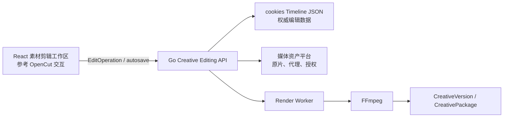

# cookies 视频素材剪辑与开源框架方案

| 属性 | 内容 |
| --- | --- |
| 产品位置 | 广告创意创作 → 视频创作 → 素材剪辑 |
| 路由前缀 | `/creative/video/editing/*` |
| 优先级 | P0 基础剪辑，P1 高级能力 |
| 文档版本 | v0.1 |
| 文档状态 | 草案 |

## 1. 产品定位

素材剪辑是视频创作下独立于“品牌广告制作”和“效果广告制作”的通用工作区。它不代表第三种广告类型，而是将用户上传素材、AI 生成镜头、历史授权素材和音频重新组合为可评审成片的制作工具。

它既可以从品牌广告或效果广告任务进入，也可以直接创建 EditTask 完成存量素材剪辑。输出统一形成 CreativeVersion，继续进入检查、评审、交付、素材分析和投放流程。

### 目标

1. 在 cookies 内完成广告视频最常用的粗剪、精简、拼接、字幕、音频和多比例适配。
2. 让 AI 生成镜头与人工素材进入同一时间线，保留来源、授权和版本血缘。
3. 支持 Codex 通过结构化 EditOperation 执行“删除停顿”“把卖点提前”“生成 9:16 版本”等可预览修改。
4. 预览与最终导出保持时序、裁切、字幕、字体、音量和转场一致。

### 非目标

- MVP 不替代 Premiere、DaVinci Resolve 等专业非线性编辑、复杂调色、节点合成和高级动态图形工具。
- 不直接修改或覆盖原始媒体；所有编辑均为非破坏性时间线操作。
- 不允许开源框架直接读取 cookies 数据库、Provider 凭据或跨 Project 素材。

## 2. 子模块

| 子模块 | 核心能力 | 优先级 | 展示形式 |
| --- | --- | --- | --- |
| 剪辑任务 | 新建、最近、草稿、渲染中、待评审、已完成、失败 | P0 | 状态数据表 + 素材缩略图 + 任务预览抽屉 |
| 素材箱 | 上传、项目素材、AI 生成镜头、图片、音频、授权和代理状态 | P0 | 左侧可检索素材列表，拖入时间线，不扩张为文件管理系统 |
| 时间线编辑 | 多轨、裁切、分割、移动、吸附、删除、间隙、转场、撤销重做 | P0 | 底部多轨时间线，支持缩放、波形和播放头 |
| 画面与画布 | 预览、比例、裁切、缩放、位置、背景、安全区和封面帧 | P0 | 中央预览为主，画布操作直接反馈 |
| 字幕与文字 | 自动字幕、校对、样式、模板、品牌字体、关键词强调和烧录 | P0 | 时间线字幕轨 + 右侧属性检查器 + 文本列表校对 |
| 音频 | 原声、配音、音乐、音效、音量、淡入淡出、静音和响度检查 | P0 | 音频轨与波形为主，属性检查器显示参数 |
| 转场与基础效果 | 淡入淡出、叠化、速度、透明度和少量广告常用效果 | P1 | 上下文素材库或属性检查器，不做效果商城 |
| AI 辅助剪辑 | 删除停顿、精彩片段、节奏建议、字幕生成、横竖版重构和批量变体 | P1 | 对话命令 + 结构化变更预览；用户确认后写入时间线 |
| 版本与导出 | 自动保存、时间线版本、差异、预览渲染、母版和渠道版本 | P0 | 顶栏保存状态 + 导出检查页 + 后台 RenderJob |

## 3. 编辑器布局

编辑器使用单一沉浸式工作区，不把素材、字幕、音频、效果拆成新的侧边导航：

```text
┌──────────────── 顶栏：任务、保存状态、撤销重做、预览、导出 ────────────────┐
├──── 素材箱 248px ────┬──────── 中央画面预览 ────────┬── 属性检查器 288px ─┤
│ 项目/生成/上传/音频   │ 比例、安全区、选中对象操控    │ 画面/文字/音频/转场  │
├───────────────────────┴──────────────────────────────┴─────────────────────┤
│ 多轨时间线：视频、叠加、字幕、配音、音乐、音效；高度 240–320px             │
└────────────────────────────────────────────────────────────────────────────┘
```

- 首要视觉焦点为画面预览，第二焦点为时间线，第三焦点为选中对象属性。
- 属性检查器随选择变化，最多显示一组当前参数；高级设置渐进展开。
- 预览区域可局部使用深色背景，L0、标题栏和系统导航继续使用矿物灰设计语言。
- 1280px 下收起素材箱或属性检查器，不能缩成四个拥挤等宽面板。

## 4. 开源技术选型

### 4.1 建议组合

| 组件 | 角色 | 结论 |
| --- | --- | --- |
| [OpenCut](https://github.com/OpenCut-app/OpenCut) | React/Next.js 时间线、预览和编辑交互参考，MIT | **首选候选**。先做隔离技术验证，固定 commit 或 release；抽取可维护模块或维护 cookies fork，不追踪浮动 `main` |
| [FFmpeg](https://github.com/FFmpeg/FFmpeg) | 探测、代理、转码、合成、字幕、音频和最终导出 | **确定性渲染核心**。由受控 Render Worker 调用；发布前确认实际编译选项对应的 LGPL/GPL 义务 |
| [OpenTimelineIO](https://github.com/AcademySoftwareFoundation/OpenTimelineIO) | 与专业剪辑工具交换时间线 | **P2 可选**。其定位是剪辑时间线交换而非媒体容器，适合作为导入导出格式，不作为 Web 编辑器 |
| [Remotion](https://github.com/remotion-dev/remotion) | React 程序化视频与模板渲染 | **不作为默认底座**。当前许可对较大营利组织要求商业许可，只有在完成商务和法务评估后用于模板化视频 |

OpenCut 当前处于架构和导出链路持续演进阶段，因此不能把其完整应用直接嵌入 cookies，也不能让上游数据模型成为 cookies 的业务事实源。M0 技术验证必须覆盖时间线性能、预览一致性、导出能力、依赖边界、许可证和长期维护成本，再决定采用组件、fork 或仅参考交互实现。

### 4.2 推荐架构



- React 负责交互与近实时预览；Go 负责权限、Project Scope、版本、任务和审计。
- cookies 自有 Timeline JSON 是权威数据模型，至少包含帧率、画布、Track、Clip、时间范围、变换、音量、字幕、效果引用和素材版本。
- Render Worker 使用同一时间线快照产生代理预览和最终成片；浏览器不能成为唯一渲染路径。
- OpenCut 或其他开源代码放在独立适配层，不允许其类型泄露到 Creative API 和业务数据库。

## 5. 核心实体与接口

| 实体 | 说明 |
| --- | --- |
| EditTask | 剪辑目标、Project、渠道、负责人、来源任务和状态 |
| TimelineVersion | 不可变时间线快照、父版本、帧率、画布和变更摘要 |
| Track / Clip | 视频、图片、文字、字幕、配音、音乐、音效及时间范围 |
| EditOperation | 人工或 Codex 发起的结构化非破坏性编辑操作 |
| RenderJob | 输入时间线版本、输出规格、进度、成本、日志和结果 |

- `POST /api/creative/v1/edit-tasks`
- `GET/PATCH /api/creative/v1/edit-tasks/{id}`
- `POST /api/creative/v1/edit-tasks/{id}/operations:batch`
- `POST /api/creative/v1/edit-tasks/{id}/timeline-versions`
- `POST /api/creative/v1/edit-tasks/{id}/renders`
- `POST /api/creative/v1/edit-tasks/{id}/versions:submit`

所有写接口校验 `project_id`、素材访问权、时间线版本和乐观并发。AI 修改先返回 Operation Diff，用户确认后才能成为新 TimelineVersion。

## 6. MVP 范围

### P0

- 视频、图片、音频导入与代理生成。
- 3 条视频/叠加轨、字幕轨、配音轨、音乐与音效轨。
- 移动、裁切、分割、删除、吸附、缩放时间线、撤销与重做。
- 画布比例、基础裁切与定位，首期覆盖 9:16、16:9、1:1。
- 自动字幕与人工校对、品牌字幕样式、音量和淡入淡出。
- 自动保存、版本快照、低清预览、异步导出、失败重试。
- 逐帧评审、素材授权检查和渠道规格检查。

### P1

- 转场、速度、基础滤镜、关键帧和画中画。
- 删除停顿、精彩片段、节奏建议、横竖版智能重构。
- 批量替换钩子、CTA、字幕、配音和商品镜头。
- 时间线差异可视化与专业剪辑格式交换。

## 7. MVP 验收

1. 用户可以独立创建素材剪辑任务，也可以从品牌广告或效果广告任务携带素材进入。
2. 时间线所有媒体引用稳定 Asset ID/Version，原始素材不被覆盖。
3. 用户刷新或换设备后能恢复最近确认时间线，冲突不会静默覆盖。
4. 低清预览与最终导出在时序、裁切、字幕、字体和音轨上通过固定样例对比。
5. RenderJob 支持排队、取消、进度、失败原因、重试和部分代理复用。
6. 无权、过期或授权范围不符的素材无法预览、导出或跨 Project 使用。
7. OpenCut 技术验证有固定版本、许可证清单、性能基线、上游变更策略和退出方案。

## 8. 变更记录

| 版本 | 日期 | 说明 |
| --- | --- | --- |
| v0.1 | 2026-07-21 | 新增独立素材剪辑产品模块，确定 OpenCut 候选编辑框架与 FFmpeg 渲染架构 |
