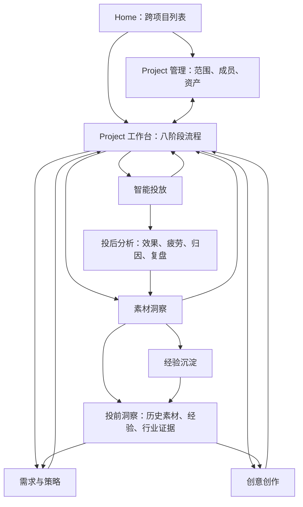
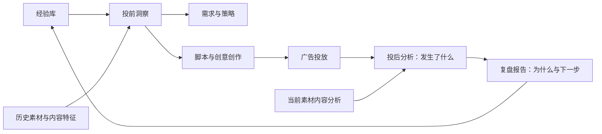

# Project 中心化页面路径整改规划

> 文档状态：评审中
> 决策日期：2026-07-23
> 适用范围：Home、Project 管理、Project 工作台、需求与策略、创意创作、素材洞察、智能投放
> 关联规范：[设计系统](../DESIGN.md)、[项目与品牌域](./08-project-brand-domain.md)、[模块导航架构](./19-module-navigation-architecture.md)、[模块子板块分析](./20-module-submodule-analysis.md)
> 验证依据：当前前端代码、服务端对象、14 条核心页面路径的浏览器验收，以及 5 组 L2 标签行为对比

## 1. 规划结论

cookies 采用 Project 中心化的信息架构。Project 不是第五个业务模块，而是需求、策略、创意、洞察和投放的共同上下文根。

页面层级固定为：



核心决策：

1. Home 负责跨项目创建、筛选、切换和项目管理入口。
2. Project 管理负责项目边界、职责、资产总账和服务端项目版本。
3. Project 工作台是唯一总工作台，负责展示八阶段闭环、当前阶段、链路缺口和下一步。
4. 四个业务模块只负责执行，不再拥有模块工作台，也不复制完整项目流程。
5. 素材洞察不是线性流程尾部。投前洞察支持需求、策略和创意；投后分析接收投放数据并沉淀经验。
6. 模块页面必须显示轻量 Project 上下文和返回工作台入口，但不重新显示八阶段流程图。
7. 所有 L2 标签必须真实改变内容、筛选或对象状态；未实现的标签必须隐藏。
8. 所有流程节点必须落到能够完成该阶段门槛的页面，不能只跳到相邻的列表页。

## 2. 当前审查结果

### 2.1 总体评分

| 范围 | 当前清晰度 | 结论 |
| --- | ---: | --- |
| Home → Project 管理 | 4.5 / 5 | 清楚，已区分“进入工作台”和“管理” |
| Project 管理 → Project 工作台 | 4.5 / 5 | 清楚，支持双向跳转 |
| Project 工作台八阶段 | 4 / 5 | 阶段、输入、输出和门槛可理解 |
| 阶段 → 业务页面 | 2.5 / 5 | 多处 CTA 与完成门槛不一致 |
| 模块内部导航 | 2.5 / 5 | 存在重叠命名、通用模板和假标签 |
| 路演可靠性 | 2 / 5 | 部分点击只有选中态或 URL 变化 |

### 2.2 已验证的假路径

浏览器点击后，以下标签只改变 URL 和选中态，主内容不变：

| 页面 | 标签切换 | 当前结果 |
| --- | --- | --- |
| 投后分析（现“效果分析”） | 指标总览 → 素材对比 | 内容不变 |
| 报告中心 | 任务复盘 → 周期报告 | 内容不变 |
| 投放计划 | 全部计划 → 待审批 | 内容不变 |
| 审批中心 | 待我审批 → 已完成 | 内容不变 |

已验证的真实切换：

| 页面 | 标签切换 | 当前结果 |
| --- | --- | --- |
| 视频创作 | 效果广告 → 素材剪辑 | 内容和工作区真实变化 |

### 2.3 横向共性问题

| 编号 | 问题 | 用户影响 | 解决方案 | 优先级 |
| --- | --- | --- | --- | --- |
| G-01 | 模块页缺少显式 Project 面包屑 | 用户知道模块，但不知道为何来到这里及如何回到流程 | 页头增加 `Project / 当前阶段 / 模块 / 页面`，Project 和阶段可点击 | P0 |
| G-02 | 流程 CTA 与完成门槛不一致 | 点击后无法完成阶段，产生断链 | 每个节点绑定一个阶段落地页，落地页提供完成门槛检查和业务深链 | P0 |
| G-03 | 未实现 L2 标签仍可点击 | 路演时看起来像失效 | 未实现即隐藏；实现后必须改变数据集、工作区或对象状态 | P0 |
| G-04 | 通用模板复用到不同业务域 | 四个模块看起来相似，页面语义错误 | P0 页面拆成业务专用工作区，通用组件只复用控件和状态，不复用业务布局 | P0 |
| G-05 | `Mock 状态` 控件暴露在路演页面 | 用户误以为是正式功能 | 仅在开发模式或 `?debug=states` 下展示 | P0 |
| G-06 | 集合页与详情页路由混用 | 页面像详情但没有对象 ID，刷新后上下文不稳定 | 列表使用集合路由，详情必须包含对象 ID | P0 |
| G-07 | 普通用户看到运营和系统设置 | 导航过长，主路径被治理入口稀释 | 按角色和 Feature Flag 控制能力运营、平台运营、系统设置 | P1 |
| G-08 | 页面缺少稳定的上游与下游交接条 | 用户看到了内容，不知道来源和下一步 | 详情页显示上游对象、当前输出、门槛和下一步 CTA | P0 |
| G-09 | 日期、Project 阶段和 mock 数据口径不统一 | 状态可信度下降 | 所有页面从统一 Project、任务、产物和 ChangeSet 对象派生 | P0 |
| G-10 | 旧导航文档仍描述模块工作台 | 后续开发可能恢复已废弃结构 | 以本文为整改基线，并同步更新 19、20 号文档 | P0 |

## 3. 八阶段目标路径

本节及各模块中的模块路由省略共同前缀 `/projects/:projectId`，实现时必须带上当前 Project ID。

八阶段是广告生产与投放的主干。素材洞察以两条支持链参与主干：

- 投前洞察贯穿阶段 01 至 04，为 Brief、策略、脚本、创意和素材生成提供历史证据与经验。
- 投后分析承接阶段 06 的投放数据，完成阶段 07、08，并将经验回流下一轮投前洞察。

| 阶段 | 当前落点 | 当前问题 | 目标落点与页面责任 | 阶段完成条件 | 优先级 |
| --- | --- | --- | --- | --- | --- |
| 01 需求下达 | `/strategy/tasks` | 只突出策略任务，无法同时完成 Brief | `/strategy/briefs/:briefId`，完成需求字段、来源、冲突和确认，并引用投前洞察；确认后提供“创建策略任务” | Brief 已确认，策略任务已创建，洞察引用可追溯 | P0 |
| 02 脚本创作 | `/creative/tasks` | 只有任务状态，没有脚本与分镜编辑 | `/creative/tasks/:taskId/script`，继承 Brief、策略和投前洞察，编辑命题、脚本、分镜、渠道规格 | 脚本版本已保存并提交评审 | P0 |
| 03 广告素材生成 | `/creative/video?view=效果广告` | 总体清楚，但应绑定具体任务 | `/creative/video/performance/:taskId` 或 `/creative/video/brand/:taskId` | 生成任务至少一个版本待评审或完成 | P0 |
| 04 剪辑出片 | `/creative/video?view=素材剪辑` | 当前最清楚，缺少稳定 EditTask 路由 | `/creative/video/editing/:editTaskId` | EditTask 已保存可审核版本 | P0 |
| 05 审核协同 | `/creative/reviews` | 当前错误显示策略工作区内容 | `/creative/reviews/:reviewId`，展示成片、版本差异、逐帧批注、检查和审批证据 | 创意产物已确认或完成 | P0 |
| 06 广告投放 | `/delivery/plans` | 起点清楚，计划、审批和执行未串联 | `/delivery/plans/:planId` → `/delivery/approvals/:changeSetId` → `/delivery/execution/:changeSetId` | ChangeSet 预检、审批并执行 | P0 |
| 07 数据复盘 | `/insight/performance` | 可以看数据，但不能完成报告确认 | `/insight/performance` → `/insight/reports/:reportId`，从分析生成并确认复盘报告 | 洞察报告已保存并确认 | P0 |
| 08 经验沉淀 | `/insight/knowledge` | 基本可用，缺少具体 Experience 路由 | `/insight/knowledge/:experienceId`，确认结论、证据、适用条件、反例和复审时间 | 至少一条 Experience 写入 Project | P0 |

## 4. 需求与策略模块

### 4.1 目标主路径

```text
需求中心 → 策略任务 → 策略工作区 → 策略评审 → 交接创意
```

### 4.2 页面问题与解决方案

| 页面 | 当前状态 | 主要问题 | 目标责任与解决方案 | 优先级 |
| --- | --- | --- | --- | --- |
| 策略任务 | 专用任务中心 | 能推进任务状态，但输出产物仍为空；需求下达直接落这里会跳过 Brief | 保留为任务队列；任务详情展示 Brief 来源、研究证据、策略产物和交接创意；需求节点不直接落任务列表 | P0 |
| 策略工作区 | 部分专用、部分 mock | 没有 Workspace ID；一个页面同时承担概览、对话、Brief、研究、策略、评审 | 集合页 `/workspaces`，详情 `/workspaces/:workspaceId/:stage`；默认主工作区只展示当前阶段，证据和历史渐进披露 | P0 |
| 需求中心 | 通用表格 | 表格混入 Brief、策略、创意和洞察对象，不像 Brief 中心 | 只展示 Brief；字段包括完整度、来源、冲突、确认状态和版本；详情可确认并创建策略任务 | P0 |
| 策略中心 | 通用分析模板 | 与策略工作区边界不清 | 更名“策略资产库”；只管理已保存策略方案、渠道策略、实验方案和版本，不承担编辑主流程 | P1 |
| 研究洞察 | 通用分析模板 | 受众、竞品、行业标签内容缺乏区别 | 建立研究对象和证据列表；单个研究详情展示结论、来源、时效、假设和引用记录；基础证据为 P0，自动外部研究为 P1 | P0 基础 |
| 评审中心 | 通用表格 | 缺少策略版本差异、评论和审批记录 | 主从评审页：队列 + 策略差异 + 证据 + 决策；批准后产生明确的创意交接对象 | P0 |
| 能力运营 | 通用运营模板 | 普通用户可见且内容泛化 | 仅策略运营角色可见；使用 Skill、规则和评测版本表 | P1 |
| 系统设置 | 通用设置模板 | 混入业务侧栏，缺少角色约束 | 仅管理员可见；字段、状态、通知、导出规则按分组表单管理 | P1 |

### 4.3 导航建议

普通策略用户：

```text
工作
  需求中心
  策略任务
  策略工作区

资产与协作
  策略资产库
  研究洞察
  策略评审
```

运营和系统设置按角色追加，不进入默认主路径。

### 4.4 验收标准

1. 从需求节点进入后，用户能在一个页面看到 Brief 缺失项和确认动作。
2. 确认 Brief 后可直接创建带来源 ID 的策略任务。
3. 策略任务完成后生成策略产物，并提供“交接创意”。
4. 需求中心不出现创意、洞察或投放对象。
5. 策略评审必须展示版本差异、证据和人工决策。

## 5. 创意创作模块

### 5.1 目标主路径

```text
创意任务 → 脚本与分镜 → 图文或视频制作 → 素材剪辑 → 创意评审 → 交付
```

### 5.2 页面问题与解决方案

| 页面 | 当前状态 | 主要问题 | 目标责任与解决方案 | 优先级 |
| --- | --- | --- | --- | --- |
| 创意任务 | 专用任务中心 | 任务可持久化，但“脚本创作”没有对应工作阶段 | 任务详情增加稳定流程：方向、脚本、分镜、制作、检查、评审、交付；脚本节点深链到具体 taskId | P0 |
| 图文创作 | 专用编辑器 | L2 的渠道、草稿箱、版本并非同一维度，部分标签无真实切换 | 渠道作为编辑器规格；草稿和版本进入任务或版本视图；保存、生成、检查和交付绑定当前 taskId | P0 |
| 视频创作 | 专用工作区 | 三类工作区真实切换，但 URL 仍依赖 query，具体任务身份弱 | 固定路由 `/brand`、`/performance`、`/editing`，进入任务后包含 taskId；保留三类独立布局 | P0 |
| 制作中心 | 通用运营模板 | 与视频创作名称重叠，用户不知道是编辑器还是后台队列 | 更名“生成与渲染队列”；只管理模型任务、输入、输出、成本、失败原因、重试和日志 | P0 |
| 评审中心 | 错误业务页面 | 当前显示策略工作区内容，无法用于路演 | 重建为创意评审页；视频支持逐帧批注，图文支持区域或段落批注；展示版本差异、授权和品牌检查 | P0 |
| 交付中心 | 通用表格 | 未形成母版、渠道包、投放包和授权清单 | 建立交付包对象；展示规格检查、文件清单、授权、引用方、停用版本和下载记录 | P0 |
| 创意运营 | 通用运营模板 | 普通创意用户不需要常驻入口 | 仅创意运营角色可见；管理渠道规则、模板、品牌映射和评测版本 | P1 |
| 系统设置 | 通用设置模板 | 缺少角色和真实配置对象 | 仅管理员可见；管理默认规格、命名、通知、评审和交付规则 | P1 |

### 5.3 视频创作内部路径

```text
品牌广告
  故事设定 → 剧本 → 视觉开发 → 分镜 → 镜头生成 → 剪辑声音 → 检查版本

效果广告
  短剧前贴 / 游戏前贴 / 电商前贴 / 爆款复刻
  → 钩子与结构 → 分镜 → 生成 → 检查 → 版本

素材剪辑
  素材箱 → 预览 → 多轨时间线 → 属性 → 保存版本 → 提交评审
```

### 5.4 验收标准

1. 从脚本节点进入必须直接打开具体 CreativeTask 的脚本阶段。
2. 任何生成任务都显示策略来源、Brief 版本、模型、状态、失败原因和输出版本。
3. “效果广告、品牌广告、素材剪辑”切换后内容和 URL 都变化。
4. 评审中心不再复用策略页面。
5. 审核通过的版本可生成交付包并被投放计划引用。

## 6. 素材洞察模块

### 6.1 目标主路径

```text
投前支持链
  经验库 + 历史素材 + 内容分析 + 行业/受众证据
  → 投前洞察
  → 支持需求与策略
  → 支持脚本与创意创作

投后学习链
  投放数据
  → 投后分析
  → 内容与效果归因
  → 复盘报告
  → 经验沉淀
  → 回流下一轮投前洞察
```

素材洞察不创建“洞察任务”作为使用前提。需求与策略、创意创作可以直接引用已确认的投前洞察和 Experience；投后分析由投放数据更新或人工选择分析范围触发。

### 6.2 页面问题与解决方案

| 页面 | 当前状态 | 主要问题 | 目标责任与解决方案 | 优先级 |
| --- | --- | --- | --- | --- |
| 投前洞察 | 缺失 | 当前只有投后广告指标和经验库，没有面向当前 Brief 或 CreativeTask 的建议入口 | 新增 `/insight/prelaunch`；按当前 Project、目标、渠道和创意类型组合历史素材、经验、受众与行业证据，输出“建议测试、建议避免、证据和适用边界” | P0 |
| 投后分析 | 以“效果分析”存在 | 页面名称没有体现数据来自投放后；七个 L2 标签内容不变 | 将效果分析明确为“投后分析”；MVP 只保留真实指标总览，随后实现素材对比、趋势、疲劳、异常和驱动因素 | P0 |
| 数据接入 | 通用运营模板 | 无真实数据源、映射和同步路径 | 数据源状态表 + 接入向导 + 字段映射 + 素材映射 + 同步记录；错误和延迟置顶 | P0 基础 |
| 分析素材库 | 专用素材页 | 当前素材为固定路演数据，标签语义与内容切换不完全一致 | 绑定当前 Project 素材索引；支持搜索、类型、来源、分析状态、版本和效果指标；详情显示血缘 | P0 |
| 内容分析 | 部分专用 | 漫剧、包装、图文、品牌广告仍可能共享展示结构，也未区分投前参考与投后解释 | 单素材以内容预览和时间轴为主；多素材使用特征矩阵；投前为创作建议提供结构证据，投后与效果数据联合解释原因 | P0 |
| 实验中心 | 通用分析模板 | 没有实验对象、变量矩阵和样本检查 | P1 再开放；投前用于设计变量和样本，投后用于读取结果和归因；先建立 Experiment、Variant 和 SampleCheck 对象 | P1 |
| 经验库 | 以“洞察与经验”存在 | 能持久化经验，但列表状态标签未真实过滤，投前引用入口不明显 | 更名“经验库”；建立 Experience 详情路由；确认结论、条件、反例、证据、复审日期和引用记录；支持被 Brief 和 CreativeTask 引用 | P0 |
| 报告中心 | 专用报告页 | L2 标签内容不变；投后分析不能直接生成报告 | 任务复盘为 P0；从投后分析生成带 Project、数据窗口、样本和来源的 Report 并支持确认；周期和自定义报告为 P1 | P0 任务复盘 |
| 数据质量 | 通用运营模板 | 无真实问题队列和影响范围 | 数据问题队列为主；展示新鲜度、缺失、口径、影响 Project 和修复状态；可先作为治理角色入口 | P0 治理 |
| 能力运营 | 通用运营模板 | 普通分析角色可见 | 仅分析运营角色可见；管理特征、指标字典、Skill 和评测版本 | P1 |
| 系统设置 | 通用设置模板 | 缺少实际阈值影响说明 | 仅管理员可见；配置样本门槛、窗口、通知和确认权限 | P1 |

### 6.3 投前与投后双循环



### 6.4 验收标准

1. 投前洞察可以按当前 Project、目标、渠道和创意类型筛选，并展示证据与适用边界。
2. Brief 和 CreativeTask 可以引用投前洞察，引用关系在刷新后保持。
3. 投前洞察不依赖新建任务即可查看和引用。
4. 每个可见分析标签都必须改变数据集或分析主视图。
5. 投后分析可以创建当前 Project 的复盘报告。
6. 报告确认后，Project 工作台第 7 阶段完成。
7. 报告结论可以选择性沉淀为 Experience。
8. Experience 写入后，第 8 阶段完成，并可被下一轮投前洞察、Brief 和 CreativeTask 引用。

## 7. 智能投放模块

### 7.1 目标主路径

```text
投放计划 → ChangeSet → 预检 → 审批 → 执行 → 监控 → 证据与回滚
```

### 7.2 页面问题与解决方案

| 页面 | 当前状态 | 主要问题 | 目标责任与解决方案 | 优先级 |
| --- | --- | --- | --- | --- |
| 投放计划 | 专用计划页 | 配置可用，但 L2 状态标签内容不变；计划对象身份不稳定 | 列表和详情拆分；详情包含 planId、策略来源、创意版本、预算、排期、校验和版本 | P0 |
| 执行中心 | 通用系统状态页 | 展示跨模块 mock 活动，不是当前 ChangeSet 的执行步骤 | 以 ChangeSet 执行为主对象；展示步骤、外部状态、等待用户、接管、验证和结果 | P0 |
| 监控告警 | 通用分析模板 | 未连接当前投放计划和真实异常 | 一个主要趋势 + 告警队列 + 处置详情；默认只展示需行动异常 | P0 |
| 优化中心 | 部分专用 | 可创建 ChangeSet，但建议、证据和观察结果仍弱 | 建议队列 + 依据 + 预计影响 + ChangeSet 差异 + 观察窗口；创建后进入审批 | P1 |
| 账户与环境 | 通用表格 | 缺少广告账户映射、权限和会话健康 | 账户表 + 详情；展示平台资产、权限、登录状态、执行设备和环境检查；可按账户管理员角色显示 | P0 基础 |
| 审批中心 | 专用审批页 | 核心动作可用，但六个 L2 标签内容不变 | MVP 只保留真实队列；按状态实现服务端过滤后再开放其他标签；详情展示差异、风险、审批和过期 | P0 |
| 证据与审计 | 专用审计页 | 需要与执行对象形成稳定深链 | 使用 `/evidence/:executionId`；同步时间线、截图、结构化事件、前后差异和回滚记录 | P0 |
| 平台能力运营 | 通用运营模板 | 普通投手可见，容易误入 | 仅平台运营角色可见；管理适配、能力矩阵、回归、版本和故障开关 | P1 |
| 系统设置 | 通用设置模板 | 缺少角色和实际风险配置 | 仅管理员可见；管理预算护栏、风险等级、通知和监控频率 | P1 |

### 7.3 ChangeSet 状态链

```text
draft
  → preflight_passed / preflight_failed
  → approved / rejected
  → executing
  → executed
  → rolled_back
```

每次状态转换必须记录 Project ID、计划版本、创意版本、预算边界、操作者、时间、证据和回滚方案。

### 7.4 验收标准

1. 投放计划创建后获得稳定 planId。
2. 计划生成 ChangeSet 后，页面明确引导预检和审批。
3. 审批完成后进入同一 ChangeSet 的执行详情，不跳到通用系统状态页。
4. 执行完成后生成 Evidence，并可从执行页直接查看。
5. 回滚后保留执行前后差异和回滚原因。

## 8. 路由与页面契约

### 8.1 全局与 Project

| 页面 | 路由 |
| --- | --- |
| Home | `/` |
| Project 管理 | `/projects/:projectId/manage` |
| Project 工作台 | `/projects/:projectId/home` |

### 8.2 页面头部契约

模块页面统一显示：

```text
Project 名称 / 工作台阶段 / 模块 / 页面或对象
```

约束：

1. Project 名称链接到 Project 管理。
2. 工作台阶段链接到 Project 工作台并选中对应阶段。
3. 页面或对象显示对象 ID、版本、状态和保存状态。
4. 不重复显示八阶段流程图或迷你流程轨道。
5. 集合页不伪装成详情；详情页必须包含对象 ID。

### 8.3 L2 标签契约

每个 L2 标签至少满足一项：

1. 改变服务端查询或筛选条件。
2. 切换不同业务工作区。
3. 切换当前对象的稳定流程阶段。
4. 改变 URL，并能在刷新后恢复相同内容。

只改变文字、选中样式或 query 参数不算实现。未满足契约的标签不得出现在路演和生产界面。

## 9. 数据与状态逻辑

### 9.1 Project 上下文

所有业务对象必须包含 `projectId`。跨 Project 引用必须在服务端拒绝。

| 阶段 | 权威对象 |
| --- | --- |
| 需求下达 | Brief、StrategyTask |
| 脚本创作 | CreativeTask、ScriptVersion、StoryboardVersion |
| 广告素材生成 | GenerationTask、MediaArtifact |
| 剪辑出片 | EditTask、CreativeVersion |
| 审核协同 | Review、ApprovalEvidence |
| 广告投放 | DeliveryPlan、ChangeSet、Execution、Evidence |
| 投前洞察（支持阶段 01 至 04） | PreLaunchInsight、EvidenceBundle、ExperienceReference |
| 投后分析与数据复盘 | AdMetricSnapshot、PostLaunchAnalysis、InsightReport |
| 经验沉淀 | Experience |

### 9.2 阶段显示规则

1. 前置阶段全部完成且当前阶段未完成：`当前阶段`。
2. 当前阶段完成：`已交接`。
3. 前置阶段未完成且当前阶段无产物：`等待上游`。
4. 前置阶段未完成但当前阶段已有产物：`链路缺口`。
5. 产物失败、权限不足或数据过期：在阶段详情中显示具体阻断原因。

### 9.3 页面状态

所有 P0 页面必须包含：

- 加载：贴合页面结构的骨架屏。
- 空数据：说明前置条件和下一步。
- 错误：说明发生了什么、影响和重试方法。
- 权限不足：说明所需角色和申请方式。
- 版本冲突：显示本地与服务端版本，支持刷新或另存。
- 部分成功：显示成功项、失败项和恢复动作。

## 10. 分阶段实施计划

### Phase 0：路径诚实化

目标：路演中所有可见入口都能产生真实变化。

1. 隐藏未实现 L2 标签。
2. 隐藏生产和路演环境的 `Mock 状态` 控件。
3. 增加 Project 面包屑和返回工作台入口。
4. 修复创意评审中心错误内容。
5. 更新 19、20 号导航文档中的模块工作台决策。

退出条件：所有可见标签、按钮和导航在浏览器中都有可观察反馈。

### Phase 1：八阶段 P0 闭环

目标：每个工作台节点都能完成自己的门槛。

1. Brief 详情与确认。
2. CreativeTask 脚本和分镜阶段。
3. 广告生成任务详情和 EditTask 稳定路由。
4. 创意评审详情。
5. DeliveryPlan → ChangeSet → 审批 → 执行 → Evidence。
6. 投前洞察引用 → 投后分析 → 报告确认 → 经验沉淀 → 下一轮投前回流。

退出条件：一个新 Project 可以从第 1 阶段连续推进到第 8 阶段，刷新后状态保持。

### Phase 2：模块专用页面

目标：四个模块具有各自清楚的工作逻辑。

1. 策略资产库、研究详情和策略评审。
2. 图文任务详情、生成与渲染队列、交付包。
3. 内容分析矩阵、数据接入和数据质量。
4. 监控告警、账户环境和优化观察。

退出条件：P0 页面不再使用跨业务通用模板。

### Phase 3：角色、治理与硬化

目标：达到企业协作和安全交付要求。

1. 角色导航和 Feature Flag。
2. 版本冲突、权限、失败恢复和部分成功。
3. 审计、回滚、证据、费用和模型披露。
4. 1280、1440、1680 桌面验收和 WCAG 2.2 AA。

退出条件：CI 通过，核心角色完成端到端验收，所有 P0 状态具备自动化或浏览器测试。

## 11. 测试与验收矩阵

| 类型 | 必测内容 |
| --- | --- |
| 路由 | 直接访问、刷新恢复、返回、Project 切换、对象不存在 |
| 项目边界 | 跨 Project 任务、产物、ChangeSet 引用必须拒绝 |
| 标签 | 每个可见 L2 标签改变数据、内容或稳定阶段 |
| 流程 | Brief → 策略 → 创意 → 生成 → 剪辑 → 评审 → 投放 → 报告 → 经验 |
| 状态 | 加载、空、错误、权限、冲突、失败、部分成功 |
| 数据 | 日期、货币、指标窗口、版本、Project ID 和状态口径一致 |
| 无障碍 | 键盘、焦点、按钮名称、状态文本、对比度 |
| 路演 | 所有可见主按钮有反馈；不展示开发控件和永久禁用入口 |
| CI | `git diff --check`、前端构建、服务端检查、测试和 GitHub Actions 全部通过 |

## 12. 完整方案评估

### 12.1 量化评分

| 评估维度 | 权重 | 当前方案 | 完成规划后目标 | 评价 |
| --- | ---: | ---: | ---: | --- |
| 信息架构清晰度 | 15 | 7 | 14 | Project 层已清楚，模块路径仍需收敛 |
| 端到端连续性 | 15 | 6 | 13 | 需要补齐脚本、评审、报告和执行 |
| 路由与对象一致性 | 10 | 4 | 9 | 详情路由必须包含稳定对象 ID |
| 模块业务差异化 | 10 | 5 | 9 | P0 页面拆除通用模板后可达标 |
| Project 上下文 | 10 | 8 | 10 | 已具备良好基础 |
| 交互真实性 | 10 | 3 | 9 | Phase 0 隐藏假入口后显著改善 |
| 状态完整性 | 10 | 6 | 8 | 已有状态组件，需要接到全部专用页 |
| 版本、证据与审计 | 10 | 7 | 9 | 服务端已有基础，需补齐页面深链 |
| 角色与权限 | 5 | 2 | 4 | 当前成员与权限仍以演示为主 |
| 路演可靠性 | 5 | 2 | 5 | 只保留真实入口后可达到稳定路演 |
| **总分** | **100** | **50** | **90** | 方案可执行，完成 P0 后可进入正式路演 |

### 12.2 方案优势

1. 不恢复模块工作台，避免再次制造四套相似首页。
2. Project 管理、工作台和业务执行职责清楚。
3. 每个流程阶段绑定权威对象和完成门槛，状态可从服务端推导。
4. 优先隐藏假入口，再补功能，能够快速降低路演风险。
5. 复用设计系统、状态组件和 Project Context，不要求重写整体前端。

### 12.3 主要风险

| 风险 | 影响 | 缓解方式 |
| --- | --- | --- |
| 脚本、评审、报告对象尚不完整 | P0 闭环无法仅靠前端完成 | 先确认最小领域模型和 API，再制作详情页 |
| 同时重做全部 P1 页面导致范围膨胀 | 核心闭环延期 | 严格按 Phase 0、1、2 排序；P1 未实现即隐藏 |
| 旧文档与代码导航冲突 | 后续回归到模块工作台 | 本文作为整改基线，并更新文档导航与决策说明 |
| mock 与真实数据混用 | 状态和指标不可信 | 所有 Project 页面从统一对象派生；路演数据明确标识 |
| 角色导航未实现 | 普通用户看到治理页面 | 在 Phase 3 前至少用 Feature Flag 隐藏非业务入口 |
| 投放仍为本地模拟 | 路演观众误以为已写入平台 | 在执行和证据页持续显示“本地模拟，无真实平台写入” |

### 12.4 进入开发前的决策门槛

以下决策确认后，规划才进入“已确认”状态：

1. ScriptVersion 和 StoryboardVersion 是独立对象，还是 CreativeTask 的版本化产物。
2. Review 是否统一承载策略与创意评审，还是分别建模。
3. 投前和投后使用同一个 Insight 对象的阶段字段，还是分别使用 PreLaunchInsight、PostLaunchAnalysis。
4. InsightReport 的确认动作，以及 Experience 回流投前洞察、Brief 和 CreativeTask 的引用关系。
5. DeliveryPlan 与 ChangeSet 的一对多关系和版本冻结时机。
6. 普通用户默认可见的 L1 导航，以及运营和管理员入口的 Feature Flag。

### 12.5 综合结论

本规划在信息架构、页面责任、路由、状态、对象、实施顺序和验收门禁上形成了完整闭环，规划完备度评估为 **90 / 100**。剩余 10 分主要受限于脚本、评审、报告的领域对象决策，以及角色权限和真实广告平台执行边界。

建议批准 Phase 0 和 Phase 1 进入开发。Phase 2、Phase 3 应在 P0 闭环通过浏览器端到端验收后启动，避免再次出现页面数量增长快于业务链路完成度的问题。

## 13. 变更记录

| 日期 | 变更 |
| --- | --- |
| 2026-07-23 | 明确素材洞察为双向支持系统：投前洞察支持需求、策略和创意，投后分析承接投放数据并沉淀 Experience 回流下一轮。 |
| 2026-07-23 | 首版。基于 Project 中心化决策、当前代码和浏览器路径验收形成整改方案与全面评估。 |
