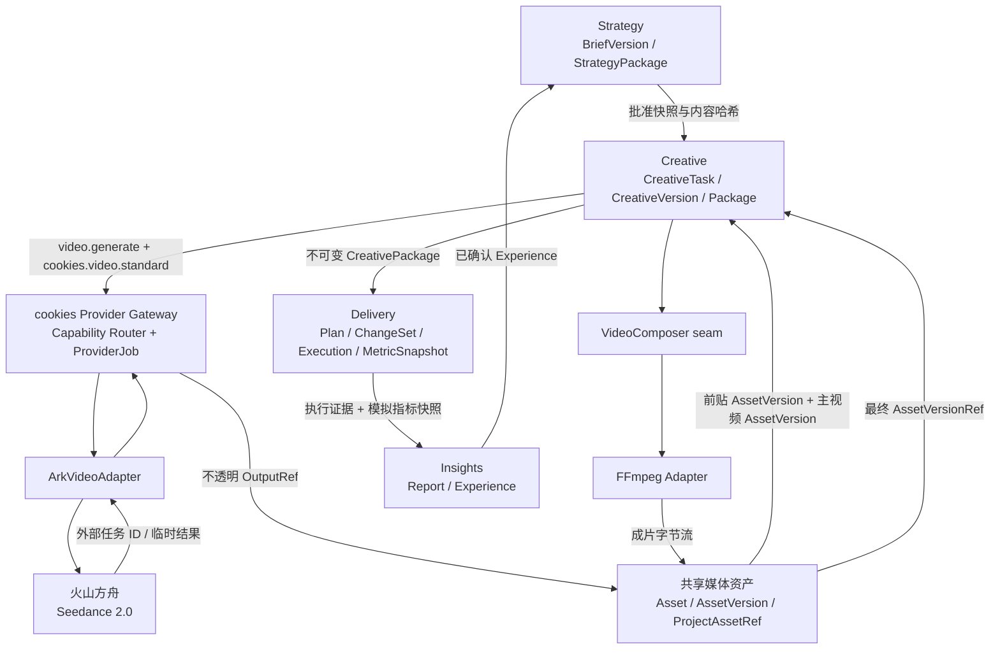

# 阶段一：真实短剧前贴四系统闭环实施方案

> 日期：2026-07-27
>
> 状态：待实施
>
> 实施主体：正式 Go + MySQL 后端与 `web/` React 前端
>
> 产品与领域基准：Kanon `docs/` 下的项目总览、Creative、Provider、媒体资产、Delivery 与 Insights 规范

## 1. 目标

在不依赖公司部署的 `seedance-gateway`、不重建第二套模型网关的前提下，扩展现有 cookies Provider Gateway，使其可以通过火山方舟官方接口直接调用 Seedance 2.0，并真实跑通下面这条项目级链路：

```text
需求
→ BriefVersion
→ 已批准 StrategyPackage 推荐“广告前贴”
→ Pre-roll CreativeTask
→ cookies Provider Gateway
→ 火山方舟 Seedance 2.0
→ 前贴视频进入项目素材库
→ FFmpeg 将前贴与主视频拼接
→ CreativeVersion / CreativePackage
→ 本地模拟投放
→ 导入一组明确标记为模拟的指标
→ 生成并确认 InsightReport
→ 沉淀可供下一轮读取的 Experience
```

完成标准不是页面上展示一条演示数据，而是上述每个对象均由正式后端持久化，并且可以沿 ID、版本和内容哈希追踪前后关系。

## 2. 范围冻结

### 2.1 本阶段必须完成

1. `video.generate` 成为 cookies Provider Gateway 的正式能力。
2. 使用火山方舟官方 API 直连 Seedance 2.0。
3. 支持 MP4 主视频上传和 Provider 生成视频入库。
4. 支持 `video + performance + pre_roll` 类型的 CreativeTask。
5. 使用真实 FFmpeg 将生成的前贴和主视频拼接。
6. 最终成片形成不可变 CreativeVersion 和 CreativePackage。
7. Delivery 使用现有 `local_simulation` 完成受控模拟执行。
8. Delivery 保存明确标记为模拟的指标快照。
9. Insights 基于执行证据和指标生成、确认报告，并可沉淀 Experience。
10. `web/` 提供完成上述链路所需的最小操作页面和状态反馈。

### 2.2 明确不在本阶段完成

1. 不连接抖音、巨量引擎等真实广告账户。
2. 不执行真实投放、启用、调预算或花费操作。
3. 不把 Seed 2.0 Pro 当作视频生成模型。
4. 不实现素材 VLM 自动判断“前贴还是爆款裂变”。
5. 不实现完整非线性时间线编辑器。
6. 不实现视频多片段智能混剪、数字人、视频爆款复刻。
7. 不实现 Seedance 多模型自动降级。
8. 不合并根目录 Node 原型为第二套后端。
9. 不把方舟临时视频 URL 保存为长期 CreativePackage 引用。

阶段一的“推荐前贴”由 Strategy 产生结构化建议并经人工确认。自动素材理解与路线判断属于后续阶段。

## 3. 模型职责与路由决策

### 3.1 模型职责

| 逻辑能力 | cookies 模型别名 | 阶段一实现 | 是否为验收必需 |
| --- | --- | --- | --- |
| 策略、脚本、Prompt 生成 | `cookies.text.standard` | 保留现有确定性实现；可选直连 Doubao Seed 2.0 Pro | 否 |
| 图片生成 | `cookies.image.standard` | 保留现有 gpt-image-2 路由 | 否 |
| 视频生成 | `cookies.video.standard` | 直连 `doubao-seedance-2-0-fast-260128` | 是 |

Doubao Seed 2.0 Pro 用于文本、策略与 Agent 任务；Doubao Seedance 2.0 用于视频生成。二者不得混用。

### 3.2 方舟直连配置

正式路由含义：

```text
capability        = video.generate
model_alias       = cookies.video.standard
connection_type   = ark
base_url          = https://ark.cn-beijing.volces.com/api/v3
upstream_model    = doubao-seedance-2-0-fast-260128
credential        = 火山方舟 API Key 的加密凭据版本
```

业务请求不得包含 `provider_code`、真实模型 ID、Base URL 或 API Key。

### 3.3 阶段一默认生成规格

```text
resolution = 720p
ratio      = 9:16
duration   = 5 秒
output     = video/mp4
```

默认值写入版本化的 Provider/Creative 契约，不直接散落在前端组件中。模型不支持或未声明的参数不得伪装为已生效。

## 4. 目标架构



## 5. 所有权与跨系统规则

| 对象 | Owner | 其他系统如何使用 |
| --- | --- | --- |
| BriefVersion、StrategyPackage | Strategy | Creative 只读取已批准不可变快照 |
| CreativeTask、RenderJob、CreativeVersion、CreativePackage | Creative | Delivery 只读取已批准 CreativePackage |
| ProviderJob、外部任务 ID、模型路由快照 | Provider | Creative 只引用 Job ID 和标准状态 |
| Asset、AssetVersion、ProjectAssetRef、Blob | Assets | 各系统只保存稳定版本引用 |
| DeliveryPlan、ChangeSet、Execution、Evidence、DeliveryMetricSnapshot | Delivery | Insights 通过窄接口读取证据快照 |
| InsightReport、Experience | Insights | Strategy/Creative 只引用已确认 Experience |

禁止出现以下共享写入：

- Creative 不直接修改 ProviderJob。
- Provider 不直接创建 CreativeVersion。
- Assets 不理解“广告前贴”业务状态。
- Delivery 不读取可变 CreativeTask。
- Insights 不修改 DeliveryMetricSnapshot。

## 6. Provider Gateway 深模块设计

### 6.1 对 Creative 暴露的接口

外部能力保持稳定：

```json
{
  "capability": "video.generate",
  "model_alias": "cookies.video.standard",
  "project_context_version": 1,
  "input": {
    "prompt": "经确认的视频生成提示词",
    "duration_seconds": 5,
    "aspect_ratio": "9:16",
    "resolution": "720p",
    "source_assets": []
  }
}
```

继续复用项目级公共入口：

```http
POST /platform/v1/projects/{project_id}/model/jobs
GET  /platform/v1/projects/{project_id}/model/jobs/{job_id}
```

HTTP 层按 `capability` 分发到 `CreateImageJob` 或 `CreateVideoJob`，不新增厂商专属公开路径。

### 6.2 Video Adapter seam

```go
type VideoProviderAdapter interface {
    Submit(context.Context, VideoGenerationRequest) (VideoSubmission, error)
    Poll(context.Context, VideoTaskReference) (VideoTaskResult, error)
}
```

调用方只需理解：

- Submit 可能返回已接收的外部任务；
- Poll 返回运行、成功或失败；
- 成功输出为 cookies 不透明 `ProviderOutputRef`；
- 错误已经标准化，并声明是否可重试。

方舟请求体、鉴权头、状态字段和临时 URL 全部隐藏在 Adapter implementation 中。

### 6.3 路由 seam

```go
type VideoRouteResolver interface {
    ResolveVideoRoute(
        context.Context,
        contract.OrganizationID,
        string,
    ) (VideoRouteSnapshot, error)
}
```

`VideoRouteSnapshot` 应冻结：

- route/revision ID；
- connection/revision ID；
- connection type；
- Base URL；
- upstream model；
- credential ID/version；
- timeout；
-最大响应体；
- 视频规格约束。

ProviderJob 一旦创建，后续配置变化不得改变其路由和模型。

### 6.4 ArkVideoAdapter

Adapter 使用方舟内容生成任务接口：

```text
POST /contents/generations/tasks
GET  /contents/generations/tasks/{external_task_id}
```

职责：

1. 将 cookies 请求翻译为方舟 `content` 请求。
2. 从 Credential Broker 获取指定版本 API Key。
3. 捕获方舟 request ID 和 external task ID。
4. 映射任务状态、进度和错误。
5. 成功后把临时 URL 封装为不可公开的 OutputRef。
6. 在 Assets 拉取完成前保留可恢复的输出句柄。
7. 不在日志中打印 Authorization、完整 Prompt 或临时 URL。

### 6.5 ProviderJob 状态

```text
queued
→ submitted
→ running
→ succeeded
  | failed
  | cancelled
  | expired
```

重试规则：

- 限流、网络超时、上游临时错误：退避后重试查询。
- 参数错误、未开通模型、内容安全拒绝、配额耗尽：不盲目重试。
- 提交响应丢失且无法确认是否已创建：停止自动再次提交，标记为未知提交结果，避免重复扣费。
- 已有 external task ID：恢复时只轮询，不重新创建任务。

## 7. 视频资产能力

### 7.1 资产类型

新增：

```text
AssetKindVideo = video
MIME           = video/mp4
```

视频 AssetVersion 至少保存：

- `size_bytes`
- `sha256`
- `duration_ms`
- `width`
- `height`
- `frame_rate`
- `video_codec`
- `audio_codec`
- `source_type`
- Provider/Render 来源引用

### 7.2 两种视频入库入口

1. 用户上传主视频：

```text
Upload Session
→ Quarantine
→ 内容签名/扫描
→ FFprobe 元数据验证
→ AssetVersion
→ ProjectAssetRef
```

2. Seedance 生成前贴：

```text
ProviderOutputRef
→ GeneratedIntake
→ 下载临时结果
→ 内容签名/扫描
→ FFprobe 元数据验证
→ AssetVersion
→ ProjectAssetRef
```

两者进入同一个 Asset/AssetVersion 体系。

### 7.3 稳定引用规则

CreativeVersion 中只能出现：

```json
{
  "asset_id": "asset_xxx",
  "version": 1
}
```

禁止保存：

- 方舟临时下载 URL；
- 本机绝对路径；
- 未经 Assets 验证的对象存储 key；
- 只有 Provider external task ID、没有 AssetVersion 的所谓“成片”。

## 8. Strategy 到 Creative 的前贴契约

### 8.1 StrategyPackage 增量字段

采用向后兼容的结构化建议：

```json
{
  "creative_routes": [
    {
      "route_type": "pre_roll",
      "video_purpose": "performance",
      "channels": ["douyin", "kuaishou"],
      "reason": "在正片前快速建立产品与目标人群的关联",
      "target_duration_seconds": 5,
      "aspect_ratio": "9:16",
      "source_asset_refs": [
        {"asset_id": "asset_main", "version": 1}
      ],
      "evidence_refs": [],
      "requires_human_confirmation": true
    }
  ]
}
```

阶段一允许 `evidence_refs` 为空，但 UI 必须说明：

> 当前为基于 Brief 和人工选择素材的策略建议，不代表系统已经完成自动视频理解。

### 8.2 Handoff

StrategyPackage 不自动创建 CreativeTask。用户明确点击“创建前贴任务”后：

1. 校验 StrategyPackage 已批准；
2. 校验同一 Organization 和 Project；
3. 校验内容哈希；
4. 校验主视频 AssetVersion 可用；
5. 以幂等键创建 CreativeIntake；
6. 再从 Intake 显式创建 CreativeTask。

现有 `StrategyPackage → CreativeIntake` seam 继续复用并扩展，不创建平行的 Proposal/Plan 表。

## 9. Creative 视频模型

### 9.1 分类字段

```text
format           = video
channel          = douyin | kuaishou
video_purpose    = performance
performance_mode = pre_roll
```

这与 Creative PRD 的分类保持一致。

### 9.2 VideoDraft

```json
{
  "contract_version": "creative-video-draft/v1",
  "concept": "一句话创意概念",
  "prompt": "已确认的 Seedance Prompt",
  "duration_seconds": 5,
  "aspect_ratio": "9:16",
  "resolution": "720p",
  "source_video": {"asset_id": "asset_main", "version": 1},
  "mandatory_elements": [],
  "prohibited_claims": [],
  "cta": "行动引导",
  "revision": 1
}
```

草稿可修改；每次修改递增 revision，旧版保留。

### 9.3 CreativeTask 状态

```text
draft
→ generating
→ generated
→ rendering
→ ready_for_review
→ approved
→ delivered
```

失败不单独覆盖业务状态，而以生产作业状态记录失败环节：

- Provider 生成失败；
- Provider 输出入库失败；
- FFmpeg 渲染失败；
- 成片入库失败；
- 检查或评审未通过。

### 9.4 生产血缘

任务详情必须可以查询：

```text
StrategyPackage
→ VideoDraft revision
→ ProviderJob
→ generated pre-roll AssetVersion
→ RenderJob
→ main source AssetVersion
→ final AssetVersion
→ CreativeVersion
→ CreativePackage
```

## 10. FFmpeg 拼接

### 10.1 所有权

Creative 拥有 RenderJob 业务状态。`internal/platform/remix` 或独立基础设施 implementation 只负责执行媒体处理，不拥有 CreativeVersion。

### 10.2 Composer seam

```go
type VideoComposer interface {
    ComposePreRoll(
        context.Context,
        PreRollCompositionRequest,
    ) (CompositionOutput, error)
}
```

请求只包含稳定 AssetVersionRef 和输出规格；implementation 内部负责打开素材、调用 FFmpeg、验证输出和清理临时文件。

### 10.3 阶段一渲染规则

1. 前贴与主视频统一到 720×1280。
2. 统一 H.264、`yuv420p`、一致帧率。
3. 音频统一为 AAC、48 kHz；无音轨时使用明确策略。
4. 前贴放在主视频前。
5. 输出 MP4 并启用 `faststart`。
6. 不覆盖源视频。
7. 输出重新进入 Assets，并形成新的 AssetVersion。

### 10.4 本机依赖

当前开发机未检测到 FFmpeg。实施时增加：

```text
COOKIES_FFMPEG_PATH=
COOKIES_FFPROBE_PATH=
COOKIES_VIDEO_WORK_ROOT=.data/video-work
```

启动时进行依赖检查；缺少 FFmpeg 时视频渲染能力显示不可用，但图片和文本能力仍可启动。

## 11. CreativeVersion 与 CreativePackage

视频版本使用独立快照，不把视频字段塞入 ImageTextDraft：

```json
{
  "contract_version": "creative-video-version/v1",
  "format": "video",
  "channel": "douyin",
  "video_purpose": "performance",
  "performance_mode": "pre_roll",
  "strategy_package_ref": {
    "id": "strategypackage_xxx",
    "version": 1,
    "content_hash": "sha256:..."
  },
  "draft_revision": 2,
  "source_video": {"asset_id": "asset_main", "version": 1},
  "generated_preroll": {"asset_id": "asset_preroll", "version": 1},
  "final_video": {"asset_id": "asset_final", "version": 1},
  "provider_job_id": "providerjob_xxx",
  "render_job_id": "renderjob_xxx"
}
```

冻结 CreativeVersion 后：

- 草稿继续修改不会影响已冻结版本；
- Provider 路由更新不会改变旧版本；
- 主视频或前贴生成新 AssetVersion 不会替换旧引用；
- Delivery 只消费已批准版本生成的 CreativePackage。

## 12. Delivery 模拟投放与指标

### 12.1 复用现有流程

```text
CreativePackage
→ DeliveryPlan
→ ChangeSet
→ Preflight
→ Approve
→ Execute(local_simulation)
→ DeliveryEvidence
```

现有审批门继续保留，不因为是 Demo 而跳过。

### 12.2 DeliveryMetricSnapshot

Delivery 新增正式指标快照：

```json
{
  "source": "demo_fixture",
  "is_simulated": true,
  "execution_id": "deliveryexecution_xxx",
  "creative_package_id": "creativepackage_xxx",
  "window_start": "2026-07-01T00:00:00Z",
  "window_end": "2026-07-07T23:59:59Z",
  "currency": "CNY",
  "metrics": {
    "impressions": 10000,
    "clicks": 420,
    "conversions": 31,
    "spend_cents": 50000
  },
  "dataset_version": "preroll-demo/v1"
}
```

规则：

- 模拟指标绝不伪装成真实平台数据；
- 指标不可直接由 Insights 写入；
- 同一个 execution + dataset version 幂等；
- 原始指标与派生 CTR/CVR 分开保存或明确口径；
- 时间范围、币种、来源和同步时间不可为空。

## 13. Insights

### 13.1 读取 seam

扩展 Delivery→Insights 的窄快照：

```go
type DeliveryEvidenceSnapshot struct {
    ExecutionID string
    EvidenceID string
    CreativePackageID string
    MetricSnapshotID string
    Mode string
    IsSimulated bool
}
```

Insights 不直接查询 Delivery 表。

### 13.2 报告生成

阶段一使用确定性模板生成报告，确保没有第二个模型依赖阻塞闭环：

- 摘要；
- 曝光、点击、转化、花费；
- CTR、CVR 等派生值及口径；
- 前贴素材引用；
- 适用条件；
- “模拟数据、不可作为真实效果结论”的披露。

报告必须人工确认。确认后允许创建 Experience：

```text
结论 + 适用条件 + 反例
```

下一轮 Strategy/Creative 只能读取已确认 Experience。

## 14. API 增量

### 14.1 Provider

```http
POST /platform/v1/projects/{project_id}/model/jobs
GET  /platform/v1/projects/{project_id}/model/jobs/{job_id}
```

扩展 `capability=video.generate`，不新增 Seedance 专属 API。

### 14.2 Assets

扩展现有上传与资产查询接口接受 `video/mp4`，并在响应中返回视频元数据。

### 14.3 Creative

```http
POST /api/creative/v1/projects/{project_id}/creative-intakes
POST /api/creative/v1/projects/{project_id}/creative-intakes/{intake_id}:create-task
PATCH /api/creative/v1/projects/{project_id}/creative-tasks/{task_id}:video-draft
POST  /api/creative/v1/projects/{project_id}/creative-tasks/{task_id}:video-job
POST  /api/creative/v1/projects/{project_id}/creative-tasks/{task_id}:render-preroll
POST  /api/creative/v1/projects/{project_id}/creative-tasks/{task_id}:freeze-version
POST  /api/creative/v1/projects/{project_id}/creative-versions/{version_id}:approve
POST  /api/creative/v1/projects/{project_id}/creative-versions/{version_id}:deliver
```

现有图文路径保持兼容。

### 14.4 Delivery

```http
POST /api/delivery/v1/projects/{project_id}/executions/{execution_id}/metric-snapshots
GET  /api/delivery/v1/projects/{project_id}/executions/{execution_id}/metric-snapshots
```

### 14.5 Insights

复用现有报告、确认和 Experience API；CreateReport 改为读取 Delivery 指标快照，而不是要求前端自行编造 Findings。

## 15. 数据库迁移顺序

建议按以下顺序添加向前迁移，不修改已执行迁移：

1. `migrations/provider/*_provider_video_routes.up.sql`
   - 支持 `video.generate`；
   - 支持 `ark` connection type；
   - 保存视频路由约束。
2. `migrations/assets/*_assets_video_support.up.sql`
   - video asset kind；
   - 视频元数据；
   - 生成视频 intake。
3. `migrations/strategy/*_strategy_creative_routes.up.sql`
   - StrategyPackage 的结构化创意路线快照。
4. `migrations/creative/*_creative_preroll_video.up.sql`
   - VideoDraft；
   - RenderJob；
   - 视频生产血缘；
   - 视频版本快照。
5. `migrations/delivery/*_delivery_metric_snapshots.up.sql`
   - 模拟/真实来源标记；
   - 指标窗口和口径。
6. `migrations/insights/*_insight_metric_lineage.up.sql`
   - 报告引用指标快照；
   - 模拟数据披露。

所有新列先允许旧数据继续读取；不得要求清空现有 MySQL 数据库。

## 16. 配置项

`.env.example` 只提供 Adapter 选择、凭据加密主密钥和本地媒体工具路径，不放方舟 API Key：

```dotenv
COOKIES_PROVIDER_VIDEO_ADAPTER=fake
COOKIES_PROVIDER_MASTER_KEY=
COOKIES_PROVIDER_MASTER_KEY_VERSION=v1

COOKIES_FFMPEG_PATH=
COOKIES_FFPROBE_PATH=
COOKIES_VIDEO_WORK_ROOT=.data/video-work
COOKIES_ASSET_MAX_VIDEO_BYTES=
```

新增 `scripts/configure-ark-video.ps1`，一次性完成：

1. 读取并校验 `COOKIES_PROVIDER_MASTER_KEY`；
2. 在终端隐藏输入火山方舟 API Key；
3. 加密写入 `provider_credentials`；
4. 创建 `ark` connection/revision；
5. 创建 `video.generate + cookies.video.standard` route/revision；
6. 固定官方 Base URL、Seedance 模型 ID、超时和视频规格约束；
7. 输出非敏感配置摘要供用户确认。

本地真实验收只需切换 Adapter：

```text
COOKIES_PROVIDER_VIDEO_ADAPTER=ark_video
```

API Key 只进入 Provider Credential Broker，不进入 `.env`、迁移、测试 fixture、日志、前端和 Git。模型、Base URL 与约束进入版本化 Provider 路由；Creative 仍只使用 `cookies.video.standard`。

## 17. 前端最小交付

遵守 Project 上下文与 Creative PRD 路由：

```text
/projects/:projectId/creative/video/performance/pre-roll
```

页面分为：

1. 策略输入：显示已批准 StrategyPackage 和“推荐前贴”依据。
2. 主视频：从项目素材库选择或上传 MP4。
3. 前贴草稿：编辑 Prompt、时长、比例和必须/禁止内容。
4. 生成：创建 ProviderJob，展示排队、运行、失败和重试。
5. 素材：预览入库后的前贴视频。
6. 拼接：创建 RenderJob，展示 FFmpeg 进度和日志摘要。
7. 评审：预览最终成片，冻结、批准版本。
8. 交付：生成 CreativePackage，跳转 Delivery。
9. 回流：显示模拟投放指标和已确认 Insight。

页面不得直接访问火山方舟，也不得持有 API Key。

## 18. 实施任务

### Work Package 0：外部依赖预检

- [ ] 验证火山方舟 API Key 有效。
- [ ] 验证账号已开通 `doubao-seedance-2-0-fast-260128`。
- [x] 准备一条已获授权的 MP4 主视频。
- [x] 安装 FFmpeg/FFprobe 并记录版本。
- [x] 保留现有图片真实链路回归样例。

出口：能在独立 smoke 脚本中创建并查询一个方舟视频任务；脚本不提交密钥。

### Work Package 1：Provider 视频能力

- [x] 增加 Video 请求、Submission、TaskResult 与校验。
- [x] 增加 VideoRouteResolver。
- [x] 增加 ArkVideoAdapter 与 FakeVideoAdapter。
- [x] 增加 `provider.video.generate` / `provider.video.execute` Job。
- [x] 扩展 HTTP Handler 按 capability 分发。
- [x] 扩展 composition root 与配置验证。
- [x] 增加路由、凭据和恢复测试。

出口：Fake 与真实 Ark 均通过相同 VideoProviderAdapter seam。

### Work Package 2：视频资产

- [x] Asset 支持 `video/mp4`。
- [x] 上传主视频。
- [x] Provider 输出通过 OutputRef 拉取并入库。
- [x] 引入 FFprobe 内容验证。
- [x] 增加大小、时长、编码和哈希校验。
- [x] 前端项目素材库可预览视频。

出口：主视频和 Seedance 前贴均有稳定 AssetVersionRef。

### Work Package 3：Strategy 前贴交接

- [x] StrategyPackage 增加 creative route。
- [x] 评审/批准页面显示结构化前贴建议。
- [x] 扩展 strategycreative Reader。
- [x] Handoff 校验版本、哈希和主视频。
- [x] 保持人工确认与幂等创建。

出口：一个批准 StrategyPackage 只能幂等创建对应的前贴 Intake/Task。

### Work Package 4：Creative 视频任务

- [x] 增加视频分类字段。
- [x] 增加 VideoDraft 版本。
- [x] 增加 ProviderJob 生产血缘。
- [x] 支持失败重试但不重复提交已存在任务。
- [x] 增加视频任务详情 API 与前端工作区。

出口：用户可从 StrategyPackage 发起并得到已入库前贴。

### Work Package 5：真实 FFmpeg 拼接

- [x] 实现 VideoComposer seam。
- [x] 实现 FFmpeg Adapter。
- [x] 增加 RenderJob 与 durable worker。
- [x] 统一编码、画幅和音轨。
- [x] 输出成片重新进入 Assets。
- [x] 失败时保留日志摘要并清理临时文件。

出口：前贴 + 主视频产生可播放的稳定最终 AssetVersion。

### Work Package 6：版本、评审与交付

- [x] 增加 video version contract。
- [x] 冻结完整生产血缘和内容哈希。
- [x] 执行视频专属检查。
- [x] 批准 CreativeVersion。
- [x] 生成 CreativePackage。

出口：Delivery 只能读取批准的不可变视频包。

### Work Package 7：模拟投放和指标

- [x] 复用现有 Plan/ChangeSet/Preflight/Approve/Execute。
- [x] 增加 DeliveryMetricSnapshot。
- [x] 增加 `demo_fixture` 导入接口和固定 fixture。
- [x] 明确展示 `local_simulation` 与 `is_simulated=true`。
- [x] 扩展 Delivery→Insights reader。

出口：模拟指标与具体 Execution、CreativePackage、成片一一关联。

### Work Package 8：Insight 与全链路验收

- [x] 从指标快照确定性生成 InsightReport。
- [x] 显示模拟数据披露。
- [x] 确认报告。
- [x] 创建 Experience。
- [x] 验证下一轮 PreLaunchInsight 能读取该 Experience。
- [ ] 编写全链路 smoke 脚本。

出口：Experience 能沿报告、指标、投放、CreativePackage、CreativeVersion 回溯到 Brief。

## 19. 测试策略

### 19.1 单元测试

- 视频输入和规格校验；
- Ark 请求/响应映射；
- Provider 错误分类；
- 路由快照；
- Creative 视频状态机；
- 指标派生与零分母；
- Insight 模板生成。

### 19.2 Adapter 契约测试

使用 `httptest.Server` 覆盖：

- 创建任务；
- 多次 Poll 后成功；
- 内容拒绝；
- 401/403；
- 429；
- 5xx；
- 超时；
- 成功响应缺少视频 URL；
- 恢复时不重复 Submit。

FakeVideoAdapter 与 ArkVideoAdapter 必须通过相同的公共行为测试。

### 19.3 FFmpeg 测试

自动生成两段极短测试视频，验证：

- 拼接顺序；
- 最终时长；
- 720×1280；
- H.264/AAC；
- 可被 FFprobe 读取；
- 同一输入生成可追踪输出；
- 失败后无残留临时文件。

### 19.4 MySQL 集成测试

- Provider 路由与凭据版本；
- ProviderJob 恢复；
- 视频 GeneratedIntake；
- Creative 视频血缘；
- DeliveryMetricSnapshot 幂等；
- Report/Experience 来源一致性。

### 19.5 前端测试

- 路由保持 Project；
- 未批准 Strategy 不可创建任务；
- 没有主视频不可生成；
- Provider/Render 状态刷新后仍存在；
- 模拟指标披露始终可见；
- API 失败显示 request ID 和可行动建议。

### 19.6 真实 smoke

自动化 CI 不调用付费模型。真实 smoke 由本地显式执行：

1. 创建一次 5 秒 Seedance 任务；
2. 等待成功；
3. 验证视频进入 Assets；
4. 使用测试主视频拼接；
5. 继续完成 Package、Delivery、Metric、Insight。

## 20. CI 与交付门

每个 Work Package 合并前至少执行：

```text
git diff --check
go test ./...
go vet ./...
```

涉及前端时还需：

```text
cd web
npm run build
npm test
```

涉及 FFmpeg 时执行媒体集成测试；涉及迁移时执行全新数据库和已有数据库升级测试。

推送后必须等待全部 GitHub Actions required checks 通过，失败必须读取日志并修复根因。

## 21. 最终验收清单

- [ ] BriefVersion 已确认。
- [ ] StrategyPackage 已批准且结构化推荐 `pre_roll`。
- [ ] CreativeIntake/Task 可追溯到 StrategyPackage 版本和哈希。
- [ ] 主视频具有稳定 AssetVersionRef。
- [ ] Creative 只通过 cookies Provider Gateway 调用视频能力。
- [ ] ProviderJob 路由为 `cookies.video.standard`。
- [ ] 实际模型为 Seedance 2.0，且不暴露给 Creative 请求。
- [ ] 前贴视频真实生成并进入 Assets。
- [ ] FFmpeg 真实拼接并生成可播放成片。
- [ ] 最终成片进入 Assets，不覆盖主视频。
- [ ] CreativeVersion 冻结完整来源和内容哈希。
- [ ] CreativePackage 只来自已批准版本。
- [ ] Delivery 完成 `local_simulation` 审批链。
- [ ] 指标快照标记为 `is_simulated=true`。
- [ ] InsightReport 引用对应执行和指标。
- [ ] InsightReport 已人工确认。
- [ ] Experience 已创建且可供下一轮读取。
- [ ] 服务重启后全链路仍可查询。
- [ ] 重试不会重复扣费、重复入库或重复创建交付对象。
- [ ] 现有 gpt-image-2、小红书图文和 Strategy 链路回归通过。

## 22. 主要风险与处理

| 风险 | 处理 |
| --- | --- |
| 方舟 Key 未开通 Seedance | Work Package 0 阻断真实 smoke；Fake 链路仍可开发 |
| 视频生成提交结果未知 | 不自动重提，进入人工核对状态 |
| 方舟临时 URL 过期 | 成功后立即生成 Assets intake；失败进入可补偿队列 |
| 视频文件过大 | 配置化限制、流式读取、禁止整文件无界读入内存 |
| FFmpeg 不存在 | 启动能力检查，视频渲染标记不可用，不拖垮其他能力 |
| 编码或音轨不一致 | 拼接前统一转码 |
| 模拟指标被误认为真实 | 数据、API、UI 三层强制 `is_simulated` 披露 |
| 视频代码破坏图文链路 | 新增独立 VideoDraft/Version contract，保留现有图文行为 |
| 根目录 Node 原型形成第二真相 | 阶段一只实现正式 Go/MySQL/`web/` 路径 |

## 23. 实施开始前需要的外部输入

只需要确认以下两项：

1. 一枚有权限调用 Seedance 2.0 的火山方舟 API Key；
2. 一条用于演示拼接、且已获得使用授权的 MP4 主视频。

其余设计、迁移、代码、Fake 测试、FFmpeg 测试素材和模拟指标 fixture 均由项目内完成。
