# Brief 驱动的电商前贴五模板技术方案

- 状态：Implementation Ready
- 日期：2026-07-28
- 范围：创意创作 / 效果广告 / 电商前贴
- 优先级：P0
- 主要模型：火山方舟 Seedance 视频生成能力
- 上游契约：`strategy-creative-handoff/v1`
- Creative 内部输入：`creative-video-intake/v1`
- 相关文档：
  - `docs/25-strategy-to-creative-development-contract-v2.md`
  - `docs/plans/2026-07-28-guerlain-commerce-preroll-seedance-technical-plan-v2.md`
  - `docs/research/seedance-2-commerce-preroll-technical-research-2026-07-28.md`

## 1. 结论

本方案把当前“娇兰固定样例 + 单个雾面橱窗提示词”升级为可实际使用的
Brief 驱动电商前贴工作流，同时保留现有页面结构和左侧五个场景模板。

完成后，用户可以：

1. 在需求中心上传、粘贴或录入 Brief，并确认一个不可变的 Brief 版本。
2. 在电商前贴页面选择当前 Project 下的已确认 Brief 或已批准
   StrategyPackage。
3. 切换左侧五个模板时，后端根据所选来源中的品牌、商品、卖点、图片、
   禁止项和模板规则，动态生成当前商品专属的提示词预览。
4. 人工确认商品、动作、结果和提示词后，提交 Seedance 生成视频。
5. 在当前创意页面看到任务进度、生成候选和检查结果。
6. 合格候选同时进入素材库和素材检查队列，保留完整来源、提示词、模型和
   资产追溯信息。

提示词不是由用户从零手写，也不能继续作为娇兰字符串硬编码在前端。它由
Creative 后端根据“已确认来源快照 + 模板配方 + 商品资产”编译生成。用户可
在生成前编辑，但编辑会形成新的提示词版本并使旧审批失效。

## 2. 已确认的产品约束

### 2.1 本期必须实现

- 优先完成视频创作中的效果广告 / 电商前贴。
- 保留现有前端页面布局和五个模板入口。
- 不增加“模板适配检查”区域或步骤。
- 支持当前娇兰 Brief 作为回归样例。
- 支持未来真实 Brief 的新增、确认、选择和历史版本切换。
- 五个模板均由同一 Brief 动态生成商品专属策略和提示词。
- 生成前必须允许人工确认，不能选择模板后直接扣费生成。
- 生成结果在当前页面可见，同时写入素材库和素材检查。
- 保留 Seedance 异步任务、首尾帧输入、任务轮询和失败诊断能力。
- API Key 只存在于服务端配置，不进入前端、契约、日志或资产元数据。

### 2.2 本期不做

- 不重做页面视觉和信息架构。
- 不新增第六个模板。
- 不把图文创作、创意评审工作台或智能投放扩展进本期。
- 不实现主视频和前贴的最终自动拼接；只保留可追溯的主视频引用和后续拼接
  接口。
- 不把模板适用性判断暴露成新的前端检查模块。
- 不允许使用可编辑 Brief Draft 直接生成正式视频。
- 不由 Strategy 服务生成模型 Prompt。

## 3. 当前代码基线

| 能力 | 当前状态 | 主要位置 | 本期处理 |
| --- | --- | --- | --- |
| 五个模板入口 | 已有 | `src/data/commerceHooks.ts` | 保留 |
| 电商前贴页面 | 已有 | `src/components/SpecializedPages.tsx` | 小范围接线 |
| Brief 需求入口 | 有页面，无真实生成接线 | `src/components/Pages.tsx`、`src/data/api.ts` | 接入 Strategy Brief API |
| Brief 草稿、确认、版本 | 后端已有领域模型/API | `internal/systems/strategy`、`api/openapi/strategy-v1.yaml` | 增加前端调用和 Project 级查询 |
| StrategyPackage → Creative | 契约已定义 | `docs/25-strategy-to-creative-development-contract-v2.md` | 严格保持版本/哈希 |
| Creative Intake | Schema 和接口已有 | `api/contracts/creative-video-intake-v1.schema.json` | 扩展来源引用 |
| 雾面橱窗规划 | 后端已有 | `internal/systems/creative/commerce_preroll.go` | 去娇兰硬编码、模板化 |
| 其他四模板提示词 | 前端 Mock | `src/data/commerceHooks.ts` | 迁移到后端模板配方 |
| 首尾帧条件化 | 已有 | `internal/systems/creative/frame_conditioner.go` | 抽象为按模板选择 |
| Seedance 请求与轮询 | 已有 | `internal/platform/provider` | 复用 |
| 视频播放器和图片预览 | 已有 | 素材页面组件 | 复用 |
| 素材检查入队 | 已有基础接线 | Platform/Creative 服务 | 保证成功后双写 |

当前最关键的技术债不是“缺少更多 Prompt 文案”，而是：

1. `SpecializedPages.tsx` 在没有 Brief artifact 时固定回退到娇兰 fixture。
2. `commerceHooks.ts` 承担了本应由后端拥有的品牌提示词。
3. `CommercePrerollPlanner` 只接受 `commerce.window-reveal`，且内部写死娇兰
   瓶型、金色液体和蜜蜂等描述。
4. `CreateVideoTaskRequest` 仍要求前端提交最终 `concept` 和 `prompt`，无法保证
   来源、模板和提示词的一致性。
5. 页面没有“当前来源版本”选择器，因此用户无法确认自己正在用哪个 Brief。

## 4. 领域模型与边界

### 4.1 核心术语

- **Brief Draft**：可编辑的需求草稿，不能直接驱动正式生成。
- **BriefVersion**：用户确认后的 Brief 不可变快照，具有版本号和内容哈希。
- **StrategyPackage**：从某个 BriefVersion 产生并经批准的策略包。
- **CreativeSourceVersion**：用户为一次创作明确选择的不可变上游来源。可以是
  已确认 BriefVersion、已批准 StrategyPackage 或开发 fixture。
- **CreativeIntake**：Creative 对来源进行标准化并由用户确认的不可变输入快照。
- **VideoTemplateRecipe**：Creative 拥有的版本化模板规则，描述镜头语法、所需
  资产、时序、保护规则和 Prompt 编译槽位；它不是最终 Prompt。
- **PromptPackage**：由 Creative 根据 Intake、模板配方和资产编译出的不可变
  提示词包，包含结构化字段、时序 Prompt、哈希和完整追溯。
- **GenerationSpec**：用户批准后被冻结的一次模型请求规格，绑定 PromptPackage、
  条件资产、画幅、时长、分辨率和声音策略。
- **Candidate**：模型生成的一条候选视频。Provider 成功不等于候选合格。

### 4.2 服务所有权

| 信息 | 所有者 |
| --- | --- |
| Brief 草稿、确认与版本 | Strategy |
| StrategyPackage、CreativeHandoff | Strategy |
| 模板配方、创意概念、镜头时序和模型 Prompt | Creative |
| Seedance 路由、鉴权、异步执行 | Provider Platform |
| 视频与图片二进制、资产版本 | Asset |
| 商品保真、动作完成度、合规检查结果 | Creative / Material Check |

Strategy 可以建议创意路线，但不能直接生成或保存最终 Seedance Prompt。
Creative 不修改 BriefVersion 或 StrategyPackage；上游变更必须创建新的
CreativeIntake。

## 5. 关键设计决策

### 5.1 同时支持 Brief 直达与 StrategyPackage

为了支持三人并行开发和创意人员在策略尚未产出时开工，Creative 支持两条真实
来源路径：

- `confirmed_brief`：选择已确认 BriefVersion，Creative 自行补全模板路线。
- `strategy_package`：选择已批准 StrategyPackage，并读取
  `strategy-creative-handoff/v1`。

生产默认优先选择包含相同 BriefVersion 的最新已批准 StrategyPackage；如果没有，
允许选择已确认 BriefVersion 直接创作。两者都必须冻结来源版本和内容哈希。

`fixture` 仅用于本地开发、演示和回归测试，界面必须明确标注“样例”，不能伪装成
真实 Brief。

### 5.2 提示词由后端编译

前端只提交：

- 选中的 `source_ref`
- 选中的 `template_ref`
- 用户允许编辑的创意字段
- 用户确认信息

前端不提交最终权威 Prompt。后端编译后返回 PromptPackage，前端只负责展示和
编辑。这样五个模板共享同一套来源、资产、合规和哈希规则，也避免品牌信息散落在
TypeScript 常量中。

### 5.3 一个深的规划模块

对外只暴露一个稳定的规划能力：

```go
type CommercePrerollPlanner interface {
    Prepare(ctx context.Context, request PlanningRequest) (PreparedGeneration, error)
}
```

模块内部隐藏：

- 来源解析与快照校验
- 商品事实与资产解析
- 模板配方选择
- 首尾帧规划
- Prompt 编译
- Prompt 和 GenerationSpec 哈希
- readiness 和 blocker 计算

不要为五个模板各造一套 handler、service 和 provider 调用链。

## 6. 目标业务链路

```mermaid
flowchart LR
    A["上传、粘贴或录入 Brief"] --> B["Brief Draft"]
    B --> C["人工补充并确认"]
    C --> D["不可变 BriefVersion"]
    D --> E{"是否已有批准策略包"}
    E -->|是| F["StrategyPackage / CreativeHandoff"]
    E -->|否| G["Brief 直达"]
    F --> H["创建 CreativeIntake 快照"]
    G --> H
    H --> I["选择五个模板之一"]
    I --> J["后端编译 PromptPackage 与首尾帧计划"]
    J --> K["前端展示策略、Prompt 和预览"]
    K --> L["人工确认"]
    L --> M["冻结 GenerationSpec"]
    M --> N["Seedance 异步生成"]
    N --> O["Candidate 质量检查"]
    O -->|合格| P["当前页面 + 素材库 + 素材检查"]
    O -->|不合格| Q["保留失败原因，可重新生成"]
```



### 6.1 Brief 新增

需求中心支持三种输入，最终走同一条流程：

1. 上传 PDF、DOCX 或图片。
2. 粘贴文本。
3. 表单手工录入。

系统提取并显示以下最小字段：

- 品牌名、商品名
- 商品品类和外观事实
- 核心卖点、证据和禁止表达
- 目标、受众、渠道和场景
- 色彩、语气、必须出现元素
- 商品正面图和其他参考资产

用户确认后生成 BriefVersion。原文件是证据资产，结构化 BriefVersion 是生产输入；
两者都要保留引用。

### 6.2 来源选择

在不改变页面主布局的前提下，把右侧标题栏当前的“娇兰样例 / Mock”位置改为
紧凑来源选择器：

```text
创意来源
[娇兰御廷兰花 Brief · v1 · 已确认 ▼]
```

下拉项按时间倒序显示：

- `StrategyPackage v3 · 来源 Brief v2 · 已批准`
- `Brief v2 · 已确认`
- `Brief v1 · 已确认`
- `娇兰固定样例 · Fixture`

默认规则：

1. 优先选择最新已批准 StrategyPackage。
2. 没有 StrategyPackage 时选择最新已确认 BriefVersion。
3. 只有开发环境且没有真实来源时才回退 fixture。
4. 切换来源后重新创建或选择 CreativeIntake，重新编译当前模板。
5. 已启动的任务继续绑定旧版本，不被切换影响。

### 6.3 模板切换

用户点击左侧模板时：

1. 前端提交当前 `intake_id`、`template_id` 和 `template_version`。
2. 后端读取 Intake 快照，不再读取“最新 Brief”。
3. Planner 根据模板配方生成 PromptPackage、首尾帧计划和 readiness。
4. 前端更新右侧四个结构化字段和中间预览。
5. 未满足条件时，在现有反馈区域显示具体 blocker，不新增“适配检查”模块。

### 6.4 人工确认与生成

“生成视频”按钮实际执行两段式操作：

1. 若当前 PromptPackage 尚未确认，先保存确认并冻结 GenerationSpec。
2. 使用 `generation_spec_hash` 创建 Provider job。

任何 Prompt、商品图、首尾帧、时长或画幅的变化都会生成新 spec hash，旧审批自动
失效，必须再次确认。

## 7. 五个模板的动态实现

五个模板不是五段固定中文 Prompt，而是五个版本化 VideoTemplateRecipe。每个配方
从同一个商品事实模型中取值。

| 模板 | 稳定动作语法 | Brief 动态信息 | 条件资产 | 默认时长 |
| --- | --- | --- | --- | --- |
| 商品切割 | 建立完整商品或商品质地 → 单一切割动作 → 商品定格 | 商品材质、包装不可破坏项、质地、颜色、卖点 | 商品正面图；可选质地参考图 | 5–7 秒 |
| 雾面橱窗揭幕 | 雾面遮挡 → 单次擦拭/揭幕 → 清晰商品定格 | 品牌色、瓶型、标签、陈列场景、必须露出元素 | 同构图雾面首帧 + 清晰尾帧 | 6 秒 |
| 一键取物 | 空场或封闭状态 → 单一触发动作 → 商品被召出并定格 | 使用场景、触发物、商品比例、正面朝向 | 场景首帧 + 商品尾帧 | 4–6 秒 |
| 微缩功效剧场 | 商品稳定 → 微缩角色/装置演示已批准卖点 → 商品定格 | 只取有证据的功效、成分、使用场景和禁止表达 | 商品图；可选卖点证据图 | 6–9 秒 |
| 设备召回 | 场景中单一装置/物体触发 → 商品出现 → 正面定格 | 按品类把“设备”翻译为梳妆台、柜体、台面或真实终端 | 场景首帧 + 商品尾帧 | 5–7 秒 |

### 7.1 品类安全翻译

模板名称可以保持现状，但配方必须按品类翻译动作，不能机械套词。例如：

- 美妆“商品切割”优先切割产品质地或旁置介质，不切碎香水瓶、护肤瓶和商标。
- 美妆“设备召回”使用梳妆台、展示柜或台面作为召回装置，不强行生成手机 UI。
- 食品可以切开食物本体，但包装和商标仍需保持。
- 3C 商品可以使用真实设备交互，但不能生成不存在的界面或功能。

这些规则在后端配方中执行，只通过 readiness/blocker 告知用户结果，不增加新的
前端检查组件。

### 7.2 PromptPackage 的四个可见部分

现有右侧提示词构建器继续显示：

1. **商品保真约束**：来自 Brief 商品事实、商品图视觉事实和全局保护规则。
2. **镜头与光影**：来自模板配方 + Brief 品牌视觉约束。
3. **唯一主动作**：来自模板动作语法 + 商品场景。
4. **结果与停留**：来自必须露出元素、尾帧资产和模板结尾规则。

底部“建立异常 / 完成变化 / 商品定格”是对 6 秒视频时序的可读摘要，不是三个独立
生成任务，也不要求用户手工输入。后端同时生成机器使用的精确时间段：

```text
00:00.0–00:01.5 建立视觉信息缺口
00:01.5–00:04.5 完成唯一主动作
00:04.5–00:06.0 清晰商品定格
```

不同模板可以有不同时间段，但统一遵守“建立 → 变化 → 结果”的三段式结构。

## 8. 数据契约

### 8.1 扩展 `creative-video-intake/v1`

保持契约名称不变，做向后兼容的可选字段扩展。`source.kind` 增加
`confirmed_brief`：

```json
{
  "source": {
    "kind": "confirmed_brief",
    "brief_id": "brief_123",
    "brief_version": 2,
    "content_hash": "sha256:...",
    "confirmed_at": "2026-07-28T08:00:00Z"
  }
}
```

`strategy_package` 来源继续包含：

```json
{
  "source": {
    "kind": "strategy_package",
    "package_id": "pkg_123",
    "package_version": 3,
    "content_hash": "sha256:...",
    "brief_id": "brief_123",
    "brief_version": 2
  }
}
```

Fixture 保持现有用途，但新增 `fixture_name` 和显式 `development_only: true`。

Intake 必须保存 `input_snapshot`，至少冻结：

- 品牌和商品事实
- 卖点、证据和禁止表达
- 创意约束和渠道
- 资产版本引用
- 上游来源身份、版本和哈希
- 创建时的用户确认

### 8.2 新增 `creative-video-template-recipe/v1`

模板配方由代码或版本化配置加载，不能由普通前端用户编辑：

```json
{
  "contract_version": "creative-video-template-recipe/v1",
  "template_id": "commerce.window-reveal",
  "template_version": 1,
  "mode": "commerce_preroll",
  "duration_seconds": 6,
  "required_asset_roles": ["product_image"],
  "conditioning_mode": "first_last_frame",
  "timeline": [
    {"phase": "setup", "start": 0, "end": 1.5},
    {"phase": "transformation", "start": 1.5, "end": 4.5},
    {"phase": "hold", "start": 4.5, "end": 6}
  ],
  "rules": {
    "single_primary_motion": true,
    "preserve_product_identity": true,
    "final_front_facing_hold": true
  }
}
```

### 8.3 新增 `creative-video-prompt-package/v1`

```json
{
  "contract_version": "creative-video-prompt-package/v1",
  "prompt_package_id": "vpp_123",
  "project_id": "project_demo",
  "intake_ref": {"intake_id": "intake_1", "intake_version": 1},
  "source_ref": {
    "kind": "confirmed_brief",
    "id": "brief_123",
    "version": 2,
    "content_hash": "sha256:..."
  },
  "template_ref": {
    "template_id": "commerce.window-reveal",
    "template_version": 1
  },
  "product_asset_refs": [
    {"asset_id": "asset_1", "asset_version": 1, "role": "product_image"}
  ],
  "sections": {
    "fidelity": "...",
    "camera_and_lighting": "...",
    "primary_motion": "...",
    "result_and_hold": "..."
  },
  "timeline_prompt": "...",
  "guardrails": ["..."],
  "compiled_prompt": "...",
  "content_hash": "sha256:...",
  "created_at": "2026-07-28T08:00:00Z"
}
```

Prompt 编辑不覆盖原 PromptPackage，而是创建新版本，记录：

- `base_prompt_package_id`
- `edit_reason`
- `edited_by`
- `content_hash`

### 8.4 GenerationSpec

沿用当前 `CreativeVideoGenerationSpec`，补齐：

- `source_ref`
- `prompt_package_id`
- `prompt_package_hash`
- `template_ref`
- `conditioning_asset_versions`
- `provider_route`
- `candidate_count`
- `spec_hash`

Provider 只接收已批准且哈希完全一致的 GenerationSpec。

## 9. API 设计

### 9.1 Strategy：Brief 生命周期

复用已有创建 Draft、更新 Draft、确认 Brief、查询 BriefVersion 的 API。补充一个
Project 级列表，供 Creative 来源选择器使用：

```http
GET /api/strategy/v1/projects/{project_id}/brief-versions
```

查询参数：

- `status=confirmed`
- `limit`
- `cursor`

列表只返回选择器需要的轻量字段；选择后再读取完整快照。

### 9.2 Creative：来源选项

```http
GET /api/creative/v1/projects/{project_id}/source-options
  ?deliverable_type=video
  &mode=commerce_preroll
```

服务端聚合已批准 StrategyPackage 和已确认 BriefVersion，返回统一读模型：

```json
{
  "items": [
    {
      "source_ref": {
        "kind": "confirmed_brief",
        "id": "brief_123",
        "version": 2,
        "content_hash": "sha256:..."
      },
      "label": "娇兰御廷兰花 Brief · v2",
      "status": "confirmed",
      "brand_name": "娇兰",
      "product_name": "第三代帝皇蜂姿复原蜜",
      "asset_summary": {"product_images": 1, "main_videos": 0},
      "created_at": "2026-07-28T08:00:00Z"
    }
  ]
}
```

这个聚合接口是前端便利读模型，不改变 Strategy 对 Brief 的所有权。

### 9.3 Creative：创建 Intake

继续使用：

```http
POST /api/creative/v1/projects/{project_id}/creative-intakes
```

请求只传 `source_ref` 和必要的用户选择。服务端读取并冻结上游快照，不接受前端伪造
完整 Brief 内容。

### 9.4 Creative：准备生成

新增并落实：

```http
POST /api/creative/v1/projects/{project_id}/creative-tasks/{task_id}:prepare-video-generation
```

请求：

```json
{
  "template_ref": {
    "template_id": "commerce.window-reveal",
    "template_version": 1
  }
}
```

响应：

- PromptPackage
- 首尾帧预览资产
- GenerationSpec 草案
- readiness
- blockers/warnings

这是用户切换模板后的核心接口。

### 9.5 Creative：批准与执行

```http
POST /api/creative/v1/projects/{project_id}/creative-tasks/{task_id}:approve-video-generation
```

请求包含 `prompt_package_hash`、`generation_spec_hash` 和确认人。

```http
POST /api/creative/v1/projects/{project_id}/creative-tasks/{task_id}:video-job
```

执行接口只接收已批准的 `generation_spec_hash`，不再接受前端自由传入最终 Prompt。

### 9.6 任务与候选查询

复用现有任务轮询接口，响应至少包含：

- `queued/running/succeeded/failed`
- Provider 任务 ID
- 可读失败原因
- Candidate asset refs
- Candidate check summary
- Material Check queue ref

## 10. 后端模块设计

建议的 Creative 内部结构：

```text
internal/systems/creative/
  source_resolver.go
  creative_intake.go
  commerce_preroll.go
  template_catalog.go
  prompt_compiler.go
  frame_conditioner.go
  video_generation_request.go
  candidate_evaluator.go
```

### 10.1 `SourceResolver`

职责：

- 按 `source_ref` 读取不可变 BriefVersion 或 StrategyPackage。
- 校验 Project、Organization、版本和内容哈希。
- 将不同上游格式投影成 Creative 的 `ProductFacts`。
- 解析 `AssetVersionRef`，禁止使用无版本的临时 URL。

### 10.2 `TemplateCatalog`

职责：

- 按 `template_id + version` 返回不可变配方。
- 注册五个模板。
- 校验时长、条件化模式和规则完整性。
- 做品类安全翻译，返回 blocker 或降级后的动作计划。

首版配方可以是 Go 中的不可变定义，后续再迁移到版本化配置；不要在首版引入可视化
模板编辑器。

### 10.3 `PromptCompiler`

输入：

- ProductFacts
- CreativeIntake
- VideoTemplateRecipe
- 资产视觉事实
- 用户允许编辑字段

输出：

- 四个可见 Prompt section
- 精确时序 Prompt
- guardrails
- compiled prompt
- content hash

编译必须是确定性的：相同输入和相同编译器版本产生相同哈希。

### 10.4 `FrameConditioner`

从当前仅支持雾面橱窗扩展为策略接口：

```go
type FrameConditioner interface {
    Prepare(ctx context.Context, plan FramePlan) (ConditioningAssets, error)
}
```

- 雾面橱窗：生成同构图雾面首帧，尾帧使用清晰商品图。
- 一键取物、设备召回：生成无商品或闭合状态首帧，尾帧为商品定格。
- 商品切割：优先使用同一商品图，必要时生成质地/介质首帧。
- 微缩功效剧场：首尾都锁定商品主体，微缩活动只发生在安全区域。

首尾帧派生资产必须记录源商品图版本、处理配方版本和内容哈希。

### 10.5 `VideoGenerationRequestFactory`

保留当前深模块：只负责把批准后的 GenerationSpec 转成 Provider 请求。
不得重新编译 Prompt，也不得从“最新 Brief”重新取值。

### 10.6 `CandidateEvaluator`

在现有通用检查上增加模板感知检查：

- 所有模板：商品瓶型/包装、标签、颜色、比例、正面定格。
- 商品切割：被切对象符合计划，商品本体未被错误破坏。
- 雾面橱窗：遮挡确实揭开，尾帧清晰。
- 一键取物：触发动作唯一，商品出现路径连贯。
- 微缩功效剧场：只表现已批准卖点，无未证实功效。
- 设备召回：装置符合品类，最终商品完整。

首版可包含自动基础检查 + 人工勾选；不要假装已有模型能可靠完成所有视觉质检。

## 11. 前端实现

### 11.1 保持现有页面

继续使用当前三栏布局：

- 左：五个场景模板。
- 中：视频/首尾帧预览和三段时序。
- 右：来源选择、四段提示词、状态、保存策略和生成按钮。

不新增大页面、不改变导航，不增加“模板适配检查”。

### 11.2 状态模型

页面需要显式管理：

```ts
type CommercePrerollWorkspaceState = {
  sourceOptions: CreativeSourceOption[]
  selectedSourceRef?: CreativeSourceRef
  intake?: CreativeIntake
  selectedTemplateRef: VideoTemplateRef
  prepared?: PreparedVideoGeneration
  approval?: VideoGenerationApproval
  job?: VideoJob
  candidates: VideoCandidate[]
}
```

来源或模板变化时：

1. 清除当前 approval。
2. 调用 prepare。
3. 使用服务端返回值覆盖当前 Prompt 展示。
4. 不覆盖旧任务和旧 Candidate。

### 11.3 加载和错误

- 初次加载显示来源和模板骨架屏。
- 没有真实 Brief 时显示“暂无已确认 Brief，可前往需求中心添加”；开发环境可选择
  娇兰 fixture。
- 缺商品图时禁用生成，并显示“需要一张已确认的商品正面图”。
- Provider 失败显示稳定错误码和可读说明，不直接展示内部堆栈。
- 轮询页面刷新后可恢复，任务 ID 必须持久化在服务端。

### 11.4 文案

移除生产界面的 `Mock`。替换规则：

- Fixture：`娇兰固定样例`
- Brief：`Brief vN · 已确认`
- StrategyPackage：`策略包 vN · 已批准`
- Prompt 已生成未确认：`待确认`
- 已提交：`生成中`
- Candidate 成功待检查：`待检查`
- Candidate 合格：`已保存`

## 12. 素材与检查

生成成功时必须由后端完成一个幂等的业务事务/工作流：

1. 持久化 Provider 输出为视频 AssetVersion。
2. 创建 Candidate，并记录 job、spec、prompt、source 和 template lineage。
3. 把 AssetVersion 关联到当前 Project 的素材库。
4. 创建 Material Check queue item。
5. 把 Candidate 返回创意页面。

幂等键建议：

```text
video-candidate:{provider_job_id}:{provider_output_index}
```

素材库负责保存和浏览；素材检查负责质量/合规状态；当前创意页面负责显示本次任务结果。
三者引用同一个 AssetVersion，不复制三份视频。

## 13. Readiness 与阻塞规则

### 13.1 Planning ready

需要：

- 不可变来源版本
- 品牌名和商品名
- 至少一个目标或核心卖点
- 已选模板

### 13.2 Generation ready

需要：

- Planning ready
- 已解析且可访问的商品正面图 AssetVersion
- PromptPackage 编译成功
- 条件资产准备成功
- 商品保真与禁止项不为空
- Provider route 支持所需输入模式

### 13.3 Production ready

需要：

- Generation ready
- PromptPackage 和 GenerationSpec 已被用户确认
- 资产权利或来源状态满足项目要求
- 无阻断级合规问题

Blocker 使用稳定码，例如：

- `SOURCE_NOT_CONFIRMED`
- `SOURCE_HASH_MISMATCH`
- `PRODUCT_NAME_MISSING`
- `PRODUCT_IMAGE_MISSING`
- `PRODUCT_ASSET_UNRESOLVED`
- `TEMPLATE_RECIPE_NOT_FOUND`
- `TEMPLATE_ASSET_REQUIREMENT_UNMET`
- `PROMPT_NOT_APPROVED`
- `SPEC_HASH_MISMATCH`
- `PROVIDER_INPUT_MODE_UNSUPPORTED`

## 14. 安全、审计与可观测性

- API Key 只从服务端 Secret/环境变量读取。
- 日志对 Authorization、API Key、原 Brief 敏感字段做脱敏。
- 每次 prepare 记录 source hash、template version、compiler version、
  prompt hash 和 readiness。
- 每次生成记录 spec hash、provider route、model、task ID、延迟和最终状态。
- 每个 Candidate 能反查：
  `AssetVersion → ProviderJob → GenerationSpec → PromptPackage →
  CreativeIntake → BriefVersion/StrategyPackage`。
- 业务指标：
  - 各模板 prepare 成功率
  - generation ready 率和 blocker 分布
  - Provider 成功率、P50/P95 耗时
  - Candidate 合格率
  - 每个合格候选平均生成次数

## 15. 迁移方案

### 阶段 A：来源和契约

1. 扩展 `creative-video-intake/v1` 的 `confirmed_brief` 来源。
2. 增加 Project BriefVersion 列表和 Creative source-options。
3. 需求中心接入真实 Brief Draft/Confirm API。
4. 在现有位置增加来源选择器。
5. 保留娇兰 fixture 作为开发回归样例。

完成标志：可新增 Brief、确认版本、在电商前贴页选择该版本。

### 阶段 B：五模板后端化

1. 抽取 ProductFacts 和 SourceResolver。
2. 建立 TemplateCatalog 和五个 v1 配方。
3. 把娇兰专属字符串移出 Planner。
4. 实现 PromptCompiler 和 PromptPackage 持久化。
5. 前端五个模板全部调用 prepare，删除 `commerceHooks.ts` 中的权威 Prompt。

完成标志：同一娇兰 Brief 切换五个模板时得到五套可追溯、商品一致的动态 Prompt；
换另一个 Brief 后不再出现娇兰词汇。

### 阶段 C：生成闭环

1. 实现 prepare/approve/video-job 的哈希闭环。
2. 扩展 FrameConditioner。
3. 复用 Seedance 适配器和任务轮询。
4. Candidate 同时进入素材库、素材检查和当前页面。
5. 实现刷新恢复和失败重试。

完成标志：用户无需离开当前页面即可完成从来源选择到候选检查的全流程。

### 阶段 D：质量与清理

1. 五模板 CandidateEvaluator。
2. 去掉生产界面 `Mock` 和隐式 fixture fallback。
3. 加入审计和指标。
4. 更新 OpenAPI、contract fixtures、前端 types 和文档。

## 16. 测试方案

### 16.1 契约测试

- `creative-video-intake/v1` 原五个 fixture 仍通过。
- 新增 confirmed Brief 和 StrategyPackage 两类来源 fixture。
- PromptPackage 相同输入生成稳定哈希。
- 非法 source/version/hash 被拒绝。

### 16.2 Planner 单元测试

每个模板至少覆盖：

- 美妆商品正常规划。
- 缺商品图时 generation blocker。
- 禁止项进入 guardrails。
- 未批准卖点不会进入微缩功效 Prompt。
- 切换 Brief 后不残留前一个品牌信息。
- 同输入确定性输出。

### 16.3 API 集成测试

- Brief Draft → Confirm → list source options。
- 创建 Intake → prepare → approve → create video job。
- 修改 Prompt 后旧 approval 失效。
- 重复创建视频 job 保持幂等。
- Provider 成功后只产生一个 AssetVersion 和一个检查队列项。

### 16.4 前端测试

- 默认选中最新批准策略包或最新确认 Brief。
- 可以切换历史版本。
- 五模板切换都会重新请求 prepare。
- `Mock` 不再出现于生产来源。
- 缺图时按钮禁用且信息明确。
- 生成中刷新页面后状态恢复。
- Candidate 在当前页面可播放。

### 16.5 回归样例

固定使用娇兰 Brief 和商品图，五模板分别验证：

- 品牌、商品名、瓶型、标签和颜色一致。
- Prompt 包含 Brief 中批准的卖点与禁止项。
- 雾面橱窗仍能产生当前已验证的首尾帧 Seedance 请求。
- 其他模板不出现“香水”等与实际商品不符的遗留词。

## 17. 验收标准

以下全部满足才算本期完成：

1. 用户能在需求中心添加并确认一个新 BriefVersion。
2. 电商前贴页可看到并切换当前 Project 的已确认 Brief 历史版本。
3. 若有批准 StrategyPackage，页面默认优先选择它。
4. 切换五个模板都会根据当前来源动态返回四段 Prompt 和三段时序。
5. 换成非娇兰 Brief 后，Prompt 和预览不再包含娇兰固定信息。
6. 用户确认后才能调用 Seedance。
7. 生成请求绑定 source、intake、template、prompt 和 spec 哈希。
8. 生成中、成功、失败状态在当前页面可见且刷新可恢复。
9. 成功视频可在当前页面播放，并同时进入素材库和素材检查。
10. 商品图缺失、Prompt 未确认、Provider 不支持输入模式等情况都有明确 blocker。
11. 方舟 API Key 不出现在前端包、接口响应和日志。
12. 后端测试、前端构建和仓库要求的 CI 全部通过。

## 18. 推荐施工顺序

按风险和依赖排序：

1. 先实现 BriefVersion 的 Project 级列表和 Creative source-options。
2. 再扩展 CreativeIntake source_ref 与来源快照。
3. 把单模板 Planner 重构为 TemplateCatalog + PromptCompiler，先保持雾面橱窗回归
   通过。
4. 依次加入商品切割、一键取物、微缩功效剧场、设备召回配方。
5. 接入前端来源选择和 prepare；此时去掉 Mock Prompt 的权威地位。
6. 完成 approve/spec hash/video-job 闭环。
7. 完成 Candidate 当前页展示、素材库和素材检查幂等写入。
8. 最后补齐五模板质检、可观测性和文档。

这个顺序让娇兰已跑通链路始终作为回归基线，同时逐步移除硬编码，不需要一次性推翻
现有页面和 Seedance 接入。

