# 娇兰电商前贴 × Seedance 2.0 技术方案 v2

> 日期：2026-07-28
>
> 状态：实施评审候选
>
> 范围：电商前贴固定样例“娇兰第三代黄金复原蜜 × 雾面橱窗揭幕”
>
> 当前约束：保留现有五个场景策略；不修改当前前端；不增加“模板适配检查”；图文、评审增强和智能投放后置

## 1. 方案结论

一期目标不是做一个通用广告智能体，而是用固定 Brief 和固定场景跑通一条可验证、可替换、可追溯的真实视频链路：

```text
娇兰 Brief
→ CreativeVideoIntake 固定样例
→ 选择“雾面橱窗揭幕”
→ 准备清晰商品尾帧
→ 从同一构图派生雾面首帧
→ 编译 6 秒时序 Prompt
→ 人工确认生成规格
→ Seedance 2.0 异步生成
→ 下载并转存为 Cookies AssetVersion
→ 人工检查商品保真与动作结果
→ 保存合格候选
→ 主视频到位后再拼接
```

当前已经完成 Brief 的人工解析和固定 Fixture，但尚未完成：

- 商品图进入正式 AssetVersion。
- 清晰尾帧与雾面首帧的准备。
- Prompt 的结构化编译和版本化。
- 首尾帧进入 Provider 视频请求。
- 真实 Seedance 多模态能力探测。
- 候选审核和保存闭环。

本方案只定义这些工作的目标结构、实施顺序和验收标准，不在本轮修改业务代码。

## 2. 固定样例与确认条件

### 2.1 已确认业务输入

| 项目 | 确认值 |
|---|---|
| 品牌 | 法国娇兰 |
| SKU | 娇兰第三代黄金复原蜜 |
| 广告类型 | 效果广告 / 电商前贴 |
| 场景策略 | 雾面橱窗揭幕 |
| 渠道 | 抖音 |
| 画幅 | 9:16 |
| 时长 | 6 秒 |
| 分辨率 | 720p |
| 首次候选数 | 1 |
| 音频 | 首轮不依赖模型音频；最终资产归一化为无音轨 |
| 商品素材 | Brief 内正面商品图可用于开发烟测 |
| 素材授权 | 用户已确认本项目使用条件 |
| 主视频 | 当前不要求；后续拼接阶段再提供 |

### 2.2 Brief 已提取的信息

当前固定 Fixture 已包含：

- 品牌名、商品名和主推 SKU。
- 商品卖点、功效依据和使用场景。
- 目标人群与核心传播信息。
- 必须表达项和禁止表达项。
- Brief 页码及 evidence refs。
- 商品图与主视频的素材槽位。
- planning / generation / production readiness。

当前 Fixture 仍保留早期草案值，例如 7 秒、3 个候选和 generated audio。正式实施的第一个任务是把已经确认的参数写回 Fixture；这属于契约数据更新，不代表重新设计前端。

### 2.3 商品图质量边界

Brief 第 4 页包含可识别的商品正面图，但嵌入 PDF 的主要瓶身图约为 `191 × 513` 像素。

该图：

- 足够用于开发、Frame Composer 和一次低成本能力烟测。
- 不足以验证最终 720p 商用视频的包装文字和细节保真。
- 不应被描述为品牌原始高清资产。

正式质量验收前，建议替换为长边至少 1500 像素的授权正面 PNG/JPG；透明 PNG 最佳。

## 3. 本期目标与非目标

### 3.1 本期必须完成

1. 固定娇兰 CreativeVideoIntake。
2. 将 Brief 商品图形成稳定 AssetVersionRef。
3. 生成或合成同构图的清晰尾帧和雾面首帧。
4. 从模板、Brief 和帧计划生成版本化 PromptPackage。
5. 保存一次人工确认记录。
6. 通过统一 Provider interface 调用 Seedance。
7. 可靠轮询、下载、校验并转存 MP4。
8. 完成一次人工商品保真和动作验收。
9. 保存合格候选及完整生产血缘。

### 3.2 本期不做

- 不修改五个场景策略的前端布局。
- 不增加“模板适配检查”面板。
- 不实现通用 PDF 自动解析平台。
- 不实现图文创作。
- 不实现自动创意评审或自动投放。
- 不实现多模型自动降级。
- 不一次生成 3～10 个候选。
- 不实现主视频最终拼接，除非后续取得授权 MP4。
- 不把 Seedance 供应商参数暴露给 Creative 前端。
- 不使用模型生成瓶身、Logo 或包装文字来替代商品原图。

## 4. 现有实现与目标差距

### 4.1 当前前端原型

当前页面已经具备：

- 五个静态场景策略。
- 模板切换。
- 商品保真、镜头、动作、结果四个可编辑字段。
- 环境描述与质量护栏自动附加。
- Prompt 文本拼接。
- 通用视频媒体任务提交和轮询提示。

当前页面仍是 Mock：

- 中央图片只是预览，不是 Seedance 输入。
- 底部三段时间轴只是静态说明。
- 保存策略没有持久化完整 PromptPackage。
- 生成按钮只提交一段文本 Prompt。

### 4.2 当前 Provider

当前 `VideoGenerationInput` 只包含：

```text
prompt
duration_seconds
aspect_ratio
resolution
```

当前 Ark adapter 只向方舟发送一个文本 `content` 项。因此现有链路只能完成：

```text
文本 Prompt → Seedance → MP4
```

尚不支持：

- Product image reference。
- First frame。
- Last frame。
- 多张 reference image。
- 音频生成开关。
- 多模态输入 role 映射。

### 4.3 官方能力与 Wire Contract 边界

截至 2026-07-28，官方资料能够确认：

- Seedance 2.0 系列 API 已公开上线。
- 标准版模型 ID 为 `doubao-seedance-2-0-260128`。
- Fast 模型 ID 为 `doubao-seedance-2-0-fast-260128`。
- 公开视频生成采用异步任务。
- 标准版公开规格包含 480p / 720p / 1080p 和 4～15 秒。
- 产品能力支持文字、图片、视频和音频参考。
- 公开资料确认图片参考存在 `reference_image` 用法。

公开资料尚未足以冻结：

- 首帧和尾帧各自的正式 role/type 组合。
- Fast 的完整分辨率和时长组合。
- 标准版和 Fast 的完整画幅枚举；9:16 必须由真实账号探测。
- 关闭生成音频的正式原始 JSON 字段。
- 视频和音频参考的完整 Wire Contract。

`reference_image` 只表示参考图片，不能据此推断它等价于首帧或尾帧。较早的官方通用视频 API 示例中出现过 `first_frame` 和 `last_frame`，但尚无公开证据证明 Seedance 2.0 或 Fast 支持这两个输入 role。`return_last_frame` 只要求任务返回生成结果的尾帧，不是“提供尾帧作为生成约束”。

因此，Creative 和 Provider 的稳定 interface 可以先建模首尾帧；Ark adapter 的具体字段翻译必须等待真实账号 capability probe，不得猜测供应商字段。

详细依据见：

- `docs/research/seedance-2-commerce-preroll-technical-research-2026-07-28.md`

## 5. 目标架构

```mermaid
flowchart LR
    Brief["娇兰 Brief / Strategy Handoff"] --> Intake["CreativeVideoIntake"]
    Intake --> Planner["CommercePrerollPlanner"]
    Template["雾面橱窗揭幕 Template v1"] --> Planner
    Product["商品 AssetVersion"] --> Frames["FrameConditioner"]
    Planner --> Frames
    Frames --> FrameAssets["首帧 + 尾帧 AssetVersion"]
    Planner --> Prompt["PromptPackage"]
    FrameAssets --> Approval["GenerationApproval"]
    Prompt --> Approval
    Approval --> Provider["VideoGenerator interface"]
    Provider --> Ark["Ark Seedance adapter"]
    Ark --> Output["ProviderOutputRef"]
    Output --> Asset["候选 Video AssetVersion"]
    Asset --> Review["CandidateEvaluator"]
    Review --> Candidate["合格 CreativeCandidate"]
    Candidate -. 主视频到位后 .-> Compose["Pre-roll Composer"]
```



关键 seam：

1. `StrategyHandoffReader`：隐藏 StrategyPackage 细节。
2. `CommercePrerollPlanner`：隐藏模板选择、时序、Prompt 片段和 readiness 计算。
3. `FrameConditioner`：隐藏抠图、合成、雾面派生和帧资产持久化。
4. `VideoGenerator`：隐藏方舟鉴权、真实模型 ID、任务协议和临时 URL。
5. `CandidateEvaluator`：统一候选技术检查和人工检查记录。

这些 interface 的 caller 不需要理解 Seedance 请求体，也不需要理解 PDF 页面的原始结构。

## 6. 核心领域对象

### 6.1 CreativeVideoIntake

继续使用 `creative-video-intake/v1`，记录：

- 来源 Brief / StrategyPackage。
- Campaign。
- 视频模式和规格。
- Product。
- Creative constraints。
- Source assets。
- Claims 与 evidence refs。
- 三级 readiness。
- 人工确认状态。

该对象不保存 API Key、上游 Model ID 或供应商 URL。

### 6.2 CommerceHookTemplate

五个前端策略应对应五条版本化模板记录，而不只是 UI 文案：

```json
{
  "template_id": "commerce.window-reveal",
  "template_version": 1,
  "name": "雾面橱窗揭幕",
  "frame_strategy": "first_and_last_frame",
  "duration_range_seconds": [6, 8],
  "prompt_sections": [
    "fidelity",
    "camera",
    "motion",
    "environment",
    "result",
    "guardrails"
  ],
  "timeline": [
    {"start": 0.0, "end": 1.5, "purpose": "information_gap"},
    {"start": 1.5, "end": 4.0, "purpose": "single_transformation"},
    {"start": 4.0, "end": 6.0, "purpose": "product_hold"}
  ]
}
```

模板由 Creative 拥有。选择模板不会直接调用 Seedance，而是先生成 FramePlan 和 PromptPackage。

### 6.3 FramePlan

```json
{
  "contract_version": "creative-frame-plan/v1",
  "task_id": "creative_task_01",
  "template_ref": {
    "template_id": "commerce.window-reveal",
    "template_version": 1
  },
  "canvas": {
    "aspect_ratio": "9:16",
    "width": 720,
    "height": 1280
  },
  "product_asset_ref": {
    "asset_id": "asset_guerlain_packshot",
    "version": 1
  },
  "tail_frame": {
    "kind": "clear_product_reveal",
    "hold_seconds": 1.0
  },
  "start_frame": {
    "kind": "frosted_overlay",
    "derived_from": "tail_frame"
  }
}
```

FramePlan 只描述意图和稳定引用，不包含图片二进制。

### 6.4 PromptPackage

```json
{
  "contract_version": "creative-video-prompt/v1",
  "task_id": "creative_task_01",
  "template_ref": {
    "template_id": "commerce.window-reveal",
    "template_version": 1
  },
  "prompt_version": 1,
  "language": "zh-CN",
  "sections": {
    "fidelity": "保持娇兰第三代黄金复原蜜瓶型、比例、暖金色、标签和蜜蜂标识不变。",
    "camera": "9:16 写实商业摄影，中景，隔着玻璃橱窗，固定机位，暖金色侧光。",
    "timeline": [
      "0.0–1.5 秒：雾面玻璃遮挡商品，只能看到稳定轮廓。",
      "1.5–4.0 秒：一只戴手套的手左右擦拭玻璃，雾气连续消退。",
      "4.0–6.0 秒：完整露出商品正面，标签清晰，稳定停留。"
    ],
    "guardrails": "不改变瓶型、颜色、包装文字和标识；不露脸；不增加商品；不发生穿模、闪现、构图漂移。"
  },
  "compiled_prompt": "由 PromptCompiler 确定性生成的完整文本",
  "prompt_hash": "sha256:<canonical-prompt-hash>"
}
```

`compiled_prompt` 必须由确定性编译器产生。同样的：

```text
VideoIntake Version
+ Template Version
+ FramePlan Version
+ PromptPackage Version
```

必须得到相同 Prompt Hash。

### 6.5 GenerationSpec

```json
{
  "contract_version": "creative-video-generation-spec/v1",
  "task_id": "creative_task_01",
  "prompt_ref": {
    "prompt_version": 1,
    "prompt_hash": "sha256:<canonical-prompt-hash>"
  },
  "conditioning_assets": [
    {
      "role": "first_frame",
      "asset_ref": {"asset_id": "asset_frosted_start", "version": 1}
    },
    {
      "role": "last_frame",
      "asset_ref": {"asset_id": "asset_clear_tail", "version": 1}
    }
  ],
  "duration_seconds": 6,
  "aspect_ratio": "9:16",
  "resolution": "720p",
  "audio_policy": "silent",
  "candidate_count": 1
}
```

这里的 `first_frame` 和 `last_frame` 是 Cookies 领域 role。Ark adapter 如何翻译取决于已验证的方舟 Wire Contract。

### 6.6 GenerationApproval

人工确认不能只保存一个布尔值：

```json
{
  "contract_version": "creative-generation-approval/v1",
  "task_id": "creative_task_01",
  "generation_spec_hash": "sha256:<generation-spec-hash>",
  "confirmed_items": [
    "product",
    "template",
    "motion",
    "result",
    "prompt",
    "paid_generation"
  ],
  "confirmed_by": "principal_01",
  "confirmed_at": "2026-07-28T08:00:00Z"
}
```

修改 Prompt、帧资产或生成规格后，旧 Approval 自动失效，必须重新确认。

### 6.7 CreativeCandidate

```json
{
  "candidate_id": "creative_candidate_01",
  "task_id": "creative_task_01",
  "provider_job_id": "provider_job_01",
  "output_asset_ref": {
    "asset_id": "asset_guerlain_preroll_candidate",
    "version": 1
  },
  "generation_spec_hash": "sha256:<generation-spec-hash>",
  "review_status": "accepted",
  "review_report_id": "review_report_01"
}
```

候选不可覆盖。重新生成应创建新 Candidate，并保留失败与拒绝原因。

## 7. 清晰尾帧与雾面首帧

### 7.1 为什么先做尾帧

电商前贴最终需要把商品展示清楚。尾帧决定：

- 商品位置。
- 商品尺度。
- 标签朝向。
- 光影。
- 后续拼接构图。

如果先让模型生成模糊首帧，再要求模型猜测最终商品形态，包装最容易漂移。因此先确定清晰尾帧，再派生首帧。

### 7.2 清晰尾帧策略

优先采用确定性合成，而不是让图片模型重绘商品：

1. 从授权商品图生成透明或带蒙版的商品 Cutout。
2. 建立 720 × 1280 的 9:16 画布。
3. 使用固定版式放置商品。
4. 背景可以来自授权素材或单独生成，但商品层保持原像素。
5. 添加可重复的阴影、玻璃反射和暖金色光斑。
6. 输出无文字叠加的 PNG。
7. 写入 Cookies AssetVersion，并记录来源商品 AssetVersion。

如果当前 PDF 图片无法可靠抠图，可以在开发烟测中保留其白色或简洁背景，不为了“更高级”而重绘瓶身。

### 7.3 雾面首帧策略

首帧必须从尾帧确定性派生：

1. 复制尾帧像素。
2. 在上层增加玻璃模糊、雾气和轻微冷凝纹理。
3. 保留可辨识但不完全清晰的商品轮廓。
4. 保持商品坐标、尺度、光向和背景完全一致。
5. 预留擦拭路径。
6. 输出新的 AssetVersion。

不得分别向图片模型请求“清晰橱窗图”和“雾面橱窗图”，否则两张图中的瓶型、标签、背景和构图会天然不一致。

### 7.4 帧一致性检查

FrameConditioner 在输出前执行：

- 尺寸一致。
- 色彩空间一致。
- 商品主体 bounding box 位置一致。
- 商品主体宽高变化在允许阈值内。
- 非雾面遮罩区域像素差异在允许阈值内。
- 尾帧标签区域没有被遮挡。

这属于帧资产一致性校验，不是前端“模板适配检查”。

## 8. 6 秒时序 Prompt

### 8.1 时间结构

| 时间 | 目的 | 娇兰画面 |
|---|---|---|
| 0.0–1.5 秒 | 建立信息缺口 | 雾面玻璃遮挡商品，轮廓稳定 |
| 1.5–4.0 秒 | 完成唯一变化 | 戴手套的手左右擦拭，雾气连续消退 |
| 4.0–6.0 秒 | 商品与结果定格 | 商品正面和标签清晰，稳定停留 |

“建立异常”统一解释为“建立信息缺口或未完成状态”，不是技术异常。

### 8.2 Prompt 编译顺序

```text
[商品保真]
+ [画幅、场景、镜头、光影]
+ [0.0–1.5 秒初始状态]
+ [1.5–4.0 秒唯一主动作]
+ [4.0–6.0 秒结果与停留]
+ [环境辅助运动]
+ [连续性和畸变护栏]
+ [品牌、事实和合规护栏]
```

PromptCompiler 必须做到：

- 不从 Brief 猜测未确认促销权益。
- 不自动补默认 CTA。
- 不让环境动作超过主动作。
- 不增加第二件商品。
- 不要求 Seedance 生成可读广告字幕。
- 不把实验功效声明直接变成画面中的绝对效果。
- 不改变原始商品图中的包装文字。

### 8.3 人工编辑原则

页面中的 Prompt 字段默认自动生成。用户只需要：

- 确认商品是否正确。
- 确认擦拭动作是否符合预期。
- 确认最终结果。
- 必要时修改镜头或动作描述。

用户不需要从零写 Prompt。人工修改后生成新的 Prompt Version，并重新计算 Prompt Hash。

## 9. Seedance 调用设计

### 9.1 稳定 Provider interface

目标输入：

```text
VideoGenerationInput v2
  prompt
  duration_seconds
  aspect_ratio
  resolution
  audio_policy
  conditioning_assets[]
```

Creative 只使用稳定模型别名，例如：

```text
cookies.video.standard
```

不得向 Creative 返回：

- `doubao-seedance-*` 真实 Model ID。
- 方舟 Base URL。
- API Key。
- 方舟临时视频 URL。

### 9.2 Ark adapter

Ark adapter 负责：

1. 解析冻结的 Provider Route。
2. 安全获取 Credential。
3. 将 Prompt 与 conditioning assets 翻译为方舟 `content`。
4. 提交异步任务。
5. 保存 external task ID 和 request ID。
6. 轮询或处理 callback。
7. 映射状态与错误。
8. 下载上游视频。
9. 返回不透明 ProviderOutputRef。

### 9.3 三档能力模式

#### Mode A：首尾帧模式

条件：真实账号 capability probe 证明目标 Seedance 2.0 Model 接受首帧和尾帧输入，并确认正式 role/type。不得仅依据旧版通用 API 示例实现。

输入：

- 雾面首帧。
- 清晰尾帧。
- 6 秒 Prompt。

这是娇兰正式烟测的首选模式。

#### Mode B：单参考图模式

条件：官方账号只确认 `reference_image`，未确认独立首尾帧。

输入：

- 清晰尾帧作为商品/构图参考。
- Prompt 描述“从雾面开始到擦拭后恢复该清晰构图”。

该模式可以测试多模态保真，但不能承诺精确首帧。

即使 Cookies 已经准备了雾面首帧和清晰尾帧，Mode B 也只选择一张作为参考输入；另一张继续作为人工验收基准，不得伪装成已经被模型消费。

#### Mode C：纯文本模式

输入：

- 6 秒 Prompt。

该模式只验证 API Key、模型权限、异步任务、下载和资产转存。不能用于判断商品包装保真，也不能作为娇兰商业候选。

### 9.4 音频处理

首轮不依赖 Seedance 音频。

由于公开 Wire Contract 尚未冻结音频开关，采用双保险：

1. capability probe 确认后，Ark adapter 尽量请求无音频生成。
2. 无论上游是否返回音轨，进入 Cookies Asset 前都执行媒体归一化并移除音轨。

最终候选的验收标准是 MP4 不包含音轨，而不是假设某个尚未验证的供应商字段一定生效。

### 9.5 异步与幂等

ProviderJob 请求 Hash 必须覆盖：

- CreativeTask ID。
- GenerationSpec Hash。
- Model alias。
- Prompt Hash。
- 首尾帧 AssetVersionRefs。
- 时长、画幅、分辨率和音频策略。

同一 Idempotency-Key：

- 相同请求 Hash 返回同一 ProviderJob。
- 不同请求 Hash 返回冲突。

提交结果不明时不得自动再次计费提交；必须先查询已知 external task 或进入人工处置。

## 10. Capability Probe

在实现 Ark 多模态 adapter 前，使用轮换后的本地密钥执行一次受控探测。密钥只通过安全配置进入 Credential Store，不写入命令历史、文档或日志。

本次娇兰所需最小探测：

1. 账号能否调用标准版和 Fast。
2. Fast 是否支持 6 秒、9:16、720p。
3. 单张 `reference_image` 的实际请求格式。
4. 首帧和尾帧的实际 role/type 组合。
5. 图片能否使用 Cookies 签名 URL，或必须先进入方舟 Asset。
6. 图片格式、尺寸、大小和 URL 可访问要求。
7. 关闭音频的实际字段及默认行为。
8. `return_last_frame` 是否返回可持久化的结果尾帧；不得把它当作尾帧输入能力。
9. 任务错误中的模型未开通、额度不足和素材不合规映射。
10. 成功 MP4 的时长、分辨率、音轨、水印和 AIGC 元数据。
11. 一条 6 秒 720p 任务的 usage 和实际成本。

探测顺序：

```text
text-only
→ one reference image
→ first + last frame
→ audio-off
```

每一步成功后才进入下一步，避免一次请求同时包含多个未经验证的字段。

## 11. 人工确认

提交真实任务前，确认页或后端命令必须展示并冻结：

- 商品：娇兰第三代黄金复原蜜。
- 商品图 AssetVersion。
- 模板：雾面橱窗揭幕及版本。
- 首帧和尾帧。
- 6 秒时间轴。
- 完整 Prompt。
- 必须项和禁止项。
- 9:16、720p、无音轨。
- 候选数 1。
- 本次请求会产生费用。

用户确认的是 GenerationSpec，不是单独确认一段 Prompt。

确认后任何以下变化都会使 Approval 失效：

- 商品图 Version 变化。
- 首帧或尾帧变化。
- Prompt 变化。
- 时长、画幅、分辨率变化。
- 模型别名或音频策略变化。

## 12. 生成结果处理

### 12.1 状态流

```text
draft
→ preparing_frames
→ awaiting_confirmation
→ queued
→ running
→ generated
→ reviewing
→ accepted / rejected
```

ProviderJob 状态和 CreativeCandidate 状态分开：

- ProviderJob 只回答模型任务是否成功。
- CreativeCandidate 回答输出是否满足创意要求。

模型成功不等于候选合格。

### 12.2 下载与资产化

任务成功后：

1. 立即下载方舟返回的视频。
2. 限制最大响应体。
3. 验证 MP4 container 和可解码性。
4. 使用 `ffprobe` 读取时长、宽高、帧率和音轨。
5. 移除音轨并归一化媒体规格。
6. 计算 SHA-256。
7. 写入 Cookies 控制的对象存储。
8. 创建稳定 AssetVersion。
9. 业务对象只保存 AssetVersionRef。

不得把方舟临时 URL 保存为 CreativeCandidate 的长期地址。

## 13. 候选检查

### 13.1 技术检查

必须自动检查：

- MP4 可解码。
- 画幅为 9:16。
- 分辨率为 720p。
- 时长为 6 秒，允许小范围编码容差。
- 无音轨。
- 不存在全黑、全白或明显损坏帧。
- 文件 Hash 和 AssetVersion 已记录。

### 13.2 人工创意检查

首次娇兰烟测由人工逐项确认：

| 检查项 | 通过标准 |
|---|---|
| 瓶型 | 比例和轮廓没有明显变化 |
| 颜色 | 暖金色和透明材质没有异常偏色 |
| 标签 | 关键标签未消失、翻转或变成明显乱码 |
| 商品数量 | 全程只有一件主商品 |
| 擦拭动作 | 手部自然、轨迹连续、没有穿模 |
| 雾气变化 | 从遮挡到清晰，变化有因果 |
| 构图 | 商品位置稳定，没有明显漂移 |
| 最终定格 | 商品正面清楚，稳定停留约 1 秒 |
| 合规 | 没有新增未批准功效、价格、促销或人物 |

一期不要求用另一个视觉模型自动打分。先记录结构化人工结果，后续评审模块再消费这些数据。

### 13.3 拒绝原因

建议稳定枚举：

```text
product_shape_drift
product_color_drift
label_corrupted
extra_product
hand_deformation
motion_discontinuity
composition_drift
final_hold_missing
unapproved_claim
technical_failure
```

拒绝不会删除 ProviderJob 和输出资产；资产可以进入隔离状态，保留成本和失败证据。

## 14. 候选保存

合格候选必须保存：

- CreativeTask ID。
- CreativeVideoIntake Version。
- Template ID / Version。
- FramePlan Version。
- Prompt Version / Hash。
- GenerationSpec Hash。
- GenerationApproval。
- ProviderJob ID。
- Provider Route Revision。
- 上游 Model Version。
- 首帧和尾帧 AssetVersionRefs。
- 输出 Video AssetVersionRef。
- ReviewReport。
- 创建人与时间。

页面刷新、服务重启和 Strategy 新版本发布都不能改变已保存候选的生产血缘。

## 15. 后续主视频拼接

主视频不是本次生成门槛。未提供主视频时：

```text
planning_ready=true
generation_ready=true
production_ready=false
```

主视频到位后：

1. 验证主视频是同 Project 的授权 MP4 AssetVersion。
2. 归一化前贴与主视频的编码、画幅、帧率和音频。
3. 按 Route 选择硬切、淡入或其他已批准转场。
4. 使用持久化 RenderJob 执行 FFmpeg。
5. 结果形成新 AssetVersion。
6. 再进入 CreativeVersion 冻结、检查和交付。

不得直接覆盖独立前贴 Candidate。

## 16. 后端命令建议

不要求当前前端立即接入，但后端可以按以下最小命令组织：

### 16.1 准备生成

```http
POST /api/creative/v1/projects/{project_id}/creative-tasks/{task_id}:prepare-video-generation
Idempotency-Key: <key>
```

输入：

- Template ID / Version。
- Product AssetVersionRef。

输出：

- FramePlan。
- 首帧和尾帧 AssetVersionRefs。
- PromptPackage。
- GenerationSpec。
- 当前 readiness。

### 16.2 确认生成

```http
POST /api/creative/v1/projects/{project_id}/creative-tasks/{task_id}:approve-video-generation
```

输入：

- GenerationSpec Hash。
- Confirmed items。

输出：

- GenerationApproval。

### 16.3 创建视频任务

继续使用：

```http
POST /api/creative/v1/projects/{project_id}/creative-tasks/{task_id}:video-job
Idempotency-Key: <key>
```

输入只需：

- GenerationSpec Hash。
- Model alias。

后端从已批准 GenerationSpec 读取 Prompt 和 AssetVersionRefs；不得接受浏览器重新提交一份可篡改的完整 Prompt 和素材 URL。

### 16.4 记录候选审核

```http
POST /api/creative/v1/projects/{project_id}/creative-tasks/{task_id}/video-candidates/{candidate_id}:review
```

输入：

- Accepted / rejected。
- 结构化检查项。
- Reject reasons。
- Comment。

## 17. 实施顺序

### Work Package 0：冻结样例

- 将 Fixture 更新为已确认的娇兰 SKU、抖音、6 秒、720p、1 候选、silent。
- 将用户确认从 assumption 转为 manual confirmation evidence。
- 主视频只作为 production blocker。
- Schema 与 Fixture 通过 CI。

出口：固定样例能够准确表达当前确认。

### Work Package 1：商品资产与 Frame Conditioner

- 从 Brief 提取开发商品图。
- 创建商品 AssetVersion。
- 实现清晰尾帧确定性合成。
- 从尾帧派生雾面首帧。
- 保存两张帧 AssetVersion。
- 实现尺寸和构图一致性测试。

出口：不调用 Seedance 也能稳定获得首尾帧。

### Work Package 2：Planner 与 PromptCompiler

- 版本化雾面橱窗 Template。
- 建立 6 秒时间轴。
- 从 VideoIntake、Template 和 FramePlan 编译 PromptPackage。
- 保存 Prompt Version 和 Hash。
- 添加 Golden Snapshot Test。

出口：相同输入产生完全相同的 Prompt。

### Work Package 3：人工确认

- 生成 GenerationSpec。
- 保存商品、帧、Prompt、规格和付费确认。
- 修改输入后使旧 Approval 失效。

出口：真实生成只能消费已批准的不可变 GenerationSpec。

### Work Package 4：Provider v2 与 Capability Probe

- 为 VideoGenerationInput 增加 provider-independent conditioning assets。
- 先跑 text-only probe。
- 再跑单 reference image probe。
- 最后跑首尾帧 probe。
- 记录音频、水印、usage 和成本。
- 只实现已验证的 Ark 字段翻译。

出口：真实账号完成 6 秒 9:16 720p 多模态调用，或明确降级到 Mode B。

### Work Package 5：异步任务与资产化

- 创建幂等 ProviderJob。
- 轮询恢复。
- 下载、校验和转存 MP4。
- 移除音轨。
- 创建 Video AssetVersion。

出口：服务重启后仍能恢复任务并取得稳定资产。

### Work Package 6：候选审核和保存

- 自动技术检查。
- 人工商品保真检查。
- 保存 ReviewReport。
- Accepted 输出成为 CreativeCandidate。

出口：系统能够区分“模型成功”和“创意合格”。

### Work Package 7：主视频拼接，后置

- 主视频 AssetVersion。
- RenderJob。
- FFmpeg 拼接。
- CreativeVersion 与交付。

出口：只有主视频到位后才进入 production-ready。

## 18. 测试策略

### 18.1 Contract tests

- CreativeVideoIntake Fixture 符合 Schema。
- FramePlan、PromptPackage、GenerationSpec 和 Approval 符合各自 Schema。
- 不允许 Provider credential 字段。
- 不允许临时 URL 作为长期业务引用。

### 18.2 Unit tests

- 同输入得到同 Prompt Hash。
- 修改模板版本会改变 GenerationSpec Hash。
- 修改商品或帧版本使 Approval 失效。
- Start frame 必须从 Tail frame 派生。
- 主视频缺失只阻断 production。

### 18.3 Adapter tests

- Fake Video adapter 覆盖成功、失败、超时和重复轮询。
- Ark httptest 覆盖请求翻译、状态映射、结果下载和错误。
- 未验证 role 不得进入生产 adapter。

### 18.4 Integration tests

```text
Guerlain Fixture
→ Product Asset
→ FramePlan
→ PromptPackage
→ Approval
→ Fake ProviderJob
→ Candidate Asset
→ Review accepted
```

### 18.5 真实付费 smoke

只提交一次：

- 1 个候选。
- 6 秒。
- 9:16。
- 720p。
- 无真人露脸。
- 无音轨。
- 雾面橱窗揭幕。

保存：

- 请求 Hash。
- Provider Job ID。
- 实际 Model Version。
- Usage。
- 费用证据。
- 原始输出 Asset。
- 归一化输出 Asset。
- Review Report。

若首尾帧 Wire Contract 未通过 probe，不得把 Mode C text-only 结果认定为商品保真验收。

## 19. 可观测性

日志和指标必须包含：

- Project ID。
- CreativeTask ID。
- ProviderJob ID。
- Template ID / Version。
- Prompt Hash。
- GenerationSpec Hash。
- Provider Route Revision。
- External task ID 的脱敏或受控表示。
- 状态耗时。
- 错误 code。
- Usage。

不得记录：

- API Key。
- Authorization header。
- Signed asset URL。
- 完整原始 Brief。
- 未脱敏个人信息。

建议指标：

- 提交成功率。
- 排队时间。
- 生成耗时。
- 下载和转存成功率。
- 技术检查通过率。
- 人工候选接受率。
- 每个 accepted candidate 的平均生成成本。

## 20. 风险与处理

| 风险 | 影响 | 处理 |
|---|---|---|
| PDF 商品图分辨率低 | 标签与瓶身细节失真 | 只用于烟测；商用品质前替换高清原图 |
| 首尾帧 Wire Contract 未公开冻结 | Adapter 无法可靠实现 | Capability probe；Mode B 降级 |
| Seedance 重绘包装文字 | 品牌保真失败 | 商品像素合成尾帧、参考帧、人工审核 |
| 两张帧构图不一致 | 擦拭过程跳变 | 首帧从尾帧确定性派生 |
| 手部畸变 | 候选不可用 | 手套、固定轨迹、单动作、人工拒绝 |
| 环境抢主体 | 钩子信息不清 | 限制辅助运动，固定镜头 |
| 音频字段不确定 | 输出带不需要的声音 | 资产化时确定性移除音轨 |
| API 重复提交 | 重复计费 | 幂等、请求 Hash、结果不明不自动重试 |
| 上游临时 URL 失效 | 候选丢失 | 成功后立即下载并转存 |
| 主视频未提供 | 无法最终拼接 | 只阻断 production，不阻断 generation |
| 密钥泄露 | 账号和费用风险 | 轮换密钥；本地隐藏输入；Credential Store |

## 21. 外部条件

### 开始实现所需

- 已有娇兰 Brief。
- 已确认固定 SKU 和模板。
- 已确认开发阶段素材使用。
- 本地能够运行 Go、MySQL、FFmpeg / ffprobe。

### 真实多模态生成所需

- 已轮换并安全配置的方舟 API Key。
- 账号可调用目标 Seedance 2.0 Model。
- 至少一次 capability probe 预算。
- 商品图可通过签名 URL 或方舟可信 Asset 被模型读取。
- 账号级 QPM、排队数和预算信息。

### 最终商用质量所需

- 高清授权商品正面图。
- 品牌对生成和投放用途的授权确认。
- 投放渠道和 AI 标识规则。
- 正式 CTA、优惠和发布时间（若成片需要）。
- 授权主视频 MP4。

新的 API Key 不需要发给开发对话，只需在本地安全配置并确认“已配置”。

## 22. Definition of Done

一期娇兰电商前贴完成的判定：

- 固定 Fixture 与当前确认一致。
- 商品图、首帧和尾帧均为稳定 AssetVersion。
- 首帧从尾帧确定性派生。
- PromptPackage 可复现并有版本与 Hash。
- GenerationSpec 经人工确认。
- 真实任务通过统一 Provider interface 创建。
- Ark adapter 只使用 capability probe 验证过的字段。
- 任务可以跨进程恢复。
- 上游输出已下载并转存。
- 最终候选为 6 秒、9:16、720p、无音轨 MP4。
- 人工检查瓶型、颜色、标签、动作、构图和最终定格。
- 合格候选及完整血缘已保存。
- 主视频缺失时明确保持 `production_ready=false`。
- 当前五模板前端不需要改变。
- 没有新增“模板适配检查”。
- 任何代码交付均通过本仓库要求的测试、构建和 GitHub Actions。

## 23. 实施前最终决策

以下决策本方案已默认采用：

1. 使用娇兰第三代黄金复原蜜作为固定 SKU。
2. 使用雾面橱窗揭幕作为首个电商前贴模板。
3. 使用 6 秒、9:16、720p、1 个候选。
4. 首轮不依赖 Seedance 音频，最终资产移除音轨。
5. 尾帧先确定，首帧从尾帧派生。
6. 首尾帧 Wire Contract 必须 capability probe，不能猜字段。
7. 用户确认 GenerationSpec，而不是手写 Prompt。
8. 模型成功与候选合格分开。
9. 没有主视频时允许生成候选，但不能进入最终生产交付。
10. 当前前端不改，先完成后端、资产和 Provider 链路设计。
