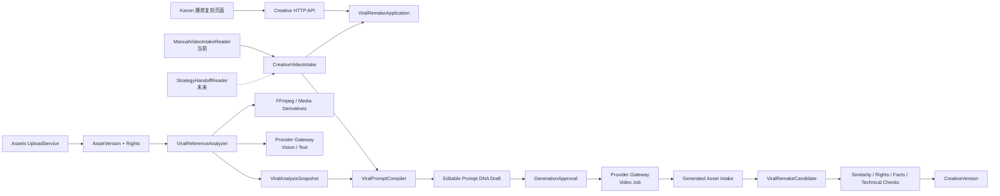

# 爆款复刻 MVP 技术实施方案

> 日期：2026-07-28
>
> 状态：实施评审候选
>
> Owner：Creative
>
> 范围：效果广告 / 爆款复刻
>
> 当前协作约束：Strategy 尚未提供正式 Handoff，本期先使用用户输入；现有 Kanon 前端布局保持不变

## 1. 方案结论

本期要跑通的不是“把参考视频直接交给模型照着生成”，而是一条可追溯、可人工修订、可在未来无缝接入 Strategy 的 Creative 生产链路：

```text
用户填写目标产品、卖点、CTA 和文本约束
  + 上传有权使用的参考视频
  + 可选上传目标产品参考图片
→ Assets 形成稳定 AssetVersionRef
→ Creative 创建 manual CreativeIntake 和 viral_remake CreativeTask
→ 拆解参考视频的结构、节奏、镜头功能、声音与转化节点
→ 生成五维 Prompt DNA 草稿
→ 用户修订并确认“保留机制 / 替换元素 / 产品事实”
→ Creative 编译不可变 PromptPackage
→ Provider Gateway 调用 cookies.video.standard
→ ProviderJob 异步生成视频
→ 生成结果转存项目 AssetVersion
→ 原创度、授权、技术质量和品牌事实检查
→ 保存 CreativeVersion 候选并进入人工评审
```

未来 Strategy 完成后，仅把输入来源从 `manual` 切换为 `strategy_package`：

```text
当前：ManualVideoIntakeReader → CreativeVideoIntake
未来：StrategyHandoffReader  → CreativeVideoIntake
                               ↓
                    后续分析、生成、入库和评审不变
```

必须遵守以下边界：

1. Creative 拥有爆款复刻任务、分析快照、原创改写、Prompt、候选版本和检查结论。
2. Strategy 只提供已批准策略的稳定投影，不拥有脚本、镜头和生成 Prompt。
3. Provider Gateway 是模型调用的唯一入口；Creative 不直接依赖厂商 SDK、模型 ID、密钥或 Base URL。
4. Assets 拥有媒体二进制、技术元数据和权利记录；Creative 只保存稳定的 Asset ID 与 Version。
5. 当前手工输入不得伪装成 `StrategyPackage`，不得伪造 Package Hash 或 Handoff Hash。
6. 接入正式 Strategy 时创建新的 Intake，不原地改写旧的 manual Intake。
7. 参考视频只用于提取可解释的结构和机制；不得默认复用原人物、画面、音乐、台词、字幕、商标或其他受保护表达。

## 2. 依据与约束

本方案以以下仓库文档和代码为约束来源：

- [Strategy → Creative 开发契约 v2](../25-strategy-to-creative-development-contract-v2.md)
- [创意创作系统 PRD](../02-creative-studio-prd.md)
- [素材洞察系统 PRD](../03-asset-management-prd.md)
- [统一模型 Provider](../07-unified-model-provider.md)
- [媒体资产平台规格](../11-media-asset-platform.md)
- [API 与领域事件契约](../13-api-event-contracts.md)
- [PRD 通用交互与质量要求](../15-prd-cross-cutting-requirements.md)
- `volcengine-ads.zip` 中的 `ad-explosion`、`explosion pipeline`、FFmpeg 和对应单元测试

其中 [Strategy → Creative 开发契约 v2](../25-strategy-to-creative-development-contract-v2.md) 优先约束跨模块边界；Kanon PRD 约束产品目标、领域归属、页面路径和最终闭环方向。

### 2.1 对契约的具体落实

| 契约要求 | 本方案处理 |
|---|---|
| `StrategyPackage`、`CreativeHandoff`、`CreativeIntake`、`CreativeVideoIntake` 不得合并 | 保留四个资源；manual 只作为 Creative Intake 的来源类型 |
| `/creative-intakes` 是 canonical path | 不创建语义重复的 `/intakes` 或第二套任务 API |
| Route 使用稳定 `route_id` | manual Intake 冻结稳定的 `route_manual_viral_remake_v1`；不持久化 `route_index` |
| Intake 保存不可变 `input_snapshot` | 用户输入、资产版本、权利摘要和确认信息一次性冻结 |
| Readiness 分三级 | 分别计算 planning、generation、production 门禁 |
| Strategy 不提供 concept、脚本、分镜和 Prompt | 全部由 Creative 产生、编辑、版本化 |
| Provider 只接收统一能力请求 | Creative 传 `cookies.vision.standard`、`cookies.text.standard`、`cookies.video.standard` 等逻辑别名 |
| 临时 Provider URL 不进入业务对象 | 生成结果必须由 Assets 转存后才能形成长期引用 |
| 当前页面不要求重做 | 保留 Kanon 页面结构，只替换数据来源和操作行为 |

## 3. 本期范围

### 3.1 必须完成

1. 用户上传一个有使用授权的 MP4 参考视频，并形成稳定 `AssetVersionRef`。
2. 用户可选上传一张目标产品或主体参考图片，并形成稳定 `AssetVersionRef`。
3. 用户填写产品名、两个卖点、CTA、目标时长和文本约束。
4. Creative 创建 `source=manual`、`performance_mode=viral_remake` 的 Intake 和 Task。
5. 服务端真实执行参考视频分析，不再由浏览器生成固定五维文本。
6. 保存参考视频结构、时间段、证据、模型/Prompt 版本、置信信息和分析快照。
7. 服务端生成五个可编辑 Prompt 维度：任务目标、画质风格光影、环境氛围、镜头画面、音乐音效。
8. 用户可修订五维结果并显式确认生成。
9. 通过 Provider Gateway 创建真实视频 ProviderJob。
10. 生成 MP4 被转存为当前 Project 的 AssetVersion。
11. 保存 ProviderJob、PromptPackage、输入资产、输出资产与 CreativeTask 的完整血缘。
12. 至少执行版权/相似性风险、素材权利、产品事实和视频技术质量四类检查。
13. 页面刷新后能从服务端恢复任务、分析、编辑内容和生成状态。

### 3.2 本期非目标

- 不实现抖音、快手链接自动下载；MVP 只接受用户上传或已有项目资产。
- 不复制压缩包中的 Electron、IPC、SQLite、浏览器 Cookie 或本地绝对路径体系。
- 不一次实现完整多轨剪辑器、批量裂变、自动投放和效果回流。
- 不把爆款分析的最终领域 Owner 提前放到 Insights；本期分析属于 Creative 任务内生产快照。
- 不在前端或 Creative 数据库保存真实厂商模型名、Token、Base URL 或厂商临时结果 URL。
- 不承诺自动判定“绝对无版权风险”；系统给出结构化风险和门禁，正式评审仍需人工确认。
- 不把本地 deterministic fallback 的成功当成真实 VLM 验收通过。

## 4. 当前实现与目标差距

### 4.1 前端

当前 `ViralRemixWorkspace` 已经有 Kanon 设计的三栏工作区和五维展示，但业务行为仍是原型：

- 文件选择只创建浏览器 `blob:` 预览，没有上传到 Assets。
- 源视频 Asset ID 默认值是占位字符串。
- `/remix-hit-analyses` 没有对应后端路由。
- 分析请求失败后会静默使用 `buildLocalHitAnalysis` 固定草案。
- 五维 Prompt 主要由浏览器拼接，刷新后丢失。
- 生成操作调用通用 `createMedia`，没有绑定正式 CreativeTask、PromptPackage 和相似性门禁。
- “已配置 Provider”的判断来自前端配置摘要，不能代替服务端 generation gate。

本期不改变页面布局，只把以上原型行为替换为正式接口。

### 4.2 Creative

现有 Creative 已具备 Intake、CreativeTask、VideoDraft、CreativeVersion、MySQL Repository 和视频任务基础，但仍偏向小红书图文与前贴：

- manual Intake 的内容校验仍限制为小红书。
- 旧视频 Route 依赖 `route_index`，并把前贴时长固定为 5 秒。
- VideoDraft 仍是前贴专用的 5 秒、9:16、720p 形状。
- 尚无爆款参考分析、五维 Prompt 草稿、PromptPackage 和原创度检查实体。
- 尚无爆款复刻专用命令与服务端状态恢复。

实施时应扩展 Creative 的视频深模块，不另建一个平行的“爆款系统”。

### 4.3 Provider

当前 Provider 已具备同步 Text/Vision seam、异步 Video Job、逻辑模型路由、幂等、调度、轮询、视频多模态稳定输入和生成结果入库边界。

当前缺口：

- 真实视频理解 Adapter 尚未形成可用爆款分析链路。
- 长视频应先抽帧、提取音频/字幕，再做受控 VLM 分析。
- Creative 尚未通过自身 application service 调用 Vision 与 Video 能力。
- Provider Job 完成后还没有自动回写爆款候选状态和检查状态。

### 4.4 Assets

Assets 已有上传、元数据、视频探测和生成结果接入基础，但当前页面没有调用这些能力。MVP 需要补齐：

- 上传完成后返回稳定的 `ProjectAssetRef`。
- 视频代理、封面、关键帧、音轨/字幕派生物可被分析流程读取。
- 参考视频、参考图片和生成视频都有权利摘要。
- 未知或过期授权阻断真实生成或最终冻结。

### 4.5 现有 `internal/platform/remix`

该模块更接近“素材剪辑计划与渲染”的平台能力，拥有 opening/middle/ending 片段、Clip 和 RenderJob，但不拥有爆款复刻业务语义。因此可复用剪辑与渲染能力，但不能把 `remix.Plan` 当作 `CreativeTask`，也不能把 RenderJob 状态当作 CreativeVersion 状态。

## 5. 目标架构



### 5.1 深模块接口

Creative 对 HTTP 层提供一个小而稳定的 application seam：

```go
type ViralRemakeApplication interface {
    CreateManualIntake(ctx context.Context, cmd CreateManualViralIntake) (CreativeIntake, error)
    CreateTask(ctx context.Context, intakeID string, cmd CreateViralTask) (CreativeTask, error)
    AnalyzeReference(ctx context.Context, taskID string, cmd AnalyzeViralReference) (AnalysisRun, error)
    UpdatePromptDraft(ctx context.Context, taskID string, cmd UpdateViralPromptDraft) (PromptDraft, error)
    ConfirmAndGenerate(ctx context.Context, taskID string, cmd ConfirmViralGeneration) ([]Candidate, error)
    GetWorkspace(ctx context.Context, taskID string) (ViralRemakeWorkspace, error)
}
```

它依赖窄接口 `VideoIntakeReader`、`ViralReferenceAnalyzer`、`ViralVideoGenerator` 和 `CreativeAssetGateway`。边界要求：

- HTTP handler 不编译 Prompt、不直接调用 Provider、不写数据库事务细节。
- Analyzer 不创建 CreativeVersion。
- Provider Adapter 不理解 StrategyPackage、CreativeIntake 或五维 UI。
- Assets 不判断候选是否被 Creative 批准。

## 6. Strategy 未完成时的输入方案

### 6.1 当前 manual 来源

当前页面通过 canonical `/creative-intakes` 创建 Creative-owned manual Intake：

```json
{
  "contract_version": "creative-intake-create/manual-video/v1",
  "source": "manual",
  "format": "video",
  "route": {
    "route_id": "route_manual_viral_remake_v1",
    "deliverable_type": "video",
    "purpose": "performance",
    "performance_mode": "viral_remake",
    "channels": ["douyin"],
    "spec": {
      "target_duration_seconds": 15,
      "aspect_ratio": "9:16",
      "resolution": "720p",
      "hook_deadline_seconds": 1
    }
  },
  "campaign": {
    "objective": "生成原创转化广告候选",
    "audience": "用户填写",
    "core_message": "用户填写",
    "call_to_action": "用户填写"
  },
  "product": {
    "product_name": "用户填写",
    "selling_points": ["用户填写"],
    "proof_points": []
  },
  "source_assets": [{
    "role": "reference_video",
    "asset_ref": {"asset_id": "asset_x", "version": 1}
  }],
  "user_instruction": "用户填写",
  "confirm_route": true
}
```

服务端必须：

- 从可信身份和 ProjectContext 取得 Organization 与 Project；
- 计算规范化请求 Hash；
- 保存完整、不可变的 manual `input_snapshot`；
- 把人工输入标识为 manual fact 或 assumption；
- 对产品事实和素材权利执行本地校验；
- 不生成任何虚假 Strategy Package ID、Version 或 Hash。

`creative-video-intake/v1` 是 Creative 内部契约，可增加 `source.kind=manual` 加法分支：

```json
{
  "kind": "manual",
  "manual_input_id": "manual_input_x",
  "content_hash": "sha256:...",
  "confirmed_by": "user_x",
  "confirmed_at": "2026-07-28T08:00:00Z"
}
```

这不改变 `strategy-creative-handoff/v1`，也不改变 Strategy 的 Owner 边界。

### 6.2 未来 Strategy 来源

Strategy 接线后：

1. 使用 `StrategyHandoffReader` 读取已批准、不可变 Handoff。
2. 校验 Package Hash 与 Handoff Hash。
3. 用户显式选择 `performance_mode=viral_remake` 的稳定 `route_id`。
4. 创建新的 `source=strategy_package` Intake。
5. 将 objective、audience、product、CTA、guardrails、claims、assets 和 rights 投影到同一个 `CreativeVideoIntake`。
6. 原 manual Intake 保留历史，可显式标记 superseded，但不得原地伪装成 Strategy 来源。

## 7. 核心领域对象

### 7.1 `ViralRemakeDraft`

CreativeTask 下唯一可编辑的当前爆款草稿：

```text
task_id / revision / status
source_intake_ref
source_video_ref / reference_image_ref?
user_instruction / product_facts
analysis_snapshot_ref?
prompt_dimensions[5]
preserve_rules[] / replace_rules[] / brand_mapping[]
variant_plan[]
content_hash
updated_by / updated_at
```

更新要求 `expected_revision`；冲突返回 409，不允许最后写入者静默覆盖。

### 7.2 `ViralAnalysisRun`

一次可重试的异步分析作业：

```text
id / task_id
input_snapshot_hash / source_asset_ref
status / progress
processor_version
vision_model_alias / vision_route_revision_id
prompt_template_version
result_snapshot_ref?
error?
started_at / finished_at
```

相同 Task、输入 Hash、分析器版本和 Idempotency-Key 重放时返回同一分析作业。

### 7.3 `ViralAnalysisSnapshot`

分析成功后形成不可变快照：

```text
source_asset_ref / video_meta
transcript_segments[] / visual_segments[]
conversion_nodes[]
hook_pattern / structure_map[] / rhythm_map[]
camera_functions[] / audio_pattern
replicable_mechanisms[] / forbidden_elements[]
confidence / evidence_refs[]
model_lineage / content_hash
```

每个 AI 提取字段携带 evidence、confidence 和 extraction method；用户确认后另存确认状态，不覆盖原始 AI 输出。

### 7.4 `ViralPromptDraft`

对应页面五张卡片：`task_goal_type`、`quality_style_lighting`、`environment_atmosphere`、`camera_content`、`music_sound`。

每个维度包含 `prompt`、`evidence_refs`、`confidence`、`source=ai_extracted|user_edited` 和 `updated_at`。它们是模型根据参考视频、产品信息和用户指令生成的可编辑中间结果，不要求用户从空白填写。

### 7.5 `ViralPromptPackage`

用户确认后冻结：

```text
contract_version / task_id / prompt_version
analysis_snapshot_hash / manual_or_strategy_input_hash
dimensions / preserve_rules / replace_rules
product_facts / claims_and_evidence / negative_constraints
generation_spec / content_hash
confirmed_by / confirmed_at
```

Provider 只接收从该 Package 编译出的统一视频输入，不接收 Handoff 原始对象。

### 7.6 `ViralRemakeCandidate`

```text
id / task_id / variant_key
prompt_package_ref / provider_job_id
output_asset_ref?
status / check_summary / created_at
```

候选和 ProviderJob 状态分离。Provider 故障不应导致 Creative 草稿和分析快照不可读取。

### 7.7 `ViralRemakeCheckReport`

| 检查 | MVP 规则 |
|---|---|
| Rights | 参考视频与产品图权利明确；未知/过期阻断真实生成或冻结 |
| Similarity | 检查逐字台词、原字幕、商标/Logo、人物、音乐和高相似镜头描述 |
| Product facts | Prompt 中卖点、数字和 CTA 均能追溯到用户确认或 Strategy evidence |
| Technical | MP4 可解码、时长/画幅/分辨率符合 Route、无空文件和明显损坏 |
| AI disclosure | 记录 AI 生成、模型血缘及交付所需披露状态 |

高风险时不得进入最终 CreativeVersion，只能重新编辑或重新生成。

## 8. 分析与生成流程

### 8.1 参考视频分析

```text
1. 校验 Project、AssetVersion、MIME、时长和权利
2. 读取或生成视频代理
3. FFmpeg 探测时长、画幅、帧率和音轨
4. 生成关键帧 / 场景切分 / 音频派生物
5. ASR 提取带时间戳文本
6. VLM 分析关键帧、镜头功能、光影、环境和视觉变化
7. Text/VLM 合并为结构化 segments 与 conversion nodes
8. JSON Schema 校验输出
9. 保存不可变 ViralAnalysisSnapshot
10. Creative 编译五维 Prompt Draft
```

MVP 可以用关键帧加 ASR 完成分析，不要求 Provider 首期原生接收完整 30 秒视频。真实 Provider Adapter 必须通过 Gateway；测试环境使用 deterministic fake，但前端必须明确显示 fake，非 local 环境不得静默降级。

### 8.2 原创改写

Prompt 编译器必须明确区分：

- `preserve`：钩子出现时间、信息功能顺序、镜头功能、节奏推进、证明位置、CTA 收口方式；
- `replace`：人物、具体场景、品牌、产品、台词、字幕、音乐、商标、构图和受保护视觉表达；
- `product facts`：只允许用户确认或 Strategy/evidence 支持的事实；
- `negative constraints`：原片 Logo、原人物、逐字台词、原字幕、受保护音乐、虚假功能等。

参考视频在 MVP 中不直接作为生成 conditioning asset 传给模型；模型得到结构化分析和原创 Prompt。目标产品图片可在权利允许时作为 reference image 传给 Provider。

### 8.3 视频生成

```text
ViralPromptPackage
→ 编译 provider.VideoGenerationInput
→ model_alias=cookies.video.standard
→ 创建幂等 ProviderJob
→ 轮询 / 回调更新 Provider 状态
→ 下载和校验厂商输出
→ Assets 转存
→ 建立 ProjectAssetRef
→ 回写 ViralRemakeCandidate
→ 执行检查
```

业务请求不携带真实模型 ID。模型切换通过 Provider 路由完成，任务开始后不得静默换模。

## 9. Readiness 门禁

### 9.1 Planning gate

目标产品、受众或明确假设、创意目标、参考视频 AssetVersionRef、`performance_mode=viral_remake` 和 manual 来源确认齐全时为 true。缺失时可保存 `needs_clarification` Intake，但不得创建正式 CreativeTask。

### 9.2 Generation gate

以下条件全部满足时为 true：

- planning 已通过；
- 参考视频权利允许分析和衍生创作；
- 必需产品素材权利 verified；
- 产品卖点、数字、CTA 已确认；
- 五维 Prompt Draft 已保存；
- 用户已确认 PromptPackage；
- Provider 视频路由可用；
- 不存在阻断级相似性或合规问题。

未通过时允许继续分析和编辑，但不得创建真实付费 ProviderJob。

### 9.3 Production gate

以下条件全部满足时为 true：

- generation 已通过；
- 输出视频已转存为 ready AssetVersion；
- Rights、Similarity、Product facts、Technical 检查通过；
- 必要 AI 披露信息存在；
- 用户完成候选确认；
- 最终渠道规格齐全。

未通过时可保留候选，但不得冻结最终 CreativeVersion 或交付。

## 10. 状态机

详细状态放在爆款子资源中，避免无限扩张 `CreativeTask.status`：

```text
draft → waiting_for_analysis → analyzing → analysis_ready
→ editing_prompt → generation_blocked | generation_ready
→ generating → candidate_ready | partially_succeeded
→ checking → review_ready → approved
```

旁路状态包括 `analysis_failed`、`generation_failed`、`result_unknown`、`canceled`、`archived`。

规则：

- 分析失败不删除已上传资产和用户输入。
- 单个候选失败可单独重试，不重复生成成功候选。
- 外部写入结果未知不等于失败，先用 Provider 外部任务 ID 对账。
- 已确认 PromptPackage 不可编辑；修改创建新版本并使旧确认失效。
- 已批准 CreativeVersion 不可覆盖，只能创建新版本。

## 11. API 设计

### 11.1 Assets

沿用共享基座：

```http
POST /platform/v1/projects/{project_id}/assets/uploads
PUT  /platform/v1/projects/{project_id}/assets/uploads/{upload_id}
POST /platform/v1/projects/{project_id}/assets/uploads/{upload_id}:finalize
GET  /platform/v1/projects/{project_id}/assets/{asset_id}
```

前端上传成功后只保存返回的 Asset ID/Version，不保存本地文件名作为事实来源。

### 11.2 Creative

```http
POST /api/creative/v1/projects/{project_id}/creative-intakes
GET  /api/creative/v1/projects/{project_id}/creative-intakes/{intake_id}
POST /api/creative/v1/projects/{project_id}/creative-intakes/{intake_id}:create-video-task

GET  /api/creative/v1/projects/{project_id}/creative-tasks/{task_id}/viral-remake
POST /api/creative/v1/projects/{project_id}/creative-tasks/{task_id}/viral-remake:analyze-reference
PATCH /api/creative/v1/projects/{project_id}/creative-tasks/{task_id}/viral-remake/prompt-draft
POST /api/creative/v1/projects/{project_id}/creative-tasks/{task_id}/viral-remake:confirm-generation
POST /api/creative/v1/projects/{project_id}/creative-tasks/{task_id}/viral-remake/candidates/{candidate_id}:retry
POST /api/creative/v1/projects/{project_id}/creative-tasks/{task_id}/viral-remake/candidates/{candidate_id}:submit-review
```

约束：

- create、analyze、confirm、generate、retry、submit-review 都要求 `Idempotency-Key`。
- PATCH 使用 `If-Match` 或 `expected_revision`。
- `create-video-task` 使用 `selected_route_id`，不新增 `route_index` 调用方。
- 页面刷新通过 workspace GET 恢复，不依赖路由内存或浏览器拼接结果。
- 错误返回统一信封、稳定 code、request ID 和用户可执行的恢复动作。
- 浏览器不直接提交通用 ProviderJob；由 Creative application service 调用内部 Provider interface。

## 12. 持久化

建议新增以下 Creative 表，继续使用现有 migration 目录和 MySQL：

| 表 | 关键内容 |
|---|---|
| `creative_viral_remake_drafts` | task_id、revision、status、input snapshot/hash、源资产引用、analysis ref、prompt draft/hash、更新人 |
| `creative_viral_analysis_runs` | 幂等、输入 hash、处理器/Prompt/路由版本、状态、进度、不可变结果、错误 |
| `creative_viral_prompt_packages` | task_id、version、content/hash、输入/分析 hash、确认人和时间 |
| `creative_viral_candidates` | task、PromptPackage、variant、ProviderJob、输出 Asset、状态、检查摘要 |

ProviderJob 与 AssetVersion 继续由各自模块拥有，不复制完整资源到 Creative 表。

## 13. 对 `volcengine-ads.zip` 的复用策略

压缩包 `src/main/pipelines/explosion/index.ts` 已实现：

```text
download → asr → script_parse → rewrite
→ script_confirm → video_prompt_optimize → seedance
```

其中值得迁移的不是 Electron 应用，而是以下规则和测试向量：

- 分析结构：CTA、scenes、selling points、hook formula、conversion triggers、rhythm、original script、high-value/replaceable segments、similarity risk、reference policy 和 risk notes。
- 变体结构：strategy、copy、script、preserve、replace、difference target、variant reason 和 storyboard。
- CTA 缺失先给 warning，再在人工确认阶段处理。
- 人工确认后才继续优化 Prompt 和创建付费生成任务。
- 按 4～15 秒拆段、连续镜头参考、单段失败重试和最后拼接。
- 参考视频被模型拒绝时显式切换到 no-reference Prompt，而不是静默改变行为。
- FFmpeg 的媒体标准化、抽音频、裁切、无音轨补静音和拼接行为。
- `ModelClient` 的窄接口思想；厂商请求仍需落入 cookies Provider Adapter。

### 13.1 可迁移测试

- CTA warning。
- 超长内容拆段、上一段连续参考和最终拼接。
- 异常分镜时长归一化。
- 禁止绕过统一音频能力调用外部 TTS。
- FFmpeg 输出组合与资产注册。
- 分析/生成失败后的持久化恢复。

### 13.2 后置能力

压缩包中的组合裂变、槽位组合、均匀抽样、BGM 混音和抖音下载不进入第一版。第一版只迁移单条：

```text
理解 → 改写 → 人工确认 → 生成 → 入库
```

### 13.3 不可直接迁移

- Electron IPC/Renderer 和原页面。
- SQLite、本地 JSON artifact 和本地队列。
- `sourceVideoPath`、`slotAssetPaths`、`bgmPaths`、`file://` 和本地绝对路径 DTO。
- 抖音 Cookie、本地 Chromium 登录和 Keytar。
- 直接持有厂商 API Key 的 ModelClient。
- 厂商模型 ID、Base URL 和临时返回 URL 进入 Creative 数据。
- 与现有 ProviderJob、Assets 和 `internal/platform/remix` 重复的实体。

压缩包根目录未发现 LICENSE；即使是内部来源，整体复制前仍需确认授权。本方案只迁移可解释规则、测试向量和少量纯函数思想。

## 14. 前端接线

页面视觉与布局不改，只调整行为：

1. 两个上传入口调用 Assets，完成后自动保存 Asset ID/Version。
2. 产品、卖点和 CTA 首次提交时创建 manual Intake 与 CreativeTask。
3. “视觉理解拆解五维提示词”创建异步 AnalysisRun。
4. 五张卡片展示服务端输出、AI 标识、置信和证据；编辑触发带 revision 的自动保存。
5. “生成复刻视频”先调用 confirm-generation，由服务端执行 readiness。
6. 展示排队、运行、部分成功、失败、结果未知、取消和重试状态。
7. 页面刷新后通过 workspace GET 恢复。
8. 非 local 环境禁止静默回退到 `buildLocalHitAnalysis`。
9. 错误显示“发生了什么、已保留什么、下一步怎么做、request ID”。

## 15. 安全、权利与合规

- 上传时校验真实 MIME、大小、视频格式、时长、恶意文件和内容哈希。
- 服务端从 ActorContext 取得 Organization，不接受客户端覆盖。
- 每个引用都校验同 Project 或显式授权引用。
- 参考视频权利未知时允许保存草稿，但不允许真实生成或最终冻结。
- 目标产品图传给视频模型前必须确认 `generative_ai_allowed`。
- 原片音乐、人物、声音、Logo、商标、字幕和逐字台词默认进入 replace/forbidden 清单。
- 用户输入和 ASR/VLM 结果都作为不可信内容，不能控制系统 Prompt 或越权读取其他资产。
- 日志记录 ID、Hash、状态、耗时和错误码，不记录 Token、完整厂商请求、受限媒体内容或长期 URL。
- 输出资产记录 AI 生成来源、逻辑模型、实际路由版本、PromptPackage、来源资产和必要披露。

## 16. 事件与可观测性

关键业务写入与 Outbox 同事务提交。建议事件：

```text
creative.viral_remake.analysis.completed.v1
creative.viral_remake.prompt.confirmed.v1
creative.viral_remake.candidate.created.v1
creative.viral_remake.check.completed.v1
creative.approved.v1
asset.ready.v1
model.job.completed.v1
```

事件只携带稳定 ID、Version、状态摘要和 Hash；完整分析与媒体通过授权 API 获取。

指标至少包含上传成功率、分析成功率/P95/人工修改率、Provider 成功率/P95/成本、候选采用率、重试率、检查失败分布、端到端耗时以及 Fake/真实 Provider 调用占比。

## 17. 测试方案

### 17.1 Contract 与 Unit

- manual 与 strategy_package 两种输入映射到同一个 `creative-video-intake/v1`。
- manual 输入不产生 Strategy Package/Hash。
- Route 使用稳定 `route_id`。
- Schema、规范化 Hash、五维 Prompt、preserve/replace、三级 readiness。
- 相同幂等键相同请求重放、不同请求冲突。
- revision 冲突。
- Provider 输入不含 Handoff、Token、真实模型 ID 或临时 URL。
- 迁移压缩包的 CTA warning、4～15 秒拆段、连续参考、异常时长归一化和拼接用例。

### 17.2 Integration

- MySQL 持久化和页面刷新恢复。
- Assets 上传、探测、派生物和权利门禁。
- Fake Vision → Prompt → Fake Video → Asset 入库。
- 分析失败后重试不丢用户输入。
- Provider 部分成功只重试失败候选。
- Provider 结果未知时对账而非重复付费。
- 生成成功但 Asset Intake 失败时可补偿。
- Outbox 与业务数据原子写入。

### 17.3 Browser acceptance

1. 上传授权 MP4 和产品图。
2. 填写产品、卖点、CTA 与文本指令。
3. 创建 manual Intake 和 viral_remake Task。
4. 分析完成后出现五个真实服务端维度。
5. 修改“环境氛围”后刷新页面，内容不丢失。
6. 未确认权利时生成被服务端门禁拒绝。
7. 确认后创建一个 ProviderJob。
8. 任务完成后在当前 Project 素材中看到 MP4。
9. 候选显示来源、PromptPackage、ProviderJob 与检查结果。
10. 高相似或权利失败候选不能提交最终评审。

### 17.4 真实烟测

先通过本地 Fake 全链路，再用一条无敏感信息、已授权测试素材生成一个 4～15 秒、720p、9:16 候选，确认 MP4 下载、校验和 Asset 入库。Token、URL 和真实模型 ID 不进入 Git。

## 18. 实施顺序

### Phase 0：契约与测试基线

1. 冻结 manual video Intake、ViralAnalysisSnapshot、PromptPackage Schema。
2. 补充 OpenAPI 命令和错误码。
3. 建立 ready、rights-blocked、similarity-blocked、provider-failed Fixtures。
4. 把压缩包中可复用流程场景转成 Go 测试向量。

完成标准：Schema、Fixtures、OpenAPI 和现有契约测试通过，未改前端。

### Phase 1：输入、任务和恢复

1. 扩展 manual Intake 支持 video/viral_remake。
2. 用 `selected_route_id` 创建视频任务。
3. 增加爆款草稿和 workspace GET。
4. 接通 Assets 上传和 AssetVersionRef。
5. 保存 input snapshot、三级 readiness 和 revision。

完成标准：上传和手工输入后可创建 Task，刷新页面仍能恢复。

### Phase 2：真实分析与五维 Prompt

1. 实现媒体派生、ASR 和关键帧流程。
2. 实现 Provider-backed ViralReferenceAnalyzer。
3. 保存不可变 AnalysisSnapshot。
4. 实现 ViralPromptCompiler 和五维编辑。
5. 移除非 local 静默 fallback。

完成标准：五维内容来自服务端真实分析，并能编辑、版本化、恢复。

### Phase 3：生成、入库和候选

1. 实现 PromptPackage 确认。
2. 通过 Provider Gateway 创建视频任务。
3. 将结果转存 Assets。
4. 回写候选状态并支持失败项重试。
5. 执行四类最小检查。

完成标准：`CreativeTask → ProviderJob → AssetVersion → Candidate` 可追溯。

### Phase 4：联合验收

1. Fake 全链路自动化验收。
2. MySQL、Assets、Outbox 与恢复验收。
3. 一次真实视频 Provider 烟测。
4. 浏览器完成输入、分析、编辑、确认、生成、入库和提交评审。
5. 所有必需 CI 检查通过。

## 19. Definition of Done

- [ ] Kanon 爆款复刻页面布局未被重做。
- [ ] 上传文件形成真实 AssetVersionRef，不再只有浏览器预览。
- [ ] 当前用户输入明确标记为 manual，未伪造 StrategyPackage。
- [ ] 未来 Strategy Handoff 能映射到同一个 CreativeVideoIntake。
- [ ] 稳定 `route_id` 替代新调用中的 `route_index`。
- [ ] Intake 保存不可变 input snapshot，并计算三级 readiness。
- [ ] 五维分析来自服务端，AI 输出、证据和置信可识别。
- [ ] 用户编辑和确认有 revision、Hash、作者和时间。
- [ ] Provider Gateway 是 Vision/Text/Video 的唯一模型入口。
- [ ] 真实模型 ID、密钥、Base URL 和厂商临时 URL 未进入 Creative 契约。
- [ ] 生成视频成功转存为当前 Project 的 AssetVersion。
- [ ] Candidate 能追溯到 Task、PromptPackage、ProviderJob 和输入/输出资产。
- [ ] 权利、相似性、产品事实和技术质量检查可阻断最终冻结。
- [ ] 页面刷新能恢复完整状态。
- [ ] 幂等、并发、失败、结果未知和补偿路径有自动化测试。
- [ ] `git diff --check`、Go 测试、前端 build 和 GitHub Actions 全部通过。

## 20. 预计代码改动范围

```text
api/contracts/
api/fixtures/
api/openapi/creative-v1.yaml

internal/systems/creative/
  viral_remake_model.go
  viral_remake_service.go
  viral_remake_repository.go
  viral_remake_mysql_repository.go
  viral_prompt_compiler.go
  viral_checks.go

internal/integrations/creativeprovider/
internal/integrations/creativeassets/
internal/platform/assets/
internal/platform/provider/
internal/platform/httpserver/
migrations/creative/

src/data/api.ts
src/components/SpecializedPages.tsx
  只做接口和状态接线，不改变 Kanon 页面布局
```

## 21. 默认决策与待确认项

| 项目 | 默认值 |
|---|---|
| 渠道 | 抖音 |
| 模式 | `viral_remake` |
| 画幅 | 9:16 |
| 分辨率 | 720p |
| 首次候选数 | 1 |
| 生成时长 | Provider 单次 4～15 秒；较长目标拆成多个镜头后再剪辑 |
| 参考视频最大时长 | MVP 180 秒 |
| 参考视频传给生成模型 | 第一版否，只传结构化分析 |
| 参考图片传给生成模型 | 权利通过且 Adapter 支持时传 |
| 分析失败降级 | local 可显式 Fake；非 local 不静默降级 |
| Strategy 未接线 | 使用 manual Intake，不伪造 Strategy 数据 |
| 正式交付 | 必须通过 production gate 和人工评审 |

编码前仍需确认但不阻塞方案冻结：

1. 第一版真实 VLM Adapter 使用哪条 Provider 路由。
2. ASR 使用 Provider Gateway 音频能力，还是先复用现有受控服务。
3. 相似性第一版采用规则检查、模型评审还是二者组合。
4. 真实视频模型是否支持目标产品 reference image；不支持时退回 text-only。
5. 最终 30 秒成片是否首期由多个短候选经现有 remix/render 能力拼接。

这些选择只能改变 Adapter 和实现策略，不得改变 Creative、Provider、Assets 和 Strategy 的 Owner 边界。
