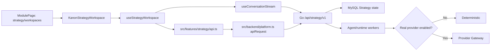

# Kanon 策略工作区真实后端接入技术实施方案与反向评审

> 日期：2026-07-29
>
> 状态：反向评审后实施候选
>
> 前端基准：仓库根目录 `src/`
>
> 参考实现：`web/src/features/strategy/`，仅参考领域契约与算法，不作为页面或运行时依赖
>
> 后端基准：`/api/strategy/v1`
>
> 配套调研：[Kanon 策略工作区后端优先接入：需求分析与技术调研](../research/kanon-strategy-workspace-backend-first-technical-research-2026-07-29.md)
>
> 架构补充：[研究洞察、能力运营与分级评审](../research/kanon-research-skills-review-architecture-addendum-2026-07-29.md)

## 1. 方案结论

本期在用户截图确认的 Kanon 应用中，把 `strategy/workspaces` 从通用静态 `WorkspaceSurface` 升级为专用的真实 Strategy 工作区。

目标链路：

```text
Kanon Project
  -> Strategy Workspace
  -> Conversation / Messages / AgentTask
  -> BriefDraft
  -> immutable BriefVersion
  -> StrategyDraft / DraftRevision
  -> Review / Comments / Return / Resubmit / Approve
  -> immutable StrategyPackage
```

实施原则：

1. 页面、路由、顶栏、侧栏、Project 上下文、三栏布局和底部状态栏均使用根 `src/`。
2. `web/` 只参考 API path、领域类型、SSE parser、恢复算法和测试案例。
3. 新实现不得从 `web/` import 任何运行时代码或 CSS。
4. Strategy 领域对象不再通过通用 `ApiArtifact` 承载。
5. 页面状态以 Strategy API 和数据库为权威，ProjectContext 只提供 Project 身份和全局摘要。
6. 先保持 `COOKIES_STRATEGY_REAL_PROVIDER_ENABLED=false`，在 deterministic 模式完成全链路。
7. 真实模型是后续独立放量阶段，不与页面接入同时打开。

## 2. 范围条件

### 2.0 后续模块方向

本方案完成当前 Strategy workspace 主链后，按以下方向扩展：

- “研究洞察”作为对话可调用的证据工具层，接入素材洞察投前数据、联网搜索、品牌内部资料和后端 MCP Runner；
- “能力运营”先展示仓库现有平台/目标 Skills、版本、内容哈希、质量检查和 SkillRun 血缘，再演进为可评测、灰度和回滚的 Registry；
- “评审中心”以 Project/Workspace 的显式 review policy 区分个人确认与组织 Leader/指定审批人评审，不根据组织人数或 Membership role 隐式推断。

具体后端边界、MCP transport、数据模型、接口和反向评审见配套架构补充。

### 2.1 本期必须完成

- `strategy/workspaces` 真实读取或创建主 workspace；
- 创建、恢复并持续使用同一个 conversation；
- 消息发送、AgentTask 状态、SSE 通知和 REST 恢复；
- Brief 草稿、字段状态、完整度、编辑、冲突处理和确认；
- Strategy 生成、章节编辑、自然语言修订、版本列表和生成元数据；
- Review 候选、评论、退回、再提交、批准；
- 批准后读取 StrategyPackage；
- Kanon “概览、对话、Brief、策略、评审”五个页签显示真实状态；
- “研究、实验、变更记录”不再显示伪造内容；
- 刷新、断线、重试、Project 切换和浏览器返回操作可恢复；
- 根前端单测、组件测试、E2E、build 和 CI。

### 2.2 本期明确不做

- 不替换为 `web/` 旧版页面；
- 不接入旧版 `strategy.css`；
- 不重构整个 `Pages.tsx`；
- 不实现完整研究编排、实验中心和跨项目评审中心；
- 不实现所有历史 conversations/workspaces/reviews 的管理中心；
- 不把 Strategy task 写入平台 BusinessTask；
- 不修改 Creative、Insights、Delivery 的工作区外壳；
- 不打开真实文本 provider；
- 不把 deterministic 输出展示成真实模型输出。

### 2.3 截图页面与本期目标的关系

用户截图是根 `src/` 的 `strategy/tasks -> TaskCenterPage`，本期目标是同一 Kanon 左侧导航下的 `strategy/workspaces`。

这两者必须分开：

- 截图用于锁定正确前端和设计语言；
- 本期不承诺让“新建策略任务”平台 BusinessTask 流程可用；
- 本期 Strategy workspace 使用 Strategy 自己的 workspace/current task；
- 若要求从任务中心创建并进入独立 Strategy workspace，需要新增正式映射契约，不能隐式关联。

因此本方案是“策略工作区闭环”的完整方案，不是“需求与策略整个子系统全部完成”的方案。

## 3. 当前差距

### 3.1 Kanon 页面

`src/components/Pages.tsx::WorkspaceSurface` 当前：

- 使用 Kanon 正确的三栏布局；
- “推荐定位、目标受众、核心信息、创意路线、成功指标”全部硬编码；
- 对象摘要中的地区、周期和关键决策状态硬编码；
- activeView 只改变标签，不切换业务内容；
- 只有 Brief 生成、确认和商品图绑定走真实接口；
- 没有持续 conversation、Strategy、Review 和 Package。

### 3.2 适配层

当前 `createKanonBrief()` 每次生成 Brief 都：

1. 查找或创建 workspace；
2. 新建 conversation；
3. 发送一条消息；
4. 阻塞轮询 AgentTask；
5. 将 BriefDraft 映射为 `ApiArtifact`。

该模式无法支持多轮对话、刷新恢复和分阶段工作区。

当前 `listKanonArtifacts()` 还把 StrategyPackage 映射成 `kind: "brief"`；`enrichProjectRecord()` 则用 StrategyPackage 同时构造 Brief 和 Strategy 摘要。必须在 UI 接入前修复。

### 3.3 全局状态

`ProjectContext` 适合提供：

- 当前 Project；
- Project 切换；
- 全局 loading/error；
- 跨模块摘要。

它不适合承载：

- Message stream；
- Brief field state；
- Strategy revisions；
- Review candidate/comments；
- AgentTask/SSE；
- 领域 mutation。

Strategy 状态必须放在独立 feature controller。

### 3.4 测试与 CI

- 根 `src/` 没有 Vitest/Testing Library；
- root E2E 只检查策略任务页面和按钮可见；
- `make check` 主要检查 Go 和 `web/`；
- `platform-ci.yml` 只执行 `web` 的 check；
- Playwright 本地 Strategy scopes 未配置。

仅实现页面而不补这些门禁，不具备可交付性。

## 4. 目标架构



运行时依赖方向：

```text
src/components/Pages.tsx
  -> src/features/strategy/*
      -> src/backend/platform.ts
      -> src/context/ProjectContext.tsx

禁止：
src/features/strategy/*
  -X-> web/src/features/strategy/*
```

## 5. 文件级设计

### 5.1 新增文件

```text
src/features/strategy/
  types.ts
  api.ts
  errors.ts
  idempotency.ts
  state.ts
  readSSE.ts
  useConversationStream.ts
  useStrategyWorkspace.ts
  KanonStrategyWorkspace.tsx
  components/
    StrategyWorkspaceBoundary.tsx
    StrategyOverviewPane.tsx
    StrategyConversationPane.tsx
    StrategyBriefPane.tsx
    StrategyDraftPane.tsx
    StrategyReviewPane.tsx
    StrategySummaryRail.tsx
    StrategyEvidenceRail.tsx
```

测试文件与实现同目录：

```text
src/features/strategy/*.test.ts
src/features/strategy/*.test.tsx
```

### 5.2 修改文件

| 文件 | 修改 |
| --- | --- |
| `src/components/Pages.tsx` | 为 `strategy/workspaces` 增加 specialized 分支；移除 `WorkspaceSurface` 内 Strategy 专用状态和 Brief 操作 |
| `src/backend/platform.ts` | 扩展错误信息；全局 Project 摘要分别读取 BriefVersion 与 StrategyPackage |
| `src/backend/kanon-api.ts` | 移除 StrategyPackage → brief artifact 映射；下线旧工作区 Brief 编排 |
| `src/data/api.ts` | 删除迁移后不再使用的 `generateBrief/confirmBrief` 通用入口，或标记为过渡并禁止 Strategy workspace 调用 |
| `src/styles.css` | 复用现有三栏 grid，新增以 `.kanon-strategy-*` 开头的 scoped 样式 |
| `package.json` | 增加 root `test`、`check` 脚本与测试依赖 |
| `vite.config.ts` | 增加 Vitest 配置 |
| `playwright.platform.config.ts` | 增加 Strategy scopes 和 deterministic 配置，或新增独立 Strategy config |
| `Makefile` | `check` 增加 root `npm run check` |
| `.github/workflows/platform-ci.yml` | 安装并检查根前端 |
| `e2e/strategy-kanon.spec.ts` | 新增 Kanon Strategy 全链路 |

### 5.3 明确不修改

- `web/src/features/strategy/StrategyWorkspacePage.tsx`；
- `web/src/features/strategy/strategy.css`；
- `web` router；
- Creative、Insights、Delivery 的页面组件；
- `BusinessTaskPages.tsx` 的平台 task 语义，除非后续另开任务中心联动需求。

## 6. 领域类型

`types.ts` 独立定义并与 Go JSON 字段对齐：

- `Workspace`
- `WorkspaceDetail`
- `Conversation`
- `StrategyTask`
- `Message`
- `AgentTask`
- `ConversationMemory`
- `BriefDraft`
- `BriefVersion`
- `BriefFieldState`
- `StrategyDraft`
- `DraftRevision`
- `GenerationReadiness`
- `GenerationMetadata`
- `SkillRun`
- `Review`
- `ReviewComment`
- `PackageVersion`

要求：

- 保留服务端 snake_case，不在 API 边界做第二套 camelCase DTO；
- UI selector 可以生成 camelCase view model，但不持久化；
- 不复用 `ApiArtifact`；
- 不从 `web/` import type；
- 对状态字段使用字面量 union；
- 服务端新增状态时，unknown 状态必须进入安全的“无法识别”显示，而不是默认批准或完成。

OpenAPI 的部分响应 schema 仍是宽泛 object，当前不适合直接依赖代码生成。先使用手工类型、契约 fixture 和 API 集成测试控制漂移。

## 7. API 客户端

`src/features/strategy/api.ts` 复用 `apiRequest` 和 `BackendApiError`，但所有写方法必须由 controller 传入 mutation key。

### 7.1 读接口

```text
listWorkspaces(projectId)
getWorkspace(workspaceId)
listMessages(conversationId)
getConversationMemory(conversationId)
getAgentTask(agentTaskId)
getBriefDraft(taskId)
listBriefVersions(briefId)
getStrategy(strategyId)
listStrategyRevisions(strategyId)
getGenerationReadiness(projectId)
getGenerationMetadata(strategyId)
listSkillRuns(agentTaskId)
getReview(reviewId)
listReviewComments(reviewId)
listStrategyPackages(projectId)
```

### 7.2 写接口

```text
createWorkspace(projectId, name, mutationKey)
createConversation(projectId, workspaceId, mutationKey)
sendMessage(conversationId, content, mutationKey)
patchBrief(taskId, expectedVersion, operations, mutationKey)
confirmBrief(taskId, expectedVersion, mutationKey)
createStrategy(taskId, briefId, briefVersion, mutationKey)
patchStrategy(strategyId, expectedVersion, baseRevision, section, value, mutationKey)
reviseStrategy(strategyId, expectedVersion, baseRevision, instruction, mutationKey)
submitStrategy(strategyId, expectedVersion, candidateRevision, mutationKey)
addReviewComment(reviewId, body)
returnReview(reviewId, reason)
approveStrategy(strategyId, reviewId, candidateHash, expectedVersion, mutationKey)
```

### 7.3 错误映射

统一映射：

| 状态/错误码 | UI 行为 |
| --- | --- |
| `401` | 显示登录或身份失效，不重试写操作 |
| `403` | 显示缺少的 Strategy 权限 |
| `404` | 清空失效对象并重新恢复 workspace |
| `409 IDEMPOTENCY_CONFLICT` | 停止重试，提示操作键冲突 |
| `409 INVALID_STATE` | 重新读取当前链路并解释下一步 |
| `409 BRIEF_BLOCKED` | 展示完整度 blocker |
| `409 REVIEW_STALE` | 禁止批准并重新读取 Review |
| `412 VERSION_CONFLICT` | 保留用户输入副本，重新读取服务端版本，提示冲突 |
| `429` | 读取 `Retry-After`，只重试读和明确允许的任务查询 |
| `5xx`/network | 保留上下文；对幂等写可用原 key 重试 |

`BackendApiError` 建议增加 `retryable` 和服务端 details，但不得把原始 provider 凭据或内部响应暴露给 UI。

## 8. 幂等设计

现有 `browserIdempotencyKey()` 每次函数调用都生成新 key，不适合网络未知结果后的安全重试。

新增 `idempotency.ts`：

```ts
type MutationScope =
  | 'workspace.create'
  | 'conversation.create'
  | 'message.send'
  | 'brief.patch'
  | 'brief.confirm'
  | 'strategy.create'
  | 'strategy.patch'
  | 'strategy.revise'
  | 'strategy.submit'
  | 'strategy.approve'
```

controller 为一次逻辑操作创建 stable key：

```text
operation fingerprint
  = project/workspace/resource + action + local action id
```

生命周期：

- 开始操作时创建；
- loading 期间重复点击复用同一个 Promise 和 key；
- 2xx 后清除；
- 明确的非重试 4xx 后清除；
- network timeout/connection reset 后保留，用于用户点击重试；
- Project 或 workspace 切换时清除不再相关的 key；
- approve 的 key 在 Review ID 改变前保持稳定。

Review comment 和 return 当前后端不支持幂等：

- 不做自动重试；
- 按钮提交期间锁定；
- comment 成功前不做乐观重复插入；
- ambiguous network error 后先重新读取 Review/comments；
- 后端补幂等列为后续契约修正。

## 9. Controller 与状态机

### 9.1 Snapshot

```ts
type StrategyWorkspaceSnapshot = {
  projectId: string
  workspace: Workspace | null
  detail: WorkspaceDetail | null
  messages: Message[]
  memory: ConversationMemory | null
  briefDraft: BriefDraft | null
  briefVersion: BriefVersion | null
  strategyDraft: StrategyDraft | null
  revisions: DraftRevision[]
  readiness: GenerationReadiness | null
  generationMetadata: GenerationMetadata | null
  skillRuns: SkillRun[]
  review: Review | null
  comments: ReviewComment[]
  packageVersion: PackageVersion | null
}
```

UI 状态：

```text
booting
empty_workspace
ready
refreshing
mutating
recoverable_error
forbidden
fatal_error
```

业务阶段由服务端对象派生：

```text
package published             -> approved
review open/returned          -> review
strategy draft exists         -> strategy
brief confirmed              -> strategy_ready
brief draft exists           -> brief
conversation exists          -> conversation
otherwise                    -> workspace_empty
```

业务阶段不能只保存在 React state，也不能由 activeView 反推。

### 9.2 启动恢复

1. 收到 `projectId` 后增加 request epoch，并 abort 上一个 Project 的请求。
2. list workspaces。
3. 有 workspace 时选择：
   - URL objectId 指定且属于 Project；
   - 否则 primary；
   - 否则最近更新的 active workspace。
4. 没有 workspace 时显示空状态，不在 mount 时自动写数据库。
5. get WorkspaceDetail。
6. 并行读取 messages、memory、Brief、readiness、packages。
7. 若有 current Strategy，读取 draft、revisions、metadata。
8. 若有 current Review，读取 Review 和 comments。
9. 明确按 `version` 最大值选择 BriefVersion/PackageVersion，不依赖列表顺序。
10. 仅当 request epoch 仍匹配时提交 snapshot。

### 9.3 写操作

所有 action 采用：

```text
validate local precondition
  -> acquire action mutex
  -> get/reuse mutation key
  -> call API
  -> refresh affected resources
  -> derive stage
  -> reloadProjects(currentProject.id) only for milestone
  -> release mutex
```

里程碑包括：

- Brief confirmed；
- Strategy submitted；
- Review returned；
- Strategy approved。

普通消息和字段编辑不触发全局 `reloadProjects()`。

### 9.4 Project 切换

- 所有 fetch、SSE、poll timer abort；
- 清空当前 snapshot；
- 清空旧 Project mutation mutex；
- sessionStorage SSE 游标按 conversation ID 隔离；
- 不允许旧 Project 的迟到响应覆盖新 Project。

## 10. SSE 与任务轮询

### 10.1 SSE

从 `web/` 参考并在根 `src/` 重新实现：

- chunk-safe parser；
- CRLF/LF；
- comment；
- multi-line data；
- `id`；
- `retry`；
- `Last-Event-ID`；
- `410` 游标失效恢复；
- AbortSignal。

不直接复制旧 hook，因为旧 hook 每个事件都完整 `load()`，可能造成请求风暴。

Kanon 实现采用 coalesced invalidation：

```text
SSE event
  -> 标记 messages/task/brief dirty
  -> 200ms 合并窗口
  -> 一次 refreshCurrentChain()
```

SSE 是通知通道，REST 是权威数据。

### 10.2 AgentTask polling

- send/create/revise 返回 agent task id 后开始；
- 初始 1.5 秒，逐步退避到 5 秒；
- succeeded 后刷新相关资源并停止；
- failed/cancelled 显示服务端 error；
- 页面离开或 Project 切换时 abort；
- 客户端等待超时只停止轮询，不把服务端任务标成失败；
- 用户可手动“重新检查状态”。

## 11. Kanon UI 实现

### 11.1 路由分发

在 `ModulePage` 增加：

```tsx
system.key === 'strategy' && item.id === 'workspaces'
  ? <KanonStrategyWorkspace ... />
```

必须放在通用 `WorkspaceSurface` 之前。

`WorkspaceSurface` 删除 Strategy 专用 Brief hooks 和硬编码策略内容，继续服务其他通用 workspace。

### 11.2 页签映射

集中定义：

```ts
const strategyViewByLabel = {
  '概览': 'overview',
  '对话': 'conversation',
  'Brief': 'brief',
  '研究': 'research',
  '策略': 'strategy',
  '实验': 'experiments',
  '评审': 'review',
  '变更记录': 'history',
} as const
```

未知值回到 overview，禁止散落比较中文字符串。

### 11.3 三栏

继续使用：

```text
.workspace-surface
  .document-panel
  .brief-panel
  .evidence-panel
```

内部新增 scoped class：

```text
.kanon-strategy-message-list
.kanon-strategy-field-group
.kanon-strategy-section
.kanon-strategy-review-diff
.kanon-strategy-status-card
```

不引入 `web` CSS token。

### 11.4 各页签

#### 概览

- 当前 workspace；
- 当前业务阶段；
- 最近消息/Brief/Strategy/Review；
- 下一步唯一主 CTA；
- readiness 只作为能力说明，不混同业务 ready。

#### 对话

- 持续消息历史；
- 用户、助手、system event 区分；
- pending/failed AgentTask；
- 输入框与发送；
- 中栏显示 Brief captured fields/open questions；
- 右栏显示本轮 evidence/reference。

#### Brief

- 根据真实 contract version 展示字段组；
- 显示 confidence、confirmation、source；
- 单字段保存；
- blocker/warning；
- 版本冲突提示；
- confirm 操作；
- confirmed 后只读。

#### 策略

- 真实 Strategy sections；
- current revision 和 revision list；
- 结构化编辑；
- revise instruction；
- generation mode/model/prompt/quality；
- submit；
- deterministic 模式明确标识“规则生成”。

#### 评审

- immutable candidate；
- 与当前/上一 revision 的 diff；
- comments；
- return reason；
- approve；
- stale candidate 阻断；
- approved package 摘要。

#### 研究、实验、变更记录

- 只显示真实可取数据；
- 没有接口时显示明确未开放状态；
- 变更记录可先展示当前 revisions/comments；
- 不保留原硬编码业务结论。

## 12. Project 摘要修正

`enrichProjectRecord()` 应分别读取：

```text
/api/strategy/v1/projects/{projectId}/brief-versions
/api/strategy/v1/projects/{projectId}/strategy-packages
```

映射：

- `artifacts.brief` 来自最新 BriefVersion；
- `artifacts.strategy` 来自最新 published StrategyPackage；
- 两者各自使用真实版本、状态和更新时间；
- 未确认 Brief 不能因为存在 StrategyPackage 而被伪造成当前 Brief。

`listKanonArtifacts()`：

- 删除 StrategyPackage → `kind: "brief"`；
- 不新增通用 `kind: "strategy"` 作为权宜之计；
- Strategy workspace 直接读取领域 API。

迁移完成后，`createKanonBrief/confirmKanonBrief` 若没有其他调用方，应删除；若临时保留，必须标记 deprecated 且不能被新 workspace 使用。

## 13. 测试方案

### 13.1 Root 测试基础设施

增加：

```json
{
  "scripts": {
    "test": "vitest run",
    "check": "npm run test && npm run build"
  }
}
```

开发依赖：

- `vitest`
- `jsdom`
- `@testing-library/react`
- `@testing-library/jest-dom`
- `@testing-library/user-event`

### 13.2 单元测试

- API path、body、headers；
- stable mutation key 生命周期；
- error code mapping；
- reducer 和 stage derivation；
- BriefVersion/PackageVersion 最大版本选择；
- SSE chunk/CRLF/multi-line/id/retry/410；
- Project switch epoch；
- coalesced refresh。

### 13.3 组件测试

- Kanon 三栏和 activeView；
- empty workspace；
- conversation pending/failed；
- Brief blocker/confirmed/version conflict；
- deterministic/provider readiness 标签；
- Strategy generating/ready/submitted；
- Review open/returned/stale/approved；
- forbidden/error/retry；
- 键盘操作和 aria label。

### 13.4 E2E

新增 `e2e/strategy-kanon.spec.ts`：

1. 创建测试 Project。
2. 进入根 Kanon `strategy/workspaces`。
3. 创建 workspace 和 conversation。
4. 发送可由 deterministic parser 识别的需求。
5. 补齐、确认 Brief。
6. 生成 Strategy。
7. 修改章节并提交。
8. 添加评论。
9. 退回。
10. 修订并再提交。
11. 批准。
12. 刷新并恢复 StrategyPackage。
13. 切换 Project，确认旧状态不串入。

E2E 环境增加：

```text
strategy.read
strategy.write
strategy.confirm
strategy.review
strategy.approve
strategy.package.read
```

并显式：

```text
COOKIES_STRATEGY_ENABLED=true
COOKIES_STRATEGY_V2_ENABLED=true
COOKIES_STRATEGY_REAL_PROVIDER_ENABLED=false
```

测试需要断言没有外部 provider 请求。

### 13.5 CI

`platform-ci.yml` Node cache 同时覆盖：

```text
package-lock.json
web/package-lock.json
```

执行：

```text
npm ci
npm run check
npm ci --prefix web
npm run check --prefix web
```

`make check` 同样增加 root check。任何前端提交前还需：

```text
git diff --check
npm run build
```

## 14. 实施切片

### Slice 1：领域边界与测试底座

- 新增 types/api/errors/idempotency/readSSE；
- 新增 root Vitest；
- 删除 StrategyPackage → brief artifact 映射；
- Project 摘要分别读取 BriefVersion 和 StrategyPackage；
- API/SSE/idempotency 单测；
- 不改页面。

门禁：

- root test/build 通过；
- 无 `web/` runtime import。

### Slice 2：只读恢复与 Kanon 概览

- specialized route；
- controller boot/recovery；
- workspace empty state；
- overview、summary rail、evidence rail；
- Project switch/abort。

门禁：

- 刷新恢复 current chain；
- UI 保持 Kanon 三栏；
- 其他系统页面视觉无回归。

### Slice 3：对话与 Brief

- create workspace/conversation；
- messages、AgentTask、SSE、poll；
- Brief fields、conflict、confirm；
- 删除 WorkspaceSurface 旧 Brief 编排。

门禁：

- deterministic 对话到 BriefVersion E2E；
- 同一 conversation 多轮；
- 412 不覆盖用户输入。

### Slice 4：Strategy 与 Review

- generate/patch/revise/revisions；
- submit/comments/return/resubmit/approve；
- Package recovery；
- generation metadata。

门禁：

- deterministic 完整 E2E；
- stale review 不可批准；
- 刷新恢复全部阶段。

### Slice 5：全局摘要与 CI

- 回归 Brief/Strategy 全局摘要；
- 清理迁移后未使用的旧 Brief 适配；
- root check 进入 Makefile 和 CI；
- 浏览器视觉与可访问性回归。

### Slice 6：真实模型灰度，独立任务

- 配置 route/credential；
- 离线评测；
- organization allowlist；
- readiness、指标和 kill switch；
- 小流量开启 provider。

该 slice 不与前五个 slice 合并交付。

## 15. 反向评审

评审方法：假设方案已实现但上线失败，从页面归属、契约、恢复、并发、模型、权限和交付门禁反向寻找根因。

### R1：是否又做成了错误前端？

**攻击问题：** 开发是否可能直接复制 `web/StrategyWorkspacePage.tsx` 和 `strategy.css`，导致页面不再是截图中的 Kanon？

**结论：高风险。**

**修正：**

- 所有新运行时代码必须在根 `src/features/strategy`；
- 页面入口只能来自根 `ModulePage`；
- 复用 `.workspace-surface` 和 Kanon token；
- 增加边界检查，禁止 `src/features/strategy` import `web/`；
- 视觉验收以截图中的 Shell、间距、字体、导航和状态栏为基准。

**状态：修正后可接受。**

### R2：截图是策略任务页，方案却只做策略工作区，是否交付错范围？

**攻击问题：** 用户从顶部进入“需求与策略”默认落在 `strategy/tasks`，该页的创建按钮仍不可用；只完成 workspace 是否会让用户认为系统没做完？

**结论：范围风险，不能隐瞒。**

**修正：**

- 本方案标题、验收和任务拆分明确限定 `strategy/workspaces`；
- 交付说明必须指出平台 task 中心未接；
- workspace 可通过现有左侧“策略工作区”直接进入；
- 若任务中心是 MVP 必选入口，实施前必须增加 BusinessTask ↔ Strategy workspace 正式契约，或另做 Strategy-native task center，不能在本方案中偷偷拼接。

**状态：有条件接受；需要产品确认范围。**

### R3：是否混用了两套 task？

**攻击问题：** 前端是否会把 `BusinessTaskRecord.id` 当作 `/api/strategy/v1/tasks/{task_id}`？

**结论：阻断级风险。**

**修正：**

- Strategy task id 只能来自 `WorkspaceDetail.current_task.id`；
- BusinessTask id 不得传入 Strategy API；
- 类型命名使用 `PlatformBusinessTask` 与 `StrategyTask`，禁止都叫 `Task`；
- 增加 API 集成测试验证 workspace/project/task 所属关系。

**状态：修正后通过。**

### R4：刷新后是否真的恢复，而不是靠内存？

**攻击问题：** 刷新、浏览器返回或换 Project 后，是否会丢失 Review/Package 或显示旧 Project 数据？

**结论：原型实现会失败。**

**修正：**

- current chain 完全由 WorkspaceDetail 逐级恢复；
- request epoch + AbortController；
- URL objectId 若存在必须校验 Project 归属；
- versions 按数值选最大；
- Project 切换立即清空 snapshot。

**状态：修正后通过。**

### R5：幂等键是否只是“有 header”，但实际重试仍重复？

**攻击问题：** `browserIdempotencyKey()` 每次点击都换 key，网络响应丢失后再次点击是否重复创建？

**结论：阻断级风险。**

**修正：**

- key 由 controller 按逻辑操作持有；
- ambiguous failure 保留 key；
- approve 在 Review 变化前固定 key；
- 同一 action 复用 Promise；
- 单测覆盖网络未知结果后的重试。

**状态：修正后通过。**

### R6：SSE 是否造成刷新风暴？

**攻击问题：** 一条助手消息的多个事件是否触发多次完整 workspace load？

**结论：高风险。**

**修正：**

- 200ms coalesced invalidation；
- 只刷新 dirty resource；
- REST 为权威；
- poll 与 SSE 完成事件去重；
- 组件卸载停止 stream 和 timer。

**状态：修正后通过。**

### R7：Brief/Strategy 并发编辑是否丢数据？

**攻击问题：** 两个标签页同时编辑时，后提交者是否覆盖前者？

**结论：后端有版本控制，但 UI 必须正确处理。**

**修正：**

- Brief 使用 If-Match + expected_version；
- Strategy 使用 expected_version + base_revision；
- 412 后不自动重放写入；
- 保留本地输入并展示服务端新值；
- 用户明确选择重新应用。

**状态：通过。**

### R8：StrategyPackage 是否继续污染 Brief？

**攻击问题：** 批准 Strategy 后刷新，是否又把 Package 当成 Brief？

**结论：当前代码必现，阻断交付。**

**修正：**

- 删除 package-as-brief；
- Project 摘要分别读 BriefVersion 和 StrategyPackage；
- Strategy workspace 不读通用 artifacts。

**状态：必须在 Slice 3 前完成，不能拖到上线后。**

### R9：Review comment/return 没有幂等，怎么办？

**攻击问题：** 用户网络抖动时是否重复评论或重复退回？

**结论：存在残余风险。**

**修正：**

- UI mutex；
- 不自动重试；
- ambiguous failure 后先 GET；
- 后端补 `Idempotency-Key` 列为契约改进。

**状态：MVP 可接受，但必须记录技术债。**

### R10：provider 是否可能被误打开？

**攻击问题：** 页面接入时 `.env` 或配置脚本是否会顺便打开真实模型，导致调试状态机和模型质量问题混在一起？

**结论：高风险。**

**修正：**

- 前五个 Slice 明确 `REAL_PROVIDER_ENABLED=false`；
- E2E 断言 readiness 为 deterministic；
- CI 不配置真实 credential；
- UI 显示 generation mode；
- 真实 provider 单独 Slice 和 PR。

**状态：修正后通过。**

### R11：根 Kanon 没有测试，旧 `web` 测试通过是否会制造虚假安全感？

**攻击问题：** CI 绿色是否只说明旧前端通过？

**结论：当前确实如此，阻断交付。**

**修正：**

- root Vitest/Testing Library；
- root check 进入 Makefile 和 platform CI；
- E2E 从根 Kanon 路由执行；
- `web` 测试继续保留但不作为 Kanon 验收替代。

**状态：修正后通过。**

### R12：没有历史列表接口，变更记录和评审中心是否继续造假？

**攻击问题：** 为了填满页签，前端是否会用本地数组伪造历史？

**结论：不允许。**

**修正：**

- 只显示当前 Strategy revisions 和 current Review comments；
- 明确标注数据范围；
- 其余显示未开放；
- 完整中心等待后端聚合接口。

**状态：通过。**

### R13：ProjectContext reload 是否造成页面抖动和状态重置？

**攻击问题：** 每条消息都 reload Projects 是否触发全页 loading、丢失输入或切错 Project？

**结论：高风险。**

**修正：**

- 普通消息/字段保存不 reload Project；
- 只在确认、提交、退回、批准等里程碑刷新摘要；
- 调用 `reloadProjects(currentProject.id)`；
- Strategy snapshot 独立保留。

**状态：修正后通过。**

### R14：模型输出校验是否足够？

**攻击问题：** M2.7 使用 prompt JSON，Conversation/Revise 又没有 repair，真实放量后是否大量失败？

**结论：工作区接入阶段不阻塞，provider 放量阶段阻断。**

**修正：**

- provider 保持关闭；
- 上线前统计非法输出、截断、repair、质量失败；
- conversation/revise 达不到门槛时增加一次有界 repair；
- 不静默 deterministic fallback。

**状态：前五个 Slice 通过；真实模型 Slice 未满足评测前不得通过。**

### R15：权限和 E2E 环境是否完整？

**攻击问题：** 浏览器本地环境只有 project/provider scopes，是否所有 Strategy 调用都 403？

**结论：当前配置不足。**

**修正：**

- Playwright 增加六类 Strategy scopes；
- 分别测试 read/write/confirm/review/approve 权限缺失；
- 403 页面不得显示为“暂无数据”。

**状态：修正后通过。**

## 16. 反向评审结论

### 16.1 结论

**有条件通过。**

本方案可以作为 Kanon `strategy/workspaces` 的实施基线，但不能被描述为“策略任务中心也已完成”。

### 16.2 开工前必须确认

1. 本期交付范围是策略工作区，不含截图中平台任务中心的正式接入。
2. 根 `src/` 是唯一页面实现。
3. `web/` 只作为领域参考。
4. provider 在完整 deterministic E2E 前保持关闭。

### 16.3 阻断合并条件

- 新代码从 `web/` import 运行时组件、hook 或 CSS；
- BusinessTask ID 被传给 Strategy API；
- StrategyPackage 仍被映射为 Brief；
- 写操作重试没有稳定幂等键；
- 刷新后无法恢复 Review/Package；
- root test/build 未进入 CI；
- E2E 使用真实 provider；
- “研究、实验、变更记录”继续展示硬编码业务结果。

### 16.4 允许保留的技术债

- Review comment/return 暂无服务端幂等；
- 历史 conversation/review 聚合接口缺失；
- 平台任务中心与 Strategy workspace 尚未正式关联；
- 真实模型 conversation/revise repair 策略尚未增强。

这些技术债必须记录，但不阻塞 deterministic 的当前工作区闭环。

## 17. 交付验收

- [ ] 页面运行在根 `src/` Kanon。
- [ ] `web/` 没有成为运行时依赖。
- [ ] Kanon Shell、侧栏、PageHeader、三栏和状态栏保持一致。
- [ ] `strategy/workspaces` 使用专用 feature。
- [ ] 对话、Brief、Strategy、Review、Package 全部来自真实 Go API。
- [ ] 同一 conversation 支持多轮。
- [ ] 刷新和 Project 切换不串数据。
- [ ] 412 不覆盖用户输入。
- [ ] stale Review 不可批准。
- [ ] StrategyPackage 不再污染 Brief。
- [ ] deterministic 完整 E2E 通过。
- [ ] provider 关闭时无外部文本请求。
- [ ] root test、build、E2E 和 required CI 全部通过。
