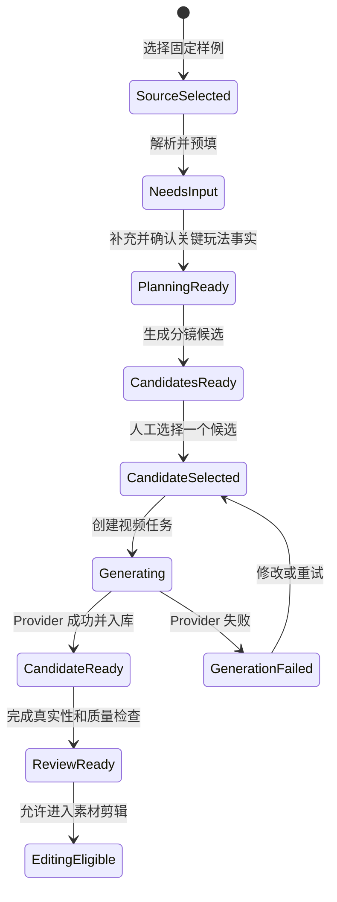

# 游戏前贴固定策略样例闭环技术方案

> 日期：2026-07-30
>
> 状态：实施评审候选
>
> Owner：Creative
>
> 范围：创意创作 / 视频创作 / 效果广告 / 游戏前贴
>
> 当前协作约束：需求与策略系统尚未提供可用的正式策略包，本期使用 Creative 明确标识的固定开发样例，后续通过新 Intake 切换到已批准策略来源

## 1. 方案结论

本期不采用“选择固定策略后直接把 Brief 发送给视频模型”的短链路。要跑通的是一条可解释、可人工确认、可恢复、未来可替换策略来源的 Creative 生产链路：

```text
选择固定游戏前贴样例
→ 系统将样例映射为游戏前贴准备态
→ 用户检查并补充玩法事实、素材与 CTA
→ Creative 创建 manual Intake 和 game_preroll Task
→ 服务端生成 3 个可解释的钩子候选
→ 用户选择一个候选
→ Creative 编译并冻结 PromptPackage / GenerationSpec
→ Provider Gateway 创建一个完整 6 秒视频任务
→ 生成结果进入 Project Assets
→ 执行玩法真实性、素材权利、声明、技术质量检查
→ 通过后进入素材剪辑；未通过只保留为候选
```

固定样例与未来正式策略包的关系：

```text
当前：Creative 本地固定样例 → manual CreativeIntake
未来：已批准 Strategy Handoff → strategy_package CreativeIntake
                                    ↓
                          GamePrerollTask 之后的
                    候选、选择、Prompt、Provider、审核不变
```

核心决策如下：

1. 固定样例只能显示为“开发固定样例”，不得伪装成已批准策略包。
2. 策略/Brief 只提供商业目标、受众、主张、约束、证据和允许路线；游戏钩子、三镜头、Prompt 和生成配置归 Creative。
3. 用户不需要重填完整 Brief，只补充或确认影响玩法真实性和生成结果的少量字段。
4. 先生成分镜候选，用户选择后才创建付费视频 ProviderJob。
5. 左侧三个镜头是一个候选中的三个时间段；默认一次生成一条完整 6 秒视频，不是自动创建三个独立视频任务。
6. 玩法事实和素材权利未确认时可以规划，但不得调用真实付费 Provider；固定 fixture 永远不能直接冻结为正式交付版本。
7. 第一阶段复用当前 Provider 已支持的纯文本/参考图能力；参考视频和参考音频作为 Seedance 多模态输入属于后续 Provider interface 扩展。

## 2. 依据与约束

本方案以以下一手材料为依据：

- [项目总纲](../00-project-overview.md)
- [创意创作系统 PRD](../02-creative-studio-prd.md)
- [Strategy → Creative 开发契约 v2](../25-strategy-to-creative-development-contract-v2.md)
- [CreativeVideoIntake v1 Schema](../../api/contracts/creative-video-intake-v1.schema.json)
- [游戏前贴固定 Fixture](../../api/fixtures/creative-video-intake-game-preroll-v1.json)
- [Creative 领域词汇](../../internal/systems/creative/CONTEXT.md)
- [Provider 视频稳定输入](../../internal/platform/provider/video.go)
- 用户提供的《Brief in, Ads out》广告场景学习资料
- [火山引擎 Seedance 2.0 多模态能力说明](https://developer.volcengine.com/articles/7606009619928449070)
- [游戏前贴来源调研记录](../research/game-preroll-source-findings-2026-07-30.md)

优先级发生冲突时：

1. Strategy → Creative 契约约束领域归属、不可变性和 readiness。
2. 本地 Go/React 源码约束当前真正可调用的能力。
3. 广告学习资料指导 Prompt 编译和创意方法，不自动代表当前 Provider interface 已支持所有 Seedance 能力。

### 2.1 从广告学习资料提取的工程规则

学习资料将广告 Prompt 定义为：

```text
主体
+ 卖点演绎
+ 消费场景与调性
+ 镜头语言
+ 音频
+ 后期约束
```

映射到游戏前贴：

| 广告 Prompt 维度 | 游戏前贴含义 |
|---|---|
| 主体 | 游戏名、真实玩法目标、核心 UI/角色或关卡对象 |
| 卖点演绎 | 失败状态、关键操作、即时反馈和可复现结果 |
| 场景与调性 | 游戏品类、紧迫/爽快/清晰等节奏与情绪 |
| 镜头语言 | 目标特写、失败反馈强调、关键操作聚焦、结果定格 |
| 音频 | 静音可理解，或生成与操作反馈同步的音效 |
| 后期约束 | 9:16 安全区、字幕/CTA 位置、无水印、不得伪造 UI/奖励 |

由此得出：Brief 不能直接成为 Provider Prompt；必须经过 Creative 的结构化映射、候选规划和 Prompt 编译。

## 3. 当前实现与目标差距

### 3.1 前端现状

当前 [SpecializedPages.tsx](../../src/components/SpecializedPages.tsx) 中：

- 效果广告已经包含短剧前贴、游戏前贴、电商前贴和爆款复刻四个入口。
- 游戏前贴与短剧前贴共用 `PreRollWorkspace`。
- 游戏模式有固定三镜头文案、字幕样式、钩子强度和生成按钮。
- 点击生成后，浏览器把固定标题、描述和三镜头拼成一个字符串。
- 游戏模式没有来源选择、玩法事实表单、素材绑定、候选生成、候选选择和动态 readiness。
- “人物与画面连续”“品牌事实已校验”等检查项来自通用/短剧形状，不是游戏前贴的主要门禁。
- “加入混剪素材箱”目前主要依赖通用视频资产成功状态，没有完整的 GamePrerollTask 血缘与审核结论。

### 3.2 前端数据层现状

当前 `api.createPrerollVideo` 最终调用 `createKanonMedia`：

- 固定提交 6 秒、9:16、720p。
- 直接创建 Platform ProviderJob。
- `source_task_id` 实际使用 Brief ID。
- `purpose=preroll` 和 `prerollType=game` 只在前端对象上补充，没有进入 Go Creative 的持久化任务。
- 刷新时通过 Project 中全部视频资产推断结果，无法可靠恢复某个游戏前贴 Task 的候选、选择和配置。
- `listPrerollArtifacts` / `listPrerollJobs` 会先读取 Project 全部视频，再由浏览器补写当前 `prerollType`；这会把其他业务视频误标成游戏前贴，必须改为按稳定 `CreativeTaskID` 和 Job 血缘查询。

### 3.3 Creative 后端现状

现有 Go Creative 已经具备可复用基础：

- `CreativeIntake`、`CreativeTask`、`VideoDraft`、生产 Job 血缘。
- MySQL `creative_video_drafts.content_payload` 可持久化模式专属 JSON。
- 短剧前贴已有 manual Intake、候选批次、人工选择、PromptPackage 和 ProviderJob 门禁。
- 电商前贴已有来源选择、准备态、Prompt 计划、首尾帧和 GenerationSpec/Approval。
- 爆款复刻已有任务恢复、分析、Prompt 确认和视频生成链路。

游戏前贴的实际缺口：

- 没有 `ManualGamePrerollInput`。
- `CreativeRouteSnapshot.Validate` 不接受稳定的 `game_preroll` Route。
- `CreateVideoTask` 不创建 `GamePrerollDraft`。
- `VideoDraft` 没有 `game_preroll` 子对象。
- 没有游戏候选规划、人工选择、Prompt 编译和 ProviderInput。
- HTTP/OpenAPI 没有游戏工作区接口。

此外，现有 `resolvedStrategyPackageRequest` 会在上游 concept 或 CTA 缺失时回退到
core message 和硬编码 CTA。游戏前贴不得复制该行为：缺失字段必须体现在
readiness/blockers 中，并由用户确认或上游补齐，不能用默认值掩盖。

### 3.4 Provider 能力边界

仓库当前稳定 `VideoGenerationInput` 支持：

- `text_only`
- `reference_image`
- `first_last_frame`
- `silent` 或 `generated_audio`
- 4–15 秒、9:16/16:9/1:1、480p/720p/1080p

当前不支持：

- `reference_video`
- `reference_audio`
- 一个请求内混合多张图片、多段视频和多段音频

火山引擎公开材料和用户学习资料表明 Seedance 2.0 产品能力可以支持图片、视频、音频等多模态参考，但本地稳定 interface 和 Ark adapter 尚未暴露这些输入。因此本期不能把“模型产品支持”误写成“当前代码已经支持”。

## 4. 本期范围

### 4.1 必须完成

1. 游戏前贴页面默认提供一个明确标识的固定开发样例。
2. 用户可以查看样例带入的目标、受众、卖点、玩法结构、CTA 和禁止项。
3. 用户至少确认玩法目标、失败原因、关键操作、结果真实性和素材权利。
4. 用户可以选择一个 Project 内游戏画面参考图；真实付费生成要求素材为 ready 且同 Project。
5. Creative 创建 `source=manual`、`performance_mode=game_preroll` 的 Intake 和 Task。
6. 服务端生成三个可解释候选，而不是由 React 硬编码三镜头。
7. 每个候选包含三段分镜、假设、证据、PromptPackage 和明确的 `score_meaning=hook_relevance`。
8. 用户必须显式选择一个候选。
9. 服务端根据不可变 input snapshot、所选候选和生成配置重新编译 Prompt。
10. 通过现有 Provider Gateway 创建一个完整 6 秒视频任务。
11. 生成结果转存为当前 Project 的稳定 AssetVersion，并保留 Task → Job → Asset 血缘。
12. 页面刷新后恢复来源、输入、候选、选择、Job 和生成视频。
13. 未通过 production gate 的结果可以作为候选预览，但不能标记为正式交付。
14. 游戏结果可进入素材剪辑的待选资产列表，但必须显示其审核/生产 readiness。

### 4.2 非目标

- 不等待需求与策略模块完成。
- 不在本期实现完整 Strategy Handoff 选择，但预留相同的归一化输入。
- 不自动预测 CTR、CVR、CPA 或 ROAS。
- 不自动选择“分数最高”的候选。
- 不同时为三个候选创建三个付费视频任务。
- 不实现完整多轨剪辑器。
- 不在本期实现视频理解、玩法自动识别或从录屏自动提取失败原因。
- 不把 AI 生成画面宣称为真实游戏实机画面。
- 不把 fixture 产物直接冻结为 production-ready CreativeVersion。
- 不把 Provider 模型 ID、API Key、Base URL 或临时输出 URL写入前端或 Creative 业务对象。

## 5. 用户链路

### 5.1 页面状态



### 5.2 页面交互

#### 第一步：选择来源

右侧新增“创意来源”：

```text
《星港守卫》挑战反馈型 · 固定开发样例
```

未来同一选择器可以加入：

```text
游戏 A 买量策略 · 策略包 v3
游戏 B 新游预约 · 已确认 Brief v2
```

固定样例必须显示：

> 当前为 Creative 开发固定样例，不代表正式策略、真实游戏或素材授权。

#### 第二步：确认游戏输入

系统自动带入：

- 投放目标
- 目标受众
- 核心主张
- 推荐 CTA
- 推荐钩子类型
- 强制项与禁止项
- 6 秒、9:16、720p

用户只需检查或补充：

| 字段 | 是否必填 | 说明 |
|---|---:|---|
| 游戏名称 | 是 | 固定样例预填 |
| 玩法目标 | 是 | 观众第一秒要看懂什么 |
| 失败原因 | 是 | 为什么会失败，不能只写“失败了” |
| 关键操作 | 是 | 玩家执行的一个具体动作 |
| 可复现结果 | 是 | 操作后在真实游戏内发生什么 |
| 游戏画面参考 | 真实生成必填 | 同 Project 的图片 AssetVersionRef；P1 扩展为视频 |
| 玩法真实性确认 | 是 | 用户确认上述玩法可以真实复现 |
| 素材权利确认 | 真实生成必填 | 可用于当前渠道和生成式使用 |
| CTA | 是 | 固定样例预填，但必须人工确认 |
| 正片衔接 | 交付时必填 | 是否接真实玩法正片或进入素材剪辑 |

#### 第三步：生成候选

按钮名称：

> 生成分镜候选

服务端默认生成三个不同钩子机制：

1. `challenge_feedback`：目标 → 失败 → 正确操作逆转。
2. `near_miss`：只差一步/倒计时 → 险些失败 → 极限成功。
3. `wrong_vs_right`：错误操作 → 失败反馈 → 正确操作对比。

候选变化以“一个主要测试变量”为原则，其他规格和事实保持一致，便于后续 A/B 测试解释。

#### 第四步：查看三镜头并选择候选

候选选择和三镜头不是同一个概念：

- 候选：三种不同的钩子方案。
- 镜头：当前候选内部的 0–2、2–4、4–6 秒结构。

选择某个候选后，左栏展示该候选的三镜头：

| 时间 | 目的 | 必须回答的问题 |
|---|---|---|
| 0–2 秒 | 目标/危机钩子 | 用户能否立即看懂挑战？ |
| 2–4 秒 | 失败和原因 | 用户能否理解为什么失败？ |
| 4–6 秒 | 关键操作、逆转、CTA | 结果是否真实、可复现且 CTA 清楚？ |

用户显式点击“选择此方案”后，才能进入视频生成。

#### 第五步：生成视频

按钮名称：

> 生成游戏前贴视频

默认只提交当前选择的一个候选，创建一个完整 6 秒 ProviderJob。三个镜头作为一个 Prompt 时间线整体生成，原因是：

- 6 秒小于 Seedance 单次生成长度上限。
- 整体生成更容易保持 UI、光影和动作连续。
- 避免三个任务的额外费用和跨片段拼接误差。
- 三镜头仍可用于逐段编辑、审核和未来的局部重生成。

只有用户明确选择“分别生成变体”时，后续版本才按候选创建多个独立 ProviderJob。

## 6. 目标领域模型

### 6.1 ManualGamePrerollInput

```go
type ManualGamePrerollInput struct {
    BriefID              string
    BriefVersion         int64
    BriefName            string
    BriefContentHash     string
    FixtureID            string
    GameName             string
    GameplayObjective    string
    FailureState         string
    KeyAction            string
    VerifiedOutcome      string
    ReviewedSellingPoints []string
    ProofPoints          []string
    CallToAction         string
    HookStrategy         GameHookStrategy
    SubtitleStyle        string
    HookStrength         int
    AudioPolicy          string
    Transition           string
    GameplayImageRef     *contract.AssetVersionRef
    GameplayTruthConfirmed bool
    AssetRightsConfirmed bool
}
```

规则：

- `FixtureID` 只记录样例来源，不把 manual Intake 伪装为 StrategyPackage。
- 用户修改任何事实后，服务端重新计算 input snapshot hash。
- `GameplayTruthConfirmed` 和 `AssetRightsConfirmed` 必须记录操作者与时间；布尔值只是摘要。
- 正式 Strategy 接入后创建新的 Intake，旧 manual Intake 保持不变。

### 6.2 GamePrerollInputSnapshot

不可变保存：

- 来源类型、样例 ID/版本/Hash 或正式 Package Ref。
- Project、渠道和 Route。
- 商业目标、受众、主张、CTA。
- 游戏名、玩法目标、失败状态、关键操作、结果。
- 卖点、证据、强制项、禁止项。
- 素材 AssetVersionRef 与确认摘要。
- 生成配置。

### 6.3 GamePrerollCandidate

```go
type GamePrerollCandidate struct {
    ID                  string
    HookMechanism       string
    PrimaryTestVariable string
    VariantHypothesis   string
    Score               int
    ScoreMeaning        string // 固定为 hook_relevance
    Evidence            []string
    Storyboard          []GameStoryboardBeat
    PromptPackage       GamePromptPackage
}
```

`Score` 只用于解释候选和排序，不能显示为转化预测。

### 6.4 GamePrerollDraft

```go
type GamePrerollDraft struct {
    ContractVersion      string
    TaskID               string
    Revision             int64
    SelectedRouteID      string
    InputSnapshot        GamePrerollInputSnapshot
    InputHash            string
    Readiness            CreativeReadiness
    ActiveCandidateBatch *GameCandidateBatch
    Candidates           []GamePrerollCandidate
    SelectedCandidateID  string
    CreatedAt            time.Time
    UpdatedAt            time.Time
}
```

嵌入现有 `VideoDraft.GamePreroll`，继续使用 `creative_video_drafts.content_payload`，本期不需要新建平行的游戏前贴表。

## 7. Readiness 与操作门禁

### 7.1 Planning gate

以下任一项缺失时 `planning_ready=false`：

- 游戏名称
- 投放目标
- 受众
- 核心主张
- 玩法目标
- 失败状态
- 关键操作
- 可复现结果
- CTA
- 显式选择 `game_preroll` Route

`planning_ready=false` 时可以继续编辑，但不能生成候选。

### 7.2 Generation gate

真实 ProviderJob 还要求：

- 已选择候选。
- 玩法真实性已人工确认。
- 游戏参考图 AssetVersionRef 为 ready、同 Project。
- 素材权利允许当前渠道与生成式使用。
- PromptPackage 的 input hash 与当前 snapshot 一致。
- Provider 的 `cookies.video.standard` 已配置且支持所选输入模式。
- 所有使用的奖励、数值、结果和 CTA 有证据或明确人工确认。

固定样例可以通过 deterministic fake adapter 跑通 CI 和状态机；没有真实素材与权利确认时不得创建付费 ProviderJob。

### 7.3 Production gate

在 generation gate 基础上还要求：

- Provider 输出已转存为稳定 AssetVersion。
- 玩法真实性检查通过。
- UI、奖励和声明检查通过。
- 视频技术质量检查通过。
- CTA 与交付规格完整。
- 如需拼接，已绑定真实主视频。
- 人工审核通过。

固定 fixture 来源默认 `production_ready=false`。需要正式交付时必须创建新的 manual/strategy Intake，绑定真实资料并重新生成或重新审核。

## 8. PromptPackage 编译

服务端编译器输入：

```text
不可变 GamePrerollInputSnapshot
+ 所选 GamePrerollCandidate
+ 当前 GameGenerationConfig
+ 稳定 AssetVersionRef
```

输出至少包含：

```json
{
  "contract_version": "creative-game-preroll-prompt-package/v1",
  "input_snapshot_hash": "sha256:...",
  "candidate_id": "game_candidate_1",
  "asset_refs": [],
  "director_spec": {},
  "timeline": [],
  "negative_constraints": [],
  "compiled_prompt": "...",
  "content_hash": "sha256:..."
}
```

编译顺序：

1. 商业意图：目标、受众、核心主张。
2. 主体：游戏、玩法目标和真实素材引用说明。
3. 卖点演绎：失败原因、关键操作、可复现结果。
4. 时间线：0–2、2–4、4–6 秒。
5. 镜头语言：目标特写、反馈聚焦、逆转定格。
6. 音频：静音可理解或操作反馈音效。
7. CTA：出现时机、位置、文字和安全区。
8. 后期约束：字幕、安全区、无水印、稳定衔接点。
9. 反向约束：不得伪造玩法、奖励、数值、UI 或未授权 IP。

浏览器可以展示编译后的 Prompt，但真实生成时不得信任浏览器回传的任意 Prompt 字符串。Creative 必须根据已保存 snapshot 与候选重新编译或校验 Hash。

## 9. Deep module 与 seam

### 9.1 GamePreroll module

把以下复杂度集中在 Creative 的 `GamePreroll` module 中：

- 输入校验和规范化。
- 三个候选的确定性规划。
- 候选批次和 revision。
- PromptPackage 编译与 Hash。
- 三级 readiness。
- ProviderInput 构造。
- 工作区恢复读模型。

HTTP handler、React 和 Provider adapter 不实现这些规则。

### 9.2 外部 seam

继续复用现有 seam：

- `StrategyPackageReader`：未来读取正式策略。
- `AssetReader`：读取同 Project 稳定素材。
- `Repository` / `ViralRemakeRepository`：持久化 Intake、Task 和 VideoDraft revision。
- `ProviderJobs`：创建统一视频 Job。

第一阶段候选规划是纯计算 implementation，不为“未来也许会用模型规划”提前新增一个只有单 adapter 的 port。未来确实同时存在 deterministic planner 和 model planner 时，再在 GamePreroll module 内增加 planner seam。

## 10. HTTP interface

### 10.1 复用接口

```http
POST /api/creative/v1/projects/{project_id}/creative-intakes
POST /api/creative/v1/projects/{project_id}/creative-intakes/{intake_id}:create-video-task
POST /api/creative/v1/projects/{project_id}/creative-tasks/{task_id}:video-job
GET  /platform/v1/projects/{project_id}/model/jobs/{job_id}
```

### 10.2 新增接口

```http
GET  /api/creative/v1/projects/{project_id}/creative-tasks/{task_id}/game-preroll
POST /api/creative/v1/projects/{project_id}/creative-tasks/{task_id}/game-preroll:select-candidate
POST /api/creative/v1/projects/{project_id}/creative-tasks/{task_id}/game-preroll:regenerate-candidates
```

第一阶段固定样例保存在前端只读数据文件中，像现有短剧本地 Brief 一样创建 `source=manual` Intake。未来 Strategy 接入时再增加：

```http
GET  /api/creative/v1/projects/{project_id}/game-preroll/sources
POST /api/creative/v1/projects/{project_id}/game-preroll:prepare
```

`prepare` 只读取、授权并映射不可变来源，不创建 ProviderJob。

### 10.3 错误语义

至少覆盖：

| HTTP | Code | 含义 |
|---:|---|---|
| 400 | `invalid_game_preroll_input` | 玩法输入不合法 |
| 403 | `project_forbidden` | 跨 Project 或无权限 |
| 404 | `game_preroll_task_not_found` | Task 不存在或类型不匹配 |
| 409 | `intake_not_ready` | 不能创建正式 Task |
| 409 | `revision_conflict` | 选择/重生成基于旧 revision |
| 409 | `candidate_selection_required` | 未选择候选 |
| 409 | `gameplay_truth_confirmation_required` | 未确认玩法真实性 |
| 409 | `asset_rights_unverified` | 素材授权不满足真实生成 |
| 409 | `prompt_package_stale` | 输入或配置变化后旧 Prompt 失效 |
| 409 | `provider_capability_unavailable` | 当前路由不支持输入模式 |

## 11. Provider 分阶段方案

### Phase 1：当前代码可完成

- 一个参考图或纯文本模式。
- 6 秒、9:16、720p。
- 静音或生成音频。
- 一个选择候选对应一个 ProviderJob。
- 输出转存为 AssetVersion。
- deterministic fake adapter 完成 CI 闭环。

推荐真实 smoke 使用 Project 内已授权游戏截图作为 `reference_image`，减少 UI 与主体漂移。没有参考素材时只允许开发演示，不作为玩法真实性证明。

### Phase 2：Seedance 2.0 多模态

扩展 Provider 稳定 interface：

```text
VideoInputMultimodalReference
VideoConditioningReferenceVideo
VideoConditioningReferenceAudio
```

同时修改：

- `VideoGenerationInput.Validate`
- `VideoSource` 的 MIME 校验
- Assets 执行期素材解析
- Ark adapter 内容编码
- Provider Route 的允许输入模式
- OpenAPI 和测试 adapter

届时真实玩法录屏可以同时承担：

- 玩法事实证据。
- 动作、UI 和节奏参考。
- 后续拼接正片。

该扩展不能只修改 Ark adapter；必须先扩展稳定 Provider interface 和 Assets 读取规则。

## 12. 前端改造

### 12.1 拆分 Workspace

把当前条件分支拆为：

- `ShortDramaPrerollWorkspace`
- `GamePrerollWorkspace`

共享的轮询、Asset 预览和状态显示可以提取为无业务语义 hook，但游戏输入、候选和检查项不能继续与短剧共用。

### 12.2 固定样例数据

新增：

```text
src/data/gamePrerollBriefs.ts
```

内容从现有 `creative-video-intake-game-preroll-v1.json` 映射，至少包含 ID、版本、内容 Hash、目标、受众、游戏名、玩法事实、CTA、强制项、禁止项和样例免责声明。

不要直接把整份契约 JSON 当作可编辑 React state；通过小型映射函数转为页面需要的 ViewModel。

### 12.3 右侧面板

建议结构：

```text
创意来源
玩法信息与真实性确认
生成配置
动态 readiness 检查
生成分镜候选
选择候选后：生成游戏前贴视频
```

游戏专属检查项：

- 玩法目标可读。
- 失败原因可理解。
- 关键操作与结果可复现。
- 游戏素材和 IP 权利已确认。
- 奖励/数值/声明有证据。
- 静音可理解。
- CTA 清晰。

移除或降级：

- “人物与画面连续”不是游戏前贴的核心门禁。
- “品牌事实已校验”应拆为游戏事实、素材权利和声明证据。

### 12.4 左栏和中央预览

- 候选未生成：显示待规划状态，不展示伪造的固定三镜头。
- 候选已生成：展示候选选择器。
- 选中候选：左栏展示该候选的三个镜头。
- 视频未生成：中央展示结构化分镜预览。
- 视频已生成：中央播放稳定 Asset URL。
- 输入变化：旧候选和旧 Prompt 标记 stale，必须重新生成候选或重新确认。

## 13. 文件级实施计划

### Task 1：游戏前贴纯领域模型和规划器

新增：

- `internal/systems/creative/game_preroll.go`
- `internal/systems/creative/game_preroll_test.go`

修改：

- `internal/systems/creative/model.go`
- `internal/systems/creative/service.go`
- `internal/systems/creative/repository.go`

完成输入校验、三个候选、三段 timeline、PromptPackage、Hash、readiness 和选择 revision。

### Task 2：持久化与恢复

修改：

- `internal/systems/creative/mysql_repository.go`
- 对应 memory repository / test adapters

复用 `creative_video_drafts.content_payload` 保存 `VideoDraft.GamePreroll`。验证刷新后读回相同 input hash、候选批次、选择和生产 Job。

### Task 3：HTTP 与 OpenAPI

修改：

- `internal/platform/httpserver/server.go`
- `internal/platform/httpserver/creative_handlers.go`
- `api/openapi/creative-v1.yaml`
- `internal/platform/httpserver/server_test.go`

增加工作区读取、候选选择、候选重生成和 Provider 门禁。

### Task 4：ProviderInput

修改：

- `internal/systems/creative/service.go`
- `internal/platform/httpserver/creative_handlers.go`
- `internal/systems/creative/video_generation_request.go` 或新增游戏专属构造器

服务端根据所选候选生成 `provider.VideoGenerationInput`；前端不传可信 raw Prompt。

### Task 5：前端数据层

新增：

- `src/data/gamePrerollBriefs.ts`

修改：

- `src/data/api.ts`
- `src/backend/kanon-api.ts`（仅在需要新增稳定客户端映射时）

新增 GamePreroll DTO、创建 manual workspace、选择候选、重生成和创建视频 Job 方法。
删除游戏工作区对 Project 全部视频的类型推断；列表和恢复必须使用服务端返回的
`CreativeTaskID → ProviderJobID → AssetVersionRef` 血缘。

### Task 6：前端工作区

修改：

- `src/components/SpecializedPages.tsx`
- `src/styles.css`

拆出 `GamePrerollWorkspace`，实现来源、输入确认、候选、三镜头、生成、轮询、恢复和素材箱入口。

### Task 7：浏览器闭环与回归

修改：

- `e2e/platform-go-demo.spec.ts`
- 必要时调整旧 `e2e/investor-mvp.spec.ts`

新增 Go 后端真实页面链路；旧 Node server 的 `purpose/prerollType` 隔离测试不能代替新的 CreativeTask 闭环。

## 14. 测试策略

### 14.1 领域测试

- 固定输入生成三个稳定且不同的候选。
- 每个候选恰好包含三个连续的时间段并覆盖 0–6 秒。
- 候选不引入 input snapshot 中不存在的玩法、奖励和数值。
- `score_meaning` 固定为 `hook_relevance`。
- 修改输入后 input hash、candidate batch 和 Prompt hash 改变。
- 旧 revision 不能选择候选。
- 未选择候选不能构建 ProviderInput。
- 未确认玩法真实性/素材权利不能调用真实 Provider。

### 14.2 HTTP 测试

- Project 与 Organization 隔离。
- 任务类型不匹配返回 404。
- 幂等创建 Intake/Task。
- 选择候选的 revision conflict。
- Provider capability 缺失时返回结构化错误。
- ProviderJob 成功后注册到正确 CreativeTask。

### 14.3 Provider 测试

- fake adapter 返回可播放 MP4，并被 Assets 接入。
- reference image 必须来自同 Project。
- 不支持的 model/input mode 在提交前失败。
- Provider 临时 URL 不进入 Creative Draft。

### 14.4 浏览器验收

1. 打开效果广告 → 游戏前贴。
2. 默认看到固定开发样例与免责声明。
3. 检查/补充玩法事实。
4. 未确认时“生成分镜候选”禁用或返回明确缺项。
5. 生成三个候选。
6. 切换候选时左侧三镜头和中央预览同步更新。
7. 未选择候选时“生成游戏前贴视频”禁用。
8. 选择候选并创建 Job。
9. 成功后播放视频；刷新仍恢复。
10. Provider 失败后不伪造资产，可重试。
11. 输入变化使旧候选失效。
12. production gate 未通过时不能标记正式交付。

## 15. 验收标准

本期完成必须同时满足：

- 页面不存在“策略一选中就直接创建视频 Job”的行为。
- 固定样例来源和真实策略来源在语义上可区分。
- GamePrerollTask、input snapshot、候选、选择和 ProviderJob 均由服务端持久化。
- 一个候选的三镜头通过一个 6 秒 Job 整体生成。
- Prompt 由服务端编译并带版本与 Hash。
- 未选择候选、未确认玩法真实性或未满足素材权利时，真实 Provider 被阻断。
- 生成视频进入稳定 Project Asset，而不是仅显示 Provider 临时 URL。
- 页面刷新后可以恢复整个工作区。
- 领域、HTTP、Provider 和浏览器测试全部通过。
- `git diff --check`、`go test ./...`、`npm run build` 通过。
- 推送后所有必需 GitHub Actions checks 通过。

## 16. 推荐实施顺序

```text
P0.1 领域模型 + deterministic planner + tests
→ P0.2 manual Intake / Task / workspace persistence
→ P0.3 candidate select + server Prompt compiler
→ P0.4 fake Provider end-to-end
→ P0.5 React 工作区与刷新恢复
→ P0.6 reference-image 真实 smoke
→ P0.7 素材剪辑入口与 production gate
→ P1   Strategy source selector / prepare
→ P2   Seedance 2.0 reference-video/reference-audio Provider 扩展
```

这样可以最早得到一条可信的演示闭环，同时不会把固定样例、React 硬编码或 Provider 请求变成未来接策略时必须推翻的架构。
