# Strategy 任务策略增强层与 CreativeDirection 技术实现方案

| 属性 | 内容 |
| --- | --- |
| 日期 | 2026-07-31 |
| 状态 | 待产品、Strategy、Creative、架构联合评审 |
| Owner | Strategy / Creative 联合 |
| 需求依据 | `docs/research/strategy-requirement-clarification-2026-07-31.md` |
| 技术调研 | `docs/research/strategy-creative-direction-technical-research-2026-07-31.md` |
| 配套评审 | `docs/reviews/2026-07-31-strategy-task-overlay-creative-direction-adversarial-review.md` |
| 替代结论 | 替代“Creative 只消费任务策略、通用策略只留 lineage”的旧方案 |

## 1. 执行结论

目标链路固定为：

```text
已确认 BriefVersion
→ 已批准 StrategyPackageVersion
→ strategy-creative-handoff/v1
→ 可选 CreativeTaskStrategyVersion v2
→ 可选 strategy-creative-task-overlay/v1
→ CreativeIntake v2（只用通用策略）
  或 CreativeIntake v3（通用策略 + 任务增强层）
→ CreativePlanningContext v1
→ CreativeDirection 候选批次
→ 人工确认 CreativeDirectionVersion
→ ScriptVersion / StoryboardVersion / PromptPackage
```

核心技术决策：

1. `StrategyPackage` 继续是 Strategy 来源 CreativeIntake 的唯一根。
2. 任务级策略必须引用已批准 Package、正式 Handoff 和用户选中的稳定 Route。
3. 任务级策略是可选增强层，不再使用独立的新 Intake 根。
4. Strategy 到 Creative 的读取、校验、投影和快照完全由代码完成，不调用 LLM。
5. LLM 从 CreativeDirection 开始工作，输出结构化多候选。
6. 不修改现有冻结 Schema；新增版本，旧版本只读兼容。
7. 不静默迁移或伪造历史血缘。
8. 不引入新的 Agent 框架；复用现有 Provider、AgentTask、Hash、幂等和 Outbox。

## 2. 正式开工门禁

`docs/README.md` 规定功能范围变化时先更新 PRD，再更新研发任务。本方案改变了现有任务策略来源和 CreativeIntake 语义，因此代码实施前必须完成：

- 在 `01-demand-strategy-prd.md` 明确任务级策略是已批准通用策略的可选增强层。
- 在 `25-strategy-to-creative-development-contract-v2.md` 明确 base-only 和 base + overlay 两种用法。
- 明确现有 `creative-intake-create/v2`、`creative-intake/v2` 保持不变，增强模式发布 v3。
- Strategy、Creative Owner 共同确认字段所有权和兼容截止时间。
- 契约变更先合并 Schema、Fixture 和 contract tests。

门禁未完成时，可以做只读验证和测试准备，不能修改线上创建语义。

## 3. 当前代码基线与必须修正的问题

### 3.1 可以直接复用

- `strategy_package_versions` 和不可变 Package Hash。
- 已物化的 `strategy_creative_handoffs`。
- `strategy-creative-handoff/v1` Schema、Golden Fixture、ETag 和完整性校验。
- Creative 的 `StrategyPackageReader` / `TaskStrategyReader` composition seam。
- RFC 8785 `CanonicalJSONHash` 和 `NewContentHash`。
- Strategy 的 CreativeBusinessProfile、推荐、问题、Skill 和任务策略生成。
- Provider 的 `TextGenerateRequest.OutputJSONSchema`。
- AgentTask、JobRuntime、SkillRun、幂等收据和 Outbox。
- `ModelShortDramaPrerollPlanner` 的结构化生成和 grounding 校验模式。

### 3.2 当前 P0 缺陷

#### 缺陷 A：Creative 没有真正读取正式 Handoff

`internal/integrations/strategycreative/reader.go` 当前通过 `GetPackage` 再做一套自定义映射，没有直接读取已物化的 `CreativeHandoff`。

后果：

- 同一 Package 存在两套 Creative 投影逻辑。
- Package 发布时冻结的 Handoff 与实际 Intake 内容可能不同。
- 后续修映射会让同一 Package 读出不同内容。

修正：`ReadForCreative` 改为读取并验证 `GetCreativeHandoff`，Creative 不再解析完整 Package。

#### 缺陷 B：仍在补默认创作答案

当前映射会：

- 使用第一条 CreativeRecommendation 作为 concept。
- 默认 CTA 为“了解更多并收藏这份内容”。
- 默认 tone 为“清晰、可信”。
- 默认 visual keywords 为“品牌主视觉、真实使用场景”。
- 任务策略为空时使用 core message 作为 concept。

修正：全部删除。缺失信息进入 warning、blocker 或 open question。

#### 缺陷 C：正式 Route ID 在适配时丢失

当前 Package Reader 映射 Route 时没有设置 `RouteID`。

修正：直接使用正式 Handoff 中的完整 Route，并要求 ready Intake 显式选择 `selected_route_id`。

#### 缺陷 D：任务策略不是 Package-bound

当前 `CreativeTaskPlan` 只强制绑定 Brief，可选引用 DraftRevision；它不能证明任务策略来自已批准 Package。

修正：新建的 v2 Plan 必须保存：

- Package ID、版本、Hash。
- Handoff Contract Version、Hash。
- Selected Route ID。
- Brief ID、版本、Hash。

#### 缺陷 E：Intake 去重模型不支持多 Route / overlay

当前唯一索引按 Package 三元组去重，同一 Package 即使选择不同 Route 或不同任务策略也只能创建一份 Intake。

修正：新增 `input_identity_hash`，根据 Package、Handoff、Route 和可选 overlay 引用计算；以该 Hash 去重。

#### 缺陷 F：CreateIntakeRequest 同时承担外部命令和内部快照

当前服务端解析后把大量映射字段重新塞回 request 并持久化，命令、投影和快照混在一个对象中。

修正：拆分：

```text
CreateCreativeIntakeCommand
CreativeIntakeInputSnapshot
CreativeIntake
```

外部只提交引用和选择；服务端保存完整、不可变输入快照。

## 4. 目标架构

```mermaid
flowchart LR
    P["StrategyPackageVersion<br/>approved + immutable"] --> H["CreativeHandoff v1<br/>materialized"]
    H --> B["CreativeIntake v2<br/>base-only"]
    H --> TP["CreativeTaskPlan v2<br/>package + route bound"]
    TP --> TS["CreativeTaskStrategyVersion v2"]
    TS --> O["TaskOverlay v1<br/>materialized"]
    H --> E["CreativeIntake v3 assembler"]
    O --> E
    E --> I["CreativeIntake v3<br/>immutable input_snapshot"]
    B --> C["CreativePlanningContext v1"]
    I --> C
    C --> J["Creative AgentTask"]
    J --> L["LLM structured output"]
    L --> V["Schema + semantic validators"]
    V --> D["DirectionCandidateBatch"]
    D --> U["Human selection / edit"]
    U --> DV["CreativeDirectionVersion"]
```



系统边界：

- Strategy 拥有 Package、Handoff、TaskPlan、TaskStrategy、TaskOverlay。
- Creative 拥有 Intake、PlanningContext、DirectionBatch、DirectionVersion 及其下游。
- integration adapter 只调用双方公开 service interface，不直读对方数据库。

## 5. 契约版本方案

### 5.1 保持不变

- `strategy-creative-handoff/v1`
- `creative-intake-create/v2`
- `creative-intake/v2`
- `creative-video-intake/v1`
- `creative-task-strategy/v1`，仅供历史读取和导出
- `strategy-creative-task-plan-v1`，仅供历史读取

### 5.2 新增

| Schema | Owner | 用途 |
| --- | --- | --- |
| `strategy-creative-task-plan-v2.schema.json` | Strategy | Package/Route-bound Plan |
| `strategy-creative-task-strategy-v2.schema.json` | Strategy | 带 Package、Handoff、Route 血缘的任务策略 |
| `strategy-creative-task-overlay-v1.schema.json` | Strategy | 面向 Creative 的不可变任务增强投影 |
| `creative-intake-create-v3.schema.json` | Creative | Package + Route + optional overlay 创建命令 |
| `creative-intake-v3.schema.json` | Creative | 保存 base handoff 和 optional overlay 的快照 |
| `creative-planning-context-v1.schema.json` | Creative | Creative 内部统一规划输入 |
| `creative-direction-candidate-batch-v1.schema.json` | Creative | LLM 候选批次 |
| `creative-direction-v1.schema.json` | Creative | 人工确认后的方向版本 |

### 5.3 `creative-intake-create/v3`

```json
{
  "contract_version": "creative-intake-create/v3",
  "source": "strategy_package",
  "strategy_package_ref": {
    "package_id": "package_xxx",
    "package_version": 3,
    "package_content_hash": "sha256:...",
    "handoff_contract_version": "strategy-creative-handoff/v1",
    "handoff_content_hash": "sha256:..."
  },
  "selected_route_id": "route_commerce_preroll",
  "task_overlay_ref": {
    "plan_id": "creativeplan_xxx",
    "strategy_version": 2,
    "overlay_contract_version": "strategy-creative-task-overlay/v1",
    "overlay_content_hash": "sha256:..."
  }
}
```

`task_overlay_ref` 可省略。省略时等价于 base-only，但新客户端仍可统一使用 v3。

为保持冻结契约清晰：

- v2 不增加 task overlay 字段。
- v2 继续用于已冻结的 base-only 调用。
- v3 不接受 `source=task_strategy`。

### 5.4 `strategy-creative-task-overlay/v1`

建议字段：

```text
contract_version
organization_id
project_id
package_ref
handoff_ref
selected_route_ref
task_strategy_ref
business_ref
task_objective
audience_slice
message_priority
allowed_claim_refs
asset_roles
experiment
constraints
open_questions
lineage
overlay_content_hash
published_at
```

禁止：

- concept
- hook
- script / dialogue
- storyboard / shot / camera
- visual solution
- prompt / model parameters
- timeline

Overlay 必须在 TaskStrategyVersion 成功创建时同步物化，不能在每次读取时使用新代码重新投影同一个版本。

## 6. Strategy 领域改造

### 6.1 CreativeTaskPlan v2

新增领域引用：

```go
type TaskPlanPackageRef struct {
    PackageID          string
    PackageVersion     int64
    PackageContentHash contract.ContentHash
    HandoffVersion     string
    HandoffContentHash contract.ContentHash
}

type TaskPlanRouteRef struct {
    RouteID         string
    DeliverableType string
    Purpose         string
    PerformanceMode string
    Channels        []string
}
```

`CreativeTaskPlan` 新字段：

```text
contract_version
lineage_mode = package_bound | legacy_unbound
source_package_ref
selected_route_ref
```

创建流程：

1. 读取 PackageVersion。
2. 验证 `status=published`、Project、Package Hash。
3. 读取正式 Handoff 并验证 Handoff Hash。
4. 在 Handoff routes 中查找 `selected_route_id`。
5. 校验 business code 与 Route 的 deliverable / performance mode 映射。
6. 读取对应 BusinessProfile 和 Skill 快照。
7. 创建 package-bound Plan 和 Revision。

新 Plan 不再接受 `SourceStrategyRequest`。历史字段保留只读。

### 6.2 TaskStrategyVersion v2

v2 lineage 必须包含：

```text
brief_ref
package_ref
handoff_ref
selected_route_ref
business_ref
plan_ref
skill_ref
prompt_ref
project_context_version
```

生成上下文只读取冻结资源。任何 Hash 不匹配都失败，不能降级读取当前最新版。

Strategy 生成内容继续只包括：

- 任务目标和受众切片。
- 信息排序。
- 证据选择。
- 素材角色与权利。
- 实验变量。
- 约束和开放问题。

服务端递归拒绝保留创作字段。

### 6.3 TaskOverlay 物化

新增：

```go
func BuildCreativeTaskOverlay(
    strategy CreativeTaskStrategyVersion,
    plan CreativeTaskPlan,
    handoff CreativeHandoff,
) (CreativeTaskOverlay, error)
```

在同一数据库事务中：

```text
INSERT task_strategy_version
→ Build + validate overlay
→ INSERT task_overlay
→ 更新 Plan current_strategy_version
→ 保存 SkillRun / Outbox
→ COMMIT
```

若 Overlay 构建失败，TaskStrategyVersion 不能单独提交为“可交接”。

### 6.4 Strategy API

现有创建路径保持：

```http
POST /api/strategy/v1/projects/{project_id}/creative-task-plans
```

新请求以 `contract_version` 区分：

```json
{
  "contract_version": "strategy-creative-task-plan-create/v2",
  "strategy_package_ref": {
    "package_id": "package_xxx",
    "package_version": 3,
    "expected_content_hash": "sha256:..."
  },
  "expected_handoff_hash": "sha256:...",
  "selected_route_id": "route_commerce_preroll",
  "business_code": "commerce_preroll",
  "selection_source": "recommended",
  "catalog_hash": "sha256:..."
}
```

新增 Creative-facing 读取：

```http
GET /api/strategy/v1/projects/{project_id}/creative-task-plans/{plan_id}/strategy-versions/{version}/creative-overlay
```

响应带 ETag：

```http
ETag: "sha256:<overlay-content-hash>"
```

## 7. Integration Adapter 改造

### 7.1 接口

替换宽泛 PackageSnapshot：

```go
type CreativeHandoffReader interface {
    ReadCreativeHandoff(
        context.Context,
        contract.ActorContext,
        contract.ProjectID,
        StrategyPackageReference,
    ) (CreativeHandoffSnapshot, error)
}

type TaskOverlayReader interface {
    ReadTaskOverlay(
        context.Context,
        contract.ActorContext,
        contract.ProjectID,
        TaskOverlayReference,
    ) (TaskOverlaySnapshot, error)
}
```

### 7.2 强制校验

- Organization、Project 一致。
- Package ID、版本、Hash 一致。
- Handoff Contract 和 Hash 一致。
- Overlay 的 Package/Handoff 引用与 base 完全一致。
- Overlay 的 Route ID 与请求选择一致。
- Overlay business 与 Route 类型一致。
- TaskStrategy、Overlay 的版本和 Hash 一致。
- 所有资源都是不可变已发布版本。

任一失败都返回明确错误，不允许“Overlay 失败就悄悄只用通用策略”。

### 7.3 删除的旧逻辑

- `taskStrategyConcept`
- `resolvedStrategyPackageRequest` 中的默认 CTA / concept
- 默认 tone / visual keywords
- 从完整 StrategyPackage 重新构造 Handoff
- 从任务策略自行合成 Route

## 8. CreativeIntake 改造

### 8.1 外部命令与内部快照分离

```go
type CreateStrategyIntakeCommand struct {
    ContractVersion    string
    StrategyPackageRef StrategyPackageReference
    SelectedRouteID    string
    TaskOverlayRef     *TaskOverlayReference
}

type CreativeIntakeInputSnapshot struct {
    ContractVersion string
    BaseHandoff     CreativeHandoffSnapshot
    TaskOverlay     *TaskOverlaySnapshot
    SelectedRoute   CreativeRouteSnapshot
    Readiness       CreativeReadiness
    Lineage         CreativePlanningLineage
    ContentHash     contract.ContentHash
}
```

`CreateIntakeRequest` 继续服务手工旧入口；Strategy 来源改由独立 command decoder 进入 assembler，避免调用者提交映射字段。

### 8.2 Assembler

```go
type StrategyIntakeAssembler struct {
    Handoffs CreativeHandoffReader
    Overlays TaskOverlayReader
}
```

步骤：

1. 读取 Handoff。
2. 校验 Package 和 Handoff Hash。
3. 查找 selected Route。
4. 可选读取 Overlay。
5. 校验 Overlay 的 Package、Handoff、Route 血缘。
6. 组合命名空间隔离的 InputSnapshot。
7. 计算 readiness、snapshot hash 和 input identity hash。
8. 持久化 CreativeIntake。

不做扁平字段覆盖。

### 8.3 readiness

`planning_ready=true` 至少要求：

- Handoff 本身达到 planning 条件。
- Route 已显式选择且不 blocked。
- base 目标、受众、核心主张可用。
- 如果传 Overlay，Overlay 完整且 lineage 匹配。
- 方向生成所需的必填开放问题已处理。

素材、授权或生成参数不足可以不阻止 planning，但进入 generation / production blocker。

## 9. CreativePlanningContext

PlanningContext 由 IntakeSnapshot 确定性构造：

```text
base
  objective
  audience
  communication
  claims
  constraints
  source refs

task_overlay（可选）
  task objective
  audience slice
  message priority
  allowed claim refs
  experiment
  task constraints
  open questions

selected_route
assets_and_rights
readiness
lineage
```

规则：

- 不允许 overlay 覆盖 base 字段。
- PlanningContext 只包含模型所需白名单字段。
- 内容使用 RFC 8785 计算 Hash。
- DirectionBatch 保存完整 context snapshot 或可恢复的不可变引用集合。
- 上游服务暂时不可用时，已有 Intake 仍可从本地快照生成方向。

## 10. CreativeDirection 最小闭环

### 10.1 首批范围

先支持：

- 小红书图文。
- 电商前贴。

短剧前贴和爆款复刻已有专属候选规划器，首期不强行改造；待通用 Direction 模型验证后再统一。

### 10.2 Planner

```go
type CreativeDirectionPlanner interface {
    Plan(
        context.Context,
        contract.ActorContext,
        contract.ProjectContext,
        CreativePlanningContext,
        DirectionGenerationRequest,
    ) (CreativeDirectionCandidateBatch, error)
}
```

模型实现：

- 使用 `cookies.text.standard` 或专用逻辑别名。
- 固定返回 3 个候选。
- 使用 `OutputJSONSchema`。
- 保存 Provider Code、Model Version、Prompt Version。
- 不直接生成最终脚本、分镜和模型 Prompt。

线上不使用静默 deterministic fallback。模型不可用时批次进入 failed，用户可以重试或手工创建方向。

### 10.3 语义校验

按顺序执行：

1. JSON decode。
2. JSON Schema。
3. 必填字段和长度。
4. evidence ref 存在性。
5. 禁用声明、上游事实和权利校验。
6. Route / channel / deliverable 一致性。
7. 候选差异度和重复 Hook。
8. 保留字段、Prompt 和越界内容扫描。

校验失败不保存为可选候选；保留 validation report 供排障。

### 10.4 人工确认

用户可以：

- 选择一个候选。
- 对候选做有限编辑。
- 填写选择理由。
- 明确接受候选假设。

确认后创建不可变 `CreativeDirectionVersion`。脚本和分镜只能引用已确认版本。

## 11. 数据库迁移

### 11.1 Strategy migration

建议：

```text
migrations/strategy/20260731100000_strategy_task_overlay_v2.up.sql
```

对 `strategy_creative_task_plans` 增加可空列：

```text
contract_version
lineage_mode
source_package_id
source_package_version
source_package_content_hash
handoff_contract_version
handoff_content_hash
selected_route_id
selected_route_snapshot
```

约束：

- 现有行标记 `legacy_unbound`。
- 新 v2 行必须 `package_bound` 且上述字段完整。
- 添加 PackageVersion 复合外键。
- 历史 source strategy 字段保留，不删除。

新增：

```sql
strategy_creative_task_overlays (
  organization_id,
  project_id,
  plan_id,
  strategy_version,
  contract_version,
  snapshot,
  content_hash,
  published_at,
  PRIMARY KEY (...),
  UNIQUE (... content_hash)
)
```

### 11.2 Creative Intake migration

建议：

```text
migrations/creative/20260731101000_creative_strategy_intake_v3.up.sql
```

增加：

```text
contract_version
selected_route_id
handoff_contract_version
handoff_content_hash
task_overlay_contract_version
task_overlay_content_hash
input_snapshot
input_snapshot_hash
input_identity_hash
readiness_payload
```

索引调整：

- 删除 `uq_creative_intakes_strategy_package`。
- 删除 `uq_creative_intakes_task_strategy` 的新写依赖，但历史列保留。
- 新增 `(organization_id, project_id, input_identity_hash)` 唯一索引。
- `input_identity_hash` 对 legacy 行保持 NULL，不伪造。

身份 Hash 输入：

```json
{
  "source": "strategy_package",
  "package_ref": {},
  "handoff_content_hash": "sha256:...",
  "selected_route_id": "...",
  "task_overlay_ref": null
}
```

### 11.3 Direction migration

建议：

```text
migrations/creative/20260731102000_creative_direction_planning.up.sql
```

新增：

```text
creative_direction_batches
creative_directions
creative_direction_versions
```

`creative_direction_batches` 保存：

- Intake、context Hash、revision。
- 状态、AgentTask ID。
- Prompt / Provider / Model lineage。
- candidates JSON。
- validation report。
- 错误码和错误信息。
- 幂等键和请求 Hash。

`creative_directions` 保存方向系列和 current version。

`creative_direction_versions` 保存不可变确认快照、来源 batch/candidate、base version、内容 Hash 和人工记录。

现有 `creative_tasks.direction_payload` 暂时保留：

- 新任务创建时写入已确认 DirectionVersion 的兼容投影。
- 增加 `direction_id`、`direction_version`、`direction_content_hash` 引用。
- 旧任务继续只读原 payload。

## 12. API

### 12.1 CreativeIntake

```http
POST /api/creative/v1/projects/{project_id}/creative-intakes
```

支持：

- 现有 manual request。
- `creative-intake-create/v2`。
- `creative-intake-create/v3`。

不再为新请求接受独立 `source=task_strategy`。

### 12.2 DirectionBatch

```http
POST /api/creative/v1/projects/{project_id}/creative-intakes/{intake_id}/direction-batches
Idempotency-Key: ...
```

请求：

```json
{
  "expected_intake_version": 1,
  "expected_input_snapshot_hash": "sha256:...",
  "candidate_count": 3,
  "variation_intent": "balanced"
}
```

响应 `202 Accepted`，返回 batch 和 AgentTask。

### 12.3 查询与确认

```http
GET  /api/creative/v1/projects/{project_id}/direction-batches/{batch_id}
POST /api/creative/v1/projects/{project_id}/direction-batches/{batch_id}:confirm
GET  /api/creative/v1/projects/{project_id}/creative-directions/{direction_id}
```

确认请求包含 expected batch version、candidate ID、人工 patch、选择理由。

## 13. 异步任务与事件

AgentTask：

```text
source_system = creative
source_type   = creative_direction_batch
kind          = creative.direction.plan
```

事件：

```text
creative.direction_batch.requested.v1
creative.direction_batch.completed.v1
creative.direction_batch.failed.v1
creative.direction.confirmed.v1
creative.direction.superseded.v1
```

事务要求：

- Batch 和 AgentTask 同事务创建，或使用可靠 Outbox。
- Worker 完成时以 expected batch version 更新。
- 最终失败回调必须将 generating 改为 failed。
- 重试同一 revision 使用同一 context Hash。
- 新 variation intent 创建新 revision。

## 14. 前端改造

### 14.1 Strategy

`CreativeTaskPlanner`：

- 入口必须来自已批准 Package。
- 显示 Package 版本、Hash 和 selected Route。
- 任务专属问题只表达该 Route 的增量信息。
- 页面明确标注“任务策略不会生成概念、脚本和分镜”。
- handoff 按钮提交 Package + Route + optional overlay。
- legacy plan 显示“历史未绑定批准 Package，只可查看/导出”。

### 14.2 Creative

Intake 创建：

- 展示正式 Handoff routes。
- 用户显式选择 Route。
- 如果存在匹配 Overlay，提供“使用任务级策略增强”开关。
- 默认策略：不自动勾选，保留用户选择。
- 展示 overlay 相对 base 新增的内容，不重复整份通用策略。

Direction 页面：

- 显示 3 个候选和各自 grounding。
- 显示使用的 evidence、假设和风险。
- 支持选择、有限编辑和确认。
- 模型失败、校验失败、上游不一致都显示明确状态。

## 15. 兼容和迁移策略

### 15.1 历史 TaskPlan / TaskStrategy

- v1 继续可读、可导出。
- `legacy_unbound` Plan 不允许生成新的 v2 Overlay。
- 不用当前 Package 猜测历史来源。
- 用户如需继续使用，应从当前已批准 Package 新建 v2 Plan。

### 15.2 历史 `source=task_strategy` Intake

- 数据库 source check 暂时保留该枚举，保证历史行可读。
- 应用层关闭新建。
- 旧 Intake 和下游 Task 保持原快照，不原地升级。
- 旧 parent intake 工作流只服务历史数据。

### 15.3 历史 Package Intake

- 不尝试根据当前 Handoff 回填 v2/v3 snapshot。
- 标记 `creative-intake-legacy/v1`。
- 继续展示和恢复。
- 新建操作使用正式 Handoff 和新契约。

### 15.4 Feature flags

建议：

```text
STRATEGY_PACKAGE_BOUND_TASK_PLAN_V2
CREATIVE_STRATEGY_INTAKE_V3
CREATIVE_DIRECTION_PLANNING
```

按 Organization 或 Project 灰度，读路径先开，写路径后开。

## 16. 测试方案

### 16.1 Contract

- 所有新 Schema 的 ready / blocked / mismatch Fixture。
- v1/v2 旧 Fixture 不变化。
- OpenAPI 引用 Schema 可解析。
- additionalProperties、枚举和条件字段测试。

### 16.2 Strategy unit

- 未发布 Package 拒绝。
- Package / Handoff Hash 不匹配拒绝。
- Route 不存在或 business 不匹配拒绝。
- v2 Plan 保存完整 lineage。
- v2 TaskStrategy 不含保留创作字段。
- Overlay 同输入产生稳定 Hash。
- 上游新版本不改变旧 Overlay。

### 16.3 Creative unit

- base-only v2 创建成功。
- base-only v3 创建成功。
- base + overlay v3 创建成功。
- overlay Package / Handoff / Route 任一不一致均失败。
- 不补默认 CTA、tone、visual keywords、concept。
- 同 identity 幂等，不同 Route / overlay 产生不同 Intake。
- legacy Intake 可读。

### 16.4 Direction planner

- Provider structured output stub。
- 拒答、空输出、无效 JSON、Schema 错误。
- evidence ref 不存在。
- 禁用声明和新增事实。
- 三候选重复。
- 模型失败不触发静默默认 concept。
- 同 context/revision 的幂等与恢复。

### 16.5 MySQL integration

- 三个 forward-only migration。
- Package-bound 外键。
- TaskStrategy + Overlay 同事务。
- Intake identity 唯一性。
- Direction batch AgentTask 生命周期。
- 跨 Organization / Project 访问拒绝。
- 服务重启后从 Intake snapshot 恢复。

### 16.6 前端

- 只显示批准 Package。
- Route 明确选择。
- base-only / enhanced 两种提交。
- legacy banner。
- Direction 生成、失败、重试、确认。
- 页面刷新后状态恢复。

## 17. 实施 PR 顺序

### PR 0：权威文档与契约

- 更新 PRD 和 v2 交接契约。
- 增加新 Schema、Fixture、OpenAPI。
- 不改运行时。

### PR 1：修正 base-only Handoff

- Creative 直接读取正式 Handoff。
- 实现冻结的 Intake v2。
- 删除默认 CTA、tone、visual、concept。
- 修复 Route ID。
- 补契约和集成测试。

### PR 2：Strategy Package-bound TaskPlan v2

- Strategy migration。
- Plan v2、TaskStrategy v2。
- TaskOverlay 物化和读取。
- legacy 只读策略。

### PR 3：Creative Intake v3

- Creative migration。
- command / snapshot 分离。
- Package + Route + optional overlay assembler。
- identity hash 和兼容读取。

### PR 4：CreativeDirection 后端

- Direction migration。
- Planner、AgentTask、Provider、validators。
- batch 查询和 confirm API。

### PR 5：前端

- Strategy package-bound planner。
- Creative Intake 选择与 Direction 候选 UI。
- legacy 和错误态。

### PR 6：评测与灰度

- 30～50 个脱敏案例。
- base-only / enhanced 对照。
- 小红书图文、电商前贴灰度。
- Go / No-Go 复盘。

## 18. 每个 PR 的交付门禁

按仓库要求：

```text
git diff --check
gofmt 检查
go vet ./...
go test ./...
npm run test
npm run build
npm run contract:check
```

涉及 MySQL 的 PR 还要跑 Strategy / Creative 集成测试。推送后持续检查 `gh pr checks`，所有 required checks 通过才完成。

## 19. 验收标准

### P0 契约

- Creative base-only 真正读取 `strategy-creative-handoff/v1`。
- 同一 Package/Handoff/version 永远得到同一快照 Hash。
- 不再生成默认 CTA、tone、visual keywords 或 concept。
- Route ID 在 Strategy、Intake 和 Direction 全链路一致。

### P0 任务增强

- 无已批准 Package 时不能创建 v2 Plan。
- Overlay 必须引用完全一致的 Package、Handoff 和 Route。
- Creative 可不带 Overlay 创建 Intake。
- Creative 也可带匹配 Overlay 创建 Intake。
- Overlay 不匹配时明确失败，不静默降级。

### P0 Direction

- 候选只从 PlanningContext 生成。
- 每个候选可追溯到证据、Prompt、模型和输入 Hash。
- 校验失败的候选不能确认。
- 未确认 Direction 不能进入新脚本/分镜链路。
- 上游发新版本不改变旧 Intake、Batch 和 Direction。

### 质量门槛

- 合同、血缘、Hash 和幂等测试 100% 通过。
- 自动校验发现的高风险事实或禁用表达不得进入可确认候选。
- enhanced 相对 base-only 是否提升，由盲评数据决定，不预设结论。

## 20. 回滚和止损

- Feature flag 关闭新建，不影响历史读取。
- Direction 模型异常时保留手工方向入口，不使用默认模型答案。
- Overlay 服务异常时，已经创建的 Intake 使用本地快照继续；新建 enhanced Intake 明确失败。
- base-only v2 始终作为独立可用路径。
- 迁移只增加列、表和新索引；不删除历史列或历史数据。

## 21. 文件改动清单

预计重点文件：

```text
docs/01-demand-strategy-prd.md
docs/25-strategy-to-creative-development-contract-v2.md
api/contracts/*
api/fixtures/*
api/openapi/strategy-v1.yaml
api/openapi/creative-v1.yaml

internal/systems/strategy/creative_task_plan.go
internal/systems/strategy/creative_task_generation.go
internal/systems/strategy/creative_task_overlay.go
internal/systems/strategy/review.go

internal/integrations/strategycreative/reader.go

internal/systems/creative/model.go
internal/systems/creative/service.go
internal/systems/creative/mysql_repository.go
internal/systems/creative/strategy_intake.go
internal/systems/creative/creative_planning_context.go
internal/systems/creative/creative_direction.go
internal/systems/creative/creative_direction_planner.go

migrations/strategy/20260731100000_strategy_task_overlay_v2.up.sql
migrations/creative/20260731101000_creative_strategy_intake_v3.up.sql
migrations/creative/20260731102000_creative_direction_planning.up.sql

src/features/strategy/CreativeTaskPlanner.tsx
src/components/Pages.tsx
src/lib/api.ts
src/types/*
```

## 22. 最终建议

按六个 PR 分阶段实施，不把所有改动压成一个大版本。首先修复正式 Handoff 消费和默认值问题，再建设 Package-bound overlay，最后引入 CreativeDirection。

最重要的发布原则是：

> base-only 必须始终独立可用；任务策略只能提升复杂任务的输入质量，不能成为所有 Creative 开工的强制前置步骤。
