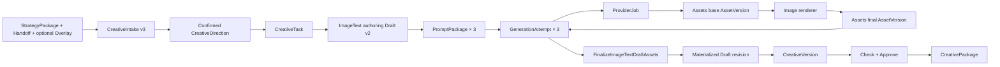

# Strategy → 图文素材落地 MVP 技术实现方案

> 本方案只实现小红书品牌图文首条闭环，以
> `docs/26-creative-shared-contract-state-machine-v1.md`、
> `api/fixtures/creative-shared-workflow-v1-frozen.json`
> 为共享权威基线。

| 属性 | 内容 |
| --- | --- |
| 日期 | 2026-07-31 |
| 状态 | 待产品、Creative、Assets、Provider、架构联合评审 |
| Owner | Creative 图文闭环 |
| 上游依赖 | 已确认 CreativeIntake v3、CreativeDirection v1 |
| 技术调研 | `docs/research/strategy-to-image-text-material-mvp-technical-research-2026-07-31.md` |
| 反方评审 | `docs/reviews/2026-07-31-strategy-to-image-text-material-mvp-adversarial-review.md` |

## 1. 执行结论

P0 交付目标固定为：

```text
StrategyPackage/Handoff + optional TaskOverlay
→ CreativeIntake v3
→ 人工确认 CreativeDirection
→ CreativeTask
→ LLM 生成并人工编辑三图图文稿
→ 三个不可变 PromptPackage
→ 三个图片生成 Attempt
→ Provider 底图进入 Assets
→ 服务端确定性合成 1080×1440 成品
→ 成品进入 Assets
→ 三图一次性物化为可交付 Draft revision
→ Freeze / Check / Approve / Deliver
→ immutable CreativePackage
```

核心决策：

1. 不修改冻结的共享 Creative 契约和状态机。
2. 新增 `creative-image-text-draft/v2` 等图文专属契约。
3. 图文创作稿由 LLM 生成严格 JSON，人工可编辑；失败时不写固定模板伪结果。
4. 图片模型只生成无字竖图底图，服务端确定性排版中文。
5. Provider 输出和最终成品都必须进入 Assets，页面只读稳定 AssetVersion。
6. ProviderJob、渲染和素材采用由服务端收敛，前端轮询只负责展示。
7. 三张成品不能逐张调用现有 `BindImageAsset`；必须一次性物化新 Draft revision。
8. `CreativeTask.version` 与 `ImageTextDraft.revision` 解耦。
9. P0 固定三图、三个模板、一个模型别名、一个平台，不做自由画布和直发。
10. Feature flag 默认关闭，内部项目验证后灰度。

## 2. 开工门禁

编码前必须完成：

- 产品确认 P0 是固定三图，而不是任意图数。
- 产品确认成品必须包含服务端文字合成，不接受纯底图作为交付。
- Creative、Assets、Provider Owner 确认血缘字段和回调/收敛边界。
- 字体许可证、仓库存放方式和产物分发方式确认。
- 新契约 Schema、fixture 和版本常量先评审。
- 共享冻结 fixture 和状态机不得变更。

不阻塞开发的默认值：

- 三图角色：cover / proof / cta；
- 模型输入：1024×1536；
- 成品：1080×1440 PNG；
- 图片质量：medium；
- 不自动重试；
- 人工批准后才能 Deliver。

## 3. 范围

### 3.1 P0 包含

- `strategy_package` v3 handoff 的真实图文入口；
- Direction 候选展示和人工确认；
- Task 创建后的真实图文 Workspace；
- LLM 结构化图文稿；
- 草稿编辑和乐观锁；
- 三个 slot 独立生成、失败展示和人工重试；
- Provider → Assets 自动入库；
- 三个固定模板的确定性合成；
- 三图原子物化；
- 冻结、检查、批准和交付；
- 任务刷新恢复、审计、指标和 feature flag。

### 3.2 P0 不包含

- 多平台、多画幅、任意图数；
- 自由画布和图层编辑；
- 模板运营后台；
- A/B 变体和自动择优；
- 自动批准、平台直发；
- 多图片模型选择 UI；
- 历史 v1 草稿自动升级为可交付 v2。

## 4. 目标架构



职责：

- Strategy：只提供不可变策略来源和可选任务增强。
- Creative：拥有 Draft、PromptPackage、Attempt、readiness、状态收敛和交付。
- Provider：执行模型任务，不判断 Creative 业务状态。
- Assets：拥有媒体字节、稳定版本、预览和血缘关系。
- Renderer：Creative 的格式专属确定性执行器，不属于 Provider。
- 前端：发送领域命令并展示 Workspace，不承担状态收敛。

## 5. 契约方案

### 5.1 保持不变

- `creative-intake-create/v3`
- `creative-intake/v3`
- `creative-planning-context/v1`
- `creative-direction-candidate-batch/v1`
- `creative-direction/v1`
- `creative-shared-workflow/v1`
- `creative-version/v1`
- `creative-package/v1`

### 5.2 新增

| Schema | Owner | 用途 |
| --- | --- | --- |
| `creative-image-text-draft-v2.schema.json` | Creative | 三图创作稿和物化稿 |
| `creative-image-prompt-package-v1.schema.json` | Creative | 单 slot 不可变生成输入 |
| `creative-image-generation-attempt-v1.schema.json` | Creative | 生成、渲染和输出血缘 |
| `creative-image-slot-selection-v1.schema.json` | Creative | 每个 revision/slot 显式采用的 attempt |
| `creative-image-text-workspace-v1.schema.json` | Creative | 页面聚合读模型 |
| `creative-image-render-spec-v1.schema.json` | Creative | 确定性合成规格 |

### 5.3 Draft v2

关键字段：

```json
{
  "contract_version": "creative-image-text-draft/v2",
  "task_id": "creative_task_x",
  "revision": 4,
  "generation_source_revision": 3,
  "direction_ref": {
    "direction_id": "direction_x",
    "content_hash": "sha256:..."
  },
  "input_identity_hash": "sha256:...",
  "title_candidates": ["...", "...", "..."],
  "selected_title": "...",
  "body": "...",
  "topics": ["..."],
  "image_plan": [
    {
      "order": 1,
      "role": "cover",
      "purpose": "...",
      "visual_brief": "...",
      "overlay_copy": "...",
      "layout_preset": "cover_center_v1",
      "asset_ref": {
        "asset_id": "asset_x",
        "version": 1
      }
    }
  ]
}
```

规则：

- authoring revision 的 `generation_source_revision` 为空，asset refs 可以为空。
- materialized revision 必须有三个 asset refs。
- materialized revision 的 `generation_source_revision` 指向直接生成来源。
- `direction_ref` 和 `input_identity_hash` 由服务端填写。
- 图数必须为 3，order 必须严格为 1、2、3，role 固定为 cover、proof、cta。

### 5.4 PromptPackage v1

不可变字段：

- task、authoring revision、slot；
- Direction ID/hash、input identity hash；
- compiled prompt、negative constraints；
- source AssetVersionRefs；
- compiler version；
- canonical content hash。

同一 authoring revision 和 slot 可以因用户重新确认而存在多个 PromptPackage，但同 content hash 幂等复用。

PromptPackage 只描述模型底图输入，不包含 `overlay_copy`。文字、布局、最终尺寸和字体属于 RenderSpec。这样只修改文字时可以复用底图，只重新渲染成品。

### 5.5 GenerationAttempt v1

状态：

```text
queued
→ running
→ base_asset_ready
→ rendering
→ succeeded

queued/running/rendering → failed
任意非终态 → cancelled
任意完成结果 → stale
```

约束：

- `base_asset_ready` 必须有 base AssetVersionRef。
- `succeeded` 必须有 final AssetVersionRef。
- attempt 永不覆盖，重试增加 `attempt_no`。
- stale 素材保留在 Assets，但不得自动采用。

### 5.6 SlotSelection v1

同一 slot 可以存在多个 succeeded attempts，但只能显式采用一个：

```json
{
  "contract_version": "creative-image-slot-selection/v1",
  "task_id": "creative_task_x",
  "draft_revision": 3,
  "image_plan_order": 1,
  "adopted_attempt_id": "attempt_x",
  "version": 2
}
```

规则：

- 第一次成功且该 slot 没有已采用结果时，可以自动采用；
- 用户对已成功 slot 点击“重新生成”后，旧 adopted attempt 保持有效；
- 新结果成功后状态为 proposed，必须由用户点击“采用这张”；
- 新结果失败不影响旧 adopted attempt；
- 三图物化只读取 SlotSelection，不使用“最新成功”推断。

## 6. 数据库迁移

建议迁移顺序：

### 6.1 `20260731104000_creative_image_text_v2.up.sql`

- 为 v2 查询补充索引；
- 不改写 v1 payload；
- 不改变共享 Task status constraint。

### 6.2 `20260731105000_creative_image_prompt_packages.up.sql`

新建 `creative_image_prompt_packages`：

- 组织、项目、Task、revision、slot；
- Direction 和 identity hash；
- prompt payload、compiler version、content hash；
- 创建者和时间；
- 不提供 UPDATE 路径。

关键唯一键：

```text
(organization_id, task_id, draft_revision, image_plan_order, content_hash)
```

### 6.3 `20260731106000_creative_image_generation_attempts.up.sql`

新建 `creative_image_generation_attempts`：

- prompt package；
- generation spec/hash；
- ProviderJob、RenderJob；
- base/final AssetVersion；
- attempt status、错误、stale reason；
- attempt number、idempotency metadata。

关键唯一键：

```text
(organization_id, provider_job_id)
(organization_id, task_id, draft_revision, image_plan_order, attempt_no)
```

同一迁移或紧随其后的迁移新增 `creative_image_slot_selections`：

- 主键：organization、task、draft revision、slot；
- adopted attempt 外键；
- selection version 乐观锁；
- adopted_by、adopted_at；
- 不把选择结果写回 PromptPackage。

### 6.4 Outbox

复用现有 Outbox 表和 runtime，不为图文新增第二套事件系统。

建议事件：

- `creative.image_text.draft.generated`
- `creative.image_text.attempt.created`
- `creative.image_text.base_asset.ready`
- `creative.image_text.render.requested`
- `creative.image_text.final_asset.ready`
- `creative.image_text.draft.materialized`
- `creative.image_text.task.ready_for_review`

Outbox 事件只通知和触发收敛，数据库仍是状态真源。

## 7. Repository 与事务

新增接口：

```go
type ImageTextRepository interface {
    CreateAuthoringDraft(...)
    SaveAuthoringDraft(...)
    CreatePromptPackage(...)
    CreateGenerationAttempt(...)
    GetGenerationAttemptForUpdate(...)
    MarkBaseAssetReady(...)
    MarkRenderStarted(...)
    MarkFinalAssetReady(...)
    MarkAttemptFailed(...)
    MarkAttemptStale(...)
    AdoptGenerationAttempt(...)
    ReconcileImageTextTask(...)
    FinalizeImageTextDraftAssets(...)
    GetImageTextWorkspace(...)
}
```

### 7.1 版本解耦

- Task version 是聚合乐观锁，每次 Task/Attempt/Draft 状态变化按事务递增。
- Draft revision 只在创建内容版本或物化版本时递增。
- 不再执行 `task.version = draft.revision`。
- API 同时携带 `expected_task_version` 和 `draft_revision`。

### 7.2 保存草稿

`SaveAuthoringDraft`：

1. 锁 Task；
2. 校验 expected task version 和 expected draft revision；
3. 计算字段 diff；
4. 创建新 authoring revision；
5. 按 visual input 与 render input 分别计算失效范围；
6. visual brief、来源素材或 Direction 变化时，底图和成品都失效；
7. 只修改 overlay copy 或 layout preset 时，成品失效，但允许复用相同 visual prompt hash 的 base AssetVersion；
8. 按共享状态机写合法 Task 状态；
9. 递增 Task version；
10. 写审计和 Outbox。

### 7.3 Attempt 成功收敛

外部 Provider/Assets 调用不放进数据库事务。

每次回调或 worker 轮询都调用幂等收敛：

1. 锁 Attempt；
2. 验证 job 归属和终态；
3. 验证 AssetVersion 属于同一组织和项目；
4. 比较当前 authoring revision；
5. 过期则写 stale；
6. 未过期则写 base/final AssetVersion；
7. 重新计算 Task 状态；
8. 写审计和 Outbox。

### 7.4 三图原子物化

`FinalizeImageTextDraftAssets` 必须是独立事务：

1. 锁 Task 和 authoring Draft；
2. 通过 SlotSelection 查询三个 slot 的当前 adopted succeeded attempts；
3. 校验 PromptPackage、Direction、identity 和 revision 完全一致；
4. 校验三个 final AssetVersion ready 且同 Project；
5. 创建仅增加 1 的 materialized Draft revision；
6. 一次性写入三个 asset refs；
7. 写 `generation_source_revision`；
8. Task 迁移为 `ready_for_review` 并递增 version；
9. 写审计和 Outbox。

禁止：

- 连续调用现有 `BindImageAsset` 三次；
- 连续调用当前 `ReviseDraft` 三次；
- 让前端逐图绑定；
- 修改原 authoring revision。

## 8. 图文稿生成

新增 `ImageTextDraftPlanner`，复用 Provider text capability 和严格 JSON Schema。

输入仅包含：

- CreativePlanningContext；
- confirmed Direction；
- 已授权且 ready 的来源素材摘要；
- 小红书三图格式规则；
- mandatory/prohibited constraints。

禁止：

- 从前端接受可信 Direction 内容；
- 把 TaskOverlay 当成 Creative 概念；
- 为缺失策略字段补默认事实；
- 生成无法追溯到 Direction 的模板文案。

输出校验：

- 标题候选正好 3 个；
- selected title 必须来自候选；
- body 和 topics 长度合法；
- image plan 正好 3 个；
- role/order 固定；
- visual brief 和 overlay copy 非空；
- prohibited claims 不得出现；
- mandatory 缺失形成 blocker 或 warning，按 PRD 规则处理。

执行方式：

- 使用现有持久化 AgentTask runtime；
- HTTP 返回 `202 Accepted`；
- 一次结构修复机会；
- 两次都失败则 AgentTask failed，不创建新 Draft；
- InvocationKey、模型别名、schema hash、输入 hash 和输出 hash 全部记录。

## 9. Prompt 编译与 generation readiness

新增纯函数 `CompileImagePromptPackage`：

```text
PlanningContext
+ confirmed Direction
+ exact authoring Draft revision
+ exact image slot
+ source AssetVersion metadata
+ prompt compiler version
→ immutable PromptPackage
```

P0 prompt 固定要求：

- portrait composition；
- subject centered with vertical crop safety；
- no text / no letters / no watermark / no logo fabrication；
- 为文字安全区留白；
- 风格、场景和色彩来自 Direction；
- 禁止项来自 PlanningContext。

只有以下全部满足才允许创建 Attempt：

- Task 路线为 image_text/xiaohongshu；
- Intake v3、PlanningContext、confirmed Direction identity 一致；
- authoring Draft v2 是当前 revision；
- slot 内容完整；
- 来源素材稳定且权利允许；
- model route 可用；
- 相同 prompt hash 没有 active attempt。

readiness 只能由服务端计算。

底图复用规则：

- 若新 revision 的 visual prompt hash 与已完成 attempt 相同，且 base AssetVersion 仍 ready，创建新 attempt 时直接复用 base asset，不调用 Provider；
- 新 attempt 从 `base_asset_ready` 进入 `rendering`；
- RenderSpec hash 必须反映 overlay copy、layout preset、字体、尺寸和 renderer version；
- 来源 attempt 和 base AssetVersion 写入新 attempt 血缘；
- visual prompt hash 不同则必须重新调用 Provider。

## 10. Provider 与 Assets 改造

### 10.1 Provider

扩展图片创建命令的领域输入：

- PromptRef；
- SourceResourceRefs；
- SourceAssetRefs；
- generation spec hash。

Provider adapter 的实际请求：

```text
model_alias = cookies.image.standard
width = 1024
height = 1536
quality = medium
output_format = png
```

Provider 不接收最终 1080×1440 交付语义。

### 10.2 Assets

Provider 底图继续走 GeneratedIntake。

新增窄接口：

```go
IngestRenderedImage(
    ctx context.Context,
    requestContext contract.RequestContext,
    projectID contract.ProjectID,
    renderJobID string,
    reader io.Reader,
    size int64,
    metadata ImageMetadata,
    provenance GenerationProvenance,
) (contract.ProjectAssetRef, error)
```

final asset provenance 至少包含：

- Task resource ref；
- Direction resource ref；
- authoring Draft resource ref；
- PromptPackage resource ref；
- GenerationAttempt resource ref；
- base AssetVersionRef；
- renderer version；
- render spec hash。

Assets 必须验证 PNG、1080×1440、大小上限和安全扫描。

## 11. 确定性图片 Renderer

P0 在 Go 服务内实现，不引入 Node sidecar。

建议依赖：

- `golang.org/x/image/draw`：CatmullRom 缩放；
- `golang.org/x/image/font/opentype`：OpenType 字体；
- Go 标准库 `image`、`image/draw`、`image/png`。

字体：

- 使用经法务确认的 Noto Sans CJK SC Regular/Bold；
- 字体文件版本固定；
- 启动时校验 SHA-256；
- 缺少字体时 readiness 阻断，不回退系统字体；
- golden tests 记录字体 checksum。

渲染步骤：

1. 解码 Provider PNG；
2. 校验至少为预期竖图尺寸；
3. 按中心安全区从 2:3 裁为 3:4；
4. CatmullRom 缩放到 1080×1440；
5. 根据 preset 绘制衬底、标题、正文或 CTA；
6. 执行最大行数、字号阶梯和溢出校验；
7. 编码 PNG；
8. 计算 content hash；
9. 调用 Assets rendered image intake。

三个模板：

- `cover_center_v1`
- `proof_lower_left_v1`
- `cta_bottom_v1`

同一输入 AssetVersion、render spec、字体和 renderer version 必须得到相同 hash。

## 12. 状态收敛

P0 使用阶段屏障：

| 条件 | Task 状态 |
| --- | --- |
| Task 刚创建 | `draft` |
| authoring Draft 可编辑 | `in_progress` |
| 任一 Provider attempt active | `generating` |
| 三个 base AssetVersion 全部 ready | `generated` |
| 三个 renderer job 启动 | `rendering` |
| 三个 final AssetVersion 完成并物化 | `ready_for_review` |
| Version approved | `approved` |
| Package created | `delivered` |

失败收敛：

- Provider 全部终态且存在失败：`generating → in_progress`；
- Renderer 全部终态且存在失败：`rendering → generated`；
- 用户修改生成中的 Draft：`generating/rendering/generated → in_progress`，旧 attempt stale；
- delivered 后再编辑：按共享契约先回 `draft`，旧 Package 不变。

禁止 `generating → rendering`，必须先进入 `generated`。

## 13. API

### 13.1 新增

```text
GET  /creative-tasks/{task_id}/image-text-workspace
POST /creative-tasks/{task_id}:generate-image-text-draft
POST /creative-tasks/{task_id}/image-slots/{order}:generate
POST /creative-tasks/{task_id}/image-slots/{order}:retry
POST /creative-tasks/{task_id}/image-slots/{order}/attempts/{attempt_id}:adopt
```

所有写接口：

- 要求 `creative.write`；
- 要求 Idempotency-Key；
- 接收 expected task version 和 draft revision；
- 返回稳定错误 code、retryable、request_id。

### 13.2 复用

```text
POST  /creative-intakes/{intake_id}:create-task
PATCH /creative-tasks/{task_id}:draft
POST  /creative-tasks/{task_id}:freeze-version
POST  /creative-versions/{version_id}:check
POST  /creative-versions/{version_id}:approve
POST  /creative-versions/{version_id}:deliver
```

### 13.3 兼容

- 旧 `:image-job` 和 `:bind-image-asset` 暂时保留；
- v2 Workspace 不调用旧接口；
- feature flag 开启的 v2 Task 禁止旧 bind 路径；
- 观察期结束后另提删除方案。

## 14. Workspace 前端

新增：

```text
src/features/creative/image-text/
  ImageTextWorkspace.tsx
  StrategySourcePanel.tsx
  DirectionPanel.tsx
  DraftEditor.tsx
  ImageSlotCard.tsx
  ReviewDeliveryPanel.tsx
  types.ts
```

页面阶段：

1. 策略来源只读；
2. Direction 候选和人工确认；
3. 图文稿生成、编辑和保存；
4. 三个 slot 的生成/重试；
5. 稳定成品预览；
6. 检查、批准和交付。

路由规则：

- Intake 阶段 URL 使用 Intake ID；
- Task 创建成功后导航到 Task URL；
- Task 页面永远不拿 Intake ID 查询 Task；
- 刷新后以 Workspace 为真源恢复。

交互门禁：

- Direction 未确认不能创建 Task；
- Draft 未保存不能生成；
- active attempt 禁止重复生成；
- stale 结果不显示为当前成品；
- 已成功 slot 重新生成后，新结果必须显式采用；
- 只改文字且 visual prompt 未变时显示“更新成品”，不重复调用图片模型；
- 三图未物化不能 Freeze；
- Check 未通过不能 Approve；
- Version 未 approved 不能 Deliver。

## 15. 安全、权限与审计

- 所有 resource ref 校验 organization_id 和 project_id。
- 不接受前端传入可信 prompt hash、Direction body 或 Asset metadata。
- Provider 临时 URL 不进入 Draft、Workspace 或日志。
- Prompt 日志进行敏感字段控制，完整 payload 存受控存储。
- 来源素材必须校验 ready、rights 和安全扫描状态。
- rendered image 再执行内容类型、尺寸和安全扫描。
- 每次人工 Direction 确认、草稿保存、生成、重试、采用、批准、交付写审计。

## 16. 自动化测试

### 16.1 Contract

- 新 Schema 正反 fixture；
- shared frozen fixture 不变；
- Go/TypeScript contract version 对齐；
- v1 双读、v2 新写。

### 16.2 Domain

- Direction/input identity 不匹配；
- Draft planner 非法 JSON 和语义失败；
- Prompt hash 稳定；
- readiness 全部 blocker；
- Task version 与 Draft revision 独立；
- slot 独立失败、重试和 stale；
- 多个 succeeded attempts 只有一个 adopted；
- 新 proposed attempt 失败不影响旧 adopted；
- 只改 overlay copy 复用 base asset 且只重渲染；
- 状态迁移全部合法；
- 三图只物化一个 revision；
- Freeze 缺图阻断；
- approved 前禁止 deliver。

### 16.3 MySQL integration

- 并发保存只有一个成功；
- 同幂等键不重复创建 attempt；
- Provider/Assets 重复回调幂等；
- 旧 revision 回写不能覆盖新 revision；
- 三图物化事务回滚不产生半绑定；
- 跨项目 Asset 拒绝；
- Outbox 与状态同事务。

### 16.4 Renderer

- 三个模板 golden images；
- 输出严格 1080×1440 PNG；
- 中文、英文、数字混排；
- 长文案阻断或按规则降级；
- 字体 checksum 不一致阻断；
- 同输入 content hash 一致。

### 16.5 HTTP/Frontend

- Intake/Task 身份切换；
- 权限、幂等、409/422/503；
- 页面刷新恢复；
- slot 独立状态；
- stale 结果不采用；
- 稳定 Asset preview；
- Freeze/Approve/Deliver 门禁。

## 17. 人工验收

必须执行调研文档第 12 节的完整人工主链路，并额外覆盖：

1. Provider 单 slot 失败后只重试该 slot；
2. 生成期间修改 Draft，旧结果显示为历史且不采用；
3. Assets 入库暂时失败后 worker 能继续收敛，不重复调用图片模型；
4. 三张完成后 Draft revision 只增加一次；
5. 关闭页面再打开能够恢复真实任务状态；
6. delivered 后新建 revision 不改变旧 Package。

## 18. 实施 PR 顺序

### PR 0：契约和 feature flag

- 新增六个图文专属 Schema 和 fixture；
- 新增 contract constants；
- 加入 `creative.image_text.workflow_v2`；
- 不改变运行行为。

门禁：contract tests、共享冻结 fixture。

### PR 1：数据模型与 Repository

- PromptPackage、Attempt、SlotSelection 三张新表；
- Task version / Draft revision 解耦；
- PromptPackage、Attempt repository；
- 原子物化事务；
- MySQL integration tests。

门禁：迁移 up/down、并发和事务测试。

### PR 2：图文稿 Planner

- ImageTextDraftPlanner；
- AgentTask 执行；
- 严格 schema 和语义校验；
- authoring Draft 保存；
- API。

门禁：非法输出、失败不写草稿、identity 校验。

### PR 3：图片生成领域命令

- readiness；
- PromptPackage compiler；
- Attempt 创建和 retry；
- SlotSelection 和 adopt 命令；
- 底图复用判定；
- Provider provenance 扩展；
- 1024×1536 route；
- Workspace 初版。

门禁：幂等、stale、Provider stub integration。

### PR 4：Assets rendered image 与 Renderer

- `IngestRenderedImage`；
- 三个固定模板；
- 字体 checksum；
- golden tests；
- final asset provenance。

门禁：尺寸、hash、血缘和安全扫描。

### PR 5：Worker 收敛和状态机

- base asset reconcile；
- render reconcile；
- 三图阶段屏障；
- 原子物化；
- Outbox、指标和审计。

门禁：失败恢复、重复事件、合法状态迁移。

### PR 6：Workspace 前端

- Strategy handoff 身份修正；
- Direction UI；
- DraftEditor；
- 三 slot 状态和预览；
- Review/Delivery。

门禁：frontend tests、`npm run build`、人工刷新恢复。

### PR 7：灰度与验收

- 内部 Project 开 flag；
- 跑完整人工主链路和三条故障链路；
- 记录延迟、成功率和成本；
- 通过后扩大灰度。

## 19. 每个 PR 的交付门禁

每个 PR 必须：

1. 只包含本 PR 范围文件；
2. 更新相应 schema/fixture/文档；
3. `git diff --check` 通过；
4. Go 改动运行相关 `go test`；
5. 前端改动运行相关测试和 `npm run build`；
6. migration 包含 down 文件并通过集成测试；
7. 不削弱现有检查；
8. push 后持续检查 `gh pr checks`；
9. required GitHub Actions 全部通过后才能算完成。

## 20. 灰度、回滚与止损

### 20.1 Feature flag

```text
creative.image_text.workflow_v2
```

关闭时：

- 不创建新 v2 Task；
- 已存在 v2 Task 仍可只读；
- worker 继续收敛已提交任务，避免孤儿 job；
- 不删除 PromptPackage、Attempt、Asset 或 Package。

### 20.2 回滚

- 前端入口可独立关闭；
- Planner、Provider submit 可停止接收新命令；
- worker 不能直接停掉，先完成或安全标记 active attempt；
- migration 不在已有生产数据后直接 down；
- 使用前滚修复为主。

### 20.3 止损阈值

灰度期间任一项触发暂停新增任务：

- Provider 成功但最终 Asset 入库成功率低于 95%；
- 三图物化出现半成功；
- stale 结果被错误采用；
- final image 不是 1080×1440；
- 跨项目资源校验失败；
- delivered Package 被后续编辑改变；
- required CI check 不稳定。

## 21. 文件改动清单

预计新增或修改：

```text
api/contracts/creative-image-text-draft-v2.schema.json
api/contracts/creative-image-prompt-package-v1.schema.json
api/contracts/creative-image-generation-attempt-v1.schema.json
api/contracts/creative-image-slot-selection-v1.schema.json
api/contracts/creative-image-text-workspace-v1.schema.json
api/contracts/creative-image-render-spec-v1.schema.json
api/fixtures/...

migrations/creative/20260731104000_...
migrations/creative/20260731105000_...
migrations/creative/20260731106000_...

internal/systems/creative/image_text_*.go
internal/systems/creative/model.go
internal/systems/creative/service.go
internal/systems/creative/mysql_repository.go
internal/platform/provider/...
internal/systems/assets/...
internal/platform/httpserver/creative_handlers.go
internal/platform/httpserver/server.go

src/data/api.ts
src/features/strategy/TaskStrategyHandoff.tsx
src/features/creative/image-text/...
```

## 22. 完成定义

只有同时满足以下条件，P0 才完成：

- 真实 StrategyPackage/Handoff 能创建图文 Task；
- confirmed Direction 是图文稿唯一创意方向输入；
- LLM 草稿真实持久化且可人工编辑；
- 三个 slot 可独立生成和重试；
- 每个底图和成品都有稳定 AssetVersion 与完整血缘；
- 三张成品严格为 1080×1440；
- 三图只物化一个可交付 Draft revision；
- Freeze、Check、Approve、Deliver 全部生效；
- CreativePackage 不可变；
- 人工主链路与故障链路通过；
- required CI checks 全绿。
