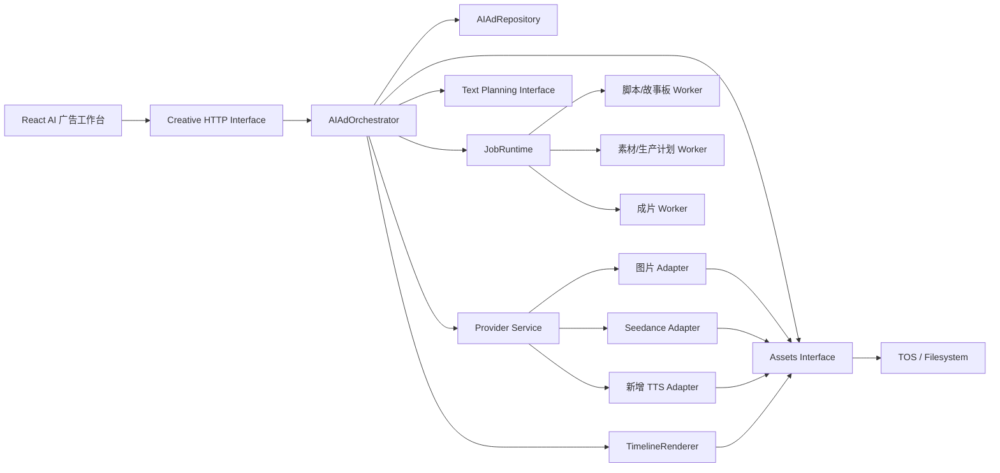
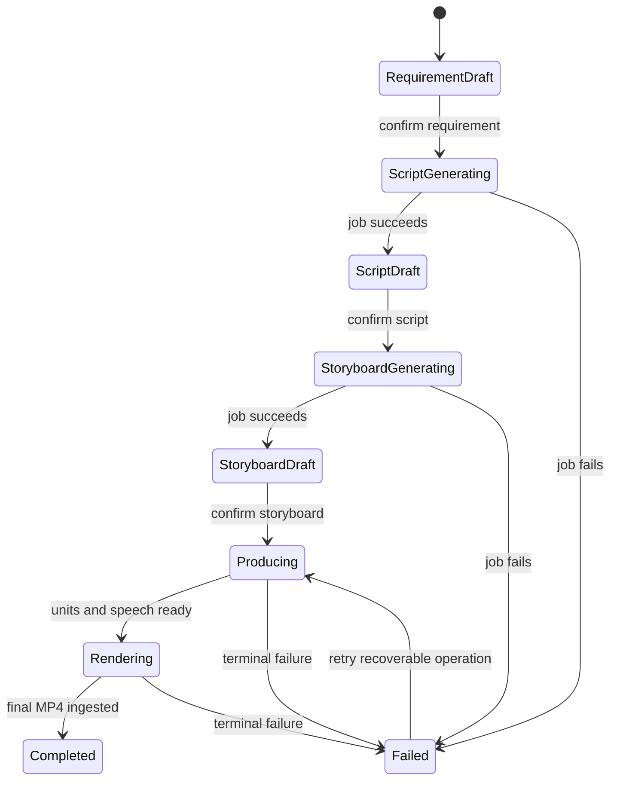

# AI 原生效果广告视频生成：完整实施技术方案 v2

- 日期：2026-08-04
- 适用仓库：`cookies-platform`
- 目标入口：创意创作 / 视频创作 / 效果广告 / AI 效果广告生成
- 首发渠道：抖音
- 首发规格：竖屏 `9:16`、15～30 秒、简体中文
- 文档性质：以 2026-08-04 当前代码为基线的可执行方案；取代旧方案中与现状不一致的实施假设

## 1. 执行摘要

AI 原生广告不应被实现成一条从浏览器连续调用多个模型的长请求，也不应把四阶段状态只保存在 React 中。正确形态是一个 Creative 拥有的、版本化的 `AIAdWorkspace`：

```text
商品导入 → 需求版本 → 脚本版本 → 故事板版本 → 生产计划
                                        ↓
                                图片 / 视频 / TTS Job
                                        ↓
                                  Timeline RenderJob
                                        ↓
                              项目内稳定 MP4 AssetVersionRef
```

实现策略不是重做现有基础设施，而是在现有能力上增加一个薄业务入口和一个深编排模块：

- 继续使用 Go Creative bounded context 管理业务状态；
- 继续使用 `provider.Service` 管理图片、视频供应商差异和异步任务；
- 继续使用 `jobruntime` 管理持久任务、租约、重试、取消与恢复；
- 继续使用 Assets、TOS/文件系统和 Generated Intake 保存稳定素材；
- 新增脚本、故事板、生产计划、TTS 和通用 Timeline Renderer；
- 前端只消费服务端事实，不再自行制造脚本、故事板或渲染进度。

### 1.1 当前真实进度

| 能力 | 当前状态 | 结论 |
|---|---|---|
| 前端四阶段工作台 | 已搭建 | 页面结构可保留 |
| 商品链接提交 | 已接真实接口 | 可保留 |
| 抖音分享链接跳转解析 | 已实现 | 只支持受控域名和特定 URL 数据，能力有限 |
| 商品标题、价格、销量、一张主图提取 | 已实现 | 不是完整详情页抓取 |
| AI 需求分析 | 已实现模型调用与确定性降级 | 需要移除生产环境的静默降级 |
| 需求 revision、编辑、确认 | 已实现 | 缺 reopen 和下游失效 |
| 脚本生成 | 仅前端 fixture | 必须新增后端 |
| 故事板生成 | 仅前端 fixture | 必须新增后端 |
| 视频进度 | 前端计时器模拟 | 必须改为服务端生产进度 |
| 图片 Provider | 已有异步框架和 Assets 入库 | 可复用 |
| Seedance 视频 Provider | 已有异步提交、轮询和入库 | 可复用，启用前需 capability probe |
| TTS | 未实现 | 现有 `volcengine_asr` 是识别，不是合成 |
| FFmpeg | 有固定 15 秒拼接器 | 需新增 Timeline Renderer |
| 本地 FFmpeg 环境 | 未配置 | 当前 PATH 找不到 `ffmpeg` 和 `ffprobe` |
| 对象存储 | filesystem/TOS 抽象已存在 | 生产环境使用 TOS |
| 素材检查入队 | 不在本期 | 生成稳定 MP4 即结束 |

### 1.2 交付定义

本功能只有同时满足以下条件，才能称为“完整实现”：

1. 刷新或离开页面后，四阶段状态和运行任务可恢复；
2. 用户确认的上游 revision 是下游唯一合法输入；
3. 重新编辑上游时，服务端原子地使下游失效并尽力取消任务；
4. 脚本和故事板由真实模型生成并通过严格 Schema 校验；
5. 每个视频片段、旁白和最终 MP4 都是当前 Project 下的稳定 Asset；
6. 进度和 ETA 来自服务端任务，不是前端计时器；
7. 最终成片包含视频、旁白、字幕、BGM/音效，并通过 ffprobe 技术校验；
8. Provider URL、API Key 和临时磁盘路径不进入前端或业务版本数据。

## 2. 范围与非目标

### 2.1 P0 范围

- 商品链接 + 用户补充需求；
- 抖音渠道；
- 商品名称、描述、目标受众、链接图片、核心卖点；
- 9:16、15～30 秒、简体中文；
- 每次一份完整营销脚本；
- 人物、商品、场景、音频、参考素材板；
- 多个详细分镜；
- 缺失人物/场景/构图参考图生成；
- 多个 4～6 秒视频 Generation Unit；
- 统一旁白、字幕、BGM、音效和最终 MP4；
- 生成进度、ETA、失败重试、中断恢复；
- 成片进入项目 Assets，前端可预览和下载。

### 2.2 明确不做

- 快手、小红书、视频号、淘宝/天猫的真实生成；
- 历史版本比较和恢复 UI；
- 自动进入素材检查模块；
- 自动发布到抖音或广告账户；
- 数字人；
- 多脚本候选并排选择；
- AI 自动生成可商用 BGM；
- 对“爆款”“流量保证”等结果作承诺。

其他渠道可以在前端显示“规划中”，但不可提交生成请求。

## 3. 当前代码基线

### 3.1 前端

当前 AI 工作台位于 `src/features/ai-native-ad/`：

- `AINativeAdWorkspace.tsx`：四阶段编排和当前 React 状态；
- `RequirementStage.tsx`：真实需求分析、编辑、确认；
- `ScriptStage.tsx`：单脚本 UI；
- `StoryboardStage.tsx`：素材板和详细分镜 UI；
- `VideoStage.tsx`：进度、ETA 和完成态 UI；
- `reducer.ts`：冻结与下游作废的前端状态机；
- `api.ts`：当前三个需求阶段写接口；
- `fixtures.ts`：脚本与故事板演示数据。

必须保留 UI 和交互布局，但删除以下前端业务行为：

- `createScriptFixture`；
- `createStoryboardFixture`；
- `window.setInterval` 模拟视频进度；
- 仅在浏览器中执行 reopen 和下游失效；
- 伪造“视频生成完成”的下载/播放状态。

前端最终只承担：发命令、展示服务端 Workspace、局部编辑草稿、轮询生产状态和播放稳定 Asset URL。

### 3.2 当前需求后端

以下代码可直接扩展：

- `internal/systems/creative/ai_native_requirement.go`；
- `internal/systems/creative/ai_native_requirement_workspace.go`；
- `internal/systems/creative/ai_native_requirement_planner.go`；
- `internal/systems/creative/ai_native_requirement_mysql.go`；
- `internal/platform/httpserver/ai_native_ad_handlers.go`；
- `api/openapi/creative-v1.yaml`；
- `api/contracts/creative-ai-native-requirement-*.schema.json`。

当前具备：

- Project 和 Organization 授权；
- 抖音、9:16、15～30 秒、中文约束；
- 严格模型 JSON 输出；
- revision 追加；
- `expected_revision` 乐观并发控制；
- 确认冻结；
- MySQL 持久化。

当前不足：

- Workspace 只有 requirement 状态，没有完整阶段指针；
- 没有 `workspace_version`；
- 没有 reopen；
- 没有 `superseded`；
- 没有 Script/Storyboard/Production 领域对象；
- Requirement Media 仍是第三方 URL，而非 `AssetVersionRef`；
- 模型失败会降级为固定杯具受众文本，不适合作为任意商品的生产结果。

### 3.3 商品导入

`internal/integrations/productsource/douyin.go` 当前做了：

- 从分享文本中提取 HTTPS URL；
- 只允许 `v.douyin.com` 和 `haohuo.jinritemai.com`；
- 最多五次重定向；
- 从最终 URL 的 `goods_detail` 查询参数提取数据；
- 只保留 `url_list` 中第一张有效主图；
- 图片只允许 `ecombdimg.com` 域名。

它没有抓取商品详情 HTML、详情图、SKU 图或商品视频。因此产品描述和多素材不能建立在“当前已经提取完整详情页”的假设上。

### 3.4 Provider 与任务运行时

以下能力已存在，应作为稳定 seam 复用：

- `provider.Service.CreateImageJob`；
- `provider.Service.CreateVideoJob`；
- Provider Route/Credential 配置；
- Ark/OpenAI-compatible 图片 Adapter；
- Ark Seedance 异步视频 Adapter；
- Provider Job submit → poll → output fetch → Assets intake；
- JobRuntime 持久队列、租约续期、延迟重试、取消请求；
- Generated Output 的 SHA-256、MIME、大小和项目归属校验。

当前视频 Provider 的稳定内部 Interface 支持：

- 4～15 秒；
- 9:16、16:9、1:1；
- 480p、720p、1080p 的抽象输入；
- 文生视频、单参考图、首尾帧；
- `silent` 或 `generated_audio`；
- 但当前 Ark Adapter 主动拒绝 1080p。

AI 广告 P0 使用 `720p + 9:16 + silent`。旁白和音乐统一放在后期，避免多个片段音色和口播不可控。

### 3.5 Assets 和存储

现有 Assets 已具备：

- Project-scoped `AssetVersionRef`；
- filesystem/TOS BlobStore；
- 上传隔离、扫描和 Generated Intake；
- 图片/视频大小、MIME、SHA-256 校验；
- FFprobe 视频元数据；
- 生成和派生 lineage。

所有外部商品图、AI 图片、视频片段、旁白和最终成片必须进入 Assets。业务表只能长期保存稳定引用，不能保存带过期签名的 Provider URL。

### 3.6 FFmpeg

`internal/platform/media/composer.go` 当前：

- 能标准化视频并拼接；
- `ComposeSegments` 强制总时长等于 15 秒；
- 不支持旁白、BGM、音效、字幕、转场和进度回调；
- `CommandRunner` 只能返回最终成功或错误。

因此不要继续给 `ComposeSegments` 添加越来越多参数。新增独立、较深的 `TimelineRenderer` 模块，旧前贴和品牌合成器保持不变。

## 4. 目标架构



### 4.1 模块划分

| Module | 小 Interface | 隐藏的复杂度 |
|---|---|---|
| `AIAdOrchestrator` | `Analyze`、`UpdateStage`、`ConfirmStage`、`ReopenStage`、`StartProduction`、`Get` | 阶段合法性、revision、作废、任务入队、进度聚合 |
| `AIAdRepository` | 读取聚合、事务性追加 revision、状态迁移 | MySQL 表、锁、指针和 content hash |
| `ChannelCreativeProfileRegistry` | 按渠道和版本解析 Profile | 抖音规则、Prompt 片段、输出规范、hash |
| `ScriptPlanner` | 从确认需求生成一份脚本 | Prompt、严格 Schema、重试、修复与事实约束 |
| `StoryboardPlanner` | 从确认脚本生成故事板 | 素材角色、分镜 Schema、时长闭合 |
| `ProductionPlanner` | 从确认故事板生成生产图 | Shot 拆分、Provider 能力、条件素材和 Attempt |
| `SpeechSynthesizer` | 从旁白单元生成音频 Asset | 供应商鉴权、音色、音频格式和时间标记 |
| `TimelineRenderer` | 从冻结 Timeline 输出 MP4 | FFmpeg 参数、字幕、混音、ducking、进度和清理 |

调用者和测试只跨这些 seam，不直接理解供应商请求 JSON、临时 URL、FFmpeg filter graph 或表结构。

## 5. 统一领域模型

### 5.1 术语

- **AIAdWorkspace**：一条 AI 原生广告创作的聚合根，属于一个 Project 和一个 CreativeTask。
- **ProductSnapshot**：商品导入时冻结的来源快照，不随外部商品页变化。
- **RequirementRevision**：用户可编辑并确认的商品与生成需求版本。
- **AdScriptRevision**：一份完整营销脚本版本，不是候选集合。
- **StoryboardRevision**：素材计划和详细 Shot 列表版本。
- **ProductionPlan**：把叙事 Shot 编译为可执行图片、视频、语音和渲染任务的冻结计划。
- **GenerationUnit**：一次 Provider 可执行的视频生成单元，通常 4～6 秒。
- **GenerationAttempt**：某 Unit 的一次具体模型尝试；重试只增加 Attempt。
- **Timeline**：最终合成所需的确定性视频、音频、字幕和图层轨道。
- **RenderJob**：执行 Timeline 并产出最终 MP4 的任务。
- **ChannelCreativeProfile**：后端拥有、版本化的渠道创作规则，不是前端 Prompt 文本。

### 5.2 AIAdWorkspace

建议结构：

```text
workspace_id
creative_task_id
organization_id
project_id
channel = douyin
format = video
purpose = performance
current_stage = requirement | script | storyboard | production | completed
status = active | generating | completed | failed | cancelled
workspace_version
current_requirement_revision
current_script_revision nullable
current_storyboard_revision nullable
current_production_plan_id nullable
active_operation_id nullable
final_asset_ref nullable
created_by / created_at / updated_at
```

`workspace_version` 用于跨阶段命令的乐观锁；每种内容仍有自己的 `revision`。

### 5.3 Revision 通用规则

所有 revision 表至少包含：

```text
organization_id + project_id + workspace_id
revision
status = draft | confirmed | superseded
content_payload JSON
content_hash SHA-256
based_on_revision nullable
generation_metadata JSON
created_by / created_at
confirmed_by / confirmed_at nullable
superseded_at nullable
```

规则：

- Draft 可追加修改，不能覆盖旧 revision；
- Confirmed 不可 PATCH；
- 下游只能引用 Confirmed revision + content hash；
- Reopen 创建新 Draft，不把旧 Confirmed 改回 Draft；
- 旧版本可以变为 Superseded，但不得物理删除；
- 晚到的 Provider 输出仍可入库，但不能自动成为当前结果。

### 5.4 AdScriptRevision

```text
title
creative_summary
channel_profile_id + channel_profile_hash
duration_seconds
segments[]:
  id
  start_ms
  end_ms
  purpose = hook | pain | proof | benefit | cta
  visual_intent
  voiceover
  subtitle
  selling_point_ids[]
  conversion_action nullable
regeneration_note
generation_metadata
```

校验：

- 只有一份脚本；
- Segment 有序、无重叠、无空洞；
- 首段从 0 开始，末段等于目标时长；
- 每段必须有画面意图、旁白或明确的无旁白标记、字幕；
- 使用的卖点 ID 必须来自确认需求；
- 包含开场钩子、卖点证明和 CTA；
- 字数必须适配预计口播时长。

### 5.5 StoryboardRevision

素材板：

```text
assets[]:
  id
  role = product_identity | person_identity | scene_reference |
         composition_reference | audio_reference | brand_element
  source = product_import | project_asset | ai_generated
  asset_ref nullable
  generation_brief nullable
  status = ready | planned | generating | failed
```

分镜：

```text
shots[]:
  id
  start_ms / end_ms / duration_ms
  visual_content
  subjects_products_actions
  shot_size
  camera_movement
  reference_asset_ids[]
  voiceover
  subtitle
  sound_effect
  bgm_direction
  transition
  product_identity_required
```

校验：

- Shot 时间线闭合且等于脚本时长；
- 每个 Shot 包含用户要求的全部九类信息；
- 引用的素材 ID 必须存在；
- 商品主体镜头必须引用真实商品 Asset；
- 人物/场景参考不得误标成商品身份素材；
- CTA、价格和功效表达必须来自已确认事实。

### 5.6 ProductionPlan

```text
plan_id
storyboard_revision + storyboard_hash
channel_profile_id + hash
video_model_alias
image_model_alias
speech_model_alias
generation_units[]
speech_units[]
timeline
status
created_at
```

Generation Unit：

```text
unit_id
shot_ids[]
duration_seconds
input_mode = text_only | reference_image | first_last_frame
conditioning_asset_refs[]
prompt_package_id + content_hash
selected_attempt_id nullable
status
```

一个 Shot 是叙事单元，一个 Generation Unit 是模型执行单元，两者不能混为同一概念。P0 推荐 Unit 4～6 秒；小于 4 秒的 Shot 合并生成后按 Timeline 裁切。

## 6. 状态机与作废规则



### 6.1 Reopen

| 重新编辑阶段 | 服务端作废范围 |
|---|---|
| 需求 | 脚本、故事板、ProductionPlan、当前成片 |
| 脚本 | 故事板、ProductionPlan、当前成片 |
| 故事板 | ProductionPlan、当前成片 |

流程：

1. 前端读取 `reopen-impact`；
2. 弹窗展示将失效的 revision、运行 Job 和最终成片；
3. 用户确认后提交 `invalidate_downstream=true`；
4. Repository 在一个事务中创建新 Draft、推进 `workspace_version`、清空当前下游指针并标记 Superseded；
5. 对运行中的 Job 写入 cancel request；
6. 晚到输出只能作为 lineage 保留，不能重新挂回 Workspace。

作废不是删除。旧 Asset 仍可保留，后续按保留策略清理无引用临时产物。

## 7. 渠道创作配置

### 7.1 存放位置

P0 将抖音规则放在后端版本化 Registry 中，例如：

```text
internal/systems/creative/channelprofile/
  douyin_performance_v1.go
  registry.go
  registry_test.go
```

前端只提交 `channel=douyin`。后端解析到：

```text
profile_id = douyin.performance.v1
content_hash = <sha256>
```

每个脚本、故事板和 ProductionPlan 都保存 Profile ID 与 hash。修改规则必须发布新版本，不原地改变旧任务的行为。

### 7.2 抖音效果广告规则 v1

这是 Cookies 的内部创作启发式，不应宣称为抖音官方流量算法：

- 0～3 秒必须出现可理解的痛点、反差、结果预告或使用情境；
- 前 3 秒优先让商品或问题可见，不用纯品牌空镜；
- 一条 15～30 秒视频只围绕一个主诉求，最多三个证明点；
- 每 2～4 秒发生画面信息变化，但不为了快而破坏商品理解；
- 卖点要尽量“动作化”：展示装入、开合、冲洗、佩戴、对比或场景使用；
- 字幕短句化，每屏一层意思，位于竖屏安全区；
- 旁白和字幕语义一致，但字幕允许压缩；
- 结尾明确商品、适用人群和下一步动作；
- 禁止补造材质、性能时长、折扣、销量、认证和医疗功效；
- 不使用“保证爆款”“平台推荐”“稳赚”等声明。

PromptCompiler 输入：

```text
确认后的上游 revision
+ ChannelCreativeProfile ID/hash
+ Project/Brand 约束
+ 当前阶段 JSON Schema
+ 用户本次重新生成要求
= 不可变 PromptPackage
```

## 8. 四阶段实施

### 8.1 阶段一：商品导入与需求分析

保留当前接口入口，但升级为异步可恢复导入：

1. 规范化分享文本，提取 URL；
2. 验证 HTTPS、域名、重定向和响应大小；
3. 解析商品快照；
4. 将商品图下载到隔离存储，校验 MIME/大小/SHA-256；
5. 通过 Generated/Upload Intake 进入当前 Project Assets；
6. Requirement Media 保存 `AssetVersionRef`，第三方 URL 只保存在 ProductImport 审计信息；
7. 文本模型只基于商品快照和用户补充需求输出结构化结果；
8. 返回可编辑 Draft。

P0 商品导入策略分两级：

- 一级：当前受控分享链接解析，快速可用；
- 二级：授权的抖音电商接口或受控抓取器，补详情图、SKU 和描述。

解析失败时必须允许用户手工填写商品名称、描述、受众、卖点并上传图片，不能让第三方页面成为单点故障。

生产环境不要把任意商品静默降级成“杯具人群”。确定性 planner 只用于测试和明确标记的演示模式；真实模式失败应返回可恢复错误。

### 8.2 阶段二：单脚本生成

新增 `ModelAIAdScriptPlanner`：

- 输入：Confirmed Requirement、Profile、项目约束、可选重新生成要求；
- 输出：严格 `creative.ai-native.script/v1` JSON；
- 文本模型：`cookies.text.standard`；
- Prompt 版本：`ai-ad-script/douyin/v1`；
- 每次只生成一份完整脚本；
- 模型返回后执行领域校验；
- 第一次非法输出可进行一次结构修复，第二次失败则 Job failed；
- 保存模型版本、route revision、Prompt 版本、Profile hash 和 token/耗时元数据。

“重新生成整版”创建新的 ScriptRevision，并保留 `based_on_revision` 与 `regeneration_note`。

### 8.3 阶段三：故事板与素材准备

新增 `ModelAIAdStoryboardPlanner`：

- 输入：Confirmed Script + Confirmed Requirement + Profile；
- 输出：素材板和完整 Shot 列表；
- Prompt 版本：`ai-ad-storyboard/douyin/v1`；
- 输出经过时间线、素材引用、商品事实和字段完整性校验。

随后执行 `PrepareStoryboardAssets`：

- 商品图片：必须复用链接导入的真实 Asset；
- 人物/场景/构图参考：缺失时调用 `cookies.image.standard`；
- 品牌 Logo/包装：优先项目 Assets，不允许图片模型凭空重画；
- 所有生成结果由现有 Provider → Generated Intake → Assets 链路入库；
- Storyboard 只保存稳定 `AssetVersionRef`。

官方 GPT Image 2 支持生成与编辑、灵活尺寸和高保真图像输入；720×1280 符合当前官方尺寸约束。它通过 Images API 返回 Base64 图片，服务端必须立即解码并进入 Assets。当前项目仍通过第三方 OpenAI-compatible Gateway 调用，因此即使模型名相同，也必须对真实网关做 capability probe。官方参考：[GPT Image 2](https://developers.openai.com/api/docs/models/gpt-image-2)、[Image generation guide](https://developers.openai.com/api/docs/guides/image-generation)。

### 8.4 阶段四：视频生产

#### 8.4.1 ProductionPlan 编译

`ProductionPlanner` 按 Provider 能力把 Shot 编译成 Unit：

- 默认每个 Unit 4～6 秒；
- 同一人物或商品连续镜头尽量共享条件素材；
- 商品身份要求高时使用真实商品参考图；
- 有明确开头和结束构图时使用首尾帧；
- 只在不需要身份一致性的过场使用 text-only；
- Provider 生成 `silent`；
- Unit 输出长度可以大于 Shot，最终由 Timeline 精确裁切。

当前 Ark Adapter 已按官方异步任务形态调用创建和查询接口，并立即下载临时结果再进入 Assets。火山方舟官方 API 目录列出了创建、查询、列表和删除内容生成任务：[Ark API 文档中心](https://api.volcengine.com/api-docs/view/overview?serviceCode=ark)。具体模型能力仍以账户控制台和 capability probe 为准。

Adapter 还要补齐供应商错误分类：

- `QuotaExceeded` → 容量/限流，可退避重试；
- 输入文本或图片敏感 → 输入合规拒绝，不重试；
- 输出视频敏感 → 输出合规拒绝，可让用户修改创意，不自动重试；
- 模型未开通或规格非法 → 能力配置错误；
- 5xx/网络轮询错误 → 有抖动的指数退避；
- 取消只承诺尽力执行，运行中任务仍可能产生晚到输出。

#### 8.4.2 GenerationAttempt

每个 Unit 默认只创建一个 Attempt：

```text
planned → submitted → running → ingesting → succeeded
                               ↘ failed / cancelled / expired
```

重试只增加失败 Unit 的 Attempt；已成功 Unit 不重新计费。用户选择/锁定的 Attempt 成为 `selected_attempt_id`。

#### 8.4.3 TTS

新增 Provider 级 `SpeechSynthesis` seam，而不是复用 ASR：

```go
type SpeechSynthesisInput struct {
    Text            string
    VoiceAlias      string
    Language        string
    Format          string
    SampleRate      int
    SpeakingRate    float64
    NeedTimestamps  bool
}
```

P0 推荐 `cookies.speech.standard` 路由到豆包语音 V3 HTTP Chunked 单向流式接口：一次提交当前 Shot 旁白，流式接收音频，并请求字级时间戳。MiniMax Speech 2.8 仅在确认账号权限、商业授权、音色和时间标记能力后作为 Adapter 候选。业务层不能依赖供应商名称。

统一输出：

```text
SpeechSynthesisResult
  audio_asset_ref
  codec / sample_rate / duration_ms
  original_text
  normalized_text
  word_timings[] { text, begin_ms, end_ms }
  provider_request_id
  model_and_voice_snapshot
```

豆包语音的 AppID/Token/音色权限与方舟视频 API Key 是独立权限，已有方舟 Key 不能证明 TTS 已开通。官方 V3 接口与时间戳说明：[豆包语音大模型 API](https://www.volcengine.com/docs/6561/2228192?lang=zh)。

火山引擎官方长文本接口是异步 submit/query，通常可能等待数十分钟，官方也明确提示强时效场景应使用短文本语音合成。因此 15～30 秒广告不应选长文本异步产品作为默认路径：[豆包语音异步长文本合成](https://www.volcengine.com/docs/6561/1096680)。

P0 对每个 Shot 单独合成旁白：

- 有时间标记则生成精确字幕时间；
- 无时间标记则以 Shot 边界生成句级字幕；
- 音频比 Shot 短时补静音；
- 超长不超过 8% 时用 `atempo` 轻微加速；
- 超过 8% 时判定脚本不适配，不做不可理解的强行压缩。

#### 8.4.4 BGM、音效和字体

- BGM 和音效来自已获商用授权的内部素材库或项目上传；
- P0 不自动生成音乐；
- 默认旁白音色必须明确商业使用范围；
- 字体必须固定版本、保存 SHA-256 和许可证信息；
- Timeline 保存 BGM、音效、字体和音色的稳定版本引用；
- 如果没有授权 BGM，可以生成“仅旁白 + 音效”的有效成片，但页面要明确提示。

## 9. Timeline Renderer

新增：

```text
internal/platform/media/timeline.go
internal/platform/media/ffmpeg_timeline_renderer.go
internal/platform/media/ass_subtitles.go
internal/platform/media/progress.go
```

### 9.1 Interface

```go
type TimelineRenderer interface {
    Render(ctx context.Context, request TimelineRenderRequest, report ProgressFunc) (CompositionOutput, error)
}
```

`TimelineRenderRequest` 只接收稳定 Asset 引用和冻结 Timeline，不接收远程 URL 或任意用户 FFmpeg 参数。

### 9.2 渲染管线

1. 从 Assets 打开全部输入并复制到独立 work directory；
2. ffprobe 校验视频和音频；
3. 视频统一为 720×1280、30fps、H.264、`yuv420p`；
4. 按 Shot `trim/setpts`；
5. P0 使用硬切或一套固定短 `xfade`，不允许模型输出任意滤镜；
6. 生成 ASS 字幕，限定竖屏安全区、字号、描边和最大行数；
7. 旁白音轨延迟到对应 Shot 时间点；
8. BGM 循环/裁切至总时长；
9. 旁白存在时对 BGM 使用 sidechain compression 或确定性 volume envelope；
10. 音效按时间戳混入；
11. `amix` 后执行响度控制和峰值限制；
12. 输出 AAC + H.264 MP4，启用 `+faststart`；
13. ffprobe 校验总时长、分辨率、音视频流和可解码性；
14. 通过 Rendered Asset Writer 进入 Assets；
15. 成功或失败都清理临时目录。

FFmpeg 官方滤镜文档提供 `amix`、`sidechaincompress`、`subtitles` 等滤镜，可支撑多轨混音、旁白触发 BGM 压低和字幕烧录：[FFmpeg Filters](https://ffmpeg.org/ffmpeg-filters.html)。

### 9.3 进度

当前 `CommandRunner` 不适合进度上报。新增 `ProgressCommandRunner`：

- 使用参数数组执行，不拼接 shell 字符串；
- FFmpeg 使用 `-progress pipe:1 -nostats`；
- 解析 `out_time_ms`；
- `progress = min(99, out_time_ms / total_duration_ms)`；
- 每 1 秒或进度变化 ≥1% 持久化一次；
- 最终 Asset 入库后才写 100%。

### 9.4 恢复与清理

- Provider Unit 成功结果已入 Assets，重启后直接复用；
- TTS 成功结果已入 Assets，重启后直接复用；
- RenderJob 使用 content hash + idempotency key；
- Worker 崩溃后由 JobRuntime 租约恢复；
- FFmpeg 被取消时终止子进程；
- 启动时和定时任务清理超过 TTL 且没有活跃租约的 work directory；
- 临时磁盘不足时在开始渲染前失败，不在中途写满磁盘。

## 10. 服务端进度与 ETA

Production 状态不是 Provider Job 状态的简单复制。由 `AIAdProgressProjector` 聚合：

| 工作量 | 权重 |
|---|---:|
| 素材准备 | 10% |
| 视频 Unit | 55% |
| TTS | 10% |
| Timeline 渲染 | 20% |
| 最终 Asset 入库 | 5% |

视频 Unit 按已完成时长/总时长加权，而不是按任务个数平均。

ETA P0：

- 未积累历史时显示区间；
- 按 Provider route、输入模式、分辨率、Unit 时长和队列深度记录实际耗时；
- 使用最近成功任务的指数移动平均；
- ETA 是估算值，不写入不可变业务版本；
- 前端每 2 秒轮询，后台标签页指数退避到 10 秒。

后续可增加 SSE，但 P0 不需要为了进度引入新传输机制。

## 11. API 设计

沿用当前 Project-scoped 路径，所有写操作要求：

- Cookie 身份认证；
- Project 重新授权；
- `Idempotency-Key`；
- `expected_workspace_version`；
- 修改 revision 时同时带 `expected_revision`。

### 11.1 Workspace 与需求

```text
POST /api/creative/v1/projects/{project}/ai-native-ads/requirements:analyze
GET  /api/creative/v1/projects/{project}/ai-native-ads/{workspace}
PATCH /api/creative/v1/projects/{project}/ai-native-ads/{workspace}/requirement
POST /api/creative/v1/projects/{project}/ai-native-ads/{workspace}/requirement:confirm
GET  /api/creative/v1/projects/{project}/ai-native-ads/{workspace}/reopen-impact?stage=requirement
POST /api/creative/v1/projects/{project}/ai-native-ads/{workspace}/requirement:reopen
```

`requirements:analyze` 从当前同步 `200` 升级为持久异步命令：先创建 Workspace 和 ProductImport Operation，返回 `202 Accepted`；Worker 完成链接解析、图片入库和模型分析后，Workspace 出现 Requirement Draft。这样浏览器断开不会丢失一次耗时分析，也不会让 HTTP 超时决定业务成败。测试模式允许使用同步 fake，但生产契约保持异步语义。

### 11.2 脚本

```text
POST  /.../{workspace}/script:generate
PATCH /.../{workspace}/script
POST  /.../{workspace}/script:regenerate
POST  /.../{workspace}/script:confirm
GET   /.../{workspace}/reopen-impact?stage=script
POST  /.../{workspace}/script:reopen
```

`requirement:confirm` 可以在同一事务中入队脚本生成，并返回 `202 Accepted`。保留显式 `script:generate` 用于失败重试和运维恢复；相同 idempotency key 不创建第二次计费任务。

### 11.3 故事板

```text
POST  /.../{workspace}/storyboard:generate
PATCH /.../{workspace}/storyboard
POST  /.../{workspace}/storyboard:prepare-assets
POST  /.../{workspace}/storyboard:confirm
GET   /.../{workspace}/reopen-impact?stage=storyboard
POST  /.../{workspace}/storyboard:reopen
```

### 11.4 视频生产

```text
POST /.../{workspace}/production:prepare
POST /.../{workspace}/video:generate
GET  /.../{workspace}/production
POST /.../{workspace}/generation-units/{unit}:retry
POST /.../{workspace}/operations/{operation}:cancel
```

### 11.5 Workspace 响应

前端需要一个聚合读模型，不应为每个小卡片发请求：

```json
{
  "workspace_id": "ainativeworkspace_...",
  "workspace_version": 12,
  "current_stage": "production",
  "status": "generating",
  "requirement": { "revision": 3, "status": "confirmed" },
  "script": { "revision": 2, "status": "confirmed" },
  "storyboard": { "revision": 1, "status": "confirmed" },
  "production": {
    "status": "running",
    "progress": 46,
    "current_step": "正在生成视频镜头 3/6",
    "eta_seconds_low": 420,
    "eta_seconds_high": 600,
    "units": []
  },
  "final_asset": null,
  "available_actions": ["cancel_production"]
}
```

服务端输出 `available_actions`，前端不复制整套状态许可规则。

### 11.6 错误码

| code | HTTP/任务语义 | 前端处理 |
|---|---|---|
| `AI_AD_STAGE_INVALID` | 409 | 刷新 Workspace，提示当前阶段已变化 |
| `AI_AD_REVISION_CONFLICT` | 409 | 刷新并保留用户未提交编辑内容 |
| `AI_AD_INVALIDATION_REQUIRED` | 409 | 展示 reopen 影响并要求明确确认 |
| `PRODUCT_IMPORT_UNAVAILABLE` | 422/Job failed | 转入手工填写和上传 |
| `MODEL_SCHEMA_INVALID` | Job failed | 允许重新生成，保留 request ID |
| `PROVIDER_CAPABILITY_UNAVAILABLE` | Job failed | 禁止盲目重试，提示运维检查 Route |
| `PROVIDER_QUOTA_EXCEEDED` | Deferred/429 | 自动退避，展示排队状态 |
| `CONTENT_REJECTED` | Job failed | 展示输入或输出合规拒绝，不自动重试 |
| `GENERATION_ATTEMPTS_EXHAUSTED` | Job failed | 允许用户修改当前 Unit 或上游内容 |
| `MEDIA_RENDER_FAILED` | Job failed | 保留已生成 Unit，允许只重跑合成 |
| `MEDIA_CAPABILITY_UNAVAILABLE` | 503 | FFmpeg/ffprobe 未配置，禁止开始生产 |

## 12. 数据库迁移

### 12.1 推荐表

```text
creative_ai_native_ad_workspaces
creative_ai_native_product_imports
creative_ai_native_requirement_revisions       已有，扩展
creative_ai_native_script_revisions
creative_ai_native_storyboard_revisions
creative_ai_native_production_plans
creative_ai_native_generation_units
creative_ai_native_generation_attempts
creative_ai_native_speech_units
creative_ai_native_operations
creative_ai_native_render_jobs
creative_channel_profiles                       可先代码 Registry，不必建表
```

### 12.2 与现有表兼容

当前已有 `creative_ai_native_requirement_workspaces`。不要直接删除：

1. 新建 `creative_ai_native_ad_workspaces`；
2. 按现有 `workspace_id` 一对一回填父 Workspace；
3. 现有 requirement workspace/revision 表继续作为需求子表；
4. 增加父表外键；
5. 新代码先双读验证，再切到聚合 Repository；
6. 确认无旧版本消费者后，才考虑后续表名整理。

这样可以保留已经测试过的需求数据和 URL，不需要一次危险重写。

### 12.3 索引

- `(organization_id, project_id, updated_at)`：项目最近 Workspace；
- `(workspace_id, status)`：活跃任务恢复；
- `(workspace_id, revision)`：revision 主键；
- `(provider_job_id)`：Attempt 对账；
- `(workspace_id, content_hash)`：幂等和复用；
- `(status, next_reconcile_at)`：Reconciler 扫描。

## 13. 后端包结构

不要把全部逻辑继续堆进 `ai_native_requirement.go`：

```text
internal/systems/creative/ainative/
  model.go
  validation.go
  orchestrator.go
  repository.go
  mysql_repository.go
  requirement.go
  script.go
  storyboard.go
  production.go
  progress.go
  reconcile.go
  channelprofile/
  promptcompiler/

internal/platform/provider/
  speech.go
  speech_adapter.go
  volcengine_speech_adapter.go

internal/platform/media/
  timeline.go
  ffmpeg_timeline_renderer.go
  ass_subtitles.go
  progress.go
```

迁移时保留 Creative 外部 Interface 的兼容 wrapper，避免一次性修改所有 HTTP stub 和测试。

## 14. 前端改造

### 14.1 数据层

扩展 `src/features/ai-native-ad/api.ts`：

- `getWorkspace`；
- Script commands；
- Storyboard commands；
- Production commands；
- reopen impact/confirm；
- cancel/retry；
- Asset 预览 URL 获取。

删除 `fixtures.ts` 的运行时引用，fixture 只允许保留在测试中。

### 14.2 状态管理

保留 reducer 作为 UI 投影，但服务端 Workspace 是唯一事实来源：

- 每次命令成功后用完整服务端响应替换本地 Workspace；
- 生成中轮询 `GET workspace`；
- 页面刷新根据 URL 或项目最近 Workspace 恢复；
- 后端返回 409 时刷新 Workspace 并提示版本已变化；
- 后端返回 `available_actions` 控制按钮；
- 不在前端模拟确认、作废、完成或 ETA。

### 14.3 URL 和恢复

AI 入口使用：

```text
?view=效果广告&section=ai-native&workspace={workspace_id}&stage=storyboard
```

这样用户刷新、分享内部链接或从任务列表返回时仍能定位当前阶段。

### 14.4 交互规则

- 后续步骤可点击，但无数据时显示空结构；
- 确认后冻结当前编辑器；
- 点击编辑先读取服务端影响范围；
- 生成中允许离开页面；
- 失败显示错误阶段、是否可重试和 request ID；
- 视频完成后显示真实播放器和下载按钮；
- 不添加素材检查步骤。

## 15. 一致性、幂等与取消

### 15.1 Idempotency Key

建议格式：

```text
aiad:{workspace}:{command}:{upstream_revision}:{content_hash}
```

相同 key + 相同 hash 返回原结果；相同 key + 不同 hash 返回 409。

### 15.2 原子性

“确认上游 + 创建下游 Operation + 入 JobRuntime”必须在一个数据库事务内完成，或使用现有 Event Outbox。不能先确认成功、随后入队失败而留下无法继续的 Workspace。

### 15.3 晚到结果

Provider Job 完成时，Reconciler 必须同时验证：

- Workspace 当前 ProductionPlan ID；
- Unit ID；
- Attempt ID；
- 上游 Storyboard hash；
- Job 未被取消或 superseded。

不匹配的输出可进入 Assets 以保留审计，但不更新当前指针。

## 16. 安全、事实和商业合规

- API Key 只能进入环境变量或加密 Credential Store；
- 不把用户曾粘贴到对话中的密钥写入代码、文档、日志或前端；
- 外部商品内容视为不可信数据，不能成为系统指令；
- 商品导入限制域名、重定向、响应体、MIME、文件大小和下载超时；
- ProductSnapshot 保存抓取时间和来源 hash；
- 模型只能使用确认后的商品事实；
- 价格默认标记未确认，除非数据来源和单位明确；
- 商品图用于模型生成前需要商家/用户授权确认；
- BGM、音效、字体、音色保存授权元数据；
- Provider 临时 URL 必须在过期前下载并入库；
- 日志记录 route revision、Prompt/Profile hash、Job/Attempt，不记录完整密钥。

## 17. 可观测性与成本

每个 Operation/Attempt 记录：

- request ID、trace ID；
- workspace/stage/upstream revision/hash；
- model alias、route revision、provider code、model version；
- queue、submit、poll、download、ingest、render 时间；
- 输入/输出 token 或计费单位；
- 尝试次数和错误分类；
- 输出 Asset 引用；
- 估算成本和实际成本（供应商支持时）。

核心指标：

- 商品导入成功率；
- 各阶段生成成功率和 P50/P95；
- Schema 修复率；
- 每条成片平均图片/视频 Attempt 数；
- Provider 失败率和限流率；
- FFmpeg 渲染实时倍速；
- 临时磁盘峰值；
- 每条 15/20/30 秒成片平均成本；
- 用户在脚本和故事板阶段的重新生成率。

## 18. 部署与运行环境

### 18.1 当前缺口

当前机器 PATH 中没有 `ffmpeg` 和 `ffprobe`；现有 Compose 只启动 MySQL 和 Tika，也没有 API/Worker 的正式媒体镜像。

### 18.2 推荐运行拓扑

```text
cookies-api
  HTTP、鉴权、命令、Workspace 查询

cookies-worker-general
  文本规划、Provider submit/poll、素材入库、Reconciler

cookies-worker-media
  FFmpeg/ffprobe、TTS 下载、最终渲染

MySQL 8.4
TOS
```

P0 可以继续使用同一 Go 二进制，但增加：

```text
COOKIES_RUNTIME_ROLE=api | worker-general | worker-media | all
```

生产环境不要让多个 API 副本都无控制地启动全部 Worker。

### 18.3 Media Worker 镜像

- 固定 FFmpeg/ffprobe 版本和镜像 digest；
- 启用 `libx264`、AAC、libass/subtitles、`amix`、`sidechaincompress`、`loudnorm`；
- 内置或挂载固定字体；
- `COOKIES_VIDEO_WORK_ROOT` 使用独立临时卷；
- 设置 CPU/memory/ephemeral-storage limit；
- 单 Worker 初始并发 1，测得资源基线后再提高；
- 所有最终和中间稳定结果进入 TOS，不依赖容器磁盘。

### 18.4 新增配置

| 配置 | 用途 | P0 默认 |
|---|---|---|
| `COOKIES_RUNTIME_ROLE` | 区分 API、通用 Worker、媒体 Worker | `all`（仅本地） |
| `COOKIES_AI_AD_ENABLED` | 功能灰度开关 | `false` |
| `COOKIES_AI_AD_ALLOWED_ORGANIZATIONS` | 组织白名单 | 空 |
| `COOKIES_AI_AD_TEXT_MODEL_ALIAS` | 需求、脚本、故事板 | `cookies.text.standard` |
| `COOKIES_AI_AD_IMAGE_MODEL_ALIAS` | 缺失静帧 | `cookies.image.standard` |
| `COOKIES_AI_AD_VIDEO_MODEL_ALIAS` | 视频 Unit | `cookies.video.standard` |
| `COOKIES_AI_AD_SPEECH_MODEL_ALIAS` | 旁白 | `cookies.speech.standard` |
| `COOKIES_AI_AD_RENDER_CONCURRENCY` | 单媒体 Worker 并发 | `1` |
| `COOKIES_AI_AD_MAX_ACTIVE_UNITS` | 单 Workspace 同时生成 Unit | capability probe 后设置 |
| `COOKIES_FFMPEG_PATH` / `COOKIES_FFPROBE_PATH` | 固定二进制 | 必填 |
| `COOKIES_VIDEO_WORK_ROOT` | 临时渲染卷 | 必填 |
| `COOKIES_AI_AD_FONT_PATH` / `..._SHA256` | 字幕字体 | 必填 |
| `COOKIES_AI_AD_TEMP_TTL_HOURS` | 孤儿临时目录清理 | `24` |

临时磁盘启动前预算至少覆盖“本次全部输入副本 + 归一化中间文件 + 最终输出”的三倍，并保留固定安全余量；具体容量在 15/20/30 秒基准测试后写入部署配置。

## 19. 测试方案

### 19.1 契约测试

- Requirement/Script/Storyboard/Production JSON Schema；
- OpenAPI 所有 `$ref` 可解析；
- 额外字段拒绝；
- 总时长和素材引用约束；
- Channel Profile hash 稳定；
- 前端 TypeScript 契约与后端 fixture 对齐。

### 19.2 领域测试

- 非 Confirmed 上游不能生成下游；
- Reopen 正确使下游 Superseded；
- 晚到 Job 不重新激活旧结果；
- 重复命令不重复计费；
- 只重试失败 Unit；
- Script/Storyboard 时间线严格闭合；
- 不存在跨 Project Asset；
- 取消和 Worker 重启后状态一致。

### 19.3 Provider 测试

- Fake Adapter 跑完整四阶段，无真实计费；
- Ark Seedance submit/poll/ingest；
- text-only/reference/first-last-frame capability probe；
- 4、5、6 秒、9:16、720p；
- 图片生成/编辑和透明背景能力；
- TTS 音频格式、音色、速率、时间标记和超时；
- 临时 URL 即将过期时立即入库。

### 19.4 FFmpeg 集成测试

提交 15、20、30 秒三套冻结 fixture，验证：

- 最终时长误差 ≤ 100ms；
- 720×1280、30fps、H.264/AAC；
- 字幕安全区内可见；
- 有旁白时 BGM 明显降低；
- 无 BGM 时仍可生成；
- 中英文、特殊字符和换行不造成命令注入；
- 取消时子进程退出；
- 失败后临时目录清理；
- Worker 重启后跳过已成功 Unit。

### 19.5 E2E

```text
登录
→ 粘贴授权测试商品链接
→ 修改需求并确认
→ 获得一份真实脚本
→ 修改/重新生成/确认
→ 获得真实故事板与素材
→ 编辑分镜并确认
→ 查看真实生产进度
→ 模拟一个 Unit 失败并只重试该 Unit
→ 最终视频可播放、可下载
→ 刷新页面全部状态恢复
→ reopen 故事板并确认旧成片失效
```

CI 仍遵守仓库硬门禁：`git diff --check`、前端 `npm run build`、相关 Go/TS tests 和 GitHub Actions 全部通过。

## 20. 分阶段实施顺序

### Phase A：聚合根与真实恢复（2～3 个开发日）

交付：

- `AIAdWorkspace` 父表和聚合读模型；
- `ai_ad_generation` CreativeTask 类型；
- Workspace URL 恢复；
- reopen impact/reopen；
- 服务端 Superseded 和 Job 取消；
- Requirement 图片入 Assets；
- 移除生产模式确定性杯具降级。

验收：需求阶段刷新可恢复；重开需求后服务端真实作废下游占位；所有媒体为 Project Asset。

### Phase B：真实单脚本（2～4 个开发日）

交付：

- `ChannelCreativeProfileRegistry`；
- Script Schema、Repository、Planner、Job、HTTP；
- 生成、编辑、整版重新生成、确认、reopen；
- 前端移除脚本 fixture。

验收：真实模型一次只产出一个脚本；15/20/30 秒均严格闭合；刷新可恢复。

### Phase C：真实故事板和图片素材（4～6 个开发日）

交付：

- Storyboard Schema、Repository、Planner、Job、HTTP；
- 全部分镜字段；
- 商品/人物/场景素材角色；
- 缺失图片 Provider 生成与 Assets 入库；
- 前端移除故事板 fixture。

验收：每个 Shot 字段完整、时间线闭合、引用稳定 Asset；真实商品外观不被 AI 生成图替换。

### Phase D：视频 Unit 与 TTS（5～8 个开发日）

交付：

- ProductionPlan、Unit、Attempt、Operation；
- ProductionPlanner；
- Seedance Provider 编排和局部重试；
- Speech Provider seam 与一个真实 TTS Adapter；
- 服务端进度、ETA 和取消；
- 前端移除计时器。

验收：所有 Unit 和旁白可断点恢复；失败只重试当前 Unit；进度来自服务端。

### Phase E：Timeline 成片（4～7 个开发日）

交付：

- Media Worker 镜像；
- Timeline Renderer；
- 字幕、旁白、BGM、音效、多轨混音和 ducking；
- 渲染进度、技术校验、临时文件清理；
- 最终 MP4 Assets 入库、预览和下载。

验收：15/20/30 秒冻结 fixture 和至少一条真实付费 smoke test 全部通过。

### Phase F：上线加固（3～5 个开发日）

交付：

- 成本上限、并发限制、限流和告警；
- 三类授权商品测试；
- Provider 失败演练；
- 临时磁盘和 Worker 重启演练；
- 抖音规则评审和受控灰度。

单人顺序开发的合理量级约为 3～5 周；如果 Provider 权限、授权素材和部署环境已就绪，可以并行压缩。该估算不包含第三方开通审核等待时间。

## 21. 每个 Phase 的完成门槛

每个 Phase 必须同时具备：

- OpenAPI/Schema；
- Domain 校验；
- MySQL Repository；
- Handler；
- Job/Provider fake；
- 单元/契约/集成测试；
- 前端真实接入；
- 失败和恢复状态；
- 日志、request ID 和必要指标；
- 迁移 up/down；
- 构建与 CI 通过。

“页面能点通”或“模型返回过一次”都不算 Phase 完成。

## 22. 外部条件清单

### 开发可以立即开始

- 脚本/故事板领域模型和 Schema；
- Workspace 聚合、reopen、Superseded；
- Channel Profile v1；
- Provider fake 全链路；
- Timeline Renderer 代码和合成 fixture；
- 前端真实状态替换。

### 真实成片前必须具备

1. 一个可用的 `cookies.video.standard` Ark Route，明确模型 ID、QPS、参考图/首尾帧、4～6 秒、9:16 和 720p 能力；
2. 一个可用的 `cookies.speech.standard` Route、豆包语音独立 AppID/Token、商业可用音色、字级时间戳和并发权限；
3. 已授权的 BGM/音效库，或接受 P0 无 BGM；
4. 固定商用字体文件及许可证记录；
5. 带 FFmpeg/ffprobe 的 Media Worker 镜像；
6. TOS bucket、生命周期规则和下载域名；
7. 临时磁盘与初始 Worker 并发预算；
8. 至少三条获授权抖音商品链接；
9. 商品图片用于生成的授权确认文案；
10. 内部抖音创作规则 v1 的产品/运营确认。

不需要把 API Key 发给前端开发者。密钥应由管理员录入 Provider Credential Store 或通过部署环境注入，并立即轮换任何曾出现在截图或聊天中的长期密钥。

## 23. 推荐的下一项开发任务

先做 Phase A，而不是直接接 Seedance：

1. 建立完整 `AIAdWorkspace` 聚合读模型；
2. 为现有 Requirement 增加父 Workspace、`workspace_version`、reopen 和 Superseded；
3. 把商品主图下载进入 Assets；
4. 让前端刷新恢复真实 Workspace；
5. 再实现 ScriptRevision。

原因是脚本、故事板、视频和渲染都依赖同一套版本、作废、幂等和恢复语义。先固定这个 seam，后续每个能力只需插入自己的 Planner/Provider，而不必重复修正状态一致性。

## 24. 一手资料

- 火山方舟 API 文档中心（内容生成任务创建/查询/删除）：https://api.volcengine.com/api-docs/view/overview?serviceCode=ark
- Seedance 视频生成官方文档：https://docs.volcengine.com/docs/6492/2192001
- 豆包语音产品与 API 导航：https://www.volcengine.com/docs/6561/1354862
- 豆包语音异步长文本合成：https://www.volcengine.com/docs/6561/1096680
- FFmpeg Filters（字幕、混音、sidechain compression 等）：https://ffmpeg.org/ffmpeg-filters.html
- FFmpeg CLI 文档（`-progress` 等）：https://ffmpeg.org/ffmpeg-doc.html
- OpenAI Images API：https://developers.openai.com/api/reference/resources/images
- GPT Image 2：https://developers.openai.com/api/docs/models/gpt-image-2
- OpenAI Image generation guide：https://developers.openai.com/api/docs/guides/image-generation
- 本方案的供应商事实附件：`docs/research/ai-native-ad-provider-primary-sources-2026-08-04.md`

供应商接口能力和账户权限会变化。业务代码只依赖 `cookies.*.standard` 能力别名；每次启用真实 Route 前运行 capability probe，并把结果和 route revision 一起保存。
