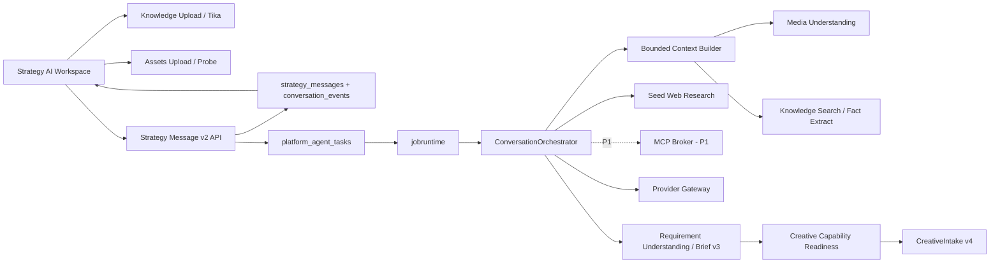

# Strategy 多模态 AI 工作台技术实现方案与反方评审

> 日期：2026-08-04
> 输入：[Strategy AI-native 主流程重构：需求分析与前后端技术调研](../research/strategy-ai-native-workflow-remediation-technical-research-2026-08-04.md)
> 适用仓库：`cookies`
> 方案性质：可拆任务、可灰度、可回滚的实施基线；不授权一次性重写现有 Strategy/Creative/Platform。

## 0. 评审后结论

结论是 **有条件通过，但必须切成两个产品阶段，Eino 和远程 MCP 不得进入 P0 关键路径**。

P0 交付一个真实纵切片：

```text
自然语言 + PDF/DOCX + 图片 + 15—90 秒参考视频
→ 统一多模态 Composer
→ 文档/图片/视频异步理解
→ Requirement Understanding v3
→ viral_remake 快速路径 / brand_video 完整策略路径
→ CreativeIntake v4
→ 进入现有 Creative 工作区
```

P0 同时提供：

- 编辑部式高端工作区布局；
- `深度思考`、`联网搜索` 控制，但只在服务端能力允许时出现；
- 现有 Seed Research 作为联网搜索实现；
- BaselineOrchestrator 作为生产编排；
- Eino Compose Spike 作为旁路对照，不承接默认流量；
- 现有本地 stdio MCP runner 保留，不开放任意远程 MCP Server。

P1 在 P0 指标达标后再做：

- cookies-owned Remote MCP Broker；
- 1—2 个经过审核的只读资料型 MCP Server；
- Eino Compose 灰度；
- Provider Agentic API 与 Eino ChatModelAgent/Tool loop 可行性验证。

明确否决：

- 一次上线 Brief v3、多模态平台、Remote MCP、Eino Agent、多业务改造和全站视觉重构；
- Eino 直连厂商模型、绕过 Provider Gateway；
- 直接把外部 MCP 工具全部暴露给模型；
- 在界面展示或数据库保存原始 chain-of-thought；
- P0 支持任意长度视频、音频、任意文件类型或任意远程 MCP；
- 为每个 token delta 建持久事件；
- 新建与 `platform_agent_tasks` 重复的 ConversationRun 聚合。

## 1. 现有实现基线

本方案不是绿地项目，必须从以下真实代码约束出发。

### 1.1 可直接复用

| 能力 | 当前实现 | 本方案用途 |
| --- | --- | --- |
| 对话与事件 | `strategy_messages`, `strategy_conversation_events` | 保存 v1/v2 消息和可重放业务事件 |
| 长任务 | `platform_agent_tasks`, `platform_agent_dispatches`, `platform_jobs` | Conversation turn、媒体理解和文档抽取的 durable identity/runtime |
| 幂等 | `strategy_write_receipts`, Job idempotency key | 消息发送、snapshot、intake 创建重试 |
| Brief | `strategy_brief_drafts/versions/revisions` JSON | 原表保存 Brief v3，无需新建聚合 |
| 文档 | Knowledge upload、Tika、chunks、research | 文档解析、引用和搜索基线 |
| 图片 | `provider.vision.understand` + immutable `ProjectAssetRef` | 图片语义理解 |
| 视频 | FFmpeg、ASR、抽帧、VLM viral analyzer | 抽取通用短视频理解能力 |
| 模型 | Provider Gateway、route revision、thinking/reasoning constraints | 所有模型调用的唯一出口 |
| Creative | business capabilities、CreativeIntake、现有工作区 | readiness 和快速创作下游 |
| 前端 | React 19、Router、现有 API/SSE client | 渐进拆分，不迁框架 |

### 1.2 当前必须修复

- `strategy_messages` 只能表达单个 text content；
- `SendMessage` 只接收 `{content}`，不能绑定文档和资产版本；
- `useStrategyWorkspace.ts` 与 `KanonStrategyWorkspace.tsx` 同时承担过多资源和写动作；
- 文档上传在 Research 面板，未进入 Conversation 主输入；
- 图片理解和视频理解没有通用 Conversation port；
- 视频分析固定每 3 秒取帧、最多 5 帧，只适合现有爆款短视频；
- MCP 配置字段虽然仍可解码，但 API 进程当前不使用通用 MCP client；
- Provider 的 text/vision 是同步且分离的接口，不是 agentic message/tool event API；
- 全局 CSS 固定 `min-width: 1280px`，Strategy 视觉堆在巨型 `styles.css`。

## 2. 目标、范围和成功标准

### 2.1 P0 必须完成

1. 同一个 Composer 支持文字、10MB 内文档、20MB 内图片和 200MB 内视频上传入口；视频语义理解只承诺 15—90 秒广告素材。
2. 对话消息保存 immutable document/asset ref，不保存临时 URL 或 base64。
3. 文档、图片和视频理解结果进入同一个 Requirement Understanding v3。
4. 用户可核对 candidate fact、冲突、unknown 和 source locator。
5. viral remake 可以绕过完整 Strategy，brand video 保留 full path。
6. `深度思考`、`联网搜索` 是真实执行策略，不是无效按钮。
7. 新 UI 在 768、1024、1440、1920px 下可用，并通过键盘与 reduced-motion 验收。
8. 所有新路径可按 Organization/Project Feature Flag 回退。

### 2.2 P0 明确不做

- 长视频全片理解、直播、音频文件或实时摄像头；
- 多 Agent、自动子任务规划或 DeepAgent；
- 任意用户自助添加远程 MCP；
- 写入型 MCP、消息发送、数据库更新等外部副作用工具；
- 全站导航和全部业务模块视觉重写；
- 删除历史 Task Strategy、Brief v1/v2 或现有 StrategyPackage；
- 让动态 Schema 直接生成整页 UI；
- 让模型决定权限、预算、Provider model ID 或 MCP endpoint。

### 2.3 上线成功标准

| 指标 | P0 Go 门槛 |
| --- | --- |
| `time_to_creative_intake` | viral remake 中位数相对旧路径下降至少 40% |
| 用户必答交互 | viral remake 中位数不超过 3 次 |
| 事实引用准确率 | 文档/图片/视频综合 ≥ 90% |
| Unsupported fact rate | ≤ 2% |
| 附件任务终态率 | ≥ 98%，包括明确的 partial/failed，不允许永久 running |
| 快速路径 Creative 盲评 | 不低于 full Strategy 基线，95% CI 不显示显著劣化 |
| 对话任务 P95 | 纯文本 ≤ 12s；含已就绪附件 ≤ 20s；媒体预处理单独计时 |
| 前端 | 无 1280px 以下横向溢出；关键交互响应 < 100ms |
| 回滚 | 关闭 Flag 后旧消息、旧 Brief、旧 Intake 可正常读取 |

指标阈值是发布门槛，不是对模型厂商的永久 SLA；首批真实数据可以调整绝对延迟，但不能取消相对体验与质量门槛。

## 3. 目标架构



### 3.1 领域所有权

| 对象 | Owner | 说明 |
| --- | --- | --- |
| Conversation Message / Requirement | Strategy | 用户意图、事实、假设、冲突和 unknown |
| Document parse/search | Knowledge | 原文、chunk、locator、parser provenance |
| Asset/version | Assets | 图片/视频的 immutable binary identity |
| Media understanding artifact | Platform Media | 通用 ASR、frame、scene、OCR 和语义事实 |
| Model route/credential/reasoning constraints | Provider | 业务不得提交厂商 model ID |
| MCP connection/tool policy | Platform MCP | 连接、授权、egress、工具目录和审计 |
| Creative Capability/readiness | Creative | 当前业务需要什么、何时可以开始 |
| CreativeIntake/CreativeTask | Creative | 创作输入快照与生产状态 |

Strategy 只能保存引用和业务事实，不复制文档全文、媒体二进制、Provider secret 或 MCP token。

## 4. 关键运行时序

### 4.1 添加附件

```text
用户添加文件
→ 前端按 MIME 选择 Knowledge Upload 或 Assets Upload
→ 上传完成获得 immutable ref
→ 文档自动进入现有 parse job
→ 图片/视频触发 MediaUnderstanding request
→ Composer 附件卡订阅状态
→ 用户可等待，也可先发送消息
```

附件理解不由 Conversation worker 长时间 busy-wait：

- 已就绪：当前 turn 直接消费；
- 处理中：当前 turn 标记 pending evidence，不阻塞纯文本理解；
- 后续完成：写 `attachment.understanding_ready` 事件并触发幂等 `strategy.requirement.refresh.v1` AgentTask；
- 失败：保留原附件和错误状态，允许重试或继续，不回滚整条消息。

### 4.2 发送 Message v2

同一事务内：

1. 校验 Actor、Project、Conversation 和所有 ref；
2. 校验 requested execution policy，不解析为厂商参数；
3. 计算 canonical request hash；
4. 写 user message、plain-text projection、content blocks；
5. 创建 `platform_agent_tasks(kind=strategy.requirement_understand.v3)`；
6. 创建 `platform_agent_dispatches`；
7. 写 `message.created` 与 `turn.accepted` conversation event；
8. 写 idempotency receipt；
9. commit 后返回 `202 Accepted`。

不能先写消息再异步“尽力创建任务”，否则会产生永远没有响应的 user message。

### 4.3 Conversation worker

```text
load task snapshot
→ resolve v1/v2 conversation + current Brief v3
→ resolve ready document/media evidence
→ EffectivePolicyResolver
→ bounded context selection
→ optional decision-bound web research
→ model structured extraction
→ validate source refs and output schema
→ reconcile candidates into Brief v3
→ persist assistant message + Brief revision + stable events
→ mark AgentTask/Job terminal
```

Worker 不直接创建 CreativeIntake；用户点击主 CTA 后才 snapshot + intake，避免模型回复隐式触发外部后果。

### 4.4 SSE 与恢复

继续复用 `/conversations/{id}/events` 与 `strategy_conversation_events.sequence`。

持久事件仅包括：

```text
turn.accepted
turn.started
attachment.status_changed
tool.started
tool.completed
citation.created
understanding.updated
message.completed
turn.failed
turn.cancelled
```

`message.delta` 通过当前连接临时流式发送或按 500ms/1KB 合并，不逐 token 落库。断线后客户端读取 final Message/AgentTask/Understanding；不承诺重放每个 token。

## 5. 契约设计

### 5.1 Conversation Message v2

```json
{
  "contract_version": "strategy-conversation-message-create/v2",
  "content": [
    {"type": "text", "text": "参考附件做一条新品短片"},
    {
      "type": "document_ref",
      "document_id": "doc_01",
      "expected_content_sha256": "aaaaaaaaaaaaaaaaaaaaaaaaaaaaaaaaaaaaaaaaaaaaaaaaaaaaaaaaaaaaaaaa"
    },
    {
      "type": "asset_ref",
      "asset_kind": "image",
      "asset_id": "asset_01",
      "asset_version": 2
    },
    {
      "type": "asset_ref",
      "asset_kind": "video",
      "asset_id": "asset_02",
      "asset_version": 1
    }
  ],
  "requested_policy": {
    "reasoning_mode": "deep",
    "web_search": "allowed",
    "mcp_server_ids": []
  }
}
```

约束：

- content 1—21 blocks，最多 1 个 text、20 个 ref；
- text 最多 12,000 Unicode code points；
- 相同 ref 不得重复；
- 所有 ref 必须属于当前 Organization/Project；
- 前端不能提交 URL、object key、credential、model alias 或 tool schema；
- P0 `mcp_server_ids` 必须为空；P1 只接受 Registry ID；
- message read model 同时返回 `text_projection`，保证旧列表与搜索可以降级显示。

### 5.2 Requested / Effective Policy

```text
RequestedPolicy {
  reasoning_mode: standard | deep
  web_search: off | allowed
  mcp_server_ids: []
}

EffectivePolicy {
  reasoning_profile
  web_tool_allowed
  allowed_tool_names
  max_tool_steps
  max_input_tokens
  max_output_tokens
  timeout_seconds
  disclosure
  resolution_reasons[]
  provider_route_revision
}
```

EffectivePolicyResolver 的输入是 Actor scope、Organization budget、Project policy、任务类型和 Provider route capability。UI 只展示结果摘要；不能用按钮绕过服务端策略。

### 5.3 Brief v3

继续使用现有 `strategy_brief_drafts.document JSON`：

```json
{
  "contract_version": "strategy-brief-version/v3",
  "core": {
    "objective": "新品认知",
    "deliverable_intent": "viral_remake",
    "product_or_subject": "产品 A",
    "audience": "目标用户"
  },
  "facts": [],
  "constraints": [],
  "assumptions": [],
  "unknowns": [],
  "conflicts": [],
  "asset_refs": [],
  "reference_ids": [],
  "extensions": {}
}
```

不增加顶层业务字段。`facts.kind` 使用受限 taxonomy，未知字段进入 `kind=custom` 并保留 label，不让任意 path 穿透下游。

### 5.4 Media Understanding Artifact v1

```json
{
  "contract_version": "platform-media-understanding/v1",
  "asset_ref": {"asset_id": "asset_02", "version": 1},
  "profile": "requirement_understanding",
  "summary": "15 秒护肤产品广告",
  "transcript_segments": [
    {"start_ms": 0, "end_ms": 2400, "text": "...", "confidence": 0.94}
  ],
  "visual_segments": [
    {
      "start_ms": 0,
      "end_ms": 3000,
      "frame_refs": ["frame://asset_02/v1/1200"],
      "observations": ["产品特写"]
    }
  ],
  "facts": [],
  "warnings": [],
  "partial": false,
  "content_hash": "sha256:..."
}
```

P0 Artifact 以 JSON 保存，不为每个 frame/segment 建关系表。只有查询和复用压力证明 JSON 不足时才拆表。

### 5.5 CreativeIntake v4

```json
{
  "contract_version": "creative-intake-create/v4",
  "source": "requirement_snapshot",
  "requirement_snapshot_ref": {
    "brief_id": "brief_01",
    "brief_version": 5,
    "content_hash": "sha256:..."
  },
  "business_capability_ref": {
    "business_code": "viral_remake",
    "version": "v2",
    "content_hash": "sha256:..."
  },
  "selected_route_id": "route_viral_remake_v1"
}
```

Creative 服务自己读取 snapshot 和 capability，计算 readiness 并生成 planning context；不信任 Strategy 展开的映射 JSON。

## 6. 数据库与迁移

### 6.1 P0 Migration A：Message v2

建议文件：

```text
migrations/strategy/20260804160000_strategy_multimodal_messages.up.sql
migrations/strategy/20260804160000_strategy_multimodal_messages.down.sql
```

Additive 变更：

```sql
ALTER TABLE strategy_messages
  ADD COLUMN content_blocks JSON NULL AFTER content,
  ADD COLUMN requested_policy JSON NULL AFTER content_blocks;
```

规则：v1 message 两列为空；v2 message 同时保存 `content` 文本投影和 canonical `content_blocks`。

### 6.2 P0 Migration B：Media Artifact

```text
migrations/platform/20260804161000_media_understanding_artifacts.up.sql
migrations/platform/20260804161000_media_understanding_artifacts.down.sql
```

表：

```text
platform_media_understanding_artifacts
  id
  organization_id / project_id
  asset_id / asset_version
  profile / profile_version
  input_identity_hash
  model_route_revision
  status: running | ready | partial | failed
  agent_task_id
  artifact_json
  content_hash
  error_code / error_message
  created_at / updated_at
```

唯一键：

```text
(organization_id, project_id, input_identity_hash)
```

identity 包含 asset version/hash、profile/version、Prompt/Schema version 和 model route revision。同一 identity 幂等复用；用户重试失败任务可以创建新 AgentTask/SkillRun attempt，但不能覆盖已 ready 的 immutable artifact。模型、Prompt 或 Route 变化会产生新 identity/artifact。

### 6.3 P0 Migration C：CreativeIntake v4 identity

```text
migrations/creative/20260804162000_creative_requirement_intake_v4.up.sql
migrations/creative/20260804162000_creative_requirement_intake_v4.down.sql
```

新增：

- `requirement_brief_id`；
- `requirement_brief_version`；
- `requirement_content_hash`；
- `business_capability_code/version/content_hash`；
- `requirement_input_identity_hash`；
- `source_type=requirement_snapshot` check value；
- requirement input unique index。

历史 source 的 requirement 字段保持 NULL，不回填猜测关系。

### 6.4 P0 不新增

- 不新增 `strategy_conversation_runs`：使用 `platform_agent_tasks`；
- 不新增第二张 conversation event 表：使用现有 sequence replay；
- 不新增 Brief v3 表：现有 JSON draft/version 足够；
- 不新增 fact candidate 表：候选进入 Brief v3，模型原始输出保留在 SkillRun output；
- 不拆 media segment 表：先使用 Artifact JSON；
- 不创建 Eino checkpoint 表：P0 Eino 不承接 durable 状态。

### 6.5 P1 MCP Migration

只有 Remote MCP Go 门槛通过后增加：

```text
platform_mcp_servers
platform_mcp_server_revisions
platform_mcp_tool_policies
platform_mcp_call_audit
```

P0 不提前创建“以后可能用”的 MCP 表。

## 7. 后端实现

### 7.1 Strategy Message v2

新增文件：

```text
internal/systems/strategy/conversation_message_v2.go
internal/systems/strategy/conversation_policy.go
internal/systems/strategy/conversation_orchestrator.go
internal/systems/strategy/requirement_v3.go
internal/systems/strategy/requirement_reconcile.go
```

核心接口：

```go
type ConversationOrchestrator interface {
    RunTurn(context.Context, TurnInput, TurnEventSink) (TurnResult, error)
}

type TurnEventSink interface {
    EmitStable(context.Context, ConversationEvent) error
    EmitTransient(context.Context, TransientTurnEvent) error
}

type RequirementRepository interface {
    GetDraft(context.Context, contract.ActorContext, string) (RequirementDraft, error)
    ApplyPatch(context.Context, ApplyRequirementPatchRequest) (RequirementDraft, error)
}
```

`strategy.Service` 增加依赖：

```text
Orchestrator
MediaUnderstandingReader
CreativeCapabilityReader
EffectivePolicyResolver
```

依赖使用接口，避免 Strategy 直接 import Eino、FFmpeg、MCP client 或 Creative Repository。

### 7.2 AgentTask / jobruntime

新增 Job kind：

```text
strategy.requirement_understand.v3
strategy.requirement_refresh.v1
platform.media_understand.v1
```

复用现有 `agent.Dispatcher` 和 `RuntimeHandlerWithFinalFailure`：

- Message v2 创建 `strategy.requirement_understand.v3`；
- 媒体入口创建 `platform.media_understand.v1`；
- attachment 完成时以 `message_id + artifact_hash` 为 idempotency input 创建 refresh；
- final failure 必须写 assistant-visible error state 和 `turn.failed`；
- cancel 同时更新 AgentTask 和 underlying Job，保持现有 version conflict 语义。

禁止 worker 在内存 goroutine 中“后台继续跑”；所有超过 HTTP 生命周期的工作都必须有 durable Job。

### 7.3 Bounded Context Builder

新增 `internal/systems/strategy/contextbuilder/`，每轮只装配：

1. System/Skill instruction；
2. 当前 Brief v3 stable core + relevant facts；
3. 最近 N 轮对话和 conversation memory；
4. 用户显式引用的附件 artifact；
5. 与当前问题相关的 document chunks；
6. 已授权 web/MCP evidence；
7. Creative Capability readiness summary。

默认上限由服务端配置，超限按以下优先级裁剪：

```text
当前用户消息
> 当前 blocker/冲突
> 用户显式引用证据
> confirmed facts
> 最近对话
> candidate facts
> 历史摘要
```

不能简单将所有 PDF 文本、视频 transcript 和历史消息拼入 Prompt。

### 7.4 Requirement Reconcile

模型输出只能生成 `RequirementCandidatePatch`：

```text
add_candidate_fact
propose_fact_update
add_unknown
add_conflict
resolve_question_suggestion
assistant_reply
```

服务端再执行：

- source ref 属于当前 Project；
- document locator 存在且 hash 匹配；
- media time/frame locator 属于对应 asset version；
- inference 不能写 confirmed；
- 对 confirmed fact 的修改只能生成 conflict/proposal；
- reserved path、Creative production field 和 Provider parameter 拒绝；
- patch canonical hash 与 optimistic version 校验。

用户明确接受、修改、拒绝后，才产生 confirmed/rejected 状态。

### 7.5 Readiness 与快速路径

Creative 提供：

```go
type CapabilityReader interface {
    GetCapabilityVersion(ctx, actor, projectID, code, version string) (...)
    PreviewIntake(ctx, actor, projectID, RequirementSnapshotRef, CapabilityRef) (...)
}
```

Strategy 不再读取自己的 `creativecatalog` 生成新路径问题。旧 catalog 仅保留历史 Task Strategy reader。

主 CTA 流程：

```text
GET understanding
→ GET/POST creative intake preview
→ 用户选择能力/route
→ POST brief:snapshot
→ POST CreativeIntake v4
→ 跳转现有 Creative route
```

snapshot 与 intake 必须串行并使用返回的 content hash，禁止前端根据 draft 自行计算或展开 planning context。

## 8. 通用媒体理解

### 8.1 包边界

```text
internal/platform/mediaunderstanding/
  model.go
  service.go
  repository.go
  mysql_store.go
  job.go
  image_pipeline.go
  video_pipeline.go
  evidence.go
  fake.go
```

`internal/integrations/creativeprovider/viral_analyzer.go` 改为消费 `MediaUnderstandingArtifact`，再生成爆款五维业务结果；不再独占 ASR、抽帧和 VLM transport。

### 8.2 图片 Pipeline

```text
ProjectAssetRef authorization
→ MIME/dimension validation
→ OCR candidate（可选）
→ provider.vision.understand
→ strict structured output
→ evidence validation
→ Artifact ready/partial
```

输出至少区分：

- `visible_text`：OCR/画面可见文字；
- `observation`：可直接观察事实；
- `inference`：模型解释；
- `risk`：可能的合规/权利问题；
- `unknown`：无法判断。

### 8.3 视频 Pipeline

P0 处理 15—90 秒、≤200MB、Assets probe ready 的视频：

```text
ffprobe
→ audio extraction / ASR segments
→ scene detection
→ per-scene representative frames
→ cap total frames by profile budget
→ VLM segment analysis
→ hierarchical summary
→ locator validation
```

约束：

- 无音轨时 visual path 继续，artifact 标 `partial=false` 但含 `no_audio_track` warning；
- ASR 失败而视觉成功时 `partial=true`；
- VLM 失败保留 transcript 与 keyframes；
- frame object 使用 derived asset 或受控 locator，不在业务 JSON 保存本地临时路径；
- 临时 workdir 使用进程隔离目录并在任务结束清理；
- 每个视频最大帧数、分段数、ASR/VLM timeout 和并发由 profile 控制；
- 90 秒以上返回 `unsupported_for_profile`，用户仍可把视频作为生产素材，不假装已理解。

### 8.4 Cache / 重试

Artifact identity：

```text
asset version hash
+ understanding profile/version
+ model route revision
+ prompt/schema version
```

只有 identity 完全匹配才复用。模型或 Prompt 升级不会静默覆盖旧 artifact；可以创建新 profile version 并保留旧引用。

## 9. Eino 接入方案

### 9.1 裁决

Eino 不进入 P0 关键路径，先做可删除的 Spike。

原因：

- 当前 Provider 只有 text/vision 同步 DTO，没有稳定的 tool-call event contract；
- Eino ChatModelAgent 要发挥价值，需要模型输出结构化 ToolCall；
- 直接使用 eino-ext 厂商 Adapter 会绕过现有 Provider Gateway、凭据、route snapshot 和预算；
- Eino AgenticModel 当前仍是 Beta；
- durable Job、幂等、SSE replay 和领域 command 仍必须由 cookies 负责。

### 9.2 Spike A：Compose

预计 5—8 人日：

```text
internal/platform/agent/einoadapter/
  text_model.go
  compose_orchestrator.go
  callbacks.go
  event_mapper.go
```

只验证：

- 使用 cookies Provider Text service 作为模型节点；
- 用 Compose 表达 context → extract → validate → reconcile；
- stream/callback 映射到 TurnEventSink/TraceSpan；
- 与 BaselineOrchestrator 跑同一 fixture/eval；
- Feature Flag 关闭即可完全不构造 Eino runtime。

### 9.3 Spike B：Agentic/Tool loop

只有 Spike A 通过后评估，预计另需 8—12 人日：

1. Provider 新增 cookies-owned `AgenticRequest/Event`；
2. Gateway Adapter 支持 tool definition、tool call/result、reasoning summary；
3. Eino adapter 只映射 cookies DTO；
4. ToolBroker 强制 allowlist、step/cost/timeout；
5. AgenticModel Beta 类型隔离在 adapter 内。

Spike B 不是 Remote MCP Broker 的替代品。

### 9.4 Eino Go / No-Go

Go：

- 事实准确率不低于 baseline；
- P95 延迟不增加超过 15%；
- token/cost 不增加超过 15%，或有可证明的质量收益；
- 故障、取消、超时和 trace 能映射到现有 runtime；
- 代码复杂度减少，至少删除一组手写编排分支；
- 升级 Eino 不要求修改 OpenAPI/DB contract。

No-Go：

- 必须绕过 Provider Gateway；
- 需要 Eino 自建第二套 checkpoint/消息存储；
- Beta 类型渗透领域模型；
- 没有质量收益却增加依赖、延迟和调试面；
- fallback 路径无法与 Eino 路径共享 fixture。

## 10. MCP 与联网搜索

### 10.1 P0

联网搜索按钮调用现有 Knowledge Research / Seed runner：

- 只从具体 unknown、conflict 或用户问题触发；
- 默认外发 query，不外发内部文档内容；
- 若需要发送内部摘要，先展示 disclosure 并由用户确认；
- 结果进入 ResearchArtifact/EvidenceCandidate；
- 不直接更新 Brief confirmed fact。

现有 `MCPStdioRunner` 只作为受控本地实验能力，不在普通 UI 暴露 server 配置。

### 10.2 P1 Remote MCP Broker

接口：

```go
type Broker interface {
    ListAllowedTools(context.Context, ToolSelectionContext) ([]ToolDescriptor, error)
    Call(context.Context, ToolCallRequest) (NormalizedToolResult, error)
}
```

Broker 必须拥有：

- Organization-scoped Server Registry；
- immutable connection/catalog revision；
- Streamable HTTP 和受控 stdio transport；
- OAuth 2.1 credential reference，禁止 token passthrough；
- DNS/IP/redirect/port egress allowlist；
- tool namespace、schema hash 和风险分级；
- input/output size、timeout、rate/concurrency limit；
- call audit、disclosure 和 citation normalizer；
- schema 变化时冻结旧 revision、阻止静默执行新定义。

P1 只允许 `read_only_research`。即使工具声称只读，也按远程不可信输入处理其描述、schema、结果和 Resource Link。

### 10.3 工具选择

禁止把全部工具定义放进每轮 Prompt。Tool selection 顺序：

```text
用户选择的资料源
∩ Organization allowlist
∩ 当前 Project scope
∩ ResearchQuestion 类别
∩ 当前风险/披露策略
→ 最多 5 个工具
```

超过 5 个时先做 deterministic catalog filtering；不让模型在数百工具中盲选。

## 11. 前端实现

### 11.1 文件结构

```text
src/features/strategy/
  workspace/
    StrategyAIWorkspacePage.tsx
    StrategyFocusShell.tsx
    useWorkspaceResources.ts
  conversation/
    MultimodalConversation.tsx
    ConversationMessage.tsx
    ConversationComposer.tsx
    AttachmentTray.tsx
    ExecutionModeBar.tsx
    ToolActivity.tsx
    useConversationMessages.ts
    useConversationEvents.ts
  understanding/
    UnderstandingLens.tsx
    FactList.tsx
    ConflictResolver.tsx
    QuestionTray.tsx
    SourceInspector.tsx
    useRequirementUnderstanding.ts
  media/
    DocumentAttachment.tsx
    ImageAttachment.tsx
    VideoAttachment.tsx
    VideoFilmstrip.tsx
    useAttachmentUpload.ts
    useMediaUnderstanding.ts
  planning/
    CreativeRouteChooser.tsx
    ReadinessPanel.tsx
    useIntakePreview.ts
  styles/
    strategy-tokens.css
    strategy-shell.css
    strategy-conversation.css
    strategy-attachments.css
    strategy-motion.css
```

旧 `KanonStrategyWorkspace.tsx` 在 Flag 关闭时继续使用。不要在一个 PR 中边拆旧组件边删除旧流程。

### 11.2 页面布局

桌面：

```text
56—64px navigation rail
+ 7—8 column conversation stage
+ 360—420px Understanding Lens
+ bottom/sticky double-bezel Composer
```

平板：Understanding Lens 改右侧 drawer；移动：单列、附件横向 filmstrip、底部 Composer。

视觉规则：

- warm mineral canvas、paper surface、graphite ink、单一低饱和金棕 accent；
- AI 回复使用编辑稿式段落、引用和媒体，不用左右大气泡；
- 用户消息使用轻量批注块；
- 一屏一个主 CTA；
- 技术 hash、model、tool payload 收到 activity/details；
- Composer、context island 和 overlay 才允许 backdrop blur；
- 动效只用 opacity/transform，并支持 reduced motion；
- 先保留 MiSans，新增字体必须通过授权、自托管和性能评审；
- Strategy 新组件不继续无差别添加 Lucide 图标；先用少量统一轻线性符号，是否新增图标依赖单独评审。

### 11.3 状态模型

前端不构造一个新的巨型 reducer：

```text
messages         server resource
understanding    server resource
attachments      upload + processing resources
turn activity    SSE ephemeral/stable projection
intake preview   server resource
local composer   local draft only
```

SSE reducer 按 `sequence/event_id` 幂等；收到 terminal/understanding.updated 后只 reload 对应 resource，不 reload 整个 workspace。

### 11.4 Composer 行为

- 添加附件立即上传和预处理，不等待点击发送；
- 发送时绑定成功 ref；上传失败的附件不得混入消息；
- 正在分析的附件允许发送，但明确显示“稍后补充理解”；
- 深度思考只在 Provider route 支持且预算允许时可选；
- 联网搜索默认关闭，并说明可能延长时间；
- P0 不显示 MCP 资料源按钮，除非组织确实配置了 allowlisted source；
- 发送后保留附件卡和进度，输入框清空；失败重试复用原 idempotency identity。

## 12. HTTP / OpenAPI

### 12.1 Strategy

```text
POST /api/strategy/v1/conversations/{conversation_id}/messages:v2
GET  /api/strategy/v1/workspaces/{workspace_id}/understanding
PATCH /api/strategy/v1/tasks/{task_id}/brief-draft
POST /api/strategy/v1/tasks/{task_id}/brief:snapshot
GET  /api/strategy/v1/conversations/{conversation_id}/events
POST /api/strategy/v1/agent-tasks/{agent_task_id}:cancel
```

保留原 `POST .../messages`。不要用 Content-Type 猜 v1/v2；使用独立 action path 或显式 contract version。

### 12.2 Platform Media / Knowledge

```text
POST /platform/v1/projects/{project_id}/media-understandings
GET  /platform/v1/projects/{project_id}/media-understandings/{id}
POST /platform/v1/projects/{project_id}/media-understandings/{id}:retry
POST /platform/v1/projects/{project_id}/media-understandings/{id}:cancel
GET  /platform/v1/projects/{project_id}/knowledge/documents/{id}/structure
POST /platform/v1/projects/{project_id}/knowledge/documents/{id}:extract-facts
```

### 12.3 Creative

```text
GET  /api/creative/v1/projects/{project_id}/business-capabilities
POST /api/creative/v1/projects/{project_id}/intake-previews
POST /api/creative/v1/projects/{project_id}/creative-intakes
```

新增 JSON Schema/fixture：

```text
api/contracts/strategy-conversation-message-create-v2.schema.json
api/contracts/strategy-brief-version-v3.schema.json
api/contracts/platform-media-understanding-v1.schema.json
api/contracts/creative-intake-create-v4.schema.json
api/contracts/creative-intake-v4.schema.json
api/events/strategy-conversation-event-v2.schema.json
api/fixtures/* 对应 ready/partial/blocked/mismatch 样例
```

## 13. Feature Flag 与配置

新增 Strategy 配置：

```text
COOKIES_STRATEGY_MULTIMODAL_CONVERSATION_ENABLED
COOKIES_STRATEGY_REQUIREMENT_V3_ENABLED
COOKIES_STRATEGY_QUICK_INTAKE_ENABLED
COOKIES_STRATEGY_DEEP_REASONING_ENABLED
COOKIES_STRATEGY_WEB_SEARCH_ENABLED
COOKIES_AGENT_EINO_SPIKE_ENABLED
```

新增 Media 配置：

```text
COOKIES_MEDIA_UNDERSTANDING_ENABLED
COOKIES_MEDIA_MAX_VIDEO_SECONDS=90
COOKIES_MEDIA_MAX_KEYFRAMES
COOKIES_MEDIA_MAX_CONCURRENT
COOKIES_MEDIA_ASR_TIMEOUT_SECONDS
COOKIES_MEDIA_VISION_TIMEOUT_SECONDS
```

P1 才增加 MCP remote config。Feature Flag 还需叠加 Organization allowlist，不能只靠全局 env 开关。

## 14. 实施批次与工作量

工作量为工程预估，不包含模型供应商开通、生产安全审批和真实客户数据等待时间。

### Batch 0：基线与评测集（2—3 人日）

- 埋点旧路径的时间、交互数、失败点和中断率；
- 固化 viral remake 与 brand video 的真实任务集；
- 保存旧路径 E2E、截图和 Creative 结果盲评基线；
- 建立 Attachment/Requirement eval fixture 格式；
- 不修改默认用户路径。

完成条件：后续所有“更快、更好”都有可比较基线。

### Batch 1：契约、Migration 与兼容 Reader（4—6 人日）

- Message v2、Brief v3、Media Artifact v1、Intake v4 Schema/fixture；
- Strategy message additive migration；
- Media Artifact migration；
- CreativeIntake v4 migration；
- v1/v2/v3 reader compatibility tests；
- OpenAPI 和 TypeScript types。

完成条件：不启用 Flag 时全部旧测试保持通过；新 fixture 能跨 Go/TS 校验。

### Batch 2：Text-only Message v2 + Requirement v3（5—7 人日）

- `SendMessageV2` 事务与幂等；
- `strategy.requirement_understand.v3` AgentTask；
- BaselineOrchestrator；
- EffectivePolicyResolver 的 standard/deep 基线；
- Requirement reconcile 与 source validation；
- 新 SSE 稳定事件；
- 旧 text message 与新 text block 共存。

完成条件：纯文本新路径可刷新恢复、取消、重试，并能关闭 Flag 回旧路径。

### Batch 3：文档与图片（5—8 人日）

- Composer 文档/图片上传适配；
- Tika parse ready/pending/failed 与 refresh task；
- image understanding pipeline；
- source inspector 和 fact correction；
- 不向模型发送整篇文档；
- 文档/图片 eval。

完成条件：PDF/图片事实能定位来源，失败不阻塞纯文本对话。

### Batch 4：短视频理解（6—9 人日）

- 提取通用 media package；
- probe、ASR segment、scene/keyframe、VLM、partial result；
- Artifact cache 与任务恢复；
- 现有 viral analyzer 回归；
- VideoFilmstrip 与 time locator；
- 15/30/60/90 秒 fixture。

完成条件：不破坏现有爆款分析，长视频明确拒绝语义理解而非静默截断。

### Batch 5：Capability readiness + CreativeIntake v4（4—6 人日）

- Creative Capability 增加 strategy mode/readiness；
- `intake-previews`；
- Brief snapshot；
- requirement snapshot resolver；
- viral remake quick path；
- brand video full path 对照；
- 跨系统 hash/route/capability mismatch tests。

完成条件：无需 Task Strategy 即可进入 viral remake，旧 package/overlay intake 不受影响。

### Batch 6：高端工作区 UI（7—10 人日，可与 2—5 部分并行）

- Focus shell、conversation stage、Understanding Lens、Composer；
- 附件卡、工具 activity、状态与空/错/partial 体验；
- scoped visual tokens/CSS 拆分；
- 768/1024/1440/1920 响应式；
- keyboard/reduced-motion/screen reader；
- Playwright screenshot regression。

完成条件：视觉评审不能替代功能验收，两类验收均通过才可开 Flag。

### Batch 7：Decision-bound Web Search（3—4 人日）

- 联网搜索 mode；
- ResearchQuestion/decision link；
- Seed runner 调用与 disclosure；
- citation/adoption UI；
- 搜索关闭、超时、无结果和失败路径。

完成条件：搜索结果不会自动升级为 confirmed fact。

### Batch 8：Eino Compose Spike（5—8 人日，非关键路径）

- Provider text adapter；
- Compose orchestrator；
- callback/event mapping；
- baseline/eino A/B fixture；
- Spike report 与 Go/No-Go。

### P1：Remote MCP Broker（10—15 人日）

- 安全设计评审后单独排期；
- Registry、OAuth、Streamable HTTP、ToolPolicy、egress、audit；
- 只接 1—2 个 read-only server；
- 不能并入 P0 “顺手做完”。

### 14.1 日历预估

- 单工程师串行完成 P0：约 8—11 周；
- 2 后端 + 1 前端 + 兼职设计/QA：约 4—6 周；
- Eino Spike 可由第二后端并行；
- Remote MCP 是独立 P1，不计入 P0 日期。

## 15. 测试与 CI

### 15.1 Go 单元测试

- Message v2 block/policy validation；
- cross-organization/project ref rejection；
- SendMessageV2 transaction rollback 和 receipt replay；
- Requirement candidate/conflict/unknown/confirmation；
- source locator/hash validation；
- EffectivePolicy budget/scope/provider capability matrix；
- Context Builder priority/truncation/prompt injection isolation；
- media ready/partial/failed/cancel/retry/cache；
- video no-audio、ASR failure、VLM failure、>90 秒；
- intake snapshot/capability/route hash；
- Eino adapter 与 baseline fake tests。

### 15.2 MySQL 集成测试

- empty database migration；
- v1/v2 message 与 v2 block message 混合读取；
- AgentTask/Job/dispatch/message 原子创建；
- conversation event sequence/replay；
- media artifact unique identity 与 concurrent retry；
- Brief v3 optimistic concurrency/revision hash；
- requirement intake idempotency 和 stale snapshot；
- rollback migration 只在本地/测试执行，生产使用 forward fix policy。

建议新增 CI gate：

```text
TestStrategyMultimodalConversationMySQLVerticalSlice
TestMediaUnderstandingArtifactMySQLLifecycle
TestCreativeRequirementIntakeV4MySQLIdentity
```

### 15.3 TypeScript / React

- content block parser 与 legacy message adapter；
- attachment upload state machine；
- SSE event reducer idempotency；
- composer mode availability；
- pending attachment send；
- partial result/error/retry；
- understanding candidate actions；
- intake preview/CTA；
- Project 切换取消旧 request；
- 20 附件、长文件名、长中文内容布局。

### 15.4 E2E

至少覆盖：

```text
纯文本 → Requirement v3 → viral quick intake
PDF + 文本 → fact correction → brand full strategy
图片 + 文本 → visual fact → viral quick intake
视频 + 文本 → ASR/keyframe → viral quick intake
视频 ASR 失败 → partial result → 可继续
联网搜索 → citation → 用户采纳/拒绝
刷新/SSE 断开 → 恢复 final state
Flag 关闭 → 旧 Strategy workspace
```

### 15.5 本地与 CI 命令

每个后端批次至少：

```text
gofmt -w changed.go
go vet ./...
go test -race ./...
go build ./cmd/cookies-api
go build ./cmd/cookies-migrate
```

前端批次至少：

```text
npm test
npm run check:server
npm run test:server
npm run build
npm run contract:check
npm run test:e2e:platform
```

提交前执行 `git diff --check`。推送后必须等待所有 required GitHub Actions checks 通过。

## 16. 观测、成本与隐私

### 16.1 Trace

沿用 AgentTask/SkillRun/Trace 语义，至少记录：

```text
conversation_turn_id / message_id / agent_task_id
orchestrator: baseline | eino
requested/effective policy
provider route revision
attachment refs and artifact hashes
context source counts, not raw secret content
tool name/server revision
input/output tokens
latency/cost
result status/error category
```

日志禁止记录文档全文、base64、signed URL、OAuth token、MCP secret 或原始 chain-of-thought。

### 16.2 产品指标

- `time_to_first_understanding`；
- `time_to_creative_intake`；
- 用户问题/确认/修改/拒绝数量；
- attachment parse/understand success/partial/failure；
- candidate accept/edit/reject rate；
- quick/full strategy mode selection；
- web/MCP tool calls per turn；
- manual regeneration and downstream edit distance；
- Creative blind rating/outcome。

### 16.3 成本保护

- 每 turn token/tool/time budget；
- 每 Project/Organization 并发和日预算；
- 媒体 Artifact cache；
- deep mode 不自动继承到下一轮；
- web/MCP 默认关闭；
- 视频关键帧/分段上限；
- 预算拒绝返回可理解的降级原因，不静默切换高价模型。

## 17. 安全边界

1. 所有文档/资产 ref 在服务端重新鉴权；
2. 模型看到的是 bounded content，不是 object storage credential；
3. 文档、网页和 MCP 结果全部视为不可信数据，Prompt instruction 不可提升为 system/tool command；
4. external research 默认只外发 query；
5. 用户显式确认内部摘要外发时保存 disclosure snapshot；
6. source URL canonicalize、scheme/domain/redirect 检查；
7. P1 MCP 禁止 token passthrough 和内部网访问；
8. Tool result 通过 size/MIME/schema/citation normalizer；
9. write/external side effect tool P1 仍不开放；
10. Brief confirmed fact、CreativeIntake 和发布动作继续走用户/Policy checkpoint。

## 18. 反方评审

### 18.1 最强反方结论

原始方案本质上把四个项目包装成一次优化：

1. Strategy 产品流程重构；
2. 文档/图片/视频理解平台；
3. Agent/Eino 编排平台；
4. Remote MCP 连接平台。

如果全部同时做，最大概率不是“AI-native 高级工作台”，而是旧流程尚未改善，新平台又增加大量中间态、配置、失败面和维护责任。因此反方只接受经过裁剪的 P0。

### 18.2 反对：用户可能根本不需要 Conversation

观点：很多人已经有内部 PDF，只想上传并开始创作。强制对话仍然是另一种流程负担。

裁决：成立。

强制修正：

- Conversation 是统一输入壳，不要求用户多轮聊天；
- “上传后直接理解并开始”是合法路径；
- 关键缺口为零时不主动提问；
- 量化对话轮数，不能把更多交互误判为更智能。

### 18.3 反对：Brief v3 动态事实会让下游更混乱

观点：固定字段难用，但完全动态事实会把复杂性转移给每个下游 projector。

裁决：成立一半。

强制修正：

- 保留稳定 core；
- facts.kind 使用受限 taxonomy；
- custom fact 不直接进入 Creative；
- 每个 capability 使用 versioned projector/readiness；
- 不允许任意 JSON path 穿透。

### 18.4 反对：多模态理解成本高、准确性不足

观点：图片/视频理解容易产生有吸引力但错误的描述，长视频会带来显著 ASR/VLM 成本。

裁决：成立。

强制修正：

- P0 视频限制 15—90 秒；
- observation/inference/OCR 分层；
- 所有关键事实需 locator；
- partial result 一等公民；
- 未达事实准确率门槛时只展示媒体摘要，不自动更新 Requirement。

### 18.5 反对：Eino 是重复基础设施

观点：项目已有 Provider、AgentTask、Job、SSE、ToolRegistry；引入 Eino 可能只增加抽象层。

裁决：当前成立。

强制修正：

- Eino 不在 P0 关键路径；
- 只做 Compose Spike；
- 不采用第二套 Provider、checkpoint、memory 或 tracing；
- 只有减少代码且不劣化质量/性能时才灰度。

### 18.6 反对：Remote MCP 是不必要的供应链风险

观点：资料搜索已有 Seed runner；Remote MCP 引入 OAuth、SSRF、工具投毒、schema drift 和数据外泄风险，产品收益未证实。

裁决：成立。

强制修正：

- P0 不做 Remote MCP；
- P1 单独安全评审；
- 只接 1—2 个 allowlisted read-only server；
- 先证明比现有 Research API 多了不可替代的资料价值。

### 18.7 反对：深度思考和联网搜索会变成昂贵的心理安慰

观点：按钮可能只改变文案或延迟，用户无法判断是否真正提升结果。

裁决：成立。

强制修正：

- route 不支持时不显示；
- deep 每轮重置，不默认常开；
- 显示 effective mode、预计等待和是否实际搜索；
- 分别统计质量、延迟和成本；
- 无显著收益时移除 deep 按钮，保留服务端自动策略。

### 18.8 反对：高端视觉会牺牲效率和信息密度

观点：大留白、浮动岛、动效和 serif 可能适合展示页，不适合高频工作台。

裁决：风险真实。

强制修正：

- “高级感”服从任务完成速度；
- 主消息列保持 720—800px 可读宽度；
- Understanding Lens 可折叠；
- 动效、blur、字体都有性能和无障碍门禁；
- 真实长内容与 20 附件压测，不用空白 mock 截图验收；
- 不在 P0 做全站视觉统一。

### 18.9 反对：新旧流程长期双轨会失控

观点：保留旧路径和新 Flag 容易形成永久两套业务逻辑。

裁决：成立。

强制修正：

- 每个 Flag 写 owner、开启条件、删除日期；
- 新旧共用 Requirement aggregate、AgentTask 和 CreativeIntake service；
- 旧 UI 只读历史，默认入口迁移后停止新建 Task Strategy；
- P0 稳定两周后必须提交 legacy write removal 计划。

### 18.10 反对：持久化所有流式事件会拖垮 MySQL

观点：按 token 写 conversation event 会放大写入、索引和 SSE replay 成本。

裁决：完全成立。

强制修正：只持久化稳定业务事件；delta 临时发送或合并。断线恢复 final resource，不重放逐 token 动画。

### 18.11 反对：快速路径可能降低创意质量或绕过治理

观点：减少 Strategy 步骤可能把问题推给 Creative，甚至绕过品牌/合规要求。

裁决：不能靠架构争论解决。

强制修正：

- 只对 viral remake 灰度 bypass；
- brand video 默认 full；
- Capability/Project Policy 可强制 full/approval；
- quick vs full 用同输入盲评；
- 质量显著劣化立即关闭 quick intake Flag。

### 18.12 反对：质量评测可能自我证明

观点：模型抽取、模型生成、模型 grader 形成闭环，容易证明自己“有提升”。

裁决：成立。

强制修正：

- 事实评测使用人工标注 source span；
- Creative 比较双盲、随机化顺序；
- 至少一部分由实际创作者评分；
- LLM grader 只做辅助，先与人工标注校准；
- 上线后关注人工大改、重生成和真实业务结果。

### 18.13 反对：前端统一入口掩盖了两个上传域

观点：Knowledge 和 Assets 生命周期、权限、大小和失败语义不同，强行统一会在前端制造复杂状态。

裁决：技术上成立，产品上仍应统一。

强制修正：UI 统一 Composer，但 adapter 明确分流；不在后端创建“万能文件”聚合。每种附件保留自己的状态与错误码。

### 18.14 反对：总工作量超出一次迭代

观点：即使不做 MCP，P0 仍有 30+ 人日，不适合作为一个大 PR 或一周冲刺。

裁决：完全成立。

强制修正：严格按 Batch 合并，每批可独立部署、Flag off、测试全绿；禁止创建长期巨型分支。

## 19. 反方评审后的强制收口

最终方案相对初稿做出以下收缩：

1. Remote MCP 从 P0 移到 P1；
2. Eino 从生产依赖降为 Compose Spike；
3. AgenticModel/Tool loop 延后到 Provider 有 cookies-owned Agentic API 后；
4. 删除 ConversationRun 新表，复用 AgentTask；
5. 删除第二套 event 表，复用 conversation events；
6. token delta 不持久化；
7. media segments P0 保存 JSON，不提前拆多表；
8. 视频限制为 15—90 秒；
9. P0 只改 Strategy 工作区视觉，不做全站重设计；
10. deep/search 按模型能力与真实收益决定是否继续保留；
11. quick path 只灰度 viral remake，brand video 继续 full；
12. 每个 Batch 独立 PR、独立 Flag、独立回滚。

## 20. Go / No-Go 门槛

### 20.1 开工 Go

- Product 接受 P0/P1 切分；
- viral remake/brand video 测试集和基线存在；
- Creative 同意 Capability/readiness 为唯一业务问题 source；
- Provider route 能明确报告 deep/vision 支持；
- Assets/Knowledge 上传限制和错误语义已确认；
- 设计稿覆盖真实长内容和所有状态，而非只有 happy path。

### 20.2 P0 上线 Go

- 所有 required CI checks 通过；
- migration empty DB 与升级场景通过；
- v1/v2/v3/Intake v1—v4 compatibility tests 通过；
- 安全/权限/跨 Project 测试通过；
- 事实与路径指标达到第 2.3 节门槛；
- Flag off 回归通过；
- 产品、Creative、设计和工程共同签字。

### 20.3 No-Go

- 文档/媒体事实无可靠 locator；
- quick path 质量显著低于 full；
- Message v2 无法与 AgentTask 原子创建；
- Eino 必须绕过 Provider 才能工作；
- Remote MCP 没有 OAuth/egress/tool policy；
- 新 UI 在 1024px 或键盘操作下不可用；
- 旧契约或历史任务被原地修改；
- CI 有失败或 pending required check。

## 21. 文件级实施清单

### 21.1 新增

```text
docs/plans/2026-08-04-strategy-multimodal-ai-workspace-implementation-and-adversarial-review.md

api/contracts/strategy-conversation-message-create-v2.schema.json
api/contracts/strategy-brief-version-v3.schema.json
api/contracts/platform-media-understanding-v1.schema.json
api/contracts/creative-intake-create-v4.schema.json
api/contracts/creative-intake-v4.schema.json
api/events/strategy-conversation-event-v2.schema.json
api/fixtures/...v3/v4/media/message fixtures

migrations/strategy/20260804160000_strategy_multimodal_messages.*.sql
migrations/platform/20260804161000_media_understanding_artifacts.*.sql
migrations/creative/20260804162000_creative_requirement_intake_v4.*.sql

internal/systems/strategy/conversation_message_v2.go
internal/systems/strategy/conversation_policy.go
internal/systems/strategy/conversation_orchestrator.go
internal/systems/strategy/requirement_v3.go
internal/systems/strategy/requirement_reconcile.go
internal/systems/strategy/contextbuilder/*
internal/platform/mediaunderstanding/*
internal/platform/agent/einoadapter/*              # Spike only

src/features/strategy/workspace/*
src/features/strategy/conversation/*
src/features/strategy/understanding/*
src/features/strategy/media/*
src/features/strategy/planning/*
src/features/strategy/styles/*
```

### 21.2 修改

```text
cmd/cookies-api/main.go
internal/platform/config/config.go
internal/systems/strategy/model.go
internal/systems/strategy/service.go
internal/systems/strategy/mysql_store.go
internal/systems/strategy/strategy_flow.go
internal/systems/strategy/httpapi/server.go
internal/platform/knowledge/service.go
internal/platform/provider/sync.go               # 仅必要的 policy/capability seam
internal/integrations/creativeprovider/viral_analyzer.go
internal/systems/creative/model.go
internal/systems/creative/service.go
internal/platform/httpserver/server.go
internal/platform/httpserver/creative_handlers.go
api/openapi/strategy-v1.yaml
api/openapi/platform-v1.yaml
api/openapi/creative-v1.yaml
src/features/strategy/api.ts
src/features/strategy/types.ts
src/features/strategy/useStrategyWorkspace.ts
src/features/strategy/KanonStrategyWorkspace.tsx
src/styles.css
test/strategy-creative-contracts.test.ts
.github/workflows/platform-ci.yml
```

## 22. Definition of Done

一个 Batch 只有同时满足以下条件才算完成：

- 契约、fixture、Go 类型、TypeScript 类型一致；
- additive migration 和 MySQL 集成测试通过；
- 幂等、并发、取消、失败和恢复语义完整；
- 权限、Project 隔离和敏感数据日志检查通过；
- Feature Flag off 不改变旧行为；
- UI 有 loading/empty/partial/error/retry 状态；
- 真实长内容和多附件完成视觉/键盘验收；
- eval 与产品指标能区分 baseline/eino、quick/full；
- `git diff --check`、Go/Node/build/contract/E2E 检查通过；
- 推送后 required GitHub Actions 全部成功；
- 方案中声明的临时 Flag 和旧入口有 owner 与删除计划。

最终目标不是交付更多 Agent、MCP、Schema 或视觉组件，而是证明用户能用更少输入、更少中间步骤和更可靠的来源，进入不劣于旧路径的 Creative 结果。任何不能通过指标证明价值的新层，都不应因为已经开发而成为默认流程。
