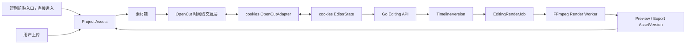

# 素材剪辑模块 OpenCut 复用开发技术方案

| 项目 | 内容 |
| --- | --- |
| 日期 | 2026-08-07 |
| 状态 | 待评审实施基线 |
| 上位规格 | [cookies 视频素材剪辑与开源框架方案](../21-video-material-editor-spec.md) |
| 实施调研 | [OpenCut 复用实施调研](../research/opencut-reuse-implementation-research-2026-08-07.md) |
| 首发流程 | 短剧前贴 V2 → 素材剪辑；同时支持直接进入素材剪辑 |
| 首发输出 | MP4 / H.264 / AAC / 720×1280 / 9:16 / 30fps / 48kHz |
| 核心变更 | OpenCut 从“仅参考”调整为“固定版本、局部复用、cookies 适配” |

## 1. 文档目的与结论

本文是 `21-video-material-editor-spec.md` 的实施技术方案，不替代产品规格。目标是纠正当前“静态轨道外观已经存在，但缺少真实剪辑交互”的偏差，并给出可以逐阶段验收的开发路径。

最终技术结论如下：

1. 不再继续扩展当前用彩色条模拟轨道的实现。
2. 固定 OpenCut 可审计提交，复用时间线 UI、播放头、拖放、移动、裁切、分割、吸附、缩放和撤销/重做等真实交互代码。
3. 不把 OpenCut 整个应用嵌入 cookies，不采用其项目、用户、存储和导出模型作为业务事实源。
4. 新建 `OpenCutAdapter`，在 OpenCut 前端状态和 cookies `EditingTimeline` 之间双向转换。
5. cookies 的 `AssetVersionRef`、Project Scope、`EditTask`、`TimelineVersion`、`EditingRenderJob` 和 FFmpeg Render Worker 继续保持权威地位。
6. 第一阶段先交付真正可用的单主视频轨剪辑闭环；后续再扩展字幕、音频和叠加轨，最终完成上位规格第 7 节七项验收。

## 2. 已确认的产品范围

### 2.1 产品定位

素材剪辑是 Project 级通用视频工具，不是“前贴 + 原视频”的专用拼接页。用户可以：

- 直接进入素材剪辑，选择项目视频或上传视频后创建 EditTask；
- 从短剧前贴 V2 生成完成页进入，自动携带已入库的前贴 `AssetVersionRef`；
- 任意排列、裁切、分割和删除素材，不强制前贴必须放在第一个；
- 将剪辑结果保存为版本、生成低清预览并正式导出；
- 后续使用字幕、配音、音乐、音效和叠加轨完成更完整的包装。

首期只有短剧前贴 V2 增加自动跳转入口。其他视频生成模块产生的已入库视频仍可在素材剪辑中手动选择。

### 2.2 首发输出边界

第一版仅开放：

```text
容器：MP4
视频：H.264
音频：AAC
画布：720 × 1280，9:16
帧率：30fps
采样率：48kHz
```

16:9、1:1、1080×1920、转场、变速、滤镜、关键帧和 AI 自动剪辑不进入第一阶段。

## 3. 当前实现盘点

### 3.1 已完成且应保留

| 能力 | 当前证据 | 处理方式 |
| --- | --- | --- |
| 项目视频素材读取 | `src/components/SpecializedPages.tsx` | 保留 API，替换素材箱交互 |
| EditTask 创建与读取 | `src/features/video-editing/api.ts`、Creative API | 保留 |
| TimelineVersion 乐观并发保存 | `saveTimeline(expectedVersion, timeline)` | 保留并接入自动保存 |
| 短剧前贴 V2 打开编辑器 | `openShortDramaV2` | 保留，补全页面入口与初始化行为 |
| 固定输出契约 | `editing-timeline/v1` | 第一阶段继续使用 |
| 时间线编译 | `CompileEditingTimelineV1` | 保留 |
| RenderJob 排队、进度、取消、重试 | `internal/systems/creative/editing_render.go` | 保留 |
| 成片回流素材库 | `IngestRenderedVideo` | 保留 |
| FFmpeg 确定性导出 | `media.TimelineRenderRequest` | 保留为权威输出 |

### 3.2 当前前端真实能力

当前前端只会把所选素材按选择顺序生成一条连续 `primary_video` 轨道。它可以保存、预览和导出，但没有实现：

- 在时间线上选中 Clip；
- 拖动改变顺序或位置；
- 左右裁切；
- 在播放头处分割；
- 删除片段；
- 时间线缩放、吸附；
- 撤销与重做；
- 字幕、配音、音乐、音效和叠加轨的可视化编辑。

现有“叠加、字幕、配音、音乐”彩色条只是占位内容，第一阶段必须删除或明确标记为未开放，不能继续表现为可操作控件。

### 3.3 契约限制

当前 `editing-timeline/v1` 有以下强约束：

- 只有一条 `primary_video` 轨道；
- 主视频 Clip 必须从 0 开始连续闭合至 `duration_ms`；
- 轨道角色唯一；
- 暂无画面变换、层级、字幕样式、音频淡入淡出等字段。

因此：

- 第一阶段的单主视频轨剪辑可以继续使用 v1；
- 第二阶段多视频叠加和完整包装必须新增 `editing-timeline/v2`，不能破坏性修改已落库的 v1 快照。

## 4. OpenCut 采用策略

### 4.1 官方事实

- [OpenCut 官方仓库](https://github.com/OpenCut-app/OpenCut)采用 [MIT License](https://github.com/OpenCut-app/OpenCut/blob/main/LICENSE)，允许复制、修改和商业使用，但复制或实质性使用代码时必须保留版权与许可文本。
- OpenCut 官方说明主仓库处于架构重写和持续演进状态，并指向 Classic 作为既有实现；[OpenCut Classic](https://github.com/OpenCut-app/opencut-classic) 当前已归档、只读。
- OpenCut Classic 中已有时间线、移动、分割等交互实现，例如 [timeline](https://github.com/OpenCut-app/opencut-classic/tree/main/apps/web/src/timeline)、[move-elements.ts](https://github.com/OpenCut-app/opencut-classic/blob/main/apps/web/src/commands/timeline/element/move-elements.ts) 和 [split-elements.ts](https://github.com/OpenCut-app/opencut-classic/blob/main/apps/web/src/commands/timeline/element/split-elements.ts)。

### 4.2 采用方式

采用“固定提交 + 局部抽取 + cookies 自维护”的方式。第一阶段固定 OpenCut Classic `cf5e79e919144200294fb9fed22a222592a0aeea` 作为唯一代码来源；OpenCut 主仓库审计提交 `400f097becba5db0fbc305d5a65348cb81c20356` 只用于跟踪上游方向，不作为运行时依赖。详细来源与模块清单见[OpenCut 复用实施调研](../research/opencut-reuse-implementation-research-2026-08-07.md)。

```text
OpenCut pinned source
  ├─ timeline view
  ├─ playhead / ruler / zoom
  ├─ clip drag / trim / split / snap
  ├─ command stack / undo / redo
  └─ selection / keyboard interaction
              ↓
     cookies OpenCutAdapter
              ↓
      cookies editor state
              ↓
      EditingTimeline v1/v2
```

推荐在 PoC 通过后把必要源码放入：

```text
third_party/opencut-timeline/
├── LICENSE
├── NOTICE.md
├── UPSTREAM.md
└── src/
```

`UPSTREAM.md` 至少记录：上游仓库、固定 commit、抽取文件清单、本地改动、依赖清单、升级方式和安全联系人。

### 4.3 禁止的集成方式

不得：

- 通过 iframe 把整个 OpenCut 产品嵌入 cookies；
- 直接把 OpenCut 项目 JSON 写入 cookies 数据库；
- 让 OpenCut 直接访问数据库、对象存储凭据或跨 Project 素材 URL；
- 使用浮动 `main` 或无 SHA 的 Git 依赖；
- 同时保留 OpenCut 和 cookies 两套保存、权限或导出事实源；
- 为追求快速接入而绕过 `AssetVersionRef`、授权校验或 TimelineVersion。

### 4.4 PoC 采用门槛

在正式复制代码前，使用固定提交完成隔离 PoC：

| 检查项 | 通过标准 |
| --- | --- |
| 许可证 | LICENSE、NOTICE、源码来源和依赖 SBOM 完整 |
| 构建兼容 | 可在当前 React 19 + Vite 6 + TypeScript 5.9 中构建 |
| 依赖边界 | 不要求引入 OpenCut 的 Next.js、数据库、WASM 渲染和完整 EditorCore |
| 数据转换 | 10 个 Clip 可以在 OpenCut 状态和 `editing-timeline/v1` 间无损往返 |
| 交互 | add/move/trim/split/delete/zoom/snap/undo/redo 均有可运行示例 |
| 性能 | 30 秒、10 个 Clip 的拖动与缩放无明显阻塞；记录测试设备、p50/p95 和内存 |
| 安全 | 只接收受 Project 约束的短期预览 URL，不持有 Provider 或存储凭据 |

若深层依赖无法隔离，则停止复制组件，只复用纯命令算法和交互设计，自研 cookies 时间线视图。后端契约不受影响。

## 5. 目标架构



### 5.1 责任边界

| 层 | 责任 |
| --- | --- |
| OpenCut 交互层 | 时间线绘制、命中测试、拖放、裁切、分割、吸附、播放头、选择、快捷键 |
| cookies Adapter | OpenCut 类型与 cookies 编辑状态转换、时间单位和 ID 映射、能力降级 |
| cookies EditorState | 当前草稿、选区、播放状态、命令栈、脏状态、保存状态 |
| Go Editing API | Project Scope、素材可用性、乐观并发、时间线版本、审计 |
| Renderer Compiler | 冻结时间线转为 renderer-neutral IR |
| FFmpeg Worker | 受控读取素材、渲染、进度、取消、重试、产物入库 |

### 5.2 前端模块建议

```text
src/features/video-editor/
├── VideoEditorWorkspace.tsx
├── editor.css
├── api.ts
├── model.ts
├── state/
│   ├── editorReducer.ts
│   ├── commands.ts
│   └── history.ts
├── adapter/
│   ├── fromCookiesTimeline.ts
│   ├── toCookiesTimeline.ts
│   ├── fromProjectAsset.ts
│   └── capabilities.ts
├── timeline/
│   ├── Timeline.tsx
│   ├── PrimaryVideoTrack.tsx
│   ├── Clip.tsx
│   ├── Playhead.tsx
│   └── TimelineToolbar.tsx
├── preview/
│   ├── PreviewPlayer.tsx
│   └── clipScheduler.ts
└── assets/
    ├── AssetLibrary.tsx
    ├── AssetCard.tsx
    └── UploadVideoButton.tsx
```

不要继续把所有逻辑堆在 `SpecializedPages.tsx`。该文件只保留路由/页面组合，编辑器状态和操作进入独立深模块。

## 6. 第一阶段：真实单轨剪辑闭环

### 6.1 目标

第一阶段完成后，产品必须从“顺序选择器”变为可实际操作的基础剪辑器。其边界是单主视频轨，不含字幕、独立音频和叠加轨。

### 6.2 用户可执行操作

1. 直接打开素材剪辑，创建空任务。
2. 从短剧前贴 V2 完成页进入，前贴自动加入初始时间线。
3. 查看 Project 内已完成探测且有权限的视频素材。
4. 上传 MP4，入库完成后加入素材箱。
5. 点击“加入时间线”或把素材拖到主视频轨。
6. 拖动 Clip 改变先后顺序。
7. 拖动左右手柄调整 `source_in_ms/source_out_ms`。
8. 移动播放头并执行“分割”。
9. 删除选中 Clip，后续 Clip 自动闭合前移。
10. 缩放时间线并使用边界吸附。
11. 使用撤销/重做和常用快捷键。
12. 在浏览器中按时间线顺序预览，播放头和画面同步。
13. 自动保存或手动保存新 TimelineVersion。
14. 刷新后恢复最后一次已确认版本。
15. 创建低清预览、取消/重试失败任务。
16. 正式导出并在素材库打开成片。

### 6.3 第一阶段界面效果

- 左侧素材卡的“预览”和“加入时间线”是两个独立操作；点击视频原生控制区只播放，不改变选中状态。
- 时间线 Clip 显示缩略图、名称、有效时长和素材版本。
- 选中 Clip 后出现左右裁切手柄、删除和分割入口。
- 播放头可点击定位和拖动，预览时间与时间线同步。
- 工具栏提供缩放、吸附、撤销、重做和保存状态。
- 不可用按钮必须附带明确原因，不能展示为无响应控件。
- 未实现轨道不再以可交互彩条展示。
- 编辑器区域具有独立、明确的纵向滚动边界，底部时间线和操作区不得被全局页脚遮挡。

### 6.4 数据规则

第一阶段仍输出 `editing-timeline/v1`：

- 每个 Clip 固定引用 `asset_id + version`；
- 移动操作只改变 Clip 数组顺序并重新计算连续 `timeline_start_ms/end_ms`；
- 裁切改变 `source_in_ms/source_out_ms` 和 Clip 时长；
- 分割生成两个新 Clip ID，但保持相同 `AssetVersionRef`，源区间首尾相接；
- 删除后重新闭合主轨；
- 原始 AssetVersion 永不修改；
- 每次服务端保存生成不可变 TimelineVersion；
- RenderJob 创建时冻结具体 TimelineVersion，不跟随后续编辑变化。

### 6.5 预览策略

第一阶段提供两级预览：

1. **即时浏览器预览**：使用 Project 受控预览 URL，按当前 Clip 和播放头调度 HTML Video；用于移动、裁切和分割后的快速反馈。
2. **低清权威预览**：由现有 RenderJob/FFmpeg 从已保存 TimelineVersion 生成；用于导出前确认。

正式导出和低清预览必须使用同一 Timeline compiler。浏览器即时预览不作为最终一致性事实源。

### 6.6 自动保存与冲突

- 有效编辑操作后 800–1500ms debounce 自动保存；
- 页面持续显示 `已保存 / 保存中 / 保存失败 / 存在冲突`；
- 保存携带 `expected_version`；
- HTTP 409 时停止自动覆盖，展示“载入服务端版本”与“另存当前版本”；
- 撤销/重做是客户端命令历史；保存和恢复是服务端不可变版本历史，两者概念不得混用。

## 7. 第一阶段工程任务

### 7.1 OpenCut 隔离与许可

- 固定上游 commit，记录源码清单和哈希；
- 生成 `LICENSE / NOTICE / UPSTREAM / SBOM`；
- 建立只包含时间线相关功能的隔离 Story/route；
- 跑通 React/Vite 构建和交互测试；
- 决定组件抽取、纯算法抽取或自维护 fork。

### 7.2 前端重构

- 从 `SpecializedPages.tsx` 抽出 `VideoEditorWorkspace`；
- 建立 editor model、reducer、commands、history 和 Adapter；
- 实现素材预览与加入操作分离；
- 接入时间线、播放头、缩放、吸附和快捷键；
- 实现 add/move/trim/split/delete；
- 实现即时预览 scheduler；
- 接入保存、恢复、低清预览和正式导出；
- 修复编辑器内部滚动和页脚遮挡。

### 7.3 后端与契约补强

第一阶段优先复用现有 API，只补缺口：

- 明确 409 version conflict 错误结构；
- 保存时重新校验所有 AssetVersion 的 Project、ready 状态和源时长范围；
- 补充上传完成到素材箱刷新的接口/事件；
- RenderJob 错误返回稳定 `error_code`；
- 确认取消、重试和可复用预览行为；
- 把输出 AssetVersion 的 timeline、render 和输入素材血缘写全。

### 7.4 测试

| 层级 | 必测内容 |
| --- | --- |
| Unit | add/move/trim/split/delete、连续闭合、命令逆操作、Adapter 往返 |
| Component | 素材预览与加入互不干扰、裁切手柄、播放头、按钮 disabled reason |
| Contract | `editing-timeline/v1` schema、409 冲突、AssetVersion 权限和 source range |
| Integration | 保存→刷新恢复→创建 RenderJob→成片回流 |
| E2E | 前贴 + 原视频完整剪辑与导出场景 |
| Golden | 浏览器时间线语义与 FFmpeg 输出时长、裁切点和音视频 metadata |
| Visual | 1366×768、1440×900、1920×1080 下无底部遮挡，轨道可滚动 |

## 8. 第一阶段验收场景

唯一主验收场景：

1. 短剧前贴 V2 生成一条 5 秒视频并完成资产入库；
2. 点击“进入素材剪辑”，前贴已出现在主时间线；
3. 上传一条 20 秒原视频并加入时间线；
4. 将前贴拖到原视频前方；
5. 裁掉原视频开头 2 秒；
6. 在原视频中间分割并删除 3 秒；
7. 撤销删除，再重做删除；
8. 即时预览顺序和裁切正确；
9. 保存，刷新页面后时间线保持一致；
10. 创建低清预览并成功打开；
11. 正式导出 MP4，成片约 20 秒并回流素材库；
12. 导出资产可以追溯到前贴、原视频、TimelineVersion 和 RenderJob。

满足以上全部条件，第一阶段才算完成。只实现“选择素材后自动顺序拼接”不算完成。

## 9. 第二、三阶段

### 9.1 第二阶段：多轨包装编辑

- 新增 `editing-timeline/v2`；
- 三条视频/图片叠加轨及 z-order；
- 位置、缩放、裁切和基础透明度；
- 字幕轨、字幕人工校对和品牌样式；
- 配音、音乐、音效轨；
- 音量、静音、淡入淡出和音乐循环；
- 多轨预览及 FFmpeg compiler；
- 多轨 undo/redo、吸附和冲突处理。

### 9.2 第三阶段：规格第 7 节完整验收

- 独立创建与来源任务携带素材；
- 稳定 Asset ID/Version 和原片不覆盖；
- 跨设备恢复与非静默冲突；
- 预览/导出时序、裁切、字幕、字体和音轨 golden；
- RenderJob 排队、取消、进度、失败原因、重试和代理复用；
- 无权、过期和跨 Project 素材阻断；
- OpenCut 固定版本、许可证、性能、升级和退出方案归档。

## 10. 外部条件

### 10.1 第一阶段的必要条件

| 条件 | 当前判断 | 负责人 |
| --- | --- | --- |
| 允许复制/修改 OpenCut MIT 代码并保留声明 | 需要产品/项目负责人确认 | 产品负责人 |
| GitHub/npm 网络可访问 | 当前开发环境可访问 | 研发环境 |
| MySQL、对象存储、素材签名 URL、FFmpeg Worker 可用 | 沿用当前项目环境，实施前做 smoke check | 后端/运维 |
| 一条真实前贴和一条 20–60 秒有权原视频 | 可使用现有项目资产；正式验收需固定样例 | 产品/测试 |

除上述内容外，第一阶段不需要 OpenCut 账号、商业许可证、字幕识别服务、音乐版权库或新的云视频服务。

### 10.2 后续阶段才需要

- 自动字幕所需的 ASR Provider 和配额；
- 品牌字体文件及 Web/视频嵌入授权；
- 音乐和音效的商业使用授权；
- 更高分辨率与并发导出的 Worker 容量；
- 多浏览器 GPU/编解码兼容测试设备。

## 11. 风险与控制

| 风险 | 控制措施 |
| --- | --- |
| OpenCut 上游继续重写 | 固定 SHA，自维护抽取代码，不追踪浮动 main |
| Classic 已归档 | 只抽取边界清晰的交互模块，并建立可替换 Adapter |
| 深层依赖引入 Next.js/WASM/数据库 | PoC 设置依赖门槛，失败则只取纯算法或自研视图 |
| OpenCut 类型泄露到后端 | Adapter 是唯一转换边界，Go/OpenAPI 禁止出现 OpenCut 类型 |
| 浏览器预览与 FFmpeg 不一致 | 浏览器用于即时反馈，FFmpeg 低清预览为权威；固定 golden 比较 |
| 时间线操作破坏连续闭合 | 所有 command 经统一 normalize/validate 后才能保存 |
| 自动保存覆盖他人修改 | expected_version + 409 冲突界面，不静默重试覆盖 |
| 页面再次出现“看得见但点不了” | 未完成功能不渲染成控件；交互状态进入组件/E2E/视觉测试 |

## 12. 交付门禁

每个阶段完成前必须：

1. `git diff --check` 无错误；
2. `npm test` 通过；
3. `npm run build` 通过；
4. 相关 Go tests 通过；
5. Playwright 主验收场景通过；
6. OpenCut LICENSE/NOTICE/SBOM 检查通过；
7. 使用真实视频人工走查一次；
8. 不把“后端已经支持”或静态轨道占位算作前端功能完成。

## 13. 决策记录

| 日期 | 决策 |
| --- | --- |
| 2026-08-07 | 保留 `21-video-material-editor-spec.md` 作为上位规格；本文作为新的实施技术基线。 |
| 2026-08-07 | 撤销“OpenCut 仅作视觉参考”的执行方向，改为固定版本、局部代码复用和 cookies Adapter。 |
| 2026-08-07 | 第一阶段只承诺真实单主视频轨编辑闭环，不以静态多轨占位冒充 P0 完成。 |
| 2026-08-07 | 多轨叠加、字幕和音频使用版本化的新时间线契约，保持已有 v1 快照可恢复、可渲染。 |
