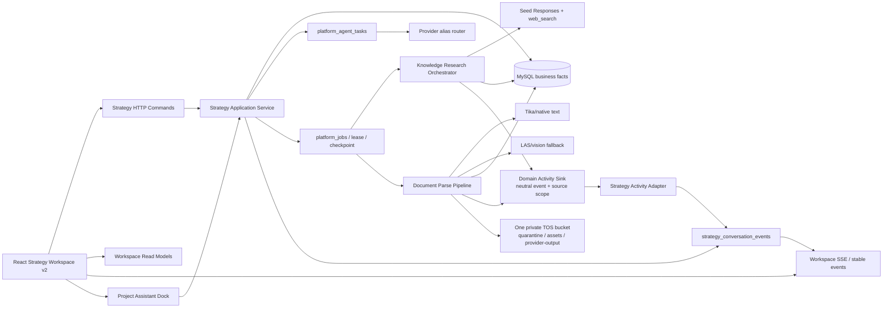
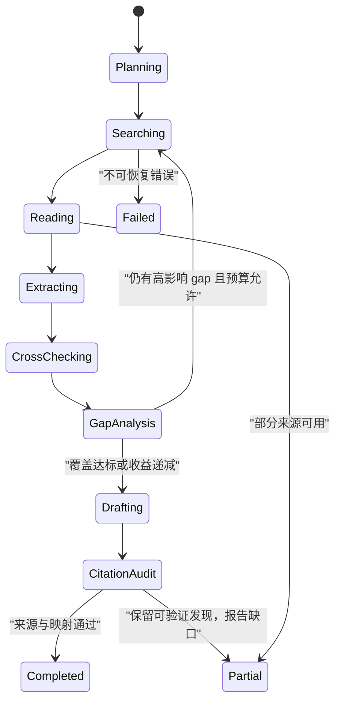

# Strategy 工作区体验重构技术实现方案与反方评审（执行版）

> 日期：2026-08-10
> 状态：反方评审后可执行
> 执行进展（2026-08-11）：编号需求已完成本地实现与确定性验收；Phase 8 自动视觉回退评测按产品决定暂缓，功能保持手动/default-off；提交、GitHub Actions、生产级迁移与发布仍是后续门禁。
> 适用仓库：`github.com/shikanon/cookies`
> 输入：当前对话确认的产品边界、现有代码、[Strategy 首期用户体验与技术调研](../research/strategy-mvp-user-experience-and-technical-research.md)、[2026-08-04 多模态工作台方案](./2026-08-04-strategy-multimodal-ai-workspace-implementation-and-adversarial-review.md)
> 范围：Strategy 前后端、通用项目助手、研究、Brief/策略/评审/交接、文档解析骨架、稳定性与可观测性
> 明确排除：不深入改造交接之后的图片、视频、音频生成和生产流程

## 0. 最终结论

本轮不是给现有九个页面分别“做漂亮一点”，而是破坏性地把 Strategy 收敛成一个稳定、可恢复、可解释的项目工作区：

1. 用户只感知五个业务里程碑：`理解需求 → 确认 Brief → 制定策略 → 确认/评审 → 发布与创意交接`。
2. 研究、实验、资料、变更记录、后台任务不再与五个里程碑争夺一级位置；它们按当前决策上下文出现于辅助面板、抽屉或阶段内模块。
3. 项目级 AI 助手作为通用能力挂在工作区右侧，参考 VS Code Secondary Side Bar：可收起、可调整宽度、跨阶段保持上下文、关闭面板不取消后台任务。
4. AI 不展示原始思维链。用户看到的是任务已接收、当前业务步骤、研究轮次、已确认结论、证据与冲突、预计/已耗时、可取消或重试动作。
5. 所有长任务先持久化再异步执行。页面刷新、路由切换、SSE 断线、Worker 重启均不能丢失已确认内容或使工作流卡死。
6. 深度研究采用有预算、有停止条件的多轮搜索循环；只有产生可定位、可采纳的发现和局部 Patch，才算对 Brief/策略有帮助。
7. Strategy 新增结构化 `creative_strategy`；交接继续负责把已发布策略拆成创意任务规格，但不得再回写 `channel_strategy`，也不改造下游生产。
8. 文档解析先完成统一任务、真实进度、质量检测和预览骨架；PDF/PPT 的逐页视觉回退在主架构稳定后实施。
9. v1 固定“能力 → 模型别名”，不做在线意图评分或动态模型评测路由；运行故障可重试或明确失败，但不得偷偷换成不适配模型。
10. 允许破坏性升级，但不等于允许数据损坏：旧 UI 和旧写路径可删除；可编辑对象生成后继版本，已发布历史产物保持不可变并只读兼容。

本方案替代 2026-08-04 方案中与 Strategy 信息架构、研究中心、文档解析顺序、交接边界冲突的部分；已有 Message v2、Brief v3、媒体理解、CreativeIntake v4 等已落地契约继续复用。

## 1. 已确认边界与非目标

### 1.1 已确认

- 可以进行破坏性 UI、路由、契约和数据库升级。
- 复杂度不是第一约束，正确性、可恢复性和体验收益优先。
- 首先搭整体架构，再深化文档解析质量。
- 深度研究必须后台运行，不阻止对话、Brief 编辑和其他阶段操作。
- 用户可实时看到研究轮次、当前状态和已确定结论。
- 单人项目只需要本人确认；存在角色分工时才创建正式评审任务。
- AI 第二视角是独立批评者，不是审批人，不自动阻塞发布。
- 先记录指标到数据库，不建设管理员端。
- TOS 使用一个顶层桶；首期只走服务端上传/后端代理或短签名下载，CORS 与生命周期本阶段不处理。

### 1.2 非目标

- 不重写 Creative 图片/视频/音频生产引擎。
- 不引入 Eino、Temporal 或第二套 Agent/Job/Provider 运行时。
- 不做 Remote MCP 平台。
- 不做全站设计系统重构，只建立 Strategy 可复用的局部设计基础。
- 不把模型内部 token 流、隐藏提示词、原始 chain-of-thought 暴露给前端。
- 不以“模型觉得结果不错”作为上线验收。
- 不在本阶段实现 TOS CORS、生命周期归档和管理控制台。
- 不承诺研究或解析“节省了多少时间”，直到有上线前基线和可比较样本。

## 2. 现有实现审计

### 2.1 可直接复用

| 能力 | 当前实现 | 结论 |
| --- | --- | --- |
| 持久业务主链 | `strategy_workspaces/conversations/tasks/briefs/drafts/reviews/packages` | 继续作为事实源 |
| 异步运行时 | `platform_agent_tasks`、`platform_jobs`、lease、取消、重试 | 复用，不建第二套任务系统 |
| 任务进度 | `platform_jobs.progress/progress_message`、`UpdateProgress` | 扩展到研究与解析处理器 |
| 可重放事件 | `strategy_conversation_events.sequence`、`Last-Event-ID` | 作为 Strategy 稳定事件唯一日志 |
| 幂等与版本 | write receipts、Idempotency-Key、draft version | 所有新 command 延续 |
| Brief 来源模型 | Brief v3 的 facts/source refs/confidence/assumptions/unknowns/conflicts | 作为 AI 建议与研究采纳基础 |
| 评审模式 | `self_confirmation/leader_approval/designated_approvers` | 产品交互按现有策略裁剪 |
| 联网搜索 | Seed Responses API + `web_search`，来源已落库 | 保留 quick search，扩展 deep run |
| 文档解析 | Tika、文档状态、chunks、locator | 作为文本优先基线 |
| 模型治理 | 逻辑 alias、route inspection、加密 credential | 固定能力映射，不硬编码供应商模型 ID |
| 单桶存储 | `COOKIES_TOS_BUCKET` 与三个逻辑前缀兼容 | 继续使用一个桶 |

### 2.2 代码级主要问题

#### P0：导航与状态源冲突

- `src/data/navigation.ts` 把概览、对话、Brief、研究、策略、创意任务策略、实验、评审、变更记录并列为九个视图。
- `src/components/Pages.tsx` 同时维护本地 `activeView` 和 URL `view`，点击时先改本地状态再导航；后台 reload 又可能重建页面。
- `src/lib/router.ts` 每次导航执行全局 `window.scrollTo({top: 0})`，工作区内部切换也被当成全页跳转。
- `KanonStrategyWorkspace` 再次根据 `activeView` 决定 rail 和主内容，形成两层导航状态。

结果是“上面的栏位跳来跳去”并非单纯 CSS 问题，而是 URL、本地 state、页面 remount 和任务刷新共同竞争焦点。

#### P0：长任务缺少统一、可信反馈

- `useStrategyWorkspace.ts` 分别轮询 AgentTask、ResearchRun、conversation search 和 Document，失败退避规则各自实现。
- `useConversationStream.ts` 收到任意事件后调用整个 `reload()`，即使只更新一个任务状态也会重新读取大量资源。
- 当前研究只有 `running/succeeded/failed/unavailable`，没有轮次、阶段、结论或停止原因。
- 文档解析 Job `MaxAttempts: 1`，只切换 `parse_queued/parsing/ready/parse_failed`，没有 `UpdateProgress`、质量分或视觉回退状态。
- 对话 pending 只显示泛化等待；完成后前端对已经生成的完整文本做“伪流式打字”，不能代表真实执行进度。

#### P0：研究对业务帮助过弱

- `knowledge.research.execute` 只执行一次 `Runner.Run`。
- 来源默认标记为 `model_cited`，并未完成正文核验、冲突核验或独立来源交叉验证。
- “采纳到 Brief”只是把整个 artifact ID 加入 `reference_ids`，不会解释改变了哪个字段、为什么改变、证据支持与反对分别是什么。
- 研究输入未绑定 Brief/Strategy 的内容哈希；上游变化后旧结果仍可能被误用。

#### P0：交接越权

`KanonStrategyWorkspace.tsx` 当前把 `CreativeTaskPlanner.onCreateRouteRevision` 连接到：

```text
actions.patchStrategySection('channel_strategy', value)
```

交接阶段因此能反向修改策略渠道章节。目标边界应是：Strategy 决定渠道和创意策略；Handoff 只从已发布 package 派生任务规格和 route overlay。

#### P1：前端结构与视觉负债

- `KanonStrategyWorkspace.tsx` 同时承担壳、概览、Brief、策略、评审、研究、证据栏和状态格式化，已超过单组件合理职责。
- `useStrategyWorkspace.ts` 是请求、轮询、命令和局部状态的单体 Hook。
- Strategy 样式继续堆入全局 `src/styles.css`；同一工作区混合圆角 Hero、表格、硬边 rail 和大量 9—10px 字体。
- 桌面端主要依赖固定 grid；中间断点只是从三栏压成两栏，阶段特征没有真正改变布局。
- loading/empty/error 大量复用中心空白页，缺少“当前仍可做什么”的恢复动作。

### 2.3 外部部署手册冲突

用户提供的 `deploy-push-runbook.md` 描述的是另一个 Gitee 仓库、`develop` 分支和另一套服务器/框架，而当前工作区是 `github.com/shikanon/cookies`。该文件还包含明文凭据，必须留在仓库外，不能复制到计划、日志或提交中。

因此当前方案只定义发布门禁，不把该手册当作 cookies 的可执行部署目标。实际推送或部署前必须单独确认：目标仓库、分支、CI、迁移执行器、服务器和回滚方式。

## 3. 用户体验目标与验收结果

### 3.1 核心用户结果

用户不需要理解内部 Agent、Skill、Job 或模型路由，也能完成以下工作：

1. 用一句自然语言、文档或项目上下文启动需求。
2. 随时知道 AI 已接收、正在做什么、已确定什么、还缺什么。
3. 逐组核对 Brief，而不是填写大量只有几个字的孤立输入框。
4. 发起 quick search 或后台 deep research，并继续做其他事情。
5. 把研究结论作为可预览的局部修改采纳到 Brief 或 Strategy。
6. 生成、修订和比较策略，区分事实、推断、建议与待确认项。
7. 单人直接确认；多人按真实角色提交评审。
8. 将发布策略拆成创意任务要求，同时确信交接不会悄悄改掉上游策略。
9. 刷新、断网、切换阶段或 Worker 重启后继续，不从零开始。

### 3.2 产品体验 SLO

以下是上线门槛，不是供应商耗时承诺：

| 指标 | 目标 |
| --- | --- |
| 用户 command 持久化确认 | p95 ≤ 1 秒；失败必须保留输入并给出重试 |
| 长任务首个状态反馈 | p95 ≤ 2 秒 |
| Worker heartbeat | 运行时每 15 秒内至少一次；60 秒无 heartbeat 标记“可能中断” |
| SSE 断线恢复 | 网络恢复后 5 秒内开始重放或 REST 校准 |
| 自动保存 | 停止输入 600—900ms 后提交；保存状态始终可见 |
| 后台研究阻塞率 | 0；研究运行时所有非冲突写操作可继续 |
| 错误恢复 | 每个失败态至少提供重试、查看原因、保留结果三者中的适用动作 |
| 导航稳定性 | 后台事件不得改变 stage、滚动位置或输入焦点 |
| 研究可用性 | 完成的 deep run 至少产出 1 个带目标模块的 finding，或明确 `partially_completed`/失败原因 |

### 3.3 可量化但不虚构“时间节省”

先记录：

- `time_to_first_ack`
- `time_to_first_meaningful_update`
- `time_to_brief_confirmed`
- `user_turns_to_brief`
- `time_to_strategy_confirmed`
- `time_to_handoff_created`
- 阶段停留时间、返回次数和放弃率
- AI 建议 accept/edit/ignore 比例
- 研究 finding 采纳率、采纳后再次修改率
- 文档解析耗时、低质量率、视觉回退率、人工纠错率
- stalled/retry/reconnect/terminal failure 比例

上线前先冻结 2—4 周基线；上线后按任务类型、文档数量、用户熟练度做匹配观察。只有存在可比较基线或受控 cohort 时才报告“节省 X%”；否则只报告绝对中位数和相关性。

## 4. 需求拆分

### 4.1 信息架构与导航（IA）

- `IA-01` 五个稳定 stage 使用不可变英文 ID：`intake/brief/strategy/review/handoff`。
- `IA-02` stage 是 URL 唯一事实源，不再在 ModulePage 和 Workspace 各保存一份活动视图。
- `IA-03` 后台事件只更新 badge 和资源，不触发导航。
- `IA-04` 研究、资料、任务、历史是 contextual panel，不是第六至第九步。
- `IA-05` 实验作为 Strategy 的可选章节；需要真实执行时链接现有 Insight 实验中心。
- `IA-06` 直接打开历史 URL 时做一次确定性 redirect，不保留旧 UI 写路径。
- `IA-07` stage 切换保留每阶段滚动位置和未提交输入。
- `IA-08` 键盘和窄屏下 stage rail 可操作，不依赖 hover。

### 4.2 项目级 AI 助手（AST）

- `AST-01` 助手挂载在 Project Shell seam，首期只在 Strategy 启用。
- `AST-02` 可收起、调整宽度、全屏展开；宽度与展开状态按用户记忆。
- `AST-03` 助手会话与当前 workspace 绑定，跨五阶段持续存在。
- `AST-04` 每轮显式展示 context manifest：项目、stage、Brief 版本、Strategy revision、选中来源。
- `AST-05` 用户可移除上下文项；移除只影响下一轮调用，不删除业务对象。
- `AST-06` 助手可提出 artifact patch，但未经用户 accept 不写 Brief/Strategy。
- `AST-07` 简单记忆采用最近窗口 + 结构化事实 + 模型摘要；结构化产物始终优先于摘要。
- `AST-08` 摘要过期、冲突或生成失败时可重建，不阻塞对话。
- `AST-09` 助手关闭后任务继续；再次打开恢复状态和未读标记。
- `AST-10` 不提供“查看 AI 完整思考过程”，只提供执行摘要与可验证依据。

### 4.3 AI 活动与可靠性（RUN）

- `RUN-01` 所有长操作立即返回 durable task/run ID。
- `RUN-02` 统一活动卡展示 kind/status/phase/round/progress/summary/conclusions/actions。
- `RUN-03` 任务支持 queued/running/waiting_user/partially_completed/succeeded/failed/cancelled/stalled。
- `RUN-04` 研究和解析处理器写 heartbeat、阶段和 progress message。
- `RUN-05` retry 只重试失败阶段，并复用已确认 checkpoint。
- `RUN-06` cancellation 使用现有 Job cancel，不伪装即时终止不可取消的上游调用。
- `RUN-07` SSE reducer 按 sequence/event ID 幂等；terminal 后只刷新相关资源。
- `RUN-08` 断线、事件过期或 410 时 REST 全量校准，然后继续订阅。
- `RUN-09` 前端不使用无限 spinner；超过阈值进入“仍在运行/可能中断”可诊断状态。
- `RUN-10` 原始用户输入、最近成功 artifact 和 checkpoint 在失败时保留。

### 4.4 深度研究（RES）

- `RES-01` quick search 保持一次调用，用于对话中的即时事实查询。
- `RES-02` deep research 是独立后台 run，多轮 plan/search/read/extract/cross-check/synthesize/audit。
- `RES-03` 创建 run 时冻结 Brief/Strategy/context manifest 的 ID、版本与内容哈希。
- `RES-04` 每轮记录目标、外部动作摘要、来源数、候选结论和未解决 gap。
- `RES-05` finding 包含 claim、支持来源、反对来源、时间范围、置信度、状态、目标模块和业务含义。
- `RES-06` finding 状态为 tentative/verified/conflicting/invalid。
- `RES-07` 默认重要事实要求两个相互独立来源；只有单一来源时显式标记。
- `RES-08` 到达覆盖率、交叉核验、收益递减、最大轮次、时间或成本任一条件即停止。
- `RES-09` 默认最多 6 轮、15 分钟；组织级配置可收紧，不能由前端任意放大。
- `RES-10` 用户可随时查看已确认 finding，不需要等最终报告。
- `RES-11` 完成后生成可下载报告和结构化 adoption proposals。
- `RES-12` Brief/Strategy 已变化时 proposal 标记 stale，必须 remap 后才可应用。
- `RES-13` Apply 前显示字段级 diff、来源和置信度；支持 accept/edit/ignore。
- `RES-14` deep research 失败时保留已核验 findings，并使用 `partially_completed`。

### 4.5 Brief（BRF）

- `BRF-01` 表单按业务决策分组，而非一字段一卡片。
- `BRF-02` 建议分组：业务目标、产品与证据、受众与情境、渠道与转化、资源约束、风险与未知。
- `BRF-03` 过短但合法的用户值不被静默扩写；AI 提供补充候选和原因。
- `BRF-04` facts、inferences、suggestions、questions 使用不同语义和视觉标记。
- `BRF-05` AI 建议支持采纳、编辑后采纳、忽略；每个动作进入 audit。
- `BRF-06` 同类多个小字段可一次确认；高风险事实仍需逐项确认。
- `BRF-07` 用户不知道怎么写时提供 2—3 个基于当前上下文的候选，不提供无上下文模板墙。
- `BRF-08` Confirm 前显示 blockers/warnings/assumptions 和不可变版本摘要。

### 4.6 Strategy（STG）

- `STG-01` Strategy draft 升级到 v3，新增结构化 `creative_strategy`。
- `STG-02` `creative_strategy` 至少包含 creative objective、message hierarchy、territories、proof/claims、tone、mandatories、avoidances、channel adaptation hints。
- `STG-03` `channel_strategy` 继续描述渠道角色、内容形式、转化路径与节奏，不被交接修改。
- `STG-04` 实验、研究报告和高级章节在对应策略章节内渐进展开。
- `STG-05` AI 修改先给 impact scope，再创建 revision 和 section diff。
- `STG-06` 研究 proposal 可定位到 Strategy 章节；不能只挂一个“参考资料”ID。
- `STG-07` 证据变化、假设变化和合规变化在 diff 中独立显示。
- `STG-08` AI 第二视角使用独立 context 和固定 critic alias，只提供建议与风险。

### 4.7 确认与评审（REV）

- `REV-01` `self_confirmation` 使用“确认并发布”，不创建“提交给自己评审”的额外步骤。
- `REV-02` leader/designated 模式才显示“提交评审”、人员和进度。
- `REV-03` 第二视角与人工审批状态分离；失败不阻塞人工决策。
- `REV-04` 审批绑定 revision/hash；并发修改后旧审批必须失效。
- `REV-05` 确认页默认显示一句话决策、核心人群、渠道、证据、主要风险和变更。
- `REV-06` 低风险字段采用分组确认，高风险声明和合规 blocker 强制显式处理。

### 4.8 创意交接（HOF）

- `HOF-01` 页面命名统一为“创意交接”或“创意任务拆解”，不再叫“创意任务策略”。
- `HOF-02` 输入必须是不可变 StrategyPackage，而非可变 StrategyDraft。
- `HOF-03` 交接从 `creative_strategy`、channel strategy 和 Brief lineage 派生任务规格。
- `HOF-04` route/overlay 修改只生成 handoff/plan/task-strategy revision。
- `HOF-05` 禁止调用 `patchStrategySection('channel_strategy', ...)`。
- `HOF-06` 输出继续兼容现有 `creative-task-strategy/v2` 和 Creative intake seam。
- `HOF-07` 不修改进入 Creative 后的图片/视频生产状态机。

### 4.9 文档解析（DOC）

- `DOC-01` 上传后立即显示 accepted、文件摘要、run ID 和解析路径。
- `DOC-02` 纯文本/Markdown/HTML/可可靠抽取的 Office 文档走 native/Tika 文本路径。
- `DOC-03` PDF/PPT 先文本抽取，再按页做质量检测；不是默认整份转图片。
- `DOC-04` 质量指标包含字符密度、乱码率、空白页、阅读顺序、表格/图片占比和 locator 完整度。
- `DOC-05` 低质量页面进入视觉解析候选；用户能看到“为什么回退”。
- `DOC-06` 先实现 document-level 进度与质量；逐页视觉回退放在主架构稳定后的独立阶段。
- `DOC-07` 提供原文件、抽取文本、页面预览、来源定位和质量警告。
- `DOC-08` progress 是里程碑和已处理页数，不用匀速假百分比欺骗用户。
- `DOC-09` 解析失败可只重试失败路径；已成功文本和 preview 不删除。

### 4.10 指标、安全与存储（OPS）

- `OPS-01` 产品事件落 MySQL，暂不建管理员端。
- `OPS-02` 事件 payload 使用字段 allowlist，禁止保存完整 prompt、文档正文和模型思维链。
- `OPS-03` 每次 provider 调用记录 alias、route revision、model version、prompt version、usage、latency 和 terminal code。
- `OPS-04` 单个 TOS bucket 使用三个逻辑前缀和 org/project/resource 层级隔离。
- `OPS-05` quarantine 对象不能被业务读取；通过扫描/校验后 copy-promote 到 assets。
- `OPS-06` provider-output 只能由服务端临时读取并归一化，前端不持有长期 provider URL。
- `OPS-07` CORS 和 lifecycle 暂不改，但必须记录为上线后的运维债务。

## 5. 目标信息架构与交互

### 5.1 稳定工作区

```text
┌ Project / Workspace / 保存状态 / 后台任务 badge / AI 助手开关 ┐
├ 01 理解需求 ─ 02 Brief ─ 03 策略 ─ 04 确认/评审 ─ 05 创意交接 ┤
├──────────────────────── 主阶段工作区 ────────────────────────┬──┤
│ 每阶段使用自己的信息结构，不强制左中右三栏                   │AI│
│                                                             │助│
│ 阶段内按需打开：资料 / 研究 / 任务活动 / 版本历史            │手│
├─────────────────────────────────────────────────────────────┴──┤
│ 后台任务状态：运行中、未读结果、失败、待用户处理               │
└────────────────────────────────────────────────────────────────┘
```

### 5.2 五个阶段不是五张同构页面

#### Intake：对话优先

- 中心是消息和 Composer。
- 同屏显示可折叠的“当前理解”，但不展示完整长表单。
- 后台任务以嵌入式 activity card 出现在相关消息旁。
- 上传文档后可继续输入；附件未完成时只禁止将其作为已解析上下文，不锁住对话。

#### Brief：决策确认优先

- 顶部显示 ready/blocker/warning/assumption。
- 主区按决策组显示当前值、来源和建议。
- 右侧不是永久栏，而是按需打开“来源与修改建议” inspector。
- 底部 sticky action 只保留“继续补充”和“确认 Brief”。

#### Strategy：文档编辑优先

- 左侧可折叠章节目录；中心为策略正文/结构化编辑器。
- 研究、证据、AI 修改通过 inline proposal 和 inspector 展示。
- 复杂 diff 使用整页或 modal workspace，不挤在窄 rail 中。

#### Review：决策摘要优先

- 单人默认是确认页，不出现没有接收人的提交表单。
- 多人显示 reviewer、状态、评论和 version hash。
- AI 第二视角在“独立建议”区，不与人工批准混为一个 badge。

#### Handoff：规格编排优先

- 上方显示来源 package/hash/readiness。
- 主区完成 route、任务级目标、素材要求、守则和待确认问题。
- 用户可修改 task overlay，但上游策略只读。

### 5.3 辅助能力的聚合

| 能力 | 默认入口 | 展示位置 |
| --- | --- | --- |
| 快速联网搜索 | Assistant Composer | 当前消息下方来源卡 |
| 深度研究 | Assistant 命令、Brief/Strategy 的“补充研究” | Research drawer + Activity Center |
| 项目资料 | Composer、Brief/Strategy 来源按钮 | Materials drawer |
| 文档解析 | 上传卡 | Materials drawer + activity card |
| 实验方案 | Strategy 的实验章节 | 跳转现有实验中心执行 |
| 版本与变更 | Brief/Strategy 标题区 | History drawer / full diff |
| 后台任务 | 全局 badge | Activity Center |
| AI 第二视角 | Review 和 Strategy toolbar | 独立 critique card |

### 5.4 路由与焦点规则

新路径：

```text
/projects/{projectId}/strategy/workspaces/{workspaceId}/{stage}
stage = intake | brief | strategy | review | handoff
```

可选 UI 状态使用 query：

```text
?panel=assistant|research|materials|activity|history
&resource={id}
```

规则：

- stage 只由 URL 决定。
- panel 可由 URL 深链；普通开合状态记在 localStorage，不污染业务数据。
- background event 不写 URL。
- stage 变化只滚动主 stage 容器，不调用全局 `window.scrollTo`。
- 浏览器前进/后退恢复 stage、panel 和选中资源。
- 旧 `?view=研究/实验/变更记录` 映射到最近合法 stage + 对应 panel，一次 redirect 后不再保留旧路由。

## 6. 目标技术架构



### 6.1 领域所有权

| 领域 | 拥有的事实 | 不拥有 |
| --- | --- | --- |
| Strategy | stage、Brief、Strategy、review、package、assistant proposal、adoption | provider 凭据、原始 blob |
| Agent | durable AI task、skill run、结果 ref、失败与重试 | Brief/Strategy 的最终写权 |
| Job Runtime | 队列、lease、heartbeat、progress、cancel、attempt | 业务阶段和用户界面 |
| Knowledge | document、chunk、research run/source/finding | Strategy 字段最终值 |
| Provider | 模型调用与标准化响应 | 对话、记忆、版本和审批 |
| Assets/TOS | blob、版本、对象位置 | 业务语义与研究结论 |
| Creative | handoff 后任务与生产 | 回写已发布 StrategyPackage |

### 6.2 不新增第二套运行时

`TaskActivity` 是 read model，不是新任务引擎：

- AgentTask 和 Job 保持唯一执行事实。
- ResearchRun/Document 保存领域阶段和 checkpoint。
- `strategy_conversation_events` 只保存稳定、低频的业务事件。
- Activity API 组合上述事实供前端展示。
- Knowledge 只发布不含 Strategy 类型的中性 domain activity；组合根注入 Strategy adapter，并仅在 run 的 `source_scope` 明确关联 workspace/conversation 时写入 Strategy 事件日志，禁止 Knowledge 反向 import Strategy。
- 没有 Strategy scope 的项目级任务仍可通过 Activity REST 投影查询，不为了 SSE 强行创建 conversation。
- token delta、模型内部思考和每个工具日志不写 conversation event。

## 7. 核心契约

### 7.1 ProjectContextManifest v1

```json
{
  "contract_version": "strategy-project-context-manifest/v1",
  "project_ref": {"id": "project_1", "version": 12},
  "workspace_ref": {"id": "workspace_1", "version": 8},
  "stage": "strategy",
  "brief_ref": {"id": "brief_1", "version": 4, "content_hash": "sha256:..."},
  "strategy_ref": {"id": "strategy_1", "revision": 3, "content_hash": "sha256:..."},
  "selected_source_refs": [],
  "memory_ref": {"conversation_id": "conversation_1", "version": 7},
  "built_at": "2026-08-10T00:00:00Z"
}
```

所有 AI task 固定保存该快照；Provider 只得到经过权限、大小和内容策略过滤后的投影。

### 7.2 TaskActivity v1

```json
{
  "contract_version": "strategy-task-activity/v1",
  "id": "activity_1",
  "kind": "deep_research",
  "status": "running",
  "phase": "cross_checking",
  "round": {"current": 3, "max": 6},
  "progress": {"kind": "milestone", "value": 58, "message": "正在核对两个冲突来源"},
  "summary": "已覆盖受众与竞品，正在补齐渠道时效性",
  "confirmed_conclusions": [
    {"id": "finding_1", "text": "...", "status": "verified", "source_count": 2}
  ],
  "source_scope": {"project_id": "project_1", "workspace_id": "workspace_1", "conversation_id": "conv_1"},
  "resource_ref": {"type": "knowledge_research_run", "id": "run_1"},
  "actions": ["cancel", "open"],
  "heartbeat_at": "2026-08-10T00:00:00Z",
  "updated_at": "2026-08-10T00:00:00Z"
}
```

`summary` 是面向用户的执行摘要；禁止从模型原始 reasoning 字段直接复制。

### 7.3 ResearchRun v2

关键字段：

```text
run_mode                 quick | deep
status                   queued | planning | searching | reading |
                         cross_checking | drafting | auditing |
                         completed | partially_completed | failed | cancelled
current_round / max_rounds
time_budget_seconds / token_budget
input_snapshot_ref / input_snapshot_hash
coverage_json / open_gaps_json
stop_reason
heartbeat_at
report_artifact_id
```

### 7.4 ResearchFinding v1

```json
{
  "contract_version": "strategy-research-finding/v1",
  "id": "finding_1",
  "claim": "...",
  "status": "verified",
  "time_scope": "2026-H1",
  "confidence": "medium",
  "supporting_source_ids": ["source_1", "source_2"],
  "conflicting_source_ids": [],
  "target": {"artifact": "brief", "field_path": "facts.audience"},
  "implication": "...",
  "round": 3,
  "content_hash": "sha256:..."
}
```

### 7.5 ResearchAdoptionProposal v1

```json
{
  "contract_version": "strategy-research-adoption-proposal/v1",
  "id": "proposal_1",
  "finding_ids": ["finding_1"],
  "target_ref": {"type": "brief_draft", "id": "brief_1", "version": 4},
  "base_content_hash": "sha256:...",
  "operations": [],
  "rationale": "...",
  "risk": "medium",
  "status": "proposed",
  "stale_reason": ""
}
```

Apply 使用 expected version/hash，成功生成 revision/audit；失败返回最新差异，不做 last-write-wins。

### 7.6 DocumentParse v2

Document 增加：

```text
parse_strategy           text_native | tika_text | hybrid | visual
parse_phase              queued | scanning | extracting | quality_checking |
                         visual_fallback | chunking | ready | partial | failed
parse_progress           0..100
progress_kind            milestone | pages
processed_pages / total_pages
quality_score / quality_tier
fallback_reason
preview_status
heartbeat_at
```

质量分只用于路由和提示，不对用户宣称“准确率”。真实准确率需要带人工标注的页面集。

### 7.7 StrategyDraft v3

在 v2 上新增：

```json
{
  "creative_strategy": {
    "objective": "",
    "message_hierarchy": [],
    "territories": [
      {
        "name": "",
        "audience_tension": "",
        "core_idea": "",
        "proof": [],
        "channel_adaptations": []
      }
    ],
    "tone": [],
    "mandatories": [],
    "avoidances": []
  }
}
```

新 writer 只写 `creative_strategy`。仍处于可编辑状态的 v2 draft 可生成 v3 successor revision；已发布 v2 StrategyPackage 不原地改写，交接与历史页通过只读兼容 decoder 展示其原始 snapshot。

### 7.8 ConversationMemory v2

继续使用 `strategy_conversation_memories`，增加：

- `summary_kind=deterministic|model`
- `summary_model_alias`
- `summary_prompt_version`
- `summary_content_hash`
- `recent_window_start_message_id`
- `artifact_manifest_json`
- `last_compacted_at`

构建顺序：

```text
结构化 Brief/Strategy/Package
→ 当前明确选中的来源
→ 最近 N 轮原始消息
→ 模型摘要
→ 当前用户输入
```

若摘要与结构化事实冲突，丢弃摘要冲突段并记录 `memory_conflict`，不覆盖业务事实。

## 8. 深度研究实现

### 8.1 有界循环



这里借鉴 ReAct 的“行动与状态更新交错”，但不把自由文本思维链作为运行协议。每轮模型只能输出受 Schema 限制的：

- 下一步检索/读取动作；
- 选择该动作的简短业务理由；
- 新增或更新的 finding；
- 未解决 gap；
- 是否建议停止。

最终停止权属于服务端预算和校验器，不属于模型。

### 8.2 研究提示词包

固定由代码生成以下块：

1. `decision_to_support`：要帮助用户做哪个 Brief/Strategy 决策。
2. `known_facts`：已确认业务事实与来源。
3. `unknowns_and_conflicts`：高影响未知和冲突。
4. `source_policy`：独立来源、时间范围、禁止来源、单一来源标签。
5. `output_targets`：允许修改的模块和禁止写入的模块。
6. `stopping_criteria`：覆盖、交叉核验、最大轮次、时间和 token。
7. `citation_contract`：每个 claim 必须绑定 source ID 和 locator。

报告不是唯一产物；findings 和 proposals 才是与 Brief/Strategy 的接口。

### 8.3 来源核验

- URL canonicalize 与去重沿用当前实现。
- 不能把 Provider 返回 URL 自动升级为 `content_verified`。
- `content_verified` 需要成功读取正文，并验证引用片段支持 claim。
- 同域转载不算两个独立来源。
- `conflicting` 来源必须进入 finding，而不是被总结提示词静默丢弃。
- 来源失效时保留检索时间、标题、内容 hash 和 provider locator。

### 8.4 用户侧状态

Activity card 展示：

```text
第 3 / 6 轮 · 交叉核验
已查看 14 个来源，7 个可用
已确认 3 条结论，1 条存在冲突
下一步：补查近 6 个月渠道数据
[查看已有结论] [取消研究]
```

不展示：token 级思考、隐藏系统提示词、模型原始 scratchpad。

## 9. 文档解析路线

### 9.1 先搭骨架

第一批只完成：

- Parser router 接口；
- durable parse run 与真实阶段进度；
- document-level 质量报告；
- 解析预览；
- 重试和 partial result；
- 一个桶的对象路径和权限校验。

不在这批接 LAS 逐页解析，避免解析专项拖住整个 Strategy UX。

### 9.2 混合解析

```text
文件接收
→ MIME/魔数/大小校验
→ quarantine
→ 文本优先解析
→ 页面/文档质量检测
→ 质量足够：chunk + preview + ready
→ 质量不足：只选低质量页进入视觉解析
→ 合并文本、表格、图片区域和 locator
→ 再次质量检测
→ ready 或 partial
```

Tika 官方 PDF 配置支持 OCR strategy、页面渲染和每页阈值；火山 LAS 支持 PDF 页面渲染、视觉解析、高保真 Markdown、表格/公式/图片区域与 bounding box。实现上仍通过 cookies-owned `DocumentVisionParser` 接口调用，避免 LAS 数据结构渗透 Strategy。

### 9.3 进度语义

建议里程碑：

| 进度 | 含义 |
| --- | --- |
| 5 | 文件已接受并落入 quarantine |
| 10 | 安全与格式校验通过 |
| 15—60 | 文本解析；有页数时按页计算 |
| 65—72 | 质量检测 |
| 72—92 | 视觉回退；仅实际触发时出现 |
| 93—98 | 合并、chunk、locator 与 preview |
| 100 | ready/partial，业务资源可读 |

百分比必须由已完成工作量决定。未知总页数时显示阶段和 elapsed time，不假装匀速增长。

### 9.4 质量阈值上线方式

阈值先以规则和小型标注集启动：

- 纯文本 PDF；
- 扫描 PDF；
- 双栏报告；
- 表格密集；
- 中文 PPT；
- 字体映射损坏；
- 页眉页脚噪声；
- 图片为主要信息载体。

先记录 shadow decision，不自动触发昂贵视觉解析；人工检查误报/漏报后再打开自动 fallback。该 shadow 只决定解析路由，不决定业务事实。

## 10. 固定模型适配

v1 在服务端配置一个固定 capability map：

| 能力 | 固定逻辑 alias | 说明 |
| --- | --- | --- |
| 对话理解 + Brief patch | `cookies.text.standard` | 结构化输出和稳定事实优先 |
| Strategy 生成/修订 | `cookies.text.standard` | 沿用当前生成链 |
| AI 第二视角 | `cookies.text.deep_review` | 独立 prompt/context |
| 意图标签、标题、记忆压缩 | `cookies.text.lite` | 简单、低风险、可重建任务 |
| quick/deep web research | `cookies.research.web.standard` | deep 通过多次固定调用实现 |
| 文档视觉回退 | `cookies.document.vision.standard` | 适配 LAS/Seed，多模态结果标准化 |
| Creative 媒体生成 | 现有 aliases | 本项目不改 |

其中 `cookies.text.lite` 与 `cookies.document.vision.standard` 是本方案要求新增并注册的逻辑 alias，不假设当前环境已经存在。Phase 0 必须逐一 `InspectRoute` 并跑最小契约样本；缺少 alias 时对应能力保持不可用并显示明确原因，不能悄悄回退到不适配模型。历史已存在 alias 同样先检查后使用。

约束：

- 不按模型自评、任务评分或在线 bandit 动态切换。
- alias 必须能 `InspectRoute`；不支持时 UI 不展示能力或明确降级。
- lite 输出不能直接确认高风险事实，只能分类、摘要或生成建议候选。
- deep review 不复用生成策略的对话历史，避免自我认同。
- 所有模型结果仍经过 Schema、权限、版本和业务规则校验。

## 11. 后端实现方案

### 11.1 Strategy 应用层

新增建议：

```text
internal/systems/strategy/
  workspace_stage.go
  context_manifest.go
  assistant_orchestrator.go
  assistant_patch.go
  activity_projection.go
  activity_publisher.go
  research_adoption.go
  creative_strategy.go
  memory_compaction.go
```

修改：

```text
internal/systems/strategy/model.go
internal/systems/strategy/service.go
internal/systems/strategy/strategy_flow.go
internal/systems/strategy/review.go
internal/systems/strategy/review_policy.go
internal/systems/strategy/memory_feedback.go
internal/systems/strategy/creative_handoff.go
internal/systems/strategy/creative_task_plan.go
internal/systems/strategy/httpapi/server.go
```

### 11.2 Knowledge

新增建议：

```text
internal/platform/knowledge/
  research_orchestrator.go
  research_checkpoint.go
  research_findings.go
  document_parse_pipeline.go
  document_quality.go
  document_preview.go
  document_vision.go
```

修改：

```text
research_job.go              # MaxAttempts、phase checkpoint、UpdateProgress
service.go                   # v2 types/API
research_sources.go          # verification transition
document_parse_job.go        # progress、partial、retry stage
document_parser.go           # parser router/result quality seam
```

### 11.3 Agent/Job

- 为 handler 注入 `jobruntime.ProgressReporter`，不要让业务包直接依赖 MySQLStore。
- Research 每轮完成后原子保存 checkpoint、findings、usage 和 heartbeat。
- 文档每个里程碑保存 progress；视觉 provider 超时后可从已选择页面继续。
- 默认 `MaxAttempts`：研究 2、文档文本解析 2、视觉回退 2；不可重试的 Schema/权限/格式错误立即 terminal。
- retry 使用同一 run 的新 attempt 或显式 child run，并记录 lineage；不能重复计费却看起来像一次调用。
- Knowledge handler 只依赖中性 `DomainActivitySink` 接口；Strategy adapter 在组合根注入，不能形成 Knowledge → Strategy 包依赖。
- activity sink 失败不回滚已经成功的业务 artifact；后续 REST reconciliation 可恢复 UI。

### 11.4 HTTP API

#### Workspace/Assistant

```text
GET  /api/strategy/v1/workspaces/{id}/context-manifest
GET  /api/strategy/v1/workspaces/{id}/activities
GET  /api/strategy/v1/workspaces/{id}/events
POST /api/strategy/v1/conversations/{id}/messages:v2
POST /api/strategy/v1/assistant-proposals/{id}:apply
POST /api/strategy/v1/assistant-proposals/{id}:ignore
POST /api/strategy/v1/conversations/{id}/memory:compact
```

#### Research

```text
POST /api/platform/v1/projects/{projectId}/research-runs
GET  /api/platform/v1/projects/{projectId}/research-runs/{runId}
GET  /api/platform/v1/projects/{projectId}/research-runs/{runId}/findings
GET  /api/platform/v1/projects/{projectId}/research-runs/{runId}/report
POST /api/platform/v1/projects/{projectId}/research-runs/{runId}:cancel
POST /api/platform/v1/projects/{projectId}/research-runs/{runId}:retry
POST /api/strategy/v1/research-adoption-proposals/{id}:apply
POST /api/strategy/v1/research-adoption-proposals/{id}:remap
```

#### Documents

```text
GET  /api/platform/v1/projects/{projectId}/documents/{id}/parse
GET  /api/platform/v1/projects/{projectId}/documents/{id}/preview
GET  /api/platform/v1/projects/{projectId}/documents/{id}/quality
POST /api/platform/v1/projects/{projectId}/documents/{id}:retry-parse
POST /api/platform/v1/projects/{projectId}/documents/{id}:run-visual-fallback
```

所有 mutation 使用 Idempotency-Key；Apply/patch/confirm 使用 expected version/hash。

### 11.5 SSE 事件

稳定事件建议：

```text
assistant.task.accepted.v1
assistant.proposal.created.v1
assistant.message.created.v1
activity.changed.v1
research.finding.verified.v1
research.terminal.v1
document.parse.phase_changed.v1
document.parse.terminal.v1
brief.revision.created.v1
strategy.revision.created.v1
review.changed.v1
handoff.created.v1
```

SSE payload 只放 resource ref、version、状态摘要和 invalidation key。完整正文通过 REST 获取。

## 12. 数据库与破坏性迁移

### 12.1 Migration A：研究 v2

建议文件：

```text
migrations/platform/20260810100000_research_orchestration_v2.up.sql
```

内容：

- 扩展 `platform_research_runs` 的 mode/status/round/budget/snapshot/heartbeat/stop 字段。
- 新建 `platform_research_iterations`。
- 新建 `platform_research_findings`。
- 将旧 `running/succeeded` 映射到新状态；历史 artifact 保持可读。

### 12.2 Migration B：文档运行与质量

```text
migrations/platform/20260810101000_document_parse_pipeline_v2.up.sql
```

- 扩展 document 的 phase/progress/page/quality/fallback/heartbeat/preview 字段。
- 第一批不建逐页表；`page_quality_summary JSON` 保存 shadow 结果。
- 真正逐页视觉回退阶段再建 `platform_document_pages`，避免先建空表。

### 12.3 Migration C：助手记忆、建议和产品指标

```text
migrations/strategy/20260810102000_strategy_assistant_memory_v2.up.sql
migrations/strategy/20260810103000_strategy_product_events.up.sql
```

- 扩展 conversation memory。
- 新建 `strategy_artifact_proposals`，以 `proposal_kind=assistant|research` 保存 suggestion/adoption 生命周期；研究 finding 由 ref 关联，不复制到 Strategy 表。
- 新建 append-only `strategy_product_events`，只接受枚举 event type 和受限 JSON。

### 12.4 Migration D：StrategyDraft v3

Strategy document 当前存在 JSON 中，不需要新列。破坏性升级只切新写路径，不破坏已经承诺不可变的历史包：

1. 冻结写入。
2. 导出受影响 Strategy revision/package 的 ID、hash、JSON 到受控备份。
3. 运行 `cmd/cookies-migrate-strategy-v3 --dry-run`，只为尚未发布、仍可编辑的 v2 draft 规划 v3 successor revision，不覆盖原 revision。
4. 已发布 v2 StrategyPackage 的 ID、snapshot、hash 和 lineage 完全保持不变；历史读取使用隔离的只读 v2 decoder，禁止任何 v2 writer。
5. 需要继续编辑历史 v2 时，由用户触发“升级为新版本”，生成指向原 package/revision 的 v3 successor；只有再次确认后才生成新的 v3 package 和新 hash。
6. 比较对象数、原历史 hash、successor lineage、version 和业务关键字段；抽样核对 v2 只读展示与原 snapshot 一致。
7. 切换为 v3-only writer 和 v3 默认 reader；只读历史 decoder 不得进入创建、patch、confirm 或 handoff 写路径。
8. 回滚依赖备份恢复和 writer 开关，不假定 SQL down migration 能复原 JSON 语义。

### 12.5 破坏性升级纪律

- 可以删除旧 UI、旧路由和旧 writer。
- 不做长期双 UI 或双 writer。
- 允许保留最小只读历史 decoder；兼容读取不等于继续开放旧写入协议。
- 迁移前必须 dry-run、备份、计数、hash 和抽样 diff。
- 任何跨 Project/organization 错配、对象数减少、不可解释 hash 变化立即 No-Go。
- 对生产数据的迁移、推送和部署仍需用户单独授权。

## 13. 单桶 TOS 约定

```text
quarantine/{organization_id}/{project_id}/{upload_id}/{filename}
assets/{organization_id}/{project_id}/{asset_id}/v{version}/{filename}
provider-output/{organization_id}/{project_id}/{provider}/{job_id}/{artifact}
```

必须配置：

- 桶私有，不使用公共读。
- 服务端凭据最小权限；下载使用短期签名 URL 或后端代理。
- 每次读取根据数据库 resource ref 重新检查 organization/project，不信任客户端 object key。
- quarantine → assets 使用服务端 copy/promote；成功后数据库原子切换 object ref。
- provider-output 不直接成为业务资产，必须经过 hash、MIME、大小和状态校验。
- 日志只记录 bucket、prefix class、resource ID 和 request ID，不记录签名 query、AK/SK。

本阶段不配置 CORS 与 lifecycle；因此首期不能依赖浏览器直传或公共资源 URL。若后续引入浏览器直传，CORS 必须先作为该功能的硬前置完成；lifecycle 登记 owner 和目标日期，避免无限期遗忘。

## 14. 前端实现与美术方向

### 14.1 文件结构

```text
src/features/strategy/
  workspace/
    StrategyWorkspaceRoute.tsx
    StrategyWorkspaceShell.tsx
    StageRail.tsx
    WorkspaceTopbar.tsx
    WorkspaceProvider.tsx
    workspaceRoute.ts
  stages/
    IntakeStage.tsx
    BriefStage.tsx
    StrategyStage.tsx
    ReviewStage.tsx
    HandoffStage.tsx
  assistant/
    ProjectAssistantDock.tsx
    AssistantComposer.tsx
    ContextManifestChips.tsx
    ArtifactProposalCard.tsx
  activity/
    ActivityCenter.tsx
    TaskActivityCard.tsx
    useWorkspaceActivityStream.ts
    activityReducer.ts
  research/
    ResearchDrawer.tsx
    ResearchRunTimeline.tsx
    FindingLedger.tsx
    AdoptionProposalDiff.tsx
  documents/
    MaterialsDrawer.tsx
    DocumentParseCard.tsx
    DocumentPreview.tsx
    DocumentQualitySummary.tsx
  api/
    commands.ts
    resources.ts
    contracts.ts
  styles/
    tokens.css
    shell.css
    stages.css
    assistant.css
    activity.css
    research.css
    documents.css
    motion.css
```

切换完成后删除或拆解：

```text
KanonStrategyWorkspace.tsx
StrategyConversationPane.tsx
useStrategyWorkspace.ts
CreativeTaskPlanner.tsx  # 重命名并迁移为 HandoffStage 子组件
```

### 14.2 视觉系统

现有全局 MiSans/PingFang 可以保留，Strategy 建立局部 token：

- 主文字最小 14px，辅助文字最小 12px；禁止关键状态使用 9px。
- 使用中性暖灰/冷灰 surface + 单一 cobalt 主色；成功、警告、冲突只表达语义。
- 圆角只用于可交互容器和重点 artifact，不让每个 section 都变成同样的卡片。
- 阴影只用于浮动 assistant、modal 和拖拽层；普通内容用 border/surface 层级。
- 动效只用于 panel 开合、状态变化和 skeleton；遵守 `prefers-reduced-motion`。
- 每阶段有不同信息密度和布局，避免机械复制三栏。

### 14.3 React 性能约束

- Context manifest、workspace shell 和首屏 stage 请求可独立时使用 `Promise.all`，避免瀑布。
- Research report、Document preview、full diff、Handoff editor 使用 `React.lazy` 按需加载。
- 新代码从 Lucide 具体模块直接 import，避免 barrel 导入扩大开发和构建成本；落地前用 Vite bundle 验证路径。
- 不引入 SWR 只为一个全局监听；快捷键和 resize 使用一个 workspace-level listener。
- 派生 stage/readiness/activity badge 在 render 或 selector 中计算，不用 effect 回写冗余 state。
- 高频非紧急 SSE 更新使用 `startTransition`。
- 长消息、finding 和 activity 列表使用 `content-visibility: auto`；数据量继续增长后再引入虚拟列表。
- 研究/资料搜索使用 `useDeferredValue`，保证输入不被长列表渲染阻塞。
- 将 combined Hook 拆成 workspace/stage/activity/assistant resource hooks，避免一个变更触发全部重算和 reload。

### 14.4 状态与数据加载

```text
URL                         stage/panel/resource selection
WorkspaceProvider           workspace identity + immutable refs
Stage resource hook         当前阶段的 server resource
Activity stream reducer     低频运行状态投影
Assistant session hook      messages + memory + proposals
Local component state       input/drawer width/temporary selection
```

禁止：

- 在两个组件保存 active stage。
- SSE 任意事件触发 workspace 全量 reload。
- 用 `busy: string` 锁住无关动作。
- 后台完成后自动切 stage。
- 以 loading spinner 替代 error/partial/stalled 语义。

### 14.5 无障碍与响应式

- 1440px：assistant 可常驻，主区保持足够宽度。
- 1024—1439px：assistant 默认浮层/覆盖式，不挤压核心编辑器。
- <1024px：stage rail 变顶部横向步骤，assistant 全屏 sheet。
- <760px：阶段主操作 sticky，复杂 diff 转全屏。
- 所有 panel 可通过按钮和 Esc 关闭；焦点返回触发按钮。
- SSE 状态使用合适的 `aria-live`，避免每个 heartbeat 都读屏。
- icon-only 按钮必须有 label，颜色不是唯一状态信号。

## 15. 测试与验证

### 15.1 单元测试

Go：

- stage transition 与 review mode。
- context manifest 权限、大小、版本与 stale 判断。
- memory compaction 冲突和失败回退。
- deep research 停止条件、checkpoint、部分成功和取消。
- 来源去重、独立域判断、verification transition。
- finding → Brief/Strategy proposal 映射。
- proposal apply 的版本冲突与幂等。
- document quality 规则、parser router 和 progress 单调性。
- handoff 不能修改 StrategyDraft。

TypeScript：

- route parse/redirect/stage sole source。
- activity reducer sequence/idempotency/terminal precedence。
- reconnect 后 REST snapshot + event replay 合并。
- context chip remove 不修改业务对象。
- suggestion accept/edit/ignore 状态。
- self confirmation 与 formal review CTA。

### 15.2 契约测试

新增：

```text
strategy-project-context-manifest-v1.schema.json
strategy-task-activity-v1.schema.json
strategy-research-run-v2.schema.json
strategy-research-finding-v1.schema.json
strategy-research-adoption-proposal-v1.schema.json
platform-document-parse-v2.schema.json
strategy-draft-v3.schema.json
```

每个契约提供 valid/invalid/stale/partial fixture；Go、TypeScript 和 JSON Schema 必须在 CI 中一致。

### 15.3 MySQL 集成测试

- 空库 migrate。
- 现有 fixture 数据升级。
- Strategy v2 可编辑草稿 → v3 successor 的数量/lineage/diff，以及历史 package hash 零变化。
- Research 第 3 轮 crash 后恢复且不重复已完成调用。
- Worker lease 过期回队。
- progress/heartbeat 并发更新。
- Apply proposal 与人工 patch 并发产生 409/412。
- organization/project 越权访问全部拒绝。
- 单桶相同文件名跨 Project 不串对象。

### 15.4 E2E 主旅程

1. 一句需求 → AI ack → Brief 建议 → 分组确认。
2. 上传纯文本 → 进度/预览 → 进入对话上下文。
3. 上传低质量 PDF → 质量警告 → 手动/自动视觉回退占位。
4. deep research 后台运行 → 切到 Brief 编辑 → 返回查看第 N 轮和结论。
5. Brief 在研究中变化 → proposal stale → remap → 预览 diff → apply。
6. 生成 Strategy v3 → 局部修订 → 第二视角 → self confirmation。
7. 正式 review mode → 指定 reviewer → revision 改变后旧审批失效。
8. 发布 package → 创意交接 → 修改 overlay → 验证 channel strategy hash 未变。
9. SSE 断开、刷新、Worker 重启 → 恢复 final state。
10. 任务超时/失败/部分成功 → 查看原因、保留结果、只重试失败阶段。
11. 浏览器前进/后退 → stage、panel、resource 稳定。
12. 1024/760px、键盘和 reduced motion 验收。

### 15.5 故障注入

- Seed 429、5xx、超时、返回无引用报告。
- Tika 连接失败、空文本、乱码、超大输出。
- LAS 已提交但响应未知。
- MySQL 短暂失败、死锁、version conflict。
- SSE 断开、重复事件、乱序无效事件、410 cursor expired。
- Job lease 丢失、Worker 在 checkpoint 前后 crash。
- TOS copy 成功但 DB commit 失败，和相反顺序。

### 15.6 前端视觉与性能

- Playwright 截图：1440、1280、1024、768、390。
- 真实长中文内容、50 条消息、30 findings、20 documents、10 running tasks。
- 增加 `@axe-core/playwright` 前先单独评审依赖；若采用，阻断严重可访问性问题。
- 记录改造前后 Strategy 首屏 JS、LCP、交互响应和长列表渲染；预算以基线为准，不先编造绝对数字。
- `npm run build`、`npm test`、contract check 和相关 Playwright 全部通过。

## 16. 指标与可观测性

### 16.1 产品事件表

`strategy_product_events` 最小字段：

```text
id, organization_id, project_id, workspace_id
event_type, stage, actor_kind, actor_id_hash
resource_type, resource_id, resource_version
duration_ms, outcome, attributes_json
occurred_at
```

允许事件：

```text
workspace.opened
stage.viewed
assistant.command_submitted
assistant.first_ack
assistant.first_meaningful_update
assistant.proposal_accepted|edited|ignored
research.started|finding_verified|completed|partial|failed|cancelled
research.proposal_applied|stale
document.parse_started|ready|partial|failed|vision_fallback
brief.confirmed
strategy.confirmed
review.submitted|approved|returned
handoff.created
activity.stalled|retried
```

### 16.2 技术 trace

统一关联：

```text
request_id
conversation_message_id
agent_task_id
job_id
research_run_id / document_id
model_alias / route_revision_id / model_version
prompt_version
workspace_id / project_id / organization_id
```

日志中不得出现 AK/SK、Authorization、签名 URL、完整文档、完整 prompt 或原始 CoT。

### 16.3 首批 SQL 指标

- 各 stage 漏斗和中位耗时。
- Assistant ack/meaningful update p50/p95。
- stalled、retry、最终失败率。
- Research 每轮新增 verified finding、来源数和采纳率。
- Suggestion accept/edit/ignore 与采纳后再次修改率。
- 文档按 MIME 的耗时、质量分布和 fallback 比例。
- Review mode 分布和自确认/正式审批完成时间。
- Handoff 创建率和上游 hash 稳定率。

不建设管理员 UI；先提供可版本化 SQL/read model 和测试。

## 17. 实施路线与 PR 粒度

### Phase 0：基线、安全与契约冻结（2—4 人日）

- 冻结当前五条主旅程和性能/错误基线。
- 建立 v1/v2/v3 契约 fixture。
- 注册并验证固定 capability aliases；lite/vision 缺失时给出显式 capability unavailable。
- 确认 cookies 的真实部署目标；隔离外部含凭据 runbook。
- 建产品事件表和最小写入器。
- 输出旧路由到新 stage/panel 的映射。

验收：不改用户流程；所有基线可重复。

### Phase 1：工作区壳与导航破坏性切换（5—8 人日）

- 新 typed route 和五阶段 StageRail。
- 移除九视图 workspace tabs。
- 建 WorkspaceProvider、stage scroll/focus restore。
- 建 Strategy 局部 CSS token 和 responsive shell。
- 旧 URL 一次 redirect；旧 workspace UI 停止新增功能。

验收：后台状态变化不能改变 stage/focus/scroll；所有历史入口有确定去向。

### Phase 2：统一 Activity 与冻结恢复治理（6—9 人日）

- Activity projection/API/SSE reducer。
- Agent/Job/Research/Document 的统一状态卡。
- progress reporter、heartbeat、stalled 和 retry-stage。
- 去掉全量 reload 和四套前端 polling；REST reconciliation 保底。

验收：断网、刷新、Worker crash 的 E2E 通过，冻结问题有可定位原因。

### Phase 3：项目级 Assistant 与记忆（6—9 人日）

- Shell seam、dock、resize/collapse/unread。
- Context manifest、recent window、artifact truth、model summary。
- Assistant proposal 与 accept/edit/ignore。
- 先只在 Strategy 开启，接口保持通用。

验收：跨五阶段上下文一致；摘要错误不能覆盖结构化事实。

### Phase 4：Deep Research 与采纳闭环（10—15 人日）

- ResearchRun v2、iterations/findings/report。
- 有界循环、预算、停止、checkpoint、partial。
- 来源正文核验和冲突账本。
- Brief/Strategy adoption proposal、stale/remap/diff/apply。

验收：研究报告至少能改变一个明确决策，或如实说明无法支持；单纯生成长文不算完成。

### Phase 5：Brief/Strategy 阶段体验（8—12 人日）

- Brief 决策分组、建议交互、分层确认。
- Strategy 专用编辑布局、section impact/diff。
- Draft v3 `creative_strategy`、可编辑草稿 successor migration 与历史包只读 decoder。
- AI 第二视角独立展示。

验收：短字段不被静默扩写；每个 AI 写入均可预览和撤销。

### Phase 6：Review/Handoff 边界修复（5—8 人日）

- self confirmation 简化。
- formal review 保留角色、assignment、hash。
- CreativeTaskPlanner 重命名/拆分。
- 删除交接回写 `channel_strategy` 的路径。
- 保持下游 Creative intake/task-strategy 契约通过。

验收：handoff 修改前后 StrategyPackage hash 完全一致。

### Phase 7：文档解析骨架（5—8 人日）

- Parser router、progress、quality summary、preview、partial/retry。
- 单桶 prefix 和 promote 校验。
- 低质量判定先 shadow。

验收：所有文档都有可信阶段、预览或明确失败原因，不再只显示无限解析中。

### Phase 8：PDF/PPT 视觉回退专项（8—13 人日）

- 标注页面集与阈值校准。
- DocumentVisionParser/LAS adapter。
- 只对低质量页回退，合并 locator。
- 成本、延迟、质量和人工纠错对比。

验收：在标注集上证明 hybrid 相对 Tika-only 改善；达不到门槛则保持手动触发，不自动启用。

### Phase 9：硬化与发布（5—8 人日）

- 长内容视觉、键盘、可访问性和性能。
- 故障注入、迁移 rehearsal、权限审计。
- 删除临时 redirect 之外的旧写路径和无用 CSS。
- 建 release/rollback checklist。

单人顺序执行约 60—94 人日；两名前后端可在 Phase 2 后有限并行，但契约、迁移和破坏性切换必须串行 gate。估算用于规划，不是交付承诺。

## 18. 每个 PR 的反向代码评审门禁

每个 PR 在正向评审后再回答：

1. 这次是否增加了第二个事实源、状态机或轮询器？
2. 页面刷新、重复提交、Worker crash 和请求未知结果时会发生什么？
3. 是否有模型输出绕过 Schema、版本、权限或人工确认？
4. 是否把建议、推断或模型引用伪装成事实/已核验来源？
5. 是否因为后台完成而改变用户 stage、focus 或 scroll？
6. 是否保留 partial result，还是失败就丢弃全部成果？
7. 是否有跨 organization/project/resource ID 越权路径？
8. 是否在日志、事件、TOS key 或 URL 暴露敏感内容？
9. 是否破坏 Creative 下游既有契约或越权回写 Strategy？
10. 是否提供 loading/empty/partial/error/stalled/retry/cancel 的适用状态？
11. 是否用 mock 文案、假百分比或前端动画冒充后端进度？
12. 新抽象能否被删除或内联；是否真的减少重复？
13. 长列表、低端设备、键盘和 reduced motion 是否验证？
14. 指标能否证明用户结果，而非只证明调用次数增加？

代码评审输出按 P0/P1/P2 排序；P0/P1 未关闭不得进入下一 Phase。

## 19. 反方评审

### A1（P0）：五大步骤仍可能强迫用户按顺序填流程

反对意见：把九个 tab 改成五个 tab，不等于体验更好；研究、资料和对话可能跨阶段发生。

裁决：成立。

修正：五个是里程碑和责任边界，不是锁死的 wizard。允许返回前一阶段、在 Brief/Strategy 内发起研究、在任意阶段打开助手；只有确认/发布动作使用真实状态门禁。

### A2（P0）：项目级 Assistant 会变成遮挡内容的万能侧栏

反对意见：固定右栏会再次制造用户反对的左中右模板，并降低 Strategy 编辑宽度。

裁决：成立。

修正：Secondary Side Bar 只是交互参考。≥1440px 可并排，1024—1439px 默认 overlay，窄屏全屏 sheet；记忆关闭状态，主工作区不依赖助手常驻才能操作。

### A3（P0）：展示“思考过程”会泄漏 CoT、提示词和敏感上下文

裁决：完全成立。

修正：只展示 cookies 生成的结构化业务过程、工具动作摘要、轮次、来源、结论和错误；原始 reasoning/scratchpad 永不持久化或下发。

### A4（P0）：深度研究可能只是更慢、更贵的长报告

反对意见：报告与 Brief/Strategy 没有结构化接口，就无法证明有用。

裁决：完全成立。

修正：`completed` 需要 finding + target mapping + report citation audit；没有可采纳结论时为 partial，并报告缺口。产品核心指标是 proposal 采纳/修改和后续决策变化，不是报告字数。

### A5（P0）：小型 ReAct 循环可能无限搜索、重复计费或被网页提示注入

裁决：成立。

修正：最大轮次/时间/token/来源数、收益递减停止、工具 allowlist、网页内容作为不可信数据、动作 JSON Schema、服务端最终停止权；不执行网页中的指令。

### A6（P0）：Research source 的“模型引用”会被用户误读为已核验

裁决：成立。

修正：UI 分开“模型引用/正文已核验/有冲突/无效”；独立来源按 canonical domain 与转载关系判断；没有正文验证不能显示“已核验”。

### A7（P0）：研究运行中 Brief 改变会污染建议

裁决：成立。

修正：冻结 input snapshot/hash；任何 Apply 都比较 base；stale proposal 必须 remap，且 remap 生成新 proposal，不原地改旧证据链。

### A8（P0）：破坏性升级可能让历史 StrategyPackage hash 全部失效

裁决：成立。

修正：v2→v3 只迁移可编辑草稿并生成 successor revision；任何已发布 v2 StrategyPackage 都保持原 ID、snapshot、hash 和 lineage，只经只读 decoder 展示。继续编辑时创建新的 v3 后继版本，不能重算或“映射替代”旧 hash。未通过 rehearsal 不切 writer。

### A9（P0）：统一 Activity 可能演变成第三套任务平台

裁决：成立。

修正：Activity 只读投影；不建 `strategy_tasks_v2` 或通用 workflow engine。所有取消、重试和完成仍回到现有 AgentTask/Job/Research/Document command。

### A10（P0）：SSE 仍可能丢事件，导致 UI 与数据库不一致

裁决：成立。

修正：SSE 是 invalidation 和低延迟投影，不是唯一事实；sequence 重放、410 后 REST snapshot、terminal 再读资源、reducer 幂等。稳定事件不按 token 记录。

### A11（P0）：解析进度百分比容易是假的

裁决：成立。

修正：使用离散里程碑和页数；不知道工作量时显示阶段/elapsed，不增长假百分比。每个进度值必须能对应已完成 checkpoint。

### A12（P0）：一个桶的前缀隔离弱于三个桶

反对意见：错误 object key 或权限过宽可能跨业务域暴露文件。

裁决：风险真实，但一个桶仍可用。

修正：私有桶、服务端 resource ref、org/project 前缀、最小 IAM、quarantine promote、短签名 URL、跨租户测试。若 TOS IAM 无法可靠限制 prefix，则上线 No-Go，而不是用应用约定假装隔离。

### A13（P1）：固定模型会让简单任务仍然慢，或复杂任务质量不足

裁决：接受 v1 取舍。

修正：按能力固定 alias，而非全部一个模型；记录实际延迟/失败，但不做在线动态路由。后续模型变更是配置和回归测试，不改业务流程。

### A14（P1）：高端 UI 会降低信息密度和效率

裁决：成立。

修正：优先修字体、层级、状态、间距和交互；Hero 只保留在有决策价值的位置；真实长内容、多任务和 1024px 是验收数据，不以空白营销截图验收。

### A15（P0）：Handoff 改造可能破坏现有图片/视频生产

裁决：成立。

修正：边界停在 existing Creative intake/task-strategy contract；用 contract test 证明相同必需字段和 lineage。下游生产代码不在改动清单中。

### A16（P1）：分层确认可能又让流程变繁琐

裁决：成立。

修正：普通同类字段按组确认；只有声明、预算、合规、授权和明显冲突等高风险项单独确认；单人 review 合并为一次确认发布。

### A17（P1）：文档质量阈值没有数据，自动视觉回退会烧钱且误判

裁决：完全成立。

修正：先 shadow、后人工标注、再自动 fallback；主架构和进度先上线。无法证明质量提升时只保留手动视觉解析。

### A18（P0）：计划规模过大，巨型分支会再次卡死

裁决：完全成立。

修正：按 Phase/PR 纵向交付，每个 PR 可迁移、可测试、可回滚；不长期同时维护新旧 writer；每个 Phase required CI 全绿才进入下一 Phase。

### A19（P0）：部署手册不是当前仓库，照抄会推错仓库或泄露凭据

裁决：完全成立。

修正：部署前单独确认 cookies 的真实 release target；外部 runbook 不提交、不引用凭据、不自动执行。当前仓库以 AGENTS.md 的 GitHub CI gate 为准，直到用户明确替换。

## 20. 反方评审后的强制收口

相对初始设想，最终执行版做出以下收口：

1. 五阶段是里程碑，不是严格线性 wizard。
2. Assistant 首期只在 Strategy 启用，虽使用 Project Shell seam，但不同时改造全站。
3. 不建新的 Task runtime 或 Task event log；Activity 是投影。
4. 不暴露原始 CoT，只展示结构化执行摘要。
5. Deep Research 必须产出 finding/proposal/stale 语义，不能只生成报告。
6. Research loop 默认最多 6 轮/15 分钟并受组织预算限制。
7. Source `model_cited` 不等于 verified。
8. 文档视觉回退延后到主架构之后，并先 shadow。
9. 新写入一次性切到 StrategyDraft v3，不长期双写；历史 v2 package 仅只读保留，升级产生有血缘关系的 v3 successor。
10. Handoff 只读 StrategyPackage；下游媒体生产不改。
11. UI 不使用固定三栏；Assistant 按宽度 overlay/sheet。
12. 破坏性切换仍必须备份、dry-run、hash 和权限验证。
13. 部署目标未确认前，只做本地实现、测试和 CI 方案，不执行外部 runbook。

## 21. Go / No-Go

### 21.1 开工 Go

- 本方案边界已确认。
- 当前未提交的单桶配置改动被保留，不混入无关 PR。
- v2 历史 Strategy/Package 数量与 hash 基线已导出。
- 关键 E2E fixture 覆盖单人和多人 review。
- Seed/Tika/route inspection 在本地可测试，LAS 可在后期独立启用。

### 21.2 每阶段合并 Go

- `git diff --check` 通过。
- 相关 Go/TypeScript/contract/MySQL/Playwright 测试通过。
- 前端改动 `npm run build` 通过。
- 没有未关闭 P0/P1 代码评审问题。
- 所有 required GitHub Actions checks 成功且无 pending。
- 只 stage 当前 Phase 文件，不带入单桶或其他用户改动，除非该 Phase 明确需要。

### 21.3 上线 No-Go

- 背景任务仍能改变用户 stage/focus/scroll。
- 研究 completed 却没有可定位 finding 或有效报告引用。
- 研究/助手可以未经确认写 Brief/Strategy。
- 解析进度无法对应 checkpoint。
- 一个桶不能通过跨租户/prefix 权限测试。
- Strategy v2→v3 rehearsal 丢对象、错版本、改动任何历史 package hash，或 successor lineage 不可解释。
- Handoff 修改导致 StrategyPackage hash 变化。
- SSE 断开后无法通过 REST 恢复。
- 旧 writer 与新 writer 同时长期开放。
- required CI 失败或 pending。
- 部署仓库、分支、数据库迁移和回滚目标未确认。

## 22. Definition of Done

整个长期目标只有同时满足以下条件才完成：

- 五阶段稳定信息架构已替换旧九视图工作区。
- 项目级 Assistant 跨五阶段保持可见上下文与可重建记忆。
- AI 每个长任务都有 ack、阶段、heartbeat、partial/error/retry/cancel 语义。
- Deep Research 可后台多轮执行、显示轮次与结论、生成报告和可应用 proposals。
- Brief 分组、AI 建议、分层确认和版本追溯完整。
- StrategyDraft v3 的 `creative_strategy`、第二视角和 diff 完整。
- 单人确认与多人评审交互按 review policy 正确裁剪。
- Handoff 不再回写 channel strategy，且下游 Creative 契约回归通过。
- 文档解析具有真实进度、质量、预览、partial 和 retry；视觉回退只有在验证收益后默认开启。
- 单桶 TOS 前缀、租户校验和 quarantine promote 通过安全测试。
- 产品指标可在数据库查询，并且不保存敏感正文/CoT。
- 故障注入、迁移 rehearsal、响应式、键盘、可访问性、性能和主 E2E 通过。
- 每个 PR 已完成正向与反向代码评审。
- 本地质量门和所有 required CI checks 全绿。
- 推送、生产迁移与部署只在用户另行授权并确认真实目标后执行。

## 23. 技术参考

- VS Code Custom Layout / Secondary Side Bar：<https://code.visualstudio.com/docs/configure/custom-layout>
- VS Code Agent Sessions / Context Compaction：<https://code.visualstudio.com/docs/agents/run/sessions/manage-sessions>
- ReAct paper：<https://arxiv.org/abs/2210.03629>
- WHATWG Server-Sent Events / Last-Event-ID：<https://html.spec.whatwg.org/dev/server-sent-events.html>
- Apache Tika PDF parser configuration：<https://tika.apache.org/docs/4.0.0-SNAPSHOT/configuration/parsers/pdf-parser.html>
- 火山引擎方舟 Responses、联网搜索与 File API 概览：<https://www.volcengine.com/docs/82379/1795150>
- 火山引擎 LAS 在线算子（视频理解、PDF 文档解析）：<https://www.volcengine.com/docs/6492/2192001?lang=en>

这些资料用于确认交互模式和供应商能力边界。最终实现以仓库内 Provider/Job/Strategy 契约、实测响应和安全门禁为准。
