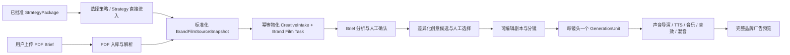

# 品牌广告统一入口与既有工作台接入技术方案

> 日期：2026-08-07
> 状态：已实施并完成本地验证
> 范围：Creative / 视频创作 / 品牌广告；Strategy → Creative 交接；人工 PDF Brief 入口
> 目标：把“可用策略、新建品牌广告、已有任务、人工 Brief”和现有 Brand Film Phase 0–4 / Audio A0–A4 接成一条可恢复、可追溯的生产链路

逐项源码、OpenAPI 与测试行号见[配套证据审计](../research/brand-advertising-strategy-integration-evidence-2026-08-07.md)。

## 1. 结论

品牌广告首页应成为一个**创作入口与任务恢复中心**，而不是直接展示某个固定 Fixture，也不应继续把“策略方向选择”和“Brand Film 创意候选选择”做成两次相似决策。

推荐冻结以下产品结构：

1. 左侧为“新建品牌广告”：优先列出当前 Project 下已经批准、可用于品牌视频的策略；同时提供“上传 PDF Brief”独立入口。
2. 右侧为“继续已有任务”：显示真实 Brand Film 任务、当前阶段、来源、更新时间和下一步，不重复创建任务。
3. Strategy 页面完成策略后提供“进入品牌广告创作”动作。服务端幂等创建或复用 CreativeIntake 与 Brand Film Task，随后深链到品牌工作台。
4. 策略入口和 PDF 入口都只负责形成同一种不可变 `BrandFilmSourceSnapshot`；后续全部复用现有的 Brief 确认、创意候选、剧本分镜、视频生成和声音导演工作台。
5. Strategy 的事实、约束和建议是上游不可变来源；Creative 用户可以编辑的是 Creative Overlay、Brief 分析版本、创意候选和 FilmPlan，不能反向改写 StrategyPackage。
6. 现有 Fixture 只保留为开发与回归入口，不再作为真实页面默认数据源。

本方案需要一处关键后端修正：当前 Strategy 品牌视频任务只创建通用 `VideoDraft`，而 `BrandFilmDraft` 只在 manual Fixture 分支中创建。必须抽出统一的 Brand Film 物化服务，使 Strategy 与人工 PDF 都能获得完整工作区。

## 2. 用户需求冻结

### 2.1 必须支持

- 浏览当前 Project 下已经生成并可用于品牌广告的策略。
- 选择一条策略创建品牌广告任务。
- 不依赖 Strategy，直接上传 PDF Brief 创建品牌广告任务。
- 在同一页面右侧查看并继续以前创建的品牌广告任务。
- Strategy 产出完成后，能够通过明确接口直接跳转到品牌广告创作。
- 进入任务后，恢复以前已开发的五阶段工作台：
  - Brief 确认；
  - 创意方向；
  - 剧本分镜；
  - 视频生成；
  - 声音导演。
- 刷新、浏览器后退、复制地址和从 Strategy 跨模块跳转后都能恢复同一任务与阶段。

### 2.2 本轮方案不包含

- 重写 Seedance、MiniMax TTS、FFmpeg 或 Audio A0–A4 的内部实现。
- 在品牌广告页重复建设素材检查和交付中心。
- 自动用最新 StrategyPackage 覆盖正在制作的任务。
- 把供应商 Prompt 或 API Key 暴露给普通用户。
- 把 Fixture 伪装成真实 PDF 解析结果。

## 3. 当前代码事实

### 3.1 已存在且应复用的能力

- `BrandFilmWorkspace` 与 `BrandFilmWorkbenchShell` 已包含五阶段工作台及单阶段导航。
- Creative OpenAPI 已提供按 `task_id` 读取 Brand Film Workspace，以及 Brief、Concept、Plan、Generation、Audio、Quality、Version/Delivery 的命令接口。
- 现有领域词汇已明确：`CreativeIntake` 是 Creative 拥有的标准化来源；`CreativeSourceVersion` 不可变；Brand Film 保持一镜头一个 `GenerationUnit`；重试新增 `GenerationAttempt`；声音调整不重生成画面。
- Strategy → Creative 已具备不可变 Handoff、Package/Handoff Hash、Route、readiness 与幂等 CreativeIntake 语义。
- Knowledge Document 服务已经支持 PDF 扫描、存储和文本解析，可作为 PDF Brief 的文档入口；Project Assets 继续承载用户补传或后续提取出的商品图、Logo 等图片资产。

### 3.2 当前断点

| 断点 | 当前表现 | 后果 |
| --- | --- | --- |
| 页面路由语义混杂 | 单个 `context` 既尝试表示 Intake，又尝试表示 Task | 刷新恢复依赖猜测，错误态与跳转难以解释。 |
| 任务完成后未挂载旧工作台 | Strategy 方向确认后只显示“品牌视频任务已就绪” | 用户无法继续 Brief、分镜、生成和音轨。 |
| 工作台仍绑定 Fixture | `BrandFilmWorkspace` 使用 `ensureBrandFilmFixtureWorkspace(projectId)` 装载和恢复 | 即使 URL 有真实 Task，也会打开固定娇兰工作区。 |
| BrandFilmDraft 物化条件错误 | `CreateVideoTask` 只在 `source=manual && route=brand_film` 时创建 `BrandFilmDraft` | Strategy 任务只有通用 VideoDraft，无法被旧工作台读取。 |
| 创意方向重复 | Strategy 交接页先生成并确认 CreativeDirection，Brand Film Phase 2 又生成 ConceptSet | 用户需要做两次相似选择，两个方向对象还可能冲突。 |
| 人工 PDF 只有文档解析基础设施 | Knowledge Document 已支持 PDF 文本，但尚无 PDF → Brand Film Intake → BrandFilmDraft 的正式链路 | 不能把“上传 PDF”只做成前端按钮。 |
| 缺少品牌入口聚合读模型 | 前端需自行拼 Strategy、Intake、Task 与 BrandFilmDraft | 页面复杂、容易重复任务，也会泄漏跨领域内部结构。 |
| OpenAPI 与实现存在漂移 | Go 的品牌任务创建会读取 `direction_id`，但当前 `CreateVideoTaskRequest` schema 未声明该字段；Brand Film schema 仍以娇兰 Fixture 字段为必需来源 | 接线前必须先升级契约并补契约测试，不能让前端继续依赖未声明字段。 |

## 4. 目标体验与页面信息架构

### 4.1 品牌广告首页

目标路由：

```text
/creative/video/brand
```

1440px 桌面布局使用 12 列栅格，左侧 7 列、右侧 5 列：

```text
┌──────────────────────────────────────────────────────────────────────────────┐
│ 视频创作 / 品牌广告                                     [上传 PDF Brief]   │
│ 从已确认策略或独立 Brief 开始，进入同一套品牌影片工作流。                   │
├─────────────────────────────── 7/12 ─┬─────────────────────── 5/12 ─────────┤
│ 新建品牌广告                          │ 继续已有任务                         │
│ [可用策略 6] [全部/可创建/有新版]      │ [进行中 3] [等待我处理 1]             │
│                                       │                                      │
│ ○ 娇兰 25X 蜂皇水                     │ 娇兰 25X 蜂皇水                       │
│   抖音 · 15 秒 · 策略 v3 · 可创建      │ Brief 已确认 · 12 分钟前               │
│   单一主张 / 关键限制 / 资产就绪       │ 来源：策略 v3              [继续]     │
│                         [查看] [开始]  │                                      │
│                                       │ 行李箱品牌片                           │
│ ○ 夏季新品品牌心智                    │ 剧本分镜待确认 · 昨天                  │
│   小红书 · 30 秒 · 策略 v2 · 缺 Logo   │ 来源：PDF Brief            [继续]     │
│                         [补充] [开始]  │                                      │
│                                       │ [查看全部品牌任务]                     │
│ ────────────────────────────────────  │                                      │
│ 没有策略也可以创作                    │                                      │
│ 拖入或选择 PDF，解析后仍由你确认       │                                      │
│ [选择 PDF Brief]                      │                                      │
└───────────────────────────────────────┴──────────────────────────────────────┘
```

视觉落点依次为：

1. 当前可开始的策略；
2. 一个明确的“开始创作”主操作；
3. 右侧可恢复的现有任务。

不要把每个策略做成巨大的营销卡片。采用紧凑的可扫描列表行，只在选中项展开主张、风险与资产摘要。右侧任务卡高度稳定，最多首屏显示 4–5 条，其余进入“查看全部”。

### 4.2 入口状态与按钮语义

| 来源状态 | 主操作 | 行为 |
| --- | --- | --- |
| 可创建且没有关联任务 | 开始创作 | 幂等创建 Intake + Brand Film Task，进入 Brief。 |
| 已有关联任务 | 继续创作 | 打开原 Task，不创建副本。 |
| Strategy 已有新版本 | 查看差异 | 用户明确选择“继续旧版本”或“基于新版本创建新版任务”。 |
| Planning 可用但 Generation 阻塞 | 开始完善 | 允许进入 Brief，阻塞项在工作台内显示；不调用 Provider。 |
| Planning 阻塞 | 补充策略 | 返回 Strategy 对应问题或打开只读原因，不生成空任务。 |
| PDF 已选、尚未上传 | 上传并解析 | 创建上传会话，文件入库后开始解析任务。 |
| PDF 正在解析 | 查看进度 | 恢复 ingestion job；不靠页面常驻等待。 |
| PDF 解析失败 | 重试解析 / 更换文件 | 保留已上传 AssetVersionRef 和错误分类。 |

### 4.3 任务工作台

目标路由：

```text
/creative/video/brand/tasks/:taskId?stage=brief
/creative/video/brand/tasks/:taskId?stage=concept
/creative/video/brand/tasks/:taskId?stage=storyboard
/creative/video/brand/tasks/:taskId?stage=generation
/creative/video/brand/tasks/:taskId?stage=audio
```

进入任务后不再显示首页两栏，也不保留 Project Media 大横幅。顶部仅显示：任务名、来源、源版本短 Hash、当前修订、保存状态、“资料与来源”和“返回品牌广告”。正文复用已有单阶段工作台。

旧查询参数路由可以在迁移期 `replace` 到新路径：

```text
?view=品牌广告&context=<task_id> → /creative/video/brand/tasks/<task_id>
```

不得再用一个 `context` 同时猜测 Intake ID 与 Task ID。

### 4.4 视觉与细节规范

方案继承仓库 `DESIGN.md` 的 Intelligent Blueprint：

- 页面背景 `mineral.50`，内容面 `mineral.0`，钴蓝面积控制在约 10%。
- H1 使用 24/32、H2 使用 20/28、正文 14/22、紧凑列表 13/20、元数据最小 11/16；不再使用 8–10px 正文。
- 常规面板圆角 8px，上传区域和重要媒体容器圆角 12px；边框承担分组，阴影只用于浮层和选中悬浮，不做“卡片海”。
- 主按钮只用于当前页面唯一主动作；“查看来源、查看差异、继续旧版”使用次按钮或文字按钮。
- 选中策略使用浅钴蓝底、左侧 2px 钴蓝标记和勾选图标，不使用大面积实心蓝。
- 状态同时使用文案与图标，不能只通过颜色表达。
- 1280、1440、1680 宽度及浏览器 90%–125% 缩放必须无重叠、无横向遮挡。
- 真正实施 UI 前先输出 1440px 首页与任务工作台视觉概念图，经确认后再写样式；概念图必须沿用当前导航壳、字体和设计 Token。

## 5. 唯一用户链路



### 5.1 创意方向只选择一次

统一定义如下：

- Strategy 提供 `single_minded_proposition`、受众、证据、品牌边界、渠道约束、推荐表达领地等**策略事实和方向种子**。
- Brand Film Phase 2 的 `CreativeConceptSet` 提供面向具体影片执行的叙事机制、品牌进入方式、视觉语言和声音设计，由用户选择并可编辑。
- 当前独立 `CreativeDirectionVersion` 不再作为创建 Brand Film Task 的强制前置条件。已有 Direction 可作为 `upstream_direction_seed_ref` 进入 SourceSnapshot 或映射为 Phase 2 的候选种子，但不能再展示第二个方向确认门。
- 图文或其他业务仍可继续使用独立 CreativeDirection API；本方案只收敛 Brand Film 路径。

这与既有链路一致：**Brief 确认 → 创意候选 → 剧本分镜 → 生成 → 声音**。

## 6. 领域设计

### 6.1 统一来源快照

扩展 `BrandFilmSourceSnapshot`，保留对旧 Fixture 的兼容读取：

```go
type BrandFilmSourceSnapshot struct {
    ContractVersion      string // brand-film-source-snapshot/v2
    SourceKind           string // strategy_package | manual_pdf | fixture
    IntakeID             string
    SelectedRouteID      string
    InputIdentityHash    string

    StrategyPackageRef   *StrategyPackageRef
    HandoffContentHash   string
    UpstreamDirectionRef *CreativeDirectionRef

    BriefDocumentRef     *KnowledgeDocumentVersionRef
    BriefName            string
    BriefContentHash     string

    ProductName          string
    Channel              string
    DurationSeconds      int
    AspectRatio          string
    CreativeView         BrandFilmCreativeView
    AssetCandidates      []BrandFilmSourceAsset
    EvidenceRefs         []string
    RightsSummary        RightsSummary
}
```

规则：

1. SourceSnapshot 在 Task 创建时冻结；上游新版本只产生“有新版”提示。
2. `StrategyPackageRef` 与 `BriefDocumentRef` 二选一，Fixture 仅测试环境使用。
3. 浏览器不回传完整 Strategy Handoff；Creative 服务通过 `StrategyHandoffReader` 重新读取并验证 Hash。
4. PDF 原文件先成为 Project 级 Knowledge Document；Creative 只保存文档 ID、版本、内容 Hash 和解析版本，不保存浏览器文件或临时 URL。
5. 当前 PDF 管道只保证文本解析，不能宣称已提取内嵌商品图或 Logo；这些图片只有进入 Project Assets 并获得真实 `AssetVersionRef` 后才能展示为可确认候选。
6. Strategy 事实只读；用户修改保存到 BriefAnalysisVersion / Creative Overlay，不修改 SourceSnapshot。

### 6.2 深模块边界

新增一个内部意图级 seam：

```go
type BrandFilmMaterializer interface {
    CreateOrGetFromIntake(
        ctx context.Context,
        actor ActorContext,
        projectID ProjectID,
        intakeID string,
        command CreateBrandFilmTaskCommand,
    ) (BrandFilmWorkspace, error)
}
```

它负责：

- 校验 Project、Intake、Route、readiness 与幂等键；
- 用 Strategy adapter 或 Manual PDF adapter 构建统一 SourceSnapshot；
- 创建 `CreativeTask`、兼容通用 `VideoDraft` 和真实 `BrandFilmDraft`；
- 建立 `(project_id, intake_id, selected_route_id, input_identity_hash)` 唯一关系；
- 返回真实 `task_id`、工作区状态与默认阶段；
- 已存在同源 Task 时返回原对象，不复制任务。

`Service.CreateVideoTask` 不应继续包含一大段 `if source == manual` 的 Brand Film 特例。它可以调用该 materializer，或为 Brand Film 增加明确命令端点；其他视频类型保持原逻辑。

### 6.3 首页聚合读模型

Creative 前端不应分别拉 Strategy 表、Intake 表、Task 表再自行关联。建议增加只读查询：

```http
GET /api/creative/v1/projects/{project_id}/brand-film/creation-hub
```

响应示例：

```json
{
  "contract_version": "brand-film-creation-hub/v1",
  "strategy_sources": [
    {
      "source_id": "strategy_package_03@v3#route_brand_video",
      "package_ref": {},
      "title": "娇兰 25X 蜂皇水",
      "single_minded_proposition": "轻盈补水，承载品牌修护科技",
      "channel": "douyin",
      "duration_seconds": 15,
      "readiness": {},
      "source_hash": "sha256:...",
      "linked_task_id": null,
      "newer_source_available": false,
      "updated_at": "..."
    }
  ],
  "tasks": [
    {
      "task_id": "creativetask_...",
      "title": "娇兰 25X 蜂皇水",
      "source_kind": "strategy_package",
      "source_label": "策略 v3",
      "stage": "brief_confirmed",
      "next_action": "生成创意候选",
      "updated_at": "..."
    }
  ],
  "manual_pdf_capability": {
    "enabled": true,
    "accepted_mime_types": ["application/pdf"],
    "max_bytes": 0
  }
}
```

该 read model 只返回卡片所需字段。Strategy 一侧需要新增或扩展只读 catalog seam，以列出“已批准且含 brand_video route”的 Handoff；不得让 Creative Repository 直接读取 Strategy 数据表。

### 6.4 PDF ingestion

PDF 入口采用可恢复异步任务：

```text
selected → uploading → uploaded → parsing → analysis_ready
                                      ├→ needs_input
                                      └→ failed
```

建议接口：

```http
POST /platform/v1/projects/{project_id}/knowledge/documents
GET  /platform/v1/projects/{project_id}/knowledge/documents

POST /api/creative/v1/projects/{project_id}/brand-film-brief-ingestions
GET  /api/creative/v1/projects/{project_id}/brand-film-brief-ingestions/{ingestion_id}
POST /api/creative/v1/projects/{project_id}/brand-film-brief-ingestions/{ingestion_id}:create-task
```

`create-task` 内部创建 manual CreativeIntake，再调用同一个 BrandFilmMaterializer。解析结果是待确认 Brief 草稿，不因 AI 给出低置信度结果而自动进入生成阶段。

首版必须诚实显示“文本已解析，商品图/Logo 待补传”，并复用现有图片 Asset 上传与 Phase 1 替换能力。后续再增加 PDF page render / embedded image extraction，把页码、bounding box 和真实 `AssetVersionRef` 写入候选；在此之前不得显示假的商品图或 Logo 缩略图。

## 7. API 与路由契约

### 7.1 新增或补齐的最小接口

| 接口 | 用途 | 备注 |
| --- | --- | --- |
| `GET /brand-film/creation-hub` | 首页策略来源与任务聚合 | 服务端完成跨域关联。 |
| `POST /creative-intakes/{id}:create-brand-film-task` | 幂等创建/复用 Brand Film Task | 返回完整 workspace 或 task locator。 |
| `GET /creative-tasks/{task_id}/brand-film` | 按真实 Task 恢复旧工作台 | OpenAPI 已存在，前端客户端需要补齐。 |
| `POST /brand-film-brief-ingestions` | 从已存储的 Knowledge Document 启动品牌 Brief 解析 | 返回持久化 job。 |
| `GET /brand-film-brief-ingestions/{id}` | 刷新后恢复解析状态 | 不依赖长连接。 |
| `POST /brand-film-brief-ingestions/{id}:create-task` | 形成 manual Intake + Task | 调用同一 materializer。 |

所有创建/生成命令使用 `Idempotency-Key`。修改 Brief、Concept、FilmPlan 和 AudioMix 继续使用现有 revision / expected revision 机制。

### 7.2 Strategy 直接跳转

Strategy 完成页不拼装 Creative 工作台数据，只发出意图：

```http
POST /api/creative/v1/projects/{project_id}/creative-intakes
Idempotency-Key: strategy-handoff:{package_id}:{version}:{route_id}
```

随后调用：

```http
POST /api/creative/v1/projects/{project_id}/creative-intakes/{intake_id}:create-brand-film-task
Idempotency-Key: brand-film:{intake_id}:{input_identity_hash}
```

成功响应：

```json
{
  "task_id": "creativetask_123",
  "workspace_revision": 1,
  "stage": "waiting_brief",
  "open_url": "/creative/video/brand/tasks/creativetask_123?stage=brief"
}
```

前端只导航到同源相对路径；服务端仍以 `task_id` 和权限检查为准，不把 `open_url` 当授权凭据。重复点击返回同一 Task。

### 7.3 前端装载契约

`BrandFilmWorkspace` 改为显式接收 Task：

```ts
type BrandFilmWorkspaceProps = {
  projectId: string
  taskId: string
  initialStage?: BrandFilmStage
  onNotice(message: string): void
}
```

装载顺序：

1. 从路由读取 `projectId / taskId / stage`；
2. 调用 `GET /creative-tasks/{task_id}/brand-film`；
3. 由工作区事实派生开放阶段与默认阶段；
4. URL 请求了未开放阶段时显示原因，并提供“前往待完成阶段”；
5. 409 冲突保留本地草稿并展示比较/刷新动作；
6. 只有显式开发路由允许调用 `ensureBrandFilmFixtureWorkspace`。

## 8. 前端组件方案

```text
src/features/brand-film/
  hub/
    BrandFilmHubPage.tsx
    BrandFilmHubHeader.tsx
    StrategySourceList.tsx
    StrategySourceRow.tsx
    ManualBriefUploader.tsx
    BrandFilmTaskList.tsx
    BrandFilmTaskCard.tsx
    useBrandFilmCreationHub.ts
  entry/
    useCreateBrandFilmTask.ts
    PdfBriefIngestionPanel.tsx
    SourceVersionDiffDialog.tsx
  workspace/
    BrandFilmWorkspacePage.tsx
    BrandFilmSourceBar.tsx
    ProjectContextDrawer.tsx
  model/
    creation-hub.ts
    workspace-route.ts
    stage.ts
```

职责边界：

- Hub 只负责发现来源、创建/恢复任务和上传状态，不加载五阶段重媒体。
- Workspace 只接收真实 `taskId`，不查询“最新 Fixture”。
- Stage 组件只编辑本阶段草稿，不决定跨阶段业务状态。
- Strategy 卡片只展示只读事实与 readiness；用户的修改从 Brief 阶段开始。
- 任务列表来源于后端 read model，不能用卡片标题或数组位置推断关联关系。

必须覆盖的界面状态：loading、空策略、空任务、部分失败、权限只读、策略阻塞、策略有新版、PDF 上传中、解析中、解析失败、任务物化冲突、工作区不存在、旧任务待迁移。

## 9. 旧数据迁移与兼容

### 9.1 已有 Strategy 品牌任务

当前已有一些 Task 只有通用 `VideoDraft`，没有 `BrandFilmDraft`。不能删除或让它们静默消失。提供幂等升级命令或首次读取时的显式迁移：

```text
generic brand VideoDraft + valid Intake lineage
  → build source snapshot
  → append BrandFilmDraft revision 1
  → preserve original task_id / created_at / direction lineage
```

迁移失败时首页标记“需要修复”，提供 request id，不回退到 Fixture。

### 9.2 Fixture

- 保留现有娇兰 Fixture、测试和开发命令。
- Fixture 入口移到开发工具或显式 `?fixture=guerlain`，生产首页不自动创建。
- Fixture 和真实 Strategy/PDF 任务使用相同 BrandFilmDraft schema 与工作台读取接口。

### 9.3 旧 URL

- 旧 `context=task_id` 可重定向到新 task path。
- 旧 `context=intake_id` 先查关联 Task；存在则跳转，不存在则显示可解释的“继续创建任务”，不能继续猜 ID 类型。
- 浏览器后退恢复 Hub 的筛选与滚动位置；阶段切换只改变任务内 `stage`，不返回页面顶部。

## 10. 分阶段实施顺序

### E0：视觉概念与契约冻结

- 输出 1440px 品牌首页和 Task 工作台两张视觉概念图。
- 冻结 Hub read model、SourceSnapshot v2、Task 路由和幂等键。
- 固定 Strategy、PDF、旧 Task 三条验收 Fixture。

验收：产品确认首页 7/5 布局、卡片密度、入口文案和工作台顶部结构；前后端可并行开发。

### E1：统一 Brand Film 物化 seam

- 抽出 BrandFilmMaterializer。
- Strategy 与 manual PDF 来源都能创建 BrandFilmDraft。
- 移除 Brand Film 对“必须先确认独立 CreativeDirection”的强制门禁，已有方向作为可选种子。
- 增加唯一关系、幂等与旧 Strategy Task 升级测试。

验收：相同 Intake 重放返回同一 Task；两种来源产出同 schema；Strategy Task 可被 `GET .../brand-film` 读取。

### E2：真实 Task 工作台接线

- 前端补齐 `getBrandFilmWorkspace(projectId, taskId)`。
- `BrandFilmWorkspace` 接收真实 taskId，Fixture ensure 只留开发入口。
- 新建 task path，迁移旧 context 路由。
- 挂载现有 Brief、Concept、Storyboard、Generation 和 Audio 组件。

验收：从一个已有 Strategy Task 进入后能完成 Phase 1–Audio；刷新、后退和复制 URL 可恢复。

### E3：品牌广告 Hub

- 实现 creation-hub read model。
- 开发左侧策略来源、右侧任务列表与全部空/错/阻塞状态。
- 已有关联 Task 的策略显示“继续创作”，不重复创建。

验收：首页能够区分新建、继续、有新版和阻塞四种状态；1280/1440/1680 无重叠。

### E4：Strategy 直接进入 Creative

- Strategy 完成页接入幂等 Intake + Brand Film Task 命令。
- 成功后按 task path 深链；失败保留 Strategy 页面与可重试信息。
- 加入 `return_to` 仅用于用户返回体验，不参与业务身份。

验收：重复点击不会创建重复任务；权限、Project 和 Hash 不匹配会被服务端拒绝；成功直接进入 Brief。

### E5：人工 PDF Brief

- 复用 Knowledge Document 的 PDF 扫描、存储和文本解析。
- 增加可恢复 PDF ingestion job、手动 Intake adapter 和状态 UI。
- 从解析结果创建 Task 后进入同一 Brief 确认台。
- A 版明确提示商品图与 Logo 待补传；图片获得真实 AssetVersionRef 后支持确认和替换。
- B 版再接入 PDF 页面渲染或内嵌图片提取，并支持单项重新识别。

验收：无 Strategy 也能创建真实任务；解析失败可重试；刷新不丢 job；低置信度结果不会自动确认。

### E6：旧数据、体验与回归收敛

- 升级既有 generic brand tasks。
- 完成滚动位置、焦点、键盘、冲突、加载和视觉回归。
- 完整验收 Seedance 每镜头生成、局部 Attempt、Audio A0–A4 和最终混音预览。

验收：生产入口无 Fixture；旧任务不丢失；所有必要 CI 检查通过。

## 11. 测试矩阵

### 11.1 后端与契约

- Strategy Handoff Hash、Package Hash、Project、Route 和权限验证。
- Strategy 与 PDF 两种来源生成等价结构的 BrandFilmDraft。
- 同幂等键同请求返回同 Task；同键不同请求返回冲突。
- 同 source identity 不重复创建 Task。
- 上游 Strategy 新版本不覆盖旧 SourceSnapshot。
- 旧 generic Brand Task 升级保留 Task ID 与 lineage。
- PDF 解析 job 的 queued/running/ready/needs_input/failed 恢复。
- Brand Film 一镜头一个 GenerationUnit；重试只新增当前 Attempt。

### 11.2 前端

- Hub 左策略、右任务、PDF 入口及全部状态。
- “开始创作”与“继续创作”行为不会互换。
- Strategy 直接深链、旧 URL 迁移、浏览器后退和滚动恢复。
- Task Workspace 只按 taskId 读取，不调用 Fixture ensure。
- Brief 可编辑/保存/确认；Concept 只出现一次方向决策。
- Storyboard、Generation、Audio 原闭环无回退。
- 1280、1440、1680；90%、100%、125%；Chrome/Edge/Safari 当前与前一主要版本。

### 11.3 联合验收主路径

1. Strategy 批准 → 进入品牌广告 → Brief 确认 → 创意选择 → 分镜确认 → 每镜头生成 → Audio 混音。
2. 品牌广告首页选择同一 Strategy → 直接继续同一 Task。
3. 上传 PDF → 解析 → 人工确认商品图/Logo → 完成相同五阶段。
4. 中途刷新、切换 Project、返回 Hub、再次进入后，阶段、修订和来源均一致。
5. Strategy 发布新版时，旧任务不变；用户可比较并显式创建新版任务。

## 12. 风险与约束

| 风险 | 处理 |
| --- | --- |
| 将 Strategy 建议当作 Creative Concept | 通过 `upstream_direction_seed_ref` 明确它只是种子；Phase 2 仍是唯一执行方向决策。 |
| 前端聚合多个领域导致重复与竞态 | 使用 creation-hub 服务端读模型。 |
| PDF 上传成功但解析失败 | Asset 与 ingestion job 分离，允许基于同一 Asset 重试。 |
| 上游新版静默污染制作中任务 | SourceSnapshot 不可变，只提示差异并显式派生新任务。 |
| 旧 Strategy Task 无 BrandFilmDraft | 提供幂等升级，不回退到 Fixture。 |
| 页面再次变成长表单 | Hub 与 Workspace 分路由；Workspace 同时只渲染一个阶段。 |
| 样式改造破坏已跑通业务 | 先冻结视觉与路由，再按 E1–E6 小批次交付，每阶段保留回归门。 |

## 13. Definition of Done

该接线只有同时满足以下条件才算完成：

1. 品牌广告首页真实展示可用 Strategy、现有 Task 和人工 PDF 入口。
2. Strategy CTA 与首页 Strategy 卡片幂等打开同一 Task。
3. PDF 不经过 Strategy 也能形成真实 CreativeIntake、BrandFilmDraft 和 Task。
4. 两种来源进入同一个按 taskId 装载的五阶段工作台。
5. Creative 方向只选择一次，Strategy 事实与 Creative 编辑层边界清楚。
6. 旧 Task、旧 URL 和 Fixture 都有明确兼容路径，用户数据不丢失。
7. 刷新、后退、深链、冲突和异步失败可恢复。
8. 现有 Brief、Generation、Audio A0–A4 能力没有因接线被简化或复制。
9. 前端符合 `DESIGN.md`，1280–1680 与 90%–125% 缩放无重叠。
10. 契约测试、Go 测试、前端测试、构建、浏览器主路径和 CI 全部通过。

## 14. 仓库依据

- `DESIGN.md`
- `docs/19-module-navigation-architecture.md`
- `docs/25-strategy-to-creative-development-contract-v2.md`
- `docs/research/brand-advertising-module-technical-research-2026-07-31.md`
- `docs/research/brand-film-frontend-workbench-redesign-technical-plan-2026-08-05.md`
- `docs/research/brand-film-audio-track-technical-design-2026-08-04.md`
- `internal/systems/creative/CONTEXT.md`
- `internal/systems/creative/service.go`
- `internal/systems/creative/brand_film*.go`
- `api/openapi/creative-v1.yaml`
- `api/openapi/strategy-v1.yaml`
- `api/contracts/strategy-creative-handoff-v1.schema.json`
- `api/contracts/creative-brand-film-draft-v1.schema.json`
- `src/components/SpecializedPages.tsx`
- `src/components/BrandFilmWorkspace.tsx`
- `src/features/brand-film/BrandFilmWorkbenchShell.tsx`
- `src/data/api.ts`
