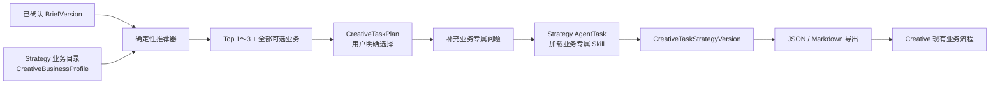

# Strategy 创意业务推荐与任务策略技术实现方案（含反方评审）

| 属性 | 内容 |
| --- | --- |
| 日期 | 2026-07-30 |
| 状态 | 待技术评审 |
| Owner | Strategy |
| 关联调研 | `docs/research/strategy-creative-capability-alignment-2026-07-30.md` |
| Creative 代码依赖 | MVP 无 |
| 建议结论 | 有条件通过，按本文修正版实施 |

## 1. 执行摘要

本方案在 Strategy 内新增三个领域对象：

1. `CreativeBusinessProfile`：版本化创意业务定义。
2. `CreativeTaskPlan`：用户选择、推荐快照和专属问题答案。
3. `CreativeTaskStrategyVersion`：基于选定业务生成的不可变任务策略。

完整链路：



核心技术选择：

- 业务内容以 Git 中的嵌入式 JSON 为发布源，以 MySQL 为运行时目录和历史版本库。
- 推荐由 Go 的受限规则解释器完成，不让大模型决定最终排名。
- 动态问题使用内部受限类型，不引入通用 JSON Schema 表单库。
- 任务策略使用独立契约，不修改现有 `strategy-draft/v1`、`strategy-draft/v2`。
- 新增独立 AgentTask 类型，不侵入当前普通策略生成。
- MVP 不访问、下载或缓存第三方参考视频。
- 先通过 JSON/Markdown 与 Creative 交接，不等待 Creative 修改代码。

## 2. 目标与非目标

### 2.1 MVP 目标

- Strategy SQL 中可查询七类创意业务。
- 根据已确认 Brief 推荐 1～3 个业务并解释原因。
- 用户可选择任意可选业务，包括非推荐业务。
- 选择后显示对应补充问题。
- 根据 Brief、答案和业务 Skill 生成任务级策略。
- 全程记录 Brief、Profile、Skill、答案和输出版本。
- 不调用 Creative API 也能完成用户流程。

### 2.2 MVP 非目标

- 不判断 Creative 此刻是否有模型、额度、白名单或渲染资源。
- 不自动创建 CreativeTask。
- 不自动抓取或解析公开视频。
- 不把 Prompt、脚本、分镜或模型参数交给 Strategy。
- 不升级现有 StrategyPackage/Handoff 契约。
- 不建设通用低代码规则平台或表单平台。
- 不提供线上业务目录编辑后台。
- 不根据单次创意效果自动修改推荐规则。

## 3. 与现有代码的集成原则

### 3.1 复用现有能力

当前代码已有以下可复用机制：

- `strategy.Service` 的组织、项目和 Scope 鉴权。
- `strategy_idempotency_receipts` 的写接口幂等。
- `If-Match`、`expected_version` 和 `ErrVersionConflict` 乐观锁。
- `platform_agent_tasks`、JobRuntime 和最终失败回调。
- `platform_skill_runs` 的模型执行审计。
- `contract.CanonicalJSONHash` 的规范化内容 Hash。
- Strategy 的 forward-only MySQL migration。
- React API client、Workspace hook 和错误处理。
- `api/openapi/strategy-v1.yaml` 及 `api/contracts` 契约文件。

### 3.2 不直接复用的部分

- 不复用 `creative_route.go` 的硬编码 Route 生成作为推荐器。
- 不把业务目录塞进 Provider capability。
- 不把业务选择追加到现有 `StrategyDocument`。
- 不让普通 `Registry.Select(channels, objective)` 自动选中创意任务 Skill。
- 不将完整业务 Profile 和长 Prompt 同时维护在 SQL 中。

## 4. 领域模型

### 4.1 CreativeBusinessProfile

表达一个不可变业务定义版本。

```go
type CreativeBusinessProfile struct {
    BusinessCode      string
    Generation        int64
    Version           string
    DisplayName       string
    Summary           string
    Lifecycle         string
    Selectable        bool
    DisplayOrder      int
    MatchRules        []RecommendationRule
    Questions         []QuestionDefinition
    Requirements      BusinessRequirements
    OutputFields      []OutputFieldDefinition
    ReferencePolicy   ReferenceUsePolicy
    SkillName         string
    SkillVersion      string
    SkillContentHash  string
    ContentHash       string
    Owner             string
    ReviewedBy        string
    ReviewedAt        *time.Time
    PublishedAt       time.Time
}
```

约束：

- `(business_code, generation)` 唯一。
- `(business_code, version)` 唯一。
- 发布后不可更新。
- 停用业务通过发布更高 `generation` 的 `retired` 版本完成。
- 历史 Plan 始终引用原版本，不跟随当前版本变化。

### 4.2 CreativeTaskPlan

表达一次具体创意任务的业务选择和补充输入。

```go
type CreativeTaskPlan struct {
    ID                     string
    OrganizationID         contract.OrganizationID
    ProjectID              contract.ProjectID
    BriefID                string
    BriefVersion           int64
    BriefContentHash       string
    SourceStrategyID       string
    SourceStrategyRevision int64
    SourceStrategyHash     string
    Status                 string
    BusinessCode           string
    BusinessGeneration     int64
    BusinessVersion        string
    BusinessContentHash    string
    SkillName              string
    SkillVersion           string
    SkillContentHash       string
    SelectionSource        string
    RecommendationSnapshot RecommendationSnapshot
    Answers                map[string]json.RawMessage
    Completeness           PlanCompleteness
    CurrentRevision        int64
    CurrentStrategyVersion int64
    CurrentAgentTaskID     string
    Version                int64
    CreatedBy              string
    CreatedAt              time.Time
    UpdatedAt              time.Time
}
```

状态：

```text
collecting → ready → generating → generated
     ↑          │          │
     └──────────┘          └→ failed → ready

任意非 generating 状态 → superseded
```

规则：

- 创建 Plan 即代表用户已明确选择业务。
- Plan 至少绑定不可变 BriefVersion；如果用户从已有总策略进入，也可以同时绑定一个不可变 StrategyRevision。
- Brief 是已确认事实源；StrategyRevision 只能提供派生判断，不能覆盖 Brief 事实。
- `selection_source` 仅允许 `recommended` 或 `manual`。
- 在首次生成前可以切换业务；切换时创建 Revision，并清空不兼容答案。
- 首次生成后如需切换业务，创建新 Plan，不修改原 Plan 的业务语义。
- 修改答案增加 `current_revision` 和 `version`。
- 每个 Revision 保存完整快照，不只存 patch。

### 4.3 CreativeTaskStrategyVersion

表达一次成功生成的不可变结果。

```go
type CreativeTaskStrategyDocument struct {
    ContractVersion    string                 `json:"contract_version"`
    PlanRef            VersionedResourceRef   `json:"plan_ref"`
    BusinessRef        CreativeBusinessRef    `json:"business_ref"`
    Objective          string                 `json:"objective"`
    Audience           StrategyAudience       `json:"audience"`
    CoreMessage        string                 `json:"core_message"`
    MessageHierarchy   []string               `json:"message_hierarchy"`
    Hypotheses         []TaskHypothesis       `json:"hypotheses"`
    BusinessStrategy   map[string]any         `json:"business_strategy"`
    ClaimsAndEvidence  []string               `json:"claims_and_evidence"`
    AssetRequirements  []TaskAssetRequirement `json:"asset_requirements"`
    Guardrails         []string               `json:"guardrails"`
    ReferenceUse       ReferenceUse           `json:"reference_use"`
    OpenQuestions      []string               `json:"open_questions"`
    Lineage            TaskStrategyLineage    `json:"lineage"`
}
```

禁止字段：

- `script`
- `dialogue`
- `storyboard`
- `shot`
- `camera`
- `model_prompt`
- `seedance_prompt`
- `timeline`
- `creative_version`

服务端验证器除检查必填项外，还要递归拒绝以上保留字段。

## 5. 目录发布机制

### 5.1 Source of truth

建议以 Git 中的 Profile JSON 为发布源：

```text
internal/systems/strategy/creativecatalog/
├── registry.go
├── validate.go
├── hash.go
└── profiles/
    ├── xiaohongshu-image-text-v1.json
    ├── wechat-official-article-v1.json
    ├── short-drama-preroll-v1.json
    ├── game-preroll-v1.json
    ├── commerce-preroll-v1.json
    ├── viral-remake-v1.json
    └── brand-video-v1.json
```

启动流程：

```text
go:embed 读取 JSON
→ 反序列化为强类型结构
→ 业务校验
→ 计算 canonical content hash
→ INSERT IGNORE 新版本
→ 读取数据库行并核对 hash
→ 同版本不同 hash：启动失败
```

这样：

- Creative 可以评审可读 JSON，不需要写 SQL。
- 所有内容变更进入代码评审。
- MySQL 仍是运行时查询和历史引用的数据源。
- 多实例并发启动仍然幂等。
- 已发布版本不会被静默覆盖。

### 5.2 为什么不直接手工改生产 SQL

手工 SQL 会带来：

- 无法稳定 review 规则和问题。
- Profile 与 Skill 容易版本错配。
- 测试环境和生产环境内容漂移。
- 同一版本内容可能被覆盖。

因此生产环境只允许发布新 Profile 文件，不开放通用在线编辑。

## 6. MySQL 设计

新增 migration：

```text
migrations/strategy/20260730100000_strategy_creative_task_planning.up.sql
```

### 6.1 业务定义版本

```sql
CREATE TABLE strategy_creative_business_profiles (
  business_code VARCHAR(64) NOT NULL,
  generation BIGINT NOT NULL,
  version VARCHAR(32) NOT NULL,
  display_name VARCHAR(120) NOT NULL,
  summary VARCHAR(500) NOT NULL,
  lifecycle VARCHAR(24) NOT NULL,
  selectable BOOLEAN NOT NULL,
  display_order INT NOT NULL,
  profile JSON NOT NULL,
  content_hash VARCHAR(71) NOT NULL,
  skill_name VARCHAR(120) NOT NULL,
  skill_version VARCHAR(32) NOT NULL,
  skill_content_hash VARCHAR(71) NOT NULL,
  owner VARCHAR(120) NOT NULL,
  reviewed_by VARCHAR(120) NULL,
  reviewed_at DATETIME(6) NULL,
  published_at DATETIME(6) NOT NULL,
  PRIMARY KEY (business_code, generation),
  UNIQUE KEY uq_strategy_creative_business_version
    (business_code, version),
  UNIQUE KEY uq_strategy_creative_business_hash
    (business_code, content_hash),
  KEY idx_strategy_creative_business_current
    (business_code, generation, lifecycle, selectable),
  CONSTRAINT chk_strategy_creative_business_lifecycle
    CHECK (lifecycle IN ('draft', 'active', 'deprecated', 'retired'))
);
```

当前版本查询按每个 `business_code` 在非 `draft` 版本中的最大 `generation` 选择，不能用字符串排序 SemVer。最大 generation 如果是 `retired`，该业务保留历史可读但不再允许新选择。

### 6.2 任务计划

```sql
CREATE TABLE strategy_creative_task_plans (
  id VARCHAR(96) NOT NULL PRIMARY KEY,
  organization_id VARCHAR(96) NOT NULL,
  project_id VARCHAR(96) NOT NULL,
  brief_id VARCHAR(96) NOT NULL,
  brief_version BIGINT NOT NULL,
  brief_content_hash VARCHAR(71) NOT NULL,
  source_strategy_id VARCHAR(96) NULL,
  source_strategy_revision BIGINT NULL,
  source_strategy_content_hash VARCHAR(71) NULL,
  status VARCHAR(24) NOT NULL,
  business_code VARCHAR(64) NOT NULL,
  business_generation BIGINT NOT NULL,
  business_version VARCHAR(32) NOT NULL,
  business_content_hash VARCHAR(71) NOT NULL,
  skill_name VARCHAR(120) NOT NULL,
  skill_version VARCHAR(32) NOT NULL,
  skill_content_hash VARCHAR(71) NOT NULL,
  selection_source VARCHAR(24) NOT NULL,
  recommendation_snapshot JSON NOT NULL,
  answers JSON NOT NULL,
  completeness JSON NOT NULL,
  current_revision BIGINT NOT NULL,
  current_strategy_version BIGINT NOT NULL DEFAULT 0,
  current_agent_task_id VARCHAR(96) NULL,
  version BIGINT NOT NULL,
  created_by VARCHAR(96) NOT NULL,
  created_at DATETIME(6) NOT NULL,
  updated_at DATETIME(6) NOT NULL,
  UNIQUE KEY uq_strategy_creative_plan_scope
    (organization_id, project_id, id),
  KEY idx_strategy_creative_plan_brief
    (organization_id, project_id, brief_id, brief_version, created_at),
  CONSTRAINT chk_strategy_creative_plan_status
    CHECK (status IN (
      'collecting', 'ready', 'generating',
      'generated', 'failed', 'superseded'
    )),
  CONSTRAINT chk_strategy_creative_selection_source
    CHECK (selection_source IN ('recommended', 'manual'))
);
```

### 6.3 任务计划 Revision

```sql
CREATE TABLE strategy_creative_task_plan_revisions (
  plan_id VARCHAR(96) NOT NULL,
  revision BIGINT NOT NULL,
  organization_id VARCHAR(96) NOT NULL,
  project_id VARCHAR(96) NOT NULL,
  base_revision BIGINT NULL,
  snapshot JSON NOT NULL,
  content_hash VARCHAR(71) NOT NULL,
  change_reason VARCHAR(120) NOT NULL,
  created_by VARCHAR(96) NOT NULL,
  created_at DATETIME(6) NOT NULL,
  PRIMARY KEY (organization_id, project_id, plan_id, revision),
  UNIQUE KEY uq_strategy_creative_plan_revision_hash
    (organization_id, project_id, plan_id, content_hash)
);
```

### 6.4 任务策略版本

```sql
CREATE TABLE strategy_creative_task_strategy_versions (
  plan_id VARCHAR(96) NOT NULL,
  version BIGINT NOT NULL,
  organization_id VARCHAR(96) NOT NULL,
  project_id VARCHAR(96) NOT NULL,
  plan_revision BIGINT NOT NULL,
  contract_version VARCHAR(64) NOT NULL,
  document JSON NOT NULL,
  content_hash VARCHAR(71) NOT NULL,
  generation_context_hash VARCHAR(71) NOT NULL,
  agent_task_id VARCHAR(96) NOT NULL,
  skill_name VARCHAR(120) NOT NULL,
  skill_version VARCHAR(32) NOT NULL,
  skill_content_hash VARCHAR(71) NOT NULL,
  created_by VARCHAR(96) NOT NULL,
  created_at DATETIME(6) NOT NULL,
  PRIMARY KEY (organization_id, project_id, plan_id, version),
  UNIQUE KEY uq_strategy_creative_task_strategy_hash
    (organization_id, project_id, plan_id, content_hash),
  UNIQUE KEY uq_strategy_creative_task_strategy_agent
    (organization_id, project_id, agent_task_id)
);
```

### 6.5 不新增 RecommendationRun 表

MVP 推荐是只读计算：

- 用户未选择时不产生业务事实。
- 创建 Plan 时服务端重新计算推荐，并保存完整快照。
- 运营指标通过日志或后续 telemetry 聚合。

如果未来需要研究“用户看到过什么但没有选择”，再新增曝光事件，不能为了预想中的分析先扩大核心事务。

## 7. 受限目录 Schema

### 7.1 推荐规则

```go
type RecommendationRule struct {
    ID       string   `json:"id"`
    Field    string   `json:"field"`
    Operator string   `json:"operator"`
    Values   []string `json:"values,omitempty"`
    Number   int      `json:"number,omitempty"`
    Weight   int      `json:"weight"`
    Reason   string   `json:"reason"`
}
```

白名单：

- Field：`objective_type`、`channels`、`deliverable_type`、`industry`、`asset_roles`、`reference_present`、`content_context`、`brand_goal`。
- Operator：`equals`、`in`、`contains`、`present`、`count_gte`。
- Weight：`-100..100`。
- 每个 Profile 最多 32 条规则。
- 禁止正则、SQL、模板执行、脚本和任意路径读取。

### 7.2 问题定义

```go
type QuestionDefinition struct {
    ID          string             `json:"id"`
    Label       string             `json:"label"`
    Type        string             `json:"type"`
    RequiredFor string             `json:"required_for"`
    BriefSourcePath string          `json:"brief_source_path,omitempty"`
    Help        string             `json:"help,omitempty"`
    Options     []QuestionOption   `json:"options,omitempty"`
    DependsOn   *QuestionCondition `json:"depends_on,omitempty"`
    Validation  QuestionValidation `json:"validation,omitempty"`
}
```

白名单：

- Type：`text`、`textarea`、`single_select`、`multi_select`、`boolean`、`asset_ref`、`reference_locator`。
- `required_for`：`recommendation`、`strategy`、`production`。
- 条件只允许依赖同一 Profile 中更早的问题。
- 问题 ID 在 Profile 内唯一。
- `brief_source_path` 已有值时前端只读展示该值，Answer 不再重复保存。
- Answer 最大总大小建议为 64 KiB。

### 7.3 输出字段定义

不在 MVP 引入第三方 JSON Schema 运行库。使用受限输出字段：

```go
type OutputFieldDefinition struct {
    Key         string `json:"key"`
    Label       string `json:"label"`
    Type        string `json:"type"`
    Required    bool   `json:"required"`
    MaxItems    int    `json:"max_items,omitempty"`
    MaxLength   int    `json:"max_length,omitempty"`
    Description string `json:"description"`
}
```

只允许业务差异出现在 `business_strategy` 下，公共字段继续由固定 Go 类型校验。

原因：

- 当前项目没有 JSON Schema Go 依赖。
- 七类业务暂不需要完整 Draft 2020-12 表达力。
- 受限结构更容易渲染、生成 Prompt、做安全校验和向后兼容。
- 可以同时维护静态 JSON Schema 文件作为对外契约和 Fixture 校验，不把它变成运行时 UI 引擎。

## 8. 推荐器实现

新增：

```text
internal/systems/strategy/creative_recommendation.go
internal/systems/strategy/creative_recommendation_test.go
```

核心接口：

```go
type RecommendationSignals struct {
    ObjectiveType   string
    Channels        []string
    DeliverableType string
    Industry        string
    AssetRoles      []string
    ReferencePresent bool
    ContentContext  string
    BrandGoal       bool
}

type CreativeBusinessRecommendation struct {
    BusinessCode  string
    Rank          int
    Score         int
    Reasons       []string
    MissingSignals []string
    Warnings      []string
    ProfileRef    CreativeBusinessRef
}
```

### 8.1 信号提取

首期使用确定性提取：

- `channels`、`industry` 直接来自 Brief。
- Objective 使用受限关键词映射成 awareness、consideration、lead、conversion、install 等标准类型。
- `brand_goal` 从 Objective 和 KPI 映射。
- `asset_roles` 从 `product.asset_refs` 和引用元数据提取；无法确认角色时不猜。
- `reference_present` 根据 `reference_ids` 判断。
- `deliverable_type`、`content_context` 缺少时保持 unknown。

不在推荐请求中再次调用 LLM。

### 8.2 评分伪代码

```go
for _, profile := range currentSelectableProfiles {
    result := Recommendation{BusinessCode: profile.BusinessCode}
    for _, rule := range profile.MatchRules {
        state := evaluator.Match(signals, rule)
        switch state {
        case matched:
            result.Score += rule.Weight
            if rule.Weight > 0 {
                result.Reasons = appendUnique(result.Reasons, rule.Reason)
            }
        case signalMissing:
            result.MissingSignals = appendUnique(result.MissingSignals, rule.Field)
        }
    }
    results = append(results, result)
}

sort.SliceStable(results, func(i, j int) bool {
    if results[i].Score != results[j].Score {
        return results[i].Score > results[j].Score
    }
    return results[i].BusinessCode < results[j].BusinessCode
})
```

### 8.3 手动选择

服务端创建 Plan 时：

1. 重新读取同一 BriefVersion。
2. 重新读取当前目录并计算 `catalog_hash`。
3. 校验客户端提交的 `catalog_hash`。
4. 重新计算推荐。
5. 如果选择项在 Top 3，记录 `recommended`。
6. 如果不在 Top 3，只允许客户端声明 `manual`。
7. 保存所有候选、理由、缺口和选择项在快照中。

客户端不能自行伪造推荐分数或理由。

## 9. Skill 和生成链路

### 9.1 Skill 注册

修改：

```text
internal/systems/strategy/skills/registry.go
```

增加：

```go
//go:embed platform/*.json objective/*.json creative/*.json
```

并支持：

```go
func (r Registry) SelectCreativeTask(businessCode string) (Snapshot, error)
```

兼容要求：

- 现有 `Select(channels, objective)` 必须显式过滤为 `platform` 和 `objective`。
- `creative_task` 永远不能通过渠道或 Objective 被隐式选中。
- 现有 Skill 选择测试必须保持输出完全不变。
- `SelectCreativeTask` 必须精确匹配一个业务代码，多匹配或零匹配都失败。

### 9.2 新 AgentTask 类型

增加：

```go
AgentKindCreativeTaskGenerate = "strategy.creative_task.generate"
```

新增服务文件：

```text
internal/systems/strategy/creative_task_generation.go
internal/systems/strategy/creative_task_generation_context.go
internal/systems/strategy/creative_task_generation_test.go
```

创建生成任务时冻结：

- Plan ID 和 Revision。
- Brief ID、Version 和 Hash。
- Business Code、Generation、Version 和 Hash。
- Skill Name、Version 和 Hash。
- Prompt Version。
- Project Context Version。

### 9.3 独立 Prompt

新增 PromptKit Stage：

```text
strategy.creative_task.generate.v1
```

System Prompt 只允许输出 `creative-task-strategy/v1`，并明确：

- 不能写具体脚本、镜头或模型 Prompt。
- 不能补造证据、权利或素材。
- `business_strategy` 只能出现 Profile 允许的字段。
- 未确认信息进入 `open_questions`。
- 生产阶段要求不能错误变成 Strategy 生成 blocker。

### 9.4 Agent handler

修改：

- `Service.HandleAgentTask` 增加新 Kind。
- `completedAgentResult` 返回 `strategy.creative_task_strategy_version`。
- `HandleAgentTaskFinalFailure` 将 Plan 从 `generating` 改为 `failed`。
- `cmd/cookies-api/main.go` 注册同一个 Strategy runtime handler。
- 成功时同一事务完成：
  - 插入不可变 Strategy Version。
  - 写 SkillRun。
  - 更新 Plan current version/status。
  - 返回 ResourceRef。

### 9.5 不修改现有 StrategyDocument

任务策略不是普通全局策略的一个 Section，而是“选定某项创意业务后的下游策略投影”。

保持独立可以避免：

- 把现有 `strategy-draft/v1/v2` 升级到 v3。
- 修改 Review、Approve、Package 和 Handoff 全链路。
- Creative 在 MVP 被迫识别新字段。
- 普通策略和具体创意任务发生生命周期耦合。

## 10. Service API

### 10.1 目录

```http
GET /api/strategy/v1/creative-businesses
GET /api/strategy/v1/creative-businesses/{business_code}
```

列表响应：

```json
{
  "catalog_hash": "sha256:...",
  "items": [
    {
      "business_code": "commerce_preroll",
      "version": "1.0.0",
      "display_name": "电商前贴",
      "summary": "极短时间完成商品识别、卖点证明和转化",
      "selectable": true,
      "questions": [],
      "requirements": {}
    }
  ]
}
```

默认不返回内部推荐权重；管理和测试接口也不需要首期开放。

### 10.2 推荐

```http
POST /api/strategy/v1/projects/{project_id}/creative-business-recommendations
```

请求：

```json
{
  "brief_id": "brief_...",
  "brief_version": 2,
  "limit": 3
}
```

响应：

```json
{
  "catalog_hash": "sha256:...",
  "brief_ref": {
    "brief_id": "brief_...",
    "version": 2,
    "content_hash": "sha256:..."
  },
  "recommended": [],
  "alternatives": []
}
```

### 10.3 创建 Plan

```http
POST /api/strategy/v1/projects/{project_id}/creative-task-plans
Idempotency-Key: ...
```

请求：

```json
{
  "brief_id": "brief_...",
  "brief_version": 2,
  "source_strategy": {
    "strategy_id": "strategy_...",
    "revision": 3
  },
  "business_code": "commerce_preroll",
  "selection_source": "recommended",
  "catalog_hash": "sha256:..."
}
```

服务端必须重新计算推荐和选择来源，不能信任客户端分数。

`source_strategy` 为可选项：用户从普通 Strategy 页面进入时绑定；从已确认 Brief 直接进入时省略。

### 10.4 查询与更新 Plan

```http
GET   /api/strategy/v1/projects/{project_id}/creative-task-plans
GET   /api/strategy/v1/creative-task-plans/{plan_id}
PATCH /api/strategy/v1/creative-task-plans/{plan_id}/answers
POST  /api/strategy/v1/creative-task-plans/{plan_id}:supersede
```

更新答案：

```http
If-Match: "v4"
Idempotency-Key: ...
```

```json
{
  "expected_version": 4,
  "operations": [
    {
      "op": "set",
      "question_id": "target_cta",
      "value": "立即购买"
    }
  ]
}
```

### 10.5 生成与读取任务策略

```http
POST /api/strategy/v1/creative-task-plans/{plan_id}:generate
GET  /api/strategy/v1/creative-task-plans/{plan_id}/strategy-versions
GET  /api/strategy/v1/creative-task-plans/{plan_id}/strategy-versions/{version}
GET  /api/strategy/v1/creative-task-plans/{plan_id}/strategy-versions/{version}/export.md
```

生成前检查：

- Plan 不是 superseded/generating。
- `expected_version` 和 `expected_revision` 一致。
- BriefVersion、Profile 和 Skill Hash 仍可读取。
- `required_for=strategy` 的问题已满足。
- Provider readiness 满足。

`required_for=production` 的问题只形成 warning，不阻断 Strategy 生成。

## 11. HTTP 错误语义

复用现有错误，并新增：

| 错误码 | HTTP | 场景 |
| --- | --- | --- |
| `CATALOG_CHANGED` | 409 | 用户选择时目录已更新，需要刷新推荐 |
| `BUSINESS_NOT_SELECTABLE` | 409 | 当前版本不允许新选择 |
| `TASK_PLAN_BLOCKED` | 409 | Strategy 阶段必填问题未完成 |
| `RESERVED_OUTPUT_FIELD` | 422 | 模型输出包含 Creative 执行字段 |
| `PROFILE_SKILL_MISMATCH` | 500 | 发布内容引用的 Skill 版本/Hash 不一致 |

现有 `VERSION_CONFLICT` 继续使用 412。

错误详情继续使用 `ValidationError`，字段路径示例：

```text
answers.reference_video
answers.target_cta
business_strategy.message_order
```

## 12. 前端实现

### 12.1 文件拆分

新增：

```text
src/features/strategy/
├── KanonCreativeTaskPlanner.tsx
├── CreativeBusinessCards.tsx
├── CreativeTaskQuestions.tsx
├── CreativeTaskStrategyView.tsx
└── creativeTaskValidation.ts
```

修改：

- `types.ts`：增加 Profile、Recommendation、Plan、TaskStrategy 类型。
- `api.ts`：增加目录、推荐、Plan、答案和生成方法。
- `useStrategyWorkspace.ts`：加载并协调当前 Task 对应的 Plan。
- `KanonStrategyWorkspace.tsx`：在 Brief 确认后插入“创意任务”阶段。
- `src/styles.css`：增加卡片、问题表单和 warning 样式。

避免继续把全部逻辑堆进 `KanonStrategyWorkspace.tsx`。

### 12.2 页面状态

```text
Brief 未确认
└─ 提示先冻结 Brief

Brief 已确认、尚未推荐
└─ “推荐创意业务”

已推荐、尚未选择
├─ Top 1～3 推荐卡
└─ “查看全部业务”

已选择、答案未完成
└─ 动态问题 + 缺口

Plan ready
└─ “生成任务策略”

生成中/失败/成功
├─ 轮询现有 AgentTask
├─ 失败可重试
└─ 成功可查看/导出
```

### 12.3 手动选择体验

选择非推荐业务时显示：

```text
你可以继续选择“品牌广告”。
当前 Brief 更偏短期转化，因此它没有进入前三名。
选择后需要补充品牌长期主张、情绪目标和品牌资产信息。
```

用户确认后创建 `selection_source=manual` 的 Plan。不能使用红色错误样式把用户引导成“禁止选择”。

### 12.4 参考视频

MVP 前端只支持：

- URL。
- 来源平台。
- 用户描述。
- intended use。
- rights status。

不提供：

- 自动下载。
- 上传第三方完整视频到 Strategy。
- 自动截帧。
- 音频提取。
- 模型分析调用。

## 13. 权限、安全和数据边界

- 目录读取使用 `strategy.read`。
- 推荐使用 `strategy.read`，但必须完成 Project 授权。
- 创建/修改/生成使用 `strategy.write`。
- 导出使用 `strategy.read`；未来随 Package 交付再评估 `strategy.package.read`。
- 每个 Plan 查询都必须包含 organization 和 project 条件。
- Profile 是全局参考数据，不能包含客户信息。
- Answer 大小、字符串长度和数组数量都必须限制。
- URL 只作为字符串保存，不由服务端请求，避免 SSRF。
- 规则字段和操作符为编译时白名单，避免代码/SQL 注入。
- 日志不输出完整答案、第三方 URL 或模型输入。
- 模型上下文只包含当前 Brief、Plan Revision、Profile 和 Skill。

## 14. Feature Flag 与发布

新增配置：

```text
COOKIES_STRATEGY_CREATIVE_TASK_PLANNING_ENABLED=false
COOKIES_STRATEGY_CREATIVE_TASK_PROMPT_VERSION=strategy.creative_task.generate.v1
```

发布顺序：

1. 上 migration。
2. 发布后端、Seed 和只读目录，Flag 关闭。
3. 在测试组织开启，验证目录 Hash 和推荐 Fixture。
4. 发布前端，仍只对白名单组织开启。
5. 开启 Plan 和生成。
6. 观察手动选择率、缺失问题和输出校验失败。
7. 再逐步扩大组织范围。

关闭 Flag：

- 不删除表和历史数据。
- 已生成版本仍可读和导出。
- 禁止新推荐、新 Plan 和新生成。

## 15. 开发批次

### 批次 1：目录契约与持久化

交付：

- Migration。
- `creativecatalog` 包和七个 Profile Fixture。
- 强类型校验、Hash、幂等 Seed。
- List/Get Service 和 HTTP API。
- OpenAPI 和契约 Schema。

关键测试：

- 七个 Fixture 都可加载。
- 同版本不同内容启动失败。
- 更高 generation 成为当前版本。
- retired 当前版本不再可选。
- Skill 引用和 Hash 完全匹配。

### 批次 2：推荐器

交付：

- Brief → RecommendationSignals。
- 受限规则解释器。
- 推荐 API。
- 三个代表性 Golden Case：小红书、电商前贴、爆款复刻。
- 另外四个目录回归 Case。

关键测试：

- 确定性排序。
- 缺失字段。
- 负权重。
- manual 选择判断。
- 非法 Field/Operator。
- Fuzz 不 panic。

### 批次 3：CreativeTaskPlan

交付：

- Plan 和 Revision 表。
- 创建、读取、列表、答案 patch、supersede。
- Completeness 计算。
- 幂等与乐观锁。

关键测试：

- 客户端不能伪造推荐来源。
- Catalog 变化触发 409。
- 非推荐业务可选。
- 已生成后不能原地切换业务。
- production 问题不阻断 Strategy。

### 批次 4：Skill 与任务策略生成

交付：

- 七个 `creative_task` Skill。
- 独立 PromptKit Stage。
- AgentTask 创建、执行、重试和失败恢复。
- Task Strategy Validator。
- Strategy Version 读取和 Markdown 导出。

关键测试：

- 现有 `Registry.Select` 输出不变。
- 新 Skill 只能显式选择。
- 输入 Snapshot 固定所有 Hash。
- 生成输出不允许保留字段。
- 任务重试不产生重复 Version。

### 批次 5：前端闭环

交付：

- 推荐卡。
- 全部业务选择。
- 动态问题。
- 生成状态。
- 任务策略查看和导出。

关键测试：

- 推荐和手动选择流程。
- stale catalog 刷新。
- 412 版本冲突。
- 必填问题提示。
- 移动端和窄屏布局。
- 键盘操作及表单 label。

### 批次 6：灰度和收口

交付：

- 测试组织灰度。
- 推荐差异记录。
- Profile/Skill 内容评审。
- 三个真实案例验收。
- 补齐七类业务的启用状态。

不在本批次接 Creative 自动任务。

## 16. 文件级改动清单

### 新增

```text
api/contracts/strategy-creative-business-profile-v1.schema.json
api/contracts/strategy-creative-task-plan-v1.schema.json
api/contracts/strategy-creative-task-strategy-v1.schema.json
migrations/strategy/20260730100000_strategy_creative_task_planning.up.sql
internal/systems/strategy/creativecatalog/registry.go
internal/systems/strategy/creativecatalog/validate.go
internal/systems/strategy/creativecatalog/profiles/*.json
internal/systems/strategy/creative_business.go
internal/systems/strategy/creative_recommendation.go
internal/systems/strategy/creative_task_plan.go
internal/systems/strategy/creative_task_generation.go
internal/systems/strategy/creative_task_generation_context.go
internal/systems/strategy/creative_task_export.go
internal/systems/strategy/skills/creative/*.json
src/features/strategy/KanonCreativeTaskPlanner.tsx
src/features/strategy/CreativeBusinessCards.tsx
src/features/strategy/CreativeTaskQuestions.tsx
src/features/strategy/CreativeTaskStrategyView.tsx
```

### 修改

```text
api/openapi/strategy-v1.yaml
cmd/cookies-api/main.go
internal/platform/config/config.go
internal/platform/config/config_test.go
internal/systems/strategy/model.go
internal/systems/strategy/mysql_store.go
internal/systems/strategy/service.go
internal/systems/strategy/strategy_flow.go
internal/systems/strategy/agent_failure.go
internal/systems/strategy/skills/registry.go
internal/systems/strategy/httpapi/server.go
src/features/strategy/types.ts
src/features/strategy/api.ts
src/features/strategy/useStrategyWorkspace.ts
src/features/strategy/KanonStrategyWorkspace.tsx
src/styles.css
```

## 17. 测试与 CI

每个批次至少运行：

```powershell
gofmt -w <本批次新增或修改的 Go 文件>
go test ./internal/systems/strategy/...
go test ./internal/platform/config
npm test
npm run build
git diff --check
```

完整交付运行：

```powershell
go vet ./...
go test -race ./...
go build ./cmd/cookies-api
go build ./cmd/cookies-migrate
npm run check:server
npm run test:server
npm test
npm run build
npm run contract:check
git diff --check
```

MySQL 纵向测试：

```powershell
$env:COOKIES_TEST_MYSQL_DSN='<test dsn>'
go test ./internal/systems/strategy -run TestStrategyMySQLVerticalSlice -count=1
```

CI 必须等待：

- `verify` 通过。
- `migrations` 通过。
- 没有 pending 的 required check。

## 18. 观测指标

MVP 至少记录结构化日志：

- `strategy.creative_business.recommended`
- `strategy.creative_task_plan.created`
- `strategy.creative_task_plan.answer_updated`
- `strategy.creative_task_strategy.generated`
- `strategy.creative_task_strategy.validation_failed`

建议指标：

- Top 1 被选择比例。
- 非推荐业务选择比例。
- 每个业务的选择量。
- 每个问题的缺失率。
- 从推荐到 Plan 创建的转化率。
- 从 Plan 到成功生成的转化率。
- 输出首次校验通过率。
- 按 Profile/Skill 版本统计的失败率。

不记录用户完整答案、参考 URL 或模型 Prompt 到指标标签。

## 19. 反方评审

### 19.1 反对意见一：这是 Strategy 在复制 Creative 的产品目录

质疑：

> Creative 才知道自己能做什么，Strategy 自建目录迟早过期，最终会推荐不存在的能力。

判断：

这个质疑成立一半。Strategy 目录不能叫“实时可用能力”，也不能承诺可执行性。

修正：

- 对象命名为 `CreativeBusinessProfile`，不是 `RuntimeCapability`。
- UI 使用“创意业务/策略适配”，不显示“当前可运行”。
- Profile 由 Creative 人工评审业务事实，但发布责任在 Strategy。
- 不把 Provider、额度、白名单和服务健康放进 Profile。
- 未来确有需求时增加独立 runtime availability adapter，不能改写历史 Profile。

结论：

保留 Strategy 目录，但严格限制其语义。

### 19.2 反对意见二：七个业务用 SQL、规则 DSL、版本表太重

质疑：

> 七个 `switch` 就能做完，没有必要建设目录和版本体系。

判断：

如果只有一次性 Demo，`switch` 更快；但本需求明确包含新能力持续增加、用户手动选择、专属问题、Skill 和历史追溯。纯硬编码会把每次内容变化变成多处代码修改。

修正：

- 不建设通用规则平台。
- 不建设目录管理后台。
- DSL 只支持 8 个字段和 5 个操作符。
- Profile 用嵌入式强类型 JSON，发布仍走代码。
- 推荐器实现保持纯函数。

结论：

轻量目录合理，通用低代码平台不合理。

### 19.3 反对意见三：Git 和 SQL 形成双重真相

质疑：

> Profile 同时存在文件和数据库，内容可能不一致。

判断：

成立。如果允许在线改 SQL 或用 upsert 覆盖内容，会出现双重真相。

修正：

- Git 文件是发布源。
- SQL 行是不可变运行时投影和历史库。
- 同 business/version 的 Hash 不一致时应用启动失败。
- 禁止 `ON DUPLICATE KEY UPDATE profile=VALUES(profile)`。
- Profile 内容只能通过发布新 generation/version 改变。

结论：

采用单向发布后风险可控。

### 19.4 反对意见四：推荐规则会变成难以维护的“拍脑袋分数”

质疑：

> 权重没有数据依据，分数看似客观，实际是主观判断。

判断：

成立。分数不能包装成成功概率或数据科学结论。

修正：

- 分数只用于同一目录版本内排序，不向用户展示百分比。
- 用户只看到理由、信息缺口和相对排名。
- 每条规则必须有 owner 和理由。
- Golden Case 由 Strategy 与 Creative 共同评审。
- 用户可选择非推荐业务。
- 后续只有在有稳定效果数据时才调整权重，且发布新 Profile 版本。

结论：

保留规则排序，禁止把分数解释成效果预测。

### 19.5 反对意见五：用户自由选择会产生不适合的任务

质疑：

> 如果什么都能选，推荐系统没有意义，也会给 Creative 制造垃圾需求。

判断：

自由选择和可执行性需要分开。

修正：

- 用户可选择任何 `selectable=true` 的业务。
- 非推荐选择显示不匹配点和新增问题。
- `required_for=strategy` 未满足时可以选，但不能生成。
- `required_for=production` 不阻断 Strategy，只进入输出 warning。
- 已生成后不能原地换业务，必须新建 Plan。

结论：

选择不设硬门，生成设置事实完整性门。

### 19.6 反对意见六：新增 creative Skill 会污染现有策略生成

质疑：

> 现有 `Registry.Select` 会按 Match 遍历所有 Skill；直接新增 Kind 可能改变普通 Strategy 的 Skill 集合和 Hash。

判断：

完全成立，是高风险兼容问题。

修正：

- 现有 `Select` 显式过滤 `platform|objective`。
- 新增 `SelectCreativeTask` 精确按业务代码选择。
- 增加兼容性测试，断言所有现有输入的 Skill 名称、版本和顺序不变。
- 普通 `generation_context.go` 不加载 creative Skill。
- 任务策略使用独立 generation context。

结论：

只有完成隔离后才能合入 Skill 改造。

### 19.7 反对意见七：直接扩 StrategyDocument 才更简单

质疑：

> 新增独立 Plan 和 Version 会增加表和 API，为什么不在现有 StrategyDocument 加字段？

判断：

短期字段更少，但会触发 Draft、Revision、Review、Package、Handoff、Creative 兼容和前端 Section 的整体变更。

修正：

- MVP 使用独立聚合。
- 导出时把普通 Strategy 的事实作为来源引用，不复制回写。
- Phase 3 再评估 Package 是否只增加一个 TaskStrategyRef。

结论：

独立聚合的总风险更低。

### 19.8 反对意见八：参考视频权利未知也允许继续，存在版权风险

质疑：

> 用户给一个公开视频就做分析，可能形成下载、复制、肖像或衍生使用风险。

判断：

成立，尤其当“分析”在实现中悄悄变成抓取、截帧或模型输入时。

修正：

- MVP 只保存 URL、描述、用途和权利状态。
- 后端禁止主动请求 URL，避免 SSRF 和未授权复制。
- 只允许输出抽象结构和原创边界。
- 下载、截帧、音频、人物、训练/条件输入和商业衍生进入未来生产 gate。
- UI 不使用“无需授权”，使用“当前阶段不阻断；生产使用仍需确认”。

结论：

在不抓取媒体的前提下允许 Strategy 阶段继续。

### 19.9 反对意见九：没有 Creative 改造，生成的任务策略可能没人消费

质疑：

> 只在 Strategy 里生成结构化 JSON，无法证明对实际生产有用。

判断：

成立，这是产品价值而非技术完整性问题。

修正：

- MVP 必须提供人可读 Markdown 导出。
- 首批用三个真实任务验收，不以“接口开发完成”作为唯一完成标准。
- Creative 只需评审导出结果是否足够开工。
- 记录 Creative 仍需要追问的问题，反向调整 Questions 和 Skill。
- 未证明减少沟通成本前，不做 Handoff v2 和自动建任务。

结论：

以真实案例的“可开工率”作为继续投入的门槛。

### 19.10 反对意见十：动态问题可能演变成第二套 Brief

质疑：

> Brief 已经存在，再做 Plan Questions 会造成重复字段和冲突。

判断：

完全成立。

修正：

- Question 必须先声明是否已有 Brief source path。
- 已有事实只展示为只读继承值，不重复要求输入。
- Answers 只保存业务特有的增量信息。
- 生成上下文以 Brief 为事实源，Answer 不能覆盖已确认 Brief。
- 发现冲突时进入 `open_questions`，不能静默覆盖。

结论：

Plan 是 Brief 的增量，不是第二份 Brief。

## 20. 反方评审后的强制调整

相对于初始方案，实施前必须接受以下调整：

1. 将“能力目录”正式命名为“创意业务目录”，不表示实时可用性。
2. Profile 使用 Git 单向发布到 SQL，不允许生产手工覆盖。
3. 不使用通用 JSON Schema 表单引擎，只实现受限问题模型。
4. 任务策略保持独立聚合，不升级 StrategyDocument。
5. creative Skill 与普通 Strategy Skill 完全隔离。
6. Plan Questions 只保存 Brief 的增量，不复制公共字段。
7. Plan 可选绑定已有 StrategyRevision，生成上下文优先级为 Brief 事实、已有策略判断、业务增量答案。
8. MVP 不抓取参考视频，仅保存引用和用途。
9. 推荐分数不向用户解释为效果概率。
10. 首期必须提供 Markdown 导出。
11. 三个真实案例验证通过后，才开启全部七类业务并讨论 Creative 自动接入。

## 21. Go/No-Go 门槛

### Go

满足以下条件可开始批次 1：

- [ ] 七类业务代码和展示名称已确认。
- [ ] Creative 已人工评审每类业务的特点、边界和生产负责项。
- [ ] Strategy Owner 接受目录不是实时可用性。
- [ ] 接受任务策略与 StrategyDocument 分离。
- [ ] 接受 MVP 不抓取参考视频。

### MVP 上线

- [ ] 三个代表性 Golden Case 推荐符合预期。
- [ ] 用户可选择非推荐业务。
- [ ] Profile/Skill Hash 可追溯。
- [ ] 普通 Strategy 生成回归完全不变。
- [ ] 三个真实任务的 Markdown 输出被 Creative 判断为“可继续开工”。
- [ ] MySQL vertical slice、前端 build 和 required CI 全部通过。

### No-Go

出现任一情况应暂停扩大范围：

- 普通 Strategy Skill 集合或输出发生非预期变化。
- 目录在 UI 中被解释为 Creative 实时可用性。
- 规则需要任意脚本或 SQL 才能表达。
- 任务问题大规模复制 Brief 字段。
- 参考 URL 被后端自动抓取但没有明确权利和安全设计。
- Creative 真实案例仍需重新询问大部分 Strategy 已生成内容。

## 22. 最终评审结论

反方结论不是否定该方向，而是反对以下三种做法：

- 把 Strategy 业务目录包装成 Creative 实时能力。
- 为七个业务过早建设通用规则/表单平台。
- 为了复用现有对象而直接修改 StrategyDocument 和 Handoff。

接受本文强制调整后，方案建议立项。

推荐实施顺序：

```text
目录和 Fixture
→ 确定性推荐
→ 用户选择与增量问题
→ 独立任务策略生成
→ Markdown 真实案例验收
→ 再决定是否接 Creative 自动任务
```

第一阶段的成功标准不是“表和接口已经存在”，而是：

> Strategy 能稳定解释为什么推荐某项创意业务，用户能自由选择，并且生成的任务策略能让 Creative 少追问、快开工，同时不要求 Creative 修改现有代码。
