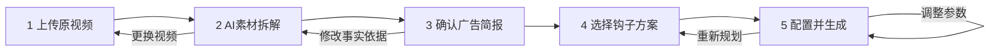

# 游戏前贴前端优先技术方案（五步工作流）

> 日期：2026-08-13
> 状态：前端开发基线
> 范围：效果广告 / 游戏前贴；先开发前端，后接 Go 后端与 Seedance 2.0
> 不在范围：固定策略样例、原片拼接、广告投放、独立结果质检页

## 1. 结论

游戏前贴应实现为同一 CreativeTask 内可恢复的五步工作区：

1. 上传真实游戏原视频；
2. AI 拆解素材并建立真实性边界；
3. 用户确认广告简报；
4. AI 规划三套钩子，用户人工选择一套；
5. 配置、生成并在原页查看结果。

前端第一阶段不应继续围绕《保卫向日葵》固定样例扩展，也不应直接以当前 Go 返回结构作为页面状态。推荐在 `src/features/game-preroll/` 建立独立领域模型、状态机和 `GamePrerollClient` 接口，以契约形状的 Mock Client 驱动完整 UI；后端完成后只替换 Client Adapter。

独立“结果质检”步骤删除。最低生成门禁放在第 5 步提交按钮前；生成成功、失败、重试、下载均在第 5 步内完成。

## 2. 需求基线

### 2.1 用户输入

- 一段用户拥有使用权的游戏原视频；
- 默认投放平台：抖音；
- 默认比例：9:16；
- 前贴时长：6–10 秒，默认推荐 8 秒；
- CTA 默认“立即下载”；
- 当前只生成前贴，不拼接原片、不进入投放。

### 2.2 AI 从视频提取的内容

- 游戏类型和核心玩法；
- 可见人物、场景、游戏 UI；
- 操作行为及操作后的结果；
- 可见奖励、数值和反馈；
- 可作为广告卖点的真实片段；
- 每项结论对应的时间段、代表帧和来源；
- 广告目标、目标受众、主推卖点、CTA 的建议值；
- 不可虚构的事实边界。

所有可用于生成的文字信息都必须展示给用户，并允许编辑、增加或删除。字段必须显示来源：`视频证据`、`AI 推断`、`人工补充`。AI 推断不能伪装成视频事实。

### 2.3 钩子规划

模型输出三套结构化候选，而不是生成三条完整视频。第一版候选优先覆盖：

- 悬念提问；
- 冲突反转；
- 极致爽感。

每套候选至少展示：钩子文案、适配受众、核心卖点、0–1 秒 / 1–3 秒 / 余下时段节奏、引用证据、推荐理由和风险提示。系统可以推荐，但不能自动替用户选择。

### 2.4 左侧三个镜头的定义

三个镜头是“用户所选候选的一条成片内部的三个连续 Beat”，不是三套候选、不是三条视频、也不是三个并行生成任务。它们用于：

- 表达所选方案的时间结构；
- 绑定原视频证据时间段；
- 在成片生成后定位播放位置；
- 解释 Prompt 和生成结果的来源。

## 3. 架构约束与依据

### 3.1 Kanon / cookies 原则

- 四个业务系统分别拥有领域模型和状态机，通过稳定 API 和版本化产物协作；Project 只是共同上下文根，不拥有 Creative 状态。[项目总纲](https://github.com/shikanon/cookies/blob/main/docs/00-project-overview.md#L98-L103)
- Creative 自己拥有 CreativeTask、版本、来源资产和生成产物，所有业务主实体携带 `project_id`。[创意创作 PRD](https://github.com/shikanon/cookies/blob/main/docs/02-creative-studio-prd.md#L47-L59)
- React 前端应让系统模块维护自己的页面、状态和 API Client；服务端状态与本地编辑状态分离，长任务展示异步状态，不阻塞等待。见 `docs/00-project-overview.md:262-279`。
- 阶段导航属于同一工作区，切换阶段不应销毁编辑态。见 `docs/19-module-navigation-architecture.md:69-93`。
- AI 内容应区分事实、推断和建议，并展示来源。见 `DESIGN.md:277-279,358`。

### 3.2 当前仓库可复用能力

| 能力 | 位置 | 处理建议 |
|---|---|---|
| 游戏前贴入口 | `src/components/SpecializedPages.tsx:152-188, 526-534` | 保留现有 `section=preroll&preroll=game` 入口 |
| 工作区恢复、Job 轮询 | `src/components/GamePrerollWorkspace.tsx:60-126` | 逻辑迁入 feature store/client；不要继续堆在组件中 |
| 候选排序和镜头证据映射 | `src/features/game-preroll/presentation.ts` | 保留为纯函数，并改为支持 6–10 秒 Beat |
| 项目素材上传 | `src/data/api.ts` 的 `uploadProjectAsset` | 后端阶段由 Adapter 调用 |
| 候选选择、重规划、生成 Job | `src/data/api.ts:5158-5235` | 作为未来 Adapter 参考，不直接绑定新页面 |
| Workspace / Candidate 类型 | `src/data/api.ts:1605-1747` | 只作为旧 v1 兼容类型，不作为前端新领域模型 |
| API 单测模式 | `test/game-preroll-api.test.ts` | 后端接入阶段扩展 |
| 展示层纯函数测试 | `test/game-preroll-presentation.test.ts` | 前端第一阶段即可改造和扩展 |

### 3.3 当前实现与新需求的差距

1. `GamePrerollWorkspace.tsx` 直接依赖 `gamePrerollFixture.ts`，业务仍绑定固定《保卫向日葵》样例。
2. `createManualGamePrerollWorkspace` 在前端拼装多个后端 DTO，且路由原因、视觉关键词、时长等包含固定样例内容。
3. 当前 Go 模型校验游戏前贴必须为 6 秒；`compileGamePrerollGenerationSpec` 也固定 `DurationSeconds: 6`，不能满足 6–10 秒。
4. 当前输入快照没有完整保存可编辑 Brief 字段的 provenance 与确认状态。
5. `generation_spec` 当前只描述 `first_last_frame`，与“原视频/关键帧真正参与 Seedance”的最终能力仍需后端扩展。
6. 工作区通过“当前 Project 最新一条游戏前贴”恢复；目标版本必须以 `projectId + taskId` 恢复，避免串任务。
7. 外层可能已创建 CreativeTask，旧工作区再次创建 Intake/Task，存在重复任务风险。
8. 当前组件、`SpecializedPages.tsx` 和全局 `styles.css` 都是多人修改热点，不适合继续集中扩张。

## 4. 五步交互与页面状态



### 4.1 步骤 1：上传原视频

页面包含：

- 文件拖拽区；
- 上传格式、大小、时长和授权提示；
- 抖音、9:16、6–10 秒预设；
- “完整操作 → 结果片段更容易得到好前贴”的素材建议；
- 上传、校验、失败、取消和重试状态。

进入下一步的门禁：文件已上传为 Project Asset、媒体元数据可读、用户确认拥有使用权。

### 4.2 步骤 2：AI 素材拆解

布局建议：左侧原视频播放器与证据片段，右侧结构化分析和真实性边界。

每条分析结果包含 `id / label / value / provenance / confidence / evidenceRefs / editable`。点击证据定位原视频时间点。没有识别到奖励时必须显示“本段未发现”，不能补写奖励。

异步状态：`not_started → queued → analyzing → partial → succeeded | failed`。允许部分结果先显示；失败时保留已上传资产并支持重新拆解。

### 4.3 步骤 3：确认广告简报

默认字段：

- 广告目标；
- 目标受众；
- 主推卖点；
- CTA（默认立即下载）。

用户可以编辑、增加、删除；字段旁持续显示 provenance。自动保存只保存本地草稿，点击“确认 Brief”才冻结一个可用于候选规划的版本。Brief 修改后，旧候选必须标记过期并要求重新规划。

### 4.4 步骤 4：选择钩子方案

同时横向展示三套候选。AI 推荐只代表“证据匹配度”，不表达 CTR 或转化率预测。用户必须选择一套后才能进入第 5 步。

“重新规划三套候选”会创建新 CandidateBatch、清空选择并保留已确认 Brief，不生成视频。

### 4.5 步骤 5：配置、生成和结果

页面清楚分成：

- 固定事实约束：真实玩法/UI、禁止虚构奖励数值、CTA、平台和比例；
- 可调参数：6–10 秒、字幕样式、节奏强度、所选钩子；
- 证据绑定状态；
- 生成任务状态与结果播放器。

只保留最低 readiness gate：已确认 Brief、已选择候选、证据资产就绪、Provider 可用、参数合法。该门禁不是独立质检步骤。

生成状态：`idle → submitting → queued → running → succeeded | failed | cancelled`。成功后在原页展示视频、下载和“调整参数后重生成”；失败时展示可理解诊断和重试。当前不显示“拼接原片”和“进入投放”。

## 5. 前端模块设计

### 5.1 建议目录

```text
src/features/game-preroll/
  index.ts
  GamePrerollWorkspace.tsx       # 工作区编排，不直接请求 HTTP
  gamePreroll.css                # gp-* 前缀，仅 feature 内使用
  model/
    types.ts                     # 前端领域模型
    reducer.ts                   # 五步状态机与 commands
    selectors.ts                 # readiness、过期状态、按钮权限
    validation.ts                # 文件、Brief、配置校验
  client/
    GamePrerollClient.ts         # Port / interface
    MockGamePrerollClient.ts     # 前端第一阶段
    GoGamePrerollClient.ts       # 后端阶段 Adapter
    wire.ts                      # HTTP DTO，仅 Adapter 可见
    mapper.ts                    # Wire ↔ Domain
  fixtures/
    uploaded.ts
    analyzed.ts
    brief-confirmed.ts
    candidates-ready.ts
    generation-states.ts
  components/
    StepRail.tsx
    UploadStep.tsx
    AnalysisStep.tsx
    BriefStep.tsx
    CandidateStep.tsx
    GenerateStep.tsx
    SourceVideoPanel.tsx
    EvidenceMomentList.tsx
    ProvenanceBadge.tsx
    ReadinessNotice.tsx
    GenerationResult.tsx
```

`src/components/GamePrerollWorkspace.tsx` 最终只做兼容导出或薄壳；`SpecializedPages.tsx` 只保留一行挂载，不承载业务逻辑。

### 5.2 前端领域模型

```ts
type GamePrerollStep = 'upload' | 'analysis' | 'brief' | 'candidates' | 'generate'
type Provenance = 'video_evidence' | 'ai_inference' | 'manual'
type AsyncStatus = 'idle' | 'queued' | 'running' | 'partial' | 'succeeded' | 'failed'

interface GamePrerollWorkspaceVM {
  projectId: string
  taskId: string
  step: GamePrerollStep
  sourceAsset?: SourceVideo
  analysis: AnalysisState
  briefDraft: BriefDraft
  confirmedBrief?: ConfirmedBrief
  candidateBatch?: CandidateBatch
  selectedCandidateId?: string
  generationConfig: GenerationConfig
  generation: GenerationState
  dirty: boolean
}

interface EvidenceMoment {
  id: string
  startMs: number
  endMs: number
  representativeFrameUrl?: string
  kind: 'gameplay' | 'operation' | 'result' | 'reward' | 'ui' | 'character'
  description: string
  verifiedCopy: string[]
}

interface BriefField {
  id: string
  key: string
  label: string
  value: string
  provenance: Provenance
  evidenceRefs: string[]
  required: boolean
}

interface GenerationConfig {
  channel: 'douyin'
  aspectRatio: '9:16'
  durationSeconds: 6 | 7 | 8 | 9 | 10
  subtitleStyle: 'high_contrast_dynamic' | 'minimal_centered'
  pace: 'balanced' | 'punchy' | 'intense'
  cta: string
}
```

服务端 Workspace 与 `briefDraft` 必须分开。输入过程中不要每次按键覆盖服务端权威快照；使用 debounce 保存本地草稿，确认动作再产生版本。

### 5.3 Client Port

```ts
interface GamePrerollClient {
  restore(projectId: string, taskId: string): Promise<GamePrerollWorkspaceSnapshot | null>
  uploadSource(input: UploadSourceInput): Promise<SourceVideo>
  analyzeSource(input: AnalyzeSourceInput): Promise<AnalysisRun>
  getAnalysis(runId: string): Promise<AnalysisRun>
  confirmBrief(input: ConfirmBriefInput): Promise<ConfirmedBrief>
  planCandidates(input: PlanCandidatesInput): Promise<CandidateBatch>
  selectCandidate(input: SelectCandidateInput): Promise<CandidateSelection>
  createGeneration(input: CreateGenerationInput): Promise<GenerationJob>
  getGeneration(jobId: string): Promise<GenerationJob>
  cancelGeneration(jobId: string): Promise<void>
}
```

组件只能调用该接口或 store command，不能直接调用多个 endpoint 并拼装后端 DTO。Mock Client 应模拟延迟、失败、409 版本冲突和任务恢复，不建议全局 monkey-patch `fetch`。

## 6. Mock 方案

### 6.1 原则

- Fixture 形状对齐 `creative-video-intake/v1` 的 campaign、video、product、creative、source_assets、claims、evidence_refs、readiness 和 confirmation；
- 不再保存任何固定游戏名称、固定时间戳或固定玩法；
- 测试视频仅作为可替换演示资产，不参与默认业务数据；
- 使用可注入 Client：开发环境默认 Mock，后端接入时由 composition root 切换 Go Adapter；
- URL 保留 `projectId + taskId + step`，刷新可以恢复当前步骤。

仓库契约已经规定 game preroll 最长 10 秒、hook deadline 不超过 1 秒，见 `api/contracts/creative-video-intake-v1.schema.json:146-225`。这与当前新需求兼容，应作为 Mock 校验基线。

### 6.2 必备 Fixture

1. 空工作区；
2. 上传中 / 上传失败；
3. 拆解中 / 部分完成 / 完成 / 失败；
4. Brief 未确认 / 已确认 / 修改后候选过期；
5. 三候选就绪 / 推荐但未选择 / 已选择；
6. 生成门禁阻塞；
7. Job queued / running / succeeded / failed / cancelled；
8. 恢复已有任务；
9. 409 revision conflict；
10. Project 或 task 不匹配。

## 7. 状态机与关键不变量

### 7.1 不变量

- 没有 Source Asset，不能拆解；
- 没有成功拆解，不能确认 Brief；
- Brief 未确认，不能规划候选；
- 候选必须恰好三套且来自同一 CandidateBatch；
- AI 推荐不能自动写入 `selectedCandidateId`；
- 没有人工选择，不能创建视频 Job；
- Brief 或 GenerationConfig 变化后，旧候选/GenerationSpec 必须标记过期；
- 同一个 `projectId + taskId + revision + candidateId` 的生成提交保持幂等；
- UI 不接触 Provider API key、厂商模型 ID、对象存储 key 或临时本地路径；
- 输出必须以 Project Asset 引用返回，而不是直接把厂商 URL 当长期资产。

### 7.2 步骤跳转

已完成步骤可以回看；向前跳转必须满足 selector 门禁。返回修改上游数据时，前端明确提示哪些下游结果将失效。切换页面 Tab 或刷新不清空 Workspace。

## 8. 后端接入目标契约

前端阶段先固定 Client Port；后端阶段建议提供聚合接口，避免浏览器自己编排 Intake → Task → Draft：

| 动作 | 建议接口 |
|---|---|
| 创建/恢复工作区 | `POST /api/creative/v1/projects/{projectId}/game-preroll-workspaces` / `GET .../{taskId}` |
| 提交拆解 | `POST .../{taskId}/analysis-runs` |
| 查询拆解 | `GET .../{taskId}/analysis-runs/{runId}` |
| 确认 Brief | `POST .../{taskId}/brief:confirm` |
| 规划三候选 | `POST .../{taskId}/candidate-batches` |
| 人工选择 | `POST .../{taskId}/candidate:select` |
| 创建生成任务 | `POST .../{taskId}/generation-jobs` |
| 查询生成任务 | `GET /platform/v1/model/jobs/{jobId}` |

所有写操作携带 `expected_revision` 和 `Idempotency-Key`。长任务通过轮询或 SSE 更新；Provider Gateway 只暴露能力别名，例如 `cookies.video.standard`，不由前端选择或保存 Seedance 密钥。

后端实施前必须解决：

- 6–10 秒而非固定 6 秒；
- 真实上传视频的自动 VLM/视频理解；
- 分析字段 provenance、证据引用和用户确认版本；
- 不再依赖 `ManualGamePrerollInput` 固定样例；
- 以 `projectId + taskId` 恢复；
- 复用外层 CreativeTask，不重复创建任务；
- Seedance conditioning 是否采用首尾帧、多关键帧或源视频引用；
- Job 成功后稳定资产落盘与血缘记录。

## 9. UI 组件和可访问性要求

- StepRail 使用有序步骤语义；当前步骤设置 `aria-current="step"`；
- 候选卡使用单选语义，推荐标签与选中状态分离；
- 所有纯图标按钮提供 `aria-label`；
- 上传支持键盘触发，并提供格式错误的可读文本；
- 证据缩略图点击后同步播放器时间并反馈焦点；
- 任务状态使用 `role="status"`，失败使用 `role="alert"`；
- 1280px 桌面视口不允许横向滚动；较窄屏幕将候选横排改为纵向卡片；
- 生成按钮的 disabled 状态旁必须显示具体 blocker，不能只变灰；
- 文案、时间和数值不只依靠颜色表达来源或状态。

## 10. 测试方案

### 10.1 单元测试

- reducer 五步迁移；
- readiness selectors；
- 修改 Brief 后候选过期；
- 三候选排序只产生推荐，不自动选择；
- 6–10 秒配置校验；
- EvidenceMoment 与三个 Beat 的映射；
- Wire DTO 与领域模型 mapper。

### 10.2 组件测试

- 每步首屏和空/加载/失败/完成状态；
- provenance 标签；
- Brief 增删改和自动保存；
- 没有人工选择时生成按钮不可用；
- 固定约束不可编辑、可调参数可编辑；
- 成功结果在第 5 步原页展示，不进入第 6 步。

### 10.3 Client 契约测试

- Fixture 通过 JSON Schema；
- 每个写操作携带 revision 和幂等键；
- 404 返回无工作区而非通用崩溃；
- 409 显示版本冲突并提供重新加载；
- Job 状态映射覆盖 queued/running/succeeded/failed/cancelled。

### 10.4 Playwright 主路径

入口：`?section=preroll&preroll=game`。

验证：上传 → 拆解 → 编辑并确认 Brief → 查看三候选 → 人工选一 → 改为 8 秒 → 生成 → 成功预览和下载。同时覆盖刷新恢复、失败重试、Project/task 隔离、1280px 无横溢。当前 `playwright.platform.config.ts` 未单独包含游戏前贴专项用例，实施时需新增。

## 11. 前端实施顺序

### Phase F0：领域与契约

- 建立 feature 目录、领域类型、reducer、selectors；
- 定义 `GamePrerollClient`；
- 创建契约形状 fixtures；
- 完成状态机单测。

### Phase F1：五步静态工作区

- 实现 StepRail 和五个步骤；
- 按设计稿完成布局与响应式；
- 移除所有固定样例文案和第 6 步；
- 不调用真实 API。

### Phase F2：Mock 闭环

- 注入 Mock Client；
- 支持上传模拟、异步拆解、Brief 保存、三候选选择、生成 Job 和结果；
- 支持刷新恢复与错误状态；
- 完成组件与 E2E 测试。

### Phase F3：后端契约冻结

- 以前端 Client Port 为需求输入定义 OpenAPI/Schema；
- 与 Go 领域对象确定 duration、analysis、provenance、candidate 和 generation spec；
- 生成或手写 `wire.ts`，保持领域模型不变。

### Phase F4：Go Adapter 接入

- 实现 `GoGamePrerollClient`；
- 删除 Mock 默认开关但保留 fixtures 用于 Story/test；
- 接入真实上传、VLM 拆解、Planner、Seedance Job 和 Project Asset；
- 运行契约、前端、Go 与 E2E 门禁。

## 12. 文件修改边界与并行开发安全

前端阶段优先新增 `src/features/game-preroll/**` 和对应测试。尽量不修改当前多人共享热点：

- `src/data/api.ts`；
- `src/components/SpecializedPages.tsx`；
- `src/styles.css`；
- `src/features/ai-native-ad/**`；
- 短剧前贴相关文件。

最终接线时，`SpecializedPages.tsx` 只改 import/挂载；feature CSS 使用 `gp-` 前缀，避免污染短剧和电商前贴。不要删除他人的未提交变更，不在同一个提交中混入后端契约升级。

## 13. 验收标准

前端第一阶段完成的定义：

- 五步流程与设计稿一致，且不存在独立结果质检步骤；
- 不使用固定游戏样例；
- 四个 Brief 核心字段可编辑、增删并带来源；
- 三候选是规划，不触发三次视频生成；
- AI 仅推荐，必须人工选择；
- 生成页区分固定约束与可调参数；
- 6–10 秒可选，默认 8 秒；
- 生成结果在第 5 步展示；
- Mock Client 可完整演示成功、失败、恢复和重试；
- 组件不依赖 Provider key 或具体厂商模型 ID；
- 单元、组件、E2E、`npm run build` 和 `git diff --check` 通过。

## 14. 设计稿索引

- 步骤 1：`docs/design/game-preroll-prototype/step-1-upload.png`
- 步骤 2：`docs/design/game-preroll-prototype/step-2-analysis.png`
- 步骤 3：`docs/design/game-preroll-prototype/step-3-brief.png`
- 步骤 4：`docs/design/game-preroll-prototype/step-4-hooks.png`
- 步骤 5：`docs/design/game-preroll-prototype/step-5-generate.png`
- `step-6-quality.png` 已废弃，仅保留为历史设计记录，不应实现。

## 15. 参考资料

- `README.md:69-125`
- `docs/00-project-overview.md:98-103, 248-279, 290-295`
- `docs/02-creative-studio-prd.md:47-59, 234-290`
- `docs/05-shared-foundation.md:17-33, 249-295`
- `docs/13-api-event-contracts.md:54-77, 125-147`
- `docs/19-module-navigation-architecture.md:69-93`
- `docs/plans/2026-07-29-kanon-frontend-go-backend-integration-plan.md:106-150,205-218,399-408`
- `api/contracts/creative-video-intake-v1.schema.json`
- `src/components/GamePrerollWorkspace.tsx`
- `src/features/game-preroll/presentation.ts`
- `src/data/api.ts:1605-1747,5087-5235`
- `internal/systems/creative/game_preroll.go`
- `internal/systems/creative/game_preroll_workflow.go`
- `test/game-preroll-api.test.ts`
- `test/game-preroll-presentation.test.ts`
