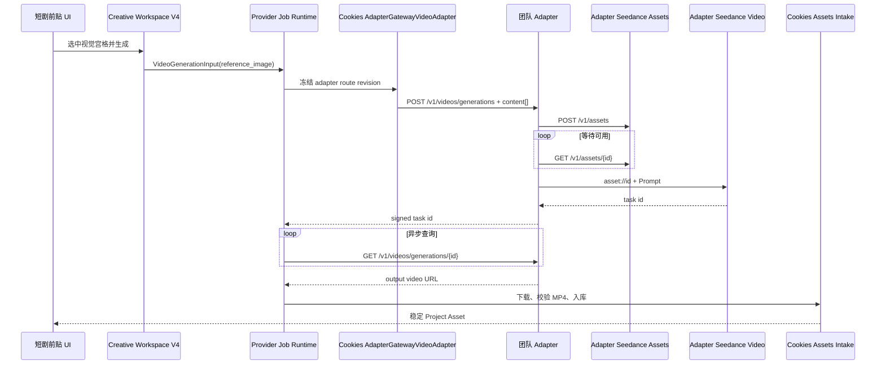

# 短剧前贴 Adapter-only 写实人物参考技术方案

> 日期：2026-08-14
> 产品范围：创意创作 → 视频创作 → 效果广告 → 前贴广告 → 短剧前贴 V4
> 冻结约束：Cookies 不直连方舟；所有 Seedance 视频请求必须经过团队 Adapter。本文只输出技术方案，不修改业务代码、不发起计费生成。

## 1. 执行结论

短剧前贴的清晰写实人物问题应通过下面这条链路解决：

```text
Cookies 短剧前贴
  → Provider Job（逻辑模型别名）
  → AdapterGatewayVideoAdapter
  → POST Adapter /v1/videos/generations（标准 content[]）
  → Adapter Seedance Provider
  → 自动创建素材 /v1/assets
  → 等待素材 Active
  → 改写为 asset://<asset_id>
  → Adapter 调用 Seedance
  → Cookies 轮询、下载并入库最终视频
```

当前无法跑通，不是因为“写实人脸永远不能生成”，而是以下三个条件尚未同时成立：

1. 本地视频运行时仍是 `ark_video`，没有经过 Adapter；
2. Cookies 的 Adapter 视频请求仍使用顶层 `image_url`，而团队 Adapter 只对 `content[].image_url` 执行自动素材化；
3. Adapter 收到 Base64 后需要先托管为上游可访问的 URL，但本机配置的 `public_base_url=http://localhost:9060/blobs` 对远端上游不可达。

因此，单独切环境变量、单独改 Prompt、降低人脸清晰度或只调整前端都不能根治。P0 必须同时完成“Adapter-only 路由、标准请求契约、可访问素材托管和可观测错误链路”。

## 2. AI 效果广告现状及可复用部分

### 2.1 它真正复用的是 Provider Job，不是业务层直调 Adapter

AI 效果广告将每个视频片段编译成 `AINativeGenerationUnit`，再构造统一的 `provider.VideoGenerationInput`。运行服务调用 `CreateVideoJob`，使用逻辑别名 `cookies.video.standard`；实际厂商、模型、连接和凭据由 Provider 路由层决定。

来源：

- `internal/systems/creative/ai_native_production.go:43-72`
- `internal/systems/creative/ai_native_production.go:187-198`
- `internal/systems/creative/ai_native_production_service.go:163-183`
- `internal/platform/provider/video.go:205-275`

短剧前贴应复用这四个设计原则：

- 业务只表达 Prompt、时长、画幅、分辨率、输入模式和 Project Asset；
- 业务不保存 Adapter URL、真实模型名或密钥；
- Provider Job 冻结 route revision，支持轮询、恢复和审计；
- 最终结果由 Assets Intake 转成稳定 Project Asset，不让前端依赖临时模型 URL。

### 2.2 AI 效果广告为什么可以出现写实人物

AI 效果广告默认是 `text_only`。只有确实需要商品、场景或构图参考时才进入 `reference_image`；代码明确禁止将故事板中的 `person_identity` 直接交给视频 Provider。如果某个镜头只有人物身份图而没有安全的场景参考，它会退回文本生成。

来源：

- `internal/systems/creative/ai_native_production.go:65-72`
- `internal/systems/creative/ai_native_production.go:205-260`
- `internal/systems/creative/ai_native_production_test.go:264-288`

所以 AI 效果广告里看到写实人物，很多时候是 Seedance 根据文字创造了虚构人物，并不等于一张清晰人脸参考图已通过素材门禁。

AI 效果广告还已有一条可以直接复用的失败恢复策略：旧计划若因 `InputImageSensitiveContentDetected` 失败，重试时会清掉 `ReferenceAsset/ReferenceRole` 并切换成 text-only，而不是重复提交同一张人物图。来源：`internal/systems/creative/ai_native_production.go:441-457`、`internal/systems/creative/ai_native_production_test.go:590-609`。

2026-08-14 本地 Provider Job 只读快照也支持这一判断：AI 效果广告既有 `text_only` 成功，也有商品/场景 `reference_image` 成功；同时存在多条 `reference_image` 的真人隐私拒绝。该模块提供了成熟的异步任务骨架，但不能直接作为“任意清晰人脸参考图可用”的证明。

### 2.3 应该复用什么，不应该照搬什么

| 项目 | 复用 | 原因 |
|---|---|---|
| Provider Job、逻辑别名、异步轮询和结果入库 | 是 | 已形成稳定平台边界 |
| `VideoGenerationInput` | 是 | 短剧与 AI 效果广告可共享 Provider 契约 |
| AI 效果广告的 text-only 安全回退 | 是 | 可作为人物素材被拒后的降级 |
| AI 效果广告的人物参考策略 | 不直接照搬 | 短剧前贴需要使用用户选中的视觉宫格 |
| 当前本地 `ark_video` 运行配置 | 不复用 | 与 Adapter-only 硬约束冲突 |
| 业务代码感知 `asset_id` | 不引入 | 素材化应由 Adapter 隐藏 |

## 3. 当前链路差距

### 3.1 运行时选择错误

`cmd/cookies-api/main.go` 根据 `COOKIES_PROVIDER_VIDEO_ADAPTER` 构建全局视频 Adapter：

- `adapter_gateway` → `NewAdapterGatewayVideoAdapter`；
- `ark_video` → `NewRoutedArkVideoAdapter`。

来源：`cmd/cookies-api/main.go:847-867`。

当前 `.env` 为 `COOKIES_PROVIDER_VIDEO_ADAPTER=ark_video`。同时，当前 `cookies.video.standard` 生效 revision 指向 Ark。要满足硬约束，两个位置都必须切换：进程 Adapter 和数据库 route revision 缺一不可。

`MySQLGatewayConfigStore.ResolveVideoRoute` 会按 `VideoConnectionType` 过滤连接类型。因此运行时切为 `adapter_gateway` 后，如果 route 当前 revision 仍指向 Ark，结果不是自动回退，而是找不到可用路由。这是正确的 fail-closed 行为。

来源：`internal/platform/provider/gateway_config.go:349-381`。

### 3.2 Cookies 与 Adapter 的请求契约没有对齐

Cookies 当前请求：

```json
{
  "model": "doubao-seedance-2-0-fast-260128",
  "prompt": "...",
  "duration": 15,
  "ratio": "9:16",
  "resolution": "720p",
  "image_url": "data:image/jpeg;base64,..."
}
```

来源：`internal/platform/provider/adapter_gateway_video.go:91-118`。

团队 Adapter 的统一请求应为：

```json
{
  "model": "doubao-seedance-2-0-fast-260128",
  "prompt": "...",
  "input_mode": "reference_image",
  "duration": 15,
  "ratio": "9:16",
  "resolution": "720p",
  "generate_audio": true,
  "content": [
    {
      "type": "image_url",
      "role": "reference_image",
      "image_url": {
        "url": "data:image/jpeg;base64,..."
      }
    }
  ]
}
```

来源：

- `.data/adapter-local/internal/model/video.go:14-37`
- `.data/adapter-local/internal/controller/video.go:23-42`

顶层 `image_url` 在 Adapter 中只会进入未知扩展字段 `Extra`，不会经过 `resolveToAssetRef`。因此即使把进程切到 Adapter，目前的请求也无法触发素材自动入库。

### 3.3 Adapter 的自动素材化能力已经存在

Adapter Seedance Provider 已实现：

1. `asset://` 输入原样透传；
2. HTTP URL 调用 `/v1/assets`；
3. Base64/Data URI 先托管，再调用 `/v1/assets`；
4. 轮询素材直到 `active`；
5. 将引用改写为 `asset://<id>`；
6. 再向 Seedance 上游创建视频任务。

来源：

- `.data/adapter-local/internal/provider/seedance/seedance.go:171-207`
- `.data/adapter-local/internal/provider/seedance/seedance.go:273-330`
- `.data/adapter-local/internal/provider/seedance/seedance.go:333-435`
- `.data/adapter-local/internal/provider/seedance/video_test.go:133-271`

本次已执行 Adapter 一手源码测试：

```text
go test ./internal/provider/seedance ./internal/model
ok adapter/internal/provider/seedance
ok adapter/internal/model
```

### 3.4 素材托管仍是一个真实阻塞点

Adapter 的素材接口只把 URL交给上游拉取。Base64 会先由 Adapter 存为临时文件，再生成 `public_base_url`。Adapter 自身设计文档明确要求该 URL 必须能被 Seedance 上游访问。

来源：

- `.data/adapter-local/internal/provider/seedance/seedance.go:171-193`
- `.data/adapter-local/internal/common/storage/storage.go:26-73`
- `.data/adapter-local/docs/superpowers/plans/2026-06-24-adapter-gateway-video.md:57-61`
- `.data/adapter-local/docs/superpowers/plans/2026-06-24-adapter-gateway-video.md:1415`

本机 `public_base_url=http://localhost:9060/blobs` 对远端上游不可达，所以它只能验证单元逻辑，不能作为真实图生视频的生产配置。

## 4. 目标架构



### 4.1 领域边界

- Creative 持有：视觉宫格选择、视频 Prompt、时长、画幅、生成 attempt。
- Provider 持有：逻辑模型别名、冻结路由、执行状态、错误和输出句柄。
- Adapter 持有：上游协议翻译、素材化、`asset://`、供应商任务 ID 和供应商错误映射。
- Assets 持有：宫格与最终视频的稳定版本、血缘和来源。
- 前端不持有：Adapter Token、上游 Key、Asset ID、临时下载 URL。

## 5. P0 实施设计

### P0-1：强制 Adapter-only 视频运行时

1. 将部署配置固定为 `COOKIES_PROVIDER_VIDEO_ADAPTER=adapter_gateway`。
2. 为 `cookies.video.standard` 创建新的 immutable route revision，绑定 `adapter_gateway` connection。
3. route 使用：
   - submit：`/v1/videos/generations`；
   - poll：`/v1/videos/generations/{task_id}`；
   - model：`doubao-seedance-2-0-fast-260128`；
   - input modes：`text_only/reference_image/first_last_frame`；
   - audio policies：`silent/generated_audio`。
4. 在一个事务中写入 revision 并切换 `current_revision_id`；旧 Ark revision 保留用于审计，但不再是当前 revision。
5. 启动健康检查验证 `cookies.video.standard` 解析出的 `connection_type` 必须是 `adapter_gateway`，否则拒绝启动真实视频 worker。

参考导入结构：`scripts/import-clawex-model-providers.ps1:360-395`。

### P0-2：对齐统一视频请求

修改 `adapterGatewayVideoPayload`：

- 继续保留顶层 `model/prompt/duration/ratio/resolution/generate_audio`；
- 增加 `input_mode`；
- 所有图片源统一放入 `content[]`；
- `reference_image/first_frame/last_frame` 映射为相同 role；
- 删除顶层 `image_url/first_frame_url/last_frame_url`；
- 每个媒体项使用 Adapter 统一的嵌套 URL 对象；
- 维持当前 MIME、大小和角色校验。

必须增加契约测试：

- 参考图只出现在 `content[0].image_url.url`；
- 不存在顶层媒体字段；
- role 不丢失；
- text-only 的 `content` 为空；
- 多角色输入顺序稳定；
- 不支持的 role 在 Cookies 侧直接失败，不请求 Adapter。

主要修改点：

- `internal/platform/provider/adapter_gateway_video.go`
- `internal/platform/provider/adapter_gateway_video_test.go`

### P0-3：配置上游可达的临时素材存储

推荐生产方案：Adapter 使用对象存储保存临时输入，并签发短时 HTTPS URL。最低要求：

- Seedance 上游可访问；
- HTTPS；
- 不暴露内网地址；
- TTL 覆盖素材创建与重试窗口，建议至少 30 分钟；
- 文件名内容寻址；
- URL 和日志不得带 Cookies 用户凭据；
- 到期自动删除。

本地开发可使用公司可访问的开发对象存储或受控隧道，但不能继续把 `localhost` 当成真实烟测配置。

### P0-4：限定写实人物素材来源

短剧前贴首版只允许把**Cookies 自己生成的视觉宫格**提交为视频参考，不把短剧原视频首帧、演员截图或用户上传真人照片自动提交给 Seedance。

视觉宫格生成记录应至少保留：

- `source_kind=ai_generated`；
- 图片 Provider/模型/request id；
- Prompt hash；
- Project Asset version；
- 是否经过裁剪、拼版或二次处理；
- 用户选中的 board id。

Prompt 继续要求“原创虚构人物、不复刻短剧演员或公众人物”，但这只是内容边界，不能代替 Adapter 素材化。

### P0-5：错误分层与可恢复状态

后端和前端至少区分：

| 阶段 | 稳定错误码 | 用户动作 |
|---|---|---|
| Adapter 路由不可用 | `ADAPTER_ROUTE_UNAVAILABLE` | 联系管理员，不重复生成 |
| 素材 URL 不可达 | `REFERENCE_ASSET_FETCH_FAILED` | 修复 Adapter 存储配置 |
| 素材处理超时 | `REFERENCE_ASSET_TIMEOUT` | 原任务继续查或安全重试 |
| 素材因人物/隐私拒绝 | `REFERENCE_ASSET_CONTENT_REJECTED` | 换宫格或使用文本生成 |
| Seedance 视频内容拒绝 | `VIDEO_CONTENT_REJECTED` | 编辑 Prompt/换宫格 |
| 限流/暂时故障 | `ADAPTER_UPSTREAM_RETRYABLE` | 服务端退避重试 |

团队 Adapter 已能把统一错误写成 `{error:{code,message}}`，Cookies 也会保留 Adapter error code；缺口是目前素材创建、素材等待和视频创建没有稳定的 phase code。

来源：

- `.data/adapter-local/internal/common/errs/errs.go:10-93`
- `.data/adapter-local/internal/provider/seedance/seedance.go:96-118`
- `internal/platform/provider/adapter_gateway_video.go:326-346`

### P0-6：安全回退

回退顺序：

1. 同一宫格通过 Adapter 素材化重试一次；
2. 用户选择同批次另一张宫格；
3. `text_only_realistic`：Seedance 根据 Prompt 生成原创写实人物；
4. 非写实/动漫宫格。

第 3 步仍能生成清晰写实人物，但不承诺与选中宫格保持同一张脸。不得通过自动模糊、遮挡或降低图片质量伪装成稳定解决方案。

实现时应抽取 AI 效果广告已有的“隐私拒绝 → 移除人物引用 → text-only retry”判定，而不是在短剧模块复制一套字符串判断；短剧 Workspace 只记录本次 attempt 的降级原因和新的生成规格。

## 6. P0 验收测试

### 6.1 单元与契约测试

- Cookies payload 与 Adapter `UnifiedVideoRequest` 做双向契约 fixture；
- Adapter URL/Base64 → asset → active → `asset://` 测试；
- Adapter 素材失败时不创建视频任务；
- Provider Job route snapshot 为 `adapter_gateway`；
- 刷新页面后仍从 Provider Job/Workspace 恢复生成状态。

### 6.2 集成测试

使用五组素材：

| 用例 | 输入 | 预期 |
|---|---|---|
| A | 当前失败的 AI 写实宫格 | 自动素材化后成功，或明确停在素材拒绝阶段 |
| B | AI 写实人物单图 | 验证清晰人脸主路径 |
| C | 无人物场景宫格 | 必须成功，作为基础链路样本 |
| D | 动漫人物宫格 | 必须成功，作为视觉回退 |
| E | 未授权真人照片 | 允许被合规拒绝，不得标记为系统故障 |

### 6.3 真实烟测验收

每条链路记录：

- Cookies provider job id；
- frozen route revision；
- Adapter request id；
- asset id 与 asset 状态变化；
- Adapter 上游 video task id；
- 最终 Project Asset version；
- 失败阶段和稳定错误码。

P0 通过标准：

1. Cookies 不出现对 Ark 视频端点的网络请求；
2. Adapter 收到标准 `content[]`；
3. 同一张当前失败宫格不再以裸 Base64 直接提交给 Seedance；
4. Adapter 日志完整出现 asset create → active → video create；
5. 至少一个清晰 AI 写实人物宫格成功生成视频；
6. 失败时能准确指出是素材、内容还是网关问题；
7. 页面刷新和版本切换不丢任务及结果。

## 7. 后续 P1/P2

### P1：素材幂等与可观测

- Adapter 按 `SHA-256 + upstream account/project + media type` 缓存 asset id；
- 避免同一宫格每次生成都重复上传；
- 缓存必须校验 asset 仍为 active；
- 将素材阶段耗时、拒绝率、视频成功率纳入指标；
- Provider Job 保存 Adapter 实际 provider/model，不暴露凭据。

### P2：授权人物能力

如果未来要支持“短剧演员本人同脸”或用户上传真人照片，需在 Adapter 后增加正式的真人/虚拟人授权素材流程，而不是沿用普通自动素材化。官方可信素材要求真人认证、授权和 `asset://` 引用；Assets API 集成还与企业权益有关。

官方来源：

- [火山方舟真人素材库](https://www.volcengine.com/docs/82379/2315856?lang=en)
- [Seedance 2.0 高级创作权益包](https://www.volcengine.com/docs/82379/2377608?lang=zh)
- [Seedance 2.0 产品能力](https://www.volcengine.com/activity/seedance2)
- [Seedance 2.0 官方发布](https://developer.volcengine.com/articles/7606009619928449070)

## 8. 外部条件

用户不需要去外部平台手工复制 Asset ID。开发和部署侧需要确认：

1. 团队部署的 Adapter 版本包含 `resolveToAssetRef + waitAssetReady`；
2. Adapter 对外地址和 Token 已配置到 Cookies 的 encrypted connection/credential；
3. Adapter 的 Seedance 模型映射有效；
4. Adapter 拥有上游可访问的 HTTPS 临时素材存储，不能是 localhost；
5. 上游账号具备 `/v1/assets` 和目标 Seedance 模型权限；
6. 同事提供一条已成功的 AI 写实人物请求 id 或脱敏日志用于对照。

其中第 4 项是目前最容易被忽略、但会直接导致真实烟测失败的外部条件。

## 9. 不在本次方案中的事项

- 不让 Cookies 直连方舟；
- 不要求用户手工管理 Asset ID；
- 不把短剧原视频首帧作为 Seedance 人物参考；
- 不承诺未经授权真人一定可生成；
- 不通过降低清晰度规避安全规则；
- 不修改游戏前贴、电商前贴、爆款复刻或品牌广告页面。

## 10. 推荐开发顺序

1. 先写 Cookies ↔ Adapter `content[]` 契约测试；
2. 修改 Adapter Gateway 视频 payload；
3. 配置可访问的 Adapter 素材存储；
4. 新建 Adapter route revision 并切换视频运行时；
5. 补错误 phase 和前端提示；
6. 用当前失败宫格做一次受控真实烟测；
7. 通过后再默认开放短剧前贴写实宫格生成。

最终判断：现有架构无需推倒重来。复用 AI 效果广告的 Provider Job 骨架，将短剧前贴的媒体请求正确送进团队 Adapter 的自动素材化能力，即可形成最短、最符合当前平台架构的解决路径。
