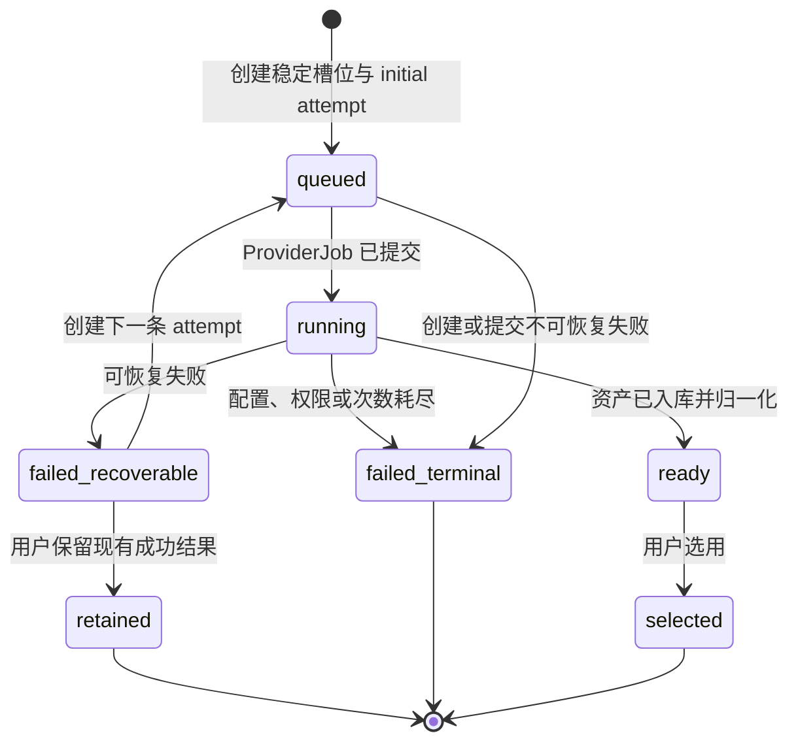
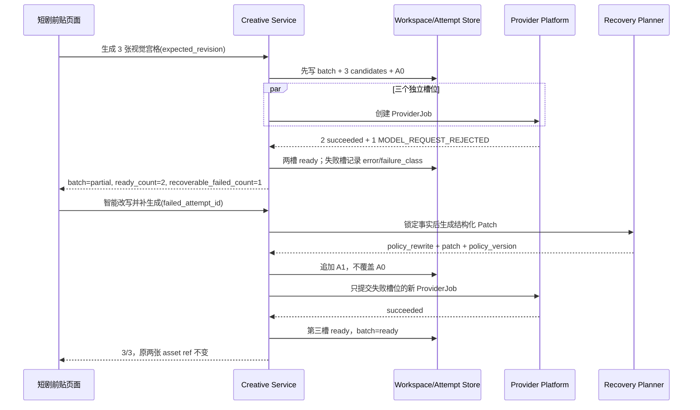

# 短剧前贴视觉宫格部分失败恢复技术方案

> 日期：2026-08-14
> 状态：调研完成，待进入 P0 实施
> 范围：仅修改「效果广告 → 前贴广告 → 短剧前贴」的视觉参考宫格生成链路；不修改游戏前贴、电商前贴及其他创意模块。
> 前置设计：[短剧前贴视觉参考宫格技术方案](./2026-08-13-short-drama-preroll-visual-reference-board-technical-design.md)

## 1. 结论

当前“一批请求三张宫格，成功两张、拒绝一张”的现象不应通过整批重新生成解决。P0 应把三张宫格建模为三个稳定的候选槽位：每个槽位拥有独立的任务、状态、错误分类、Prompt 版本和尝试历史；成功槽位永久保留，只补生成失败槽位。

推荐的恢复链路为：

1. 首次并行提交三个独立候选任务；
2. 任一任务成功后立即持久化并可供选择，不等待其他任务；
3. 网络、限流等短暂故障对原 Prompt 延迟重试一次；
4. 明确的内容审核拒绝不重复提交原 Prompt，而是锁定剧情事实、角色设定、时代、四格职责和该槽位唯一测试变量，只改写可能触发拒绝的表达；泛化的 `MODEL_REQUEST_REJECTED` 因仍可能包含参数问题，P0 只在用户点击“智能改写并补生成”后进入同一受约束改写，不静默自动重放；
5. 改写后仍被内容侧拒绝时，使用一次“原创虚构、弱冲突、非写实视觉”的安全风格回退；
6. 单槽位最多进行两次恢复尝试，成功的另外两个槽位绝不重生成；
7. 页面显示 `已生成 2/3` 和第三个失败占位卡，用户既可以“智能改写并补生成”，也可以“保留当前两张”继续选择。

该方案不是绕过模型安全限制，而是把官方要求的“更换输入内容后重试”落实为可审计、受约束的 Prompt 改写。[火山方舟图片生成 API](https://api.volcengine.com/api-docs/view?action=ImageGenerations&serviceCode=ark&version=2024-01-01)将 `InputTextSensitiveContentDetected`、`OutputImageSensitiveContentDetected` 和 `QuotaExceeded` 分开定义：前两类要求更换输入后重试，配额类要求稍后重试。

## 2. 当前代码事实

### 2.1 已经具备的能力

- V4 工作区已经使用 `ReferenceBoardBatch` 表示视觉宫格批次，三个候选分别拥有 `candidate_id`、`primary_test_variable`、`provider_job_id` 和状态。[领域模型](../../internal/systems/creative/short_drama_preroll_v2.go#L163)
- 三种候选分别测试人物情绪、环境悬念和动作道具，且共享同一份四格计划与剧情证据。[宫格编译器](../../internal/systems/creative/short_drama_v4_reference_board.go#L12)
- Reconcile 已支持批次聚合为 `ready`、`partial` 或 `failed`，因此“2 成功 + 1 失败”在领域上已不是异常状态。[媒体工作流](../../internal/systems/creative/short_drama_v2_media_workflow.go#L258)
- 仓库既有宫格方案与横切 PRD 都要求保留成功结果并只重试失败项，本方案是在现有决策上补齐可执行契约，而不是改变产品方向。[前置宫格方案](./2026-08-13-short-drama-preroll-visual-reference-board-technical-design.md#L410) [横切要求](../15-prd-cross-cutting-requirements.md#L48)
- ProviderJob 已持久化 `attempt_count`、`max_attempts`、`retryable` 和错误对象，共享 Provider 层具备承载尝试次数的基础能力。[Provider 迁移](../../migrations/provider/20260722133000_provider_jobs.up.sql#L24)
- 前端当前会等待并 reconcile 三个任务，但只把 `ready` 候选映射为图片，所以用户只能看到两张成功图，看不到第三个槽位为何失败、还能否恢复。[工作台](../../src/features/short-drama-preroll-v2/ShortDramaPrerollWorkspace.tsx#L544)

### 2.2 根因与缺口

#### 缺口 A：网关错误被压扁

当前图片网关把所有 HTTP 400 统一映射为 `MODEL_REQUEST_REJECTED`，没有解析上游响应体中的真实错误码。[图片网关适配器](../../internal/platform/provider/adapter_gateway_image_adapter.go#L187)

后果是 Creative 层无法区分：

- Prompt 文本触发内容拒绝；
- 模型生成结果触发输出审核；
- 参数格式不合法；
- 上游模型不支持当前参数。

而火山方舟官方 API 已提供更精确的错误码，所以 P0 必须先尽可能保留并归一化上游错误事实，而不是在页面上猜测“侵权”或“真人导致失败”。[火山方舟图片生成 API](https://api.volcengine.com/api-docs/view?action=ImageGenerations&serviceCode=ark&version=2024-01-01)

#### 缺口 B：Creative 层丢失尝试血缘

当前 reconcile 对所有失败只写入 `REFERENCE_BOARD_GENERATION_FAILED`，并只保留错误消息；候选只保存一个当前 `provider_job_id` 和一个 `prompt_hash`。[媒体工作流](../../internal/systems/creative/short_drama_v2_media_workflow.go#L248) [领域模型](../../internal/systems/creative/short_drama_preroll_v2.go#L163)

因此系统无法回答：

- 这是第几次尝试；
- 本次是原 Prompt、同词重试、受约束改写还是风格回退；
- 改写前后 Prompt Hash 是什么；
- 当前失败是否仍可恢复；
- 哪个 ProviderJob 被哪个新任务替代。

#### 缺口 C：首批创建不是可恢复 Saga

当前服务按顺序创建三个 ProviderJob，全部创建成功后才把批次写入工作区；如果第二或第三个创建失败，函数直接返回，之前已经创建的任务没有被记录到当前工作区。[媒体工作流](../../internal/systems/creative/short_drama_v2_media_workflow.go#L157)

这会产生“外部任务已提交，但 Creative 草稿不知道”的孤儿任务风险。P0 需要先持久化批次和三个槽位，再逐槽提交，或者让创建过程具备可恢复的操作记录与幂等键。

#### 缺口 D：前端把失败槽位过滤掉

API 类型只暴露候选的简单状态和错误消息，没有恢复能力、尝试历史和聚合计数。[前端 API 契约](../../src/data/api.ts#L1583) 页面将 `ready` 候选过滤成图片数组，因此 `partial` 被表现为“只生成了两张”，而不是“第三张失败且可补生成”。[工作台](../../src/features/short-drama-preroll-v2/ShortDramaPrerollWorkspace.tsx#L553)

## 3. 目标与非目标

### 3.1 P0 目标

- 三个槽位身份稳定，任何单槽失败不影响已成功槽位；
- 失败原因能被稳定分类，不向业务层暴露 Provider 私有响应或密钥；
- 内容拒绝只改写失败槽位，且剧情事实与测试变量不漂移；
- 单槽位最多两次恢复，避免无限重试和不可控成本；
- 用户刷新、切换短剧前贴版本、离开再回来后仍能恢复完整状态；
- 用户在只有两张成功图时仍可选图并继续生成视频；
- 所有提交、改写、失败和资产结果都有可追溯血缘；
- 并发点击、重复回调和版本冲突不会创建重复付费任务。

### 3.2 非目标

- 不通过改写绕过安全、肖像、版权或平台审核；
- 不把第三张复制为前两张之一来“补齐数量”；
- 不改为一次 Provider 请求返回三张图。官方 Seedream 支持组图，但当前三个独立任务更适合独立变量、独立失败和独立补偿；本阶段保持一槽一任务。[火山方舟图片生成 API](https://api.volcengine.com/api-docs/view?action=ImageGenerations&serviceCode=ark&version=2024-01-01)
- 不在 P0 增加成片自动拼接或质量评分；
- 不改变已经选中的成功宫格或已生成视频的血缘。

## 4. 设计原则

1. **稳定槽位，追加尝试**：候选 ID 不随重试变化，ProviderJob 和 Prompt 尝试只追加、不覆盖。
2. **成功不可回退**：`ready` 槽位不允许被自动恢复流程重新提交。
3. **错误决定恢复动作**：短暂故障才原样重试，内容拒绝必须改写，配置错误直接终止。
4. **事实冻结、表达可变**：分析证据、方向、四格角色、时代背景和主测试变量冻结；镜头措辞、冲突强度、写实程度和容易误触的描述可调整。
5. **服务端是编排者**：刷新页面不能决定任务是否继续；前端只发命令和展示资源事实。
6. **幂等优先于“自动重试”**：同步网关提交结果未知时不能盲目再发，否则可能重复计费。现有 Provider 执行器已经将 `SubmissionUnknown` 视为不可自动重试，应继续保留该边界。[Provider 执行器](../../internal/platform/provider/execution.go#L89)
7. **向后兼容增加**：V4 字段原义不变；新增可选尝试对象、聚合计数和恢复命令。仓库冻结规则允许向后兼容的可选字段增加，改变字段含义才需要新版本。[Creative 共享契约](../26-creative-shared-contract-state-machine-v1.md#L13)

## 5. 领域模型

### 5.1 候选槽位

保留 `ShortDramaReferenceBoardCandidate.ID`、`VariantIndex`、`PrimaryTestVariable` 和 `Plan` 的现有语义，增加以下可选投影：

```go
type ShortDramaReferenceBoardCandidate struct {
    // existing fields remain unchanged
    Attempts          []ShortDramaReferenceBoardAttempt `json:"attempts,omitempty"`
    CurrentAttemptID  string                            `json:"current_attempt_id,omitempty"`
    RecoveryState     string                            `json:"recovery_state,omitempty"`
    FailureClass      string                            `json:"failure_class,omitempty"`
    Recoverable       bool                              `json:"recoverable,omitempty"`
}

type ShortDramaReferenceBoardAttempt struct {
    ID                    string                    `json:"id"`
    Ordinal               int                       `json:"ordinal"`
    Mode                  string                    `json:"mode"`
    RewritePolicyVersion  string                    `json:"rewrite_policy_version,omitempty"`
    SourcePromptHash      string                    `json:"source_prompt_hash,omitempty"`
    PromptHash            string                    `json:"prompt_hash"`
    ProviderJobID         string                    `json:"provider_job_id,omitempty"`
    Status                ShortDramaV2ResourceStatus `json:"status"`
    ProviderErrorCode     string                    `json:"provider_error_code,omitempty"`
    FailureClass          string                    `json:"failure_class,omitempty"`
    Retryable             bool                      `json:"retryable,omitempty"`
    AdapterRequestID      string                    `json:"adapter_request_id,omitempty"`
    CreatedAt             time.Time                 `json:"created_at"`
    CompletedAt           *time.Time                `json:"completed_at,omitempty"`
}
```

`Mode` 只允许：

| 值 | 含义 |
| --- | --- |
| `initial` | 首次编译 Prompt |
| `transient_retry` | 原 Prompt 的短暂故障重试 |
| `policy_rewrite` | 内容拒绝后的受约束改写 |
| `style_fallback` | 原创虚构、弱冲突、非写实风格回退 |

候选顶层现有 `ProviderJobID`、`PromptHash`、`ErrorCode` 继续作为当前尝试的兼容投影；权威历史放在 `Attempts` 中。这样旧 V4 客户端仍能读取，新客户端可以完整恢复。

### 5.2 批次聚合

`ShortDramaReferenceBoardBatch` 增加：

```json
{
  "desired_count": 3,
  "ready_count": 2,
  "running_count": 0,
  "failed_count": 1,
  "recoverable_failed_count": 1
}
```

这些计数由服务端根据候选状态确定性计算，前端不得自己推导成另一套事实。

批次状态保持现有语义：

- `ready`：3/3 成功；
- `partial`：至少一张成功，且当前没有未结束任务；
- `running`：至少一个当前尝试仍在运行；
- `failed`：0/3 成功且全部终止。

### 5.3 状态机



禁止状态：

- `ready → queued`：自动恢复不得覆盖成功图；
- 同一候选同时存在两个 `running` attempt；
- 旧 attempt 的迟到回调覆盖新 attempt；
- 一个候选的改写改变另一个候选的 `primary_test_variable`。

## 6. 错误分类与恢复矩阵

### 6.1 Adapter 归一化

图片网关在非 2xx 时应解析受限长度的结构化错误体，只保留允许字段：上游 `code`、稳定的安全消息、请求 ID；不得回传原始响应体。推荐归一化如下：

| 上游或本地错误 | FailureClass | 自动动作 | 用户动作 |
| --- | --- | --- | --- |
| `InputTextSensitiveContentDetected` | `input_policy` | 受约束改写 | 可编辑 Prompt 后补生成 |
| `OutputImageSensitiveContentDetected` | `output_policy` | 改写并改变表现方式 | 可保留当前结果 |
| 泛化 `MODEL_REQUEST_REJECTED` | `policy_or_request_rejected` | 不静默自动重试 | 用户点击后受约束改写；若耗尽，提示编辑或新批次 |
| `QuotaExceeded` / 429 | `capacity` | 指数退避 + 抖动，原 Prompt 一次 | 稍后重试 |
| 连接超时且服务端明确未接收 | `transient` | 原 Prompt 一次 | 稍后重试 |
| 提交结果未知 | `submission_unknown` | 不自动重发，先查任务/人工处理 | 显示处理中或联系管理员 |
| 认证、模型、尺寸、参数错误 | `configuration` | 不重试 | 联系管理员修复配置 |
| 肖像、版权或明确安全限制 | `rights_or_safety` | 只允许合规风格回退 | 更换合法输入或保留结果 |

方舟图片生成 API 对输入文本、输出图片和配额分别给出不同处理建议，支持以上分类。[火山方舟图片生成 API](https://api.volcengine.com/api-docs/view?action=ImageGenerations&serviceCode=ark&version=2024-01-01) 方舟内容审核还进一步区分暴力等敏感类别，说明不应把全部 400 解释为同一种业务原因。[方舟内容审核错误码](https://api.volcengine.com/api-explorer/debug?action=GetModerationResult&groupName=%E6%96%B9%E8%88%9F%E5%AE%A1%E6%A0%B8&serviceCode=ark&version=2024-01-01)

### 6.2 重试预算

每个槽位最多三条 Attempt：首次 1 次 + 恢复最多 2 次。

```text
A0 initial
 ├─ transient/capacity → A1 transient_retry
 └─ input/output policy → A1 policy_rewrite

A1 再次失败
 ├─ policy → A2 style_fallback
 ├─ transient（且此前未做 transient_retry）→ A2 transient_retry
 └─ configuration/submission_unknown → 终止
```

最坏情况为一批 9 个 ProviderJob。P0 必须记录 `attempt_count` 和批次总调用数，并设置批次硬上限，禁止刷新页面或重复点击突破预算。

## 7. Prompt 安全改写器

### 7.1 输入与输出

新增 Creative 内部深模块 `ReferenceBoardPromptRecoveryPlanner`，业务层只传结构化事实，不把 Provider 私有参数暴露给它：

```go
type ReferenceBoardPromptRecoveryInput struct {
    AnalysisSnapshot    ShortDramaV2Analysis
    DirectionSnapshot   ShortDramaV2HookDirection
    Plan                ShortDramaReferenceBoardPlan
    PrimaryTestVariable string
    FailedPromptHash    string
    FailureClass        string
    RecoveryOrdinal     int
}

type ReferenceBoardPromptRecoveryDecision struct {
    Mode                 string
    RewritePolicyVersion string
    PromptPatch          ReferenceBoardPromptPatch
    LockedFactsHash      string
}
```

Planner 输出“结构化补丁”，而不是任意完整 Prompt。最终 Prompt 仍由现有编译器确定性组装并计算 Hash。

### 7.2 必须锁定的内容

- `analysis.revision` 与 Evidence IDs；
- 已选方向 ID、标题和钩子目标；
- `ReferenceBoardPlan` 的 A/B/C/D 角色；
- 人物身份、时代、场景、关键道具等已证实事实；
- 当前槽位的 `primary_test_variable`；
- 输出画幅、宫格尺寸、无文字/Logo/水印等硬约束。

### 7.3 允许调整的内容

- 将过强的伤害、血腥、威胁等描述改为表情、氛围、遮挡或结果暗示；
- 将“高度拟真、真人摄影”降为“原创虚构角色、电影概念设计”或安全的非写实表现；
- 减少对真实人物、已知角色、品牌或 IP 的联想；
- 简化过密动作，减少模型误判和画面畸变；
- 对输出审核失败改变构图、镜头距离或视觉表现，但不改变剧情事实。

### 7.4 两道门禁

1. `LockedFactsHash` 必须与失败前一致；
2. 编译后执行结构校验：仍包含四个 panel、同一 `primary_test_variable`、同一画幅与全部负面约束。

如果模型改写不可用或结构校验失败，使用仓库内版本化的确定性回退规则，不直接提交未经验证的模型文本。

## 8. 命令与接口

### 8.1 新增命令

```http
POST /projects/{project_id}/creative/tasks/{task_id}/short-drama-preroll-v2/retry-reference-board-candidate
Idempotency-Key: short-drama-board-retry:{task_id}:{batch_id}:{candidate_id}:{failed_attempt_id}
```

```json
{
  "expected_revision": 18,
  "batch_id": "...",
  "candidate_id": "...",
  "failed_attempt_id": "..."
}
```

服务端自行决定 `transient_retry`、`policy_rewrite` 或 `style_fallback`，前端不能伪造恢复模式。返回完整最新 `TaskDetail`。

命令门禁：

- batch 必须是当前工作区活动批次；
- candidate 必须属于 batch，且当前 attempt 已终止；
- candidate 不能已经 `ready`；
- `failed_attempt_id` 必须等于当前 attempt；
- Attempt 预算未耗尽；
- `expected_revision` 匹配；
- 相同幂等键返回同一结果，不创建第二个付费任务。

### 8.2 首批生成改为可恢复创建

`generate-reference-boards` 改为三阶段：

1. 在事务中写入 batch、三个 candidate 和三个 `queued` initial attempt；
2. 提交三个独立 ProviderJob，每次提交使用由 candidate + attempt 派生的稳定幂等键；
3. 每个槽位单独写回 `provider_job_id` 或创建失败事实。

若现有 Repository 无法在一次命令内安全完成外部调用，优先使用 outbox/worker；P0 最低要求是“先有持久化操作事实，再发生外部副作用”，不再全部创建完才保存。

### 8.3 Reconcile

`reconcile-reference-board` 必须同时校验 `candidate_id + current_attempt_id + provider_job_id`。旧 Attempt 的迟到结果只追加审计事件，不得覆盖当前状态。

失败时保留：

- 上游归一化错误码；
- FailureClass；
- Retryable；
- Adapter Request ID；
- Attempt 完成时间。

成功时资产继续走现有项目资产入库和宫格专用归一化，不改变 Provider 视频侧“一张 reference_image”的稳定契约。

## 9. 完整运行时链路



精确分类为内容拒绝或短暂故障后，自动恢复可以由服务端 Worker 触发；泛化 `MODEL_REQUEST_REJECTED` 在 P0 保留用户点击按钮。无论由谁触发，恢复决策、预算和状态都必须在服务端，不能依赖页面内存。

## 10. 前端交互

### 10.1 三个稳定卡位

页面始终按 `variant_index` 渲染三个卡位：

- 成功卡：图片、方案名、A/B/C/D 分段说明、放大、选用；
- 生成中卡：该槽位进度，不遮挡其他成功图；
- 可恢复失败卡：失败的用户可理解原因、`智能改写并补生成`、`保留当前两张`；
- 最终失败卡：说明已耗尽恢复次数，允许编辑整体提示词后“生成新批次”。

顶部显示：`视觉宫格已生成 2/3 · 1 张可补生成`。

### 10.2 不阻断主链路

只要 `ready_count >= 1`：

- 成功卡可立即被选中；
- 可进入视频生成；
- 失败卡补生成不应自动取消已选成功卡；
- 用户选择后来恢复成功的第三张时，才显式创建新的选中版本并重编视频 Prompt。

### 10.3 刷新与并发

- 页面恢复时读取服务端 batch/candidate/attempt 权威状态，不从 localStorage 猜测；
- 重试中的槽位刷新后仍显示运行中；
- 412 版本冲突时重新拉取 TaskDetail，如果相同 Attempt 已存在则视为成功同步；
- 按钮使用单飞门禁只是体验优化，真正防重依赖服务端幂等键和状态门禁。

## 11. 可观测性

建议指标：

- `short_drama_reference_board_initial_success_total`；
- `short_drama_reference_board_partial_batch_total`；
- `short_drama_reference_board_attempt_total{mode,failure_class}`；
- `short_drama_reference_board_recovery_success_total{mode}`；
- `short_drama_reference_board_attempts_exhausted_total`；
- `short_drama_reference_board_orphan_prevented_total`；
- 单批 Provider 调用数、费用估算和恢复耗时。

日志关联键：`organization_id/project_id/task_id/batch_id/candidate_id/attempt_id/provider_job_id/adapter_request_id/prompt_hash`。日志不得写 API Key、完整 Provider 响应体或可下载临时 URL。

## 12. 测试门禁

### 12.1 领域与单元测试

- `2 ready + 1 failed` 聚合为 `partial`；
- `ready` 候选不能被 retry；
- 同一失败 Attempt 的重复命令只创建一个新 Job；
- 旧 ProviderJob 的迟到回调不覆盖当前 Attempt；
- 最多三条 Attempt，耗尽后不可恢复；
- 改写前后 `LockedFactsHash`、Evidence IDs、四格职责和测试变量一致；
- 三个候选的成功资产不会因补生成第三槽而变化。

### 12.2 Adapter 测试

- 解析 `InputTextSensitiveContentDetected`；
- 解析 `OutputImageSensitiveContentDetected`；
- 429 映射为 capacity/retryable；
- 认证、参数、尺寸问题不可重试；
- 畸形或超限错误体安全降级，不泄露原始 body；
- `SubmissionUnknown` 不盲目创建重复任务。

### 12.3 API 与持久化测试

- 首批第三个 Job 创建失败后，前两个槽位仍有持久化事实；
- 服务重启和页面刷新后恢复相同 batch、attempt 与 asset refs；
- 版本冲突、幂等冲突和并发双击不会重复计费；
- 切换短剧前贴版本再回来，仍恢复相同进度；
- 已生成视频不因后续补图而被静默重写。

### 12.4 前端测试

- 固定渲染三个卡位与 `2/3` 计数；
- 失败占位卡只更新自身；
- 补生成时前两张仍可放大和选择；
- “保留当前两张”不会清空失败事实；
- 刷新后不闪回空状态；
- 412 后同步到最新 Attempt，不重复弹错。

## 13. P0 实施顺序

### P0-1：错误事实与契约

1. Adapter 解析允许的上游图片错误字段并归一化；
2. V4 候选增加可选 Attempt、FailureClass、Recoverable 和批次计数；
3. Go、TypeScript、Fixture 和 API 测试同步更新。

验收：现有失败能够从泛化“平台请求失败”提升为稳定分类；无法识别时安全降级为 `policy_or_request_rejected`。

### P0-2：可恢复创建与单槽补生成

1. 首批生成先写批次与稳定槽位；
2. 新增 retry candidate 命令、幂等键和 Attempt 预算；
3. 增加受约束 Prompt 改写器与确定性风格回退；
4. reconcile 按当前 Attempt 校验并保留迟到事件。

验收：模拟第三槽被拒后，只新增第三槽 ProviderJob；前两槽的 Job ID、Prompt Hash 和 AssetVersionRef 全部不变。

### P0-3：页面恢复体验

1. 始终渲染三个槽位；
2. 增加 `2/3`、失败占位、补生成与保留按钮；
3. 支持刷新、版本切换和 412 自动同步；
4. 成功两张可直接继续视频生成。

验收：用户可以从首次 2/3 成功完成第三槽补生成，也可以保留两张直接跑通前贴视频链路。

### P0-4：回归与上线

1. Go 单元/集成测试；
2. 前端测试与 `npm run build`；
3. 真实方舟路由小流量验证输入拒绝、输出拒绝、429 和成功场景；
4. 监控恢复成功率、额外调用成本和重复任务数。

## 14. P1 及以后

- 服务端 Worker 自动触发可恢复槽位，不依赖用户停留页面；
- 运营后台按 FailureClass、模型和 Prompt 策略查看失败分布；
- 基于真实失败样本迭代版本化改写策略，但不记录敏感原文；
- 对恢复后的第三张执行轻量重复度检测，避免与前两张机制趋同；
- 当 Adapter 能稳定提供种子和更细错误语义时，再评估输出审核失败的 seed 变化策略；
- 评估官方组图能力，但必须证明它仍能满足单槽变量、单槽恢复和资产血缘后再迁移。

## 15. 外部条件与需要确认的事项

P0 不需要用户再提供 Brief、真实人物授权或可信素材 Asset ID；本方案只恢复文生宫格失败槽位，也不改变后续视频 Provider 的人物安全规则。

实施前需要工程侧具备：

1. Adapter Gateway 能返回或透传方舟结构化错误中的 `code` 与 request ID；如果暂时只能返回 HTTP 400，系统仍可按泛化拒绝走受约束改写，但诊断精度较低；
2. 一个可用于测试的方舟图片模型路由和受控调用预算；
3. 测试环境允许构造或 Fixture 化 `input_policy`、`output_policy`、429、提交结果未知等场景；
4. 产品接受最坏情况下单批最多 9 次图片调用的硬预算。若成本要求更严格，可将 P0 改为“首次三次 + 每个失败槽位一次自动改写 + 一次用户手动回退”。

无需阻塞开发的默认决策：

- 每次仍以三张为目标；
- 成功一张即可继续，三张不是视频生成硬门禁；
- 自动恢复最多两次；
- 内容拒绝优先改写，短暂故障才原样重试；
- 无法识别的 `MODEL_REQUEST_REJECTED` 不静默自动执行，由用户点击后按可改写拒绝处理，且不在 UI 宣称为侵权；
- 不修改短剧前贴之外的页面和接口。

## 16. 最终验收口径

P0 完成必须同时满足：

1. 首批三槽身份与任务事实先持久化；
2. 2/3 成功时页面明确显示第三槽状态，而不是静默少一张；
3. 补生成只影响失败槽位；
4. Prompt 改写不改变剧情证据、四格职责和主测试变量；
5. 刷新、版本切换、重复点击和迟到回调不破坏结果；
6. 成功两张可以直接选用并生成前贴视频；
7. Attempt、Prompt Hash、ProviderJob 与 AssetVersion 血缘完整；
8. 不绕过 Provider 内容安全，不泄露凭证与原始错误体；
9. 相关 Go 测试、前端测试、构建和仓库 CI 全部通过。

满足以上条件后，“只生成两张”将从不可解释的偶发错误，变成可观察、可恢复、可继续完成业务目标的正常部分成功状态。
