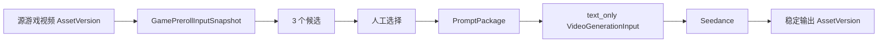
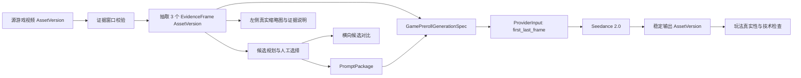
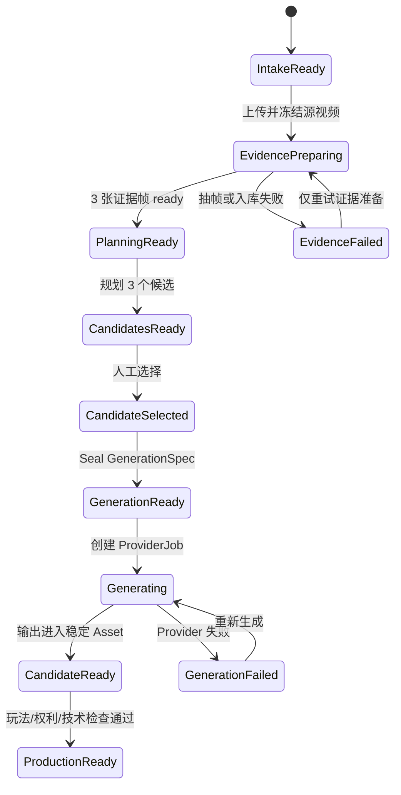

# 游戏前贴保真生成与工作区优化技术调研

> 日期：2026-07-31
>
> 状态：实施前技术设计
>
> Owner：Creative
>
> 范围：创意创作 / 视频创作 / 效果广告 / 游戏前贴
>
> Kanon 架构基线：`shikanon/cookies@4ed9093e3b43dea0a5040c0ec51a7a6c70d5f82d`
>
> 本地审计基线：`c436f26c4bc2b4ef52897a7422e300aab3768ad6`

## 1. 结论

当前游戏前贴已经跑通：

```text
授权实录上传
→ 固定《保卫向日葵》样例
→ 3 个完整 6 秒候选
→ 人工选择
→ 服务端 PromptPackage
→ Seedance ProviderJob
→ 稳定 Project Asset
```

但现在的 Seedance 请求仍是 `text_only`。源视频虽然进入了 Creative 的输入快照，三个证据时间段也约束了候选文案，却没有成为模型的真实视觉输入。因此下一阶段不应重写现有链路，而应补齐“证据资产 → GenerationSpec → Provider conditioning assets”这一段。

推荐按用户确认的四项顺序实施：

1. **源素材真正进入 Seedance**：从三个证据窗口抽取稳定关键帧，一期使用现有 `first_last_frame` 能力把首、尾证据帧传给 Seedance；不虚构当前不存在的 `reference_video` 能力。
2. **左侧镜头证据化**：每个镜头显示真实缩略图、源视频时间段、证据说明和“是否参与模型条件输入”。
3. **候选对比化**：候选移到固定样例下方，以三列横向比较钩子、唯一变量、证据覆盖、推荐理由和风险，左侧只保留所选方案的三个镜头。
4. **配置语义拆分**：固定策略约束、候选规划参数、成片参数、重新规划、重新生成分别建模，避免一个“生成配置”区域同时承担五种语义。

一期继续保持“一个候选 = 一条完整 6 秒视频 = 一个 ProviderJob”。左侧三个镜头仍是同一条视频中的三个连续节拍，不改成三个付费生成任务。

## 2. 调研依据

### 2.1 Kanon 架构约束

- Creative 是独立垂直系统，拥有任务、草稿、版本、制作与评审；Provider、Assets、存储和 Job 属于共享基座。[创意创作 PRD：系统边界](https://github.com/shikanon/cookies/blob/4ed9093e3b43dea0a5040c0ec51a7a6c70d5f82d/docs/02-creative-studio-prd.md#L45-L55)
- 效果广告应使用专属功能工作区，不能退化成一个通用参数表单。[DESIGN：创意创作](https://github.com/shikanon/cookies/blob/4ed9093e3b43dea0a5040c0ec51a7a6c70d5f82d/DESIGN.md#L281-L290)
- 广告前贴的标准生产流程是“结构 → 钩子 → 卖点与证明 → 画面与文字 → 声音与字幕 → 变体 → 检查与交付”。[创意创作 PRD：广告前贴](https://github.com/shikanon/cookies/blob/4ed9093e3b43dea0a5040c0ec51a7a6c70d5f82d/docs/02-creative-studio-prd.md#L252-L258)
- 工作区应支持素材缩略图与时间轴、候选和变量之间的直接关联。[DESIGN：创意化表达原则](https://github.com/shikanon/cookies/blob/4ed9093e3b43dea0a5040c0ec51a7a6c70d5f82d/DESIGN.md#L114-L122)
- 候选与变体对比必须显示“本次改变的变量”；视频还应支持锁定、失败重试和部分结果保留。[创意创作 PRD：工作台与功能要求](https://github.com/shikanon/cookies/blob/4ed9093e3b43dea0a5040c0ec51a7a6c70d5f82d/docs/02-creative-studio-prd.md#L330-L370)
- 所有模型调用必须经过 Provider Gateway，业务包不能直接依赖厂商模型 ID、SDK 或请求结构。[统一模型 Provider：定位与原则](https://github.com/shikanon/cookies/blob/4ed9093e3b43dea0a5040c0ec51a7a6c70d5f82d/docs/07-unified-model-provider.md#L12-L24)
- 媒体平台拥有不可变二进制、技术元数据、派生文件和处理任务；Provider 成功结果必须进入稳定 Asset。[媒体资产平台：边界与核心实体](https://github.com/shikanon/cookies/blob/4ed9093e3b43dea0a5040c0ec51a7a6c70d5f82d/docs/11-media-asset-platform.md#L10-L27)

### 2.2 当前代码事实

当前实现比旧调研中的“视频只支持文本”更进一步：

- `VideoGenerationInput` 已包含 `InputMode` 和 `ConditioningAssets`。
- 稳定输入模式已有 `text_only`、`reference_image`、`first_last_frame`。
- conditioning asset 只保存同 Project 的稳定 `AssetVersionRef`，执行时才解析内容，不保存临时 URL。
- Ark Adapter 能把 PNG/JPEG/WebP 编码为 `image_url`，并发送 `reference_image`、`first_frame`、`last_frame` 角色。
- 路由快照已有 `video_input_modes` 和 `video_audio_policies`，可阻止未声明能力的路由误接任务。

来源：

- [Provider 视频稳定输入与校验](https://github.com/shikanon/cookies/blob/4ed9093e3b43dea0a5040c0ec51a7a6c70d5f82d/internal/platform/provider/video.go#L18-L130)
- [Provider 执行时解析 conditioning assets](https://github.com/shikanon/cookies/blob/4ed9093e3b43dea0a5040c0ec51a7a6c70d5f82d/internal/platform/provider/video_execution.go#L45-L137)
- [Ark 视频能力校验与多模态编码](https://github.com/shikanon/cookies/blob/4ed9093e3b43dea0a5040c0ec51a7a6c70d5f82d/internal/platform/provider/ark_video_adapter.go#L148-L232)
- [Provider 路由能力快照](https://github.com/shikanon/cookies/blob/4ed9093e3b43dea0a5040c0ec51a7a6c70d5f82d/internal/platform/provider/gateway_config.go#L47-L92)

当前真正的断点在 Creative：

```go
// 当前 GamePrerollProviderInput 的核心事实
InputMode: provider.VideoInputTextOnly
```

即候选拥有 `EvidenceMomentID`，但没有证据图片资产，也没有 Creative-owned `GamePrerollGenerationSpec` 将 Prompt、关键帧和媒体参数一起冻结。[当前游戏前贴 Provider 输入](https://github.com/shikanon/cookies/blob/4ed9093e3b43dea0a5040c0ec51a7a6c70d5f82d/internal/systems/creative/game_preroll_workflow.go#L179-L205)

接入前还必须修复一处现有血缘缺口：`ProcessVideoJob` 复用图片结果入库流程时，`GenerationProvenance.SourceAssetRefs` 读取的是图片输入 `record.Input.SourceAssets`，没有读取 `record.VideoInput.ConditioningAssets`。如果只把关键帧发给 Seedance 而不修这里，成片虽然生成成功，Assets 端却无法追溯它使用过哪些关键帧。[当前 Provider 结果入库血缘](https://github.com/shikanon/cookies/blob/4ed9093e3b43dea0a5040c0ec51a7a6c70d5f82d/internal/platform/provider/service.go#L328-L350)

## 3. 当前链路与目标链路

### 3.1 当前链路



问题不是没有上传源视频，而是 `SourceVideo` 在 `InputSnapshot` 后没有继续进入生成规格。

### 3.2 目标链路



`PromptPackage` 与 `GenerationSpec` 必须保持两个对象：

- `PromptPackage`：说什么、如何演绎、禁止什么。
- `GenerationSpec`：使用哪一个 Prompt、哪几个稳定素材版本、什么输入模式、什么时长/画幅/音频参数。

这符合当前 Creative 领域定义：GenerationSpec 是 PromptPackage、conditioning assets 和媒体设置的冻结组合。[Creative 领域词汇](https://github.com/shikanon/cookies/blob/4ed9093e3b43dea0a5040c0ec51a7a6c70d5f82d/internal/systems/creative/CONTEXT.md#L31-L40)

## 4. 设计决策

### ADR-01：一期使用关键帧接入 Seedance，不直接宣称 reference-video

**决定**

一期从三个证据窗口各抽取一张代表帧：

- 镜头 01 的代表帧作为 `first_frame`；
- 镜头 03 的代表帧作为 `last_frame`；
- 镜头 02 的代表帧用于预览、证据核对和 Prompt 事实约束，一期不宣称它已成为模型 conditioning input。

原因：

1. 当前 Provider 稳定契约和 Ark Adapter 已完整支持 `first_last_frame`。
2. 当前没有 `reference_video` 输入模式、视频 MIME resolver 或 Ark reference-video wire mapping。
3. 把三帧拼成一张“九宫格参考图”会让模型把比较画布误解成一个真实游戏画面，不建议作为生产方案。
4. 直接在 Creative 或 React 中拼 Ark 厂商请求会破坏 Provider Gateway 边界。

`reference_video` 只在以下条件同时满足后进入 P1：

- 官方或账号内 API 协议确认 role、数量、大小、时长和 MIME 约束；
- Provider 新增稳定 `VideoInputReferenceVideo` 契约；
- Route capability 显式声明；
- Fake Adapter、Ark Adapter、执行时 source resolver 和资产血缘测试全部通过；
- 真实账号 smoke 成功，失败不会触发静默 text-only 降级。

### ADR-02：证据帧保存为可复用图片 Asset，而不是临时 URL

三个代表帧既要在 UI 中长期预览，又要作为 Provider 的稳定输入，因此一期将其保存为：

```text
AssetKind=image
SourceType=derived
Project=<当前 Project>
Relation=derived_from(source video AssetVersion)
```

这不是把浏览器截图地址写入草稿。Creative 草稿只保存 `AssetVersionRef`。对象存储位置、签名 URL 和读取权限仍由 Assets 平台管理。

虽然架构目标中存在 `AssetDerivative`，当前代码尚未实现通用 derivative 实体和 API，`AssetSourceType` 也没有 `derived`，relation 目前只有 `generated_from`。对本期“会进入模型生产”的代表帧，建议补充最小的 `derived` source type 和 `derived_from` relation，并保存为正式图片 Asset；不能把它冒充成用户上传或 Provider 生成资产。未来纯 UI 缩略图、低清代理和更多时间点抽帧再进入完整 `AssetDerivative`。

### ADR-03：保留“一候选一条 6 秒视频”

三个镜头继续作为一个候选内部的三个 2 秒节拍：

```text
00:00–00:02 目标/选择
00:02–00:04 操作/反馈
00:04–00:06 结果/CTA
```

它们不是三个独立候选，也不是三个独立 ProviderJob。这样保持当前成本、人工选择和任务恢复语义不变。

如果后续实测发现 6 秒单任务无法维持中间镜头玩法真实性，再单独评审“逐镜头生成 + 合成”的 P1 方案。该方案会改变成本、失败重试和一致性模型，不应混入本次四项 UI/保真优化。

### ADR-04：提供“生成保真”和“实录保真”两条生产模式

一期主路径仍是 Seedance：

```text
关键帧条件输入 + Prompt → Seedance 生成前贴
```

同时建议保留一个后续可启用的 `source_edit` 模式：

```text
真实证据窗口裁切 + 字幕/CTA/音效 + FFmpeg 合成
```

它不替代 Seedance，但用于以下场景：

- 游戏 UI、数值、奖励绝不能被重绘；
- Seedance 输出出现虚构按钮、刷新奖励或错误数值；
- 需要先快速交付一个绝对真实的基线版本。

仓库已有 `FFmpegComposer`、媒体探测和稳定 Rendered Asset 入库能力，但当前 Composer 只支持“前贴视频 + 主视频”标准化拼接，尚不支持三个源窗口裁切与字幕轨。[现有 FFmpeg Composer](https://github.com/shikanon/cookies/blob/4ed9093e3b43dea0a5040c0ec51a7a6c70d5f82d/internal/platform/media/composer.go#L20-L53)

## 5. 目标领域模型

### 5.1 EvidenceFrameAsset

在 `GameEvidenceMoment` 的事实时间窗之外增加代表帧绑定：

```go
type GameEvidenceFrameAsset struct {
    EvidenceMomentID       string
    SourceStartMilliseconds int
    SourceEndMilliseconds   int
    RepresentativeFrameMS   int
    FrameAsset              contract.AssetVersionRef
    ExtractionVersion       string
    ContentHash             string
}

type GameEvidenceAssetSet struct {
    SourceVideo contract.AssetVersionRef
    Status      string // preparing | ready | failed
    Frames      []GameEvidenceFrameAsset
    ErrorCode   string
    ContentHash string
}
```

约束：

- 代表帧必须落在对应证据窗口内；
- 证据窗口结束时间不能超过源视频探测时长；
- 三个 `EvidenceMomentID` 不得重复；
- `FrameAsset` 必须属于同 Project、状态为 ready、MIME 为 PNG/JPEG/WebP；
- extraction key 使用 `source asset version + timestamp + extractor version + output spec`，保证重试幂等；
- 替换源视频时旧帧不删除，只从新草稿解除引用，保留审计血缘。

### 5.2 拆分 PlanningConfig 与 RenderConfig

当前 `GamePrerollGenerationConfig` 同时包含字幕、钩子强度和节奏，导致“改字幕是否要重新规划候选”语义不清。建议拆分：

```go
type GamePrerollPlanningConfig struct {
    HookStrength int
    PaceProfile  string
}

type GamePrerollRenderConfig struct {
    SubtitleStyle string
    AudioPolicy   string
}
```

分类如下：

| 分类 | 字段 | 谁拥有 | 修改后的影响 |
|---|---|---|---|
| 固定策略约束 | 游戏名、CTA、允许/禁止机制、证据窗口、授权、不得伪造 UI/奖励 | Intake snapshot | 输入事实变化，旧候选全部失效 |
| 候选规划参数 | 钩子强度、节奏倾向 | Creative planning | 需要重新规划 3 个候选 |
| 成片参数 | 字幕样式、音频策略 | Creative rendering | 候选不失效，只重新编译 GenerationSpec |
| 平台隐藏参数 | 6 秒、9:16、720p、模型逻辑别名 | 产品/Provider policy | 一般不由普通用户直接修改 |

### 5.3 GamePrerollGenerationSpec

参考电商前贴现有“绑定 conditioning frames → Seal → Hash → ProviderInput”的实现模式，但不直接复用电商类型中的商品专属规则。[电商前贴 GenerationSpec](https://github.com/shikanon/cookies/blob/4ed9093e3b43dea0a5040c0ec51a7a6c70d5f82d/internal/systems/creative/commerce_preroll.go#L188-L293)

建议新增：

```go
type GamePrerollGenerationSpec struct {
    ContractVersion      string
    TaskID               string
    DraftRevision        int64
    InputSnapshotHash    string
    CandidateBatchID     string
    CandidateID          string
    PromptPackageHash    string
    InputMode            string
    ConditioningAssets   []GameVideoConditioningAsset
    RenderConfig         GamePrerollRenderConfig
    DurationSeconds      int
    AspectRatio          string
    Resolution           string
    GenerationReady      bool
    ProductionReady      bool
    Hash                 string
}
```

一期 conditioning assets 必须严格为：

```text
first_frame → 镜头 01 EvidenceFrame AssetVersion
last_frame  → 镜头 03 EvidenceFrame AssetVersion
```

`Seal()` 需要验证：

- PromptPackage hash 与所选候选一致；
- candidate batch、candidate 和 draft revision 一致；
- input snapshot hash 未变化；
- 两张图片来自当前 EvidenceAssetSet；
- Route preflight 声明支持 `first_last_frame`；
- 生成配置已冻结；
- 只有 `GenerationReady=true && ProductionReady=false` 的 spec 可以创建 ProviderJob；
- canonical JSON hash 与内容一致。

建议分别保留四个 hash，避免把事实变化、规划变化和执行变化混成一种失效：

```text
source_snapshot_hash
planning_hash
prompt_package_hash
generation_spec_hash
```

Creative-owned spec 再转换为现有 `provider.VideoGenerationInput`。厂商模型名、Base URL、Key 和 Ark JSON 不进入 Creative。

## 6. 深模块与代码边界

本次不新增大量一行转发接口，只增加三个有清晰职责的模块。

### 6.1 Assets：DerivedAssetService

职责：

- 读取已授权源视频 AssetVersion；
- 校验技术元数据与时间范围；
- 调用注入的 frame processor；
- 写入 derived 图片 AssetVersion；
- 建立 `derived_from` 关系；
- 以 derivation key 保证幂等；
- 返回稳定 `AssetVersionRef`。

建议接口：

```go
type FrameProcessor interface {
    ExtractFrame(
        context.Context,
        io.Reader,
        FrameExtractionSpec,
    ) (ProcessedImage, error)
}

type DerivedAssetService interface {
    EnsureFrame(
        context.Context,
        ActorContext,
        ProjectContext,
        AssetVersionRef,
        FrameExtractionSpec,
    ) (AssetVersionRef, error)
}
```

`FrameProcessor` 的 FFmpeg 实现放在 `internal/platform/media`；Assets 只依赖接口，不反向依赖 media 包，避免循环依赖。

### 6.2 Creative：GameEvidencePreparer

职责：

- 将业务证据窗口转换为抽帧请求；
- 选择代表帧时间点；
- 创建/更新 `GameEvidenceAssetSet`；
- 控制 `evidence_assets` blocker；
- 证据资产 ready 后才允许 sealed GenerationSpec。

它不保存对象存储路径，不解析视频字节，也不直接执行 FFmpeg。

### 6.3 Creative：GamePrerollGenerationCompiler

职责：

- 接收 input snapshot、所选候选、EvidenceAssetSet、RenderConfig；
- 编译并 Seal `GamePrerollGenerationSpec`；
- 将 spec 转换为稳定 Provider input；
- 计算请求 hash 和幂等键；
- 明确报告是“配置不完整”“素材未准备”还是“路由能力不支持”。

现有 `GamePrerollProviderInput` 应成为这一深模块的薄入口，而不是继续在 workflow 中手拼 text-only 参数。

### 6.4 Provider：视频结果血缘归一化

视频输出进入 Assets 时，`SourceAssetRefs` 必须从 `VideoInput.ConditioningAssets[].Reference.AssetVersion` 生成；图片输出继续读取图片 input。建议提取一个按 operation/input 类型分派的 provenance helper，避免 `ProcessVideoJob` 继续继承图片专属逻辑。

该修复必须与关键帧接线同批交付，否则无法满足“生成结果可追溯到源游戏视频”的验收标准。

## 7. 状态机与失效规则

### 7.1 状态机



### 7.2 操作失效矩阵

| 操作 | 证据帧 | 候选批次 | 人工选择 | GenerationSpec | 已有输出 |
|---|---|---|---|---|---|
| 修改字幕样式 | 保留 | 保留 | 保留 | 重新 Seal | 保留为历史候选 |
| 修改音频策略 | 保留 | 保留 | 保留 | 重新 Seal | 保留为历史候选 |
| 修改钩子强度 | 保留 | 新建 | 清空 | 清空 | 保留为历史候选 |
| 修改节奏倾向 | 保留 | 新建 | 清空 | 清空 | 保留为历史候选 |
| 点击重新规划 | 保留 | 新建 | 清空 | 清空 | 保留为历史候选 |
| 点击重新生成 | 保留 | 保留 | 保留 | 复用当前已 Seal spec | 新建 attempt/job |
| 替换源视频 | 重新准备 | 清空 | 清空 | 清空 | 保留为历史候选 |
| 修改证据窗口 | 重新准备 | 清空 | 清空 | 清空 | 保留为历史候选 |
| 正式策略包替换固定样例 | 创建新 Intake/Task | 不复用 | 不复用 | 不复用 | 旧任务完整保留 |

关键语义：

- **重新规划**：重新生成“方案”，不调用视频模型，不产生视频费用。
- **重新生成**：方案不变，再生成一个视频 Candidate，会产生新 ProviderJob。
- **调整成片参数**：不改变策略和候选，但会得到新的 GenerationSpec hash。

## 8. API 设计

### 8.1 证据准备

建议增加：

```http
POST /api/creative/v1/projects/{project_id}/creative-tasks/{task_id}/game-preroll:prepare-evidence
Idempotency-Key: game-preroll-evidence-{task_id}-{source_version}-{input_hash}

{
  "expected_revision": 3
}
```

返回最新 workspace。抽帧建议作为异步处理任务，workspace 暴露：

```json
{
  "evidence_assets": {
    "status": "preparing",
    "frames": [],
    "error_code": ""
  }
}
```

任务完成后服务端追加新 draft revision；浏览器继续使用当前 workspace 轮询/刷新恢复机制。

### 8.2 更新成片配置

```http
PATCH /api/creative/v1/projects/{project_id}/creative-tasks/{task_id}/game-preroll:render-config

{
  "expected_revision": 6,
  "render_config": {
    "subtitle_style": "high_contrast_dynamic",
    "audio_policy": "generated_audio"
  }
}
```

该操作保留候选选择，只使旧 GenerationSpec 失效并编译新 spec。

### 8.3 重新规划

保留现有 `game-preroll:regenerate-candidates`，请求体改名为：

```json
{
  "expected_revision": 6,
  "planning_config": {
    "hook_strength": 4,
    "pace_profile": "punchy"
  }
}
```

### 8.4 创建视频任务

现有创建视频 Job 接口继续使用，但服务端不再重新临时拼输入，而是读取并校验已 Seal 的 `GamePrerollGenerationSpec`。

幂等键至少包含：

```text
task_id
+ generation_spec_hash
+ attempt ordinal / explicit retry token
```

同一个用户双击不能重复扣费；用户明确点击“重新生成”时必须创建新的 attempt identity。

### 8.5 Provider 能力预检

当前 `/platform/v1/provider/capabilities` 只适合说明别名和凭据是否可用，建议在不暴露凭据的前提下增加：

```json
{
  "capability": "video.generate",
  "model_alias": "cookies.video.standard",
  "input_modes": ["text_only", "reference_image", "first_last_frame"],
  "audio_policies": ["silent", "generated_audio"]
}
```

前端可以提前显示“当前路由不支持关键帧输入”，但最终门禁仍必须由服务端 Provider route validation 执行。

## 9. 前端工作区设计

### 9.1 布局

```text
┌──────────────┬──────────────────────────────────┬──────────────────┐
│ 左：所选方案 │ 中：预览                         │ 右：生产控制     │
│ 三个镜头     │ 固定策略样例                     │ 固定约束（只读） │
│ 真实缩略图   │ 三候选横向对比                   │ 可调参数         │
│ 源时间/证据  │ 推荐原因与风险                   │ 检查与生成       │
└──────────────┴──────────────────────────────────┴──────────────────┘
```

候选不再占左侧。左侧的唯一职责是解释“当前所选完整方案由哪三个镜头组成”。

### 9.2 左侧镜头卡

每张卡显示：

```text
[真实缩略图]
01 选择挑战
成片：00:00–00:02
来源：20.292–22.250s
证据：技能三选一，选择后进入下一波
模型输入：Seedance first_frame
```

第二张卡明确显示：

```text
模型输入：证据预览 / Prompt 约束
```

不能让用户误以为三张图都已传给模型。

状态包括：

- `preparing`：灰色骨架 + “正在抽取代表帧”；
- `ready`：显示真实图；
- `failed`：显示原因和“仅重试此证据帧”；
- `stale`：源视频或时间窗已变更，禁止生成。

### 9.3 候选横向对比

每列只保留五个核心维度：

| 维度 | 展示内容 |
|---|---|
| 钩子机制 | 选择挑战 / 战术取舍 / 波次压力 |
| 开场句 | 用户第一眼看到的文案 |
| 唯一测试变量 | 本候选与另外两套真正不同的变量 |
| 证据覆盖 | 使用 E1/E2/E3 中哪些证据 |
| 推荐理由与风险 | 为什么推荐；最可能出现什么真实性风险 |

推荐标签不直接等同于模型分数。服务端先执行确定性门禁，再按证据覆盖、机制允许性、CTA 清晰度和文案可读性排序。`Score` 继续标注为“证据匹配度”，不得显示为 CTR/CVR 预测。

默认推荐规则：

1. 违反固定策略约束的候选直接淘汰；
2. 覆盖三个证据阶段且没有虚构数值的候选优先；
3. 钩子与第一证据帧语义一致者优先；
4. 6 秒内 CTA 可读且静音可理解者优先；
5. 同分时保留模型排序，但显示“同分，无历史转化依据”。

### 9.4 右侧生产控制

右侧分四块：

1. **固定策略约束（只读）**

   游戏、CTA、证据窗口、允许/禁止机制、授权状态。

2. **候选规划参数**

   钩子强度、节奏；修改后按钮文案变成“应用并重新规划 3 个候选”。

3. **成片参数**

   字幕样式、音频策略；修改后提示“候选不变，将重新编译生成规格”。

4. **生成与输出**

   显示输入模式、参与模型的 Asset 数、预计生成条数、任务状态、重新生成。

按钮必须使用完整动作名：

- `重新规划 3 个候选`
- `保存成片参数`
- `生成所选 6 秒前贴`
- `按当前方案重新生成视频`
- `仅重试证据帧准备`

## 10. 持久化与版本兼容

### 10.1 Creative

当前 `creative_video_drafts` 按 revision 追加 JSON 快照，不覆盖历史 revision；适合保存 v2 GamePrerollDraft 和 sealed GenerationSpec。因此 P0 不需要新建平行的游戏前贴主表。

建议：

- 新草稿使用 `creative-game-preroll-draft/v2`；
- v1 草稿仍可读取和预览；
- v1 任务若要使用关键帧生成，先执行 `prepare-evidence` 生成新 revision 并升级为 v2；
- `GamePrerollGenerationAttempt` 继续记录 draft revision、candidate、Prompt hash、GenerationSpec hash 和 ProviderJob；
- 不修改或覆盖历史 attempt。

### 10.2 Assets

一期复用现有 Asset、AssetVersion、ProjectAsset 和 AssetRelation 主体，并做最小契约扩展：

- 新增 `AssetSourceDerived`、`AssetRelationDerivedFrom` 及数据库 CHECK 兼容迁移；
- 新增 derived image 的内部摄取服务；
- relation source 指向源视频 `asset_version`；
- 不把 FFmpeg 临时文件、磁盘路径或签名 URL写入 Creative JSON。

如果当前 relation 唯一性不足以承载同一源视频的多个时间点，需要把 derivation key 或 extraction metadata 保存到 derived asset 的处理记录；不能仅依赖文件名去重。

### 10.3 Provider

无需新增一期输入模式。只需让游戏前贴编译出当前已支持的：

```go
provider.VideoInputFirstLastFrame
```

并确保 `cookies.video.standard` 的 route constraints 显式声明：

```json
{
  "video_input_modes": [
    "text_only",
    "reference_image",
    "first_last_frame"
  ]
}
```

## 11. 文件级实施清单

### P0.1 源素材与关键帧接入 Seedance

后端：

- `internal/platform/media/`：新增 FFmpeg 单帧抽取 processor 与测试。
- `internal/platform/assets/`：新增 derived frame intake/derivation service、幂等和 `derived_from` 血缘。
- `internal/platform/contract/platform_events.go` 与 Assets migration：增加 `derived` source type。
- `internal/systems/creative/game_preroll.go`：增加 EvidenceAssetSet、PlanningConfig、RenderConfig、GenerationSpec。
- `internal/systems/creative/game_preroll_workflow.go`：增加 prepare/compile；Provider input 改为 `first_last_frame`。
- `internal/platform/provider/service.go`：视频输出 provenance 改为读取 conditioning assets。
- `internal/platform/httpserver/creative_handlers.go`：增加 prepare evidence、更新 render config 的 handler。
- `internal/platform/httpserver/server.go`：注册路由。
- `internal/platform/provider/`：只补 capability read model 和契约测试，不新建厂商旁路。
- `api/openapi/platform-v1.yaml`：补齐游戏 workspace/action 与派生资产契约。

前端：

- `src/data/api.ts`：增加 evidence assets、v2 config/spec 类型和 API。
- `src/components/GamePrerollWorkspace.tsx`：处理 preparing/ready/failed/stale。

### P0.2 左侧真实镜头证据

- 用 `EvidenceMomentID` 将 storyboard beat 与 source evidence、frame asset 关联；
- 前端通过稳定 Asset API 获取预览 URL；
- 同时显示成片时间与源视频时间，禁止混为一个时间轴；
- 增加证据说明和 conditioning role。

### P0.3 三候选横向对比

- 候选区从左栏移动到中央固定样例下方；
- 新增服务端 recommendation rank/reason codes；
- PromptPackage 默认折叠到“技术详情”，不占主要比较空间；
- 选择候选后左侧镜头、中央预览和右侧 generation readiness 同步更新。

### P0.4 配置与动作分离

- v1 `GamePrerollGenerationConfig` 拆成 planning/render 两个对象；
- 修改 planning config 只能通过重新规划命令生效；
- 修改 render config 不清空候选；
- 重生成只创建新 attempt/job；
- 所有命令继续使用 `expected_revision` 和幂等键。

### P0.5 实录保真兜底

- 将现有 Composer 扩展为版本化 Timeline/Clip composition request；
- 支持三个源窗口 trim、9:16 安全裁切、字幕、CTA 和音效；
- 输出作为 `rendered` AssetVersion，记录三个 source AssetVersion/window；
- 与 Seedance 输出并列作为候选，不自动覆盖。

### P1 reference-video 能力探针

- 只写 capability probe 和 fake contract，不先改业务 UI；
- 使用受控短视频验证 wire contract；
- 确认后扩展 Provider stable input、source resolver、Ark Adapter 和 route constraints；
- 失败时明确返回 `MODEL_INPUT_UNSUPPORTED`，不得静默降级到 text-only。

## 12. 测试方案

### 12.1 领域测试

- 代表帧不在证据窗口内时失败。
- 证据窗口超过源视频时长时失败。
- 替换源视频会清空候选、选择和 spec。
- 修改 planning config 会新建 candidate batch 并清空选择。
- 修改 render config 保留选择但改变 GenerationSpec hash。
- 重新生成复用当前 spec，创建新 attempt。
- Prompt hash、candidate ID、asset ref 任一不一致时阻断 ProviderJob。

### 12.2 Assets / Media 测试

- 给定固定 MP4 和时间点，抽出非空且可探测的 PNG/JPEG。
- 同一个 derivation key 重试返回同一个 AssetVersionRef。
- derived frame 与源视频建立 `derived_from` 关系。
- 临时文件在成功和失败后都清理。
- 非视频、越界时间点、过大文件和损坏视频返回稳定错误码。

### 12.3 Provider 契约测试

- Fake source resolver 返回两张图时，Provider input 保持顺序和角色。
- Ark fake server 断言请求中存在：

```json
[
  {"type": "text"},
  {"type": "image_url", "role": "first_frame"},
  {"type": "image_url", "role": "last_frame"}
]
```

- 路由未声明 `first_last_frame` 时在提交前失败。
- conditioning source 不是图片时失败。
- Project 不匹配、重复资产或重复角色时失败。
- 视频输出入库 provenance 包含两张 conditioning frame，并可继续追溯到源视频。

### 12.4 HTTP / 前端测试

- prepare evidence 支持幂等、失败重试和刷新恢复。
- 三张缩略图显示正确 source range 与 evidence copy。
- 候选三列只改变声明的 primary test variable。
- 未选择候选时生成按钮不可用。
- 调整字幕不触发重新规划。
- 调整钩子强度后必须显式重新规划。
- 双击生成不重复创建付费 Job。
- 真实任务成功后通过稳定 Project Asset 播放，不使用方舟临时 URL。

### 12.5 固定样例验收

使用授权《保卫向日葵》实录跑通：

```text
上传
→ 3 张真实证据帧
→ 3 候选对比
→ 人工选择
→ sealed first_last_frame GenerationSpec
→ Seedance 请求包含两张真实图片
→ 输出入库
→ 页面刷新完整恢复
```

一期“已接入源素材”的技术判定必须同时有两类证据：

1. Provider 契约测试/调用记录证明 conditioning assets 确实进入上游请求；
2. GenerationAttempt 能追溯到源视频和两张 derived frame AssetVersion。

仅仅让 Prompt 写着“参考原游戏画面”不算完成。

## 13. 风险与控制

| 风险 | 控制 |
|---|---|
| 首尾帧无法约束中间玩法 | UI 明示中间帧只作证据；P1 再评审 reference-video 或逐镜头生成 |
| Seedance 重绘错误 UI/数值 | 禁止规则 + 人工玩法真实性检查 + source_edit 兜底 |
| 抽帧阻塞创建任务 | 使用异步 processing job，workspace 可恢复 |
| 路由实际未开 first_last_frame | route capability preflight + Adapter 硬校验 |
| 参数修改导致旧结果被误认为当前 | draft revision、spec hash、attempt lineage 三重绑定 |
| 并发点击重复计费 | expected revision + idempotency key + explicit retry identity |
| 视频已使用关键帧但输出血缘丢失 | 修正 `ProcessVideoJob` provenance 来源并增加回归测试 |
| 与短剧前贴并行开发冲突 | 只新增 game-specific v2 字段和服务；Provider/Assets 改动保持通用、向后兼容 |
| 未来正式策略接入推翻固定样例 | Strategy 只替换 Intake source；证据、候选、spec、Provider、attempt 保持不变 |

## 14. 完成定义

本轮四项优化完成需要满足：

- 源视频的稳定关键帧实际进入 Seedance 请求，不再是 text-only。
- 左侧三个镜头均有真实图片、成片时间、源时间、证据说明和 conditioning 状态。
- 候选位于固定样例下方，支持三列比较、推荐理由和风险提示。
- 固定约束、planning config、render config、重新规划、重新生成在领域模型、API 和 UI 上均可区分。
- 所有状态刷新后可恢复，旧输出不会被新生成覆盖。
- Provider 临时 URL、对象存储凭据和 API Key 不进入 Creative、浏览器或文档示例。
- `git diff --check`、相关 Go 测试、前端测试、`npm run build` 和必需 CI checks 全部通过。

## 15. 推荐提交拆分

为降低与短剧前贴并行开发的冲突，建议按以下提交拆分：

1. `assets/media: add idempotent evidence frame derivation`
2. `creative: add game preroll evidence assets and sealed generation spec`
3. `provider: preserve video conditioning provenance and expose capabilities`
4. `creative api: add evidence prepare and split config commands`
5. `frontend: render real shot evidence and candidate comparison`
6. `frontend: separate strategy, planning, rendering and generation actions`
7. `creative: add source-edit fidelity fallback`（可独立延期）

每个提交只触及本阶段文件，避免把当前工作区中需求与策略或短剧前贴的并行修改一并提交。
