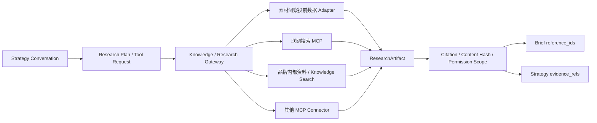

# Kanon 研究洞察、能力运营与分级评审架构补充

> 日期：2026-07-29
>
> 前端基准：仓库根目录 `src/`
>
> 关联方案：`docs/plans/2026-07-29-kanon-strategy-workspace-backend-integration-plan.md`

## 1. 需求澄清后的结论

本补充确认三项产品方向：

1. “研究洞察”不是静态分析页，而是 Strategy 对话可调用的证据工具层。来源包括素材洞察的投前爬虫数据、联网搜索、品牌内部资料和 MCP 工具。
2. “能力运营”先承接不同广告平台和不同目标的 Strategy Skills，展示版本、匹配规则、质量检查和运行血缘，后续再增加评测、发布、灰度和回滚。
3. “评审中心”支持两种基础策略：
   - 个人工作：作者明确点击确认后发布；
   - 组织协作：提交给指定 Leader/审批人，通过后发布。

这三项能力仍围绕同一个 Strategy 主链工作，不应复制出新的 Brief、Strategy 或 Review 状态。

## 2. 仓库现有基础

### 2.1 研究与知识

`internal/platform/knowledge/service.go` 已经具备：

- `ExternalResearchRunner` 抽象；
- `ResearchRequest.mode = web | mcp`；
- `document_ids` 和 `disclosed_fields`；
- 外部披露前的显式 `confirmed`；
- `ResearchRun`、`ResearchArtifact`、citation 和 content hash；
- 项目内知识文档导入、列表、搜索和引用解析。

当前缺口：

- 没有真实 `ExternalResearchRunner` 实现；
- Research Run 在 HTTP 请求内同步执行，不适合爬虫和长时间联网搜索；
- 缺少 Research Run/Artifact 的列表、详情、取消和事件接口；
- 素材洞察结果还没有实现为可搜索的 Strategy Research source；
- 品牌级和组织级知识空间尚未真正落到当前 Project-only API。

### 2.2 Skills

`internal/systems/strategy/skills` 已经内置：

- 平台 Skills：抖音、小红书、微信生态、淘宝/天猫；
- 目标 Skills：品牌认知、转化、线索获取；
- name、version、kind、match、instructions、quality_checks；
- 选择后的 immutable snapshot 和 content hash；
- Strategy generation metadata 中的 Skill 版本与哈希。

当前缺口：

- Registry 是编译期 embed，没有管理 API；
- 没有 owner、发布状态、依赖、评测结果、灰度和回滚字段；
- “能力运营”前端目前读取的是 Project activity，并不是真实 Skill Registry。

### 2.3 评审与身份

Strategy 已经具备：

- `strategy.review`、`strategy.approve` 独立 scope；
- Review candidate revision 和 content hash；
- 评论、退回、批准；
- Brief、Project context、candidate hash 的 stale 校验；
- 批准后生成不可变 StrategyPackage。

Identity 已经具备 Organization、User、Membership；当前组织角色只有：

```text
owner | admin | member | auditor
```

当前缺口：

- 没有 Leader/汇报关系；
- Review 没有 mode、policy snapshot、assignee、required approvals；
- 只有 `created_by` 和最终 `decided_by`，没有审批任务；
- 用户 scope 的授权来源没有与 Membership/Project role 完整绑定；
- 缺少“待我评审、我发起的”的列表接口。

## 3. 研究洞察目标架构



### 3.1 统一来源模型

所有来源统一生成 `ResearchArtifact`，至少保留：

- `source_type`：`prelaunch_insight | web | internal_knowledge | mcp`；
- `source_connector_id` 和可审计 Tool 名；
- 标题、摘要、正文或受控片段；
- 来源 URL/内部资源 ID；
- citation 列表；
- content hash；
- 抓取/导入时间和 freshness；
- organization/project/brand scope；
- 调用人、Research Run、Tool Run 和权限快照；
- 事实、推断、建议的内容分类。

Brief 和 Strategy 只保存稳定 reference ID，不复制无来源的模型摘要作为事实。

### 3.2 MCP transport 选择

MCP STDIO 可以用于 MVP，但边界必须明确：

- cookies 后端或隔离 Worker 是 MCP client/host；
- Worker 启动爬虫 MCP server 子进程；
- 浏览器永远不直接连接 STDIO；
- 每个任务使用受限环境、超时、输出上限和最小网络权限；
- server 的 stdout 只能输出 MCP JSON-RPC，日志写 stderr。

生产选择：

| 场景 | 推荐 transport |
| --- | --- |
| 本地爬虫、脚本、项目内工具、单任务隔离 | STDIO |
| 共享联网搜索服务、远程 SaaS Connector、多实例部署 | Streamable HTTP |
| 品牌内部文档 | 优先 Knowledge Gateway；MCP 负责连接/摄取，不绕过知识权限 |

远程 MCP 必须独立认证，不能把 cookies 用户 token 原样透传给下游工具。

### 3.3 工具与资源划分

- 联网搜索、爬虫运行、页面抓取：MCP Tools。
- 已导入的品牌资料、研究产物、素材洞察快照：Knowledge Resources/Search。
- “搜索后写入研究产物”由 cookies Research Gateway 完成，MCP server 不直接写 Strategy 数据库。

建议第一批 Tool：

```text
search_web(query, domains?, time_range?)
fetch_page(url)
search_prelaunch_insights(query, platform?, industry?, limit?)
search_brand_knowledge(query, brand_id, limit?)
```

### 3.4 Research Run 异步化

将当前同步 `RunResearch` 改为：

```text
POST   /platform/v1/projects/{project_id}/knowledge/research-runs
GET    /platform/v1/projects/{project_id}/knowledge/research-runs
GET    /platform/v1/projects/{project_id}/knowledge/research-runs/{run_id}
GET    /platform/v1/projects/{project_id}/knowledge/research-runs/{run_id}/events
POST   /platform/v1/projects/{project_id}/knowledge/research-runs/{run_id}:cancel
GET    /platform/v1/projects/{project_id}/knowledge/research-artifacts
GET    /platform/v1/projects/{project_id}/knowledge/references/{reference_id}
```

创建接口只负责校验权限、披露内容和确认状态，然后入队。Worker 调 MCP/素材洞察/Knowledge，产物完成后落库并发事件。

### 3.5 对话中的调用规则

- AI 可以建议研究计划，但外部调用由后端 Tool policy 决定。
- 只发送 query 的低风险联网搜索可以由组织策略预授权。
- 任何品牌内部资料内容外发必须展示 `disclosed_fields` 并显式确认。
- 页面展示搜索过程、来源和失败，不把工具返回当系统指令。
- 爬虫遵守目标站点条款、robots、频率限制和版权边界。

## 4. 能力运营目标架构

### 4.1 MVP：只读 Registry

第一阶段直接把现有 embed Skills 暴露为只读 API：

```text
GET /platform/v1/skills?system=strategy
GET /platform/v1/skills/{name}/versions/{version}
GET /platform/v1/projects/{project_id}/skill-runs
```

能力运营页展示：

- 名称、平台/目标、版本；
- match 条件；
- quality checks；
- content hash；
- 当前项目是否命中；
- 最近 SkillRun 成功率和耗时；
- 哪些 Strategy revision 使用了该版本。

完整 instructions 仅向具备管理权限的用户展示。

### 4.2 后续：可治理 Registry

SkillDefinition 增加：

```text
owner
status: draft | testing | review | canary | published | deprecated | rolled_back
input_schema / output_schema
provider_dependencies
tool_dependencies
mcp_dependencies
knowledge_scopes
risk_level
approval_policy
eval_dataset_id
eval_summary
published_at
```

发布后的 SkillVersion 不可修改；运行中的 Strategy 固定使用已选版本和内容哈希。

“能力运营”不直接编辑生成中的 Strategy，也不允许无评测覆盖已发布版本。

## 5. 分级评审目标架构

### 5.1 不用组织人数推断评审模式

即使个人用户，系统内部仍然有 `organization_id`。不能用“组织只有一个成员”推断个人模式，也不能把 `owner/admin` 自动当成 Leader。

评审模式应来自 Project/Workspace 的显式策略：

```text
self_confirmation
leader_approval
designated_approvers
```

### 5.2 建议策略模型

```json
{
  "mode": "leader_approval",
  "approver_user_ids": ["user_1"],
  "minimum_approvals": 1,
  "allow_self_approval": false,
  "require_comment_on_return": true
}
```

提交 Strategy 时把策略快照写入 Review，避免审批期间修改组织设置影响当前 Review。

Review 增加：

```text
review_mode
policy_snapshot
requested_by
required_approvals
approval_count
```

新增 ReviewAssignment：

```text
review_id
reviewer_user_id
reviewer_role
status: pending | approved | returned | cancelled
decision_reason
decided_at
```

### 5.3 两条基础流程

个人确认：

```text
draft -> submit -> waiting_self_confirmation
      -> 作者点击“确认并发布”
      -> immutable StrategyPackage
```

组织评审：

```text
draft -> submit -> open review + assignments
      -> Leader comment / return / approve
      -> 满足 minimum approvals
      -> immutable StrategyPackage
```

个人确认也必须保留 Review/decision 记录，不做无审计的自动发布。

### 5.4 权限校验

审批时同时校验：

1. Actor 有 `strategy.approve` 或个人确认所需的明确 scope；
2. Actor 是当前 ReviewAssignment 的审批人；
3. 策略不允许自审时，Actor 不是 `requested_by`；
4. candidate revision、content hash、Brief version、Project context 都未过期；
5. Review policy snapshot 仍然有效。

组织角色、Project role、业务 scope 和 Review assignment 是不同概念，不能只校验其中一个。

### 5.5 评审中心接口

```text
GET /api/strategy/v1/reviews?assigned_to=me&status=open
GET /api/strategy/v1/reviews?requested_by=me
GET /api/strategy/v1/projects/{project_id}/reviews
GET /api/strategy/v1/reviews/{review_id}/assignments
POST /api/strategy/v1/reviews/{review_id}/comments
POST /api/strategy/v1/reviews/{review_id}:return
POST /api/strategy/v1/reviews/{review_id}:approve
POST /api/strategy/v1/reviews/{review_id}:confirm
```

## 6. 调整后的优先级

### P0：策略工作区真实闭环

- 对话、Brief、Strategy；
- 个人确认模式；
- 当前 Review、评论、退回、批准；
- deterministic provider；
- 刷新恢复与审计。

### P1：研究工具层

- 品牌资料导入和搜索；
- 素材洞察投前 Adapter；
- 一个 Web/MCP Research Runner；
- Research Run 异步化；
- 研究产物引用到 Brief/Strategy。

### P1：组织评审

- Project review policy；
- 指定审批人/Leader；
- ReviewAssignment；
- 待我评审和我发起的列表；
- 通知事件。

### P1.5：能力运营只读页

- 展示现有平台/目标 Skills；
- 版本、hash、quality checks 和 SkillRun；
- Strategy revision 血缘。

### P2：Skills 发布治理

- 数据库 Registry；
- 评测、灰度、发布、停用、回滚；
- Tool/MCP 依赖和组织策略。

## 7. 反向评审

以下实现方式应拒绝：

1. 浏览器直接启动或连接 MCP STDIO。
2. MCP 工具直接写 Brief/Strategy 数据表，绕过领域校验。
3. 把联网搜索摘要直接当成已确认事实，不保存 citation 和 content hash。
4. 把品牌内部资料全文默认发送给外部搜索服务。
5. 在 HTTP 请求中同步等待长时间爬虫执行。
6. 将 Skills 仅作为一段可在线覆盖的 Prompt，丢失版本和评测血缘。
7. 用 `owner/admin/member` 角色直接推断 Leader。
8. 用组织人数自动推断个人/组织评审模式。
9. 只有 `strategy.approve` scope 就允许审批任意 Review，不检查 assignment。
10. 个人模式直接自动发布，不保留确认动作和审计记录。

## 8. MCP 参考

- Transport：<https://modelcontextprotocol.io/specification/2025-11-25/basic/transports>
- Tools：<https://modelcontextprotocol.io/specification/2025-11-25/server/tools>
- Authorization：<https://modelcontextprotocol.io/specification/2025-11-25/basic/authorization>
- Security Best Practices：<https://modelcontextprotocol.io/docs/tutorials/security/security_best_practices>
