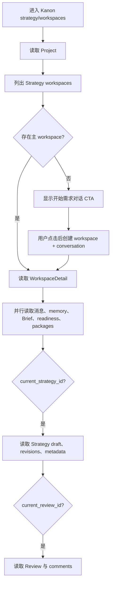

# Kanon 策略工作区后端优先接入：需求分析与技术调研

> 日期：2026-07-29
> 代码基线：`mvp/main@dec2a9d`
> 目标：以用户截图确认的 Kanon 前端为唯一页面基准，先接通真实的对话、Brief、策略、评审后端闭环；页面基本可用后，再启用真实文本模型。

## 1. 先锁定正确前端

本调研中的 **Kanon 前端**只指仓库根目录 `src/` 这套应用。

用户截图对应的页面特征：

- 顶部导航为“Home / 需求与策略 / 创意创作 / 素材洞察 / 智能投放”；
- 左侧“需求与策略”包含“策略任务、策略工作区、需求中心、策略中心、研究洞察、评审中心”；
- 截图当前路由是 `strategy/tasks`，显示策略任务列表轨道与右侧任务区域；
- 页面底部保留 Project、阶段、进度、更新时间和进度状态。

代码定位：

| 页面或能力 | Kanon 代码 |
| --- | --- |
| 顶部、侧栏和 Project 外壳 | `src/components/Shell.tsx` |
| 需求与策略导航 | `src/data/navigation.ts` |
| 截图中的策略任务页 | `src/components/BusinessTaskPages.tsx` 的 `TaskCenterPage` |
| 本次目标策略工作区 | `src/components/Pages.tsx` 的 `WorkspaceSurface` |
| 页面路由分发 | `src/components/Pages.tsx` 的 `ModulePage` |
| URL 规则 | `src/lib/router.ts` |

`web/src/features/strategy/` 是另一套旧前端，**不是 Kanon 页面基准**。它只能作为 Strategy 领域 API、类型、SSE、恢复逻辑和测试案例的参考，不能：

- 直接替换 Kanon 页面；
- 引入旧版路由或布局；
- 改写截图中的顶栏、侧栏和底部状态栏；
- 把旧版 CSS 带入 Kanon；
- 将 `web/` 作为根前端运行时依赖。

## 2. 需求重新定义

### 2.1 本期目标

在 Kanon 的 `/projects/{projectId}/strategy/workspaces` 中完成一个真实、可刷新恢复的当前链路：

```text
需求对话
  -> 可编辑 Brief 草稿
  -> 已确认 BriefVersion
  -> Strategy 草稿与修订
  -> Review
  -> 评论 / 退回 / 再提交 / 批准
  -> 已发布 StrategyPackage
```

整个阶段都使用真实 Go API、真实 MySQL 状态、真实异步任务和真实权限；只有文本生成器先保持 deterministic，不调用外部模型。

### 2.2 “页面基本可用”的定义

满足以下条件才算基本可用：

- 可以创建或恢复项目的主 Strategy workspace；
- 可以持续对话，而不是每发一句话都创建新 conversation；
- 对话消息、任务状态和助手结果可见；
- Brief 字段可读取、编辑、检查缺失项并确认；
- 可以从已确认 Brief 生成、编辑和修订策略；
- 可以提交评审、添加评论、退回、再提交和批准；
- 批准后能读取不可变 StrategyPackage；
- 任一阶段刷新页面都能回到服务端真实状态；
- 重复点击、断网重试和并发编辑不会静默覆盖或生成重复核心资源；
- provider 关闭时，页面仍能完成全链路且不发生外部模型请求。

### 2.3 本期不做

- 不重做 Kanon 视觉；
- 不把 `web/` 旧版 Strategy 页面移植过来；
- 不先做“研究、实验、变更记录”的完整产品；
- 不先做跨项目评审中心和历史工作区中心；
- 不在第一阶段打开真实文本模型；
- 不把平台 BusinessTask 和 Strategy 内部 task 强行合并；
- 不用静态结果或前端生成内容伪装后端成功。

## 3. 两套 task 必须分清

当前仓库存在两个含义不同的 task：

### 3.1 Kanon 任务中心的 BusinessTask

截图中的“策略任务”使用 `ProjectRecord.tasks / BusinessTaskRecord`，后端契约是：

```text
/platform/v1/projects/{project_id}/tasks
```

但当前 Kanon 实际状态是：

- `ProjectContext.createTask` 和 `updateTask` 被明确设为 unsupported；
- `enrichProjectRecord()` 只把 Creative tasks 放进 `ProjectRecord.tasks`；
- Strategy tasks 没有被加载进截图中的任务列表；
- 因此“新建策略任务”和任务状态推进目前并非可用的 Strategy 工作流入口。

### 3.2 Strategy 领域内部 task

Strategy API 中的 task 存储于 `strategy_tasks`，由创建 conversation 时一并产生，负责：

- 关联 workspace 和 conversation；
- 持有 Brief draft；
- 保存 current agent task；
- 指向 current Strategy draft。

它不是平台 BusinessTask，也没有现成的 `business_task_id` 关联。

### 3.3 本期处理原则

本期直接以“Project 下的主 Strategy workspace + 当前内部 task”完成工作区闭环。截图中的策略任务页只用于确认 Kanon 版本和视觉外壳，不作为本次四类接口的领域主键来源。

如果后续要实现“从截图的新建策略任务进入独立工作区”，需要另立契约：

- 给 Strategy workspace 增加稳定的 `business_task_id`；
- 或增加平台 task 与 Strategy workspace 的映射表/编排接口；
- 明确一对一还是一对多；
- 定义创建失败时的补偿和重试；
- 定义任务状态由哪个领域负责推进。

不能用名称、创建时间或数组位置进行隐式匹配。

## 4. Kanon 当前策略工作区现状

`strategy/workspaces` 当前没有专用页面，仍落入通用 `WorkspaceSurface`。现有三栏布局是正确的 Kanon 视觉基线：

```text
左：主工作区内容
中：对象摘要 / 决策状态
右：证据
```

但业务数据并未真正接通：

| 内容 | 当前状态 |
| --- | --- |
| 推荐定位、目标受众、核心信息、创意路线、成功指标 | 硬编码 |
| 地区、周期、关键决策完成度 | 硬编码 |
| activeView | 只改顶部标签，主体内容没有真正切换 |
| 证据 | 读取 Project operation records，不是完整 Strategy evidence |
| Brief 生成 | 已调用真实 Strategy API |
| Brief 确认 | 已调用真实 Strategy API |
| 商品图绑定 | 已调用真实资产和 Brief patch API |
| 持续对话 | 未实现 |
| Brief 字段编辑与冲突处理 | 未实现 |
| Strategy 草稿、修订、版本 | 未实现 |
| Review、评论、退回、批准 | 未实现 |
| 刷新恢复完整链路 | 未实现 |

现有 Brief 适配还有三个问题：

1. `createKanonBrief()` 每次调用都会新建 conversation，无法形成持续对话。
2. `WorkspaceSurface` 从所有 `kind === "brief"` 的 artifact 中选择最新项。
3. `listKanonArtifacts()` 把 StrategyPackage 也映射为 `kind: "brief"`，较新的策略包可能被误认为 Brief。

此外，`enrichProjectRecord()` 目前把最新 StrategyPackage 同时映射为 Brief 和 Strategy 摘要。这些通用适配只适合首页概览，不能继续作为 Strategy 工作区的领域状态来源。

## 5. 后端能力结论

Go Strategy 后端已经覆盖本期主链路，不需要先重写。

### 5.1 已有接口

| 阶段 | 主要接口 |
| --- | --- |
| Workspace | list/create/get workspace detail |
| Conversation | create/get、messages、memory、SSE events |
| Agent task | get/cancel、skill runs |
| Brief | get/patch draft、confirm、list immutable versions |
| Strategy | create/get draft、list revisions、patch、revise、submit |
| Review | get、list/add comments、return、approve |
| Package | list/get version、export、creative handoff |
| Provider | generation readiness、generation metadata |

Workspace detail 已返回：

- `current_conversation`；
- `current_task`；
- task 的 `current_strategy_id`；
- Strategy draft 的 `current_review_id`。

因此当前主链路可以在刷新后逐级恢复。

### 5.2 后端暂缺能力

现有 API 没有：

- 按项目列出历史 conversations；
- 按 workspace 列出全部历史 Strategy tasks；
- 按项目或状态列出 Strategy drafts；
- 按项目、工作区或状态列出 Reviews。

这不阻塞“一个 Project 的主 workspace 当前链路”，但阻塞：

- 完整历史中心；
- 跨项目评审中心；
- 多工作区切换；
- 完整变更记录。

因此这些页面不应在本期用假数据补齐。

### 5.3 需要额外注意的写接口

核心创建、生成、提交和批准接口已有 `Idempotency-Key`；Brief/Strategy 写入使用版本号，Brief patch 还支持 `If-Match`。

但当前 Review comment 和 return 接口没有幂等键：

- comment 网络重试可能重复写入；
- return 重试会因为状态已改变而返回冲突。

本期前端应禁用重复提交和自动重试这两类写操作；后续建议补幂等契约。

## 6. Kanon 页面信息架构

保留现有 Kanon PageHeader、页签、三栏、Project 上下文和底部状态栏。不同页签只替换三栏内部内容。

| 页签 | 左侧主区 | 中间摘要区 | 右侧证据区 |
| --- | --- | --- | --- |
| 概览 | 当前阶段、最近活动、下一步 CTA | Brief/Strategy/Review 状态 | 已引用证据 |
| 对话 | 消息流、输入框、任务状态 | Brief 捕获摘要、待追问项 | 本轮引用与 Project 上下文 |
| Brief | 分组字段编辑器 | 完整度、字段状态、版本、确认操作 | 字段来源与引用 |
| 策略 | 结构化策略章节、修订输入 | 版本、生成模式、质量状态、提交操作 | 策略引用证据 |
| 评审 | 候选版本、差异和评论 | Review 状态、退回、批准 | 候选 hash、引用和审计 |
| 研究 | 本期只展示真实资料摘要或未开放状态 | 数据来源说明 | 已引用资料 |
| 实验 | 未开放状态 | 不展示伪实验 | — |
| 变更记录 | 本期只展示当前链路已有 revisions/comments | 当前版本摘要 | 审计信息 |

响应式规则继续沿用 `src/styles.css` 的 Kanon grid，不引入旧版 `strategy.css`。

## 7. 前端状态与数据流

### 7.1 页面启动



页面加载不应偷偷创建 conversation。首次写入由明确的“开始需求对话”操作触发，并使用稳定幂等键。

### 7.2 对话

1. 复用 `current_conversation`。
2. 发送消息时生成一次 client action id，整个重试周期复用同一 `Idempotency-Key`。
3. 立即显示服务端返回的用户消息。
4. 保存 `agent_task.id`，展示 queued/running/succeeded/failed。
5. SSE 到达时重新读取权威的 messages、Brief 和 task。
6. SSE 断开后使用 `Last-Event-ID` 恢复；事件过期返回 `410` 时清空游标并做一次完整 REST 刷新。
7. SSE 仅负责通知，REST 数据始终是权威状态。

WHATWG 的 SSE 标准定义了自动重连、`Last-Event-ID` 和事件流解析语义，旧版 Strategy 客户端已经实现了可复用的 parser 与游标恢复思路。[WHATWG Server-sent events](https://html.spec.whatwg.org/multipage/server-sent-events.html)

### 7.3 Brief

1. 对话任务完成后读取最新 Brief draft。
2. 按真实 schema 分组展示字段和 field states。
3. 字段编辑发送 `expected_version` 和 `If-Match: "vN"`。
4. 收到 `412 VERSION_CONFLICT` 时重新获取，不自动覆盖用户内容。
5. completeness 未 ready 时显示 blocker，不允许确认。
6. confirm 产生不可变 BriefVersion。
7. 确认后 draft 只读；若要修改，必须进入新的明确修订流程，不能直接改历史版本。

RFC 9110 将 `If-Match` 用于防止并发写入的 lost update，条件不满足时应以 `412 Precondition Failed` 阻止修改。[RFC 9110](https://www.rfc-editor.org/rfc/rfc9110.html)

### 7.4 Strategy

1. 只有已确认 BriefVersion 才能创建 Strategy。
2. 创建后轮询 agent task 或 Strategy draft 的 generating 状态。
3. 章节编辑走结构化 patch。
4. 自然语言修订走 revise，并显示本次允许修改的章节。
5. 每次修改后重新读取 draft 和 revisions。
6. 提交评审时固定 candidate revision。
7. 展示 generation mode、model alias、prompt version、quality 和 validation attempts。

### 7.5 Review

1. 读取 Review 的不可变 candidate。
2. 展示当前 revision 与 candidate 的差异。
3. 评论为 append-only。
4. 退回必须填写原因。
5. 退回后回到 Strategy 修订，不修改原 candidate。
6. 再提交产生新的 Review candidate。
7. 批准时同时发送 `review_id`、`candidate_content_hash`、`expected_version`。
8. 批准后读取不可变 StrategyPackage。

## 8. 前端代码边界

建议在根 Kanon 中新增：

```text
src/features/strategy/
  api.ts
  types.ts
  state.ts
  useStrategyWorkspace.ts
  useConversationStream.ts
  readSSE.ts
  KanonStrategyWorkspace.tsx
  panes/
    OverviewPane.tsx
    ConversationPane.tsx
    BriefPane.tsx
    StrategyPane.tsx
    ReviewPane.tsx
```

接入方式：

- `ModulePage` 对 `system.key === "strategy" && item.id === "workspaces"` 增加 specialized 分支；
- `WorkspaceSurface` 继续服务其他模块，避免改一处影响所有 workspace layout；
- feature 接收 `currentProject.id`、`activeView` 和 Kanon 导航回调；
- Strategy 类型不进入通用 `ApiArtifact`；
- milestone 成功后调用 `reloadProjects()` 更新全局概览，但领域页面自身从 Strategy API 恢复。

可以从 `web/src/features/strategy/` 迁移：

- API path 和 request body；
- Strategy domain types；
- SSE parser；
- current-chain 恢复算法；
- 已有测试案例。

不能迁移：

- 旧版页面结构；
- 旧版 router；
- 旧版 CSS；
- 与 Kanon ProjectContext 冲突的全局状态；
- 旧版页面文案和视觉层级。

## 9. 真实文本模型启用

### 9.1 现有开关正好支持“后端先行”

当前配置：

```text
COOKIES_STRATEGY_ENABLED=true
COOKIES_STRATEGY_V2_ENABLED=true
COOKIES_STRATEGY_REAL_PROVIDER_ENABLED=false
COOKIES_STRATEGY_TEXT_MODEL_ALIAS=cookies.text.standard
COOKIES_STRATEGY_PROMPT_VERSION=strategy.generate.v2
COOKIES_STRATEGY_CRITIC_ENABLED=false
```

provider 关闭时：

- 所有 API、数据库、任务和评审流程都是真实的；
- conversation extraction 和 Strategy generation 使用 deterministic 实现；
- generation readiness 返回 `generation_mode: deterministic`；
- 不创建外部 text provider。

所以不需要新增 mock 开关。

### 9.2 开启 provider 前的代码事实

当前模型调用行为：

| 调用 | 输出校验 | repair |
| --- | --- | --- |
| Conversation turn / Brief extraction | strict JSON + domain sanitize | 无 |
| Strategy generation | strict JSON + quality rules | 最多 1 次 |
| Strategy revise | strict JSON + quality rules + 限定章节 | 无 |

打开真实模型前应重点评测 conversation 和 revise 的非法输出率；若不可接受，再增加有界 repair，不应无限重试。

Adapter Gateway 支持 `json_schema`、`json_object` 和 `prompt_json`。当前仓库中的 Seed2 与 MiniMax M2.7 配置都使用 `prompt_json`，因此服务端 strict decode 与质量校验不能移除。

MiniMax 官方文档目前说明 `response_format` 的 JSON Schema 只由 `MiniMax-Text-01` 支持；M2.7 不能假设原生 schema 约束。[MiniMax 文本 API](https://platform.minimaxi.com/docs/api-reference/text-post)

当前脚本配置：

- Seed2：`prompt_json`，`max_output_tokens=8192`；
- MiniMax M2.7：`prompt_json`，`max_output_tokens=2048`。

Strategy v2 输出较长，首轮真实流量应先验证截断率；不能仅因为模型可调用就判定 readiness 合格。

### 9.3 开启门槛

满足以下条件后才能将 `COOKIES_STRATEGY_REAL_PROVIDER_ENABLED` 设为 true：

- deterministic 全链路 E2E 通过；
- 刷新恢复、幂等和版本冲突测试通过；
- provider route、加密凭据和组织白名单检查通过；
- 典型、缺失、冲突、超长和对抗样本离线评测通过；
- schema/质量失败能明确展示，不静默生成假成功；
- 有 provider kill switch；
- 有延迟、token、失败率、repair 和用户修改率观测。

建议灰度：

1. 单开发组织；
2. 内部测试组织白名单；
3. 少量真实 Project；
4. 达标后扩大。

真实 provider 失败时，不自动将 deterministic 结果冒充真实生成结果。可以提供显式“使用规则模板继续”的用户操作。

## 10. 安全和可观测性

必须保留：

- 服务端加密凭据，浏览器不接触 provider key；
- `strategy.read/write/confirm/review/approve/package.read` scope；
- Project 和 organization 隔离；
- 外部资料、上传文档和历史消息按不可信输入处理；
- 系统指令、用户输入和检索资料分区；
- 模型输出只生成候选，Brief 确认和 Strategy 批准仍由人触发；
- provider、model、route revision、prompt version、usage、latency、validation attempts 和 quality 日志。

OWASP 对 LLM 应用建议采用指令/数据分离、输入输出验证、最小权限、监控和高风险操作的人机确认。[OWASP Prompt Injection Prevention](https://cheatsheetseries.owasp.org/cheatsheets/LLM_Prompt_Injection_Prevention_Cheat_Sheet.html)

模型评测至少覆盖：

- Brief 字段准确率、完整率和无依据补全率；
- Strategy 章节完整率、约束遵循率和事实一致性；
- schema 失败率和 repair 率；
- 用户字段修改率；
- 修订次数、评审退回率和一次批准率；
- P50/P95 延迟与单次成本；
- prompt/model/route 版本回归。

评测应从开发初期持续执行，使用真实分布、边界案例和人工校准，避免只凭主观观感判断。[OpenAI Evaluation best practices](https://developers.openai.com/api/docs/guides/evaluation-best-practices)

## 11. 测试缺口

根 Kanon 当前没有 Strategy workspace 的组件测试。现有 root E2E 只验证策略任务路由和按钮可见，不覆盖真实工作区闭环。

需要新增：

### 单元测试

- Strategy API request、幂等键和 version body；
- SSE 分块、CRLF、多行 data、断线重连、`Last-Event-ID`、`410`；
- current-chain reducer；
- activeView 到 Kanon 三栏内容映射；
- deterministic/provider readiness 展示。

### 集成测试

- 首次 workspace/conversation 创建；
- 现有 conversation 恢复；
- 对话更新 Brief；
- Brief 冲突和确认；
- Strategy 生成、patch、revise；
- Review comment、return、resubmit、approve；
- 刷新恢复每个阶段；
- provider 关闭时没有外部请求。

### E2E

从根 Kanon 页面执行：

```text
进入策略工作区
  -> 开始对话
  -> 发送需求
  -> 补全并确认 Brief
  -> 生成与编辑 Strategy
  -> 提交 Review
  -> 退回并再提交
  -> 批准
  -> 刷新并恢复 StrategyPackage
```

根目录 `npm run build` 必须进入交付检查。当前 `make check` 主要覆盖 Go 和 `web/`，不能据此认为 Kanon 已通过。

## 12. 分期建议

### Phase 0：清理错误边界

- 新增 Kanon Strategy feature 和 specialized 路由；
- Strategy domain 脱离通用 `ApiArtifact`；
- 修复 StrategyPackage 被当成 Brief；
- 明确本期不接平台 BusinessTask。

### Phase 1：只读恢复

- list/create workspace；
- WorkspaceDetail；
- messages、memory、Brief、Strategy、Review、Package 逐级恢复；
- Kanon 概览页显示真实状态。

完成标准：刷新任一阶段都能恢复，尚不要求所有写操作。

### Phase 2：对话与 Brief

- conversation 创建与持续消息；
- agent task 状态；
- SSE + REST fallback；
- Brief 分组编辑、完整度、冲突、确认。

完成标准：真实后端 deterministic 模式完成对话到 BriefVersion。

### Phase 3：Strategy 与 Review

- Strategy generate、patch、revise、revisions；
- submit、comments、return、resubmit、approve；
- StrategyPackage 恢复；
- 完整 deterministic E2E。

完成标准：四阶段闭环、刷新恢复和错误处理全部通过。

### Phase 4：真实模型灰度

- route 和凭据 readiness；
- 离线评测；
- 单组织白名单；
- 指标观测与 kill switch；
- 逐步放量。

### 后续 Phase

- 平台 BusinessTask 与 Strategy workspace 正式关联；
- 多 workspace 和历史会话；
- 跨项目评审中心；
- 研究、实验和完整变更记录。

## 13. 最终验收清单

- [ ] 页面是根目录 `src/` 的 Kanon，不是 `web/` 旧版。
- [ ] 顶栏、侧栏、Project 上下文、三栏布局和底部状态栏保持 Kanon 设计。
- [ ] `strategy/workspaces` 使用专用 Strategy feature。
- [ ] 核心内容不再来自硬编码。
- [ ] 对话、Brief、Strategy、Review、Package 都来自真实后端。
- [ ] 同一 conversation 可持续多轮对话。
- [ ] 刷新后恢复正确阶段。
- [ ] Brief 和 Strategy 并发编辑不会丢失更新。
- [ ] 重复核心写操作不产生重复资源。
- [ ] stale review 不能批准。
- [ ] deterministic 模式全链路通过且无 provider 请求。
- [ ] 真实模型仅在评测和灰度门槛通过后开启。
- [ ] 根 Kanon build、测试、E2E 和 required CI 全部通过。
