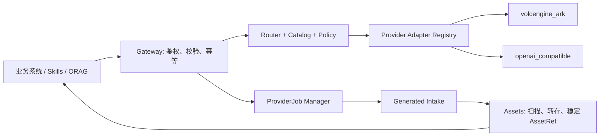

# Provider Gateway 基座调研与实施方案

> 调研日期：2026-07-22。本文是下一阶段实现决策的依据；已有规格仍以 [统一模型 Provider](../07-unified-model-provider.md)、[媒体资产平台](../11-media-asset-platform.md)、[API 与领域事件](../13-api-event-contracts.md) 为准。

## 1. 结论：建设“能力网关”，而不是“模型 SDK 集合”

Provider Gateway 应成为业务系统、Codex Skills、ORAG 和后台 Worker 使用模型的唯一入口。调用方只声明 `capability`、逻辑 `model_alias`、输入、约束和可信 ProjectContext；它不携带供应商名称、厂商模型 ID、Endpoint、API Key 或临时产物 URL。这与现有共享基座“能力一次配置、按组织/项目计量和隔离”的原则一致（[05 共享基座](../05-shared-foundation.md#L101-L139)，[07 Provider 规格](../07-unified-model-provider.md#L12-L25)）。

首期应保持火山方舟为默认 Provider，但把适配代码按**协议族**而非按截图中的每一个模型拆分：

| 适配器 | 首期职责 | 为什么这样拆分 |
| --- | --- | --- |
| `volcengine_ark` | 方舟图片、视频、LLM/VLM、Embedding | 方舟官方 Go SDK 已提供 Images，以及创建、查询和列举 Content Generation Task 的接口（[官方 SDK API](https://pkg.go.dev/github.com/volcengine/volcengine-go-sdk/service/arkruntime)）。 |
| `openai_compatible` | 只接入确实兼容且经验证的 Chat/Images 协议供应商 | “OpenAI compatible”不是产品能力保证；图片、视频、流式、错误和用量字段须逐项通过契约测试。 |
| `fake` | 本地开发、故障演练和 Consumer Contract | 永不删除，避免真实计费/内容政策成为日常测试依赖。 |

不建议第一期接入每一个供应商和模型。先交付 Ark 图片真实闭环，再交付 Ark 视频异步闭环；`openai_compatible` 只作为受控扩展点和第二个真实协议验证对象。

## 2. 已验证的外部 API 事实

### 2.1 火山方舟：图片与视频不是同一种执行模型

- 火山官方 API Explorer 的 `ImageGenerations` 是“图片生成 API”，按模型 ID 调用；官方 SDK 同时提供 `GenerateImages` / `GenerateImagesStreaming` 入口。因此 Gateway 必须允许 Adapter **提交即带最终 outputs**，不应为了复用视频轮询而人为制造厂商任务 ID。[图片生成 API](https://api.volcengine.com/api-explorer/?action=ImageGenerations&groupName=%E5%9B%BE%E7%89%87%E7%94%9F%E6%88%90API&serviceCode=ark&tab=2&version=2024-01-01)；[方舟 SDK Images](https://pkg.go.dev/github.com/volcengine/volcengine-go-sdk/service/arkruntime)
- 同一官方 SDK 暴露 `CreateContentGenerationTask`、`GetContentGenerationTask` 和 `ListContentGenerationTasks`，适合视频等长任务使用“提交—查询—完成”的 Adapter 路径。[方舟 SDK Content Generation Task](https://pkg.go.dev/github.com/volcengine/volcengine-go-sdk/service/arkruntime#Client.CreateContentGenerationTask)
- 因而内部统一 Job 外观可以一致，但 Adapter 返回须区分 `completed(outputs)` 和 `accepted(external_task_id)`：图片可直接进入 Intake；视频保存外部任务 ID 后由可恢复 Poller 推进。

### 2.2 OpenAI：可作协议参照，但不能冒充所有兼容网关都支持

- OpenAI 的图片流式事件在完成时提供 Base64 图像与用量；这佐证了统一输出层需要能保存“私有字节/句柄”，而不是只假定有公开 URL。[图片流式 API](https://platform.openai.com/docs/api-reference/images-streaming/image_generation/partial_image)
- OpenAI 视频 API 是典型异步模型：创建返回 `queued` 与 `progress`，之后可查询任务并通过 `/content` 下载视频字节。[视频 API](https://platform.openai.com/docs/api-reference/videos)
- OpenAI 文档也说明不同 API 的数据留存能力不同，例如图片模型的 Zero Data Retention 支持不同；因此 Model Catalog 必须把数据留存、区域、版权/内容政策作为可路由约束，而不能仅保存模型名。[数据控制说明](https://platform.openai.com/docs/models/default-usage-policies-by-endpoint)

## 3. 目标架构与不变量



以下不变量必须在首期落地：

1. **边界**：Adapter 是唯一能见到供应商 Client、密钥和原始响应的层；HTTP Handler、领域对象和业务包不得 import 厂商 SDK。
2. **租户与项目**：服务端从可信身份取得 Organization；每个调用、Job、用量和审计记录落到 Project，不能由客户端覆盖组织。详见 [13 契约](../13-api-event-contracts.md#L57-L67)。
3. **稳定交付**：ProviderJob 取得临时 URL/Base64 仍只是 `outputs_ready`；仅在 Assets 验证、扫描、转存后得到 `ProjectAssetRef` 才能 `succeeded`。厂商 URL 绝不成为业务长期引用（[11 生成资产接入](../11-media-asset-platform.md#L54-L70)）。
4. **幂等与结果未知**：创建使用 `Idempotency-Key`；提交超时、Worker 崩溃或响应丢失时先查询外部任务/已有 Intake，再决定是否重试，不能盲目再次生成（[13 幂等](../13-api-event-contracts.md#L49-L55)）。
5. **密钥**：数据库只保存 `credential_ref`、供应商/作用域/版本/状态/审计；真实 Key 由运行时 Secret Manager/KMS 注入。不得写入浏览器、普通日志、业务表或仓库（[14 安全基线](../14-engineering-operations-security.md#L20-L35)）。截图内已暴露的密钥应先轮换，且生产凭据不得走明文 HTTP Endpoint。

## 4. 建议的数据与接口基座

### 4.1 最小配置域

| 实体 | 必需内容 | 设计限制 |
| --- | --- | --- |
| `provider_registrations` | `provider_code`、健康、支持的协议/能力 | 代码注册 Adapter，数据库只启停和配置。 |
| `provider_credentials` | `credential_ref`、供应商、区域、轮换/吊销状态 | 无 `api_key` 明文列；权限按 Adapter 最小化。 |
| `model_catalog_entries` | 别名、实际模型/Endpoint、能力、输入输出限制、区域、数据政策、生命周期、价格版本 | 业务仅引用别名，如 `cookies.image.standard`。 |
| `routing_policies` | 组织/项目范围、主/备用、超时、并发、预算、灰度 | 媒体任务提交后不可静默切模。 |
| `provider_jobs` | Context 快照、解析后的 catalog 版本、Provider 状态、外部任务 ID、重试/心跳、错误 | 公共 Job 保持 `queued/running/succeeded/failed/cancelled`；生成领域状态单独保存。 |
| `provider_job_outputs` | `provider_job_id`、`output_id`、受控私有句柄、过期时间、声明 MIME/大小/哈希 | 只让对应 Adapter 的 `Open(ProviderOutputRef)` 读取；不暴露厂商 URL。 |
| `model_invocations` / `usage_ledger` | trace、输入摘要哈希、用量、成本估算/实际值、路由与降级原因 | Prompt/原始媒体默认不进日志。 |

配置表和 ProviderJob 必须有 `organization_id` 前缀索引和受控 Repository 上下文，符合 [14 多租户规则](../14-engineering-operations-security.md#L38-L43)。模型别名变更采用新版本、灰度和回滚，不覆写已提交 Job 的路由快照。

### 4.2 对内 Adapter 契约

建议把当前仅面向 Fake 的异步抽象收口为下面两种提交结果；二者复用 `Get`、`Cancel` 和受控 `Open`：

```text
Submit(request) -> Completed{outputs, usage} | Accepted{external_task_id}
Get(external_task_id) -> Running{progress} | Completed{outputs, usage} | Failed{classified_error}
Open(provider_output_ref) -> stream + declared metadata
Cancel(external_task_id) -> accepted | already_terminal
```

- `Completed`：Ark 同步图片、Base64 图片等。创建 ProviderJob 后持久化输出句柄并创建逐输出 Intake。
- `Accepted`：Ark 视频。持久化外部 ID 与下一次轮询时间，Poller 以指数退避和抖动查询；若未来厂商提供回调，回调必须验签，且仍保留轮询对账。
- `Open`：负责刷新临时下载地址、读取私有 Base64 或厂商下载流；Assets 只收到字节流和声明元数据，执行 MIME、大小、SHA-256、恶意文件与媒体探测校验。

这正好兼容既有 `ProviderOutputRef` 和“一次 Intake 一个输出”的约束（[11 生成资产接入](../11-media-asset-platform.md#L54-L70)）。

## 5. 状态、可靠性与事件

ProviderJob 的生成状态建议为：

`submitted → running → outputs_ready → ingesting → succeeded | partially_succeeded | failed | cancelled | expired`

`succeeded` 只代表至少一组已承诺的稳定资产，而非供应商 API 200。多输出按 `output_id` 独立 Intake，已有资产加上失败项为 `partially_succeeded`。输出临时资源无法刷新时标为 `expired`，不要伪装成普通网络重试。

错误至少分为：

| 分类 | 例子 | 默认动作 |
| --- | --- | --- |
| 不可重试 | 鉴权、非法参数、内容安全/版权拒绝、预算不足 | 终态或人工处理；不换模重试。 |
| 可重试 | 网络短故障、429、可确认的 5xx | 有上限的退避+抖动；复用同一幂等/外部任务。 |
| 结果未知 | 提交请求超时、Worker 在提交后崩溃 | 对账外部任务/Intake，禁止直接再提交。 |
| 落盘失败 | 下载、扫描、转存失败 | 保留私有输出句柄，进入 Intake 补偿。 |

状态变化与 `model.job.completed.v1` / `asset.ready.v1` 采用事务 Outbox；事件只带状态和稳定资源引用，不带 Prompt、密钥或临时 URL。消费者以 `event_id` 幂等，失败进入退避、死信和重放（[13 事件](../13-api-event-contracts.md#L80-L116)，[14 可靠消息](../14-engineering-operations-security.md#L45-L52)）。

## 6. 分阶段实施与验收

### P0：安全与契约收口（先做）

1. 轮换截图中出现的全部 Key；移除明文 Key/HTTP 生产 Endpoint，加入 Secret 扫描。
2. 增加 `credential_ref`、模型目录、路由策略和私有 output handle 迁移；配置 Schema 增加 `fake|volcengine_ark|openai_compatible` 开关。
3. 统一错误分类、trace/audit 字段和 Adapter Consumer Contract；保留 Fake 覆盖超时、重复、过期、部分成功和响应丢失。

**验收**：仓库、日志、HTTP 响应和数据库业务表不含 Key；业务请求只使用 alias；未知提交不产生重复外部任务。

### P1：Ark 图片真实闭环（第一张功能卡）

1. 实现 `volcengine_ark` 图片 `Submit -> Completed`，将 URL/Base64 持久化为私有 output handle。
2. 以已有 Generated Intake 转存、扫描并生成项目 Asset；ProviderJob 仅在 Intake 成功后终态成功。
3. 增加图片 Job API、查询页和最小前端：发起、排队/摄取中、完成、部分成功、失败与安全重试。

**验收**：授权成员在已激活项目中创建一张真实图；重放同一 Idempotency-Key 返回同一 Job/Asset；项目素材库显示稳定资产；跨组织不可访问。

### P2：Ark 视频异步闭环

1. 映射 Content Generation Task 的创建、查询、取消到 `Accepted/Get/Cancel`，持久化 `external_task_id`、心跳和下次轮询时间。
2. 实现可恢复 Poller、取消、超时和对账；按视频输出下载、探测、转码/缩略图生成 Asset。
3. 补齐长任务运行指标：接受任务成功率、队列、轮询延迟、完成率、取消、产物下载与单位秒数成本。

**验收**：重启 Worker 后任务能继续对账；供应商完成但 Intake 延迟时 Job 为 `ingesting`；取消、超时和临时输出过期都可见且不重复收费。

### P3：多供应商与治理

1. 以一条经验证的 OpenAI-compatible 路由实现第二 Adapter；在测试矩阵逐项确认实际支持的能力，不能把“兼容”当作全能力承诺。
2. 加入组织级允许列表、配额/预算、健康、熔断、固定评测集与灰度；文本/VLM 可受控降级，媒体任务提交后默认不换模。
3. 提供 `/admin/providers/*` 的凭据引用、模型目录、路由、任务、用量和诊断页面。

**验收**：管理员可通过别名发布、灰度和回滚模型，不修改业务代码；每次调用按 Organization/Project/能力/模型版本追踪用量、成本和审计。

## 7. 完成后的项目效果

完成 P0–P2 后，cookies 将从“本地 Fake 图片闭环”升级为可投产扩展的 Provider Gateway 基座：创意系统只需提交 `image.generate` 或 `video.generate` 与项目上下文；Gateway 按目录和策略选择 Ark 模型；图片可同步接收但仍经 Assets 稳定入库，视频由可恢复异步 Job 管理；所有生成可查状态、取消、对账、追踪成本，并且不会把厂商 Key、模型 ID 或临时 URL 泄漏给前端和业务系统。

完成 P3 后，新增供应商或模型主要是“注册 Adapter + 配置 Catalog/Policy + 契约/评测”，而不是把厂商 SDK 散落进四个业务系统。这样既保留火山默认路径，也获得可审计、可灰度、可回滚的多供应商扩展能力。
