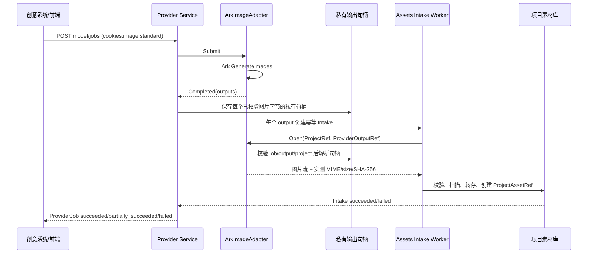

# Provider M1：Ark 真实图片生成技术方案

| 属性 | 结论 |
| --- | --- |
| 目标 | 用一个真实的火山方舟（Ark）图片模型，跑通 `image.generate → ProviderJob → Assets Intake → ProjectAssetRef`。 |
| 范围 | 真实 Ark 图片、现有 `ProviderJob`、项目素材入库、最小任务状态查询与回归测试。 |
| 明确不做 | P0 安全/凭据中心改造、视频、第二供应商、成本/配额/灰度和 Provider 管理台。 |
| API 外观 | 保持 `POST/GET /platform/v1/projects/{project_id}/model/jobs`；业务只使用 `cookies.image.standard`。 |

## 1. 调研结论与约束

Ark 的 `ImageGenerations` 是**一次调用即返回结果**的图片 API：请求使用模型 ID 或 Endpoint ID，非流式响应包含实际 `model`、`data[]` 和 `usage`；每个输出为 URL 或 Base64，URL 模式是 JPEG 下载链接。[Ark ImageGenerations 官方 API](https://api.volcengine.com/api-docs/view?action=ImageGenerations&serviceCode=ark&version=2024-01-01) M1 用一个受限的标准库 HTTP 客户端实现该公开协议，避免为单一图片能力把 SDK 类型泄漏到 Provider 核心；以后可在 Adapter 内部替换为官方 SDK，公共契约不变。[Ark Go SDK API](https://pkg.go.dev/github.com/volcengine/volcengine-go-sdk/service/arkruntime)

这与仓库当前的 Fake 路径不同：`ImageProviderAdapter` 强制 `Submit → ExternalTaskID → Poll`，[adapter.go](../../internal/platform/provider/adapter.go) 而 `ExecuteImageJob` 总会先进入 `running` 再 Poll。[execution.go](../../internal/platform/provider/execution.go) 现有 Provider 状态机本身已支持 `outputs_ready → ingesting → succeeded`，[provider.go](../../internal/platform/contract/provider.go) 所以需要扩展的是 Adapter 的**提交结果形状**，不是另建一套图片 Job。

Ark 支持 `response_format=url|b64_json`，但响应契约不提供每张图片的字节长度和 SHA-256。[Ark ImageGenerations 官方 API](https://api.volcengine.com/api-docs/view?action=ImageGenerations&serviceCode=ark&version=2024-01-01) M1 因此固定使用 `b64_json`：Adapter 解码实际字节、探测 MIME、计算长度和 SHA-256 后再创建 `ProviderOutputRef`，绝不伪造元数据。

## 2. M1 目标架构



不变边界：Provider 不创建 Assets 记录；Assets 只通过 `GeneratedOutputFetcher.Open` 读取经过项目授权的输出并转存。这个边界已在模块说明和 `GeneratedIntakeWorker` 中实现，应保持不变。[Provider README](../../internal/platform/provider/README.md) [Assets README](../../internal/platform/assets/README.md) [generated_intake_service.go](../../internal/platform/assets/generated_intake_service.go)

## 3. 关键设计

### 3.1 同步提交结果

将接口替换为可判别的提交结果：

```text
Submit(request) -> Accepted{provider, model_version, external_task_id}
                | Completed{provider, model_version, outputs, usage}
Poll(reference) -> Running | Completed | Failed       // M1 不由 Ark 图片路径使用
Open(project_ref, provider_output_ref) -> bytes + verified metadata
```

`FakeImageAdapter` 继续返回 `Accepted`，原有轮询契约测试不变；新 `ArkImageAdapter` 返回 `Completed`。执行器收到 `Completed` 时在同一状态推进中持久化输出并转到 `outputs_ready`，然后复用既有 `ProcessImageJob` 创建/查询 Intake。这样 API 对外仍是 `202 + ProviderJob`，即便 Ark 图片本身同步返回，也不会在素材完成转存前宣告成功。

M1 固定请求 `response_format=b64_json`，不启用流式、编辑、参考图或组图；输入仅映射现有 `prompt + width + height` 到经过白名单验证的 Ark `model`、`size`。实际 Ark 模型/Endpoint 仅在服务端配置中映射：

```text
cookies.image.standard -> { provider: volcengine_ark, ark_model_or_endpoint: ... }
```

业务请求、Creative 代码和 OpenAPI 都不得出现 Ark 模型 ID。

### 3.2 私有输出句柄与元数据发现

新增 Provider 私有表 `provider_job_output_handles`（不对 HTTP、事件或 Assets 公开）：

| 字段 | 用途 |
| --- | --- |
| `provider_job_id, output_id` | 与现有 `provider_job_outputs` 一对一、联合主键/FK。 |
| `organization_id, project_id` | `Open` 的强制范围校验，不能只依赖调用者传入的 `ProviderOutputRef`。 |
| `handle_kind` | M1 仅 `inline_bytes`；预留将来的 `ark_url` 或对象存储缓存类型。 |
| `handle_payload` | 仅 Adapter 可读的原始图片字节（`LONGBLOB`，受现有图片上限约束）；不放入 Job 响应、事件、普通日志或 Assets 表。 |
| `expires_at` | 私有缓存的短期保留截止时间；Intake 成功后删除，未能在截止前入库时转为 `expired`。 |
| `created_at, updated_at` | 恢复、诊断和清理。 |

`Open` 必须先按 `(organization_id, project_id, provider_job_id, output_id, provider_code)` 查句柄，再从私有缓存返回流。Adapter 在写句柄前以实际字节探测 MIME、计算大小和 SHA-256；`ProviderOutputRef` 继续携带这些真实声明值，Assets 仍以自身读取到的字节再次校验。不得信任 URL 后缀、HTTP `Content-Type` 或人为拼出的元数据。

这避免了为满足当前非空字段而放宽公共契约；M1 的临时二进制数据只留在 Provider 自有表、受现有图片大小上限约束，并在 Intake 成功或过期后清理。将大对象缓存迁移到 Provider 专用临时 Bucket 是后续扩容优化，不是 M1 前置条件。

### 3.3 状态、幂等与未知提交

正常路径：

```text
submitted → outputs_ready → ingesting → succeeded
                              └→ partially_succeeded / failed / expired
```

一张请求返回多图时，按稳定顺序生成 `output_1...output_n`；每个输出使用既有 `provider-job-{job_id}-output-{output_id}` Intake key。最终状态只在至少一个 `ProjectAssetRef` 已稳定可读时为 `succeeded`/`partially_succeeded`，与现有事件 schema 的要求一致。[model.job.completed.v1](../../api/events/model-job-completed-v1.schema.json)

HTTP 创建仍使用现有 `(organization, project, principal, operation, Idempotency-Key)` 唯一键和请求哈希；同 key、同 body返回原 Job，不同 body 冲突。[provider_jobs migration](../../migrations/provider/20260722133000_provider_jobs.up.sql) 但 Ark 图片官方接口文档没有公布可供本服务传递的幂等键或图片任务查询 ID；这意味着**提交超时、连接中断或 5xx 后结果未知时绝不能自动再次 Submit**。M1 将这些情况分类为不可自动重试的 `MODEL_SUBMISSION_UNKNOWN`（保留原 Job 供人工核对），而不是让当前 Runtime 对所有错误每 5 秒重试最多 100 次。[scheduler.go](../../internal/platform/provider/scheduler.go)

这条限制只约束“无法知道 Ark 是否已接收”的 Submit；私有缓存读取、Assets 扫描/转存仍按现有独立 Intake 重试，且持续复用同一个私有句柄。

### 3.4 错误映射

| 上游/本地情形 | 公共错误码 | 自动动作 |
| --- | --- | --- |
| Ark 输入/输出敏感内容（官方 400） | `MODEL_REQUEST_REJECTED` | 终态失败，不重试。 |
| Ark 参数/模型不支持（400） | `MODEL_REQUEST_REJECTED` | 终态失败，不重试。 |
| Ark `QuotaExceeded`（429） | `MODEL_RATE_LIMITED` | 有上限退避；429 表示请求未被接收。 |
| 明确的 5xx（响应已知） | `MODEL_PROVIDER_UNAVAILABLE` | 有上限退避。 |
| 传输超时、连接中断、进程在 Submit 后崩溃 | `MODEL_SUBMISSION_UNKNOWN` | 不自动再提交。 |
| 私有输出缓存过期 | `PROVIDER_OUTPUT_EXPIRED` | Job `expired` 或含其他成功输出时 `partially_succeeded`。 |
| 下载/扫描/转存失败 | 复用现有 Assets 错误 | 由 Intake 自身有限重试和补偿处理。 |

Ark 官方文档列出敏感内容 400 和 `QuotaExceeded` 429，故前两类不能以“重试”掩盖策略/输入问题，429 需退避。[Ark ImageGenerations 官方 API](https://api.volcengine.com/api-docs/view?action=ImageGenerations&serviceCode=ark&version=2024-01-01)

## 4. 最小改动清单

1. 在 Adapter 内实现受限的 Ark `POST /images/generations` 协议客户端；若后续引入官方 SDK，也只能由 Adapter import，不能改变 Provider 的公开 seam。
2. 在 `internal/platform/provider` 新增 `ark_image_adapter.go`、私有句柄 repository 和可分类错误类型；实现 `GenerateImages`、Base64 输出解码、`Open` 的范围/过期/流量限制校验。
3. 演进 [adapter.go](../../internal/platform/provider/adapter.go) 的提交结果，并修改 [execution.go](../../internal/platform/provider/execution.go) 的同步完成分支；保留 Fake 的 `Accepted/Poll` 覆盖。
4. 新增一份 Provider migration：私有句柄表（短期 `LONGBLOB` 缓存与真实元数据）；在 [mysql_store.go](../../internal/platform/provider/mysql_store.go) 事务中同 Job 输出一起写入/读取句柄元数据。
5. 保持 [provider.go](../../internal/platform/contract/provider.go)、[intake.go](../../internal/platform/assets/intake.go)、[generated_intake_service.go](../../internal/platform/assets/generated_intake_service.go) 和 OpenAPI 的已冻结输出元数据契约不变。
6. 在组合根 [main.go](../../cmd/cookies-api/main.go) 的既有 local 全链路模式中，以显式模式装配 `fake` 或 `ark_image`，并把同一个 Ark Adapter 注入 Provider 执行器和 Assets Intake Worker；生产服务身份与非 local 装配留待后续阶段。P0 范围外的凭据治理不在本卡改造，但 M1 不新增前端传 Key、日志打印 Key 或业务表持久化 Key 的路径。

## 5. 验收与测试矩阵

- Adapter contract：请求映射、`Completed` 输出、模型实际版本记录、私有原始字节不出现在 `ProviderJob`/事件/API 响应。
- 同步闭环：创建一次真实 Ark 图片 Job，依次可观察 `submitted/outputs_ready/ingesting/succeeded`，最终素材列表出现可预览的 `ProjectAssetRef`。
- 多输出：一个响应的若干输出各自 Intake；一个入库失败时 Job 为 `partially_succeeded`，保留成功资产。
- 隔离：错误组织、项目或 output ID 调 `Open` 被拒绝；私有输出字节不能从任一公共 JSON 获得。
- 幂等：相同 HTTP Key 返回同一 Job；相同 output 的 Intake 不重复建 Asset；不同 body 返回冲突。
- 失败：400 敏感内容不重试；429 有限退避；Submit 传输不确定不产生第二次 Ark 调用；私有缓存过期为可见终态；读取临时失败由 Intake 重试。
- 回归：现有 Fake 联合测试、Provider/MySQL 集成测试、Assets Intake/隔离测试、OpenAPI schema 校验全部通过。

## 6. M1 完成后的可见效果

用户在一个已授权的 Project 中提交 `cookies.image.standard` 后，可以查询一个不暴露厂商细节的 ProviderJob；真实 Ark 图片经项目范围校验、内容校验和对象存储转存后出现在项目素材库。业务系统只保存稳定 `ProjectAssetRef`，不会保存 Ark URL 或模型 ID。Fake 仍可在本地完整回归，未来视频和第二供应商可复用 `Accepted` 分支，而不用改动业务系统的调用方式。
