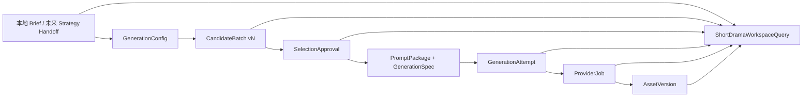

# 短剧前贴下一迭代技术方案：配置生效、候选重生成与工作区恢复

> 日期：2026-07-30
> 状态：待产品与技术 Owner 确认；本文只给出技术方案，不修改业务代码。
> 范围：创意创作 / 视频创作 / 效果广告 / 短剧前贴
> 当前代码基线：`codex/kanon-frontend-go-backend`

## 1. 结论

三个优化点应该作为一条链路实现，不能拆成三个前端补丁：



推荐的核心决策：

1. 字幕样式、钩子强度等创作配置进入版本化 `PromptPackage`，并参与 Hash；时长、画幅、分辨率、音频策略进入 `GenerationSpec`。
2. “重新生成候选”在同一个 `CreativeTask` 下追加新的 `CandidateBatch`，不再创建新的 Intake 和 Task，也不覆盖旧候选。
3. 页面刷新通过服务端 `ShortDramaWorkspaceQuery` 恢复，不再从“全项目最新视频 Job”猜测当前短剧任务。
4. `CreativeTask`、`ProviderJob`、`AssetVersion` 继续由各自领域拥有；工作区查询只做聚合，不复制权威状态。
5. 第一阶段可以保留确定性候选 Planner 作为降级实现，但要接入统一 Provider 的结构化文本生成，才能真正提升候选质量。

## 2. Kanon 架构给出的约束

这次方案遵守以下已经存在的边界：

- Creative 拥有 `CreativeIntake`、Route 选择、`CreativeTask`、Draft、Prompt、候选和 generation gate；Strategy 未来只通过稳定 Handoff 提供目标、事实、限制和允许路线。
- `CreativeIntake.input_snapshot` 是不可变来源快照；上游 Strategy 或本地 Brief 变化不能静默改写已有任务。
- `planning_ready`、`generation_ready`、`production_ready` 是三个不同门禁，不能压成一个“可生成”布尔值。
- Provider 只拥有模型执行状态；Provider 故障不能导致 Brief、候选和创意草稿不可读取。
- Provider 成功结果必须转存为稳定 `AssetVersion`；页面不能长期依赖厂商临时 URL。
- 创建、生成、确认等写操作使用 `Idempotency-Key`，可变草稿写入使用 `expected_revision`。

固定上游来源：

- [Creative PRD：候选、受控变体、版本与恢复](https://github.com/shikanon/cookies/blob/ba487f6ce96294ef5fcee2a16979a6d24de9ab4a/docs/02-creative-studio-prd.md)
- [Strategy → Creative 开发契约](https://github.com/shikanon/cookies/blob/ba487f6ce96294ef5fcee2a16979a6d24de9ab4a/docs/25-strategy-to-creative-development-contract-v2.md)
- [PromptPackage、GenerationSpec、Candidate 与 ProviderJob 边界](https://github.com/shikanon/cookies/blob/ba487f6ce96294ef5fcee2a16979a6d24de9ab4a/docs/plans/2026-07-28-guerlain-commerce-preroll-seedance-technical-plan-v2.md)
- [Brief 驱动工作区与刷新恢复](https://github.com/shikanon/cookies/blob/ba487f6ce96294ef5fcee2a16979a6d24de9ab4a/docs/plans/2026-07-28-brief-driven-commerce-preroll-five-template-technical-plan.md)
- [短剧前贴固定输入 Fixture](https://github.com/shikanon/cookies/blob/ba487f6ce96294ef5fcee2a16979a6d24de9ab4a/api/fixtures/creative-video-intake-short-drama-preroll-v1.json)

## 3. 当前代码审计

### 3.1 生成配置没有完整生效

当前前端在 `src/components/SpecializedPages.tsx` 中：

- 字幕样式使用 `defaultValue`，没有受控状态和 `onChange`。
- 钩子强度使用 `defaultValue="4"`，没有受控状态和 `onChange`。
- 创建候选时固定提交：
  - `subtitleStyle: 'high_contrast_dynamic'`
  - `transition: 'hard_cut'`
  - `hookStrength: 4`

当前后端已经保存 `SubtitleStyle`、`Transition`、`HookStrength`，但：

- `compileShortDramaPrompt` 只把字幕枚举文本简单拼入 Prompt。
- `DirectorSpec.post_production_constraints` 始终写死为“高对比动态字幕”。
- `HookStrength` 没有影响首秒钩子、切镜密度、台词直接度、情绪幅度或声音强调。
- `DirectorSpec` 是 `map[string]string`，缺少编译期约束，容易出现页面字段已新增但 Prompt 没使用的情况。

所以当前只是“请求里有字段”，不是“生成语义真正生效”。

### 3.2 三个候选有结构差异，但仍是固定模板展开

当前 Planner 已提供：

- 台词对峙
- 关键动作
- 群体反应

它们比最初的三个近似候选更好，但仍存在：

- 相同输入永远得到相同候选 ID、文案和分镜。
- 候选分数固定为 `88 / 85 / 82`，不是模型评估，更不是效果预测。
- 没有 `CandidateBatch`、批次版本、Planner 版本、主要变化轴和保持项。
- 没有文案相似度、节奏差异、视觉差异的服务端校验。
- “生成 AI 候选”实际执行的是确定性 Go 模板，不是统一 Provider 文本模型。
- 再次点击会创建新的 Intake 和 Task，不是真正的“同一任务重新生成”。

### 3.3 服务端已有草稿持久化，但前端恢复绕开了它

可复用基础：

- `creative_video_drafts` 以 revision 追加保存完整 JSON。
- `ReviseVideoDraft` 已支持 `expectedRevision` 乐观并发。
- `GetTaskDetail` 能返回最新 `VideoDraft` 和 `ProductionJobs`。
- 候选选择已经写入新 Draft revision。
- Provider Job 自身已经持久化输入、状态、进度、外部任务 ID 和输出。

当前缺口：

- 页面加载调用全项目 `listPrerollJobs`，只按 `artifactKind === 'video'` 过滤，再取最后一个 Job。
- 该 Job 可能属于游戏前贴、电商前贴或其他视频任务。
- 未生成视频前，刷新无法恢复完整 Brief、三个候选、选中项和当前 Task ID。
- 成功后初次加载没有可靠恢复 `generatedVideoUrl`。
- `creative_production_jobs` 的主键是 `(organization_id, task_id, job_kind)`，短剧视频固定使用 `video_generate`；同一 Task 第二次生成会冲突。
- 选中候选时 Task 被写为 `ready_for_review`，但这时尚未生成视频，业务语义过早。

## 4. 目标领域模型

### 4.1 GenerationConfig

Creative 拥有的可编辑创作配置：

```go
type ShortDramaGenerationConfig struct {
    SubtitleStyle string `json:"subtitle_style"`
    HookStrength  int    `json:"hook_strength"`
    PaceProfile   string `json:"pace_profile"`
}
```

第一版枚举建议：

```text
subtitle_style:
  high_contrast_dynamic
  brand_minimal

hook_strength:
  1..5

pace_profile:
  auto
  punchy
  balanced
  suspense_hold
```

`transition` 在当前“独立 6 秒前贴视频”口径下不需要给用户选择。如果未来重新要求与正片拼接，再将它放入后期剪辑规格，而不是继续作为无效的 Provider 字段。

Provider 执行规格单独建模：

```go
type ShortDramaGenerationSpec struct {
    ContractVersion  string `json:"contract_version"`
    PromptPackageHash string `json:"prompt_package_hash"`
    DurationSeconds  int    `json:"duration_seconds"`
    AspectRatio      string `json:"aspect_ratio"`
    Resolution       string `json:"resolution"`
    AudioPolicy      string `json:"audio_policy"`
    CandidateCount   int    `json:"candidate_count"`
    ContentHash      string `json:"content_hash"`
}
```

本页面一次只对人工选中的方案生成一个视频，因此 `CandidateCount=1`。

### 4.2 CandidateBatch

候选不是 Draft 上一组无版本数组，而是一个可追溯批次：

```go
type ShortDramaCandidateBatch struct {
    ID                    string                          `json:"id"`
    Revision              int64                           `json:"revision"`
    PlannerVersion        string                          `json:"planner_version"`
    PromptCompilerVersion string                          `json:"prompt_compiler_version"`
    DiversityNonce        string                          `json:"diversity_nonce"`
    Config                ShortDramaGenerationConfig      `json:"generation_config"`
    ConfigHash            string                          `json:"generation_config_hash"`
    VariationIntent       string                          `json:"variation_intent"`
    Candidates            []ShortDramaPrerollCandidate    `json:"candidates"`
    CreatedAt             time.Time                       `json:"created_at"`
}
```

`DiversityNonce` 只用于文本候选规划，不能映射为 Seedance 2.0 的 `seed`。官方目前标注 Seedance 2.0 不支持 seed。

每个候选新增：

```text
primary_variable       本候选主要改变的创意轴
execution_angle        台词对峙 / 动作揭示 / 群体反应
pacing_profile         快切直入 / 递进揭示 / 悬停蓄力
visual_grammar         特写正反打 / 动作匹配 / 群像反应
variant_hypothesis     为什么该方向可能更吸引目标观众
locked_elements[]      Brief 事实、人物设定、CTA、禁用项
```

旧 `Score=88/85/82` 建议暂时移除。若保留，只能明确标为 `mechanism_relevance` 启发式分，不得展示为 CTR、CVR 或“效果概率”。

### 4.3 PromptPackage

把 `map[string]string` 改为强类型结构，并冻结所有影响生成的语义：

```go
type ShortDramaPromptPackage struct {
    ContractVersion       string                       `json:"contract_version"`
    PromptCompilerVersion string                       `json:"prompt_compiler_version"`
    InputSnapshotHash     string                       `json:"input_snapshot_hash"`
    CandidateBatchID      string                       `json:"candidate_batch_id"`
    CandidateID           string                       `json:"candidate_id"`
    GenerationConfig      ShortDramaGenerationConfig   `json:"generation_config"`
    DirectorSpec          ShortDramaDirectorSpec       `json:"director_spec"`
    SubtitleSpec          ShortDramaSubtitleSpec       `json:"subtitle_spec"`
    Storyboard            []ShortDramaStoryboardBeat   `json:"storyboard"`
    NegativeConstraints   []string                     `json:"negative_constraints"`
    CompiledPrompt        string                       `json:"compiled_prompt"`
    ContentHash           string                       `json:"content_hash"`
}
```

`SubtitleSpec` 至少包含：

```text
mode
max_lines
safe_area
keyword_emphasis
animation_density
contrast_policy
cue_text + start/end time
```

字幕最终推荐由后期稳定烧录。视频模型 Prompt 负责留出安全区、避免场景内乱码文字；后期 Renderer 负责字体、描边、位置和逐字动画。如果第一阶段没有字幕渲染能力，页面必须标注“字幕风格为模型指令，像素级样式暂不保证”。

### 4.4 SelectionApproval

人工选择不只保存一个 ID，而应冻结当时批准的内容：

```text
candidate_batch_id
candidate_id
prompt_package_hash
generation_spec_hash
approved_by
approved_at
```

配置、候选批次、PromptPackage 或 GenerationSpec 任一 Hash 改变，旧选择自动失效，`generation_ready=false`。

### 4.5 GenerationAttempt

新增 Creative-owned 的生成关联记录，但不复制 Provider 执行状态：

```go
type ShortDramaGenerationAttempt struct {
    ID                   string                    `json:"id"`
    TaskID               string                    `json:"task_id"`
    DraftRevision        int64                     `json:"draft_revision"`
    CandidateBatchID     string                    `json:"candidate_batch_id"`
    CandidateID          string                    `json:"candidate_id"`
    PromptPackageHash    string                    `json:"prompt_package_hash"`
    GenerationSpecHash   string                    `json:"generation_spec_hash"`
    ProviderJobID        string                    `json:"provider_job_id"`
    OutputAssetVersion   *contract.AssetVersionRef `json:"output_asset_version,omitempty"`
    CreatedAt            time.Time                 `json:"created_at"`
}
```

新增表建议：

```text
creative_short_drama_generation_attempts
  id PK
  organization_id
  project_id
  task_id
  draft_revision
  candidate_batch_id
  candidate_id
  prompt_package_hash
  generation_spec_hash
  provider_job_id UNIQUE
  output_asset_id NULL
  output_asset_version NULL
  created_at
```

不建议继续用固定 `job_kind=video_generate` 表达多次生成，否则同一任务的第二次尝试会撞现有主键。专用 Attempt 表能保持 `creative_production_jobs` 的旧行为不受影响，并明确“业务生成尝试”和“模型 Job”是两个概念。

## 5. 生成配置如何真正影响 Prompt

### 5.1 SubtitleStyle

`high_contrast_dynamic` 编译为：

- 关键词分段强调，最多两行。
- 高对比描边，竖屏安全区内。
- 0–2 秒可使用更高字幕动画密度。
- 视频基础画面不生成不可控的场景内文字。

`brand_minimal` 编译为：

- 单行或短句，动画克制。
- 统一品牌字体、字号、颜色 Token。
- 不遮挡人物面部和关键动作。
- 字幕 Cue 数量更少。

这些内容同时进入 `SubtitleSpec`、`DirectorSpec.post_production` 和 `compiled_prompt`，并参与 Prompt Hash。

### 5.2 HookStrength

`hook_strength` 不是简单把“强度 4”写进 Prompt，而是通过编译规则影响：

| 强度 | 首次冲突/信息缺口 | 节奏 | 文案 | 镜头与声音 |
| --- | --- | --- | --- | --- |
| 1 | 1.5 秒内 | 克制铺垫 | 暗示式 | 2–3 个镜头，弱强调 |
| 2 | 1.2 秒内 | 稳步加速 | 较直接 | 3 个镜头 |
| 3 | 1.0 秒内 | 均衡 | 直接但保留悬念 | 3 个明确 Beat |
| 4 | 0.8 秒内 | 快切 | 首句直接建立冲突 | 3–4 个镜头，关键音效 |
| 5 | 0.5 秒内 | 高密度 | 最强但仍受事实约束 | 4–5 个短镜头，强声音重音 |

强度只改变表达幅度，不能放宽事实、人物设定、版权或合规限制。

### 5.3 PaceProfile

`auto` 由 Planner 按候选机制选择，其余值由用户锁定：

- `punchy`：短镜头、前置动作、快速 CTA。
- `balanced`：三段式 0–2 / 2–4 / 4–6 秒。
- `suspense_hold`：少切镜、延迟揭示、结尾保留信息缺口。

Prompt 编译器应是纯函数：

```text
Compile(input snapshot, candidate, generation config, compiler version)
  -> PromptPackage + GenerationSpec
```

相同输入与版本必须得到相同 Hash。Provider Request Factory 只读取已批准对象，不在生成按钮点击时重新拼 Prompt。

## 6. 候选质量与重新生成方案

### 6.1 Planner 深模块

定义小接口：

```go
type ShortDramaCandidatePlanner interface {
    Plan(
        context.Context,
        ShortDramaPrerollInputSnapshot,
        ShortDramaGenerationConfig,
        CandidateVariationRequest,
    ) (ShortDramaCandidateBatch, error)
}
```

提供两个 Adapter：

1. `DeterministicShortDramaPlanner`：保留当前 Go 模板，作为测试、离线开发和 Provider 失败时的显式降级。
2. `ProviderShortDramaPlanner`：通过统一 Provider 的 `text.generate` / 逻辑别名调用结构化 JSON 输出，不直接依赖 Ark SDK 或真实模型 ID。

不建议把 Provider 调用、Prompt 编译、多样性校验和 Draft 持久化都放进 HTTP Handler。Planner 对外只返回经过校验的 `CandidateBatch`。

### 6.2 一次生成三个真正不同的方向

默认三个方向：

| 方向 | 主要变量 | 文案 | 节奏 | 视觉 |
| --- | --- | --- | --- | --- |
| 台词对峙 | 语言冲突 | 一句直接反问或公开质疑 | 前快后停 | 人物特写与正反打 |
| 动作揭示 | 关键动作/证据 | 少解释，强调动作后的事实 | 递进加速 | 手部、道具、动作推近 |
| 群体反应 | 社会压力与态度反转 | 从旁观者态度制造悬念 | 前稳后爆 | 群像扫视、反应切换 |

三者共享并锁定：

- Brief 目标与 CTA。
- 已审核卖点和剧情事实。
- 人物身份、关系和禁用项。
- 时长、画幅、分辨率和音频策略。

这样既满足用户要看到“文案、节奏、视觉明显不同”，也能解释主要变化来自哪一种冲突机制。

### 6.3 服务端多样性校验

候选入 Draft 前执行：

- 三个 `execution_angle` 必须唯一。
- `pacing_profile` 至少包含两种，推荐三种唯一。
- `visual_grammar` 不能全部相同。
- Hook、旁白和 Beat Copy 不能只替换少量词。
- CTA、事实、禁用项必须保持一致。
- 不能逐字复用用户填写的正片首句。
- 每个候选必须完整覆盖 0–6 秒且无时间重叠。

文本相似度可先用中文字符 n-gram / Jaccard 做确定性门禁，初始阈值建议 `0.72`，再用真实样例校准。校验失败时：

1. Provider Planner 最多做一次带失败原因的受限修复。
2. 仍失败则返回可读错误，保留当前候选批次。
3. 不用三个近似结果伪装成功。

### 6.4 重新生成语义

新增命令：

```http
POST /api/creative/v1/projects/{project_id}/creative-tasks/{task_id}/short-drama-preroll:regenerate-candidates
Idempotency-Key: short-drama-candidates:{task_id}:{expected_revision}:{operation_id}

{
  "expected_revision": 3,
  "generation_config": {
    "subtitle_style": "brand_minimal",
    "hook_strength": 5,
    "pace_profile": "auto"
  },
  "variation_intent": "more_visual"
}
```

成功行为：

- 在同一 Task 下创建 Draft revision `N+1`。
- 创建全新的 `CandidateBatch` 和 Candidate ID。
- 清空 `SelectionApproval`。
- `generation_ready=false`。
- 旧批次保留在旧 Draft revision 中。

失败行为：

- 不写入半成品 revision。
- 旧候选和已选候选仍可读、可继续生成。

如果用户修改的是标题、剧情梗概、已审核卖点等来源事实，而不是生成配置，则不能在原 Intake 上静默修改。第一版应提示“剧情事实已变化，将创建新的短剧前贴任务”，然后创建新 Intake + Task。

## 7. 刷新恢复与服务端工作区

### 7.1 新增聚合查询

新增：

```http
GET /api/creative/v1/projects/{project_id}/creative-workspaces/short-drama-preroll
```

默认返回该 Project 最近更新、未归档的短剧前贴工作区；没有任务时返回 `200 {"workspace": null}`，避免前端把空状态当异常。

已有按 Task 查询继续保留：

```http
GET /api/creative/v1/projects/{project_id}/creative-tasks/{task_id}/short-drama-preroll
```

响应建议：

```json
{
  "task": {},
  "source": {
    "intake_id": "intake_x",
    "brief_id": "brief_local_urban_reversal_v1",
    "brief_version": 1,
    "input_snapshot_hash": "sha256:..."
  },
  "draft": {
    "revision": 4,
    "generation_config": {},
    "active_candidate_batch": {},
    "selection_approval": {}
  },
  "readiness": {},
  "latest_attempt": {
    "id": "attempt_x",
    "provider_job": {
      "id": "job_x",
      "status": "running",
      "progress": 63,
      "error": null
    },
    "output_asset_version": null
  },
  "presentation": {
    "phase": "generating",
    "can_regenerate_candidates": false,
    "can_generate_video": false
  }
}
```

`ShortDramaWorkspaceQuery` 内部组合：

- Creative Repository：Intake、Task、最新 Draft、Attempt。
- Provider Job Reader：执行状态和进度。
- Asset Reader：稳定结果引用及预览资格。

它是读取侧深模块，不接管三个系统的写入所有权。

### 7.2 页面启动恢复

页面挂载时：

1. 请求 latest short-drama workspace。
2. 恢复本地 Brief 选择和来源事实。
3. 恢复当前 `GenerationConfig`。
4. 恢复完整 CandidateBatch 和人工选择。
5. 若 Provider Job 为 queued/running，继续按 Job ID 轮询。
6. 若 Job succeeded 但 AssetVersion 未就绪，显示“视频转存中”。
7. 若 AssetVersion 已就绪，通过 Assets 预览接口获取短期 URL，并在中间区播放。

禁止再从全项目 Job 列表中取最后一个视频任务作为短剧前贴状态。

`localStorage` 可以缓存面板展开、滚动位置等纯 UI 偏好，但不能成为 Brief、候选、任务进度或视频结果的权威来源。

### 7.3 展示阶段状态

工作区计算状态建议：

```text
empty
editing_source
candidates_ready
candidate_selected
generating
asset_persisting
generated
generation_failed
```

Provider 原始状态继续保持：

```text
queued / submitted / running / succeeded / failed / cancelled / expired
```

二者不共用一个枚举。`ProviderJob=succeeded` 只有在输出已转存为 `AssetVersion` 后，工作区才进入 `generated`。

## 8. 写接口与幂等约定

建议接口集：

```text
POST /creative-intakes
POST /creative-tasks
GET  /creative-workspaces/short-drama-preroll
GET  /creative-tasks/{task_id}/short-drama-preroll
POST /creative-tasks/{task_id}/short-drama-preroll:regenerate-candidates
POST /creative-tasks/{task_id}/short-drama-preroll:select-candidate
POST /creative-tasks/{task_id}/short-drama-preroll:generate
```

`select-candidate`：

```json
{
  "expected_revision": 4,
  "candidate_batch_id": "batch_2",
  "candidate_id": "candidate_2_1"
}
```

`generate`：

```json
{
  "expected_revision": 5,
  "candidate_batch_id": "batch_2",
  "candidate_id": "candidate_2_1",
  "prompt_package_hash": "sha256:...",
  "generation_spec_hash": "sha256:..."
}
```

服务端必须重新读取 Draft 并验证四个引用完全一致，再创建 `GenerationAttempt` 和 ProviderJob。浏览器不提交最终 Prompt、Provider 名称、模型 ID、API Key 或厂商 URL。

同一个 `Idempotency-Key + request hash` 返回同一个结果；相同 Key 不同请求返回冲突。前端不能继续用每次点击时临时 `Date.now()` 作为重试键，应在一次用户操作开始时创建并保存 operation ID，直到该操作明确成功或失败。

## 9. 建议代码落点

后端：

- `internal/systems/creative/short_drama_preroll.go`
  - 强类型 Config、CandidateBatch、PromptPackage、GenerationSpec。
  - 确定性 PromptCompiler 和多样性 Validator。
- `internal/systems/creative/short_drama_workflow.go`
  - regenerate、select、generate 三个领域命令。
- `internal/systems/creative/repository.go`
  - `ShortDramaWorkspaceRepository` 与 `GenerationAttemptRepository` 小接口。
- `internal/systems/creative/mysql_repository.go`
  - Candidate Draft revision 和 Attempt 持久化。
- `internal/platform/httpserver/creative_handlers.go`
  - 工作区 GET 与三个命令 Handler。
- `internal/platform/provider`
  - 复用 `text.generate` 与 `video.generate`；不新增 Creative 直连厂商代码。
- `migrations/creative`
  - 新增 generation attempts 表与索引。

前端：

- `src/data/api.ts`
  - 新 DTO、latest workspace GET、regenerate/select/generate 命令。
- `src/components/SpecializedPages.tsx`
  - 字幕、强度、节奏改为受控状态。
  - 页面加载恢复 workspace。
  - “生成 AI 候选”在已有 Task 时改为“重新生成候选”。
  - 配置改变后标记当前候选过期，禁止拿旧选择生成。
  - 使用 workspace 中的精确 Job 和 AssetVersion，不再扫描项目最新视频 Job。

为避免继续扩大 `SpecializedPages.tsx`，建议拆出：

```text
ShortDramaPrerollWorkspace
ShortDramaCandidatePanel
ShortDramaGenerationConfigPanel
useShortDramaWorkspace
```

这些组件只消费一个工作区 ViewModel，不各自调用 Job、Asset 和 Creative API。

## 10. 实施顺序

### P0：先让配置和恢复正确

1. 定义强类型 Config、PromptPackage、GenerationSpec。
2. 让字幕样式、钩子强度和节奏真正进入编译结果与 Hash。
3. 增加 CandidateBatch revision 和 regenerate 命令。
4. 增加 latest workspace 聚合查询。
5. 前端改为受控配置并恢复 Brief、候选和选择。
6. 修复当前从全项目最新视频 Job 猜状态的逻辑。

### P1：补齐多次生成与资产恢复

1. 增加 GenerationAttempt 表。
2. `generate` 绑定 draft revision、candidate 和两个 Hash。
3. 允许同一 Task 多次生成，不与固定 `video_generate` 主键冲突。
4. 聚合 ProviderJob 进度和 AssetVersion。
5. 刷新后继续轮询，并恢复最终视频播放。

### P2：提升真实候选质量

1. 接入统一 Provider 的结构化文本 Planner。
2. 增加多样性 Validator 与一次受限修复。
3. 建立脱敏短剧样例集和人工评分 Rubric。
4. 用评测结果决定 Planner/Compiler 版本升级，而不是线上静默替换模型。

如果目标是尽快给老板演示完整刷新恢复，P0 与 P1 应先于“更聪明的 LLM 候选”。否则候选质量提高后，仍会因为刷新丢任务和重复创建 Task 而无法稳定使用。

## 11. 验收标准

### 配置

- 切换两种字幕样式后，PromptPackage 的 `SubtitleSpec`、compiled prompt 和 Hash 均不同。
- 钩子强度 1 与 5 的首秒约束、节奏、文案直接度和镜头密度可解释地不同。
- 配置变化不会放宽事实与合规 guardrails。
- Provider 请求中的 duration、ratio、resolution、audio policy 来自冻结 GenerationSpec。

### 候选

- 每批恰好生成三个不同机制候选。
- 三个候选的文案、节奏和视觉语法通过服务端差异门禁。
- 每个候选展示主要变化轴、假设和保持项。
- 重新生成得到新 Batch/Candidate ID；旧 revision 仍可审计。
- 重新生成失败时，原候选不丢失。

### 持久化

- 候选生成后刷新：恢复 Brief、配置和三个候选。
- 人工选择后刷新：恢复选中候选和 generation gate。
- 视频生成中刷新：恢复精确 ProviderJob 并继续进度。
- Provider 成功、资产转存中刷新：显示转存状态，不伪装成已完成。
- AssetVersion 就绪后刷新：中间区恢复真实视频。
- 同项目其他视频任务不会污染短剧前贴页面。
- 同一 Task 可以保留多次生成尝试及其血缘。

### 安全与架构

- 前端响应、日志和业务表不出现 API Key、厂商临时 URL 或真实模型 ID。
- 所有写命令通过 Idempotency-Key 和 expected revision 测试。
- Prompt/Spec Hash 不匹配时不能发起 ProviderJob。
- Provider 失败不影响读取 Brief、候选和已保存 Draft。

## 12. 需要你或同事提供的外部条件

### 开发前必须确认

1. **钩子强度产品语义**
   是否接受本文的 1–5 档映射；5 档是否都对用户开放，还是只展示“低 / 中 / 高”。

2. **字幕落地口径**
   字幕是允许视频模型直接生成，还是必须使用后期 Renderer 稳定烧录。若要稳定字体、描边、位置和逐字动画，需要提供现有字幕/渲染服务接口或确认可新建。

3. **候选重生成规则**
   每次固定重生三个，还是允许只重生某一个；是否需要二次费用确认、每日次数限制和历史批次回看。

4. **当前短剧产品口径**
   继续按“独立 6 秒广告成片”实现，还是未来必须和正片拼接。两者影响后期时间线与 transition 的归属。

5. **当前账号的 Seedance 能力烟测**
   提供或协助确认统一 Provider 中实际启用的逻辑模型别名，验证 6 秒、9:16、720p、生成音频组合及配额、超时、限流和费用。无需把 API Key 发给前端或写进文档。

### 候选质量 P2 前必须提供

6. **统一文本模型路由**
   确认候选规划使用哪个逻辑别名，例如 `cookies.text.standard`，以及是否支持 JSON Schema 结构化输出。

7. **评测样例**
   需要 10–30 组已脱敏、可用于内部测试的短剧标题、剧情梗概、已审核卖点和 CTA；否则只能验证“不同”，无法验证“好”。

8. **人工评分标准**
   由编导或业务 Owner 给出钩子吸引力、剧情忠实、静音可理解、节奏、视觉可执行、合规六项的评分规则和最低通过线。

### 与其他同事对接前提供

9. **Strategy Handoff 冻结契约**
   最终 route ID、目标、受众、claims、CTA policy、渠道规格、禁用项和资产引用字段。当前本地 Brief Adapter 会对齐同一 `CreativeVideoIntake`，不要求重写 Planner。

10. **资产预览与转存接口**
    确认 Provider 成功输出如何变成 `AssetVersionRef`，以及前端如何用该引用换取短期预览 URL。

## 13. 本方案不建议的做法

- 不用 `localStorage` 作为任务恢复主方案。
- 不把字幕样式和钩子强度原样作为未知字段透传给 Seedance。
- 不在浏览器生成最终 Prompt。
- 不通过取“全项目最后一个视频 Job”恢复当前工作区。
- 不在每次重新生成候选时创建新 Intake 和 Task。
- 不覆盖旧 CandidateBatch 或已生成视频的血缘。
- 不把固定的 88/85/82 分展示成转化效果预测。
- 不让 Creative 直接持有 Ark API Key、具体模型 ID 或厂商 SDK。

## 14. 官方 Provider 事实

Seedance 2.0 / 方舟官方接口当前可确认：

- `duration` 支持 4–15 秒，6 秒可显式设置。
- `ratio` 支持 `9:16`。
- `resolution` 支持 720p，具体模型能力仍需当前账号烟测。
- `generate_audio` 是明确请求字段。
- `subtitle_style` 和 `hook_strength` 不是已文档化的 Provider 原生字段。
- Seedance 2.0 当前不支持把 `seed` 作为可复现参数，也不支持 `camera_fixed`。

来源：

- [火山方舟：创建视频生成任务](https://api.volcengine.com/api-docs/view?action=CreateContentsGenerationsTasks&serviceCode=ark&version=2024-01-01)
- [火山方舟：查询视频生成任务](https://api.volcengine.com/api-docs/view?action=GetContentsGenerationsTask&serviceCode=ark&version=2024-01-01)
- [BytePlus ModelArk：Seedance 2.0 视频生成字段](https://docs.byteplus.com/en/docs/modelark/1520757)

更完整的一手事实核对见：

- [`docs/research/short-drama-preroll-config-persistence-sources-2026-07-30.md`](./short-drama-preroll-config-persistence-sources-2026-07-30.md)
