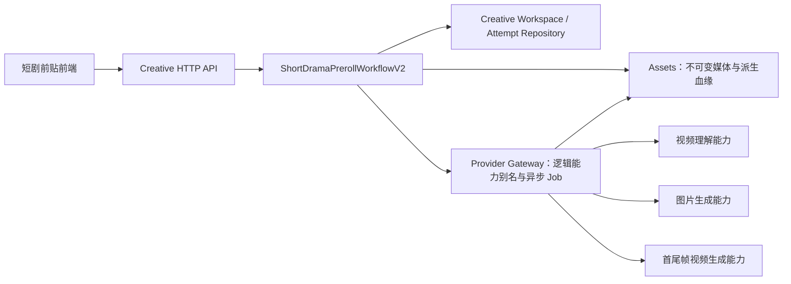
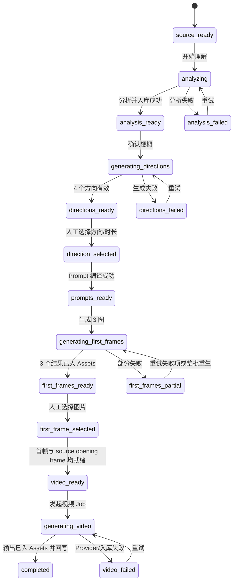
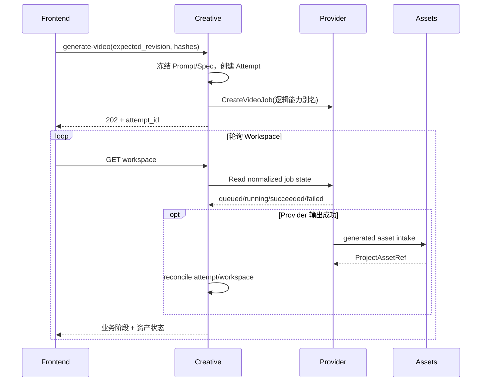

# 短剧前贴 V2 后端技术调研与实施方案

> 日期：2026-08-05
> 状态：需求已确认，可按本文拆分后端开发任务
> 产品位置：创意创作 → 视频创作 → 效果广告 → 前贴广告 → 短剧前贴
> 对应前端方案：[短剧前贴 V2 竖向工作流前端技术方案](./short-drama-preroll-v2-vertical-workflow-frontend-technical-research-2026-08-05.md)

## 1. 结论

短剧前贴 V2 应实现为 Creative 系统内一条新的、可恢复的多阶段工作流，而不是继续扩展当前“手填标题/梗概/卖点 → 3 个文案候选 → 6 秒文生视频”的 V1 流程。

已确认的业务链路是：

```text
选择项目短剧视频
  → 服务端理解视频并生成可编辑梗概
  → 基于梗概生成 4 个前贴方向（2 个猎奇吸睛、2 个剧情总结）
  → 用户选择一个方向和 5/6/10/12/15 秒时长
  → 服务端生成可编辑的首帧图片 Prompt、视频描述和视频 Prompt
  → 根据图片 Prompt 异步生成 3 张首帧候选图
  → 用户选择一张首帧图
  → 服务端提取输入视频的首帧，作为生成前贴时的目标尾帧参考
  → 所选首帧图 + 输入视频首帧 + 视频 Prompt + 时长，生成独立前贴视频
  → 输出视频作为项目资产展示
```

本期明确不做：

- 不把前贴视频和输入短剧视频拼接；
- 不增加业务质检、编导评分或自动淘汰阶段；
- 不做批量多集生成；
- 不让浏览器持有厂商 API Key、模型 ID 或厂商 URL；
- 不要求 AI 生成结果与输入视频首帧像素级一致，只把它作为尾帧条件参考。

后端的推荐落法是：

1. Creative 持有工作流、人工选择、Prompt 快照、失效规则和版本血缘；
2. Provider Gateway 持有具体模型、凭据、重试、异步 Job 和厂商适配；
3. Assets 持有输入视频、抽取帧、3 张候选图和最终视频的不可变资产版本；
4. 前端只调用 Creative 聚合 API，不直接拼 Provider 请求，也不依赖 `localStorage` 恢复业务状态；
5. V2 使用独立契约 `creative-short-drama-preroll-workspace/v2`，保留 V1 数据和接口兼容期。

## 2. 为什么不能直接改造现有 V1

当前短剧前贴后端已经具备：

- 手工输入标题、梗概、已审核卖点等字段；
- 结构化文本模型规划器、剧情事实引用校验和确定性回退；
- 每批 3 个文案/分镜候选、人工选择和 PromptPackage；
- 固定 6 秒、9:16、720p 的文本生成视频请求；
- Creative Task、Draft revision、Provider Job 和 Generation Attempt 的基础血缘。

相关代码：

- [`short_drama_preroll.go`](../../internal/systems/creative/short_drama_preroll.go)
- [`short_drama_preroll_planner.go`](../../internal/systems/creative/short_drama_preroll_planner.go)
- [`short_drama_workflow.go`](../../internal/systems/creative/short_drama_workflow.go)
- [`creative_handlers.go`](../../internal/platform/httpserver/creative_handlers.go)

但 V2 的领域对象已经发生变化：

| V1 | V2 |
| --- | --- |
| 用户手填故事事实 | 从输入视频生成分析快照，用户可修订 |
| 3 个可直接生成视频的候选 | 4 个“创意方向”，只决定后续 Prompt |
| 候选内含文案、分镜、PromptPackage | 选择方向后再生成图片 Prompt、视频描述、视频 Prompt |
| 文本生成视频 | 所选图片为首帧、输入视频首帧为目标尾帧的首尾帧生成 |
| 固定 6 秒 | 5/6/10/12/15 秒 |
| 一次视频异步任务 | 视频理解、3 个图片任务、1 个视频任务组成工作流 |

因此不应把 V2 的“方向”伪装成 V1 `ShortDramaPrerollCandidate`，也不应继续让 `ShortDramaProviderInput` 在点击生成时临时拼 Prompt。否则会出现字段语义混乱、刷新无法恢复、上游修改后下游结果仍被误用等问题。

## 3. 与 Kanon 架构原则的对应

Kanon 架构要求各业务系统拥有自己的领域模型，通过稳定 API、事件和版本化产物交换信息，不共享业务表或状态机；Creative 负责可审阅的创意包，平台层统一提供项目上下文、Provider、媒体与审计能力。

V2 的所有权应如下划分：



边界约束：

- Creative 只保存 `ProjectAssetRef/AssetVersionRef`，不长期保存签名 URL；
- Creative 只使用逻辑能力别名，如 `cookies.vision.standard`、`cookies.image.generate`、`cookies.video.generate`，不保存厂商模型名；
- Provider 成功不等于业务完成；只有输出完成 Assets 入库并回写 Creative，工作区才进入 `completed`；
- Prompt、分析和选择均保存 revision/hash，生成时只能读取冻结快照；
- 所有人工操作进入既有 actor/audit 上下文。

这与 Kanon 仓库当前说明一致：[Cookies README](https://github.com/shikanon/cookies#readme)。

## 4. 可复用能力与缺口

### 4.1 可直接复用

1. **Creative Task 与版本化 Draft**
   当前 `creative_video_drafts.content_payload` 可以继续承载 V2 工作区的领域快照，避免第一版把每个展示字段拆成大量关系表。

2. **Provider 的异步图片/视频 Job**
   [`service.go`](../../internal/platform/provider/service.go) 已提供图片异步任务；[`video.go`](../../internal/platform/provider/video.go) 已支持 `text_only`、`reference_image` 和 `first_last_frame`，时长约束覆盖 4–15 秒，画幅支持 9:16，分辨率支持 720p。

3. **首尾帧 GenerationSpec 模式**
   [`game_preroll_workflow.go`](../../internal/systems/creative/game_preroll_workflow.go) 已有将不可变项目资产编译成 `first_last_frame` Provider 输入的生产示例。短剧 V2 应抽取或复用相同的 spec sealing、hash 和 conditioning asset 校验方法。

4. **派生图片入库**
   [`IngestDerivedImage`](../../internal/platform/assets/upload_service.go) 能把处理器抽出的帧保存为不可变项目资产，并记录精确的源视频 AssetVersion。输入视频首帧应走该入口。

5. **Provider 输出资产入库**
   Provider 已通过 generated-asset intake 将成功输出交给 Assets。Creative 只需补齐该业务的 reconcile，不需要自行下载厂商结果。

6. **视频预处理基础设施**
   [`viral_analyzer.go`](../../internal/integrations/creativeprovider/viral_analyzer.go) 已有受权预览、临时视频、FFmpeg 抽音频、ASR、抽代表帧和 VLM 结构化输出的完整链路。应把其中媒体暂存、抽帧和转写能力提炼为可复用组件，避免复制一套短剧专属 shell 流程。

### 4.2 必须新增或改造

| 能力 | 当前缺口 | V2 建议 |
| --- | --- | --- |
| 视频理解 | 没有短剧专属结构和工作流状态 | 新增 `ShortDramaVideoAnalyzer` 与分析 Attempt |
| 方向生成 | 当前固定 3 个执行候选 | 新增严格 4 项的 Hook Direction Planner |
| Prompt 生成 | Prompt 绑定在旧候选内 | 新增可编辑 Prompt Draft 与编译器版本/hash |
| 首帧图片 | 短剧没有 3 图批次和选择血缘 | 新增 FirstFrameBatch 与 3 个 Provider Job Attempt |
| 输入视频首帧 | 短剧没有派生帧 | 复用 Assets 派生帧，固定 `time_ms=0` 或首个可解码帧 |
| 视频生成 | 当前固定 text-only/6 秒 | 改为冻结的 first-last-frame GenerationSpec |
| 完成回写 | 当前 attempt 只登记 Provider Job | 新增图片、视频 reconcile，将 output asset 写回工作区 |
| 刷新恢复 | 前端仍以本地状态为主 | 新增服务端聚合 Workspace Query |

## 5. 领域模型

### 5.1 工作区聚合

建议新增 `ShortDramaPrerollWorkspaceV2`，仍保存于版本化 Creative Draft JSON，核心结构如下：

```json
{
  "contract_version": "creative-short-drama-preroll-workspace/v2",
  "task_id": "creative_task_x",
  "revision": 8,
  "active_stage": "first_frame_ready",
  "source_video": {
    "asset_id": "asset_source",
    "asset_version_id": "asset_version_source"
  },
  "analysis": {
    "revision": 1,
    "status": "ready",
    "input_hash": "sha256:...",
    "content": {
      "title": "消失的第七份证词",
      "episode": "第 1 集",
      "synopsis": "...",
      "opening_beat": "...",
      "characters": [],
      "visual_keywords": []
    },
    "evidence": [],
    "model_trace": {
      "capability_alias": "cookies.vision.standard",
      "prompt_version": "short-drama-analysis/v1"
    }
  },
  "direction_batch": {
    "id": "direction_batch_x",
    "analysis_revision": 1,
    "status": "ready",
    "items": [],
    "selected_direction_id": "direction_x"
  },
  "prompt_draft": {
    "revision": 2,
    "direction_id": "direction_x",
    "duration_seconds": 6,
    "image_prompt": "...",
    "video_description": "...",
    "video_prompt": "...",
    "compiler_version": "short-drama-prompt/v1",
    "content_hash": "sha256:..."
  },
  "first_frame_batch": {
    "id": "frame_batch_x",
    "prompt_revision": 2,
    "status": "ready",
    "candidates": [],
    "selected_asset": {}
  },
  "source_opening_frame": {
    "asset": {},
    "source_video": {},
    "time_ms": 0,
    "derivation_id": "short-drama-opening-frame-..."
  },
  "sealed_video_spec": {
    "duration_seconds": 6,
    "aspect_ratio": "9:16",
    "resolution": "720p",
    "audio_policy": "generated_audio",
    "input_mode": "first_last_frame",
    "first_frame_asset": {},
    "last_frame_asset": {},
    "prompt_hash": "sha256:...",
    "spec_hash": "sha256:..."
  },
  "latest_video_attempt_id": "attempt_x",
  "output_asset": null
}
```

这里使用 `source_opening_frame`，不把它命名为“正片尾帧”。它在业务上是输入视频的开场帧，在生成模型请求中扮演目标 `last_frame`；本期不会真的拼接两个视频。

### 5.2 视频分析结构

分析输出要服务于后续 Prompt，而不是做泛化的视频摘要。建议 JSON Schema 至少包含：

```go
type ShortDramaVideoAnalysis struct {
    Title          string              `json:"title"`
    Episode        string              `json:"episode,omitempty"`
    Synopsis       string              `json:"synopsis"`
    OpeningBeat    string              `json:"opening_beat"`
    Characters     []DramaCharacter    `json:"characters"`
    CoreConflict   string              `json:"core_conflict"`
    UnresolvedHook string              `json:"unresolved_hook"`
    VisualKeywords []string            `json:"visual_keywords"`
    Tone           string              `json:"tone"`
    Evidence       []AnalysisEvidence  `json:"evidence"`
}
```

`Evidence` 应保存时间点、转写片段或抽帧编号，便于审计和排查模型幻觉；本期不需要把它做成用户质检分数。

用户修改梗概后，服务端生成新的 `analysis.revision`，原始模型输出和证据仍留在历史 revision 中。

### 5.3 四个前贴方向

一批必须恰好 4 个方向：

- 2 个 `curiosity`（猎奇吸睛）；
- 2 个 `summary`（剧情总结）。

```go
type ShortDramaHookDirection struct {
    ID                  string   `json:"id"`
    Category            string   `json:"category"` // curiosity | summary
    Title               string   `json:"title"`
    HookCopy            string   `json:"hook_copy"`
    Description         string   `json:"description"`
    Rationale           string   `json:"rationale"`
    VisualIntent        string   `json:"visual_intent"`
    GroundingEvidenceIDs []string `json:"grounding_evidence_ids"`
}
```

方向 Planner 必须使用结构化输出，并执行最小门禁：

- 数量和分类严格满足 2+2；
- `grounding_evidence_ids` 必须存在于当前 analysis revision；
- 不得新增人物、关系、事件结论；
- 两个同类方向不能只替换形容词；
- 方向生成失败时保留旧批次，不写半成品 revision；
- 可以做一次带失败原因的结构化修复，仍失败则返回可重试错误，不以模板假装模型成功。

V1 的剧情事实引用校验思路可以复用，但不复用 V1 的“3 个 Candidate”结构。

### 5.4 Prompt Draft

选择方向后，服务端一次生成：

- `image_prompt`：用于生成前贴首帧；
- `video_description`：给业务用户阅读的简明方案；
- `video_prompt`：用于首尾帧视频生成。

图片 Prompt 的结构至少覆盖：主体与行动、情绪关系、环境剧情、构图与光影、风格质感、与输入短剧的连续性参考、禁止项。视频 Prompt 至少覆盖：主题、中文解说/台词意图、画面内容、镜头设计、时间轴、声音意图、风格和禁止项。

用户可以编辑三段文本。保存时服务端规范化换行和空白，计算 `content_hash`，并增加 `prompt_draft.revision`。Provider Request Factory 只读取已冻结的 Prompt Draft，不能在点击生成时再次调用 LLM 改写。

字幕由视频模型尝试生成，不增加后期字幕 Renderer；因此 Prompt 可描述短、少、清晰的字幕意图，但不能把字形、逐字准确和复杂排版作为稳定能力承诺。

## 6. 工作流与失效规则

### 6.1 状态机



`active_stage` 是 Creative 的业务阶段，不应直接复用 Provider 的 `queued/submitted/running/succeeded/failed` 枚举。

### 6.2 下游失效矩阵

| 修改动作 | 保留 | 失效 |
| --- | --- | --- |
| 更换输入视频 | 历史 revision/attempt | 分析、方向、Prompt、图片、尾帧参考、视频 |
| 修改分析梗概 | 输入视频、原始分析证据 | 方向、Prompt、图片、视频 |
| 重新生成方向 | 分析 | 已选方向、Prompt、图片、视频 |
| 更换方向 | 分析、方向批次 | Prompt、图片、视频 |
| 更改时长 | 分析、方向、已选首帧图 | 视频描述、视频 Prompt、sealed spec、视频 |
| 修改图片 Prompt | 分析、方向、视频描述草稿 | 图片批次、首帧选择、视频 |
| 更换首帧图 | Prompt 与图片批次 | sealed spec、视频 |
| 修改视频描述/Prompt | 图片和首帧选择 | sealed spec、视频 |

“失效”是创建新 revision 并取消当前引用，不是删除旧资产或旧 Attempt。已经提交到 Provider 的 Job 通常不能可靠撤回；即使它后来成功，也只能作为孤立的历史 attempt 入库，不能覆盖新 revision 的当前结果。

## 7. 分阶段后端实现

### 7.1 绑定输入视频

输入只接受同 Project 下、已 ready、可授权预览的视频 `AssetVersionRef`。服务端校验 MIME、大小、时长、像素尺寸和读取权限，并把精确版本冻结到工作区。

不要只保存 `asset_id`，否则素材上传新版本后，分析和生成血缘会漂移。

### 7.2 视频理解

推荐新增 Creative 端口：

```go
type ShortDramaVideoAnalyzer interface {
    Analyze(ctx context.Context, actor contract.ActorContext,
        projectID contract.ProjectID,
        source contract.ProjectAssetRef,
        request ShortDramaAnalysisRequest,
    ) (ShortDramaAnalysisResult, error)
}
```

Integration Adapter 复用 `ViralAnalyzer` 的基础步骤：

1. 通过 Assets 获取受权的源视频流或短期预览；
2. 暂存到单次请求临时目录；
3. `ffprobe` 读取真实媒体信息；
4. FFmpeg 抽 WAV，ASR 获取带时间上下文的转写；
5. 按时长分层抽代表帧，至少覆盖开场、人物变化和关键冲突，不固定只取前 5 帧；
6. VLM 使用转写、代表帧和媒体元数据输出严格 JSON；
7. 校验 Schema、长度、证据引用和安全字符；
8. 写入新的分析 revision，并清理临时文件。

第一版可同步执行预处理、异步执行整个分析 Attempt。HTTP 返回 `202`，前端通过 Workspace GET 查看阶段。长视频必须设置抽帧数量、转写长度和请求体上限，不能把完整视频 base64 塞入业务表或日志。

### 7.3 生成四个方向和 Prompt

方向和 Prompt 都通过统一文本能力别名调用，但应为两个领域命令：

- `GenerateDirections`：便于失败重试、重新生成方向和保留历史批次；
- `SelectDirectionAndCompilePrompts`：冻结方向与时长后生成 Prompt Draft。

二者不能合成一个 HTTP 请求，否则前端无法只重新生成 4 个方向，也无法准确恢复“已选方向、Prompt 尚未完成”的状态。

### 7.4 生成 3 张首帧图

点击“生成 3 张首帧图”后：

1. 服务端读取当前 Prompt Draft revision；
2. 创建一个 `FirstFrameBatch` 和 3 个 image attempt；
3. 三个 Job 锁定人物、情绪、钩子和风格事实，只为每个 attempt 增加明确的构图变化参数；
4. Provider 使用图片生成逻辑别名提交异步任务；
5. 输出经 Provider → Assets 入库；
6. reconcile 将三个 `ProjectAssetRef` 写回批次；
7. 三个均成功时 `ready`，一至两个成功时 `partial`，全部失败时 `failed`。

建议允许 `partial` 时展示成功图片，但“继续”至少需要一张已成功且用户已选择的图片。产品文案仍写“生成 3 张”；重试可补失败项，整批重新生成则创建新 Batch，不覆盖旧图。

图片生成请求不应传输入视频首帧作为 source image，除非后续明确要求复用正片人物形象并已解决授权/一致性问题。当前已确认链路中，输入视频首帧只作为最终视频的目标尾帧参考。

### 7.5 抽取输入视频首帧

该步骤可在视频分析成功后后台预取，也可在选择方向后懒执行。推荐预取：减少最后一步等待，并尽早暴露损坏视频问题。

实现要求：

- 通过 FFmpeg 抽取 `time_ms=0` 附近第一个可解码画面；
- 输出 PNG/JPEG 后调用 Assets `IngestDerivedImage`；
- `derivation_id` 包含源 AssetVersion、抽帧时间、处理器版本和尺寸策略 hash；
- 相同 derivation 重试返回同一资产，避免重复文件；
- 工作区只保存 `ProjectAssetRef` 和抽帧元数据。

### 7.6 生成前贴视频

用户点击生成前，Creative 编译并冻结：

```go
provider.VideoGenerationInput{
    Prompt:          frozenPrompt,
    DurationSeconds: selectedDuration,
    AspectRatio:     "9:16",
    Resolution:      "720p",
    AudioPolicy:     "generated_audio",
    InputMode:       provider.VideoInputFirstLastFrame,
    ConditioningAssets: []provider.VideoConditioningAsset{
        {Role: provider.VideoRoleFirstFrame, Asset: selectedFirstFrame},
        {Role: provider.VideoRoleLastFrame,  Asset: sourceOpeningFrame},
    },
}
```

提交前必须校验：

- duration 只能为 5、6、10、12、15；
- 两个 conditioning asset 均属于当前 Project 且为 ready 图片；
- 首帧选择、Prompt revision、方向和分析 revision 与当前 Workspace 一致；
- `prompt_hash`、`spec_hash` 与请求携带的期望值一致；
- 当前 revision 没有同一 idempotency operation 的进行中 Job。

Provider 的 `succeeded` 只表示厂商输出完成。reconcile 必须等生成文件成为 Assets 中的 `ProjectAssetRef`，再把 attempt 和 Workspace 标成 `completed`。这部分可参考 Brand Film 和 Viral 工作流已有的对账方法，而不是只调用当前 `RegisterShortDramaGenerationAttempt`。

## 8. API 设计

保持当前 Project/Creative Task 路由风格，建议新增或升级以下接口：

| 方法 | 路径 | 语义 | 返回 |
| --- | --- | --- | --- |
| GET | `/api/creative/v1/projects/{project_id}/creative-workspaces/short-drama-preroll-v2` | 获取该项目最近未归档工作区，供页面启动恢复 | 200 |
| GET | `/api/creative/v1/projects/{project_id}/creative-tasks/{task_id}/short-drama-preroll` | 获取权威工作区 | 200 |
| PUT | `.../short-drama-preroll/source` | 绑定精确输入视频版本 | 200 |
| POST | `.../short-drama-preroll:analyze-source` | 创建视频分析 Attempt | 202 |
| PATCH | `.../short-drama-preroll/analysis` | 保存用户修订的梗概 | 200 |
| POST | `.../short-drama-preroll:generate-directions` | 生成或重新生成 4 个方向 | 202/200 |
| POST | `.../short-drama-preroll:select-direction` | 选择方向、时长并生成 Prompt Draft | 200/202 |
| PATCH | `.../short-drama-preroll/prompts` | 保存三段可编辑 Prompt | 200 |
| POST | `.../short-drama-preroll:first-frames` | 创建 3 图批次 | 202 |
| POST | `.../short-drama-preroll:select-first-frame` | 选择首帧资产 | 200 |
| POST | `.../short-drama-preroll:generate-video` | 冻结 spec 并创建视频 Job | 202 |

所有写请求必须带：

```http
Idempotency-Key: short-drama-v2:{task_id}:{operation_id}
```

修改已有工作区的请求还要带：

```json
{
  "expected_revision": 8
}
```

典型选择方向请求：

```json
{
  "expected_revision": 3,
  "direction_batch_id": "direction_batch_x",
  "direction_id": "direction_x",
  "duration_seconds": 6
}
```

典型生成视频请求：

```json
{
  "expected_revision": 9,
  "prompt_revision": 2,
  "first_frame_batch_id": "frame_batch_x",
  "selected_first_frame_asset_version_id": "asset_version_image_x",
  "prompt_hash": "sha256:...",
  "spec_hash": "sha256:..."
}
```

服务端不能相信浏览器上传的最终 Provider Prompt、首尾帧 URL、模型 ID 或输出 URL；必须用这些 ID 重读当前 Workspace 并重新验证后创建 Job。

错误语义建议：

| HTTP | 业务含义 |
| --- | --- |
| 400 | JSON/枚举/时长格式错误 |
| 403 | Project 或 Asset 无权限 |
| 404 | Task、Batch、AssetVersion 不存在 |
| 409 | `expected_revision`、idempotency request hash 或选择血缘冲突 |
| 422 | 当前阶段不允许该命令、分析/方向/Prompt 门禁失败 |
| 429 | Provider 能力限流，返回可重试信息 |
| 502/503 | Provider 暂时不可用 |

### 8.1 Workspace 聚合响应

GET 是刷新恢复的唯一权威来源，应一次返回：

- Task 和 Workspace revision；
- 输入视频及可预览的展示信息；
- 分析、4 个方向、当前选择；
- Prompt Draft 和时长；
- 3 图批次、每张图的 Job/Asset 状态、当前选择；
- source opening frame 状态；
- 视频 Attempt、Provider 的归一化状态和最终 output asset；
- `presentation.can_*` 操作权限。

预览 URL 应由 Assets 在读请求时签发短期地址，不写入 Creative JSON。

前端可以继续用现有 Provider Job GET 作为调试信息，但业务 UI 最终只依赖 Workspace 的聚合状态，避免扫描“项目最新一个图片/视频 Job”猜测当前任务。

## 9. 持久化与迁移

### 9.1 建议表结构

工作区主状态第一版继续存在版本化 `creative_video_drafts.content_payload`，新增 V2 contract discriminator。异步尝试使用专表：

1. `creative_short_drama_analysis_attempts`
   - `id, organization_id, project_id, task_id`
   - `draft_revision, source_asset_id, source_asset_version_id`
   - `input_hash, provider_job_id/route_trace, status, error_code, error_message`
   - `created_by, created_at, updated_at`

2. `creative_short_drama_image_attempts`
   - `id, task_id, draft_revision, frame_batch_id, variant_index`
   - `prompt_revision, prompt_hash, provider_job_id`
   - `status, output_asset_id, output_asset_version_id, error_*`

3. 扩展现有 `creative_short_drama_generation_attempts`
   - 增加 `workspace_contract_version`
   - `analysis_revision, direction_batch_id, direction_id`
   - `prompt_revision, first_frame_batch_id`
   - `first_frame_asset_version_id, target_last_frame_asset_version_id`
   - `duration_seconds, prompt_hash, spec_hash`
   - `status, output_asset_id, output_asset_version_id, error_*`

索引至少覆盖：

- `(organization_id, project_id, task_id, created_at)`；
- Provider Job ID 唯一；
- `(task_id, frame_batch_id, variant_index)` 唯一；
- 每类 Attempt 的幂等 operation key/request hash 唯一约束。

迁移必须只新增字段/表，不重写 V1 payload。读取时按 `contract_version` 分流，V1 API 测试保留到前端与历史数据迁移完成。

### 9.2 状态写入原则

- 创建 Provider Job 前，先以事务保存 Attempt 和冻结的输入 hash；
- Job 创建失败时 Attempt 标记失败，不产生半个 Workspace revision；
- reconcile 使用 Provider Job ID 和 output AssetVersion 幂等更新；
- 完成写回必须比较当前 Workspace revision：旧 Job 成功只能更新自己的 Attempt，不能覆盖更新后的 Workspace；
- 删除/更换当前结果只是解除 current pointer，不删除历史 Assets。

## 10. 异步执行、轮询与恢复

推荐采用“命令创建 Attempt + Provider 异步 Job + Workspace 聚合查询 + 幂等 reconcile”的统一模式。



如果当前 Provider 没有事件回调/后台消费者，P0 可在 Workspace GET 或显式内部 reconcile 命令中推进对账；P1 应改为后台 worker 或事件消费，GET 只读，避免无人打开页面时永远不完成。

失败重试规则：

- 分析、方向、图片和视频各自独立重试；
- 重试复用同一用户 operation 时保持幂等，用户明确“重新生成”才创建新 batch/attempt；
- 失败不能清空此前成功的梗概、方向或图片；
- Provider 的原始错误映射为稳定 `error_code`，日志可保留内部 request ID，但 API 不泄露密钥和内部 URL；
- 图片批次支持部分成功，视频只存在单个当前 attempt；
- 刷新后由 Workspace 恢复并继续轮询精确 Attempt，不扫描项目级最新 Job。

## 11. 安全、成本与运行约束

### 11.1 安全

- 厂商 API Key 只存在 Provider Gateway 的配置/密钥系统；
- 上传视频、抽帧、ASR 文本和 Prompt 不写入普通 info 日志；
- 临时媒体目录使用单次任务隔离并在成功/失败后清理；
- 所有 AssetRef 在提交 Provider 前重新校验组织、项目和授权；
- 签名预览 URL 不进 Creative 表、审计 payload 或前端持久缓存；
- 对 VLM/LLM 输出执行 JSON Schema、长度、枚举和控制字符校验；
- 对用户可编辑 Prompt 设置字符上限，避免异常费用和请求体膨胀。

### 11.2 成本与配额

一次完整链路至少包含：一次视频理解、一次方向规划、一次 Prompt 生成、三次图片生成和一次视频生成。后端需要记录 `capability_alias`、route revision、耗时和 Provider usage（若适配器提供），但前端不展示虚构百分比。

应分别配置：

- 单项目并发分析数；
- 单任务同时进行的图片批次数；
- 单任务同时进行的视频数；
- 长视频最大时长/大小；
- ASR 和代表帧最大输入；
- Provider 超时、退避和总重试次数。

## 12. 测试方案与验收门禁

### 12.1 领域单元测试

- 方向批次必须严格为 2 个 curiosity + 2 个 summary；
- 方向 evidence 必须来自当前 analysis revision；
- 修改上游字段触发正确的下游失效，不删除历史；
- 时长只接受 5/6/10/12/15；
- 相同 Prompt/Spec/版本产生稳定 hash；
- 旧 Job 完成不能覆盖更新后的 Workspace；
- 选择不属于当前 Batch 的方向/图片返回 409/422；
- V1 payload 仍可读取。

### 12.2 Provider/Assets 集成测试

- 视频分析能从受权 Asset 读取、抽帧、转写并清理临时文件；
- 派生首帧相同 derivation 重试得到同一 AssetRef；
- 3 个图片 Job 分别入库并正确聚合 ready/partial/failed；
- 视频请求必须为 `first_last_frame` 且角色顺序正确；
- Provider succeeded、Assets 未入库时不能标 completed；
- reconcile 重复执行不创建重复资产/Attempt；
- 403、429、超时、取消和输出缺失能映射为稳定错误。

### 12.3 HTTP 契约测试

- 每个命令验证 `Idempotency-Key` 和 `expected_revision`；
- 相同 key + 相同 request 返回同一结果；相同 key + 不同 request 返回冲突；
- Workspace GET 能恢复四个阶段全部展示字段；
- 响应不含 API Key、厂商模型 ID、内部 base URL、长期对象存储 URL；
- 页面刷新后可恢复分析、方向选择、Prompt、图片选择、生成进度和最终视频。

### 12.4 端到端验收

至少准备一条有声音和一条无声音的脱敏短剧视频，完成：

1. 选择素材并获得可编辑梗概；
2. 获得恰好 4 个、分类正确且与梗概相关的方向；
3. 选择方向和五种时长之一，得到三段可编辑 Prompt；
4. 生成恰好 3 张首帧图并人工选择；
5. 后端可证明输入视频开场帧已作为目标尾帧条件；
6. 生成独立前贴视频并在刷新后继续播放；
7. 修改任一上游字段后，旧下游结果不再被当作当前结果使用。

## 13. 推荐开发顺序

### P0-A：契约与持久化骨架

1. 定义 V2 Workspace、Analysis、DirectionBatch、PromptDraft、FirstFrameBatch、GenerationSpec；
2. 增加 V2 JSON contract 和 Attempt migrations；
3. 实现 Workspace 聚合 GET、revision、idempotency 和失效规则；
4. 保持 V1 路由与数据可读。

### P0-B：视频理解与方向

1. 抽取 `ViralAnalyzer` 的媒体暂存、FFmpeg/ASR/抽帧公共能力；
2. 实现 `ShortDramaVideoAnalyzer` 和结构化 Schema；
3. 实现 2+2 Direction Planner、证据引用门禁和一次受限修复；
4. 实现方向选择、时长与 Prompt Draft。

### P0-C：首帧图

1. 实现图片 Prompt 保存和 hash；
2. 创建 3 图 Batch/Attempt；
3. 对接图片 Provider Job、Assets 入库和 reconcile；
4. 实现人工选图与刷新恢复。

### P0-D：首尾帧视频

1. 抽取并入库输入视频首个可解码帧；
2. 复用 Game Preroll 的 first-last-frame spec sealing；
3. 创建视频 Attempt 和 Provider Job；
4. 完成输出资产 reconcile、Workspace completed 和前端播放字段。

### P1：生产化

1. 将 GET 驱动的临时 reconcile 改为后台 worker/事件；
2. 增加取消、超时、配额与成本指标；
3. 增加分析/图片/视频任务的观测面板；
4. 用真实脱敏样例校准抽帧数量、Prompt Schema 和 Provider 超时；
5. 待策略模块接入时，通过 versioned Strategy Artifact 适配输入，不改写工作流核心。

## 14. 需要提供或协调的外部条件

开发代码前不需要再次确认普通允许性问题，但以下条件会影响真实链路联调：

1. **视频理解能力别名**
   Provider 中需要一个支持多图/视频语义理解和结构化 JSON 输出的逻辑别名，并确认最大图片数、输入体积和超时。没有该条件时只能用 mock 或现有 Viral VLM adapter 验证链路。

2. **ASR 路由和 FFmpeg 运行环境**
   确认部署环境包含 FFmpeg/ffprobe，且现有语音识别 Adapter 可供 Creative 调用。无音轨视频必须允许仅视觉分析。

3. **图片生成能力别名**
   确认当前账号的图片生成模型、9:16 输出尺寸、一次任务是否支持多图，以及三次并发任务的配额。后端只配置别名，不需要把 API Key 提供给前端或写入本文。

4. **Seedance 首尾帧能力烟测**
   用当前 Provider 配置验证 `first_last_frame + 9:16 + 720p + generated_audio`，并逐一验证 5/6/10/12/15 秒。平台类型允许 4–15 秒不代表具体账号路由全部可用。

5. **测试视频和授权范围**
   至少提供 2–3 条可在开发/测试环境使用的脱敏短剧视频，包含有声、无声、横竖屏或不同长度，以验证分析和抽帧边界。必须明确可以作为模型输入和生成参考。

6. **运行限制**
   产品/平台同事需要给出单视频最大大小与时长、单用户并发、失败重试上限和费用提示策略。未提供前可先使用保守配置开关，不应硬编码到领域对象。

7. **策略模块未来契约**
   当前 V2 可以只依赖视频分析和人工选择。后续策略模块应提供 versioned artifact（目标、受众、CTA、渠道、禁用项、授权资产），由 Adapter 写入 Prompt 上下文；不要让两个系统共享表或让策略系统直接控制 Provider Job。

## 15. 官方资料与仓库依据

### 外部一手资料

- [Kanon / Cookies 架构与当前短剧 MVP 说明](https://github.com/shikanon/cookies#readme)
- [火山引擎 Seedance 2.0 产品页](https://www.volcengine.com/activity/seedance2)
- [火山方舟 Seedance 2.0 Prompt 指南](https://www.volcengine.com/docs/82379/2222480?lang=zh)
- [火山方舟 ImageGenerations API](https://www.volcengine.com/docs/82379/1541523)

官方资料表明 Seedance 2.0 面向多模态参考输入，时长能力覆盖本需求的 5–15 秒区间；但实际模型路由、首尾帧组合、音频和配额仍必须以当前账号的 Provider 烟测结果为准。

### 本仓库依据

- [`internal/platform/provider/video.go`](../../internal/platform/provider/video.go)：稳定的视频输入、首尾帧 conditioning 和约束校验；
- [`internal/platform/provider/service.go`](../../internal/platform/provider/service.go)：图片/视频异步 Job 与 Provider 服务；
- [`internal/platform/provider/README.md`](../../internal/platform/provider/README.md)：Provider/Assets 所有权边界；
- [`internal/systems/creative/game_preroll_workflow.go`](../../internal/systems/creative/game_preroll_workflow.go)：首尾帧视频输入的现有范式；
- [`internal/platform/assets/upload_service.go`](../../internal/platform/assets/upload_service.go)：派生图片不可变入库；
- [`internal/integrations/creativeprovider/viral_analyzer.go`](../../internal/integrations/creativeprovider/viral_analyzer.go)：视频暂存、ASR、抽帧、VLM 分析基础；
- [`internal/systems/creative/short_drama_preroll_planner.go`](../../internal/systems/creative/short_drama_preroll_planner.go)：现有结构化输出、剧情 grounding 与 fallback；
- [`internal/systems/creative/short_drama_workflow.go`](../../internal/systems/creative/short_drama_workflow.go)：V1 工作区和 generation attempt 基线；
- [`migrations/creative/20260730120000_creative_short_drama_generation_attempts.up.sql`](../../migrations/creative/20260730120000_creative_short_drama_generation_attempts.up.sql)：当前短剧视频 Attempt 血缘表。

## 16. 最终建议

第一阶段不要先写 Seedance 调用，而应先落 V2 Workspace、revision/失效规则和聚合 GET。这样前端四步状态有权威后端契约，后续视频理解、图片生成和视频生成都只是替换相应 Adapter，不会再次推翻页面或数据库。

首个可演示的后端纵切建议是：

```text
真实项目视频 Asset
→ 真实/Mock VideoAnalyzer
→ 真实结构化 4 方向
→ Prompt Draft
→ 真实 3 图 Provider Job + Assets
→ 首尾帧 VideoGenerationInput
→ 真实 Provider Job + Assets
→ Workspace 刷新恢复
```

验收重点不是“接口都能返回 200”，而是每一步都有精确的 revision、asset version、attempt 和 hash 血缘；任何刷新、重试或上游修改都不会把旧结果误当作当前结果。
