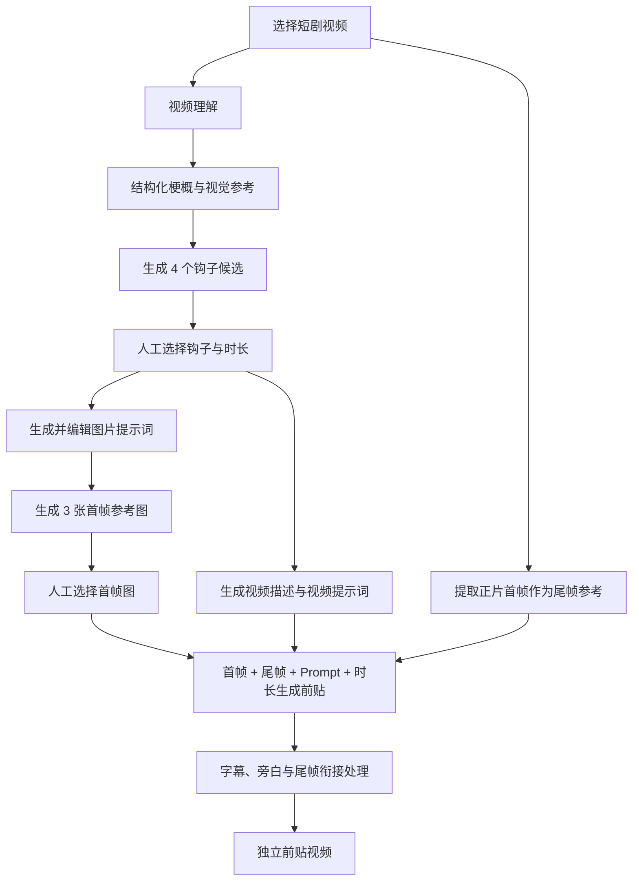

# 短剧前贴 V2：左侧竖向流程工作台前端技术方案

> 日期：2026-08-05
>
> 状态：需求已明确，待视觉稿确认后实施
>
> 产品位置：创意创作 → 视频创作 → 效果广告 → 前贴广告 → 短剧前贴
>
> 本文范围：只重构“短剧前贴”工作区；不修改效果广告导航、游戏前贴、电商前贴、爆款复刻、AI 效果广告生成、品牌广告和素材剪辑。
>
> 当前交付边界：只生成独立前贴视频，不与正片拼接；MVP 不增加业务质检步骤。

## 1. 结论

短剧前贴 V2 采用“左侧竖向流程轨道 + 中央主工作区 + 右侧当前步骤检查器”的桌面工作台：

```text
┌─────────────────────────────────────────────────────────────────────────────┐
│ 前贴广告 / 短剧前贴（保留现有 L2/L3 导航）                                  │
├───────────────┬─────────────────────────────────────────┬───────────────────┤
│ 竖向流程轨道   │ 当前步骤主工作区                         │ 当前步骤检查器      │
│ 220–240px     │ minmax(0, 1fr)                          │ 280–304px         │
│               │                                         │                   │
│ 01 素材理解    │ 视频 / 梗概 / 钩子 / 图片 / Prompt / 结果 │ 配置、状态、主操作   │
│ 02 前贴方向    │                                         │                   │
│ 03 首帧参考    │                                         │                   │
│ 04 视频生成    │                                         │                   │
├───────────────┴─────────────────────────────────────────┴───────────────────┤
│ 当前异步任务状态、失败恢复和保存状态                                          │
└─────────────────────────────────────────────────────────────────────────────┘
```

核心决策：

1. 左侧步骤竖向排列可行，而且比顶部步骤条更适合长时间、多阶段、可返回修改的生成工作流。
2. 左侧流程是对象内部的局部流程导航，不新增全局或模块级导航，不改变现有信息架构。
3. 中央区域在任意时刻只展示一个步骤，保证视频或图片始终是首要视觉焦点。
4. 右侧区域只展示当前步骤的配置和唯一主操作，不保留旧页面的固定参数墙。
5. 科技感由真实生成状态、细线连接、媒体暗色画布、首尾帧关系、轻量状态动效产生，不使用装饰性粒子、玻璃拟态、紫色渐变和无意义发光。
6. 新工作区从当前 `PreRollWorkspace` 中独立出来，使用短剧专属组件、状态机和 CSS 前缀，避免影响游戏前贴与电商前贴。

该构图符合 Kanon 的工作台原则：任务/编辑页面可以使用左侧列表或版本树、中间主工作区和右侧检查器，但主区必须占 50% 以上，三栏不能等权竞争；产品视觉以矿物灰为主、钴蓝用于当前选择与主操作。[Kanon Design System](https://github.com/shikanon/cookies/blob/main/DESIGN.md)

## 2. 已冻结的业务流程



MVP 明确不包含：

- 前贴与正片拼接；
- 业务质检评分；
- 生成后人物变形、剧透、连续性自动检测；
- 批量多集生成；
- 多模型横向对比。

仍必须包含的不是“质检”，而是基础技术状态：文件不可读、分析失败、图片生成失败、视频生成超时、取消、重试和刷新恢复。Kanon 通用交互要求所有长任务页面覆盖排队、运行、等待用户、失败、取消、结果未知和不丢失输入的恢复方式。[Cross-cutting Requirements](https://github.com/shikanon/cookies/blob/main/docs/15-prd-cross-cutting-requirements.md)

## 3. 当前前端基线与问题

### 3.1 可以保留的部分

当前 [VideoCreationPage](../../src/components/SpecializedPages.tsx) 已经正确表达：

- 效果广告一级区域只有前贴广告、爆款复刻、AI 效果广告生成；
- 前贴广告内部再选择短剧前贴、游戏前贴、电商前贴；
- `selectedPreroll === 'short-drama'` 是短剧专属分支入口；
- 项目上下文、Provider 状态、生成任务轮询和资产持久化已有可复用基础。

### 3.2 必须替换的部分

当前 `PreRollWorkspace` 同时承担短剧和游戏逻辑，并通过 `isShortDrama` 分支控制：

- 本地 Brief；
- 人工填写标题、梗概和卖点；
- 固定钩子策略；
- 3 个文案/分镜候选；
- PromptPackage；
- 固定 6 秒视频生成。

这些状态与新版“视频理解 → 钩子 → 首帧图 → 首尾帧视频生成”没有稳定的一一映射。继续增加 `isShortDrama` 条件会使旧状态和新状态互相污染，因此不在原组件上渐进堆叠 UI。

### 3.3 共享样式风险

当前 `.preroll-workspace`、`.preroll-candidate-panel`、`.preroll-config` 同时服务旧前贴页面。直接重写这些选择器可能改变游戏前贴和其他工作区。

V2 必须使用独立根类：

```css
.short-drama-v2-workspace {}
.short-drama-v2-step-rail {}
.short-drama-v2-stage {}
.short-drama-v2-inspector {}
```

允许复用现有颜色、按钮和表单原语，但不覆盖共享布局选择器。

## 4. 信息架构与页面布局

### 4.1 左侧竖向流程轨道

左栏宽度建议为 `220px–240px`，默认 `224px`。它包含三部分：

1. 当前输入视频的紧凑缩略图与名称；
2. 四个竖向步骤；
3. 当前任务的自动保存与异步状态。

结构：

```text
短剧前贴任务
《消失的第七份证词》
02:34 · 9:16

  ● 01  素材理解
  │      梗概已确认
  │
  ◉ 02  前贴方向
  │      请选择一个钩子
  │
  ○ 03  首帧参考
  │      等待前贴方向
  │
  ○ 04  视频生成
         等待首帧选择

最后保存：11:42:08
```

步骤状态：

| 状态 | 视觉 | 行为 |
| --- | --- | --- |
| `locked` | 空心灰节点 | 不可点击，显示前置条件 |
| `available` | 深灰节点 | 可进入但尚未开始 |
| `active` | 钴蓝实心节点 + 左侧 2px 指示线 | 当前唯一 `aria-current="step"` |
| `processing` | 钴蓝节点 + 轻量环形动画 | 可留在当前页观察 |
| `completed` | 成功色勾选 + 矿物灰文字 | 可返回查看或修改 |
| `failed` | 危险色图标 + 失败摘要 | 点击返回失败步骤 |

竖向连接线只表达流程关系，不做装饰电路图。当前步骤可以使用 160–220ms 的线条填充和节点切换；系统开启减少动效后取消位移、缩放和循环动画。[MDN: prefers-reduced-motion](https://developer.mozilla.org/en-US/docs/Web/CSS/@media/prefers-reduced-motion)

无障碍实现使用普通步骤导航，而不是把它伪装成 `tablist` 或 `progressbar`：

```tsx
<nav aria-label="短剧前贴生成流程">
  <ol>
    <li aria-current={active ? 'step' : undefined}>...</li>
  </ol>
</nav>
```

一个流程中只允许一个元素使用 `aria-current="step"`。[MDN: aria-current](https://developer.mozilla.org/en-US/docs/Web/Accessibility/ARIA/Reference/Attributes/aria-current)
WAI-ARIA 对 `aria-current` 的定义同样把 `step` 用于多步骤流程中的当前项。[WAI-ARIA 1.2: aria-current](https://www.w3.org/TR/wai-aria/#aria-current)

### 4.2 左栏滚动策略

左栏随工作区保持可见，但不使用 `position: fixed`。建议：

```css
.short-drama-v2-step-rail {
  position: sticky;
  top: 72px;
  align-self: start;
  max-height: calc(100vh - 108px);
  overflow: auto;
}
```

`sticky` 相对最近的滚动祖先生效，必须明确设置 `top`，并检查祖先的 `overflow`，否则会出现“看起来没有 sticky”的问题。[MDN: position sticky](https://developer.mozilla.org/en-US/docs/Web/CSS/position)

如果现有工作区本身是独立滚动容器，则 `top` 应相对工作区工具栏而不是浏览器视口计算。1280px 视口下不得让左栏和右栏挤压中央视频低于 620px。

### 4.3 中央主工作区

中间列使用 `minmax(0, 1fr)`，允许 Prompt、图片和视频子元素正确收缩而不把整页撑出横向滚动；业务内容按约 620px 的可用宽度设计，正常 1440px 环境占短剧工作区宽度 50% 以上。它是每一步唯一的主视觉焦点：

- 步骤 1：输入视频和视频理解结果；
- 步骤 2：4 个钩子候选；
- 步骤 3：图片 Prompt、参考帧和 3 张首帧图；
- 步骤 4：首尾帧关系、视频 Prompt 和前贴视频结果。

中央媒体预览允许使用局部深色画布，外部工具和文字区域继续保持浅色。这与 Kanon 对视频工作区的约束一致。[Kanon Design System](https://github.com/shikanon/cookies/blob/main/DESIGN.md)

### 4.4 右侧当前步骤检查器

右栏建议宽度 `280px–304px`，默认 `288px`。右栏不保留全流程固定配置，只显示：

- 当前步骤摘要；
- 当前可编辑参数；
- 当前唯一主操作；
- 次级返回/重新生成操作；
- 当前异步任务状态。

右侧可 `sticky`，但与左侧不能各自形成不一致的页面滚动。优先让中央区和页面整体滚动，左右栏内部只在内容溢出时滚动。

## 5. 四个步骤的页面规格

### 5.1 步骤 01：素材理解

#### 空状态

中央区域：

- 项目素材选择器；
- 本地上传入口；
- 支持格式与建议画幅；
- 选择后出现真实视频播放器。

右侧：

- 素材名称、时长、分辨率、画幅、音轨；
- 主按钮“开始理解视频”。

#### 分析中

中央视频不消失；视频右侧或下方显示真实阶段：

```text
✓ 读取媒体信息
✓ 识别台词
● 理解人物与剧情
○ 提取视觉参考
○ 生成结构化梗概
```

没有真实百分比时不显示伪造百分比。科技感通过细线阶段推进和局部骨架变化表达。

#### 分析完成

中央上部：视频播放器 + 代表帧带。代表帧类型：人物、服装、场景、色调、正片首帧。

中央下部：

- 一句话梗概；
- 完整剧情梗概（可编辑）；
- 人物与关系；
- 核心冲突；
- 未解悬念；
- 正片开场状态。

右侧主按钮：“确认梗概并生成钩子”。

### 5.2 步骤 02：前贴方向

中央区域分为两个纵向章节，而不是四张等权卡片铺满整屏：

```text
猎奇吸睛
[候选 01] [候选 02]

剧情总结
[候选 03] [候选 04]
```

每个候选展示：

- 类型；
- 标题；
- 一句话钩子；
- 钩子机制；
- 推荐时长；
- 预计视觉方向。

MVP 不显示评分、CTR、差异假设和 PromptPackage。

右侧：

- 已选方向摘要；
- `5 / 6 / 10 / 12 / 15 秒`分段按钮；
- 主按钮“确认方向并生成提示词”；
- 次级操作“重新生成 4 个方向”。

时长必须在 Prompt 生成前确认。修改时长后使视频时间轴与视频 Prompt 失效，但不使视频理解结果失效。

### 5.3 步骤 03：首帧参考

中央区域自上而下：

1. 可编辑图片提示词；
2. 可折叠的结构化字段；
3. 正片提取的参考帧带；
4. 3 张首帧候选图。

图片 Prompt 默认展示自然语言版本；主体、行动、情绪、环境、构图、光线、风格、连续性参考和禁止项放入折叠详情。

3 张图保持相同角色与钩子，只在景别、构图、动作、表情或光线形成有意义差异。选中图使用钴蓝 2px 边框、右上角勾选和文字“已选择”，不能只靠颜色。

右侧：

- 当前钩子；
- 时长；
- 画幅；
- 引用参考帧数量；
- 主按钮随状态变化为“生成 3 张首帧图”或“确认首帧并继续”；
- 次级操作“重新生成 3 张”。

### 5.4 步骤 04：视频生成

未生成状态的第一视觉锚点是首尾帧关系：

```text
生成首帧                       正片首帧
[用户选择的 AI 图]  ───────▶  [从输入视频提取]
负责吸引注意                   作为尾帧参考
```

箭头不是装饰，而是说明模型输入关系。允许使用一次从左到右的短线推进动效，不允许持续流动粒子。

下方提供：

- “视频描述”页签：面向业务用户的简明方案；
- “视频提示词”页签：可编辑模型 Prompt；
- 时间轴分镜；
- 旁白、声音与衔接要求。

右侧：

- 钩子、时长、画幅；
- 首帧资产、尾帧来源；
- 主按钮“生成前贴视频”；
- 次级操作“返回更换首帧”“重新生成视频提示词”。

修改时长时弹出非阻塞确认，明确“将重新生成时间轴与视频 Prompt，保留已选首帧图”。

#### 生成中

中央保留首尾帧关系，覆盖紧凑任务状态：

```text
✓ 已提交生成参数
● 视频模型生成中
○ 正在处理尾帧衔接
○ 正在保存前贴素材
```

#### 生成完成

中央切换为真实前贴视频播放器，显示时长、画幅、钩子、版本。右侧主按钮改为“保存到项目素材”，次级操作包括下载、按当前配置重新生成、修改 Prompt、返回更换首帧。

不出现“拼接正片”“加入混剪”“生成完整成片”。

## 6. 科技感视觉方案

### 6.1 视觉原则

科技感不等于深色全屏、紫色渐变或发光卡片。方案沿用 Cookies/Kanon 的“智能蓝图”：

- 产品壳层：矿物灰与浅色内容面；
- 当前步骤、主操作、选中项：钴蓝；
- 媒体预览：局部深海军蓝/黑色画布；
- 流程关系：1px 细线、节点、方向与版本文字；
- AI 运行：真实阶段和轻量状态变化；
- 生成产物：真实视频帧、人物参考帧和图片候选成为主要视觉内容。

Kanon 明确要求蓝色表达结构而不是装饰，并禁止装饰性玻璃模糊、彩色发光和多层重阴影。[Kanon Design System](https://github.com/shikanon/cookies/blob/main/DESIGN.md)

### 6.2 推荐视觉令牌

直接复用当前 `src/styles.css` 已有：

- `--canvas`
- `--surface`
- `--subtle`
- `--line`
- `--line-strong`
- `--text`
- `--muted`
- `--cobalt`
- `--cobalt-dark`
- `--cobalt-soft`
- `--success`
- `--danger`
- `--ease`

短剧 V2 只增加业务语义令牌，不增加第二套品牌色：

```css
--short-drama-media-bg: oklch(.18 .025 255);
--short-drama-flow-line: color-mix(in oklch, var(--cobalt) 42%, var(--line));
--short-drama-active-halo: oklch(.58 .23 255 / .12);
```

### 6.3 动效清单

允许：

- 步骤切换 160–220ms 淡入与 4px 位移；
- 当前步骤节点一次性描边填充；
- 分析/生成阶段的低频旋转环；
- 图片生成完成后的轻量逐张出现；
- 首尾帧关系线一次性推进；
- 按钮、边框和背景的短过渡。

禁止：

- 持续粒子；
- 大面积呼吸光；
- 卡片悬浮漂移；
- 自动播放背景动画；
- 影响文字阅读的扫描线；
- 所有区域同时动。

减少动效模式：

```css
@media (prefers-reduced-motion: reduce) {
  .short-drama-v2-workspace *,
  .short-drama-v2-workspace *::before,
  .short-drama-v2-workspace *::after {
    scroll-behavior: auto;
    animation-duration: 0.01ms !important;
    animation-iteration-count: 1 !important;
    transition-duration: 0.01ms !important;
  }
}
```

## 7. 前端状态模型

### 7.1 为什么使用 reducer

新版存在“返回上一步修改后，哪些下游数据保留、哪些失效”的明确规则。把它拆成大量 `useState` 和事件处理器容易产生非法组合，例如图片已经选中但钩子已被修改。

React 官方建议复杂屏幕将分散的状态更新集中到 reducer，并可用 Context 将状态与 dispatch 提供给深层子组件。[React: Extracting State Logic into a Reducer](https://react.dev/learn/extracting-state-logic-into-a-reducer)、[React: Reducer and Context](https://react.dev/learn/scaling-up-with-reducer-and-context)

建议：

```ts
type ShortDramaStep =
  | 'source-understanding'
  | 'hook-direction'
  | 'first-frame'
  | 'video-generation'

type ShortDramaPrerollState = {
  activeStep: ShortDramaStep
  sourceAsset: SourceVideoAsset | null
  analysis: VideoUnderstandingResult | null
  hooks: HookCandidate[]
  selectedHookId: string | null
  durationSeconds: 5 | 6 | 10 | 12 | 15
  imagePrompt: ImagePromptPackage | null
  imageCandidates: ImageCandidate[]
  selectedImageId: string | null
  videoPrompt: VideoPromptPackage | null
  sourceOpeningFrame: AssetRef | null
  generationAttempt: GenerationAttempt | null
  outputAsset: AssetRef | null
  dirty: DirtyFlags
}
```

异步资源不使用多个可能互相冲突的布尔值，而使用判别联合：

```ts
type AsyncResource<T> =
  | { status: 'idle' }
  | { status: 'queued'; jobId: string }
  | { status: 'running'; jobId: string; stage?: string }
  | { status: 'ready'; data: T }
  | { status: 'failed'; problem: ApiProblem; retryable: boolean }
  | { status: 'cancelled'; jobId: string }
  | { status: 'unknown'; jobId: string }
```

已选钩子和首帧只保存 ID，具体对象从候选数组派生，避免同一对象在多个 state 中复制后失步。[React: Choosing the State Structure](https://react.dev/learn/choosing-the-state-structure)

动作使用“发生了什么”的命名：

```ts
type ShortDramaPrerollAction =
  | { type: 'source_selected'; asset: SourceVideoAsset }
  | { type: 'analysis_started'; jobId: string }
  | { type: 'analysis_succeeded'; result: VideoUnderstandingResult }
  | { type: 'summary_edited'; synopsis: string }
  | { type: 'hooks_generated'; hooks: HookCandidate[] }
  | { type: 'hook_selected'; hookId: string }
  | { type: 'duration_changed'; duration: 5 | 6 | 10 | 12 | 15 }
  | { type: 'image_prompt_edited'; prompt: string }
  | { type: 'images_generated'; images: ImageCandidate[] }
  | { type: 'image_selected'; imageId: string }
  | { type: 'video_prompt_edited'; prompt: string }
  | { type: 'video_generation_started'; attempt: GenerationAttempt }
  | { type: 'video_generation_succeeded'; asset: AssetRef }
  | { type: 'job_failed'; stage: ShortDramaStep; problem: ApiProblem }
```

### 7.2 下游失效规则

| 用户修改 | 保留 | 失效 |
| --- | --- | --- |
| 更换输入视频 | 无 | 分析、钩子、Prompt、图片、视频 |
| 修改已确认梗概 | 原视频分析与参考帧 | 钩子、Prompt、图片、视频 |
| 更换钩子 | 分析结果 | 图片 Prompt、图片候选、视频 Prompt、视频 |
| 修改时长 | 分析、钩子、图片 Prompt、图片候选、已选图片 | 视频描述、时间轴、视频 Prompt、视频 |
| 修改图片 Prompt | 分析、钩子、时长 | 图片候选、已选图片、视频 |
| 更换已选图片 | 分析、钩子、时长、Prompt | 已生成视频 |
| 修改视频 Prompt | 分析、钩子、时长、图片 | 已生成视频 |

Reducer 必须执行这些规则，页面组件不能各自手工清空字段。

### 7.3 步骤可达性

```ts
canEnter('source-understanding') = sourceAsset !== null
canEnter('hook-direction') = analysis !== null
canEnter('first-frame') = selectedHookId !== null && durationSeconds !== null
canEnter('video-generation') = selectedImageId !== null && videoPrompt !== null
```

已完成步骤允许返回。锁定步骤点击后只说明缺失条件，不静默跳转。

## 8. 组件与文件边界

推荐目录：

```text
src/features/short-drama-preroll-v2/
├── ShortDramaPrerollWorkspace.tsx
├── ShortDramaPrerollProvider.tsx
├── reducer.ts
├── types.ts
├── selectors.ts
├── api.ts
├── fixtures.ts
├── ShortDramaStepRail.tsx
├── ShortDramaInspector.tsx
├── stages/
│   ├── SourceUnderstandingStage.tsx
│   ├── HookDirectionStage.tsx
│   ├── FirstFrameStage.tsx
│   └── VideoGenerationStage.tsx
├── components/
│   ├── SourceVideoCard.tsx
│   ├── AnalysisProgress.tsx
│   ├── ReferenceFrameStrip.tsx
│   ├── HookCandidateOption.tsx
│   ├── PromptEditor.tsx
│   ├── FirstFrameGallery.tsx
│   ├── StartEndFrameBridge.tsx
│   └── AsyncGenerationStatus.tsx
└── short-drama-preroll-v2.css
```

职责：

- `Workspace`：组合布局，不保存散落业务状态；
- `Provider/reducer`：状态机、下游失效规则、步骤跳转；
- `api.ts`：隔离真实 API 与 fixture；
- `stages`：每个步骤只读取自身需要的 selector；
- `ShortDramaInspector`：根据当前步骤渲染对应配置；
- `components`：短剧 V2 内可复用的展示组件；
- CSS：只在 `.short-drama-v2-workspace` 下生效。

短剧分支入口改为：

```tsx
{selectedPreroll === 'pre-roll'
  ? <CommerceHookWorkspace ... />
  : selectedPreroll === 'game'
    ? <GamePrerollWorkspace ... />
    : <ShortDramaPrerollWorkspace ... />}
```

旧 `PreRollWorkspace` 在短剧 V2 稳定前可以保留给历史任务读取；不要第一步就删除旧数据映射。

## 9. 先搭前端的 Fixture 方案

在后端 V2 契约冻结前，前端使用与真实接口同形的 fixture adapter，不在组件中硬编码演示文本。

```ts
export interface ShortDramaPrerollGateway {
  analyzeSource(input: AnalyzeSourceInput): Promise<VideoUnderstandingResult>
  generateHooks(input: GenerateHooksInput): Promise<HookCandidate[]>
  generateImagePrompt(input: GeneratePromptInput): Promise<ImagePromptPackage>
  generateVideoPrompt(input: GeneratePromptInput): Promise<VideoPromptPackage>
  generateFirstFrames(input: GenerateFirstFramesInput): Promise<ImageCandidate[]>
  generateVideo(input: GeneratePrerollVideoInput): Promise<GenerationAttempt>
  getGenerationAttempt(id: string): Promise<GenerationAttempt>
}
```

提供：

- `fixtureShortDramaPrerollGateway`：前端搭建和视觉验收；
- `httpShortDramaPrerollGateway`：后续真实后端；
- 组件只依赖接口，不判断当前是 fixture 还是真实 API。

Fixture 至少覆盖：

- 正常分析；
- 4 个钩子；
- 3 张首帧图；
- 视频生成中与成功；
- 某一步失败并可重试；
- 页面恢复到步骤 2、3、4。

生产环境不能把 fixture 状态伪装成真实模型结果；开发 Fixture 通过明确的环境开关启用。

## 10. 保存、刷新恢复与异步任务

第一版前端搭建也需要按可恢复状态设计，不能把步骤只存在组件内存中。

建议恢复优先级：

1. 服务端工作区快照；
2. 当前 Provider/生成任务状态；
3. 本地未保存 Prompt 草稿；
4. fixture 初始状态（仅开发环境）。

显示：

- 保存中；
- 已保存时间；
- 本地有未同步修改；
- 保存失败可重试。

异步任务必须绑定 `task_id + draft_revision + stage + attempt_id`，不能从“项目最新视频任务”猜当前任务。

## 11. API 契约建议（供前端占位）

本文不要求本轮实现后端，但前端类型不应继续复用旧 `short_drama_preroll_v1` 候选结构。

建议工作区读取：

```http
GET /projects/{projectId}/creative-workspaces/short-drama-preroll-v2
```

建议动作：

```http
POST /projects/{projectId}/short-drama-preroll-v2:analyze-source
POST /projects/{projectId}/short-drama-preroll-v2:generate-hooks
POST /projects/{projectId}/short-drama-preroll-v2:select-hook
POST /projects/{projectId}/short-drama-preroll-v2:generate-image-prompt
POST /projects/{projectId}/short-drama-preroll-v2:generate-first-frames
POST /projects/{projectId}/short-drama-preroll-v2:select-first-frame
POST /projects/{projectId}/short-drama-preroll-v2:generate-video-prompt
POST /projects/{projectId}/short-drama-preroll-v2:generate-video
GET  /projects/{projectId}/short-drama-preroll-v2/jobs/{jobId}
```

写操作使用 `Idempotency-Key`，草稿更新带 `expected_revision`。AI 输出保存模型、Prompt 版本、输入资产版本和人工修改记录，符合仓库现有 Creative 版本化原则。

## 12. 适配宽度

Kanon 当前只要求桌面 Web，以 1440px 为基准、1280px 为最低验收，不设计手机和平板重排。[Kanon Design System](https://github.com/shikanon/cookies/blob/main/DESIGN.md)

推荐：

```css
.short-drama-v2-workspace {
  display: grid;
  grid-template-columns: 224px minmax(0, 1fr) 288px;
  min-width: 0;
}

@media (min-width: 1680px) {
  .short-drama-v2-workspace {
    grid-template-columns: 240px minmax(0, 1fr) 304px;
  }
}

@media (max-width: 1360px) {
  .short-drama-v2-workspace {
    grid-template-columns: 200px minmax(0, 1fr) 248px;
  }
}
```

若实际内容区在 1280px 浏览器下仍不足，优先将右侧检查器切换成可收起抽屉，不能把中央视频压缩成不可用尺寸，也不把左侧步骤变成顶部流程。Kanon 当前不要求手机和平板适配，因此本文不设计小于 1280px 时的移动重排。

## 13. 实施顺序

### Phase FE-0：隔离入口

- 新建短剧 V2 feature 目录；
- `selectedPreroll === 'short-drama'` 指向新组件；
- 游戏和电商分支不变；
- 新 CSS 全部使用 `.short-drama-v2-*`。

### Phase FE-1：布局与状态机

- 左侧竖向流程；
- 中央阶段容器；
- 右侧检查器；
- reducer、selector 和下游失效测试；
- fixture gateway。

### Phase FE-2：素材理解与钩子

- 视频选择与真实播放器；
- 分析状态；
- 梗概编辑；
- 2+2 钩子候选；
- 时长选择。

### Phase FE-3：首帧生成

- 图片 Prompt；
- 正片参考帧带；
- 3 张图片候选；
- 选择、重新生成和返回修改。

### Phase FE-4：视频生成

- 视频描述和视频 Prompt；
- 首尾帧关系；
- 异步任务状态；
- 结果播放器；
- 保存到项目素材和下载。

### Phase FE-5：视觉与可访问性验收

- 1280、1440、1680 三档；
- 90%–125% 浏览器缩放；
- 键盘完整操作；
- `aria-current="step"`；
- 减少动效；
- 长标题、长 Prompt、失败信息不破坏布局；
- 游戏前贴、电商前贴和其他视频页面视觉回归。

## 14. 前端测试清单

### Reducer 单元测试

- 修改梗概使下游全部失效；
- 修改时长保留已选图片但使视频 Prompt 和视频失效；
- 更换图片只使视频失效；
- 锁定步骤不可进入；
- 已完成步骤可以返回；
- 失败重试不丢失已确认输入。

### 组件测试

- 竖向流程只有一个 `aria-current="step"`；
- 钩子固定按 2 个猎奇、2 个总结分组；
- 未选钩子不能进入首帧步骤；
- 未选首帧不能生成视频；
- 修改 Prompt 显示未保存状态；
- 生成任务刷新后恢复。

### 浏览器验收

- 选择视频 → 分析 → 确认梗概；
- 选择钩子与时长；
- 编辑图片 Prompt → 生成 3 图 → 选图；
- 编辑视频 Prompt → 生成视频 → 播放；
- 返回步骤 2 更换钩子后，下游旧结果不再被当作有效结果；
- 游戏前贴、电商前贴、爆款复刻、AI 效果广告生成未发生布局或交互变化。

仓库交付门禁：

```text
git diff --check
npm run test
npm run build
```

实现后还需使用浏览器完成 1280、1440、1680 可视化验收。

## 15. 验收标准

1. 产品层级仍为“效果广告 → 前贴广告 → 短剧前贴”。
2. 只有短剧前贴页面发生变化。
3. 左侧四步竖向排列，当前步骤始终清楚。
4. 任意时刻中央只有一个主要任务和一个主要视觉焦点。
5. 中央主区在 1440px 环境占工作区 50% 以上。
6. 用户可以完整跑通：视频 → 梗概 → 钩子 → 时长 → 图片 Prompt → 3 图 → 选图 → 视频 Prompt → 前贴视频。
7. 最终只输出独立前贴视频，不出现拼接入口。
8. 科技感来自流程、生成状态和媒体，不依赖玻璃、粒子、紫色渐变或装饰发光。
9. 修改上游信息后，下游旧数据按规则失效。
10. 页面刷新可恢复当前步骤、已选项、Prompt、任务和视频结果。
11. 步骤语义、焦点、键盘和减少动效可用。
12. 游戏前贴、电商前贴及其他页面无视觉回归。

## 16. 当前不需要用户额外提供的内容

前端骨架阶段可以使用现有项目视频和脱敏 fixture 搭建，不需要等待真实模型接口。

后续接真实能力前需要外部明确：

1. 视频理解服务的请求与结构化响应；
2. 图片模型是否支持多张人物/场景参考图及其数量限制；
3. 视频模型是否原生支持首帧 + 尾帧，参数名称及分辨率限制；
4. 5、6、10、12、15 秒是否均被当前 Provider 支持；
5. 图片、视频任务的轮询状态和临时 URL 有效期；
6. 生成成功后写入项目素材所需的 AssetVersion 契约。

这些缺口不阻塞第一阶段前端布局、状态机和 fixture 交互。

## 17. 一手来源

- [Kanon / cookies Design System](https://github.com/shikanon/cookies/blob/main/DESIGN.md)
- [Kanon / Creative Studio PRD](https://github.com/shikanon/cookies/blob/main/docs/02-creative-studio-prd.md)
- [Kanon / PRD 通用交互与质量要求](https://github.com/shikanon/cookies/blob/main/docs/15-prd-cross-cutting-requirements.md)
- [Kanon / 视频素材剪辑与开源框架方案](https://github.com/shikanon/cookies/blob/main/docs/21-video-material-editor-spec.md)
- [React：Extracting State Logic into a Reducer](https://react.dev/learn/extracting-state-logic-into-a-reducer)
- [React：Scaling Up with Reducer and Context](https://react.dev/learn/scaling-up-with-reducer-and-context)
- [React：Choosing the State Structure](https://react.dev/learn/choosing-the-state-structure)
- [React：Preserving and Resetting State](https://react.dev/learn/preserving-and-resetting-state)
- [WAI-ARIA 1.2：aria-current](https://www.w3.org/TR/wai-aria/#aria-current)
- [CSS Grid Layout Module Level 2](https://www.w3.org/TR/css-grid-2/)
- [CSS Positioned Layout Module Level 3：Sticky positioning](https://www.w3.org/TR/css-position-3/#sticky-pos)
- [Media Queries Level 5：prefers-reduced-motion](https://www.w3.org/TR/mediaqueries-5/#prefers-reduced-motion)
- [MDN：CSS position / sticky](https://developer.mozilla.org/en-US/docs/Web/CSS/position)
- [MDN：prefers-reduced-motion](https://developer.mozilla.org/en-US/docs/Web/CSS/@media/prefers-reduced-motion)
- [MDN：aria-current](https://developer.mozilla.org/en-US/docs/Web/Accessibility/ARIA/Reference/Attributes/aria-current)
