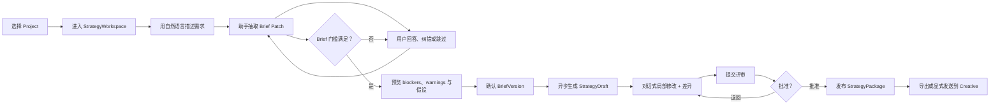

# Strategy 首期用户体验与技术调研

> 日期：2026-07-23
> 产品基线：`cookies-Strategy-Creative并行开发对齐文档-v1.1`（已冻结）
> 仓库基线：当前 `main` 工作区
> 调研目标：明确 Strategy 首期对用户到底是什么体验，并验证其关键技术路线

## 1. 结论摘要

Strategy 首期不应被做成“输入一句话，AI 输出一篇方案”的聊天页面。用户真正需要的是一个广告策略顾问式工作区：

1. 用户用非专业语言描述目标，不必先填长表单。
2. 助手边聊边把内容沉淀为结构化 Brief，并明确区分已确认事实、用户输入、资料提取、AI 假设和建议。
3. 用户始终能在右侧 Brief 面板纠错、确认或暂时跳过；助手每轮只问 1—3 个高影响问题。
4. Brief 达到门槛后，用户确认一个不可变版本。
5. 系统基于该版本异步生成结构化策略，用户可通过对话局部修改并查看差异。
6. 策略经过评审和批准后形成不可变 StrategyPackage；用户可以导出或显式发送到 Creative。
7. 刷新、离开、模型失败或 Skill 部分失败不会丢失已经确认的事实和可用产物。

首期的核心产品价值不是“AI 写得多”，而是：

- 降低广告需求表达门槛。
- 减少反复访谈和信息遗漏。
- 把模糊对话变成可确认、可追溯、可交付的业务事实。
- 让 AI 建议在进入创意生产前经过人工校正和批准。

首期应只完成一条纵向主链路，默认支持小红书图文策略。研究中心、Skill 运营后台、多方案对比、外部自动研究、公众号和视频渠道可以在主链路稳定后追加。

## 2. 首期范围

### 2.1 首期必须完成

```text
Project
  → StrategyWorkspace
  → Conversation
  → BriefDraft
  → BriefVersion
  → StrategyDraft
  → StrategyReview
  → StrategyPackage
```

用户能力：

- 选择 Project 并创建或进入主 StrategyWorkspace。
- 从空白对话或 Project 上下文开始描述需求。
- 查看助手更新的 Brief 字段、来源、置信和确认状态。
- 回答、跳过或让助手提出建议。
- 处理字段冲突和合规阻断项。
- 确认不可变 BriefVersion。
- 生成、编辑、提交、退回和批准 StrategyDraft。
- 查看 StrategyPackage 版本、来源与 readiness。
- 导出策略，或显式发送指定版本到 Creative。
- 在刷新、跨时段和部分失败后恢复。

平台能力：

- 小红书图文渠道策略。
- 通用品牌、目标、受众、价值主张、渠道、约束、实验和衡量方案。
- Creative/Delivery/Insights 分别计算 readiness。

### 2.2 首期不做

- Strategy 内生成图片、视频或 CreativeTask。
- 批准策略后自动创建 Creative 任务。
- 自动执行真实广告投放。
- 复杂外部行业/竞品研究自动化。
- 多策略方案并排比较。
- 面向业务管理员的 Skill 发布和灰度 UI。
- 公众号、抖音、快手的完整渠道实现。
- 在根目录 `src/`、`server/` 延续路演 MVP 的生产状态。

### 2.3 首期建议延期项

旧版 Strategy PRD 把“资料导入”列为 P0，但冻结后的并行路线把导入与公众号完善放到后续阶段。为控制主链路风险，首期只读取 Project 已授权的品牌、产品和 Asset 引用；新上传 Word/PDF/Markdown 并自动定位字段建议放到 Sprint 3。

## 3. 用户与核心任务

### 3.1 首要用户

| 用户 | 当前困难 | 首期希望得到的结果 |
| --- | --- | --- |
| 中小企业经营者 | 不懂广告术语，不知道应该提供什么 | 用业务语言说明目标，系统帮助补齐可执行 Brief |
| 市场负责人 | 需求散落在聊天、文档和脑海里 | 快速形成可评审的需求和渠道策略 |
| 策略人员 | 重复访谈、整理、改稿和找依据 | AI 完成结构化沉淀，自己聚焦判断与校正 |
| 项目负责人/审批人 | 不知道策略基于哪些事实、改了什么 | 查看来源、差异、风险和审批绑定版本 |
| 创意人员 | 上游策略模糊或持续变化 | 收到明确版本、约束、主张和来源快照 |

### 3.2 用户的核心 Job

> “我把业务目标和已有信息告诉系统，它帮我发现关键缺口、形成一份我能理解和确认的 Brief，再给出有依据、能交给创意团队执行的策略。”

### 3.3 首期成功时用户的感受

- 不需要学习一套复杂广告表单。
- 系统知道已经确认过什么，不重复追问。
- AI 不会偷偷把猜测当事实。
- 我可以随时改正，不需要推倒重来。
- 长任务虽然需要等待，但我知道正在做什么，回来后结果还在。
- 批准前能看到依据、风险和具体变化。
- 交给 Creative 的是固定版本，不会被上游后续修改污染。

## 4. 首期完整用户旅程



### 4.1 进入 Strategy

首期首页不需要先做复杂仪表盘。用户进入 `/strategy` 后应看到：

- 当前 Project 名称和品牌/产品上下文。
- 一个主要动作：“开始整理广告需求”。
- 如果已有工作区，优先显示“继续上次对话”及其当前阻塞。
- 最近的 Brief/策略版本和待确认、待评审事项。

首次空状态文案应直接说明能力和边界：

> 告诉我你想推广什么、希望获得什么结果。
> 我会边聊边整理 Brief，并在你确认前把推断和事实分开。

建议提供 3 个可编辑起始提示，而不是功能菜单：

- “下个月要推一个新品，想先做小红书。”
- “我不确定怎么做广告，只想获得更多客户。”
- “基于当前项目的品牌和产品资料，帮我整理一份推广需求。”

### 4.2 第一轮对话

用户可以只说一句模糊需求：

> “我们下个月推一款工业测量设备，想做小红书获客。”

系统行为：

1. 立即持久化用户消息。
2. 返回任务已接收，不让浏览器等待完整模型结果。
3. 展示 `brief-intake` 运行卡。
4. 将明确内容更新到 BriefDraft：
   - 产品：工业测量设备，未确认。
   - 时间：下个月，需补具体范围。
   - 渠道：小红书，未确认。
   - 目标：获客，需明确转化事件。
5. 助手只追问最关键的 1—3 项。

示例回复：

> 我先按“小红书获客”整理。当前最影响策略的还有三点：
>
> 1. 最希望获得哪类客户或线索？
> 2. 产品最值得证明的优势是什么？
> 3. 这次希望用户完成预约演示、留下电话，还是直接购买？
>
> 不确定的内容可以先选择“由助手建议”，我会保留为假设。

### 4.3 对话与 Brief 同步推进

页面建议采用“主对话 + 辅助 Brief”双区布局：

```text
┌──────────────────────────────────────────────────────────────┐
│ Project / 工作区 / 当前阶段 / 保存与任务状态                 │
├───────────────────────────────────┬──────────────────────────┤
│                                   │ Brief                    │
│ 对话主工作区（至少 55%）          │ 完整度、阻断项、字段组   │
│                                   │ 来源、确认、冲突         │
│ 消息、问题、Skill 运行卡          │                          │
│ 产物卡、明确下一步                │ 可收起                   │
│                                   │                          │
├───────────────────────────────────┴──────────────────────────┤
│ 输入框 / 附件引用 / 暂停 / 发送                              │
└──────────────────────────────────────────────────────────────┘
```

Brief 字段应使用五种明确状态：

| 状态 | 表现 | 用户动作 |
| --- | --- | --- |
| 已确认事实 | 稳定显示确认标识 | 可修改，修改后重新确认 |
| 用户输入、未确认 | 显示“待确认” | 确认或纠正 |
| 资料提取 | 显示来源与定位 | 采纳、纠正或拒绝 |
| AI 假设/建议 | 明确标识 AI | 采纳、修改、跳过 |
| 冲突 | 同时显示多个值与来源 | 选择一个或输入新值 |

用户在右侧直接修改字段后，对话区应出现简短结果：

> 你把核心受众改为“制造企业研发负责人”。我会以该确认值为准，原先从资料提取的“采购负责人”保留在来源记录中，不再作为当前值。

### 4.4 Brief 完整度与确认

完整度不能只显示百分比。用户应看到：

- 已满足：品牌/产品、业务目标、核心受众、产品主张、渠道组合、衡量目标。
- 阻断项：必须在确认前解决。
- 警告：允许继续，但会降低后续结果质量。
- 假设：用户明确接受后才能随版本固化。

确认动作前提供一个单独的确认视图：

```text
Brief v3 候选
✓ 6 个必需字段组已满足
! 2 个警告：预算未知、排期只有月份
? 1 个假设：检测报告可用于对外传播

[返回补充]                         [确认 Brief]
```

确认成功后：

- 创建不可变 BriefVersion。
- 显示确认人、时间、版本和内容哈希。
- 当前 Draft 不再原地修改。
- 主要动作切换为“生成策略”。

### 4.5 策略生成

策略生成是长任务，用户体验应是异步的：

- 点击后立即显示 queued/running。
- 展示业务步骤而不是模型内部推理：
  - 正在检查 Brief 和品牌约束。
  - 正在形成受众和信息架构。
  - 正在应用小红书图文渠道方法。
  - 正在检查合规和缺口。
- 用户可以离开页面；完成后回到原工作区查看。
- 部分步骤失败时保留已有章节，并允许只重试失败步骤。

生成结果采用文档式策略工作区，首期固定包含：

1. 执行摘要。
2. 受众策略。
3. 价值与信息架构。
4. 渠道策略。
5. 创意建议。
6. 预算与节奏建议。
7. 实验矩阵。
8. 衡量方案。
9. 假设与缺口。
10. 依据与血缘。

预算与排期未知时，不应伪造具体数字；对应章节显示建议区间、采用的假设和对 Delivery readiness 的影响。

### 4.6 对话式修改

用户不需要重新生成整份策略，可以说：

> “把小红书方向改得更专业，减少口号，突出检测过程。”

系统先展示影响范围：

- 将修改：渠道策略、创意建议、信息表达示例。
- 不修改：业务目标、核心受众、批准前的 BriefVersion。

然后生成新 revision，并提供逐章节差异：

- 新增内容。
- 删除内容。
- 依据变化。
- readiness 或合规变化。

用户可以采纳、继续修改或撤销该 revision；已批准版本永不被回写。

### 4.7 评审与批准

首期即使是单人使用，也保留“确认/批准”语义；多人团队则按权限展示：

- 评论。
- 退回并说明原因。
- 批准指定 revision。
- 查看候选内容哈希、BriefVersion、阻断项和来源。

批准操作失败时，错误必须说明：

- 发生了什么：例如候选版本已被修改。
- 保留了什么：评论和当前草稿仍在。
- 用户能做什么：刷新差异并重新提交。
- 诊断 ID。

批准成功后产生不可变 StrategyPackage，并显示：

```text
StrategyPackage v1 · 已发布
Creative：Ready（1 个警告）
Delivery：Not Ready（预算和具体排期缺失）
Insights：Ready
```

### 4.8 交接

批准完成后的主要动作是“发送到 Creative”，但必须由用户显式触发。

确认弹层只展示：

- 将发送的 package ID/version/hash。
- Creative readiness 及警告。
- 目标 Project。
- “后续 Strategy 新版本不会自动覆盖已创建的 Creative 任务”。

事件 `strategy.approved.v1` 只产生新版本提示或资源索引，不替用户创建任何任务。

## 5. 首期页面与信息架构

首期不要一次实现 PRD 中全部一级导航。建议只开放：

| 页面 | 首期形态 |
| --- | --- |
| Strategy 入口 | 继续当前工作区、最近产物、待处理事项 |
| 工作区列表 | 全部、进行中、等待用户、待评审、已完成 |
| 工作区详情 | 对话、Brief、策略、评审/版本；研究和实验先作为策略内章节 |
| Brief 版本 | 从工作区进入，不先建设独立“需求中心”大全 |
| Strategy 版本 | 从工作区进入，不先建设复杂“策略中心” |
| Skill 运行 | 对话中的运行卡和诊断抽屉 |

暂不开放：

- 空壳研究中心。
- 空壳实验中心。
- 能力运营。
- 系统设置。
- 没有真实数据的质量/用量大盘。

等核心对象和状态稳定后，再把集合页提升为独立中心。

## 6. 用户可见状态

| 场景 | 用户看到什么 | 可执行动作 |
| --- | --- | --- |
| 首次为空 | 能力说明和起始示例 | 开始描述需求 |
| 消息已提交 | 消息已保存、任务排队 | 继续补充或离开 |
| Skill 运行中 | 目的、读取范围、当前阶段 | 暂停或查看已有结果 |
| 等待用户 | 1—3 个问题和建议值 | 回答、跳过、稍后 |
| 部分成功 | 已完成字段/章节与失败步骤 | 只重试失败步骤 |
| 模型输出无效 | 已保存原输入，结构化更新未应用 | 重试或手工编辑 |
| Brief 有冲突 | 多个候选值和来源 | 选择或输入新值 |
| Brief 有 blocker | 阻断原因和解决动作 | 补充、修改或取消 |
| 版本冲突 | 服务端新旧差异 | 刷新、合并或另存 revision |
| 策略生成中 | 后台任务和阶段 | 离开、取消 |
| 无权限 | 缺少的动作权限 | 返回或请求协作 |
| 上游暂不可用 | 已缓存事实仍可读 | 手工继续或稍后重试 |
| 批准成功 | package 版本与 readiness | 导出、发送到 Creative |

## 7. 外部产品调研

### 7.1 Google Ads 对话式广告创建

Google Ads 的对话式体验采用“输入落地页 → AI 生成可编辑商家描述 → 建议广告结构和素材 → 用户修改并批准”的组合，而不是纯聊天黑盒。Google 也明确提示 AI 结果可能不准确，广告上线前仍由用户负责确认。

对 cookies 的启示：

- 首轮应尽量从 ProjectContext、品牌和产品资料预填，而不是让用户重复输入。
- AI 建议必须直接可编辑。
- 对话旁边必须有结构化产物和确认动作。
- 发布前必须保持人工控制。

来源：[Google Ads 对话式体验](https://support.google.com/google-ads/answer/14145186)

### 7.2 Meta Advantage+

Meta Advantage+ 强调减少创建广告所需的输入和手工步骤，同时仍保留手工设置与控制。其自动化围绕明确的 campaign objective 展开。

对 cookies 的启示：

- 首期先问业务目标和转化目标，避免从渠道细节开始。
- 自动化目标应是减少低价值输入，而不是隐藏业务决策。
- 高级字段使用渐进披露；默认值必须可查看和覆盖。

来源：[Meta Advantage+](https://www.facebook.com/business/ads/meta-advantage-plus)、[Advantage+ leads](https://www.facebook.com/business/ads/meta-advantage-plus/leads)

### 7.3 TikTok Symphony Agent

TikTok Symphony Agent 将平台高表现广告、趋势、用户业务目标和品牌规范组合起来生成平台原生创意。

对 cookies 的启示：

- 平台方法不能只写进一个通用 Prompt。
- Strategy 应采用通用 Skill + 渠道 Playbook。
- 平台趋势和案例属于版本化 Knowledge/数据输入，不能当永久规则。
- 平台输出最终仍归一化到统一 StrategyPackage。

来源：[TikTok Symphony Agent](https://ads.tiktok.com/business/en-US/blog/symphony-agent)

## 8. 人机交互调研

Microsoft 的 Human-AI Interaction Guidelines 强调：AI 出错不可避免，产品应支持高效调用、忽略、纠正，并在不确定时缩小服务范围或请求澄清。Google PAIR 强调解释数据来源、让用户校准信任，以及在高风险场景保留用户控制。

对应到 Strategy：

- 每个 AI 字段都可纠正、拒绝或暂时忽略。
- 不确定时追问，不静默补全业务承诺和合规事实。
- 解释应围绕用户当前决策展示：来源、假设和影响；不展示内部思维链。
- 高风险字段比普通字段需要更强确认。
- 用户反馈要落到具体字段或章节，而不是只有整条回复“赞/踩”。

来源：

- [Microsoft Human-AI Interaction Guidelines](https://www.microsoft.com/en-us/research/articles/guidelines-for-human-ai-interaction-eighteen-best-practices-for-human-centered-ai-design/)
- [Google PAIR Explainability + Trust](https://pair.withgoogle.com/guidebook-v2/chapter/explainability-trust/)
- [Google PAIR Feedback + Control](https://pair.withgoogle.com/guidebook-v2/chapter/feedback-controls/)

## 9. 推荐技术架构

### 9.1 业务事实与模型上下文分离

```text
React
  → Strategy HTTP API
      → Strategy Application Service
          → Strategy MySQL Repository
          → Agent Task / Job Runtime
              → Skill Router
                  → Provider Gateway
                  → Knowledge / Assets
```

职责边界：

- React 只展示和提交用户动作。
- Strategy 服务拥有状态机、版本、确认、审批、readiness 和产物。
- Agent/Codex 负责理解意图、选择 Skill 和生成候选 Patch。
- Skill 负责编码广告方法，不直接批准业务产物。
- Provider 负责模型调用，不拥有对话或 Brief。
- 模型服务端 conversation ID 只能作为调用优化引用，不能成为唯一业务数据库。

OpenAI 提供 Conversations/Responses 维护多轮模型上下文，但官方数据控制文档说明不同 endpoint 存在各自的保留行为；cookies 仍应自行保存授权消息、结构化事实和恢复检查点。

来源：

- [OpenAI Conversation State](https://developers.openai.com/api/docs/guides/conversation-state)
- [OpenAI Data Controls](https://platform.openai.com/docs/models/default-usage-policies-by-endpoint)

### 9.2 双输出通道

每次模型运行建议输出两个彼此独立的结果：

```json
{
  "assistant_message": {
    "summary": "本轮更新摘要",
    "questions": [],
    "next_action": "continue_brief"
  },
  "artifact_patch": {
    "base_version": 5,
    "operations": [],
    "evidence": [],
    "warnings": []
  }
}
```

- `assistant_message` 面向用户，可流式展示。
- `artifact_patch` 必须符合 JSON Schema，经 Go 业务校验后才能落库。
- 文本流式完成不代表 Patch 已应用。
- Patch 失败不应删除用户消息或上一版 Brief。

OpenAI Structured Outputs 可约束模型输出符合指定 JSON Schema；即便 Provider 声明支持严格 Schema，Strategy 服务仍需要验证字段路径、来源权限、状态机和业务门槛。

来源：[OpenAI Structured Outputs](https://developers.openai.com/api/docs/guides/structured-outputs)

### 9.3 Skill 结构

首期推荐：

```text
brief-intake/v1
brand-context/v1
audience-insight/v1
strategy-planner/v1
channel-strategy/v1
  └─ xiaohongshu-image-text/v1
compliance-review/v1
brief-strategy-export/v1
```

分类原则：

| 内容 | 载体 |
| --- | --- |
| 多步骤专业流程、工具选择、结构化输出 | Skill |
| 小红书篇幅、内容语法、检查规则 | 渠道 Playbook |
| 品牌、产品、历史案例和趋势 | Knowledge/版本化数据 |
| 状态机、权限、确认和 readiness | Go 业务服务 |
| Provider 能力与模型版本 | Platform Provider |

每个任务固定 Skill/Playbook 版本，记录输入版本、输出、工具、模型、耗时和错误。OpenAI Skills 也采用带 `SKILL.md` 的版本化文件包，适合编码可复用流程和约定。

来源：[OpenAI Skills](https://developers.openai.com/api/docs/guides/tools-skills)

### 9.4 异步任务和恢复

消息接收、Brief 抽取和策略生成不应占用一个长 HTTP 请求：

1. 服务端先保存 Message。
2. 在同一业务动作中幂等创建 AgentTask/Job。
3. API 返回 `202` 和 task/job ID。
4. Worker 使用 lease 执行并持久化检查点。
5. SSE 将状态和业务事件推送到前端。
6. 重连时使用 event_id/sequence 补发遗漏事件。
7. 页面最终以 REST 读取的业务事实校准，不只依赖 SSE。

OpenAI Background Mode 支持长模型任务异步执行和轮询，但它只解决模型调用的连接/超时问题；cookies 仍需要自己的 Job、重试、业务状态和结果落库。SSE 的 Last-Event-ID 机制适合断线重连。

来源：

- [OpenAI Background Mode](https://developers.openai.com/api/docs/guides/background)
- [OpenAI Streaming Events](https://platform.openai.com/docs/api-reference/responses-streaming/response/refusal/delta)
- [W3C Server-Sent Events](https://www.w3.org/TR/eventsource/)

### 9.5 并发、幂等与版本

- 创建 Workspace、发送消息、确认 Brief、生成策略和批准均要求 Idempotency-Key。
- BriefDraft 和 StrategyDraft PATCH 使用 expected_version/If-Match。
- 版本不匹配返回 `409` 或标准 `412 Precondition Failed`，前端展示差异。
- 确认/批准只绑定指定候选版本和内容哈希。
- 已确认/批准版本不可编辑；修改产生新 Draft/revision。

HTTP RFC 9110 明确说明 If-Match 常用于状态变更请求以防止 lost update。

来源：[RFC 9110 HTTP Semantics](https://www.rfc-editor.org/rfc/rfc9110.html)

### 9.6 发布、哈希与 Outbox

批准事务需要同时写入：

- StrategyReview 审批证据。
- StrategyPackageVersion。
- `strategy.approved.v1` Outbox 记录。

Outbox dispatcher 至少一次投递，消费者按 event_id 幂等。事务回滚时不能发布事件。

AWS 对 Transactional Outbox 的说明验证了该模式用于解决数据库写入和消息通知之间的双写一致性，并要求消费者处理重复消息。

来源：[AWS Transactional Outbox Pattern](https://docs.aws.amazon.com/prescriptive-guidance/latest/cloud-design-patterns/transactional-outbox.html)

StrategyPackage 使用 RFC 8785 JCS 后再 SHA-256，确保生产者和消费者对相同 JSON 得到一致结果。

当前冻结契约有一个必须在 Sprint 0 明确的实现问题：`approval.content_hash` 位于被哈希对象内部，不能直接计算包含自身最终值的哈希。RFC 8785 附录对签名的示例采用“验证时移除签名属性”。Strategy 应采用同类规则：

1. 计算前移除 `approval.content_hash`，或规范化为固定空值。
2. 对剩余对象执行 JCS。
3. 计算 SHA-256。
4. 把结果写入 `approval.content_hash`。
5. Schema、Fixture、Go 和 Creative reader 共用同一 preimage 规则。

来源：[RFC 8785 JSON Canonicalization Scheme](https://www.rfc-editor.org/rfc/rfc8785.html)

## 10. 仓库技术现状与缺口

### 10.1 已有能力

| 能力 | 状态 |
| --- | --- |
| Identity、Organization、Project Scope | 已实现，可复用 |
| MySQL 与前向迁移 | 已实现 |
| Job Runtime、lease 和 recovery runner | 已实现 |
| JCS `CanonicalJSONHash` | 已实现 |
| Idempotency-Key 基础类型与部分范例 | 已实现 |
| Assets、Project Context、Provider Image | 已实现 |
| Provider 同步 Text/Vision 应用接口和 fake adapter | 有基础实现 |
| React 正式 Shell | 已实现，Strategy 仍是占位 |

### 10.2 关键缺口

| 缺口 | 对首期的影响 | 优先级 |
| --- | --- | --- |
| `internal/systems/strategy` 无实现 | 所有 Strategy 领域能力缺失 | P0 |
| Agent/Skill/Knowledge 目录只有 README | 无真实任务编排和 Skill 注册运行 | P0 |
| Text Provider 只有同步接口/fake，未完成生产接线 | 无法运行真实 Brief/策略生成 | P0 |
| 无 Strategy migrations | 无持久化和恢复 | P0 |
| 无 Strategy OpenAPI/Schema/Fixture | Creative 无稳定消费契约 | P0 |
| 无共享 Outbox/消费者处理 | 无法宣称真实事件联调 | P0 |
| 无 Strategy HTTP handler | 前端无法调用业务服务 | P0 |
| `web/` 只有 Strategy 导航占位 | 无首期用户体验 | P0 |
| 无领域评测集和 Skill 发布流程 | AI 质量不可回归 | P0 最小代码化，P1 产品化 |

最大的隐藏依赖不是页面，而是 Agent/Skill Runtime 和生产 Text Provider。开发 Strategy 页面之前，应先用 deterministic/fake Skill runner 打通完整业务纵切片，再替换为真实模型，避免把模型接线和领域状态机绑在一个超大 PR 中。

## 11. 技术选型建议

| 主题 | 首期建议 | 原因 |
| --- | --- | --- |
| 前端 | React `web/`，双区工作台 | 符合正式前端和主任务布局约束 |
| 后端 | Go 模块化单体 `internal/systems/strategy` | 复用现有授权、Project 和运行时 |
| 持久化 | MySQL，Strategy 自有 migrations | 版本、事务、Outbox 和审计需要强一致 |
| 实时更新 | REST 事实读取 + SSE 增量事件 | 单向进度流简单，支持重连 |
| 长任务 | 现有 Job Runtime + Strategy handler | 已有 lease/recovery，不引入第二套队列语义 |
| 模型调用 | Provider Gateway `text.generate` | 不在 Strategy 硬编码厂商 |
| 模型输出 | JSON Schema Structured Output + 服务端业务校验 | 降低格式漂移，但不把状态机交给模型 |
| Skill | 版本化通用 Skill + 小红书 Playbook | 既复用通用方法，也保留渠道专业性 |
| 并发 | If-Match/expected_version | 防止字段和章节被覆盖 |
| 事件 | Transactional Outbox + 幂等消费 | 保证批准事实与通知一致 |
| 跨模块 | StrategyPackageReader interface | Creative 不依赖 Strategy 仓储 |

首期不建议：

- 一开始采用多 Agent。OpenAI 的评测指南也建议是否引入 multi-agent 应由评测驱动；过早拆分会增加新的非确定性和交接测试面。
- 让浏览器直接调用模型。
- 只保存模型 conversation ID。
- 把整个 Brief 或 Strategy 每轮全量重写。
- 用 WebSocket 替代所有业务读取。
- 引入新的工作流引擎替换现有 Job Runtime。

来源：[OpenAI Evaluation Best Practices](https://developers.openai.com/api/docs/guides/evaluation-best-practices)

## 12. 质量与评测

### 12.1 用户体验指标

| 指标 | 首期目标建议 |
| --- | --- |
| 从首条消息到 Brief 确认的中位时间 | ≤ 15 分钟 |
| 每轮问题数 | 1—3 |
| 已确认事实重复追问率 | < 2% |
| 刷新/跨时段恢复成功率 | ≥ 99.9% |
| Brief 阻断项漏检率 | 0（固定测试集） |
| StrategyPackage Schema 通过率 | 100% |
| 版本/哈希跨实现一致率 | 100% |
| 批准事务部分提交 | 0 |

### 12.2 Skill 评测集

首期至少覆盖：

- 信息完整、信息模糊、信息互相冲突。
- 用户明确不知道、连续跳过、切换话题。
- 未确认的预算、效果承诺和产品事实。
- 敏感行业和禁止主张。
- 小红书图文的渠道适配。
- 多来源优先级。
- Prompt injection 出现在上传资料或知识内容中。
- 模型结构化输出缺字段、错 enum、非法字段路径。
- Skill 部分失败和重试。

分层评分：

1. 确定性校验：Schema、字段路径、状态机、来源引用、问题数量。
2. 业务规则：blockers、readiness、禁止覆盖已确认事实。
3. 语义质量：问题影响度、策略相关性、可执行性。
4. 人工评审：策略人员评价正确性、解释性和修改成本。
5. 线上反馈：字段采纳/修改/拒绝、章节返工和批准率。

生成式 AI 具有非确定性，不能只依赖普通单元测试。OpenAI 建议采用 eval-driven development、任务特定数据、完整日志、尽量自动评分，并用人工反馈校准评分器。

来源：[OpenAI Evaluation Best Practices](https://developers.openai.com/api/docs/guides/evaluation-best-practices)

## 13. 建议开发顺序

### Phase 0：可测试的业务骨架

- Strategy Schema、Fixture、OpenAPI。
- 领域模型、状态机和 migrations。
- deterministic/fake Skill runner。
- Conversation → BriefVersion → StrategyPackage 的无模型纵切片。
- 内容哈希和批准事务。

### Phase 1：首期用户主链路

- 对话 + Brief 双区工作台。
- 字段血缘、冲突、完整度和确认。
- Strategy 文档、局部 revision、评审和批准。
- 空/加载/失败/部分成功/恢复/无权限/版本冲突。

### Phase 2：真实 AI 和 Skill

- 生产 Text Provider adapter。
- AgentTask、Skill registry/runner 和事件。
- Structured Output。
- `brief-intake`、`strategy-planner` 和小红书 Playbook。
- 评测和灰度。

### Phase 3：真实集成

- 持久 SSE。
- Outbox dispatcher/consumer。
- StrategyPackageReader。
- 用户显式发送到 Creative。
- 断线、重复事件、跨 Project 和服务不可用测试。

### Phase 4：增强

- 公众号。
- 文档上传解析。
- 外部研究。
- 多方案比较。
- Skill 运营后台。

## 14. Sprint 0 需要明确的产品/技术决定

冻结方案整体无需重开，但以下实现定义必须写入契约：

1. `approval.content_hash` 的 JCS preimage 规则。
2. 首期 ProjectContext 中品牌/产品缺失时，是允许任务级临时定义，还是要求先创建品牌。
3. Brief 的最小阻断项列表和字段级确认规则。
4. 小红书渠道 Playbook 的最小输出 Schema。
5. 单人用户的“批准”是本人确认，还是仍要求独立角色。
6. 文本模型生产 Provider 的默认实现、数据地域和保留策略。
7. SSE 事件保留期和会话消息留存期。
8. StrategyPackage 导出首期是否只支持 Markdown，还是同时提供 PDF。

## 15. 首期验收脚本

推荐用以下故事作为端到端验收：

> 用户进入已有品牌和产品的 Project，输入“下个月想在小红书推广工业测量设备，希望获得研发负责人的销售线索”。助手提取需求，只追问产品证据、转化动作和合规缺口。用户纠正一次受众、跳过预算，并确认 Brief。系统基于固定 BriefVersion 生成小红书图文策略。用户通过对话要求“减少口号，突出检测过程”，系统只修改相关章节并展示差异。用户提交并批准策略，获得 StrategyPackage v1；Creative ready，Delivery 因预算和具体排期缺失而 not ready。用户刷新页面后所有状态仍在，随后显式将 v1 发送到 Creative。再次发布 v2 时，已有 Creative 任务仍引用 v1。

这条故事通过，才说明 Strategy 首期形成了真实的用户闭环，而不是一次模型演示。
