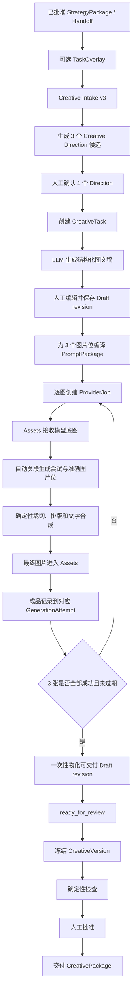

# Strategy → 图文素材落地 MVP 技术调研

日期：2026-07-31
状态：技术调研结论，供需求确认和实现评审使用

## 1. 结论先行

当前仓库已经具备 Strategy → Creative 的共享骨架，也具备 Provider 异步生成、Assets 稳定入库、Creative 版本检查与交付等分段能力，但**图文任务还没有形成业务闭环**。

最主要的断点不是 Strategy，而是 Creative 图文执行层：

1. 前端仍以演示数据为主，没有完成 Intake、Direction、Task、Draft、图片生成、素材回写、检查交付的真实串联。
2. 图文草稿是后端拼出的通用固定内容，不是 LLM 根据已确认 Creative Direction 生成的可执行创作稿。
3. 图片任务成功后虽然能进入 Assets，但不会自动回写到对应草稿版本和图片位。
4. 生成输入没有冻结为可追踪的 PromptPackage，输出素材也缺少对 Direction、Draft revision、图片位的完整血缘。
5. 当前图片接口固定请求 `1024×1024`，与权威契约中的小红书 `3:4`、最终 `1080×1440` 不一致。
6. 共享任务状态机已经存在，但图文服务没有完整驱动 `generating → generated → rendering → ready_for_review → approved → delivered`。

因此，MVP 不应继续横向扩展更多平台、模板或玩法，而应先完成一条固定的小红书图文链路：

> 已确认策略输入 → Creative Direction → 结构化图文稿 → 3 张成组图片 → 稳定素材入库 → 一次性物化可交付草稿 → 冻结检查 → 人工批准 → CreativePackage 交付

这条链路完成后，才算“从策略到素材落地”，而不是以“Provider 返回成功”作为终点。

## 2. 权威边界与方向判断

本方案以以下文档和冻结契约为准：

- `docs/26-creative-shared-contract-state-machine-v1.md`
- `docs/25-strategy-to-creative-development-contract-v2.md`
- `api/fixtures/creative-shared-workflow-v1-frozen.json`
- `api/contracts/creative-shared-workflow-v1.schema.json`

### 2.1 Strategy 和 Creative 的职责

现有方向没有偏离 Kanon 权威边界。

Strategy 负责回答：

- 为什么做；
- 对谁说；
- 说什么；
- 选择什么创意路线；
- 本任务相对通用策略需要补充哪些任务级约束。

Creative 负责回答：

- 具体用什么概念和表达切入；
- 标题、正文、图片顺序分别是什么；
- 每张图长什么样；
- 用什么 Prompt 和生成规格执行；
- 哪些素材被采用并进入最终交付。

任务级策略 Overlay 位于通用策略与 Creative 之间是合理的，但它只能**收窄和补充执行约束**，不能提前产出概念、Hook、脚本、分镜或 Prompt。Creative 同时接受通用策略和任务级策略的正确方式，不是让两个对象平级竞争，而是由 PlanningContext 形成一个有明确优先级和血缘的输入：

```text
StrategyPackage + Handoff + selected_route
                      +
              optional TaskOverlay
                      ↓
              Creative PlanningContext
```

Creative Direction 是策略与创作交接的正式接口。LLM 可以参与生成 Direction，但最终应由人确认，后续图文草稿只能消费已确认 Direction。

## 3. MVP 的业务定义

### 3.1 唯一首发场景

- 平台：小红书；
- 内容类型：品牌图文；
- 画幅：3:4；
- 最终成品：1080×1440；
- 默认结构：固定 3 张；
- 创作方式：LLM 生成结构化文案和图片计划，图片模型生成无字底图，服务端确定性合成文字；
- 审核方式：人工编辑、人工确认 Direction、人工批准版本；
- 落地方式：最终三张成品均成为项目内稳定 AssetVersion，并随 CreativePackage 交付。

固定 3 张的最小结构：

1. 封面：吸引注意，表达核心主题；
2. 价值页：场景、证据或核心利益点；
3. 收束页：品牌记忆与行动引导。

单封面虽然开发更快，但不构成完整的小红书图文内容包；任意张数和自由画布又会显著扩大编辑器、校验和渲染范围。固定 3 张是业务完整性与 MVP 成本之间更合适的边界。

### 3.2 “素材落地”的判定

单张图片只有同时满足以下条件，才算落地：

- Provider 输出已通过 Assets intake；
- 已取得稳定 `AssetVersionRef`；
- 已关联到准确的 `task_id + authoring_draft_revision + image_plan_order`；
- 前端可通过稳定预览地址查看；
- 关联的素材仍对应当前 authoring revision，没有被后续编辑变成过期结果；
- 最终合成规格为 1080×1440；
- 三张成品已一次性物化为新的可交付 Draft revision，并进入被冻结且通过检查的 CreativeVersion。

整条任务只有经过人工批准并生成不可变 CreativePackage，才算完成业务交付。

### 3.3 MVP 不做

- 不做公众号、多平台和多画幅；
- 不做自由画布、图层编辑器和复杂模板市场；
- 不做一键直发小红书；
- 不做 A/B 变体、批量矩阵和自动择优；
- 不做文生图模型的多供应商 UI；
- 不让图片模型直接生成中文封面字；
- 不自动绕过人工 Direction 确认和版本批准；
- 不修改已经冻结的共享 Creative 契约。

## 4. 当前能力盘点

| 环节 | 当前状态 | 可复用程度 |
|---|---|---|
| StrategyPackage/Handoff | 已有不可变引用、hash 校验和路线选择 | 直接复用 |
| TaskOverlay | 已有可选 Overlay 和边界约束 | 直接复用 |
| Creative Intake v3 | 已能解析策略输入并形成 PlanningContext | 直接复用 |
| Direction | 已有候选生成、比较、确认和版本契约 | 直接复用，补前端 |
| CreativeTask | 已要求绑定 confirmed Direction | 直接复用 |
| ImageTextDraft | 已有标题、正文、话题、封面字和 image plan | 扩展 |
| 草稿编辑 | 已有乐观锁修订接口 | 直接复用 |
| 图片 ProviderJob | 已有异步 job 和 image-plan-order 请求入口 | 改造 |
| Assets intake | Provider 成功后可自动形成稳定项目素材 | 直接复用 |
| 素材绑定 | 已有手工 BindImageAsset，但每次绑定都会增加 Draft revision | 新增三图原子物化 |
| 版本冻结/检查 | 已有 Freeze、Check 和确定性规则 | 扩展规则 |
| 批准/交付 | 已有 Approve 和 CreativePackage | 直接复用 |
| 图文页面 | 目前主要是硬编码演示内容 | 重做真实主链路 |

## 5. 关键缺口

### 5.1 前端身份传递错误

当前 Strategy 跳转图文页面时传递的是 Intake ID，但图文页面按 CreativeTask ID 读取详情。`TaskStrategyHandoff` 仍主要按旧的 `task_strategy` 来源判断，对 v3 的 `strategy_package` 路径支持不完整。

结果是：即使后端已有严格契约，页面也不能顺畅完成 Direction 确认和 Task 创建。

### 5.2 图文稿没有真正消费 Creative Direction

当前 `composeXiaohongshuDraft` 生成的是通用固定四图草稿。它没有将 confirmed Direction 作为 LLM 创作输入，也没有形成内容质量可接受的标题、正文和逐图创作意图。

MVP 需要把“生成图文稿”定义为正式 Creative 能力：

- 输入：PlanningContext、confirmed Direction、已授权品牌/产品素材摘要；
- 输出：结构化 ImageTextDraft；
- 失败：明确失败，不以固定模板文案伪装为模型产物；
- 恢复：允许用户手工编辑或重新生成。

### 5.3 缺少 PromptPackage

当前图片 prompt 是请求时临时拼接的字符串，没有稳定 ID、内容 hash、编译器版本和来源 revision。这样无法准确回答：

- 这张图是基于哪个草稿版本生成的；
- 用户修改草稿后，旧结果是否还能自动采用；
- 重试使用的是同一 Prompt 还是新 Prompt；
- 最终素材为什么长成这样。

### 5.4 Provider 成功不等于草稿可用

现有 ProviderJob 成功后会触发 Assets intake，这是很重要的基础能力。但 Creative 只记录了粗粒度 ProductionJob，没有自动完成：

```text
ProviderJob
  → output ProjectAssetRef
  → 找到原 task/draft/image slot
  → 校验 revision 仍是当前版本
  → 记录到 GenerationAttempt
  → 三张齐全后一次性物化新 Draft revision
  → 更新任务状态
```

用户目前需要跨接口自行判断和绑定，页面也没有实现这套动作。

### 5.5 尺寸和成品规格不一致

冻结路线要求小红书 3:4、最终 1080×1440。当前接口请求 `1024×1024`，无法满足契约。

OpenAI 官方图片模型当前提供的常用尺寸是 `1024×1024`、`1024×1536`、`1536×1024` 或自动尺寸，并不直接提供 1080×1440。参见 [OpenAI Image API reference](https://platform.openai.com/docs/api-reference/images) 和 [GPT Image 1.5 model](https://developers.openai.com/api/docs/models/gpt-image-1.5)。

因此，不能把“请求模型生成 1080×1440”当作可靠实现。推荐分两步：

1. 模型生成 `1024×1536` 的无字竖图底图；
2. 服务端进行确定性裁切、缩放和文字排版，输出 `1080×1440` 成品。

这样还能避免模型生成中文文字时的不稳定拼写、字体和品牌规范问题。

### 5.6 状态机只存在于契约和数据库

数据库已经允许完整共享状态：

```text
draft → in_progress → generating → generated
      → rendering → ready_for_review → approved → delivered
```

但图文服务没有在生成、回写、渲染、批准和交付时系统地推进状态，也没有把部分成功、全部成功、过期输出区分清楚。

## 6. 推荐的端到端链路



## 7. 建议的数据契约

不改共享冻结契约，新增图文专属契约 `creative-image-text-draft/v2`。旧 v1 继续可读，新任务只写 v2。

### 7.1 ImageTextDraft v2

在现有标题、正文、话题、封面字和 image plan 基础上补充：

```json
{
  "contract_version": "creative-image-text-draft/v2",
  "task_id": "creative_task_x",
  "revision": 3,
  "generation_source_revision": null,
  "direction_ref": {
    "direction_id": "direction_x",
    "content_hash": "sha256:..."
  },
  "input_identity_hash": "sha256:...",
  "title_candidates": ["...", "...", "..."],
  "selected_title": "...",
  "body": "...",
  "topics": ["..."],
  "image_plan": [
    {
      "order": 1,
      "role": "cover",
      "purpose": "...",
      "visual_brief": "...",
      "overlay_copy": "...",
      "layout_preset": "cover_center_v1",
      "asset_ref": null
    }
  ]
}
```

图文稿保存后形成新的 authoring revision。任何会影响图片画面或文字合成的字段变化，都必须使相关旧生成结果失效。

三张最终图片完成后，服务端不能复用现有 `BindImageAsset` 逐张绑定。该方法每绑定一张都会增加 revision，会导致后续 attempt 相对新 revision 变成过期结果。正确方式是：

1. 三张 final AssetVersion 先只记录在 GenerationAttempt；
2. 全部成功后，锁定原 authoring revision；
3. 一次性复制内容并写入三个 `asset_ref`；
4. 创建一个新的 materialized Draft revision；
5. `generation_source_revision` 指向原 authoring revision；
6. 在同一事务中将任务推进到 `ready_for_review`。

人工修改 materialized revision 后，它重新成为新的 authoring revision，旧图片按字段差异规则决定是否失效。

### 7.2 PromptPackage

每个图片位、每个草稿 revision 对应一个不可变 PromptPackage：

```json
{
  "contract_version": "creative-image-prompt-package/v1",
  "id": "prompt_package_x",
  "task_id": "creative_task_x",
  "draft_revision": 3,
  "image_plan_order": 1,
  "direction_id": "direction_x",
  "compiled_prompt": "...",
  "negative_constraints": ["no text", "no watermark"],
  "source_asset_refs": [],
  "compiler_version": "creative.image_text.prompt.v1",
  "content_hash": "sha256:..."
}
```

PromptPackage 由服务端编译，前端可以展示和确认，但不能自行提交已被信任的 prompt/hash。

### 7.3 GenerationAttempt

每次生成或重试都保留独立记录：

```json
{
  "id": "attempt_x",
  "task_id": "creative_task_x",
  "draft_revision": 3,
  "image_plan_order": 1,
  "prompt_package_id": "prompt_package_x",
  "provider_job_id": "provider_job_x",
  "status": "queued",
  "base_asset_ref": null,
  "final_asset_ref": null,
  "stale": false,
  "error": null
}
```

建议状态：`queued / running / base_asset_ready / rendering / succeeded / failed / stale / cancelled`。

### 7.4 GenerationSpec

P0 固定在服务端，不开放复杂配置：

- model alias：一个已配置的图片模型别名；
- source size：1024×1536；
- final size：1080×1440；
- output：PNG；
- background policy：无文字、无水印；
- layout preset：三个固定模板之一；
- renderer version：例如 `creative.image_text.renderer.v1`。

固定规格仍需写入 attempt snapshot 和 hash，以保证后续可重放和审计。

## 8. 后端实现建议

### 8.1 增加图文草稿生成服务

建议新增：

```text
POST /creative-tasks/{task_id}:generate-image-text-draft
```

服务端必须：

1. 读取 Task 绑定的 confirmed Direction；
2. 校验 PlanningContext 和 input identity；
3. 调用 LLM 输出严格 JSON；
4. 进行 schema 校验、长度校验和禁止项检查；
5. 生成 v2 draft revision；
6. 将任务推进到 `in_progress`。

模型输出不能直接写数据库，必须经过结构化解析和服务端校验。

### 8.2 将图片生成改为领域命令

不再让 HTTP handler 临时拼 prompt 后直接调用 Provider。建议由 Creative Service 提供：

```text
POST /creative-tasks/{task_id}/image-slots/{order}:generate
POST /creative-tasks/{task_id}/image-slots/{order}:retry
GET  /creative-tasks/{task_id}/image-generation
```

领域服务负责：

- 校验 generation readiness；
- 冻结 PromptPackage；
- 创建 GenerationAttempt；
- 幂等创建 ProviderJob；
- 记录精确 source resource refs；
- 驱动 Task 状态。

### 8.3 增加完成回调或收敛 Worker

不要依赖前端轮询后再发 Bind 请求。Provider job 终态应由服务端 worker 或持久化事件处理：

1. 读取成功 job 的 ProjectAssetRef；
2. 根据 attempt 找到 task、revision 和 slot；
3. 若 revision 已过期，将 attempt 标记 `stale`，保留素材但不自动采用；
4. 若仍有效，进入确定性图片合成；
5. 将合成结果作为 rendered image 再次进入 Assets；
6. 将 final AssetVersionRef 记录到对应 GenerationAttempt；
7. 三张全部完成后调用原子物化操作，一次性生成带三个 asset refs 的新 Draft revision；
8. 原子物化成功后将任务推进到 `ready_for_review`。

### 8.4 增加图片渲染入库能力

当前 Assets 有 Provider generated intake，也有视频渲染入库能力，但缺少明确的图文成品渲染入口。

推荐增加窄接口：

```go
IngestRenderedImage(
    ctx,
    requestContext,
    projectID,
    renderJobID,
    reader,
    size,
    provenance,
) (ProjectAssetRef, error)
```

最终成品的血缘至少应包含：

- confirmed Direction；
- Draft revision；
- PromptPackage；
- GenerationAttempt；
- 模型底图 AssetVersion；
- renderer version；
- CreativeTask。

### 8.5 确定性图片合成器

P0 只支持三个模板，不建设通用设计引擎：

- 封面居中标题；
- 内容页左下信息区；
- 收束页底部 CTA。

合成器负责：

- 1024×1536 到 1080×1440 的中心/焦点裁切；
- 安全区；
- 字号、行数、行距和溢出规则；
- 半透明衬底和对比度；
- 品牌色；
- 固定授权字体；
- PNG 编码；
- 输出 hash。

需要把字体文件及许可证作为部署资产管理，避免依赖运行机器的系统字体。

## 9. 状态和并发规则

### 9.1 Task 状态

| 事件 | 目标状态 |
|---|---|
| 创建任务 | `draft` |
| 草稿生成或编辑完成 | `in_progress` |
| 任一有效图片位开始生成 | `generating` |
| 三个模型底图均成功 | `generated` |
| 开始合成最终图 | `rendering` |
| 三个最终 AssetVersion 齐全并原子物化为新 revision | `ready_for_review` |
| 版本人工批准 | `approved` |
| CreativePackage 创建成功 | `delivered` |

部分失败时保持 `generating`，并展示每个 slot 的独立状态；全部运行结束但有失败时回到 `in_progress`，允许只重试失败项。

### 9.2 防止旧结果覆盖新草稿

所有异步操作都必须绑定：

```text
task_id + expected_task_version + draft_revision + image_plan_order
```

回写前再次比较当前 revision。不同则只保留为历史生成结果，不自动采用。

### 9.3 幂等和重试

- 草稿生成、slot generate、retry、freeze、approve、deliver 均要求 Idempotency-Key；
- 同一 `draft_revision + slot + prompt_hash` 的重复请求返回同一 active attempt；
- Provider 失败可以重试，重试生成新 attempt，不覆盖旧 attempt；
- renderer 可按同一输入 hash 安全重放；
- Assets 入库重复调用必须返回同一稳定引用或明确冲突。

## 10. 前端 MVP 页面

建议将当前演示型 `ImageTextCreationPage` 改成单页工作台，而不是新增多个孤立页面。

页面从上到下包含：

1. **策略来源**：只读显示 Package、Overlay、选定路线和 input identity；
2. **Creative Direction**：三个候选卡片、差异和人工确认；
3. **图文稿**：标题候选、选定标题、正文、话题，支持生成和保存；
4. **三图计划**：每张图的作用、visual brief、overlay copy、生成/重试按钮和状态；
5. **成品预览**：读取稳定 Asset preview，不使用临时 Provider URL；
6. **检查与交付**：缺失项、禁止项、冻结、批准、交付。

页面路由应明确区分：

- 只有 Intake 时，进入 Direction 阶段；
- 已有 Task 时，使用 Task ID 进入创作工作台；
- 创建 Task 后立即替换 URL 中的身份，不再混用 Intake ID。

轮询只用于显示状态，不能承担素材回写和状态推进。

## 11. P0 实施顺序

### P0-1：打通真实身份和 Direction

- 修正 `strategy_package` handoff；
- 前端完成 Intake → Direction candidates → confirm → Task；
- 清除 Intake ID/Task ID 混用；
- 不再展示硬编码图文内容。

验收终点：用户能从已批准策略进入真实 CreativeTask。

### P0-2：生成并编辑真实图文稿

- 新增 ImageTextDraft v2；
- LLM 依据 confirmed Direction 生成三图结构化稿；
- 支持人工编辑和 revision；
- 增加 schema、禁止项和长度检查。

验收终点：页面展示的每个创作字段都有明确策略来源和真实后端持久化。

### P0-3：逐图生成、Assets 回写和稳定预览

- 新增 PromptPackage 和 GenerationAttempt；
- Provider 改用支持的竖图规格；
- Provider 成功后服务端自动关联；
- 过期 revision 不自动覆盖；
- 展示每张图的稳定 Assets preview。

验收终点：三张模型底图均能独立生成、失败重试并追踪来源。

### P0-4：确定性合成与交付

- 新增三个固定模板的图片合成器；
- 输出 1080×1440 最终成品；
- 最终图入 Assets，并一次性物化为可交付 Draft revision；
- 驱动共享状态机；
- Freeze → Check → Approve → Deliver。

验收终点：CreativePackage 中包含三张可下载、可追踪的最终 AssetVersion。

## 12. 人工验收主链路

1. 在 Strategy 中选择一个已批准 StrategyPackage；
2. 选择小红书图文路线，可选一个合法 TaskOverlay；
3. 发起交接，确认页面展示的 Package、Handoff、route 和 hash 一致；
4. 生成三个 Creative Direction，人工选择一个；
5. 创建 CreativeTask，确认地址和接口均使用 Task ID；
6. 生成图文稿，确认标题、正文、话题和三图计划来自所选 Direction；
7. 修改第二张图的文案并保存，确认 draft revision 增加；
8. 分别生成三张图，确认各自出现 queued/running 状态；
9. 在任一生成过程中再次修改对应图片位，确认旧结果成为 stale，且不覆盖新 revision；
10. 对失败项执行单独重试；
11. 确认三张最终成品均为 1080×1440，文字清晰且没有模型生成的乱码；
12. 确认预览使用 Assets 稳定地址；
13. 确认三图齐全后只增加一次 materialized Draft revision，而不是每张图各增加一次；
14. 冻结版本并执行检查，缺图时必须阻断；
15. 人工批准并交付；
16. 打开 CreativePackage，确认包含准确的 Draft revision、三个 AssetVersionRef 和完整来源。

## 13. 风险与取舍

### 13.1 中文排版质量

风险：断行、溢出、字体缺失。
措施：固定模板、固定字体、限制字符数、服务端像素级测试，不在 P0 做自由排版。

### 13.2 图片生成延迟和成本

风险：三图串行耗时长。
措施：三个 slot 并发但独立重试；页面渐进展示；同 prompt hash 不重复提交。

### 13.3 模型输出不符合结构

风险：图文稿 JSON 不完整或违反限制。
措施：严格 schema、一次受控修复、仍失败则明确报错；保留人工编辑恢复路径。

### 13.4 素材权利与品牌资产

风险：来源素材未经授权，或生成结果无法解释来源。
措施：generation readiness 检查素材稳定性和权利状态；资产关系中保留来源引用；不使用临时 URL。

### 13.5 共享契约被图文实现反向污染

风险：为图文方便修改冻结状态机或 Direction 语义。
措施：所有新增内容放在 image-text 专属 v2、PromptPackage、GenerationAttempt 和 renderer 中；共享契约只消费，不修改。

## 14. API 契约草案

MVP 应提供一个面向页面的图文 Workspace 聚合读模型。前端不应自行拼接 Intake、Direction、ProviderJob、Asset 和 Version 的状态。

### 14.1 Workspace 查询

```text
GET /api/creative/v1/projects/{project_id}/creative-tasks/{task_id}/image-text-workspace
```

建议返回：

```json
{
  "task": {
    "id": "creative_task_x",
    "version": 8,
    "status": "generating",
    "input_identity_hash": "sha256:..."
  },
  "strategy_source": {
    "strategy_package_ref": {},
    "handoff_ref": {},
    "task_overlay_ref": {},
    "selected_route_id": "route_x"
  },
  "direction": {
    "id": "direction_x",
    "version": 1,
    "status": "confirmed",
    "content_hash": "sha256:..."
  },
  "draft": {
    "contract_version": "creative-image-text-draft/v2",
    "revision": 3
  },
  "slots": [
    {
      "order": 1,
      "role": "cover",
      "status": "running",
      "attempt_id": "attempt_x",
      "attempt_no": 2,
      "stale": false,
      "preview_url": null,
      "final_asset_ref": null,
      "error": null
    }
  ],
  "readiness": {
    "draft_generation_ready": true,
    "image_generation_ready": true,
    "review_ready": false,
    "blocking_reasons": []
  },
  "active_version": null,
  "delivered_package": null
}
```

`preview_url` 由服务端根据稳定 AssetVersion 生成或返回受控地址；不能返回 Provider 临时 URL。

### 14.2 图文稿生成

```text
POST /api/creative/v1/projects/{project_id}/creative-tasks/{task_id}:generate-image-text-draft
Idempotency-Key: ...

{
  "expected_task_version": 3,
  "expected_direction_id": "direction_x"
}
```

图文稿生成属于 LLM 任务，建议通过现有持久化 Agent Task runtime 异步执行：

```text
202 Accepted
{
  "agent_task_id": "agent_task_x",
  "status": "queued"
}
```

成功后创建新 Draft revision；失败只记录失败任务，不写入伪造草稿。

### 14.3 草稿编辑

保留现有：

```text
PATCH /api/creative/v1/projects/{project_id}/creative-tasks/{task_id}:draft
```

请求必须包含 `expected_version`。服务端应根据字段差异计算受影响的图片位：

- 修改标题、正文、话题但不进入图片画面：保留图片；
- 修改某一 slot 的 `visual_brief`、`overlay_copy`、`layout_preset`：只使该 slot 的生成结果过期；
- 修改 confirmed Direction 或 input identity：整个旧 Draft 不可继续使用，必须创建新 Draft revision。

### 14.4 图片位生成与重试

```text
POST /api/creative/v1/projects/{project_id}/creative-tasks/{task_id}/image-slots/{order}:generate
Idempotency-Key: ...

{
  "expected_task_version": 5,
  "draft_revision": 3
}
```

返回：

```text
202 Accepted
{
  "attempt_id": "attempt_x",
  "status": "queued",
  "prompt_package_id": "prompt_package_x"
}
```

重试使用单独语义：

```text
POST /api/creative/v1/projects/{project_id}/creative-tasks/{task_id}/image-slots/{order}:retry
```

只有 `failed` 或用户明确放弃的 attempt 才能重试。正在运行的 attempt 不能被重复提交。

### 14.5 继续复用的接口

- `POST .../creative-intakes/{intake_id}:create-task`
- `PATCH .../creative-tasks/{task_id}:draft`
- `POST .../creative-tasks/{task_id}:freeze-version`
- `POST .../creative-versions/{version_id}:check`
- `POST .../creative-versions/{version_id}:approve`
- `POST .../creative-versions/{version_id}:deliver`

现有 `:image-job` 和 `:bind-image-asset` 可保留给旧客户端，但新图文页面不得直接调用；图片生成和绑定必须收口到 Creative 领域服务。

## 15. 数据库改造草案

### 15.1 草稿

继续复用 `creative_image_text_drafts` 的 revision 存储方式，在 payload 中写入 v2 contract。旧记录没有 `contract_version` 时按 v1 读取。

不建议原地重写历史 payload，也不建议用一次性迁移为旧草稿伪造 Direction 血缘。

v2 必须区分两个版本号：

- `creative_tasks.version`：任务聚合的乐观锁版本，任何状态或子资源变化都可以递增；
- `creative_image_text_drafts.revision`：创作内容版本，只在创建新草稿或物化成品草稿时递增。

当前部分代码把 Task version 直接设置成 Draft version。新链路不能继续依赖二者相等，否则 job 状态更新、素材回写和草稿编辑会互相覆盖。API 中的 `expected_task_version` 与 `draft_revision` 必须分别校验。

### 15.2 PromptPackage 表

```text
creative_image_prompt_packages
  organization_id
  project_id
  id
  task_id
  draft_revision
  image_plan_order
  direction_id
  direction_content_hash
  input_identity_hash
  compiler_version
  prompt_payload
  content_hash
  created_by
  created_at
```

关键约束：

- 主键：`organization_id + id`；
- 唯一：`organization_id + task_id + draft_revision + image_plan_order + content_hash`；
- `draft_revision > 0`；
- `image_plan_order` 在 1 到 3；
- PromptPackage 创建后不可更新。

### 15.3 GenerationAttempt 表

```text
creative_image_generation_attempts
  organization_id
  project_id
  id
  task_id
  draft_revision
  image_plan_order
  attempt_no
  prompt_package_id
  generation_spec_payload
  generation_spec_hash
  provider_job_id
  render_job_id
  status
  base_asset_id
  base_asset_version
  final_asset_id
  final_asset_version
  stale_reason
  error_code
  error_message
  created_by
  created_at
  updated_at
```

关键约束：

- 唯一：`organization_id + provider_job_id`；
- 唯一：`organization_id + task_id + draft_revision + image_plan_order + attempt_no`；
- Asset 必须以 `asset_id + version` 成对出现；
- `succeeded` 必须存在 final AssetVersion；
- `stale` 结果允许存在素材，但禁止自动写回当前 Draft。

### 15.4 是否复用 creative_production_jobs

`creative_production_jobs` 可以继续作为跨格式的任务索引，但不能继续承担图文生成的全部领域状态，因为它缺少：

- draft revision；
- image plan order 的强结构字段；
- PromptPackage；
- base/final 两级素材；
- stale 和 retry 语义。

P0 推荐双写：

- GenerationAttempt 是图文真实状态源；
- ProductionJob 保留 ProviderJob 索引，避免影响现有任务详情和运维查询。

## 16. Generation Readiness 规则

`image_generation_ready` 只能由 Creative 服务端计算。以下任一项不满足都必须阻断：

| 检查项 | 阻断原因 |
|---|---|
| Task 属于 image_text/xiaohongshu | `unsupported_creative_route` |
| Intake v3 和 PlanningContext 可解析 | `planning_context_invalid` |
| Direction 已 confirmed | `direction_not_confirmed` |
| Direction、Intake、Task identity 一致 | `input_identity_mismatch` |
| Draft 是当前 v2 revision | `draft_revision_stale` |
| 三个 slot 结构完整 | `image_plan_incomplete` |
| 当前 slot visual brief 非空 | `visual_brief_missing` |
| overlay copy 满足长度限制 | `overlay_copy_invalid` |
| mandatory/prohibited 规则可用 | `guardrails_missing` |
| 引用素材是稳定 AssetVersion | `source_asset_unstable` |
| 引用素材权利状态允许生成 | `source_asset_rights_blocked` |
| Provider route 可用 | `provider_route_unavailable` |
| 没有相同输入的 active attempt | `generation_already_active` |

前端可以显示这些原因，但不能自行决定 readiness。

## 17. 状态收敛算法

任务状态不应由某个 HTTP handler 凭经验修改，而应由统一 `ReconcileImageTextTask` 根据当前 Draft 的三个 slot 重新计算。

P0 采用阶段屏障，避免违反冻结状态机：

1. 只要存在 queued/running 模型任务，状态为 `generating`；
2. 三个模型底图全部成功后，状态从 `generating` 进入 `generated`；
3. 只有进入 `generated` 后才统一启动最终图片合成，进入 `rendering`；
4. 三个 final AssetVersion 全部成功后，原子物化一个新 Draft revision 并进入 `ready_for_review`；
5. 如果所有模型任务已终态但有失败，从 `generating` 回到 `in_progress`；
6. 如果所有渲染任务已终态但有失败，从 `rendering` 回到 `generated`；
7. 编辑已 ready 的 Draft 时，按共享状态机回到 `in_progress`；
8. delivered 后再次编辑时创建新 Draft revision，旧 CreativePackage 保持不可变。

不能在第一张底图成功后直接进入 `rendering`，因为冻结状态机不允许 `generating → rendering`。

保存草稿也必须按当前状态选择合法迁移，不能继续无条件把 Task 写成 `draft`：

| 保存前状态 | 保存后状态 |
|---|---|
| `draft` | `in_progress` |
| `in_progress` | `in_progress` |
| `generating` | `in_progress`，当前 revision 的未完成 attempt 变 stale/cancelled |
| `generated` / `rendering` | `in_progress`，未采用成品保留为历史 |
| `ready_for_review` | `in_progress` |
| `approved` / `delivered` | 先按共享契约回到 `draft` 并创建新 revision，旧版本和 Package 不变 |

因此 v2 应新增状态感知的 `SaveImageTextDraft` repository 操作，而不是直接复用当前无条件写 `TaskDraft` 的 `ReviseDraft` SQL。

### 17.1 回写事务

单个 attempt 的成功收敛至少应在同一事务中：

1. 锁定 GenerationAttempt；
2. 校验 ProviderJob/RenderJob 终态；
3. 校验 Project、Task、revision、slot；
4. 写入 AssetVersionRef；
5. 标记 attempt 状态；
6. 执行任务状态收敛；
7. 写审计事件。

外部 Provider 和 Assets 调用不能放在数据库事务内；采用“外部调用完成 → 幂等收敛”的方式。

三图物化使用独立事务 `FinalizeImageTextDraftAssets`：

1. 锁定 Task 和原 authoring Draft；
2. 确认三个 attempt 均属于同一 authoring revision 且全部 succeeded；
3. 确认三个 final AssetVersion 均来自当前 Project；
4. 一次性创建仅增加 1 的 materialized Draft revision；
5. 在新 revision 中写入全部三个 asset refs 和 `generation_source_revision`；
6. 将 Task 设置为 `ready_for_review`；
7. 写审计事件。

物化不能调用现有 `BindImageAsset` 三次，也不能调用当前会把 Task 重置为 `draft` 的通用 `ReviseDraft` 三次。

## 18. 代码改造地图

| 位置 | P0 改造 |
|---|---|
| `internal/systems/creative/model.go` | 新增 Draft v2、PromptPackage、GenerationAttempt、Workspace 和 readiness 类型 |
| `internal/systems/creative/service.go` | 增加草稿生成、slot generate/retry、reconcile；移除 handler 直接编 prompt 的职责 |
| `internal/systems/creative/mysql_repository.go` | 增加 PromptPackage/Attempt 持久化、锁、状态收敛和三图原子物化事务 |
| `internal/systems/creative/workflow_contract.go` | 只复用现有状态迁移函数，不改变冻结图 |
| `internal/platform/httpserver/creative_handlers.go` | 增加 workspace/draft generation/slot 命令 handler；旧 image-job 标记兼容路径 |
| `internal/platform/httpserver/server.go` | 注册明确的新路由，减少依赖 `{task_action}` 后缀分发 |
| `internal/platform/provider` | 允许携带 PromptRef、SourceResourceRefs 和竖图 GenerationSpec |
| `internal/systems/assets` | 增加 rendered image 入库和完整 provenance |
| `api/contracts` | 新增 Draft v2、PromptPackage v1、Attempt v1、Workspace v1 schema |
| `src/data/api.ts` | 增加真实图文 Workspace API 和类型 |
| `src/components/SpecializedPages.tsx` | 移除图文演示数据；建议拆出独立 ImageTextWorkspace 组件 |
| `src/features/strategy/TaskStrategyHandoff.tsx` | 接受 v3 `strategy_package`，正确传递 Intake/Task 身份 |

为降低单文件复杂度，前端建议拆分：

```text
src/features/creative/image-text/
  ImageTextWorkspace.tsx
  DirectionPanel.tsx
  DraftEditor.tsx
  ImageSlotCard.tsx
  ReviewDeliveryPanel.tsx
  types.ts
```

## 19. 错误恢复与可观测性

### 19.1 对用户可恢复

| 场景 | 产品行为 |
|---|---|
| LLM 草稿生成失败 | 保留旧 Draft；允许重试或人工创建 |
| 单张图片生成失败 | 其他图片不丢失；只重试失败 slot |
| 三张底图成功、单张渲染失败 | 保留底图；只重试渲染 |
| 草稿在生成中被修改 | 旧输出显示为“来自旧版本”，不自动采用 |
| Provider 暂不可用 | 明确显示路由不可用，不静默换模型 |
| Assets 入库暂时失败 | attempt 保持可收敛状态，由 worker 重试，不重复生成图片 |
| 页面关闭后重新打开 | 从 Workspace 恢复真实状态，不依赖浏览器内存 |

### 19.2 错误响应

- `409 Conflict`：版本冲突、旧 revision、已有 active attempt；
- `422 Unprocessable Entity`：readiness 不满足、草稿内容不合法；
- `404 Not Found`：跨项目或不存在的 task/slot；
- `503 Service Unavailable`：已配置 route 暂不可用；
- Provider 异步失败不通过后续 HTTP 500 表达，而记录在 attempt 终态。

错误响应至少包含稳定 `code`、通俗 `message`、`retryable` 和 `request_id`。

### 19.3 核心指标

- Strategy handoff 到 Task 创建成功率；
- Direction 确认到 Draft 生成成功率与耗时；
- 单 slot Provider 成功率、P50/P95 耗时和重试次数；
- Provider 成功到 AssetVersion 可预览的耗时；
- stale result 比例；
- 三图全部 ready 的成功率和总耗时；
- Freeze 检查阻断原因分布；
- Task 到 CreativePackage 的转化率；
- 每个已交付任务的图片生成调用数和估算成本。

日志关联键统一使用：

```text
request_id / project_id / task_id / draft_revision /
image_plan_order / attempt_id / provider_job_id / asset_id
```

## 20. 测试与发布门槛

### 20.1 后端自动化测试

- Draft v2 schema 和 LLM 非法输出；
- PlanningContext/Direction identity 不匹配；
- PromptPackage canonical hash 稳定；
- 同幂等键不重复创建 ProviderJob；
- 三 slot 状态收敛；
- 单 slot 失败和重试；
- 旧 revision 输出被标为 stale；
- Assets 重复回调幂等；
- Task version 与 Draft revision 独立递增；
- 三张图只物化一个新 Draft revision；
- 禁止以现有 BindImageAsset 逐图造成 revision 漂移；
- 最终尺寸、格式和 content hash；
- Freeze 缺图阻断；
- approved 前禁止 deliver；
- 跨组织、跨项目资源引用拒绝。

### 20.2 前端自动化测试

- Intake ID 与 Task ID 路由切换；
- Direction 未确认时禁止创建 Task；
- Draft 乐观锁冲突提示；
- slot 独立 loading/error/retry；
- 页面刷新后恢复 job 状态；
- stale 结果不进入当前预览；
- 三图未齐时批准按钮禁用；
- 预览只消费稳定 Assets URL。

### 20.3 像素级测试

对三个固定模板建立 golden images，验证：

- 输出严格为 1080×1440；
- 字体确定；
- 同输入得到同 content hash；
- 长文案按约定截断或阻断；
- 中文、英文、数字混排不溢出；
- 安全区和对比度符合规则。

### 20.4 发布策略

使用项目级 capability flag：

```text
creative.image_text.workflow_v2
```

发布顺序：

1. 先发布数据库、后端双读和关闭状态的 flag；
2. 发布 worker、Assets rendered image 和监控；
3. 在内部测试 Project 开启；
4. 跑完人工主链路和故障恢复链路；
5. 再开启真实页面入口；
6. 旧 v1 页面保留短期只读，不再创建新 v1 任务。

回滚时关闭 flag，停止创建新 v2 任务；已经创建的 PromptPackage、Attempt、Asset 和 CreativePackage 不删除。

### 20.5 P0 交付硬门槛

- 权威冻结 fixture 和 schema 测试保持通过；
- 后端单元/集成测试通过；
- 前端 build 和相关测试通过；
- 三个模板 golden tests 通过；
- 人工主链路完整通过；
- 至少验证一次 Provider 失败、一次 stale result 和一次 Assets 重试；
- `git diff --check` 通过；
- PR 所有 required GitHub Actions checks 通过。

## 21. 反方评审

### 反方一：固定三张仍然太重，先做一张图即可

反驳：单张图只能验证 API 连通性，无法验证图文组顺序、部分失败、逐图重试、完整性检查和包交付，后续仍需重做核心模型。

接受的降级：技术开发可以先让 slot 1 跑通，但产品验收和交付门槛仍要求三张完整成组。

### 反方二：直接让图片模型生成 1080×1440 和文字，省掉 renderer

反驳：当前官方规格没有直接提供 1080×1440，中文文字和品牌排版也不稳定。[OpenAI Image API](https://developers.openai.com/api/reference/resources/images) 当前列出的生成尺寸为 1024×1024、1024×1536、1536×1024 或 auto。

结论：renderer 不是锦上添花，而是满足冻结画幅、稳定中文排版和可重放交付的必要组成。

### 反方三：前端轮询 Provider，成功后调用 bind，后端最省事

反驳：用户关闭页面、网络中断、重复点击或草稿变更时都会造成永久未绑定或错误绑定。领域状态必须由服务端收敛。

### 反方四：复用 creative_production_jobs，不新增 Attempt 表

反驳：现有表无法表达 revision、slot、PromptPackage、base/final asset、stale 和 retry。继续堆 JSON 会让一致性约束和查询都不可控。

### 反方五：Draft v1 加几个可选字段即可，不必 v2

反驳：这次变化引入了 Direction 强血缘、固定三图语义和生成失效规则，已经改变对象语义。显式 v2 能避免旧数据被误认为满足新交付要求。

### 反方六：三张图应边生成边渲染，速度更快

反驳：共享状态机不允许 `generating → rendering`，且边生成边渲染会让任务级状态含义模糊。

接受的后续优化：P1 可以保持 Task 为 `generating`，在 Attempt 子状态中提前渲染；但在不修改共享状态机的前提下，Task 只有三张底图齐全后才能进入 `generated/rendering`。P0 使用阶段屏障更稳妥。

### 反方七：交付只到 ready_for_review，批准和 package 以后再做

反驳：仓库已经有版本批准和 CreativePackage 能力，不接入会把“素材生成成功”误当成业务交付，也无法验证不可变版本和准确资产清单。

结论：Approve 和 Deliver 必须属于 P0 闭环。

## 22. 待产品确认但不阻塞技术启动的事项

以下内容采用默认值即可启动 P0，后续产品确认只影响配置：

| 事项 | P0 默认值 |
|---|---|
| 三图结构 | 封面 / 价值证明 / CTA 收束 |
| 标题候选数 | 3 |
| 正文字数 | 300–800 字 |
| 话题数量 | 3–8 个 |
| 封面文案 | 最多 2 行，每行不超过 12 个中文字符 |
| 内容页文案 | 最多 4 行 |
| 图片质量档位 | medium |
| 同 slot 最大自动重试 | 0；全部由人点击重试 |
| 最终格式 | PNG |
| 是否直发平台 | 否 |

真正会改变架构、必须另立需求的事项：

- 是否允许自由图片数量；
- 是否建设自由画布；
- 是否要求多平台同稿适配；
- 是否直接发布到小红书；
- 是否允许自动批准或无人交付。

## 23. 最终建议

当前应停止继续扩展 Strategy 层概念，把实施重心放在 Creative 图文执行闭环。

最合适的 P0 目标不是“页面能点出一张图”，而是：

> 一个已经确认的 Creative Direction，能够稳定地产生一版可编辑的三图小红书内容；每张最终图片都进入 Assets、准确关联生成时的 authoring revision，三张齐全后原子物化为一个可交付草稿版本，通过人工检查，并最终进入不可变 CreativePackage。

这既符合 Kanon 的策略边界，也验证了 Creative 能同时消费通用策略和任务级策略，并把它们真正过渡为概念、文案、画面和可交付素材。
