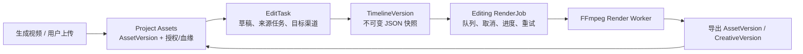

# 素材剪辑模块开发技术调研

- 日期：2026-08-06
- 范围：创意创作 → 视频创作 → 素材剪辑的 MVP；重点覆盖“AI 生成前贴 + 用户上传原视频 → 可编辑时间线 → 预览/导出成片回流”。
- 决策基线：[视频素材剪辑规格](../21-video-material-editor-spec.md)；本文件是结合现有代码和一手技术资料的实施调研，不取代该规格。
- 来源边界：仓库源码、OpenCut 官方 GitHub、FFmpeg 官方文档、OpenTimelineIO 官方文档；不依赖博客或二手教程。

## 1. 结论摘要

素材剪辑应新建独立的 `EditTask` 聚合和 `TimelineVersion` 不可变快照，**不能**扩展当前只支持“一个前贴 + 一个主视频”的 `creative.RenderJob` 作为编辑领域模型。用户上传视频和 AI 生成视频均先进入现有 Project Assets；时间线只引用固定 `Asset ID + Version`，原片永不覆盖。浏览器负责交互和低延迟预览，Go 负责项目范围、授权、并发、版本和审计，受控 Render Worker 使用 FFmpeg 根据已冻结快照导出并把成片写回 Assets。

OpenCut 仍是规格中合理的**首选候选**，但正确使用方式是先做 M0 隔离技术验证，再基于固定提交决定“抽取/维护 fork/仅参考交互”。不能把其整套应用、项目格式或上游 `main` 直接纳入业务链路。其官方仓库明确说明主线正在从头重写，目标为 Rust core、Editor API、插件、浏览器/桌面/移动共用代码；官方同时称 classic 是当前可使用的版本。因此验证必须分别固定目标代码库和 commit，不能对浮动 `main` 作承诺。[OpenCut README](https://github.com/OpenCut-app/OpenCut#status)

### 已确认的产品决策（2026-08-06）

本节记录产品负责人已确认的 MVP 决策；若与早期规格的宽泛范围冲突，以本节作为本期实现范围。

1. **素材剪辑是 Project 级通用能力。** 用户可直接进入素材剪辑，新建任务、上传任意可用视频，或从当前 Project 的已授权视频资产中选择素材；它不以“前贴 + 原片”作为唯一或强制的使用方式。
2. **前贴 + 原片是快捷编排模板。** 进入编辑器的前贴只被预选或放入初始时间线，用户可以仅剪前贴、把前贴放在任意位置，或混剪多个项目素材；不得在领域模型中固化“前贴必须在前”。
3. **首个自动交接只做短剧前贴 V2。** 短剧前贴视频成功生成、完成项目资产入库后显示“进入素材剪辑”。游戏前贴、电商前贴及其他视频生成模块暂不增加自动跳转入口；其已入库视频仍可由用户在通用素材剪辑页手动选择。
4. **MVP 首发只承诺一套导出规格：** `MP4 / H.264 / AAC / 720×1280 / 9:16 / 30fps / 48kHz`。16:9、1:1、1080×1920、变速、转场、关键帧和高级效果移至后续版本。
5. **保留现有编辑器视觉骨架。** 左素材箱、中央预览、右检查器、底部时间线（尤其轨道进度条的视觉语言）不做重设计；实现阶段仅替换演示数据，并按功能增加入口、上传、入轨、保存、预览与导出控件。
6. **素材可见不等于可交付。** 素材箱按 Project 可读范围展示；保存、预览和导出再次校验素材入库状态、Project Scope、授权/使用范围、技术元数据和渠道导出规则。

## 2. MVP 的边界与验收映射

| 验收目标 | 本期实现判断 |
| --- | --- |
| 独立建剪辑任务，或从来源工作区携带素材进入 | `POST EditTask` 支持空任务和 `seed_asset_refs`；MVP 首个来源工作区仅为短剧前贴 V2，来源任务写入 lineage。 |
| 媒体稳定引用且原素材不覆盖 | 所有 clip 使用 `AssetVersionRef`；编辑只创建新 TimelineVersion 和新成片 AssetVersion。 |
| 刷新/换设备恢复且不静默覆盖 | 服务端 draft + `expected_revision` 乐观并发；前端本地草稿只用于恢复未提交输入。 |
| 预览与导出一致 | 预览与最终导出都编译同一冻结时间线；以固定样例做帧、时长、裁切、字幕、字体、音轨对比。 |
| RenderJob 可排队、取消、进度、重试、复用代理 | 新增 editing render job/worker；进度来自 FFmpeg `-progress`，代理按 AssetVersion + 输出规格缓存。 |
| 权限/授权不符不得使用 | 每次保存、预览、导出均按 org/project 和 AssetVersion 可读性、授权有效期校验。 |
| OpenCut 有版本、许可证、性能、上游和退出方案 | 以 M0 记录固定 commit、SBOM/NOTICE、基准结果、升级规则和退回自研 UI 的路径。 |

首版应只承诺：MP4 视频、图片、现有音频格式；3 条视频/叠加轨、字幕/配音/音乐/音效轨；移动、裁切、分割、删除、吸附、缩放、撤销重做；**仅 9:16 的 720×1280 / 30fps 输出**；字幕校对、音量/淡入淡出、自动保存、低清预览及异步导出。16:9、1:1、1080×1920、转场、速度、关键帧和 AI 自动剪辑维持 P1。

## 3. 当前仓库能力与缺口

### 已可复用

- [Assets 模型](../../internal/platform/assets/model.go) 已有按组织/项目隔离的不可变 `AssetVersion`、上传会话、媒体探测、`generated_from` / `derived_from` 血缘；上传支持 MP4，视频上限为 200 MB。
- [FFmpeg Timeline Renderer](../../internal/platform/media/ffmpeg_timeline_renderer.go) 已能读取项目内视频/音频资产、生成 ASS 字幕、构建 filter graph、以 `-progress pipe:1` 回传进度、探测并校验输出。
- [AI Native Timeline 编译器](../../internal/systems/creative/ai_native_timeline.go) 已证明“业务快照 → `TimelineRenderRequest` → 渲染器”的边界可行。
- [现有 RenderJob](../../internal/systems/creative/render.go) 已具备权限校验、幂等、后台 Job Runtime、输出入库的基础模式；[素材剪辑 UI](../../src/components/SpecializedPages.tsx) 已有布局原型。

### 不能直接复用的限制

- `TimelineRenderRequest.Validate` 当前硬编码 720×1280、30fps、48kHz，视频轨必须从 0 到总时长连续闭合；这适合已编译的线性成片，不是通用编辑时间线，且不支持图片/叠加/间隙/画布变换。
- 当前 `creative.RenderJob` 的输入是 `PreRollVideo + MainVideo`，并以 `ComposePreRoll` 串接两条已标准化视频；它只能服务固定前贴工作流，不能承载多素材编辑、版本或可取消渲染。
- 当前 UI 的时间线是本地演示状态，导出前要求手填 `RemixPlan ID`，尚没有可恢复的 EditTask、版本保存和真实素材拖入。
- 现有 FFmpeg composer 的标准化路径固定 720×1280、25fps，和 timeline renderer 的 30fps profile 不一致；MVP 必须统一为本期冻结的 30fps profile，后续开放多比例前再把 profile 抽象为可配置版本，避免预览/导出漂移。

## 4. 推荐领域模型与运行边界

建议最小实体：

- `EditTask`：`id, organization_id, project_id, source_task_ref?, status, working_revision, created_by`；状态至少为 `draft | rendering | review_ready | completed | failed | archived`。
- `TimelineVersion`：不可变 JSON、`revision`、`parent_revision?`、`change_summary`、`created_by`、`content_hash`。JSON 需包含 canvas/output profile、tracks、clips、字幕、音频、效果引用和稳定 AssetVersionRef。
- `EditOperation`：客户端以批量命令提交 `move/trim/split/delete/insert/update_caption/update_audio`，服务端在 `expected_revision` 上校验并产生下一快照；撤销/重做在客户端以 operation stack 表达，持久化以新版本表达。
- `EditingRenderJob`：绑定单一 `timeline_version` 与 `output_profile_revision`，保存 job 状态、取消请求、进度、错误、尝试次数、代理/成片 AssetVersionRef、渲染器版本和字体包版本。

`TimelineVersion` 是 cookies 的权威业务数据；FFmpeg request 只是“冻结版本编译后的执行 IR”。不要让 OpenCut 的类型、存储或导出结果穿透 Creative API/数据库。若以后需要专业软件互通，可新增单向 OTIO adapter：OTIO 官方定义它是剪辑信息的 API/交换格式，媒体仍为外部引用，因此适合 P2 导入/导出，不能取代 Assets 或 Web 编辑器。[OTIO 官方概览](https://opentimelineio.readthedocs.io/en/latest/)

## 5. 渲染与一致性方案

1. 入库后先探测并生成代理（统一编码、尺寸、帧率、音频采样率），原始 AssetVersion 保持不变；代理以输入版本和本期唯一的 `720×1280 / 30fps / 48kHz` profile 派生并可复用。
2. 用户编辑的源时间使用毫秒或更精确的 rational time；编译渲染时统一换算为 frozen frame rate，并记录舍入规则。不能在不同调用处隐式用 25fps、30fps。
3. 编译器按轨道把 clip 的 `source_in/source_out/timeline_start/duration`、crop/transform、gain/fade、字幕样式转成 FFmpeg filter graph；最终导出使用同一 compiler 和字体包。FFmpeg 官方的 [`trim`](https://ffmpeg.org/ffmpeg-filters.html#trim)、[`concat`](https://ffmpeg.org/ffmpeg-filters.html#concat)、[`overlay`](https://ffmpeg.org/ffmpeg-filters.html#overlay)、[`subtitles`](https://ffmpeg.org/ffmpeg-filters.html#subtitles) filters 可覆盖本期需要；复杂滤镜渲染时不应依赖 concat demuxer 的 stream-copy 前提。
4. Worker 用 FFmpeg [`-progress`](https://ffmpeg.org/ffmpeg.html#toc-Options) 输出解析 `out_time_ms` 计算 0–99%，成功入库后写 100%。取消要终止子进程、标记 job `cancelled` 并清理仅属于该 worker 的临时目录；不可取消的入库操作应幂等完成后不挂回已取消任务。
5. 每个输出保存 `timeline_version_id`、renderer/compiler version、FFmpeg build identifier、profile、字体包和全部输入 AssetVersionRef。固定 golden fixtures 将低清预览和导出逐帧/容差比较，并校验音频时长、字幕出现区间和输出 metadata。

FFmpeg 的许可取决于实际配置的组件和 flags；官方文档说明默认是 LGPL、启用 GPL 组件会使整体成为 GPL。上线镜像必须保存 configure 参数、二进制版本和第三方 notice，不能只引用源代码仓库。[FFmpeg Licensing](https://ffmpeg.org/legal.html)

## 6. OpenCut 调研与 M0 采用决策

### 官方事实

- OpenCut 官方将其描述为面向 Web、桌面和移动端的开源视频编辑器，仓库许可证为 MIT；复制或实质性使用代码时需保留版权和许可文本。[README](https://github.com/OpenCut-app/OpenCut) · [LICENSE](https://github.com/OpenCut-app/OpenCut/blob/main/LICENSE)
- 主仓库正在重写，公开目标包括 Editor API、plugin-first 架构、Rust core、headless 批量渲染与 MCP；官方说明仍应使用 classic 版本，重写版在 `new.opencut.app` 演进。[官方 Status](https://github.com/OpenCut-app/OpenCut#status) · [classic 仓库](https://github.com/OpenCut-app/opencut-classic)

### 对 cookies 的契合与约束

它契合的是编辑器交互层：素材拖入、时间线视图、播放头、裁切/分割、轨道和预览的实现经验。它不拥有也不应拥有 cookies 的 Project Scope、AssetVersion、授权、审计、版本血缘或 FFmpeg 后台导出。因此结论是“按规格做 M0 首选验证”，不是“把 OpenCut 直接接入生产”。

M0 必须在隔离样例中完成以下清单后才作采用决定：

| 项目 | 通过条件 | 失败后的退出方案 |
| --- | --- | --- |
| 固定来源 | 记录目标仓库、commit SHA、许可证和依赖 SBOM；禁止追随浮动 main。 | 仅保留交互研究笔记。 |
| 数据适配 | cookies Timeline JSON ↔ adapter 的双向最小映射，不丢 AssetVersionRef 和 source range。 | 自研 React 时间线状态层。 |
| 性能 | 以 30 秒、10 个视频 clip、4 条音频/字幕轨的目标设备测拖拽、缩放、播放的 p50/p95 和内存基线。 | 采用虚拟化/Canvas/WebGL 自研视图。 |
| 预览一致性 | 同一 fixture 的浏览器代理预览与 FFmpeg 输出通过约定容差。 | 浏览器只播渲染好的预览代理。 |
| 安全边界 | 不向 OpenCut 暴露数据库、Provider 凭据或跨 Project URL；仅短期、受权限约束的媒体 URL。 | 只复用设计，不复用运行时代码。 |
| 维护 | 明确 fork owner、升级频率、CVE/许可证审查和 2 周内回退方案。 | 保持 UI adapter 薄层可替换。 |

## 7. 递进实施里程碑

### M0：OpenCut 与领域契约验证（先做）

- 定义 `editing-timeline/v1` JSON Schema、首发唯一输出 profile（`720×1280 / 30fps / 48kHz`）和 10 组 golden fixtures；数据模型为后续多 profile 留出扩展字段，但不提前开放 UI。
- 用假 AssetVersionRef 验证 OpenCut classic/重写线的素材箱、时间线基本操作与适配边界，记录固定 commit、许可证、性能及退出结论。
- 让现有 FFmpeg renderer 接受最小编译 IR，证明“两个连续视频 + 字幕 + 一段音乐”可从快照导出。

**完成条件：** 形成可审计的采纳记录；无论采用、fork 或仅参考，cookies Timeline JSON 和 FFmpeg 导出链路都能独立运行。

**2026-08-06 实施记录：** 已新增 [`editing-timeline/v1` schema](../schemas/editing-timeline-v1.schema.json)、[10 组时间线 fixture](../../internal/systems/creative/testdata/editing-timeline-v1)、[`CompileEditingTimelineV1`](../../internal/systems/creative/editing_timeline.go) 和编译测试；唯一 Profile 已冻结为 720×1280 / 30fps / 48kHz。该 compiler 以自有 Timeline 为 interface、以 `media.TimelineRenderRequest` 为 renderer seam，未引入 OpenCut 类型。OpenCut 的固定来源、MIT 许可、当前重写状态、暂不引入运行时代码的决定及退出方案记录于 [M0 采用记录](./opencut-m0-adoption-record-2026-08-06.md)。现有 FFmpeg 音乐 loop filter 也已修正，使 `source_in` 在循环前生效。M1 前若要改变“暂不采用”的决定，必须按采用记录完成隔离 UI PoC。

### M1：短剧前贴 → 素材剪辑闭环

- 实现 EditTask/TimelineVersion/EditingRenderJob 的 repository、API、migration 和权限校验。
- 短剧前贴 V2 在生成成功且产物入库后显示“进入素材剪辑”；跳转时带入该 `AssetVersionRef`、来源任务和稳定深链。
- 编辑器既支持带前贴的初始任务，也支持空任务；用户可上传原视频、选择任意当前 Project 素材，并按需使用“前贴接原片”快捷模板创建 `[前贴][原视频]` 初始时间线。
- 落地自动保存、`expected_revision` 冲突、刷新恢复、异步导出/重试/取消和成片回流。

**完成条件：** 用户可在另一设备恢复并导出同一剪辑版本；输入和成片血缘可完整查询。

### M2：P0 编辑器与代理

- 保持既有“左素材箱 + 中央预览 + 右检查器 + 底部时间线”视觉骨架，实现素材检索/上传、3 条视频/叠加轨、字幕/音频轨、trim/split/move/delete/snap、字幕校对、音量/fade。
- 前端移除手填 `RemixPlan ID` 的演示入口，改为真实的“新建剪辑任务、上传视频、加入时间线、保存、预览、导出”操作；检查器按当前选中的 clip 或任务设置展示参数。
- 代理生成、低清预览、代理缓存和 UI 保存状态；完成尺寸/帧率统一。

**完成条件：** 满足规格第 7 节七项 MVP 验收。

### M3：P1

- 再加入 16:9、1:1、1080×1920 profile、转场、速度、基础滤镜、AI EditOperation Diff、批量变体及 OTIO 导入/导出；均以新 timeline schema version 演进，不修改既有版本。

## 8. 测试与交付门槛

| 层级 | 必测内容 |
| --- | --- |
| Domain/API | AssetVersion 跨项目/过期授权拒绝；乐观锁 409；幂等；operation 生成新 immutable version；取消与重试状态机。 |
| 编译/渲染 | 连续视频、间隙、叠加、9:16 画布、字幕、无原声音频、fade、不同源 fps；输出 metadata/时长与 frozen profile 一致。 |
| Golden fixture | 低清预览与最终输出的画面、字幕时间、字体、音量和音轨比较；记录容差和人工复核截图。 |
| 前端 | 自动保存串行化、刷新恢复、冲突不覆盖、撤销重做、素材删除/授权失效提示、1280px 响应式布局。 |
| M0/OpenCut | 上述固定 commit、依赖/许可证、性能、适配、隔离与退出清单全部留档。 |

提交前必须执行仓库要求的 `git diff --check`；本模块前端变更还须执行 `npm run build`，并运行相关 Go/前端测试。若最终需要 PR，推送后持续检查 GitHub Actions，直到所有 required checks 成功。

## 9. 建议的首个开发切片

先实现 M1 的纵向切片，不先堆完整 UI：**短剧前贴 V2** 成功入库后显示“进入素材剪辑”，以该 `AssetVersionRef` 创建或打开 EditTask；用户可在编辑器上传/选择原视频，并按需创建两段连续的 `[前贴][原视频]` 时间线。新的 EditingRenderJob 由冻结 TimelineVersion 调用现有 FFmpeg 能力导出并回流 Assets。它直接验证最核心的业务价值、数据所有权和渲染边界；M0 的 OpenCut 结果只决定该切片的时间线交互适配层如何实现，不改变领域模型。
