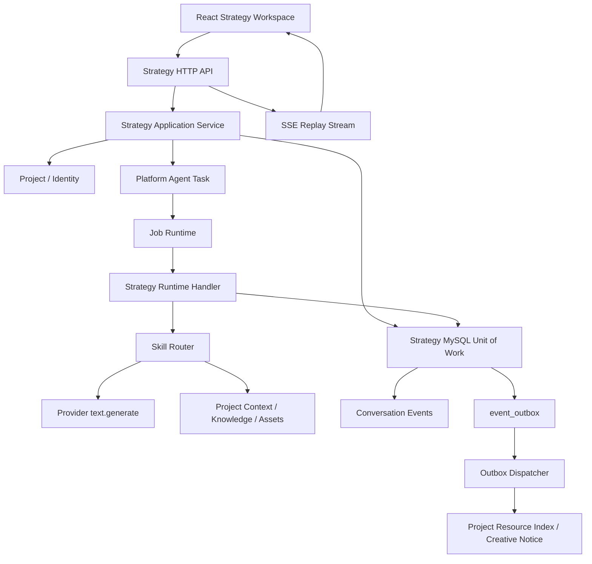
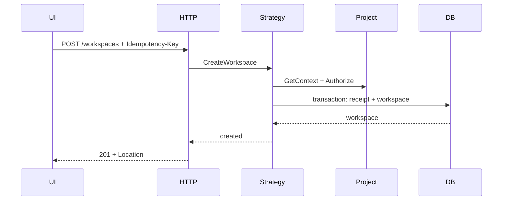
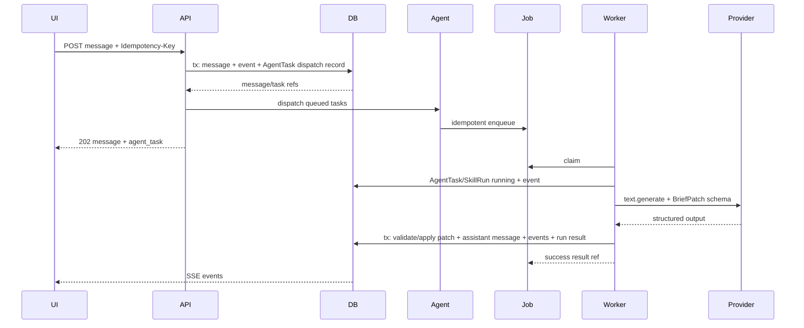

# Strategy 首期完整技术实现方案

> 基线：`cookies-Strategy-Creative并行开发对齐文档-v1.1`（已冻结）
> 配套调研：`docs/research/strategy-mvp-user-experience-and-technical-research.md`
> 目标：实现 Conversation → BriefVersion → StrategyPackage 的前后端生产级纵切片
> 状态：实施方案，已包含反向技术评审修订

## 1. 交付目标

首期完成一条可独立使用、可恢复、可审计、可与 Creative 解耦交接的 Strategy 主链路：

```text
Project
  → StrategyWorkspace
  → Conversation
  → StrategyTask
  → BriefDraft
  → BriefVersion
  → StrategyDraft + Revision
  → StrategyReview
  → StrategyPackageVersion
  → event_outbox
  → 用户显式发送到 Creative
```

完成标准：

- 用户能用自然语言建立广告需求。
- 系统只把通过 Schema 和业务规则校验的字段级 Patch 写入 BriefDraft。
- 用户能查看来源、置信、确认状态和冲突，并确认不可变 BriefVersion。
- 系统基于指定 BriefVersion 异步生成策略。
- 用户能局部修改、查看结构化差异、提交、退回和批准。
- 批准事务原子写入审批证据、StrategyPackageVersion 和 Outbox。
- 刷新、断线、Worker 重启、Provider 重试和部分失败不丢失已确认事实。
- Strategy 在 Creative 不可用时仍可对话、确认、批准、导出和查看版本。

首期默认渠道：

- 小红书图文。

首期明确延期：

- 公众号。
- Word/PDF/Markdown 新上传解析。
- 自动外部研究。
- 多方案比较。
- Skill 运营后台。
- PDF 导出。
- 多 Agent。

## 2. 方案原则

1. **服务端业务事实优先。** React、模型上下文和 SSE 都不是最终事实源。
2. **模型只产出候选 Patch。** 权限、状态机、事实优先级、确认、readiness 和批准由 Go 强制执行。
3. **不可变版本。** BriefVersion、StrategyDraftRevision、Review Candidate 和 StrategyPackageVersion 只追加不覆盖。
4. **异步可恢复。** 长任务进入持久 Job；SSE 只负责增量体验，REST 负责状态校准。
5. **单一结构化策略文档。** 页面、导出和 StrategyPackage 都从同一结构化数据派生，避免正文与机器契约双写漂移。
6. **显式跨模块命令。** Strategy 不创建 CreativeTask；浏览器显式调用 Creative Intake。
7. **先 deterministic，再真实模型。** 先验证领域闭环，再替换 Skill runner 和 Text Provider。
8. **最小公共接线面。** `cmd/cookies-api/main.go`、`web/src/shell/` 和公共 migrations 指定单一 Owner。

## 3. 总体架构



### 3.1 组件职责

| 组件 | 负责 | 不负责 |
| --- | --- | --- |
| React | 对话、Brief/策略编辑、差异、状态和用户动作 | 不批准模型结果，不本地推导业务状态 |
| Strategy HTTP | 解码、认证后的 Project Scope、错误映射、SSE | 不执行广告推理 |
| Strategy Application | 状态机、幂等、版本、readiness、审批事务 | 不硬编码厂商模型 |
| Platform Agent | AgentTask、SkillRun、运行事件、版本血缘 | 不拥有 Brief/Strategy |
| Job Runtime | enqueue、claim、lease、retry、cancel、terminal result | 不理解 Strategy 业务 |
| Skill Router | 选择版本固定的广告 Skill/Playbook | 不直接写领域表 |
| Provider | 文本生成、结构化输出、模型路由和用量 | 不保存唯一对话事实 |
| Strategy MySQL | Strategy 聚合、版本、事件和写入回执 | 不存 Creative 状态 |
| Outbox | 发布事实通知、至少一次投递 | 不创建 Creative 业务对象 |

## 4. 代码与文件结构

### 4.1 契约

```text
api/
  contracts/
    strategy-brief-patch-v1.schema.json
    strategy-brief-version-v1.schema.json
    strategy-draft-v1.schema.json
    strategy-section-patch-v1.schema.json
    strategy-package-v1.schema.json
  events/
    strategy-approved-v1.schema.json
    strategy-superseded-v1.schema.json
  fixtures/
    strategy-brief-patch-v1.json
    strategy-brief-version-v1.json
    strategy-draft-v1.json
    strategy-package-v1.json
  openapi/
    strategy-v1.yaml
```

### 4.2 Platform 前置实现

```text
internal/platform/
  agent/
    model.go
    store.go
    mysql_store.go
    dispatcher.go
    runtime_handler.go
    service.go
    *_test.go
  eventoutbox/
    model.go
    store.go
    mysql_store.go
    dispatcher.go
    consumer.go
    *_test.go
  jobruntime/
    runtime.go                  # 增加取消/进度/查询能力
    mysql_store.go
  provider/
    sync.go                     # 补 invocation/usage/error contract
    adapter_gateway_text.go
    adapter_gateway_text_test.go
  httpserver/
    server.go                   # 增加受认证 DomainMount，不导入 Strategy
```

### 4.3 Strategy 后端

```text
internal/systems/strategy/
  model.go
  errors.go
  ports.go
  workspace.go
  conversation.go
  brief.go
  brief_patch.go
  strategy_draft.go
  review.go
  package.go
  readiness.go
  hash.go
  service.go
  mysql_store.go
  mysql_unit_of_work.go
  runtime_handler.go
  export_markdown.go
  *_test.go
  httpapi/
    server.go
    middleware.go
    handlers_workspace.go
    handlers_conversation.go
    handlers_brief.go
    handlers_strategy.go
    handlers_package.go
    sse.go
    problems.go
    *_test.go
```

### 4.4 Strategy 前端

```text
web/src/features/strategy/
  api.ts
  api.test.ts
  types.ts
  routes.tsx
  StrategyProjectHome.tsx
  StrategyWorkspacePage.tsx
  StrategyWorkspaceNav.tsx
  conversation/
    ConversationPane.tsx
    ConversationMessage.tsx
    MessageComposer.tsx
    SkillRunCard.tsx
    ArtifactCard.tsx
    useConversationStream.ts
  brief/
    BriefInspector.tsx
    BriefField.tsx
    BriefCompleteness.tsx
    BriefConflictResolver.tsx
    BriefConfirmDialog.tsx
  strategy/
    StrategyDocument.tsx
    StrategySection.tsx
    StrategyRevisionDiff.tsx
    StrategyGeneratePanel.tsx
  review/
    StrategyReviewPanel.tsx
    StrategyApproveDialog.tsx
  shared/
    SourceBadge.tsx
    VersionConflictDialog.tsx
    StrategyStateBoundary.tsx
    readSSE.ts
    readSSE.test.ts
  strategy.css
  *.test.tsx
```

## 5. Platform 前置能力

这部分是 Strategy 的硬依赖，未完成前只能使用 fake vertical slice，不能宣称真实 AI/事件链路完成。

### 5.1 AgentTask 与 SkillRun

最小对象：

```go
type AgentTask struct {
    ID             string
    OrganizationID contract.OrganizationID
    ProjectID      contract.ProjectID
    SourceSystem   string
    SourceType     string
    SourceID       string
    Kind           string
    Status         TaskStatus
    JobID          string
    Version        int64
    InputSnapshot  json.RawMessage
    ResultRef      *contract.ResourceRef
    Error          *contract.JobError
    CreatedAt      time.Time
    UpdatedAt      time.Time
}

type SkillRun struct {
    ID             string
    AgentTaskID    string
    SkillName      string
    SkillVersion   string
    PlaybookName   string
    PlaybookVersion string
    Status         SkillRunStatus
    InputHash      string
    OutputRef      *contract.ResourceRef
    ProviderCode   string
    ModelAlias     string
    ModelVersion   string
}
```

状态：

```text
AgentTask / SkillRun:
queued → running → succeeded
                 ↘ partially_succeeded
                 ↘ failed
                 ↘ cancelled
```

约束：

- 一个任务固定 Skill/Playbook 版本。
- InputSnapshot 只保存授权引用和必要摘要，不复制无关敏感资料。
- AgentTask 是用户可见运行对象；platform_jobs 是执行机制，二者不可合并为一个业务状态。
- Runtime Handler 必须把 Job 失败映射回 AgentTask/SkillRun，不能只让 platform_jobs 进入 failed。

### 5.2 AgentTask 与 Job 的可靠入队

当前 `jobruntime.Enqueue` 自己执行 SQL，无法加入 Strategy 的消息事务。如果采用“先写消息、再入队”，进程在两者之间崩溃会留下永远不运行的消息。

采用以下方案：

1. 在保存用户消息的同一 MySQL 事务中创建 `platform_agent_tasks`，预生成稳定 job_id，状态为 queued，`enqueued_at=NULL`。
2. 事务提交后立即调用 Agent Dispatcher。
3. Dispatcher 扫描 `enqueued_at IS NULL` 的任务，以稳定 job_id、idempotency key 和 request hash 调用 `jobruntime.Enqueue`。
4. 入队成功后设置 `enqueued_at`。
5. 如果第 3 步成功、第 4 步失败，下一次重复 enqueue 返回原 Job，再补写 `enqueued_at`。
6. 独立恢复循环持续扫描，保证进程崩溃后最终入队。

这不是内存回调；`platform_agent_tasks` 本身是持久 dispatch inbox。

### 5.3 Job Runtime 增量

当前实现需要补充：

- `Get(jobID)`。
- `UpdateProgress(claim, progress)`。
- `RequestCancel(jobID, expectedVersion)`。
- queued Job 直接进入 cancelled。
- running Job 设置 `cancel_requested_at`，Runtime Handler 在安全检查点取消 context。
- `Worker` 捕获 panic，转换为稳定错误，并执行任务状态同步钩子。
- 超过 attempt limit 后同步 AgentTask terminal state。

取消语义：

- queued：保证不再执行。
- running、模型请求尚未发出：保证取消。
- running、模型请求已发出：best effort；忽略晚到结果，不写 Brief/Strategy。
- 已提交领域结果：不能把成功回滚成 cancelled。

### 5.4 Event Outbox

共享表：

```text
event_outbox
  event_id PK
  organization_id
  project_id
  event_type
  subject_type
  subject_id
  subject_version
  payload JSON
  trace_id
  status
  attempt_count
  available_at
  locked_at
  lock_owner
  published_at
  last_error
  created_at

event_consumptions
  consumer_name
  event_id
  status
  processed_at
  error_code
  PRIMARY KEY (consumer_name, event_id)
```

首期 Publisher：

- 同进程 consumer registry。
- 持久消费记录。
- 至少一次投递。
- 后续可替换为消息中间件 Publisher，不改变 Strategy 事务。

### 5.5 生产 Text Provider

现有 `provider.Service.GenerateText` 和 fake adapter 可复用，但需要：

- 为 `TextAdapterRequest` 增加 invocation_id、idempotency_key、timeout、trace metadata。
- 为返回值增加 provider_request_id、finish_reason、usage、latency。
- `adapter_gateway_text` 通过逻辑别名选择路由，不在 Strategy 写厂商模型 ID。
- 支持严格 JSON Schema；不支持时返回 capability mismatch，不静默降级成自由文本。
- Provider 响应大小、超时和错误统一限制。
- 密钥只存在 Adapter Gateway 配置，不进入浏览器、Agent 输入和 Strategy 表。

配置建议：

```text
COOKIES_TEXT_ADAPTER=fake|adapter_gateway
COOKIES_TEXT_MODEL_ALIAS=cookies.text.strategy.standard
COOKIES_TEXT_TIMEOUT=120s
```

首期不直接从浏览器暴露 `/platform/v1/model/invocations`；Strategy Worker 在进程内调用 Provider 应用接口。

### 5.6 HTTP Domain Mount

当前 `internal/platform/httpserver` 有认证、request_id、trace_id 和统一 Problem，但只注册 Platform 路由。

增加通用挂载 seam：

```go
type DomainMount struct {
    Pattern string
    Handler http.Handler
}

type Dependencies struct {
    // existing fields...
    AuthenticatedDomainMounts []DomainMount
}
```

规则：

- Platform Server 只依赖 `http.Handler`，不导入 Strategy 包。
- DomainMount 自动经过 request_id、trace_id 和 authentication。
- Strategy Handler 自己执行 strategy scope 和 Project membership 校验。
- Pattern 首期固定 `/api/strategy/v1/`。
- Domain handler 不得注册 `/platform/` 或 `/api/creative/`。

## 6. Strategy 领域模型

### 6.1 StrategyWorkspace

```text
active → archived
```

字段：

- id、organization_id、project_id。
- name、is_primary。
- status、version。
- created_by、created_at、updated_at。

规则：

- 一个 Project 最多一个 active primary workspace。
- archived workspace 只读；恢复需显式 unarchive 动作，首期可不提供。

### 6.2 Conversation

```text
open ↔ waiting_user → closed
```

Conversation 只表示消息生命周期，不承载 AgentTask、Brief 或审批状态。

Message：

- append-only。
- role：user/assistant/system_event。
- content_type：text/business_card/error_notice。
- AI 消息保存 ai_generated、agent_task_id、skill_run_ids。
- 用户消息一旦被任务消费不允许原地修改；纠正通过新消息或 Brief Patch。

### 6.3 StrategyTask

这是用户可见的“本次需求整理任务”，对应冻结 API 中的 `/tasks/{id}`；它不是 AgentTask。

```text
active ↔ waiting_user → ready_to_confirm → completed
       ↘ cancelled
```

关联：

- workspace_id。
- conversation_id。
- brief_id。
- current_agent_task_id。

### 6.4 Brief

Brief 是稳定 aggregate，Draft 和 Version 是不同资源。

BriefDraft：

```text
open → confirmed
open → superseded
```

可变字段：

- version：每次成功 Patch +1。
- document：结构化 Brief。
- field_states：字段血缘、候选值、置信和确认状态。
- completeness：字段组状态、blockers、warnings。
- base_brief_version。

BriefVersion：

- 完整快照。
- 不可变。
- content_hash。
- confirmed_by/at。
- source Draft ID/version。

### 6.5 字段 Patch

不采用开放 JSON Patch，采用受限业务 Patch：

```json
{
  "contract_version": "strategy-brief-patch/v1",
  "base_version": 7,
  "operations": [
    {
      "op": "set",
      "field_path": "audience.primary",
      "value": "制造企业研发负责人",
      "source": {
        "type": "conversation_message",
        "id": "msg_01",
        "locator": "text:12-23"
      },
      "confidence": "high",
      "confirmation": "unconfirmed"
    }
  ],
  "questions": [],
  "warnings": []
}
```

服务端维护 field_path allowlist 和类型表。模型不得：

- 修改 ID、version、organization_id、project_id。
- 把 AI 建议直接设为 confirmed。
- 覆盖用户已确认值。
- 删除阻断项证据。
- 写入未授权来源引用。

事实优先级：

```text
用户明确确认
  > 用户直接输入、未确认
  > 授权结构化资料
  > AI 从资料提取
  > AI 建议
```

低优先级候选与当前值冲突时记录 conflict，不覆盖当前值。

### 6.6 StrategyDraft

StrategyDraft 是可变 aggregate；每次生成或修改产生不可变 revision。

```text
draft → generating → ready_for_review → approved
                    ↘ failed
                    ↘ cancelled
ready_for_review → returned → draft
```

StrategyDraft 固定绑定：

- brief_id + brief_version。
- project_context_version。
- Skill/Playbook 版本集合。

StrategyDraftRevision 保存：

- revision number。
- 完整 `strategy-draft/v1` document。
- changed_sections。
- base_revision。
- content_hash。
- lineage。

策略结构只保存一个结构化 document：

- objective。
- audience。
- proposition。
- channel_strategy。
- creative_recommendations。
- constraints。
- budget_and_cadence。
- experiment_matrix。
- measurement。
- assumptions_and_gaps。
- lineage。

React 渲染、Markdown 导出和 StrategyPackage 都从该 document 派生。

### 6.7 Review

```text
open → returned
open → approved
open → invalidated
```

Review 绑定：

- strategy_id。
- candidate_revision。
- candidate_content_hash。
- brief_id/version。
- project_context_version。

候选 revision 变化或关键上游版本变化时，旧 Review 进入 invalidated，不能批准。

### 6.8 StrategyPackage

```text
published → superseded → archived
```

- package_id 是稳定系列 ID。
- package_version 每次批准递增。
- package version 不可变。
- 新版本不会修改旧版本。
- StrategyPackage Snapshot 是跨模块唯一完整读取对象。

发布阻断与消费者 readiness 分开：

| 类型 | 含义 |
| --- | --- |
| publish blocker | Schema 无效、硬合规未解决、审批权限不足、候选版本过期；阻止批准 |
| creative readiness | 创作所需信息是否完整；可以为 false |
| delivery readiness | 预算、排期和投放信息是否完整；可以为 false |
| insights readiness | 衡量目标和数据引用是否完整；可以为 false |

## 7. 数据库设计

### 7.1 Platform migrations

```text
migrations/platform/
  <ts>_agent_tasks_and_skill_runs.up.sql
  <ts>_job_cancellation_and_progress.up.sql
  <ts>_event_outbox.up.sql
```

表：

| 表 | 核心键与索引 |
| --- | --- |
| platform_agent_tasks | PK id；org/project/source；job_id unique；status+updated_at |
| platform_skill_runs | PK id；agent_task_id；skill_name/version；status |
| event_outbox | PK event_id；status+available_at；org+subject+version |
| event_consumptions | PK consumer_name+event_id |

### 7.2 Strategy migrations

```text
migrations/strategy/
  <ts>_strategy_workspace_conversation.up.sql
  <ts>_strategy_brief.up.sql
  <ts>_strategy_draft_review_package.up.sql
```

表：

| 表 | 关键字段 | 可变性 |
| --- | --- | --- |
| strategy_workspaces | org/project/id、primary、status、version | 可变 |
| strategy_conversations | workspace、status、summary_ref、version | 可变 |
| strategy_messages | conversation、role、content、agent refs | 追加 |
| strategy_conversation_events | global sequence、event_id、conversation、payload | 追加 |
| strategy_tasks | workspace/conversation/brief、status、version | 可变 |
| strategy_briefs | stable brief_id、latest draft/version | 可变索引 |
| strategy_brief_drafts | document、field_states、completeness、version | 可变 |
| strategy_brief_revisions | draft version、patch、snapshot hash | 追加 |
| strategy_brief_versions | brief version、snapshot、hash、confirmed evidence | 不可变 |
| strategy_drafts | brief ref、status、current revision、version | 可变 |
| strategy_draft_revisions | revision、document、hash、lineage | 不可变 |
| strategy_reviews | candidate revision/hash、status、decision evidence | 追加状态 |
| strategy_review_comments | review、author、body | 追加 |
| strategy_packages | stable package_id、latest_version、status | 可变索引 |
| strategy_package_versions | package version、snapshot、hash、review ref | 不可变 |
| strategy_write_receipts | operation+principal+idempotency key、request hash、result ref | 追加 |

所有 tenant-scoped 表：

- organization_id 是索引和唯一约束的前导列。
- project_id 非空。
- 资源读取 SQL 必须同时使用 organization_id + project_id + id。
- 外键优先使用同 org/project 的复合键。
- 时间使用 UTC `DATETIME(6)`。
- ID 使用现有 `ids.New(prefix)`。
- 不创建 destructive down migration；迁移只向前。

### 7.3 JSON 存储规则

- JSON document 写入前必须通过对应 Go validator 和 JSON Schema fixture test。
- 当前 document 与 append-only revision 在同一事务写入。
- 查询列表需要的 status、version、readiness summary 单独列出，不依赖 JSON 全表扫描。
- JSON 单对象首期限制 1 MiB。
- Message 文本限制 64 KiB。
- SSE event payload 不携带完整 Brief/Strategy，只携带引用和摘要。

### 7.4 幂等回执

`strategy_write_receipts` 唯一键：

```text
(organization_id, project_id, principal_kind, principal_id, operation_name, idempotency_key)
```

行为：

- 同键同 request hash：返回原 result ref/response snapshot。
- 同键不同 request hash：`IDEMPOTENCY_CONFLICT`。
- confirm/approve 回执与产物同生命周期保留。
- 普通 create/message 回执至少保留 90 天。

## 8. 内容哈希规范

当前 `contract.CanonicalJSONHash` 返回 64 位 hex，不带 `sha256:` 前缀；冻结 Fixture 示例带前缀。为避免跨实现不一致：

1. Go 内部统一返回 raw hex。
2. 跨模块契约统一序列化为 `sha256:<64-lowercase-hex>`。
3. 增加 `contract.ContentHash` 类型负责 parse/format/validate。
4. 请求幂等 hash 继续使用 raw hex，不改变现有表。

StrategyPackage 的 `approval.content_hash` 存在自引用问题，固定 preimage：

```text
clone package snapshot
→ 删除 approval.content_hash 字段
→ RFC 8785 JCS
→ SHA-256
→ 格式化为 sha256:<hex>
→ 写回 approval.content_hash
```

验证：

```text
读取 approval.content_hash
→ 删除该字段
→ 重新计算
→ constant-time compare
```

以下内容必须共用一组 golden vectors：

- Go producer。
- JSON Fixture。
- Strategy package reader。
- Creative adapter。
- Event `content_hash`。

## 9. 后端应用流程

### 9.1 创建 Workspace



### 9.2 发送消息和运行 Brief Skill



运行幂等：

- SkillRun ID 是领域应用幂等键。
- Worker 重跑时如果该 SkillRun 已成功，直接返回原 result ref。
- Provider 成功、领域事务失败时允许重新调用；若 Provider 支持 idempotency，复用 invocation key。
- 领域事务成功、Job terminal write 失败时，重跑不会重复应用 Patch。

### 9.3 Confirm Brief

同一事务：

1. 读取并锁定 BriefDraft。
2. 校验 expected_version。
3. 重新计算 completeness，不信任请求体。
4. 校验 blockers 和用户确认。
5. 生成 immutable snapshot 和 hash。
6. 插入 BriefVersion。
7. Draft 标记 confirmed。
8. StrategyTask 标记 completed。
9. 写入 idempotency receipt 和 conversation event。

### 9.4 生成 Strategy

- 请求只接受 brief_id + brief_version，不接受“latest”。
- 创建 StrategyDraft、revision 0/generating、AgentTask。
- Worker 使用 BriefVersion、固定 ProjectContextVersion 和固定 Skill versions。
- Structured Output 通过 `strategy-draft/v1` Schema 后写 revision 1。
- 失败时 StrategyDraft 进入 failed，但 BriefVersion 保持可用，可重新生成新 Draft。

### 9.5 修改 Strategy

两种入口共用一个服务：

- 用户结构化修改：直接生成 section patch。
- 用户自然语言修改：创建 `strategy.strategy.revise.v1` AgentTask，由 Skill 输出 section patch。

应用前校验：

- expected_version。
- base_revision。
- 允许修改的 section。
- patch 后完整文档 Schema。
- hard compliance。

成功后：

- 插入新 revision。
- 更新 current_revision/version。
- 返回 changed sections 和逐字段 old/new diff。

### 9.6 Submit / Return / Approve

Submit：

- 固化 candidate revision/hash。
- 创建 open Review。
- StrategyDraft → ready_for_review。

Return：

- Review → returned。
- StrategyDraft → returned，再显式进入 draft。
- 不修改 candidate revision。

Approve 同一事务：

1. 锁定 Review、StrategyDraft、package series。
2. 校验 approve scope。
3. 校验 Review open、candidate hash 未变化。
4. 校验 BriefVersion 和 ProjectContextVersion。
5. 重新计算 publish blockers/readiness。
6. 构造 StrategyPackage Snapshot。
7. 计算 package content hash。
8. 插入 StrategyPackageVersion。
9. Review → approved；StrategyDraft → approved。
10. 旧 package version → superseded（如存在）。
11. 插入 `strategy.approved.v1` 和可选 `strategy.superseded.v1` Outbox。
12. 插入 idempotency receipt。

事务提交后 dispatcher 发布，不反向调用 Creative。

## 10. HTTP API

### 10.1 路由约定

服务端资源路径遵循冻结命名空间：

```text
/api/strategy/v1
```

前端 canonical route 显式携带 Project，解决刷新、分享链接和 Project 切换歧义：

```text
/strategy/projects/:projectId
/strategy/projects/:projectId/workspaces
/strategy/projects/:projectId/workspaces/:workspaceId/conversation
/strategy/projects/:projectId/workspaces/:workspaceId/brief
/strategy/projects/:projectId/workspaces/:workspaceId/strategy
/strategy/projects/:projectId/workspaces/:workspaceId/review
```

旧文档中的 `/strategy/workspaces/:workspaceId/*` 可在解析 workspace 后重定向到 canonical route。

### 10.2 权限 Scope

| Scope | 能力 |
| --- | --- |
| `strategy.read` | 读取 workspace、conversation、Brief、Strategy、Review |
| `strategy.write` | 创建 workspace/conversation/message，编辑 Draft |
| `strategy.confirm` | 确认 Brief |
| `strategy.review` | 提交、评论和退回 Review |
| `strategy.approve` | 批准 StrategyPackage |
| `strategy.package.read` | 服务或用户读取不可变发布包 |

每次请求同时要求：

- Actor 属于 organization。
- Actor 是目标 Project 的 active member。
- Actor 拥有对应 Strategy scope。

不能从 body 接收或覆盖 organization_id。资源路径未带 project_id 时，服务端先读取资源的 project_id，再执行 Project authorization；未授权和不存在不能泄露跨租户对象信息。

### 10.3 Workspace 与 Conversation

| Method | Path | 结果 | 约束 |
| --- | --- | --- | --- |
| POST | `/workspaces` | 201 Workspace | body project_id/name；Idempotency-Key |
| GET | `/projects/{project_id}/workspaces` | 200 paged list | status/cursor/limit |
| GET | `/workspaces/{workspace_id}` | 200 detail | Project Scope |
| POST | `/conversations` | 201 Conversation + Task | workspace_id/project_id；幂等 |
| GET | `/conversations/{id}` | 200 Conversation | 不默认返回全部消息 |
| GET | `/conversations/{id}/messages` | 200 paged messages | cursor/limit |
| POST | `/conversations/{id}/messages` | 202 Message + AgentTask | Idempotency-Key |
| GET | `/conversations/{id}/events` | `text/event-stream` | Last-Event-ID |
| POST | `/agent-tasks/{id}:cancel` | 202/200 | expected_version |
| GET | `/agent-tasks/{id}` | 200 runtime summary | 只暴露业务安全字段 |

### 10.4 Brief

| Method | Path | 结果 | 约束 |
| --- | --- | --- | --- |
| GET | `/tasks/{id}/brief-draft` | 200 BriefDraft | ETag |
| PATCH | `/tasks/{id}/brief-draft` | 200 updated Draft | If-Match 或 expected_version；幂等 |
| GET | `/briefs/{brief_id}/versions` | 200 version list | cursor |
| GET | `/briefs/{brief_id}/versions/{version}` | 200 immutable snapshot | private cache/ETag |
| POST | `/tasks/{id}/brief:confirm` | 201 BriefVersion | Idempotency-Key、expected_version |

人工 PATCH body：

```json
{
  "expected_version": 7,
  "operations": [
    {
      "op": "set",
      "field_path": "audience.primary",
      "value": "制造企业研发负责人"
    }
  ]
}
```

服务端自动补齐 source=user_edit、updated_by 和 confirmation；客户端不能伪造操作者。

### 10.5 Strategy 与 Review

| Method | Path | 结果 | 约束 |
| --- | --- | --- | --- |
| POST | `/tasks/{id}/strategies` | 202 StrategyDraft + AgentTask | brief_id/version；幂等 |
| GET | `/strategy-drafts/{id}` | 200 current Draft | ETag |
| GET | `/strategy-drafts/{id}/revisions` | 200 revisions | cursor |
| GET | `/strategy-drafts/{id}/revisions/{revision}` | 200 immutable | revision 固定 |
| PATCH | `/strategy-drafts/{id}` | 200 new revision | expected_version/base_revision |
| POST | `/strategy-drafts/{id}:revise` | 202 AgentTask | 自然语言修改 |
| POST | `/strategy-drafts/{id}:submit` | 201 Review | 幂等 |
| POST | `/strategy-reviews/{id}/comments` | 201 Comment | append-only |
| POST | `/strategy-reviews/{id}:return` | 200 Review | reason required |
| POST | `/strategy-drafts/{id}:approve` | 201 PackageVersion | review_id/hash；幂等 |

### 10.6 Package

| Method | Path | 结果 | 约束 |
| --- | --- | --- | --- |
| GET | `/projects/{project_id}/strategy-packages` | 200 version index | Project Scope |
| GET | `/projects/{project_id}/strategy-packages/{package_id}/versions/{version}` | 200 immutable package | `strategy.package.read` |
| GET | `/projects/{project_id}/strategy-packages/{package_id}/versions/{version}/export.md` | Markdown download | 指定版本 |

Package response：

- `Cache-Control: private, no-cache`，允许 conditional GET。
- ETag 使用 package content hash。
- package_id/version/project_id 与 snapshot 内部字段必须一致。

### 10.7 状态码和错误码

| HTTP | Error code | 场景 |
| --- | --- | --- |
| 400 | `INVALID_REQUEST` | Schema、header 或字段错误 |
| 401 | `UNAUTHENTICATED` | 无身份 |
| 403 | `SCOPE_REQUIRED` / `PROJECT_ACCESS_DENIED` | 无权限 |
| 404 | `RESOURCE_NOT_FOUND` | 范围内不存在 |
| 409 | `IDEMPOTENCY_CONFLICT` | 同键不同请求 |
| 409 | `INVALID_STATE` | 非法状态转换 |
| 409 | `BRIEF_BLOCKED` | Brief 无法确认 |
| 409 | `REVIEW_STALE` | candidate/hash 已变化 |
| 409 | `PROJECT_CONTEXT_STALE` | 上游版本不一致 |
| 412 | `VERSION_CONFLICT` | If-Match/expected_version 失败 |
| 422 | `MODEL_OUTPUT_INVALID` | 模型输出未通过 Schema/业务规则 |
| 429 | `TASK_CONCURRENCY_LIMIT` | 项目运行任务过多 |
| 503 | `PROVIDER_UNAVAILABLE` | 模型服务不可用 |

Problem details 必须提供可展示字段：

```json
{
  "error": {
    "code": "BRIEF_BLOCKED",
    "message": "Brief 还有必须解决的信息。",
    "request_id": "req_...",
    "retryable": false,
    "details": [
      {"field": "audience.primary", "reason": "核心受众未确认"}
    ]
  }
}
```

内部 SQL、Prompt、Provider 原始错误不返回浏览器。

## 11. SSE 与恢复

### 11.1 持久事件

事件类型：

```text
message.accepted
agent_task.queued
agent_task.running
skill_run.started
brief.patch_applied
brief.conflict_detected
assistant.message_created
agent_task.partially_succeeded
agent_task.succeeded
agent_task.failed
agent_task.cancelled
strategy.revision_created
review.created
package.published
```

每条事件：

- event_id。
- global sequence。
- conversation_id。
- occurred_at。
- payload summary。
- request_id/trace_id。

### 11.2 重连协议

- SSE `id:` 使用 event_id。
- 服务端通过 event_id 找到 sequence，只发送更大的 sequence。
- 前端收到事件后按 event_id 去重。
- 事件保留 90 天。
- Last-Event-ID 已过期时返回 `410 EVENT_CURSOR_EXPIRED`。
- 前端收到 410 后重新 GET conversation、messages、Brief 和 Strategy，再建立新 stream。
- 每 15 秒 heartbeat comment，避免代理空闲关闭。
- SSE 失败时前端退化为 5 秒 polling；SSE 恢复后停止 polling。

前端使用 `fetch` + `ReadableStream` 读取 SSE，而不是原生 `EventSource`：

- 可以复用现有认证 header/cookie 策略。
- 可以读取 `410` 和标准 Problem body。
- 可以显式携带 Last-Event-ID。
- parser 只实现标准 `id/event/data/retry`，并使用固定 fixture 做分块、跨 chunk 和多行 data 测试。
- 不使用 query string 传递访问令牌。

SSE 不是事实源。以下时机必须 REST 校准：

- 首次进入。
- 重连。
- terminal task event。
- tab 从后台恢复。
- 版本冲突后。

## 12. 前端实现

### 12.1 路由与 Shell

修改：

- `web/src/shell/Workspace.tsx`
- `web/src/shell/modules.ts`
- `web/src/App.tsx`

要求：

- Project 切换保留当前模块；在 Strategy 中切换 Project 后进入 `/strategy/projects/{id}`，不能跳到 Assets。
- `/strategy` 在有 Project 时重定向到选中的 Project；无 Project 显示创建 Project 引导。
- 工作区详情使用嵌套路由。
- URL 是 Project 和工作区选择的恢复来源，不另建只存在内存的全局选择。

### 12.2 页面布局

Workspace 主页面：

```text
┌──────────────────────────────────────────────────────────────────┐
│ Project / Workspace / 阶段 / 任务状态                            │
├──────────────┬─────────────────────────────┬─────────────────────┤
│ 工作区流程   │ 对话或策略主工作区          │ Brief/依据/评审     │
│ 200–220px    │ min 55%                     │ 340–420px，可收起   │
├──────────────┴─────────────────────────────┴─────────────────────┤
│ 当前任务相关的固定操作区                                        │
└──────────────────────────────────────────────────────────────────┘
```

响应式：

- ≥1280px：三段布局，但主区至少 55%。
- 900–1279px：流程栏收窄，右侧 Inspector 变抽屉。
- <900px：首期只保证只读和对话基本操作；复杂差异提示使用桌面端。

### 12.3 前端状态策略

首期不新增全局状态库。

- URL：Project/workspace/tab。
- Server facts：feature hooks + `apiRequest`。
- Conversation 聚合：`useReducer`，事件按 event_id 去重。
- 表单临时值：组件 state。
- 未发送消息草稿：按 conversation_id 存 localStorage。
- localStorage 内容永不自动成为已确认事实。

每次写入：

1. 生成 Idempotency-Key 并在请求完成前稳定保存。
2. 禁止重复点击。
3. 成功后使用响应资源，不用本地猜测 version。
4. 网络结果未知时，用同一 Idempotency-Key 重试。

当前 `apiRequest` 需要增强：

- 暴露 response headers/ETag 的 `apiRequestWithMeta`。
- 支持 `412` 的 typed `ApiProblem`。
- 保留 request ID 供错误 UI 展示。
- 写请求明确设置 Idempotency-Key。

### 12.4 Conversation

`ConversationPane`：

- 初次加载 GET Conversation + Messages。
- 建立 SSE。
- 消息发送后立即显示 server 返回的 accepted Message，不创建虚假 assistant placeholder。
- SkillRunCard 展示目的、状态、读取范围、结果和恢复动作。
- AI 完成后使用 `assistant.message_created` 引用拉取最终消息。
- 同一 AgentTask 的事件折叠为一张运行卡。

`MessageComposer`：

- 64 KiB 前端限制。
- Enter 发送，Shift+Enter 换行。
- 发送失败保留输入。
- 显示“已保存/正在运行/等待用户”。
- cancel 只对当前 cancellable task 展示。

### 12.5 Brief Inspector

字段组：

- 基本信息。
- 业务目标。
- 受众。
- 产品价值。
- 内容与渠道。
- 创意要求。
- 合规。
- 预算与排期。
- 转化与指标。
- 参考资料。

字段显示：

- 当前值。
- confirmation。
- source badge。
- confidence。
- conflict count。
- last updated。

编辑：

- blur 或 800ms debounce 后 PATCH。
- 一次只提交变更字段。
- If-Match 携带最后 ETag。
- 保存中、已保存、失败和冲突状态可见。

版本冲突：

- 自动 GET 最新 Draft。
- 对当前编辑字段展示“我的值 / 服务端值 / 来源”。
- 用户选择覆盖、接受服务端或取消。
- 不自动覆盖用户输入。

确认：

- BriefConfirmDialog 重新显示 blockers、warnings 和 assumptions。
- 点击确认时发送 expected_version。
- 成功后 Draft 只读，跳转到固定 BriefVersion 视图。

### 12.6 Strategy Document

- 不使用 contenteditable。
- 每个结构化 section 有查看态和编辑态。
- 简单字符串/数组使用 input/textarea/tag editor。
- 复杂 experiment/measurement 使用结构化行编辑。
- 保存产生新 revision，不原地修改历史。
- revision diff 从服务端返回 field path + old/new，前端只负责渲染。

自然语言修改：

- 输入修改意图。
- 先显示预计影响 section。
- 用户确认后创建异步 revise task。
- 新 revision 完成后展示 diff，再继续编辑或提交。

### 12.7 Review

Review Panel：

- candidate revision/hash。
- BriefVersion 和 ProjectContextVersion。
- publish blockers。
- Creative/Delivery/Insights readiness。
- comments timeline。
- return reason。
- approve action。

批准弹层：

- 不能只显示“确定吗”。
- 展示 package 将固定的版本、警告和下游行为。
- 提交后禁用重复操作。
- 结果未知时用相同 Idempotency-Key 查询/重试。

### 12.8 前端可访问性

- 所有状态不只依赖颜色。
- 新 SSE 消息使用适度 `aria-live`，运行进度不逐 token 播报。
- Dialog 管理焦点并支持 Escape。
- Field error 与输入通过 `aria-describedby` 关联。
- diff 同时提供“新增/删除/修改”文字。
- prefers-reduced-motion 下禁用非必要动画。

## 13. Skill 与模型实现

### 13.1 首期 Skill

```text
brief-intake/v1
brand-context/v1
audience-insight/v1
strategy-planner/v1
channel-strategy/v1
  └─ xiaohongshu-image-text/v1
compliance-review/v1
brief-strategy-export/v1
```

实际执行建议分两条受控 pipeline：

Brief pipeline：

```text
brief-intake
  → brand-context（需要时）
  → audience-insight（需要时）
  → compliance-review（确认前）
```

Strategy pipeline：

```text
strategy-planner
  → channel-strategy/xiaohongshu-image-text
  → compliance-review
  → package validator
```

首期由单 Agent 顺序编排。只有评测证明单 Agent 的 Skill 选择持续失败时，才考虑多 Agent。

### 13.2 Prompt 输入

每次只提供：

- 当前用户消息。
- Conversation 可审计摘要。
- 当前 Brief 的相关字段，不默认发送全历史。
- 固定 ProjectContextVersion 引用。
- 允许读取的品牌/产品/Asset references。
- 当前任务允许的 Skills/Tools。
- 明确的输出 Schema。

外部资料和用户内容放在标记清晰的数据区，不允许其中指令修改 system policy、权限或输出 Schema。

### 13.3 输出校验

四层：

1. JSON 解析。
2. JSON Schema。
3. 领域 allowlist/type/source/priority。
4. 状态机和 Project Scope。

受限修复：

- 只允许对“格式可修复但语义未改变”的输出重试一次。
- 第二次仍失败进入 `MODEL_OUTPUT_INVALID`。
- 不让模型自行决定绕过字段或 blockers。

### 13.4 模型版本与灰度

- 使用逻辑 alias。
- SkillRun 保存实际 provider/model version。
- 新模型先跑固定 eval，再按 organization allowlist canary。
- 运行中的 AgentTask 不切换 Skill 或模型 snapshot。
- 回滚只影响新任务。

## 14. 可观测性与数据安全

### 14.1 日志与 Trace

所有日志关联：

- request_id。
- trace_id。
- organization_id。
- project_id。
- workspace/conversation/task。
- agent_task_id。
- skill_run_id。
- provider invocation ID。

不记录：

- 完整 Prompt。
- 用户敏感原文。
- Provider 密钥。
- 未脱敏外部文档内容。

允许记录：

- 输入/输出 hash。
- 字段路径。
- 状态转换。
- token/latency/cost。
- 稳定错误码。

### 14.2 指标

- API request/latency/error by operation。
- Job queue wait/run/retry/recovery/cancel。
- Skill success/partial/failure/P95。
- Provider latency/token/cost/schema-invalid。
- Brief time-to-confirm、turn count、conflict count、repeated-question rate。
- Strategy generate/return/approve。
- Outbox lag/retry/dead-letter。
- SSE active/reconnect/cursor-expired/polling fallback。

### 14.3 并发和成本护栏

首期默认：

- 每 Project 最多 3 个 running AgentTask。
- 每用户每 Conversation 最多 1 个 brief-intake running。
- Strategy generate/revise 对同一 Draft 串行。
- 单模型请求超时 120 秒。
- AgentTask 最多 2 次 Provider attempt。
- 单任务 token/cost 超限进入 waiting_user/admin，不自动无限重试。

## 15. 测试方案

### 15.1 Go 单元测试

- 每个领域状态转换。
- Brief field priority/conflict。
- completeness、publish blockers 和三类 readiness。
- section patch 和 diff。
- package hash golden vectors。
- Idempotency-Key 同请求/不同请求。
- stale expected_version。
- Review invalidation。
- Worker 重放不重复应用。

### 15.2 Go integration tests

MySQL：

- migration from empty database。
- tenant/project isolation。
- message + AgentTask dispatch atomicity。
- dispatcher crash/replay。
- Job lease recovery/cancel。
- Brief confirm transaction。
- approve package + review + outbox transaction。
- duplicate/乱序 event consumption。
- package immutable read。

HTTP：

- auth/scope/project。
- unknown JSON fields。
- body size。
- ETag/If-Match。
- SSE replay/cursor expiry。
- Problem details 不泄露内部错误。

### 15.3 Contract tests

- Schema compile。
- 所有 Fixture validate。
- Go types → JSON → Schema。
- package producer/reader hash equality。
- OpenAPI lint。
- StrategyPackageReader 同进程/HTTP implementation 跑同一 suite。
- Creative fixture adapter smoke。

### 15.4 Frontend tests

Vitest + Testing Library：

- empty/loading/error/no permission。
- send message and preserve failed input。
- Skill partial failure/retry。
- Brief edit/autosave。
- field conflict。
- confirm blockers。
- Strategy diff。
- stale review。
- approve result unknown。
- SSE duplicate/reconnect/polling fallback。
- accessibility roles/focus。

### 15.5 E2E

增加 Playwright Chromium happy path，后端使用 deterministic Skill runner：

```text
进入 Project
→ 创建 Workspace
→ 发送需求
→ Brief Patch
→ 修正字段
→ 确认 Brief
→ 生成 Strategy
→ 修改 section
→ 提交/批准
→ 查看 Package
→ 刷新恢复
```

故障 E2E：

- Worker 在 Provider 返回后、领域提交前停止。
- Worker 在领域提交后、Job succeed 前停止。
- SSE 断开并重连。
- 两个 tab 同时编辑同一 Brief。
- approve response 丢失后用同一 key 重试。

## 16. CI 与发布门禁

扩展 `web/package.json`：

- `contract:check` 编译 contracts/events 并 lint platform + strategy OpenAPI。
- `check` 保持 lint + test + build。
- 可选 `e2e`。

扩展 `.github/workflows/platform-ci.yml`：

- JSON Schema/Fixture 校验。
- Strategy MySQL integration tests。
- Package hash golden vectors。
- deterministic Strategy E2E。

每次提交前：

```powershell
git diff --check
gofmt -w <本次修改的 Go 文件>
go vet ./...
go test -race ./...
npm.cmd run check --prefix web
npm.cmd run contract:check --prefix web
```

推送后：

- 使用 `gh pr checks` 监控最新 commit。
- 必需检查全部通过前不算完成。
- 不通过删除、跳过或弱化检查来“修复”CI。

## 17. 分阶段实施与 PR 拆分

### PR 0：契约和哈希

文件：

- `api/contracts/*strategy*`
- `api/events/strategy-*`
- `api/fixtures/*strategy*`
- `api/openapi/strategy-v1.yaml`
- `internal/platform/contract/content_hash.go`
- contract tests

出口：

- Fixture、Schema、OpenAPI 和 package hash golden vectors 全部通过。
- Creative 可独立基于 Fixture 开发。

### PR 1：Platform Agent/Job 前置

文件：

- `migrations/platform/*agent*`
- `internal/platform/agent/*`
- `internal/platform/jobruntime/*`

出口：

- AgentTask 可可靠 dispatch 到 Job。
- Job 支持查询、进度、取消和恢复。
- crash replay 测试通过。

### PR 2：Outbox 与 Domain Mount

文件：

- `migrations/platform/*outbox*`
- `internal/platform/eventoutbox/*`
- `internal/platform/httpserver/*`

出口：

- authenticated Strategy handler 可挂载。
- Outbox 至少一次投递和消费幂等通过。

### PR 3：Text Provider

文件：

- `internal/platform/provider/sync.go`
- `internal/platform/provider/adapter_gateway_text*`
- `internal/platform/config/*`
- `cmd/cookies-api/main.go`

出口：

- fake 和 production gateway adapter 跑同一 contract tests。
- JSON Schema capability、usage 和稳定错误映射通过。
- 该 PR 可以与 deterministic 纵切片并行开发，但 `strategy.real_provider.enabled` 保持关闭；只有 PR 5 的 fake Brief 闭环和 Gate B 通过后才接入真实 Strategy 任务。

### PR 4：Workspace + Conversation 纵切片

同时包含：

- Strategy workspace/conversation migrations。
- Go domain/store/service/http。
- deterministic `brief-intake`。
- React canonical route、workspace 和 conversation。
- HTTP/React tests。

出口：

- 消息保存、AgentTask、运行卡、刷新恢复。

### PR 5：Brief 纵切片

同时包含：

- Brief migrations/domain/patch/completeness。
- Brief API。
- Brief Inspector、conflict、autosave。
- Confirm BriefVersion。
- 单元/integration/UI tests。

出口：

- 用户可以完成带来源 Brief 并确认不可变版本。

### PR 6：Strategy Draft 纵切片

同时包含：

- Strategy/revision migrations/domain。
- Generate/revise API 与 Worker。
- 小红书 Playbook。
- Strategy Document、section edit 和 diff。

出口：

- 固定 BriefVersion → 可编辑 StrategyDraft。

### PR 7：Review + Package 纵切片

同时包含：

- Review/package migrations/domain。
- Submit/return/approve/package read/export。
- Review UI。
- 原子批准与 Outbox。

出口：

- Creative 不可用时 Strategy 独立闭环完成。

### PR 8：SSE 与恢复强化

- 持久 event stream。
- cursor expiry。
- polling fallback。
- cancel/progress UI。
- Worker crash fault tests。

出口：

- 断线、刷新和 Worker 重启不丢业务结果。

### PR 9：Creative 集成

- StrategyPackageReader 同进程/HTTP 实现。
- Creative Intake POST 接线。
- Web “发送到 Creative”。
- hash/project/version/needs_clarification 用例。

出口：

- 用户显式完成 StrategyPackage → CreativeIntake。

### PR 10：安全、评测与发布

- Skill eval corpus。
- prompt injection/security tests。
- Playwright E2E。
- metrics/logging。
- feature flag/canary/rollback runbook。

出口：

- 全部 Definition of Done 和 CI 必需检查通过。

## 18. Feature Flag 与上线

Flags：

```text
strategy.enabled
strategy.real_provider.enabled
strategy.package_to_creative.enabled
strategy.organization_allowlist
```

上线顺序：

1. 本地 deterministic runner。
2. CI MySQL + E2E。
3. 内部组织 deterministic。
4. 内部组织真实 Provider，只读/草稿。
5. 开放 Brief confirm。
6. 开放 Strategy approve。
7. 开放发送到 Creative。
8. 小范围 canary 后扩大。

回滚：

- 关闭真实 Provider：已有数据和人工编辑继续可用。
- 关闭 approve：已发布 Package 仍可读。
- 关闭 Creative integration：Strategy 主链路不受影响。
- Skill/模型回滚只影响新 AgentTask。

## 19. 反向技术评审

### 19.1 评审方法

不从“功能能否实现”出发，而是假设系统已经上线并发生以下事故，反查方案是否能证明不会丢数据、越权或产生错误交接：

1. 用户重复点击、网络超时、响应丢失。
2. 两个页面同时修改同一个 Brief。
3. Provider 返回非法 JSON、错误事实或迟到结果。
4. Worker 在任意两次数据库写入之间崩溃。
5. SSE 丢事件、重复事件或断线超过保留期。
6. Review 提交后候选内容被修改。
7. Package 写成功但事件发送失败。
8. Strategy v2 发布时 Creative 已经引用 v1。
9. 用户尝试访问另一 Project 的对象。
10. 真实 Provider、Creative 或消息发布能力不可用。

### 19.2 评审发现与修订

| 级别 | 发现 | 如果不修会怎样 | 最终方案中的修订 |
| --- | --- | --- | --- |
| P0 | Message 与 Job 不能加入同一现有事务 | 消息显示“处理中”但永远不运行 | 引入持久 AgentTask dispatch record + idempotent dispatcher/reconciler |
| P0 | Provider 成功后 Worker 可能在 Job 标记成功前崩溃 | 重跑并重复应用 Brief Patch | SkillRun ID 作为应用幂等键；领域提交成功后重跑直接返回原 result |
| P0 | Job Runtime 缺少 cancel/progress/query | UI 状态无法真实恢复，取消只是前端假象 | PR 1 先扩展 Job Runtime，并定义迟到结果忽略规则 |
| P0 | `approval.content_hash` 自引用 | Strategy/Creative 永远无法稳定校验 | hash preimage 删除该字段，建立跨实现 golden vectors |
| P0 | 当前 HTTP Server 只拥有 Platform 路由 | Strategy 复制认证/trace 或污染 Platform 包依赖 | 增加通用 authenticated DomainMount，Platform 不导入 Strategy |
| P0 | 生产 Text Provider 未接线 | 只能演示 fake，无法交付 AI 主流程 | 独立 PR 3；fake/production adapter 使用同一 contract suite |
| P0 | Brief confirm blocker 与 consumer readiness 容易混为一体 | 缺预算时无法发布 Creative 策略，或硬合规被当 warning | 明确 publish blockers 与三类 readiness 分离 |
| P0 | Review 只绑定 strategy_id 不足 | 用户批准了未查看的新 revision | Review 固定 revision + content hash + Brief/ProjectContext versions |
| P0 | 只依赖 SSE 恢复 | 丢事件导致页面与数据库永久漂移 | REST 是事实源；SSE terminal/reconnect 后强制校准 |
| P0 | 原生 EventSource 不能读取 410 Problem，也难携带未来认证 header | cursor 过期无法正确恢复，可能用 query token | 改为 fetch-based SSE reader，不把令牌放 URL |
| P0 | Package 正文和结构化契约如果分开保存 | 用户批准的文档与 Creative 读取内容不一致 | 单一结构化 Strategy document；页面和导出均派生 |
| P1 | `/strategy` 依赖内存中的当前 Project | 刷新/分享链接切换到错误 Project | canonical 前端 URL 显式携带 projectId |
| P1 | 同步 Provider 调用重试可能重复计费 | Worker 崩溃导致重复模型请求 | 固定 invocation key；优先使用上游 idempotency；最多 2 次 attempt 并记录 usage |
| P1 | 一个通用 Prompt 承载全部平台 | 方法不可评测、更新影响全部渠道 | 通用 Skill + 版本化小红书 Playbook |
| P1 | 首期直接多 Agent | 增加 routing/handoff 非确定性和排障面 | 单 Agent 顺序 pipeline；多 Agent 由 eval 结果触发 |
| P1 | 一次开放全部 Strategy 导航 | 出现多个空壳页面并拖慢主链路 | 首期只开放 Project home/workspace/Brief/Strategy/Review |
| P1 | shared event_outbox 与已有 assets_outbox 重复 | 同仓库出现两种投递实现 | 新跨模块事件使用 shared outbox；不在本任务迁移 Assets，后续单独统一 |
| P1 | Strategy 直接写 platform_agent_tasks SQL | 模块边界和 schema 演进失控 | `agent.TransactionalTaskWriter` 由 Platform 实现，Strategy UoW 只依赖接口 |
| P1 | Provider gateway route snapshot 目前命名为 ImageRouteSnapshot | Text adapter 复制配置解析逻辑 | 抽取通用 GatewayRouteSnapshot，Image/Text resolver 只固定 capability |
| P2 | 事件永久保存成本持续增长 | conversation_events 膨胀 | 90 天流事件保留；Message/版本事实按业务留存，过期 cursor 走全量恢复 |
| P2 | autosave 每次按键写数据库 | 写放大与版本冲突增加 | 800ms debounce + blur，单字段 Patch |

### 19.3 逐事故验证

#### 事故 A：用户批准请求超时

执行：

1. 服务端完成 approve 事务。
2. 返回响应前连接断开。
3. 用户点击重试。

预期：

- 前端复用原 Idempotency-Key。
- `strategy_write_receipts` 找到相同 request hash。
- 返回同一 package_id/version。
- 不创建 v2，不重复写 Outbox。

失败判定：

- 产生两个 PackageVersion。
- 同一个 Review 被记录两次审批。
- 重试返回泛化 409 而不能恢复原结果。

#### 事故 B：Provider 返回后 Worker 崩溃

位置 1：领域事务提交前崩溃。

- Job lease 过期后重试。
- 可能重新调用 Provider，但不会有半个 Brief revision。

位置 2：领域事务已提交、Job succeed 前崩溃。

- SkillRun 已是 succeeded。
- Handler 重跑读取原 output ref，不再次调用 Provider，不再次应用 Patch。

#### 事故 C：双标签编辑 Brief

1. Tab A、B 都读取 version 7。
2. A PATCH 成功得到 version 8。
3. B 带 If-Match v7 PATCH。

预期：

- B 返回 412 VERSION_CONFLICT。
- UI 拉取 v8 并只对 B 的编辑字段显示差异。
- 不自动 last-write-wins。

#### 事故 D：SSE 中断

1. 客户端最后收到 event 100。
2. 连接断开期间产生 101—105。
3. 客户端用 event 100 重连。

预期：

- 服务端重放 101—105。
- 客户端按 event_id 去重。
- 收到 terminal 105 后 REST 校准。
- 若 100 已过期，410 后做全量恢复。

#### 事故 E：Package v2 发布

预期：

- Package series latest_version=2。
- v1 标记 superseded 但仍可读取。
- v1 hash 永不改变。
- 已创建 CreativeTask 继续引用 v1 snapshot。
- 事件只提示 v2 可用，不创建或修改 CreativeTask。

#### 事故 F：跨 Project 猜 ID

预期：

- 所有 SQL 同时限定 organization_id/project_id/id。
- Package path project_id 与 snapshot project_id 二次校验。
- 未授权时不返回对象标题、状态或真实 Project。
- 审计记录拒绝事件但不记录敏感 payload。

### 19.4 仍然存在的可接受风险

| 风险 | 首期处理 | 后续方向 |
| --- | --- | --- |
| 上游 Provider 不支持 idempotency，极端崩溃可能重复计费 | attempt≤2、invocation 追踪、成本告警 | 支持异步 response handle 或供应商幂等 |
| 同进程 Outbox Publisher 不是独立消息基础设施 | 数据库持久 Outbox + 消费幂等，进程恢复可继续 | 接入 broker/CDC Publisher |
| MySQL JSON 不利于复杂分析 | 列表字段结构化列，文档按版本读取 | 建立只读索引/分析投影 |
| 首期单 Agent 对复杂任务可能选择 Skill 不稳 | 固定 pipeline + eval，不开放任意工具 | 评测证明后增加 routing agent |
| 90 天后无法增量恢复旧会话 | REST 全量恢复 | 事件归档或分层存储 |

这些风险不影响首期数据正确性、权限边界和不可变交付，但需要进入上线监控。

## 20. 评审后的硬性 Gate

### Gate A：允许开始 Strategy 纵切片

必须满足：

- StrategyPackage/BriefPatch/StrategyDraft Schema 与 Fixture 已冻结。
- package hash golden vectors 通过。
- AgentTask 可靠 dispatch 和 Job replay 测试通过。
- authenticated DomainMount 可用。
- deterministic Skill runner 可用。

### Gate B：允许接真实 Provider

必须满足：

- fake vertical slice 已完成到 BriefVersion。
- production Text Adapter contract tests 通过。
- 结构化输出 invalid/refusal/timeout 有稳定错误。
- Provider 数据地域、保留、模型 alias 和成本护栏明确。

### Gate C：允许开放批准

必须满足：

- Review stale/hash tests 通过。
- approve transaction fault tests 通过。
- Outbox replay/duplicate tests 通过。
- package immutable read 和跨 Project isolation 通过。

### Gate D：允许发送到 Creative

必须满足：

- 同进程/HTTP StrategyPackageReader 跑同一 suite。
- package ID/version/project/hash 全部校验。
- creative_ready=false → needs_clarification 用例通过。
- Strategy v2 不修改旧 CreativeTask 用例通过。

### Gate E：任务完成

必须满足：

- `git diff --check`。
- `go vet ./...`。
- `go test -race ./...`。
- `npm.cmd run check --prefix web`。
- `npm.cmd run contract:check --prefix web`。
- deterministic E2E。
- 所有必需 GitHub Actions checks 通过。

## 21. 最终建议

按以下顺序执行，不跳步：

```text
契约与哈希
  → Agent/Job/Outbox/HTTP Mount
  → deterministic Conversation
  → Brief 确认
  → Strategy revision
  → Review/Package
  → 真实 Text Provider/Skills
  → SSE 恢复强化
  → Creative 集成
  → 安全、评测、灰度
```

最小可演示版本到 PR 7；生产可用版本必须完成 PR 8—10 和全部 Gate。不能把“模型已经能回复”当作 Strategy 首期完成，也不能在 Outbox、版本冲突和恢复测试未通过时开放批准或下游交接。
